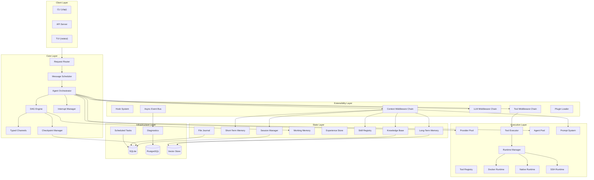
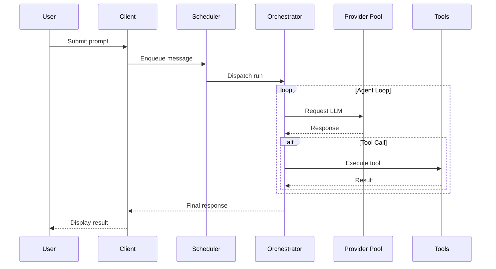
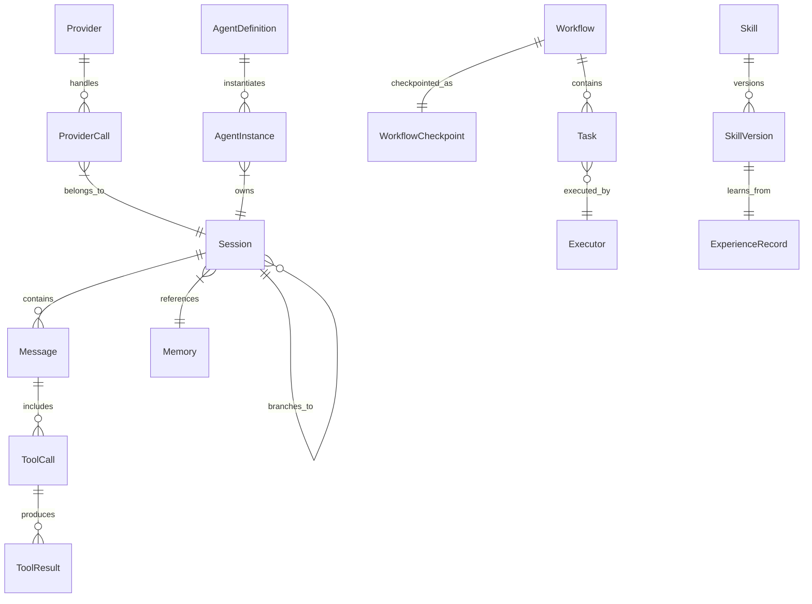

# y-agent Design Overview

> Yet Another Agent - A modular, observable, and recoverable AI Agent framework

**Version**: v0.18
**Last Updated**: 2026-03-09
**Status**: Active Development

---

## TL;DR

y-agent is a Rust-based AI Agent framework designed for high performance, extensibility, and full observability. The system is built on Tokio async runtime with SQLite (operational state) + PostgreSQL (diagnostics/analytics) dual-database architecture, dual-protocol memory (gRPC + MCP), and Docker-based runtime isolation. Agents orchestrate tasks through a DAG engine with typed channels, define workflows in TOML or expression DSL, and evolve autonomously through five subsystems (self-orchestration, dynamic tools, parameterized scheduling, capability-gap resolution, dynamic agent lifecycle). The framework supports provider pooling with intelligent failover, hierarchical session management, lazy-loaded skills and tools, and complete state recoverability via WAL-based persistence and task-level checkpointing.

---

## Background and Goals

### Why Another Agent Framework?

Existing agent frameworks (LangChain, AutoGPT) lack critical capabilities for production-grade personal research:

- No provider-level pooling, failover, or freeze management
- Limited session tree structures for complex multi-turn conversations
- Poor observability and recoverability
- Attention dilution from eagerly-loaded tool definitions

### Design Goals


| Goal                 | Description                                            |
| -------------------- | ------------------------------------------------------ |
| **High Performance** | Rust implementation with async-first architecture      |
| **Extensibility**    | Modular design with MCP protocol support               |
| **Observability**    | Complete execution logging and state tracking          |
| **Recoverability**   | Point-in-time state restoration                        |
| **Flexibility**      | Multi-provider, multi-agent, skill-based orchestration |


### Success Criteria

- P95 latency under 100ms for tool dispatch (excluding LLM calls)
- Zero data loss on crash with WAL-based persistence
- Support for 10+ concurrent provider connections
- Session recovery within 5 seconds for typical conversation lengths

---

## Scope

### In Scope

- Provider pool management with intelligent routing
- Session tree and context management
- Agent orchestration and task scheduling
- Tool execution with runtime isolation
- Memory system (short-term and long-term)
- CLI and API client interfaces
- Diagnostics and observability

### Out of Scope

- Distributed multi-node deployment (future consideration)
- GUI client implementation (third-party extensible)
- Training or fine-tuning capabilities
- Real-time collaboration features

---

## High-Level Design

### Architecture Principles

| # | Principle | Application | Rationale |
|---|-----------|-------------|----------|
| P1 | **Layered isolation** | Six horizontal layers: Client, Core, Extensibility, Execution, State, Infrastructure | Each layer depends only on the layer below it; no upward or lateral coupling |
| P2 | **Trait-first abstractions** | Every cross-boundary contract is a Rust trait (`RuntimeAdapter`, `Tool`, `MemoryClient`, `CheckpointStorage`) | Enables backend substitution (SQLite to Postgres, Docker to K8s) without touching consumers |
| P3 | **Declarative over imperative** | Agent definitions (TOML), workflow definitions (TOML/Expression DSL), prompt templates (TOML), guardrail rules (TOML), skill manifests | Non-developer operators can customize behavior; hot-reloadable without rebuild |
| P4 | **Secure by default** | Docker sandbox for dynamic tools, capability-based permissions, image whitelist, taint tracking | Untrusted code never runs on the host; every execution path passes 7 security layers |
| P5 | **Token economy** | Lazy tool loading, structured prompt sections with token budgets, context compaction, indexed experience archival | Every design decision considers context window cost; measured in tokens saved vs baseline |
| P6 | **Checkpoint everywhere** | WAL-based SQLite, pending/committed write separation, session JSONL, file journal | Crash at any point leaves the system in a recoverable state within 5 seconds |
| P7 | **Agent autonomy** | Five self-management subsystems (workflows, tools, schedules, gaps, agents) | Agents evolve their own operational toolkit at runtime; human intervention is for approval, not for implementation |

### System Architecture



**Diagram Type Rationale**: Flowchart chosen to illustrate module boundaries, dependency directions, and storage ownership across six architectural layers.

**Legend**:

- **Client Layer**: User-facing entry points (CLI, API, TUI).
- **Core Layer**: Request routing, message scheduling, DAG-based orchestration engine with typed channels, checkpoint/recovery, and interrupt/resume protocol.
- **Extensibility Layer**: Hook system with three middleware chains (Context, Tool, LLM), async event bus, and plugin loading. All cross-cutting concerns (guardrails, gap detection, skill audit, file journaling) are implemented as middleware.
- **Execution Layer**: LLM provider pool with tag-based routing and failover, tool registry with lazy loading, three runtime backends (Docker/Native/SSH) behind the `RuntimeAdapter` trait, multi-agent pool, and structured prompt assembly.
- **State Layer**: Session tree with JSONL persistence, three-tier memory (STM/LTM/Working Memory), indexed experience store, skill registry with Git-like versioning, external knowledge base, and file journal for mutation tracking.
- **Infrastructure Layer**: Dual-database persistence (SQLite for operational state, PostgreSQL for diagnostics/analytics), pluggable vector store (Qdrant default) for semantic retrieval, scheduled task engine.

### Technology Stack

| Concern | Choice | Rationale | Reference |
|---------|--------|-----------|----------|
| **Language** | Rust | Performance-critical; memory safety without GC; async-first | - |
| **Async runtime** | Tokio | Industry-standard Rust async runtime; non-blocking I/O | [orchestrator-design.md](docs/design/orchestrator-design.md) |
| **Operational database** | SQLite (WAL mode) | Zero-dependency; sufficient for single-node; checkpoints, sessions, workflows, file journal, tool/agent/schedule stores | [orchestrator-design.md](docs/design/orchestrator-design.md), [context-session-design.md](docs/design/context-session-design.md) |
| **Analytics database** | PostgreSQL | Reuses existing infrastructure; GIN indexes for full-text search; JSONB for trace data | [diagnostics-observability-design.md](docs/design/diagnostics-observability-design.md) |
| **Vector store** | Qdrant (pluggable) | HNSW index, payload filtering, in-process for dev, remote for prod | [memory-architecture-design.md](docs/design/memory-architecture-design.md) |
| **Session persistence** | JSONL (messages) + SQLite (metadata) | Append-friendly for message logs; SQL for structural queries | [context-session-design.md](docs/design/context-session-design.md) |
| **Serialization** | serde + serde_json | Standard Rust serialization; JSON for all inter-module data exchange | - |
| **Schema validation** | JSON Schema (Draft 7, `jsonschema` crate) | Standard for LLM function calling and MCP; compiled validators cached | [tools-design.md](docs/design/tools-design.md) |
| **Configuration format** | TOML | Agent definitions, provider configs, prompt templates, guardrail rules, image whitelist, skill manifests | [multi-agent-design.md](docs/design/multi-agent-design.md), [prompt-design.md](docs/design/prompt-design.md) |
| **Workflow definition** | TOML (complex) + Expression DSL (simple) | TOML for full pipelines with conditions/loops; DSL for 1-line flows (`search >> analyze >> summarize`) | [orchestrator-design.md](docs/design/orchestrator-design.md) |
| **Parameter schemas** | JSON Schema (via `ParameterSchema`) | Workflow templates, schedule bindings, tool parameters all use JSON Schema for validation | [agent-autonomy-design.md](docs/design/agent-autonomy-design.md) |
| **HTTP client** | reqwest | Persistent connection pool per provider; async | [providers-design.md](docs/design/providers-design.md) |
| **gRPC framework** | tonic | High-performance IPC for Memory Service | [memory-architecture-design.md](docs/design/memory-architecture-design.md) |
| **API framework** | axum | Memory Gateway HTTP/REST endpoints | [memory-architecture-design.md](docs/design/memory-architecture-design.md) |
| **Container runtime** | Docker (OCI) | Primary sandbox for tool execution and dynamic tools; bubblewrap fallback for native | [runtime-design.md](docs/design/runtime-design.md) |
| **TUI framework** | ratatui | Immediate-mode rendering; Tokio integration | [client-layer-design.md](docs/design/client-layer-design.md) |
| **Tracing** | `tracing` crate (span-based) | Lightweight, per-task spans; integrates with all middleware chains | [diagnostics-observability-design.md](docs/design/diagnostics-observability-design.md) |
| **External protocol** | MCP (Model Context Protocol) | Third-party tool and memory integration; emerging standard | [tools-design.md](docs/design/tools-design.md), [memory-architecture-design.md](docs/design/memory-architecture-design.md) |
| **Skill format** | Tree-indexed proprietary format (TOML manifest + sub-documents) | Compact root documents (< 2,000 tokens); LLM-transformed from any input format | [skills-knowledge-design.md](docs/design/skills-knowledge-design.md) |
| **Skill version control** | Content-addressable store with reflog (JSONL) | Git-like deduplication; trivial rollback | [skill-versioning-evolution-design.md](docs/design/skill-versioning-evolution-design.md) |

### Data Topology

Each persistent store has a single owner and a well-defined data lifecycle:

| Store | Backend | Owner Module | Data Lifecycle | Contents |
|-------|---------|-------------|---------------|----------|
| **Checkpoint Store** | SQLite (WAL) | Orchestrator | Per-workflow; retained for recovery window | Committed/pending channel state, task outputs, interrupt metadata |
| **Session Store** | JSONL + SQLite | Session Manager | Per-session; branching via session tree | Message transcripts (JSONL), session tree metadata (SQLite) |
| **WorkflowStore** | SQLite | Orchestrator | Created by agent or user; versioned | Workflow templates, ParameterSchema, tags |
| **DynamicToolStore** | SQLite | Tool Registry | Created at runtime; persists across restarts | Dynamic tool manifests and implementations |
| **DynamicAgentStore** | SQLite | Agent Registry | Created at runtime; soft-deletion | Dynamic agent definitions, trust tier, permission snapshots |
| **Schedule Store** | SQLite | Scheduled Tasks | User or agent created; cron/interval lifecycle | Schedule definitions, parameter bindings, execution history |
| **File Journal** | SQLite (co-located with Checkpoint) | File Journal Middleware | Scope-based; cleaned on scope completion | Pre-mutation file snapshots (inline/blob/git-ref) |
| **Skill Store** | Content-addressable files + JSONL reflog | Skill Registry | Content-addressed; reflog for rollback | Skill versions, manifest, sub-documents |
| **Long-Term Memory** | Vector Store (Qdrant) + SQLite | Memory Service | Persistent; importance-weighted decay | Personal, Task, Tool, Experience memories |
| **Knowledge Base** | Vector Store (Qdrant) | Knowledge Base | Domain-classified; freshness-managed | External documents, articles, API references |
| **Experience Store** | In-memory (session-scoped) | STM | Session lifetime; stable indices for dereference | Compressed experience records, token estimates |
| **Diagnostics Store** | PostgreSQL | Diagnostics | TTL-based retention; materialized path for tree queries | Traces, spans, metrics, cost records, evaluations |
| **Prompt Store** | TOML files (SectionStore) | Prompt System | Static; hot-reloadable | PromptSection definitions, PromptTemplate compositions |

### Inter-Module Interaction Map

The following table documents the primary interaction patterns between major modules. Each row represents a caller; each column represents a callee. The cell describes the integration mechanism.

| Caller | Orchestrator | Tool Registry | Memory | Session | Runtime | Hooks/Middleware |
|--------|-------------|---------------|--------|---------|---------|------------------|
| **Orchestrator** | -- | `execute_tool()` via ToolExecutor | `recall()` / `remember()` via CtxMiddleware | `get_context()` / `append()` | (indirect, via Tools) | Drives all 3 middleware chains |
| **Tool Registry** | `register_template()` for workflow tools | -- | `compress_experience()` / `read_experience()` for context memory tools | (none) | `execute()` via RuntimeAdapter | `ToolMiddleware` chain wraps every execution |
| **Agent Pool** | `execute()` for delegation | `tool_search()` / `tool_create()` | Context injection via middleware | Session fork for sub-agent | (indirect, via Tools) | CtxMiddleware for context assembly |
| **Scheduled Tasks** | `execute(template, params)` | (none) | (none) | Creates new session per trigger | (none) | (none) |
| **Diagnostics** | Subscribes to WorkflowEvents | Subscribes to ToolEvents | (none) | (none) | Subscribes to RuntimeEvents | Subscribes via EventBus |

### Component Overview


| Component                    | Responsibility                                                                                                                                                               | Design Doc                                                                               |
| ---------------------------- | ---------------------------------------------------------------------------------------------------------------------------------------------------------------------------- | ---------------------------------------------------------------------------------------- |
| Provider Pool                | LLM provider management, tag-based routing, intelligent freeze/failover, connection pooling via `reqwest::Client`                                                           | [providers-design.md](docs/design/providers-design.md)                                   |
| Agent Orchestrator           | DAG-based task scheduling, typed state channels with reducers, dual execution model (eager/superstep), task-level checkpointing (SQLite WAL), interrupt/resume protocol, WorkflowStore | [orchestrator-design.md](docs/design/orchestrator-design.md)                             |
| Session Manager              | Session tree (SQLite metadata + JSONL transcripts), context assembly via ContextMiddleware chain, compaction, context status injection, soft/hybrid trigger modes            | [context-session-design.md](docs/design/context-session-design.md)                       |
| User Input Enrichment        | Pre-loop input analysis via TaskIntentAnalyzer sub-agent, interactive clarification (ChoiceList/Confirmation/ParameterRequest via interrupt/resume), input replacement semantics, EnrichmentMiddleware at priority 50, heuristic pre-filter, 4 policy modes (always/auto/never/first_only) | [input-enrichment-design.md](docs/design/input-enrichment-design.md)                     |
| Memory System                | Three-tier memory: LTM (Qdrant vector store, two-phase dedup, intent-aware TypedQuery recall, Search Orchestrator with multi-strategy fallback), STM (session-scoped with Experience Store), Working Memory (pipeline-scoped blackboard); dual-protocol access (gRPC + MCP); read barrier for write-then-read consistency | [memory-architecture-design.md](docs/design/memory-architecture-design.md)                             |
| Tool Registry                | 4 tool types (built-in, MCP, custom, dynamic); lazy loading via ToolIndex + tool_search; JSON Schema validation (Draft 7, compiled cache); dynamic tool creation via tool_create with mandatory sandbox | [tools-design.md](docs/design/tools-design.md)                                           |
| Runtime                      | Isolated execution via `RuntimeAdapter` trait; DockerRuntime (container), NativeRuntime (bubblewrap), SshRuntime (remote); 7-layer security defense; capability-based permissions; image whitelist | [runtime-design.md](docs/design/runtime-design.md)                                       |
| Client Layer                 | CLI (clap), API Server, TUI (ratatui); 5 stream modes (None/Values/Updates/Messages/Debug)                                                                                  | [client-layer-design.md](docs/design/client-layer-design.md)                             |
| Message Scheduler            | Per-session lane serialization (prevents JSONL corruption), cross-session parallelism, 4 queue modes                                                                        | [message-scheduling-design.md](docs/design/message-scheduling-design.md)                 |
| Diagnostics                  | PostgreSQL-backed trace store, span-based tracing, cost intelligence, semantic trace search, trace replay                                                                    | [diagnostics-observability-design.md](docs/design/diagnostics-observability-design.md)       |
| Hook/Middleware/Plugin       | 3 middleware chains (Context, Tool, LLM), 24 lifecycle hooks, async event bus (Tokio bounded channels), WASM/dylib plugin loading                                           | [hooks-plugin-design.md](docs/design/hooks-plugin-design.md)                             |
| Skills and Knowledge         | Multi-format ingestion pipeline, LLM-assisted transformation, tree-indexed proprietary format (< 2,000 token roots), atomic skill registry                                  | [skills-knowledge-design.md](docs/design/skills-knowledge-design.md)                     |
| Skill Versioning and Evolution | Content-addressable store with JSONL reflog, experience capture with evidence provenance, pattern extraction, self-improvement pipeline with HITL approval gate             | [skill-versioning-evolution-design.md](docs/design/skill-versioning-evolution-design.md) |
| Multi-Agent Collaboration    | TOML-based AgentDefinition, 4 modes (build/plan/explore/general), 4 collaboration patterns, DelegationProtocol, AgentPool, 2 built-in agents (tool-engineer, agent-architect) | [multi-agent-design.md](docs/design/multi-agent-design.md)                               |
| Guardrails and HITL Safety   | TOML-configured guardrails, LoopGuard (4 pattern types including redundant tool call detection), taint tracking, unified permission model (allow/notify/ask/deny), risk scoring, structured HITL escalation | [guardrails-hitl-design.md](docs/design/guardrails-hitl-design.md)                       |
| Micro-Agent Pipeline         | Stateless step execution, Working Memory blackboard with 4 cognitive categories, atomic file operations, adaptive step merging                                               | [micro-agent-pipeline-design.md](docs/design/micro-agent-pipeline-design.md)             |
| Knowledge Base               | External knowledge ingestion (PDF, web, API), domain-classified Qdrant indexing, hybrid retrieval (semantic + keyword), L0/L1/L2 multi-resolution progressive loading, InjectKnowledge ContextMiddleware at priority 350   | [knowledge-base-design.md](docs/design/knowledge-base-design.md)                         |
| File Journal                 | FileJournalMiddleware (ToolMiddleware pre), three-tier storage (inline SQLite BLOB < 256KB, external blob 256KB-10MB, git-ref for tracked files), scope-based rollback, Orchestrator CompensationTask integration | [file-journal-design.md](docs/design/file-journal-design.md)                             |
| Prompt System                | PromptSection units with lazy loading and conditions, PromptTemplate with mode overlays and template inheritance, per-section token budgets, TOML-based SectionStore; drives BuildSystemPrompt ContextMiddleware at priority 100 | [prompt-design.md](docs/design/prompt-design.md)                                         |
| Agent Autonomy               | 5 subsystems: self-orchestration (WorkflowStore + workflow meta-tools), dynamic tool lifecycle (tool_create, sandbox validation), parameterized scheduling (JSON Schema ParameterSchema), capability-gap resolution (CapabilityGapMiddleware, tool-engineer, agent-architect), dynamic agent lifecycle (agent_create/update/deactivate/search, permission inheritance, three-tier trust hierarchy) | [agent-autonomy-design.md](docs/design/agent-autonomy-design.md)                         |


---

## Key Flows

### Primary Request Flow




**Diagram Type Rationale**: Sequence diagram chosen to show temporal interactions between components during request processing.

**Legend**:

- Solid arrows: Synchronous calls
- Dashed arrows: Responses
- Loop: Iterative agent execution until task completion

### Detailed Flow Documentation

- Provider selection and failover: [providers-design.md#core-flow](docs/design/providers-design.md#10-核心流程)
- Message scheduling modes: [message-scheduling-design.md](docs/design/message-scheduling-design.md)
- Tool execution pipeline: [runtime-tools-integration-design.md](docs/design/runtime-tools-integration-design.md)

---

## Data and State Model

### Core Entities



**Diagram Type Rationale**: ER diagram chosen to show data relationships between core entities across orchestration, multi-agent, and skill evolution domains.

**Legend**:

- **Session / Message**: Conversation context with tree structure; messages include tool calls and results.
- **Provider / ProviderCall**: LLM provider pool with per-call tracking.
- **Workflow / Task / Checkpoint**: DAG-based orchestration with task-level checkpointing.
- **AgentDefinition / AgentInstance**: Declarative agent definitions (TOML or dynamic) instantiated into session-bound agents.
- **Skill / SkillVersion / ExperienceRecord**: Git-like skill versioning with experience-driven evolution.

### Detailed Data Models

- Session and message structures: [context-session-design.md](docs/design/context-session-design.md)
- Memory data model: [memory-architecture-design.md](docs/design/memory-architecture-design.md)
- Provider configuration: [providers-design.md#configuration](docs/design/providers-design.md#8-配置设计)

---

## Failure Handling and Edge Cases


| Scenario                     | Handling Strategy                                   | Reference                                                                |
| ---------------------------- | --------------------------------------------------- | ------------------------------------------------------------------------ |
| Provider rate limit          | Intelligent freeze with configurable duration       | [providers-design.md#freeze](docs/design/providers-design.md#4-冻结机制)     |
| Provider auth failure        | Permanent freeze until manual intervention          | [providers-design.md#freeze](docs/design/providers-design.md#4-冻结机制)     |
| Tool execution timeout       | Configurable timeout with graceful termination      | [tools-design.md](docs/design/tools-design.md)                           |
| File mutation rollback       | FileJournalMiddleware captures pre-state; automatic restore on failure | [file-journal-design.md](docs/design/file-journal-design.md)             |
| Context window overflow      | Automatic compaction via CompactionMiddleware chain | [context-session-design.md](docs/design/context-session-design.md)       |
| Concurrent message collision | Queue mode-based resolution                         | [message-scheduling-design.md](docs/design/message-scheduling-design.md) |


---

## Security and Permissions


| Concern                  | Approach                                                        | Reference                                                          |
| ------------------------ | --------------------------------------------------------------- | ------------------------------------------------------------------ |
| Tool execution isolation | Container-based runtime with capability model                   | [runtime-design.md](docs/design/runtime-design.md)                 |
| File system access       | Whitelist-based path restrictions                               | [runtime-design.md](docs/design/runtime-design.md)                 |
| Network access           | Configurable network policies per tool                          | [tools-design.md](docs/design/tools-design.md)                     |
| Credential management    | Environment variable injection, no plaintext storage            | [providers-design.md](docs/design/providers-design.md)             |
| Application-level safety | Guardrails, LoopGuard, taint tracking, unified permission model | [guardrails-hitl-design.md](docs/design/guardrails-hitl-design.md) |
| Human escalation         | Structured HITL via Orchestrator interrupt/resume               | [guardrails-hitl-design.md](docs/design/guardrails-hitl-design.md) |


---

## Performance and Scalability

### Design Decisions

- **Async-first**: Tokio runtime for non-blocking I/O
- **Connection pooling**: Reusable HTTP connections per provider
- **Atomic skills**: Tree-indexed skills with compact root documents (< 2,000 tokens) to minimize attention dilution
- **Micro-Agent Pipeline**: Stateless step execution with Working Memory reduces per-step token consumption by ~70% compared to monolithic file operations
- **Indexed Experience Memory**: Agent-controlled archival keeps working context bounded while preserving full-fidelity evidence for later dereference (Memex-inspired)
- **Tool Lazy Loading**: Only ToolIndex (tool names) + tool_search meta-tool injected at session start (~300-500 tokens); full definitions loaded on demand, reducing tool schema tokens by 60-90%
- **Incremental persistence**: WAL-based writes for durability without blocking

### Bottlenecks and Mitigations


| Bottleneck            | Mitigation                                 |
| --------------------- | ------------------------------------------ |
| LLM API latency       | Provider pool with parallel fallback       |
| Context serialization | Streaming compression, incremental updates |
| Tool execution        | Concurrent execution with resource limits  |


---

## Observability


| Capability         | Implementation                                       | Reference                                                                          |
| ------------------ | ---------------------------------------------------- | ---------------------------------------------------------------------------------- |
| Execution tracing  | Lightweight span-based tracing with trace replay     | [diagnostics-observability-design.md](docs/design/diagnostics-observability-design.md) |
| Metrics collection | Token usage, latency, error rates, cost intelligence | [diagnostics-observability-design.md](docs/design/diagnostics-observability-design.md) |
| Health checks      | Provider, storage, and runtime health probes         | [diagnostics-observability-design.md](docs/design/diagnostics-observability-design.md) |
| State inspection   | Runtime queryable state APIs, semantic trace search  | [diagnostics-observability-design.md](docs/design/diagnostics-observability-design.md) |


---

## Rollout and Rollback

### Implementation Phases


| Phase | Focus                                                                   | Duration  |
| ----- | ----------------------------------------------------------------------- | --------- |
| 1     | Core infrastructure: Provider Pool, Session Manager, basic Orchestrator | 4-6 weeks |
| 2     | Feature completion: Memory, Tools, MCP, Skills, Hooks                   | 4-6 weeks |
| 3     | Advanced features: RAG, Compaction, Recovery, Runtime isolation         | 4-6 weeks |
| 4     | Polish: Documentation, testing, performance optimization                | 2-4 weeks |


### Rollback Strategy

- All state changes are logged with full reversibility
- File modifications tracked by File Journal with automatic rollback on workflow failure ([file-journal-design.md](docs/design/file-journal-design.md))
- Session state recoverable to any checkpoint

---

## Alternatives and Trade-offs


| Decision | Chosen | Alternative | Rationale | Reference |
|----------|--------|-------------|-----------|-----------|
| Language | Rust | Python, TypeScript | Performance critical; memory safety without GC; async-first via Tokio | - |
| Operational database | SQLite (WAL) | PostgreSQL, Redis | Zero-dependency for single-node; WAL for crash recovery; sufficient for all operational stores (checkpoints, sessions, workflows, journals, schedules) | [orchestrator-design.md](docs/design/orchestrator-design.md) |
| Analytics database | PostgreSQL | SQLite, ClickHouse | Reuses existing infrastructure; GIN for full-text search; JSONB for trace data; ClickHouse overkill for personal research | [diagnostics-observability-design.md](docs/design/diagnostics-observability-design.md) |
| Vector store | Qdrant (pluggable) | FAISS, Chroma, Milvus | HNSW with payload filtering; in-process for dev, remote for prod; FAISS lacks metadata filtering; pluggable via trait | [memory-architecture-design.md](docs/design/memory-architecture-design.md) |
| Schema validation | JSON Schema Draft 7 | Custom Rust DSL, Pydantic | Standard for LLM function calling and MCP; compiled validators cached; no format conversion needed | [tools-design.md](docs/design/tools-design.md) |
| Configuration format | TOML | YAML, JSON | Human-readable; typed; well-supported in Rust ecosystem; consistent across agents, providers, prompts, guardrails | - |
| Workflow definition | TOML + Expression DSL | Python DSL, YAML-only | TOML for complex flows; Expression DSL (`>>` and `|` operators) for rapid prototyping; compiles to same internal DAG | [orchestrator-design.md](docs/design/orchestrator-design.md) |
| Memory IPC protocol | gRPC + MCP dual | REST-only, gRPC-only | gRPC (tonic) for high-performance internal IPC; MCP for third-party integration; REST adds no value over gRPC | [memory-architecture-design.md](docs/design/memory-architecture-design.md) |
| Container runtime | Docker (OCI) | Firecracker, WASM | Ubiquitous ecosystem; mature tooling; sufficient isolation; Firecracker requires KVM; WASM limited system access | [runtime-design.md](docs/design/runtime-design.md) |
| Native sandbox | bubblewrap | firejail, none | Fine-grained namespace isolation per-path mount control; fallback to firejail; no sandbox only in dev mode | [runtime-design.md](docs/design/runtime-design.md) |
| Provider abstraction | Tag-based routing | Model-specific clients | Flexibility for heterogeneous provider landscape; single interface for all providers | [providers-design.md](docs/design/providers-design.md) |
| Memory architecture | Three-tier (STM + LTM + WM) | Single unified store | Clear separation: STM (session), LTM (persistent), WM (pipeline); different access patterns and lifecycles | [memory-architecture-design.md](docs/design/memory-architecture-design.md) |
| Session persistence | JSONL + SQLite hybrid | SQLite-only, file-per-session | JSONL append-friendly for message logs; SQLite for structural queries on session tree | [context-session-design.md](docs/design/context-session-design.md) |
| Prompt templates | Declarative TOML | Procedural Rust code | Non-developer operators can customize; hot-reloadable; schema-validated | [prompt-design.md](docs/design/prompt-design.md) |
| Skill version control | Content-addressable store + JSONL reflog | Git submodules, database-only | Git-like deduplication; trivial rollback via reflog; no external git dependency | [skill-versioning-evolution-design.md](docs/design/skill-versioning-evolution-design.md) |
| Dynamic agent deletion | Soft-delete (deactivate) | Hard-delete | Preserves audit trail and experience records; supports reactivation | [agent-autonomy-design.md](docs/design/agent-autonomy-design.md) |
| Capability-gap middleware | Unified CapabilityGapMiddleware | Separate ToolGap + AgentGap | Single middleware for both tool and agent gaps; consistent detection and resolution protocol | [agent-autonomy-design.md](docs/design/agent-autonomy-design.md) |


---

## Open Questions


| Question                                      | Owner | Due Date | Status   |
| --------------------------------------------- | ----- | -------- | -------- |
| RAG backend selection (Qdrant vs Milvus)      | TBD   | Phase 3  | Resolved (Qdrant chosen; pluggable via trait) |
| MCP server discovery mechanism                | TBD   | Phase 2  | Open     |
| Multi-user session isolation model            | TBD   | Future   | Deferred |
| Channel reducer vs simple HashMap for context | TBD   | Phase 2  | Open     |
| Superstep execution mode necessity            | TBD   | Phase 2  | Open     |


---

## Decision Logk


| Date       | Decision                                                    | Context                                                                                                                                                                                                               | Outcome  |
| ---------- | ----------------------------------------------------------- | --------------------------------------------------------------------------------------------------------------------------------------------------------------------------------------------------------------------- | -------- |
| 2026-03-04 | Rust as implementation language                             | Performance and safety requirements                                                                                                                                                                                   | Accepted |
| 2026-03-04 | Provider pool with tag-based routing                        | Need for flexible provider selection                                                                                                                                                                                  | Accepted |
| 2026-03-04 | Session tree structure                                      | Support for branching conversations                                                                                                                                                                                   | Accepted |
| 2026-03-05 | Capability-based runtime permissions                        | Security model alignment with OpenFang                                                                                                                                                                                | Accepted |
| 2026-03-05 | gRPC + MCP dual protocol for memory service                 | Performance + interoperability                                                                                                                                                                                        | Accepted |
| 2026-03-06 | Typed channels with reducers                                | LangGraph pattern for concurrent state updates                                                                                                                                                                        | Proposed |
| 2026-03-06 | Task-level checkpointing                                    | Fine-grained recovery without re-executing successful tasks                                                                                                                                                           | Proposed |
| 2026-03-06 | Scheduled tasks module                                      | Autonomous agent operations requirement                                                                                                                                                                               | Proposed |
| 2026-03-06 | Hook/Middleware/Plugin system (y-hooks)                     | Extensibility backbone; 5 of 8 competitors implement hooks                                                                                                                                                            | Accepted |
| 2026-03-06 | Skills & Knowledge management (y-skills)                    | Core to self-evolution vision; ingestion-transform-register pipeline replaces direct install                                                                                                                          | Accepted |
| 2026-03-06 | Multi-Agent collaboration framework                         | Orchestrator SubAgent insufficient; CrewAI, DeerFlow, OpenCode patterns                                                                                                                                               | Accepted |
| 2026-03-06 | Guardrails & HITL safety framework                          | Runtime isolation insufficient for application-level safety; OpenFang, CrewAI patterns                                                                                                                                | Accepted |
| 2026-03-06 | Micro-Agent Pipeline with Working Memory                    | Stateless step execution eliminates token accumulation; enables weaker LLMs for complex file operations                                                                                                               | Accepted |
| 2026-03-06 | Atomic File Operations                                      | Line-level tools replace whole-file read/write; reduces token waste by ~70% for typical edits                                                                                                                         | Accepted |
| 2026-03-06 | Working Memory as third memory tier                         | Pipeline-scoped structured blackboard; cognitive categories (Perception, Structure, Analysis, Action)                                                                                                                 | Accepted |
| 2026-03-06 | Git-like skill version control                              | Content-addressable storage with reflog enables trivial rollback and deduplication                                                                                                                                    | Accepted |
| 2026-03-06 | Self-evolution pipeline with human-in-the-loop              | Experience capture, pattern extraction, skill refinement with approval gate; avoids Hermes's model-dependent evolution                                                                                                | Accepted |
| 2026-03-06 | Indexed Experience Memory (Memex-inspired)                  | Agent-controlled archival via compress_experience / read_experience tools; Experience Store as STM enhancement; context status soft triggering; inspired by Memex(RL)                                                 | Accepted |
| 2026-03-06 | Context Window Guard trigger modes (auto/soft/hybrid)       | Soft mode exposes context status to agent, making compression timing a learnable skill; hybrid recommended when memory tools are enabled                                                                              | Accepted |
| 2026-03-06 | Redundant tool call detection in LoopGuard                  | Detects re-execution of identical tool calls without state changes; suggests read_experience retrieval; complements indexed experience memory                                                                         | Accepted |
| 2026-03-06 | Knowledge Base as separate store with shared infrastructure | External knowledge (PDFs, articles, APIs) needs distinct ingestion, domain-classified indexing, and freshness management; separate from LTM conversation-extracted experience but sharing vector store infrastructure | Accepted |
| 2026-03-06 | Agent-driven knowledge ingestion                            | Reuses agent orchestration, LLM access, guardrails, and observability; no separate ingestion daemon                                                                                                                   | Accepted |
| 2026-03-06 | InjectKnowledge ContextMiddleware at priority 350           | Domain-triggered automatic knowledge injection between memory recall and skill injection; dedicated token budget category                                                                                             | Accepted |
| 2026-03-06 | File Journal as ToolMiddleware                              | Automatic file-level change tracking and rollback; ToolMiddleware (not tool-internal) for zero tool code changes; inspired by AgentFS OverlayFS but implemented as lightweight middleware                             | Accepted |
| 2026-03-06 | Three-tier journal storage (inline/blob/git-ref)            | Inline for small files, blob for large, git-ref for tracked files in git workspaces; balances storage efficiency and platform support                                                                                 | Accepted |
| 2026-03-06 | Fail-open capture, fail-safe rollback                       | Journal failures never block tool execution; rollback conflicts never silently overwrite user changes                                                                                                                 | Accepted |
| 2026-03-06 | Tool Lazy Loading via tool_search meta-tool                 | Eagerly injecting all tool definitions wastes 8K-25K tokens and dilutes attention; lazy loading with ToolIndex + tool_search + ToolActivationSet reduces initial tool token cost by 60-90%                            | Accepted |
| 2026-03-06 | Agent Autonomy system                                       | Agents need to create workflows, tools, schedules, and agent definitions at runtime to handle novel tasks; five subsystems (self-orchestration, dynamic tools, parameterized scheduling, capability-gap resolution, dynamic agent lifecycle)                       | Accepted |
| 2026-03-06 | Dynamic tools always sandbox in Runtime                     | Agent-generated code is untrusted by nature; mandatory sandbox eliminates host-process security risks                                                                                                                  | Accepted |
| 2026-03-06 | ToolGapMiddleware for capability-gap detection               | Structural checks (NotFound, ParameterMismatch) are fast and deterministic; LLM-assisted analysis for HardcodedConstraint; spawns tool-engineer sub-agent for resolution                                              | Accepted |
| 2026-03-08 | LTM two-phase deduplication (hash + LLM 4-action)            | Content-hash fast path catches exact duplicates at zero cost; LLM 4-action model (create/merge/skip/delete) handles semantic overlaps precisely. Combined approach is both cheap and accurate. Inspired by Claude-Mem (hash) and OpenViking (LLM-judged dedup). | Accepted |
| 2026-03-08 | Intent-aware recall via TypedQuery decomposition             | Compound queries decomposed into typed sub-queries improve recall precision for multi-intent requests. Optional and LLM-based; simple queries pass through unmodified. Inspired by OpenViking IntentAnalyzer. | Accepted |
| 2026-03-08 | LTM Search Orchestrator with multi-strategy fallback         | Automatic degradation (Vector -> Hybrid -> Keyword) ensures retrieval availability when subsystems degrade. Emits degradation metrics. Inspired by Claude-Mem SearchOrchestrator. | Accepted |
| 2026-03-08 | Knowledge Base L0/L1/L2 multi-resolution progressive loading | Three resolution levels reduce token waste by ~90% for auto-injection. L0 (~100 tokens) returned by default; L1/L2 loaded on demand. Directly supports token economy principle (P5). Inspired by OpenViking L0/L1/L2. | Accepted |
| 2026-03-08 | Structured observation schema for LTM extraction             | Typed schema (title/facts/narrative/concepts/files) provides richer indexing surfaces and enables per-fact contradiction detection. Inspired by Claude-Mem observation structure. | Accepted |
| 2026-03-07 | Structured Prompt System with lazy loading                   | Monolithic prompt assembly wastes tokens and dilutes attention; structured sections with conditions and token budgets keep system prompts lean; mode overlays avoid content duplication across agent modes              | Accepted |
| 2026-03-09 | User Input Enrichment with pre-loop replacement semantics    | User inputs are often ambiguous or incomplete; pre-loop enrichment via TaskIntentAnalyzer + interactive clarification resolves ambiguity before context assembly; replacement (not augmentation) avoids wasting tokens on dual versions of the same input. EnrichInput ContextMiddleware at priority 50. | Accepted |


---

## Cross-Cutting Design Alignment

The following table documents key integration decisions that span multiple design documents. When documents disagree, this table reflects the authoritative resolution.


| Topic                                         | Resolution                                                                                                                                                                                                                                                                                    | Authoritative Doc                                                                                                                                                              | Superseded By                                                                                                     |
| --------------------------------------------- | --------------------------------------------------------------------------------------------------------------------------------------------------------------------------------------------------------------------------------------------------------------------------------------------- | ------------------------------------------------------------------------------------------------------------------------------------------------------------------------------ | ----------------------------------------------------------------------------------------------------------------- |
| **Tool permission model**                     | Unified Permission Model (allow/notify/ask/deny) with risk scoring                                                                                                                                                                                                                            | [guardrails-hitl-design.md](docs/design/guardrails-hitl-design.md)                                                                                                             | tools-design.md's standalone Dangerous Tool Handling (now an input signal to guardrails, not a standalone system) |
| **Skill-tool bundling**                       | Skills are LLM-instruction-only; embedded tools extracted and registered separately in Tool Registry                                                                                                                                                                                          | [skills-knowledge-design.md](docs/design/skills-knowledge-design.md)                                                                                                           | tools-design.md's Skill-bundled tool type (removed in v0.3)                                                       |
| **Memory tiers**                              | Three tiers: Long-Term (persistent), Short-Term (session), Working Memory (pipeline-scoped)                                                                                                                                                                                                   | [memory-architecture-design.md](docs/design/memory-architecture-design.md) + [micro-agent-pipeline-design.md](docs/design/micro-agent-pipeline-design.md)                                    | memory-architecture-design.md v0.2's two-tier model                                                                      |
| **Collaboration patterns**                    | Four patterns: Sequential, Hierarchical, Peer-to-Peer, Micro-Agent Pipeline                                                                                                                                                                                                                   | [multi-agent-design.md](docs/design/multi-agent-design.md)                                                                                                                     | multi-agent-design.md v0.1's three-pattern model                                                                  |
| **Context assembly**                          | ContextMiddleware chain in y-hooks; no standalone hook system                                                                                                                                                                                                                                 | [context-session-design.md](docs/design/context-session-design.md) + [hooks-plugin-design.md](docs/design/hooks-plugin-design.md)                                              | context-session-design.md v0.1's independent HookRegistry                                                         |
| **Guardrails integration**                    | Guardrails implemented as ToolMiddleware and LlmMiddleware in y-hooks chains                                                                                                                                                                                                                  | [guardrails-hitl-design.md](docs/design/guardrails-hitl-design.md) + [hooks-plugin-design.md](docs/design/hooks-plugin-design.md)                                              | N/A (new)                                                                                                         |
| **Experience storage**                        | Experience memory type added to Memory System for self-evolution pipeline                                                                                                                                                                                                                     | [memory-architecture-design.md](docs/design/memory-architecture-design.md) + [skill-versioning-evolution-design.md](docs/design/skill-versioning-evolution-design.md)                        | N/A (new)                                                                                                         |
| **Diagnostics**                               | diagnostics-observability-design.md is the authoritative diagnostics design                                                                                                                                                                                                                     | [diagnostics-observability-design.md](docs/design/diagnostics-observability-design.md)                                                                                             | diagnostics-design.md (never created as separate doc)                                                             |
| **Indexed experience memory**                 | Experience Store is a session-scoped STM enhancement (not a separate tier); agent controls archival via compress_experience / read_experience tools; Context Window Guard supports soft/hybrid trigger modes                                                                                  | [memory-short-term-design.md](docs/design/memory-short-term-design.md) + [tools-design.md](docs/design/tools-design.md) + [context-session-design.md](docs/design/context-session-design.md) | N/A (new; inspired by Memex(RL))                                                                                  |
| **Redundant tool call detection**             | LoopGuard detects redundant tool calls (same args, no state change) and suggests read_experience retrieval                                                                                                                                                                                    | [guardrails-hitl-design.md](docs/design/guardrails-hitl-design.md)                                                                                                             | N/A (new; complements indexed experience memory)                                                                  |
| **Knowledge Base vs LTM boundary**            | Knowledge Base stores externally sourced reference content (documents, articles, checklists) in a separate store with its own ingestion pipeline; LTM stores agent experience extracted from conversations. Both share Memory Service vector infrastructure.                                  | [knowledge-base-design.md](docs/design/knowledge-base-design.md) + [memory-architecture-design.md](docs/design/memory-architecture-design.md)                                                | N/A (new)                                                                                                         |
| **Knowledge Base vs Skills boundary**         | Skills provide LLM reasoning instructions (how to think); Knowledge Base provides factual reference content (what to know). Skills reference knowledge collections via manifest `knowledge_bases` field.                                                                                      | [knowledge-base-design.md](docs/design/knowledge-base-design.md) + [skills-knowledge-design.md](docs/design/skills-knowledge-design.md)                                        | N/A (new)                                                                                                         |
| **Knowledge context injection**               | InjectKnowledge ContextMiddleware at priority 350 (between InjectMemory at 300 and InjectSkills at 400); domain-triggered automatic injection with dedicated token budget category                                                                                                            | [knowledge-base-design.md](docs/design/knowledge-base-design.md) + [context-session-design.md](docs/design/context-session-design.md)                                          | N/A (new)                                                                                                         |
| **Evidence provenance in experience records** | Experience Records carry provenance-tagged evidence entries (user_stated, user_correction, task_outcome, agent_observation). agent_observation requires user evidence corroboration -- hard rule in Pattern Extraction LLM prompt, not a soft weight. Prevents agent self-reinforcement bias. | [skill-versioning-evolution-design.md](docs/design/skill-versioning-evolution-design.md) + [memory-architecture-design.md](docs/design/memory-architecture-design.md)                        | N/A (new; AutoSkill-inspired)                                                                                     |
| **Skill Usage Audit**                         | SkillUsageAuditMiddleware (LlmMiddleware post) determines whether injected skills were actually used. Dual-channel: LLM audit primary, keyword overlap fallback. Metrics: injection_count, actual_usage_count, usage_rate. Low usage_rate triggers Obsolete Rule detection.                   | [skill-versioning-evolution-design.md](docs/design/skill-versioning-evolution-design.md) + [hooks-plugin-design.md](docs/design/hooks-plugin-design.md)                        | N/A (new; AutoSkill-inspired)                                                                                     |
| **Skillless Experience Analysis**             | Pattern Extraction includes a stage that processes experiences with skill_id=null; clusters successful unguided executions by task_description similarity; proposes new workflow skills when cluster size >= 3. Only path to create skills "from nothing."                                    | [skill-versioning-evolution-design.md](docs/design/skill-versioning-evolution-design.md)                                                                                       | N/A (new; AutoSkill-inspired)                                                                                     |
| **Dual-path skill evolution**                 | Batch extraction (default) + Fast-Path Extraction (opt-in, feature flag `evolution_fast_path`). Fast-path: real-time, auto-minor approval, restricted to phrasing_update/error_warning from user_stated/user_correction evidence only.                                                        | [skill-versioning-evolution-design.md](docs/design/skill-versioning-evolution-design.md)                                                                                       | skill-versioning-evolution-design.md v0.1's batch-only model                                                      |
| **File-level rollback mechanism**             | FileJournalMiddleware in ToolMiddleware chain captures file state before mutation; three-tier storage (inline/blob/git-ref); RollbackEngine restores files on failure. Integrates with Orchestrator CompensationTask as built-in FileRollback strategy.                                         | [file-journal-design.md](docs/design/file-journal-design.md) + [orchestrator-design.md](docs/design/orchestrator-design.md) + [hooks-plugin-design.md](docs/design/hooks-plugin-design.md) | N/A (new; inspired by AgentFS OverlayFS copy-on-write)                                                           |
| **Tool Lazy Loading**                         | InjectTools ContextMiddleware injects ToolIndex (name-only list) + tool_search meta-tool definition + ToolActivationSet members' full schemas. Agent uses tool_search to retrieve and activate tool definitions on demand. ToolActivationSet is session-scoped with LRU eviction (ceiling: 20). Feature flag `tool_lazy_loading` for rollback to eager mode. | [tools-design.md](docs/design/tools-design.md) + [context-session-design.md](docs/design/context-session-design.md) | tools-design.md's eager `to_llm_tools()` export (now fallback behind feature flag)                               |
| **Self-orchestration workflow persistence**   | Agents create and persist workflow templates via `workflow_create` meta-tool; templates stored in WorkflowStore (SQLite); carry optional ParameterSchema (JSON Schema) for parameterized reuse; bindable to schedules via `schedule_create`. | [agent-autonomy-design.md](docs/design/agent-autonomy-design.md) + [orchestrator-design.md](docs/design/orchestrator-design.md) | N/A (new) |
| **Dynamic tool lifecycle**                    | Agents create tools at runtime via `tool_create` meta-tool; dynamic tools always sandboxed in Runtime (hard invariant); three implementation types (Script, HttpApi, Composite); validated through schema check + safety screening + sandbox dry-run; persisted in DynamicToolStore. Fourth tool type alongside Built-in, MCP, Custom. | [agent-autonomy-design.md](docs/design/agent-autonomy-design.md) + [tools-design.md](docs/design/tools-design.md) | N/A (new) |
| **Parameterized scheduling**                  | Schedule templates support JSON Schema parameter definitions (`ParameterSchema`); parameters validated at schedule creation time; resolved at trigger time with expression engine (static values, trigger context, event payloads). Same workflow bindable to N schedules with different parameter values. | [agent-autonomy-design.md](docs/design/agent-autonomy-design.md) + [scheduled-tasks-design.md](docs/design/scheduled-tasks-design.md) | scheduled-tasks-design.md v0.1's static input_template model |
| **Capability-gap resolution**                 | ToolGapMiddleware in ToolMiddleware chain detects three gap types (NotFound, ParameterMismatch, HardcodedConstraint); spawns built-in `tool-engineer` sub-agent for auto-resolution; unresolvable gaps escalate to user via HITL interrupt. | [agent-autonomy-design.md](docs/design/agent-autonomy-design.md) + [hooks-plugin-design.md](docs/design/hooks-plugin-design.md) + [multi-agent-design.md](docs/design/multi-agent-design.md) | N/A (new) |
| **LTM two-phase deduplication**               | Content-hash fast path (SHA-256, zero LLM cost, 60s dedup window) catches exact duplicates at write time. LLM-judged 4-action model (create/merge/skip/delete) resolves semantic overlaps for candidates with cosine similarity > 0.9. Hash is phase 1 (always); LLM is phase 2 (only when hash passes). Fallback: if LLM unavailable, use cosine threshold heuristic. | [memory-long-term-design.md](docs/design/memory-long-term-design.md) | N/A (new; inspired by Claude-Mem content-hash + OpenViking LLM-judged dedup) |
| **Intent-aware recall (TypedQuery)**          | Optional Intent Analyzer decomposes compound recall queries into 0-5 typed sub-queries, each with context_type (Personal/Task/Tool/Experience/Any), intent (FactLookup/PatternRecall/ToolDiscovery/ExperienceReplay), and priority. Deep recall always uses it; other strategies opt-in via `intent_analysis = true`. Results from sub-queries are fused by the Reranker with priority-weighted scoring. | [memory-long-term-design.md](docs/design/memory-long-term-design.md) + [memory-architecture-design.md](docs/design/memory-architecture-design.md) | N/A (new; inspired by OpenViking IntentAnalyzer) |
| **LTM Search Orchestrator (multi-strategy fallback)** | Search Orchestrator wraps recall execution with strategy selection and automatic fallback: VectorFirst -> HybridFusion -> KeywordOnly. If vector store is unavailable, degrades to keyword search. If both paths fail, returns empty results with alert. Emits `ltm.recall.strategy_used` and `ltm.recall.fallback_triggered` metrics. | [memory-long-term-design.md](docs/design/memory-long-term-design.md) | N/A (new; inspired by Claude-Mem SearchOrchestrator) |
| **Knowledge Base L0/L1/L2 progressive loading** | Knowledge entries stored at three resolution levels: L0 abstract (~100 tokens), L1 overview (~500 tokens), L2 full content. Retrieval returns L0 by default; agents load L1/L2 on demand. InjectKnowledge middleware uses L0 default with auto-escalation to L1 if budget allows. knowledge_search and knowledge_lookup tools accept `resolution` parameter. Saves ~90% tokens for auto-injection. | [knowledge-base-design.md](docs/design/knowledge-base-design.md) | N/A (new; inspired by OpenViking L0/L1/L2 hierarchical context loading) |
| **Prompt assembly ownership**                 | Prompt composition (sections, templates, lazy loading, mode overlays) is owned by prompt-design.md and executed inside the `BuildSystemPrompt` ContextMiddleware (priority 100). Other pipeline stages (InjectBootstrap, InjectSkills, InjectTools) remain independent -- they do not modify the system prompt, they add separate context items. AgentDefinition references a PromptTemplate; agent modes drive mode overlays. | [prompt-design.md](docs/design/prompt-design.md) + [context-session-design.md](docs/design/context-session-design.md) + [multi-agent-design.md](docs/design/multi-agent-design.md) | N/A (new) |
| **User input enrichment**                     | EnrichInput ContextMiddleware (priority 50) runs before all other pipeline stages. TaskIntentAnalyzer sub-agent detects ambiguous/incomplete user input, triggers interactive clarification via Orchestrator interrupt/resume, and replaces original input with enriched version. Replacement (not augmentation) preserves context window tokens. Heuristic pre-filter avoids LLM calls for clear inputs. Four policy modes (always/auto/never/first_only) configurable per agent or session. | [input-enrichment-design.md](docs/design/input-enrichment-design.md) + [context-session-design.md](docs/design/context-session-design.md) + [orchestrator-design.md](docs/design/orchestrator-design.md) | N/A (new) |


---

## Module Structure

```
y-agent/
├── crates/
│   ├── y-core/           # Core abstractions, traits (RuntimeAdapter, Tool, MemoryClient, CheckpointStorage)
│   ├── y-provider/       # Provider Pool: tag-based routing, failover, connection pooling (reqwest)
│   ├── y-session/        # Session Manager: session tree (SQLite metadata + JSONL transcripts)
│   ├── y-agent/          # Agent Orchestrator: DAG engine, typed channels, checkpointing (SQLite WAL)
│   ├── y-context/        # Memory System: STM, LTM (Qdrant), Working Memory, Experience Store
│   ├── y-hooks/          # Hook system, 3 middleware chains, async event bus (Tokio channels), plugin loading
│   ├── y-tools/          # Tool Registry: 4 types, lazy loading, JSON Schema validation (jsonschema crate)
│   ├── y-mcp/            # MCP protocol support for third-party tools and memory
│   ├── y-skills/         # Skill ingestion, transformation, registry, versioning (content-addressable + reflog)
│   ├── y-prompt/         # Prompt System: PromptSection, PromptTemplate, SectionStore (TOML), mode overlays
│   ├── y-storage/        # Persistence layer: SQLite backends, JSONL writers, blob storage
│   ├── y-runtime/        # Runtime: DockerRuntime, NativeRuntime (bubblewrap), SshRuntime
│   ├── y-scheduler/      # Scheduled Tasks: cron/interval, ParameterSchema (JSON Schema)
│   ├── y-multi-agent/    # Multi-Agent: AgentDefinition (TOML), delegation, AgentPool, agent-architect
│   ├── y-guardrails/     # Guardrails, LoopGuard, taint tracking, risk scoring, HITL escalation
│   ├── y-knowledge/      # Knowledge Base: external ingestion (PDF/web/API), Qdrant indexing
│   ├── y-journal/        # File Journal: FileJournalMiddleware, three-tier storage, RollbackEngine
│   ├── y-diagnostics/    # Diagnostics: trace store (PostgreSQL), cost intelligence, trace replay
│   └── y-cli/            # CLI (clap) + TUI (ratatui); 5 stream modes
├── config/               # TOML configuration files (providers, agents, prompts, guardrails, image whitelist)
└── docs/design/          # Detailed design documents
```

---

## Related Documents

### Core Components

- [Provider Pool Design](docs/design/providers-design.md) - LLM provider management
- [Orchestrator Design](docs/design/orchestrator-design.md) - Task scheduling and execution
- [Scheduled Tasks Design](docs/design/scheduled-tasks-design.md) - Time-based and event-driven scheduling
- [Context & Session Design](docs/design/context-session-design.md) - Session tree and context management
- [User Input Enrichment Design](docs/design/input-enrichment-design.md) - Pre-loop input analysis, interactive clarification, and input replacement
- [Prompt Design](docs/design/prompt-design.md) - Structured prompt assembly, lazy loading, mode overlays, token budgets

### Execution Layer

- [Tools Design](docs/design/tools-design.md) - Tool registration and execution
- [Runtime Design](docs/design/runtime-design.md) - Isolated execution environment
- [Runtime-Tools Integration](docs/design/runtime-tools-integration-design.md) - Tool and runtime interaction

### Extensibility and Safety

- [Hook/Middleware/Plugin Design](docs/design/hooks-plugin-design.md) - Lifecycle hooks, middleware chains, event bus, plugin API
- [Skills & Knowledge Design](docs/design/skills-knowledge-design.md) - Skill ingestion pipeline, LLM-assisted transformation, atomic skill registry
- [Skill Versioning & Evolution Design](docs/design/skill-versioning-evolution-design.md) - Git-like version control, experience capture, self-improvement pipeline
- [Multi-Agent Collaboration Design](docs/design/multi-agent-design.md) - Agent definitions, delegation, collaboration patterns
- [Guardrails & HITL Safety Design](docs/design/guardrails-hitl-design.md) - Guardrails, loop detection, taint tracking, permissions
- [Micro-Agent Pipeline Design](docs/design/micro-agent-pipeline-design.md) - Stateless step execution, Working Memory, atomic file operations

### Agent Autonomy

- [Agent Autonomy Design](docs/design/agent-autonomy-design.md) - Self-orchestration, dynamic tool lifecycle, parameterized scheduling, capability-gap resolution, dynamic agent lifecycle

### Analysis and Enhancements

- [Competitive Analysis](docs/research/competitive-analysis.md) - Feature comparison against 8 competitor AI agent frameworks
- [Memory & Context Feature Analysis](docs/research/memory-context-feature-analysis.md) - Comparative analysis of memory/context features from OpenViking, Claude-Mem, and EdgeQuake

### Memory System

- [Memory Architecture](docs/design/memory-architecture-design.md) - Overall memory system design
- [Short-Term Memory](docs/design/memory-short-term-design.md) - Session context management
- [Long-Term Memory](docs/design/memory-long-term-design.md) - Persistent knowledge storage
- [Knowledge Base](docs/design/knowledge-base-design.md) - External knowledge ingestion, domain-classified indexing, retrieval

### Client Layer

- [Client Layer Design](docs/design/client-layer-design.md) - Client abstraction and implementations
- [Client Commands Design](docs/design/client-commands-design.md) - Command system specification
- [Message Scheduling Design](docs/design/message-scheduling-design.md) - Concurrent message handling

### Infrastructure

- [Diagnostics & Observability Design](docs/design/diagnostics-observability-design.md) - Trace-centric observability, evaluation, replay, cost intelligence
- [File Journal Design](docs/design/file-journal-design.md) - Automatic file-level change tracking, three-tier storage, scope-based rollback

---

## Changelog


| Version | Date       | Changes                                                                                                                                                                                                                                                                                                                                                                                                                                                                                                                                 |
| ------- | ---------- | --------------------------------------------------------------------------------------------------------------------------------------------------------------------------------------------------------------------------------------------------------------------------------------------------------------------------------------------------------------------------------------------------------------------------------------------------------------------------------------------------------------------------------------- |
| v0.18   | 2026-03-09 | User Input Enrichment: added input-enrichment-design.md for pre-loop user input analysis and interactive clarification. TaskIntentAnalyzer sub-agent detects ambiguous/incomplete inputs, triggers structured clarification (ChoiceList/Confirmation/ParameterRequest) via Orchestrator interrupt/resume, and replaces original input with enriched version (replacement, not augmentation) to preserve context window tokens. EnrichInput ContextMiddleware at priority 50. Updated context-session-design.md (v0.6) with new pipeline stage. Added cross-cutting alignment entry, decision log entry, and related document link. |
| v0.17   | 2026-03-08 | Memory and Knowledge Base enhancements from competitive analysis (OpenViking, Claude-Mem, EdgeQuake): (1) LTM two-phase deduplication (content-hash fast path + LLM 4-action model); (2) structured observation schema for extraction; (3) intent-aware recall via TypedQuery decomposition; (4) Search Orchestrator with multi-strategy fallback; (5) Knowledge Base L0/L1/L2 multi-resolution progressive loading. Updated 3 design docs: memory-long-term-design.md (v0.3), memory-architecture-design.md (v0.6), knowledge-base-design.md (v0.3). Added 4 cross-cutting alignment entries, 5 decision log entries, and research report reference. See [memory-context-feature-analysis.md](docs/research/memory-context-feature-analysis.md). |
| v0.16   | 2026-03-08 | File naming alignment: renamed diagnostics-observability-v0.2.md to diagnostics-observability-design.md; added -design suffix to memory-architecture, memory-long-term, memory-short-term, runtime-tools-integration; moved competitive-analysis.md to docs/research/ (not a design doc). Updated all references in DESIGN_OVERVIEW, CLAUDE, docs/plan, docs/research, and design doc cross-links. |
| v0.15   | 2026-03-07 | Major High-Level Design expansion: added Architecture Principles (7 principles), replaced basic 5-node flowchart with comprehensive 6-layer system architecture diagram (20+ subsystems, 3 databases, 3 runtime backends), added consolidated Technology Stack reference table (18 entries: language, async runtime, databases, serialization, protocols, container runtime, etc.), added Data Topology section (13 stores with backend, owner, lifecycle), added Inter-Module Interaction Map, enriched Component Overview with technical specifics (connection pooling, JSON Schema Draft 7, middleware chain counts, storage tiers). Expanded ER diagram with Workflow/Task/Checkpoint, AgentDefinition/Instance, and Skill/Version/Experience entities. |
| v0.14   | 2026-03-07 | Dynamic Agent Lifecycle: agent-autonomy-design.md v0.2 adds 5th subsystem (dynamic agent lifecycle) with DynamicAgentDefinition, trust hierarchy, permission inheritance, agent-architect built-in agent, 4 agent meta-tools. Updated 5 design docs: multi-agent-design.md (v0.4, agent-architect + dynamic agent definitions), hooks-plugin-design.md (v0.7, 4 agent hook points + 4 agent events), tools-design.md (v0.7, 4 agent meta-tools), guardrails-hitl-design.md (v0.3, agent meta-tool permissions). Renamed ToolGapMiddleware to CapabilityGapMiddleware (unified). |
| v0.13   | 2026-03-07 | Added Prompt System design: structured PromptSection units with lazy loading, PromptTemplate with mode overlays and template inheritance, per-section token budgets, SectionStore, built-in sections (identity, datetime, environment, guidelines, safety, tool_behavior, persona, planning, exploration). Drives BuildSystemPrompt ContextMiddleware. Added cross-cutting alignment entry (prompt assembly ownership). |
| v0.12   | 2026-03-06 | Agent Autonomy system: added agent-autonomy-design.md covering four subsystems (self-orchestration, dynamic tool lifecycle, parameterized scheduling, capability-gap resolution). Updated 5 design docs: orchestrator-design.md (v0.5, WorkflowStore + ParameterSchema), tools-design.md (v0.6, Dynamic tool type + tool_create/tool_update), scheduled-tasks-design.md (v0.2, ParameterSchema + agent-facing scheduling tools), hooks-plugin-design.md (v0.6, ToolGapMiddleware + 2 hook points + 4 events), multi-agent-design.md (v0.3, tool-engineer built-in agent). Added 4 cross-cutting alignment entries. |
| v0.11   | 2026-03-06 | Tool Lazy Loading: InjectTools now injects ToolIndex (name-only) + tool_search meta-tool + ToolActivationSet members instead of all tool schemas. Reduces tool schema tokens by 60-90%. Updated tools-design.md (v0.5) and context-session-design.md (v0.5). Added cross-cutting alignment entry. |
| v0.10   | 2026-03-06 | Added File Journal design: FileJournalMiddleware for automatic file-level change tracking, three-tier storage (inline/blob/git-ref), scope-based rollback, Orchestrator CompensationTask integration. Inspired by AgentFS OverlayFS copy-on-write. Added cross-cutting alignment entry, failure handling row, infrastructure reference. |
| v0.9    | 2026-03-06 | AutoSkill-inspired skill evolution enhancements: (1) evidence provenance tagging on Experience Records with agent_observation corroboration rule; (2) Skillless Experience Analysis in Pattern Extraction for workflow discovery; (3) Fast-Path Extraction opt-in mode; (4) Skill Usage Audit with dual-channel judgment and usage_rate metrics. Updated 5 docs: skill-versioning-evolution (v0.2), hooks-plugin (v0.4), skills-knowledge (v0.3), memory-architecture (v0.5), DESIGN_OVERVIEW. Added 4 cross-cutting alignment entries. |
| v0.8    | 2026-03-06 | Added Knowledge Base design: external knowledge ingestion (PDF, web, API), domain-classified indexing, hybrid retrieval, InjectKnowledge ContextMiddleware at priority 350, knowledge_search/knowledge_lookup/knowledge_ingest tools, y-knowledge crate. Added 3 cross-cutting alignment entries (KB vs LTM, KB vs Skills, KB context injection).                                                                                                                                                                                       |
| v0.7    | 2026-03-06 | Memex-inspired indexed experience memory: added Experience Store to STM, compress_experience / read_experience tools, context status soft triggering, redundant tool call detection. Updated 5 design docs (memory-short-term, tools-design, context-session, guardrails-hitl, memory-architecture).                                                                                                                                                                                                                                    |
| v0.6    | 2026-03-06 | Cross-document alignment: resolved 4 conflicts (skill-tool bundling, permission model duplication, memory tier naming, collaboration pattern count), fixed diagnostics-design.md broken references, added Cross-Cutting Design Alignment table, added security rows for guardrails/HITL                                                                                                                                                                                                                                                 |
| v0.5    | 2026-03-06 | Added Skill Versioning & Evolution design: Git-like version control, experience capture, pattern extraction, self-improvement pipeline                                                                                                                                                                                                                                                                                                                                                                                                  |
| v0.4    | 2026-03-06 | Added Micro-Agent Pipeline design: stateless step execution, Working Memory blackboard with cognitive categories, atomic file operations                                                                                                                                                                                                                                                                                                                                                                                                |
| v0.3    | 2026-03-06 | Added 4 new design docs (hooks, skills, multi-agent, guardrails) and competitive analysis based on 8-project comparison                                                                                                                                                                                                                                                                                                                                                                                                                 |
| v0.2    | 2026-03-06 | Restructured as overview with links to detailed designs                                                                                                                                                                                                                                                                                                                                                                                                                                                                                 |
| v0.1    | 2026-03-04 | Initial draft                                                                                                                                                                                                                                                                                                                                                                                                                                                                                                                           |


