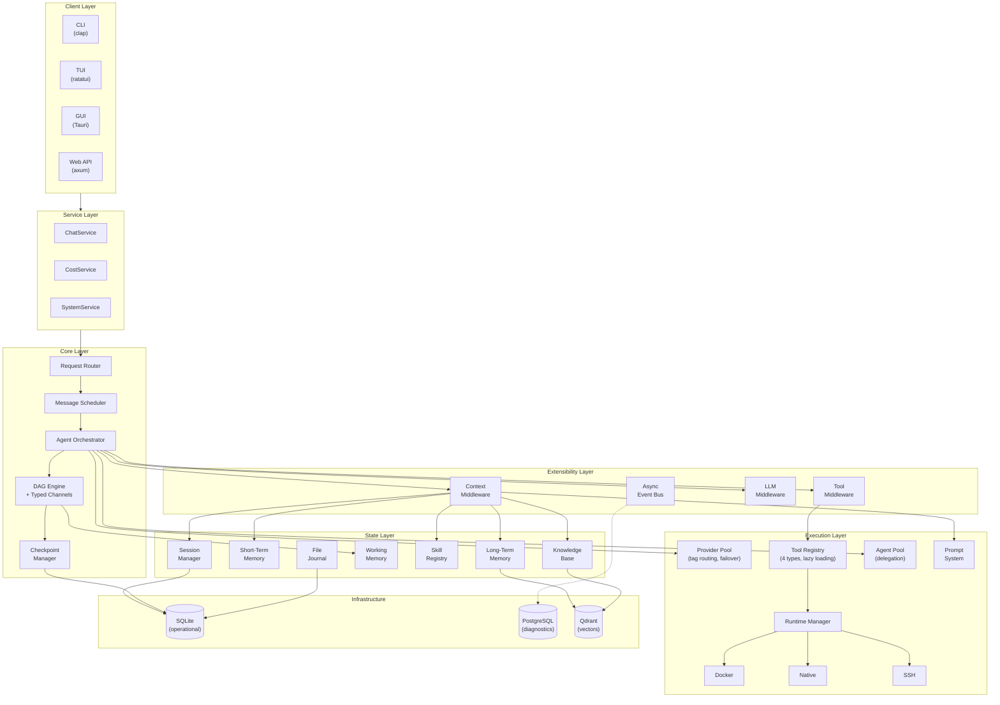

# y-agent

> A modular, extensible AI agent runtime written in Rust.

**Async-first** · **Model-agnostic** · **Full observability** · **WAL-based recoverability** · **Self-evolving skills**

---

## Highlights

- **22 Specialized Crates** — Clean trait boundaries with inward-pointing dependencies
- **Multi-Provider LLM Pool** — Tag-based routing, automatic failover, provider freeze/thaw
- **DAG Workflow Engine** — Typed channels, checkpointing, interrupt/resume protocol
- **Lazy Tool System** — JSON Schema validation, LRU activation, dynamic tool creation at runtime
- **Three-Tier Memory** — Short-term, long-term (Qdrant), and working memory with semantic search
- **Multi-Agent Collaboration** — Session tree, parent/child delegation, 4 collaboration patterns
- **Guardrails & Safety** — Content filtering, PII detection, loop detection, risk scoring as middleware
- **Context Pipeline** — 7-stage middleware chain for token-budget-aware prompt assembly
- **Skill Evolution** — Git-like versioning, experience capture, self-improvement with HITL approval
- **Full Observability** — Span-based tracing, cost intelligence, trace replay (PostgreSQL)

---

## Architecture



### Layer Responsibilities

| Layer | Purpose |
|-------|---------|
| **Client** | User-facing entry points — CLI, TUI, Tauri GUI, REST API — all thin wrappers over the Service layer |
| **Service** | Shared business logic (`ChatService`, `CostService`, `SystemService`), consumed by every client |
| **Core** | Request routing, message scheduling, DAG-based orchestration with typed channels and checkpointing |
| **Extensibility** | Three middleware chains (Context, Tool, LLM), async event bus, lifecycle hooks |
| **Execution** | LLM provider pool with failover, tool registry (4 types), agent delegation pool, sandboxed runtimes |
| **State** | Session tree, three-tier memory (STM/LTM/WM), skill registry, knowledge base, file journal |
| **Infrastructure** | SQLite (operational state), PostgreSQL (diagnostics/analytics), Qdrant (semantic vectors) |

---

## Quick Start

### Prerequisites

- **Rust 1.76+** — `rustup update stable`
- **SQLite 3.35+** — embedded; CLI tool optional
- PostgreSQL 14+ *(optional — diagnostics/analytics)*
- Qdrant *(optional — vector search for memory/knowledge)*

### Build & Run

```bash
# Build
cargo build --release

# Interactive setup (detects deps, selects provider, generates config)
y-agent init

# Set your API key
export OPENAI_API_KEY="sk-..."

# Start chatting
y-agent chat
```

### Test & Bench

```bash
cargo test                    # All tests
cargo test -p y-core          # Single crate
cargo bench                   # All benchmarks
```

---

## Project Initialization

The `y-agent init` command bootstraps a new project in one step:

```bash
# Interactive (default)
y-agent init

# Non-interactive (CI / scripting)
y-agent init --non-interactive --provider openai
y-agent init --non-interactive --provider anthropic --api-key-env MY_KEY
y-agent init --non-interactive --provider ollama   # Local, no API key
```

<details>
<summary>Sample interactive session</summary>

```
  y-agent v0.1.0 — Project Initialization
  =========================================

  Checking environment dependencies...

  Dependency       Status     Detail
  ----------       ------     ------
  rustc            found      rustc 1.76.0
  cargo            found      cargo 1.76.0
  sqlite3          found      3.43.2
  docker           found      Docker version 24.0.7
  docker compose   found      Docker Compose version v2.24.5
  PostgreSQL       found      port 5432 reachable
  Qdrant           not found  not found (optional — for vector search)
  sqlx-cli         not found  not found (optional — for migrations)

  Select LLM provider:
  > OpenAI (GPT-4o)
    Anthropic (Claude 3.5 Sonnet)
    DeepSeek (Chat / Reasoner)
    Groq (Llama 3.1 70B)
    Together AI (Llama 3.1 70B)
    Ollama (Local — no API key needed)
    Custom (OpenAI-compatible endpoint)

  Next steps:
  1. Set your API key:  export OPENAI_API_KEY="sk-..."
  2. Review config:     config/
  3. Start chatting:    y-agent chat
```

| Flag | Description |
|------|-------------|
| `--provider` `<KEY>` | `openai` · `anthropic` · `deepseek` · `deepseek-reasoner` · `groq` · `together` · `ollama` · `custom` |
| `--api-key-env` `<VAR>` | Override the API key env var name |
| `--model` `<NAME>` | Model name (for `custom`) |
| `--base-url` `<URL>` | Base URL (for `custom`) |
| `--non-interactive` | Skip all prompts; use defaults + flags |
| `--dir` `<PATH>` | Target directory (default: `.`) |
| `--force` | Overwrite existing config files |


```
./
├── .env                       # API key placeholders
├── config/
│   ├── y-agent.toml           # Global settings
│   ├── providers.toml         # LLM provider pool
│   ├── storage.toml           # Database & transcript settings
│   ├── session.toml           # Session tree, compaction, auto-archive
│   ├── runtime.toml           # Docker/Native sandbox, resource limits
│   ├── hooks.toml             # Middleware timeouts, event bus capacity
│   ├── tools.toml             # Tool registry limits
│   └── guardrails.toml        # Permission model, loop detection, risk scoring
└── data/
    └── transcripts/           # Session transcript storage
```

### Provider Presets

| Key | Provider | Model | API Key Env Var |
|-----|----------|-------|-----------------|
| `openai` | OpenAI | GPT-4o | `OPENAI_API_KEY` |
| `anthropic` | Anthropic | Claude 3.5 Sonnet | `ANTHROPIC_API_KEY` |
| `deepseek` | DeepSeek | deepseek-chat | `DEEPSEEK_API_KEY` |
| `deepseek-reasoner` | DeepSeek | deepseek-reasoner | `DEEPSEEK_API_KEY` |
| `groq` | Groq | Llama 3.1 70B | `GROQ_API_KEY` |
| `together` | Together AI | Llama 3.1 70B | `TOGETHER_API_KEY` |
| `ollama` | Ollama (local) | llama3.1 | *(none)* |
| `custom` | Any OpenAI-compatible | *(user-specified)* | *(user-specified)* |

---

## Crate Map

```
crates/
├── y-core/           # Trait definitions, shared types, error types
├── y-agent/          # Orchestrator, DAG engine, multi-agent pool, delegation
├── y-service/        # Business layer — ChatService, CostService, SystemService
├── y-cli/            # CLI + TUI (clap + ratatui)
├── y-gui/            # Desktop GUI (Tauri)
├── y-web/            # REST API server (axum)
├── y-provider/       # LLM provider pool, routing, streaming
├── y-context/        # Context pipeline, token budget, memory integration
├── y-hooks/          # Middleware chains, event bus, plugin loading
├── y-tools/          # Tool registry, JSON Schema validation
├── y-mcp/            # MCP protocol client/server
├── y-prompt/         # Prompt sections, templates, TOML store
├── y-skills/         # Skill discovery, validation, manifest
├── y-knowledge/      # Knowledge base chunking, indexing, retrieval
├── y-session/        # Session tree, transcript, branching
├── y-storage/        # SQLite/Postgres/Qdrant backends
├── y-runtime/        # Native/Docker/SSH sandbox execution
├── y-scheduler/      # Cron/interval scheduling, workflow triggers
├── y-guardrails/     # Content filtering, PII, safety middleware
├── y-journal/        # File change journal, rollback engine
├── y-diagnostics/    # Tracing, metrics, health checks (PostgreSQL)
└── y-test-utils/     # Mocks, fixtures, assertion helpers
```

---

## Documentation

Detailed guides are located under `docs/`. Key references:

| Document | Purpose |
|----------|---------|
| `docs/design/` | Per-subsystem design documents |
| `docs/standards/` | Engineering standards, test strategy, schema |
| `docs/plan/` | Project and per-module R&D plans |
| `DESIGN_OVERVIEW.md` | Authoritative cross-cutting alignment index |
| `DESIGN_RULE.md` | Design document standards and validation checklist |

## Deployment

### Docker Quick Start

```bash
y-agent init                        # Generate .env + config
docker compose up -d                # Start full stack (y-agent + PG + Qdrant)
./scripts/health-check.sh           # Verify health
docker compose logs -f y-agent      # Follow logs
```

### Native Install (No Docker)

```bash
./scripts/native-install.sh
# Or customize:
./scripts/native-install.sh --prefix ~/.local --data-dir ~/y-agent-data
```

Creates: binary at `$PREFIX/bin/y-agent`, config at `~/.config/y-agent/`, data at `~/.local/share/y-agent/`.

### Production (GitHub Actions)

Push a version tag to trigger the full pipeline:

```bash
git tag v0.1.0 && git push origin v0.1.0
```

The pipeline will:
1. Run CI checks (clippy, tests, fmt, audit)
2. Build multi-arch Docker images (`linux/amd64`, `linux/arm64`)
3. Publish to GHCR (`ghcr.io`)
4. Build native binaries for 4 platforms
5. Create a GitHub Release
6. Deploy to production via SSH

<details>
<summary>Required GitHub Secrets</summary>

| Secret | Description |
|--------|-------------|
| `DEPLOY_HOST` | Target server address |
| `DEPLOY_USER` | SSH username |
| `DEPLOY_SSH_KEY` | SSH private key |
| `DEPLOY_PATH` | Deployment directory on server |

</details>

---

## Configuration

Configuration files are split by concern in `config/`:

| File | Description |
|------|-------------|
| `y-agent.toml` | Global settings (log level, output format) |
| `providers.toml` | LLM provider pool (API keys, models, routing tags) |
| `storage.toml` | SQLite database, JSONL transcripts, migrations |
| `session.toml` | Session tree depth, compaction, auto-archive |
| `runtime.toml` | Docker/Native sandbox, image whitelist, resource limits |
| `hooks.toml` | Middleware timeouts, event bus capacity |
| `tools.toml` | Tool registry limits, dynamic tool creation |
| `guardrails.toml` | Permission model, loop detection, risk scoring |

```bash
# Generate all config files automatically
y-agent init

# Or copy example files manually
for f in config/*.example.toml; do cp "$f" "config/$(basename "$f" .example.toml).toml"; done
```

---

## License

MIT OR Apache-2.0
