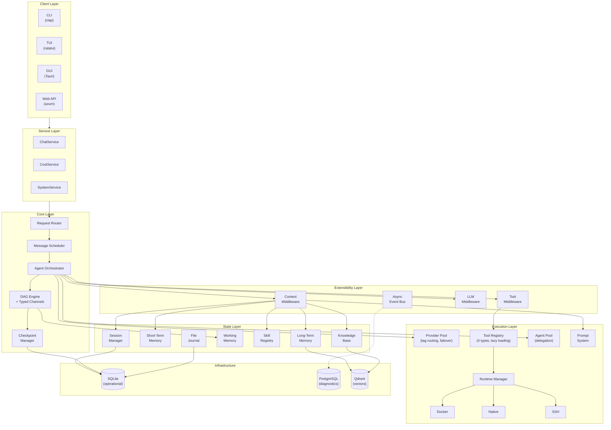

# y-agent

> A modular, extensible AI agent runtime written in Rust.

**Async-first** · **Model-agnostic** · **Full observability** · **WAL-based recoverability** · **Self-evolving skills**

---

## Table of Contents

- [Highlights](#highlights)
- [Quick Start (Required Steps)](#quick-start-required-steps)
- [GUI Usage Guide](#gui-usage-guide)
- [Knowledge Base Configuration](#knowledge-base-configuration)
- [Configuration Reference](#configuration-reference)
- [Architecture](#architecture)
- [Crate Map](#crate-map)
- [Building from Source](#building-from-source)
- [Deployment](#deployment)
- [Documentation](#documentation)
- [License](#license)

---

## Highlights

- **Multi-Provider LLM Pool** — Tag-based routing, automatic failover, provider freeze/thaw
- **DAG Workflow Engine** — Typed channels, checkpointing, interrupt/resume protocol
- **Lazy Tool System** — JSON Schema validation, LRU activation, dynamic tool creation at runtime
- **Three-Tier Memory** — Short-term, long-term (Qdrant), and working memory with semantic search
- **Multi-Agent Collaboration** — Session tree, parent/child delegation, 4 collaboration patterns
- **Guardrails & Safety** — Content filtering, PII detection, loop detection, risk scoring as middleware
- **Context Pipeline** — 7-stage middleware chain for token-budget-aware prompt assembly
- **Knowledge Base** — Multi-level chunking (L0/L1/L2), hybrid retrieval (BM25 + vector), semantic search
- **Skill Evolution** — Git-like versioning, experience capture, self-improvement with HITL approval
- **Browser Tool** — Web browsing via Chrome DevTools Protocol, headless or visible mode
- **Full Observability** — Span-based tracing, cost intelligence, trace replay

---

## Quick Start (Required Steps)

Follow these steps **in order** to get y-agent running. Steps marked with ⚠️ are **mandatory**.

### 1. Prerequisites

| Dependency | Required? | Installation |
|------------|-----------|--------------|
| **Rust 1.76+** | ⚠️ Yes | `rustup update stable` |
| **Node.js 18+** | ⚠️ Yes (for GUI) | [nodejs.org](https://nodejs.org) |
| **SQLite 3.35+** | Embedded | Already included, no action needed |
| **Chrome / Chromium** | Optional | For browser tool — auto-detected |
| PostgreSQL 14+ | Optional | For diagnostics/analytics |
| Qdrant | Optional | For vector search (knowledge base semantic retrieval) |

### 2. ⚠️ Build the Project

```bash
# Clone the repository
git clone https://github.com/gorgias/y-agent.git
cd y-agent

# Build CLI only
cargo build --release

# Or build GUI (Tauri desktop app)
cd crates/y-gui && npm install && cd ../..
./scripts/build-release.sh gui
```

### 3. ⚠️ Initialize Configuration

Run the init command to generate all configuration files:

```bash
# Interactive mode (recommended for first time)
y-agent init

# Non-interactive (for scripting / CI)
y-agent init --non-interactive --provider openai
```

This creates the following file structure:

```
./
├── .env                       # API key placeholders
├── config/
│   ├── y-agent.toml           # Global settings (log level, output)
│   ├── providers.toml         # ⚠️ LLM provider pool (MUST configure)
│   ├── knowledge.toml         # Knowledge base & embedding settings
│   ├── storage.toml           # Database & transcript settings
│   ├── session.toml           # Session tree, compaction, auto-archive
│   ├── runtime.toml           # Docker/Native sandbox, resource limits
│   ├── browser.toml           # Browser tool settings
│   ├── hooks.toml             # Middleware timeouts, event bus capacity
│   ├── tools.toml             # Tool registry limits, MCP servers
│   └── guardrails.toml        # Permission model, loop detection, risk scoring
└── data/
    └── transcripts/           # Session transcript storage
```

### 4. ⚠️ Configure at Least One LLM Provider

This is the **most critical step**. Without a provider, y-agent cannot function.

Edit `config/providers.toml` (or use the GUI Settings → Providers tab):

```toml
[[providers]]
id = "openai-main"
provider_type = "openai"
model = "gpt-4o"
tags = ["reasoning", "general"]
max_concurrency = 3
context_window = 128000
api_key = "sk-your-openai-key-here"
# Or use environment variable instead:
# api_key_env = "OPENAI_API_KEY"
```

<details>
<summary>📋 Provider presets (click to expand)</summary>

| Key | Provider Type | Model | API Key Env Var | Base URL |
|-----|--------------|-------|-----------------|----------|
| OpenAI | `openai` | `gpt-4o` | `OPENAI_API_KEY` | *(default)* |
| Anthropic | `anthropic` | `claude-3-5-sonnet-20241022` | `ANTHROPIC_API_KEY` | *(default)* |
| Google Gemini | `gemini` | `gemini-2.0-flash` | `GEMINI_API_KEY` | *(default)* |
| DeepSeek | `openai` | `deepseek-chat` | `DEEPSEEK_API_KEY` | `https://api.deepseek.com/v1` |
| Groq | `openai` | `llama-3.1-70b-versatile` | `GROQ_API_KEY` | `https://api.groq.com/openai/v1` |
| Together AI | `openai` | `meta-llama/Llama-3.1-70B` | `TOGETHER_API_KEY` | `https://api.together.xyz/v1` |
| Ollama (local) | `ollama` | `llama3.1:8b` | *(none)* | `http://localhost:11434` |
| Azure OpenAI | `azure` | `gpt-4o` | *(your key)* | `https://your-resource.openai.azure.com/openai/deployments/gpt-4o` |
| Custom (OpenAI-compat) | `custom` | *(user-specified)* | *(user-specified)* | *(your endpoint `/v1`)* |

**Tip:** You can configure multiple providers. y-agent will route requests based on tags and automatically failover if a provider is unavailable.

</details>

### 5. Start Using

```bash
# CLI chat mode
y-agent chat

# Or launch the GUI desktop app
# (if built via build-release.sh, find the .app / .dmg / .AppImage in dist/)
```

---

## GUI Usage Guide

y-agent includes a **Tauri-based desktop GUI** with a modern interface. Here's how to use it:

### Layout Overview

The GUI has a **VSCode-style layout** with a sidebar on the left and a main content area:

| Sidebar Icon | Panel | Description |
|:---:|---------|-------------|
| 💬 | **Sessions** | Chat history, organized by workspaces |
| ⚡ | **Automation** | Workflow automation *(coming soon)* |
| 🧩 | **Skills** | Installed skills — search, import, enable/disable |
| 📖 | **Knowledge** | Knowledge base collections — create, import, search |
| 🤖 | **Agents** | Registered agents — built-in, user-defined, dynamic |

### Chat Interface

1. **New Session** — Click the `+` button in the sidebar (Sessions view) to start a new chat
2. **Type a message** — Use the input area at the bottom; press `Enter` to send, `Shift+Enter` for a newline
3. **Slash Commands** — Type `/` to open the command menu:
   - `/new` — Create new session
   - `/clear` — Clear current session
   - `/settings` — Open settings overlay
   - `/model <name>` — Switch LLM model
   - `/status` — Show system status
   - `/diagnostics` — Toggle diagnostics panel
   - `/export` — Export current session
4. **Mention Skills** — Type `/` and select a skill to attach it to the current message as `@skill-name`
5. **Knowledge Base** — Click the 📖 button in the toolbar to select knowledge collections for retrieval-augmented generation (RAG)
6. **Model Selector** — Click the `@` button in the toolbar to switch between configured providers
7. **Context Reset** — Click the eraser (🧹) button to insert a context reset divider; messages before the divider won't be included in future context
8. **Stop Generation** — Click the ■ button (appears during streaming) to cancel an ongoing response

### Workspaces

Workspaces let you organize sessions by project:

1. Click the **folder icon** in the sidebar header to create a new workspace
2. Give it a name and a path on your filesystem
3. New sessions can be created within a workspace (`+` button on workspace row)
4. Right-click (⋯ menu) on a session to move it between workspaces

### Settings

Open settings via `/settings` command or the gear icon:

| Tab | What You Can Configure |
|-----|----------------------|
| **General** | Theme (dark/light), log level, output format |
| **Providers** | Add/edit/delete LLM providers, test connections, set API keys |
| **Session** | Max tree depth, compaction threshold, auto-archive |
| **Runtime** | Execution backend (Native/Docker/SSH), Python/Bun venvs |
| **Browser** | Enable/disable browser tool, headless mode, Chrome path |
| **Storage** | SQLite path, WAL mode, transcript directory |
| **Tools** | Max active tools, MCP server configuration |
| **Guardrails** | Permission model, loop detection, risk scoring |
| **Knowledge** | Embedding model, chunking, retrieval strategy |
| **Prompts** | View and edit system prompt templates |

### Status Bar

The bottom status bar shows:
- **Current session ID** and turn count
- **Token usage** with a progress bar relative to the context window
- **Active provider** and model name

---

## Knowledge Base Configuration

The knowledge base supports **multi-level chunking** (L0 summary → L1 sections → L2 paragraphs) and **hybrid retrieval** (BM25 keyword search + vector semantic search).

### Basic Setup (Keyword Search Only)

Out of the box, the knowledge base works with **keyword-based (BM25) search**. No external services needed:

```toml
# config/knowledge.toml — minimal working config
embedding_enabled = false
retrieval_strategy = "keyword"
```

### Full Setup (Semantic / Hybrid Search)

To enable **vector-based semantic search**, you need to configure an OpenAI-compatible embedding API:

#### Step 1: Start Qdrant (vector database)

```bash
# Using Docker
docker run -p 6333:6333 -p 6334:6334 qdrant/qdrant:v1.8.4

# Or via docker-compose (includes PostgreSQL + Qdrant)
docker compose up -d qdrant
```

#### Step 2: Configure Embedding API

Edit `config/knowledge.toml`:

```toml
# --- Enable Embedding ---
embedding_enabled = true

# --- Embedding Model ---
# OpenAI (default)
embedding_model = "text-embedding-3-small"
embedding_dimensions = 1536
embedding_base_url = "https://api.openai.com/v1"
embedding_api_key_env = "OPENAI_API_KEY"     # reads from environment variable
# embedding_api_key = "sk-..."               # or set key directly (takes precedence)

# Max tokens per embedding request (set to your model's limit)
# 8192 for OpenAI text-embedding-3-small/large
# 512  for most local GGUF models (bge-small, gte-small)
embedding_max_tokens = 8192

# --- Retrieval Strategy ---
# "hybrid"   — BM25 + vector (recommended, best results)
# "semantic" — vector search only
# "keyword"  — BM25 only
retrieval_strategy = "hybrid"
bm25_weight = 1.0
vector_weight = 1.0
```

<details>
<summary>🔧 Using alternative embedding providers (click to expand)</summary>

Any **OpenAI-compatible** `/v1/embeddings` endpoint works. Examples:

```toml
# --- Ollama local embeddings ---
embedding_enabled = true
embedding_model = "nomic-embed-text"
embedding_dimensions = 768
embedding_base_url = "http://localhost:11434/v1"
embedding_api_key = "not-needed"
embedding_max_tokens = 512

# --- Azure OpenAI Embeddings ---
embedding_enabled = true
embedding_model = "text-embedding-3-small"
embedding_dimensions = 1536
embedding_base_url = "https://your-resource.openai.azure.com/openai/deployments/text-embedding-3-small"
embedding_api_key_env = "AZURE_EMBEDDING_KEY"

# --- Cohere / any OpenAI-compatible server ---
embedding_enabled = true
embedding_model = "embed-english-v3.0"
embedding_dimensions = 1024
embedding_base_url = "https://your-proxy.example.com/v1"
embedding_api_key = "your-key"
```

</details>

#### Step 3: Configure Qdrant Connection

Qdrant is configured in `config/storage.toml` or via environment variables:

```bash
# Environment variable
export Y_QDRANT_URL=http://localhost:6334

# Or in docker-compose, it's already wired up
```

### Using the Knowledge Base

**Via GUI:**

1. Click the **📖 Knowledge** tab in the sidebar
2. Click `+` to create a new collection (e.g., "project-docs")
3. Select a collection, then click **Import** to add files (supports `.md`, `.txt`, `.pdf`, `.rs`, `.py`, `.js`, `.ts`, `.toml`, `.yaml`, `.json`, `.html`, `.csv`, and more)
4. You can also import entire folders — all supported files will be recursively scanned
5. When chatting, click the **📖 button** in the input toolbar to attach knowledge collections for RAG
6. Or use the `/` command menu → select a knowledge collection

**Via CLI:**

```bash
# Ingest a file
y-agent knowledge ingest --file docs/guide.md --collection project-docs

# Search knowledge base
y-agent knowledge search "how does the auth module work"
```

### Chunking Configuration

```toml
# config/knowledge.toml
l0_max_tokens = 200     # L0: document summary (~100 tokens)
l1_max_tokens = 500     # L1: section overviews (~500 tokens)
l2_max_tokens = 450     # L2: paragraph chunks (source for retrieval)

max_chunks_per_entry = 5000       # Safety limit per document
min_similarity_threshold = 0.65   # Discard results below this relevance
```

---

## Configuration Reference

### Configuration Precedence (Highest → Lowest)

1. **CLI arguments** — `--log-level debug`
2. **Environment variables** — `Y_AGENT_LOG_LEVEL=debug`
3. **User config dir** — `~/.config/y-agent/`
4. **Project config dir** — `./config/`
5. **Built-in defaults**

### Config Files Overview

| File | Description | Must Configure? |
|------|-------------|:---:|
| `providers.toml` | LLM provider pool (API keys, models, routing tags) | ⚠️ **Yes** |
| `y-agent.toml` | Global settings (log level, output format) | No |
| `knowledge.toml` | Knowledge base embedding & retrieval settings | Only if using embedding |
| `storage.toml` | SQLite database path, WAL mode, transcripts | No |
| `session.toml` | Session tree depth, compaction, auto-archive | No |
| `runtime.toml` | Execution backend (Docker/Native/SSH), sandboxing | No |
| `browser.toml` | Browser tool (Chrome, headless mode, CDP config) | Only if using browser |
| `hooks.toml` | Middleware timeouts, event bus capacity | No |
| `tools.toml` | Tool registry limits, MCP server connections | Only if using MCP |
| `guardrails.toml` | Permission model, loop detection, risk scoring | No |

### Proxy Configuration

y-agent supports multi-level proxy (global → tag-based → per-provider):

```toml
# In providers.toml
[proxy]
default_scheme = "socks5"

[proxy.global]
url = "socks5://proxy.company.com:1080"

[proxy.providers.ollama-local]
enabled = false  # Local provider, no proxy needed
```

### Browser Tool Configuration

To enable the browser tool for web browsing tasks:

```toml
# config/browser.toml
enabled = true
auto_launch = true        # Auto-launch Chrome (recommended)
headless = true            # Set false for visible browser
# chrome_path = ""         # Leave empty for auto-detection
local_cdp_port = 9222
```

### MCP Server Configuration

Connect to Model Context Protocol servers for additional tools:

```toml
# config/tools.toml
[[mcp_servers]]
name = "filesystem"
transport = "stdio"
command = "npx"
args = ["-y", "@modelcontextprotocol/server-filesystem", "/workspace"]
enabled = true
```

### Environment Variables

Key environment variables (set in `.env` or your shell):

```bash
# LLM Provider API keys
OPENAI_API_KEY=sk-...
ANTHROPIC_API_KEY=sk-ant-...
DEEPSEEK_API_KEY=sk-...
GEMINI_API_KEY=AIza...

# Infrastructure
Y_AGENT_PORT=8080          # Web API port
Y_QDRANT_URL=http://localhost:6334   # Qdrant vector DB
RUST_LOG=info              # Log level
```

---

## Architecture



### Layer Responsibilities

| Layer | Purpose |
|-------|---------|
| **Client** | User-facing entry points — CLI, TUI, Tauri GUI, REST API — all thin wrappers over the Service layer |
| **Service** | Shared business logic (`ChatService`, `CostService`, `SystemService`), consumed by every client |
| **Core** | Request routing, message scheduling, DAG-based orchestration with typed channels and checkpointing |
| **Extensibility** | Three middleware chains (Context, Tool, LLM), async event bus, lifecycle hooks |
| **Execution** | LLM provider pool with failover, tool registry (4 types), agent delegation pool, sandboxed runtimes |
| **State** | Session tree, three-tier memory (STM/LTM/WM), skill registry, knowledge base, file journal |
| **Infrastructure** | SQLite (operational state), PostgreSQL (diagnostics/analytics), Qdrant (semantic vectors) |

---

## Crate Map

```
crates/
├── y-core/           # Trait definitions, shared types, error types
├── y-agent/          # Orchestrator, DAG engine, multi-agent pool, delegation
├── y-service/        # Business layer — ChatService, CostService, SystemService
├── y-cli/            # CLI + TUI (clap + ratatui)
├── y-gui/            # Desktop GUI (Tauri v2 + React + TypeScript)
├── y-web/            # REST API server (axum)
├── y-provider/       # LLM provider pool, routing, streaming
├── y-context/        # Context pipeline, token budget, memory integration
├── y-hooks/          # Middleware chains, event bus, plugin loading
├── y-tools/          # Tool registry, JSON Schema validation
├── y-mcp/            # MCP protocol client/server
├── y-prompt/         # Prompt sections, templates, TOML store
├── y-skills/         # Skill discovery, validation, manifest
├── y-knowledge/      # Knowledge base chunking, indexing, retrieval
├── y-session/        # Session tree, transcript, branching
├── y-storage/        # SQLite/Postgres/Qdrant backends
├── y-runtime/        # Native/Docker/SSH sandbox execution
├── y-scheduler/      # Cron/interval scheduling, workflow triggers
├── y-guardrails/     # Content filtering, PII, safety middleware
├── y-journal/        # File change journal, rollback engine
├── y-browser/        # Browser tool via Chrome DevTools Protocol
├── y-bot/            # Bot agent definitions
├── y-diagnostics/    # Tracing, metrics, health checks
└── y-test-utils/     # Mocks, fixtures, assertion helpers
```

---

## Building from Source

### Build CLI Only

```bash
cargo build --release
# Binary: target/release/y-agent
```

### Build GUI (Tauri Desktop App)

```bash
# Prerequisites: Node.js 18+, npm
cd crates/y-gui && npm install && cd ../..

# Build release bundles
./scripts/build-release.sh gui
# Output: dist/y-agent-gui-<version>-<platform>.zip
#   macOS: .dmg, .app
#   Linux: .deb, .AppImage
#   Windows: .msi, .exe
```

### Build Everything

```bash
./scripts/build-release.sh
# Builds both CLI zip and GUI bundle
```

### Tests & Benchmarks

```bash
cargo test                    # All tests
cargo test -p y-core          # Single crate
cargo bench                   # All benchmarks
```

---

## Deployment

### Docker Quick Start

```bash
y-agent init                        # Generate .env + config
docker compose up -d                # Start full stack (y-agent + PG + Qdrant)
./scripts/health-check.sh           # Verify health
docker compose logs -f y-agent      # Follow logs
```

The `docker-compose.yml` includes:
- **y-agent** — Main application (port 8080)
- **PostgreSQL 16** — Diagnostics & analytics
- **Qdrant v1.8.4** — Vector store for knowledge base & memory

### Native Install (No Docker)

```bash
./scripts/native-install.sh
# Or customize:
./scripts/native-install.sh --prefix ~/.local --data-dir ~/y-agent-data
```

Creates: binary at `$PREFIX/bin/y-agent`, config at `~/.config/y-agent/`, data at `~/.local/share/y-agent/`.

### Production (GitHub Actions)

Push a version tag to trigger the full pipeline:

```bash
git tag v0.1.0 && git push origin v0.1.0
```

The pipeline will:
1. Run CI checks (clippy, tests, fmt, audit)
2. Build multi-arch Docker images (`linux/amd64`, `linux/arm64`)
3. Publish to GHCR (`ghcr.io`)
4. Build native binaries for 4 platforms
5. Create a GitHub Release
6. Deploy to production via SSH

<details>
<summary>Required GitHub Secrets</summary>

| Secret | Description |
|--------|-------------|
| `DEPLOY_HOST` | Target server address |
| `DEPLOY_USER` | SSH username |
| `DEPLOY_SSH_KEY` | SSH private key |
| `DEPLOY_PATH` | Deployment directory on server |

</details>

---

## Documentation

Detailed guides are located under `docs/`. Key references:

| Document | Purpose |
|----------|---------|
| `docs/design/` | Per-subsystem design documents |
| `docs/standards/` | Engineering standards, test strategy, schema |
| `docs/plan/` | Project and per-module R&D plans |
| `DESIGN_OVERVIEW.md` | Authoritative cross-cutting alignment index |
| `DESIGN_RULE.md` | Design document standards and validation checklist |

---

## License

MIT OR Apache-2.0
