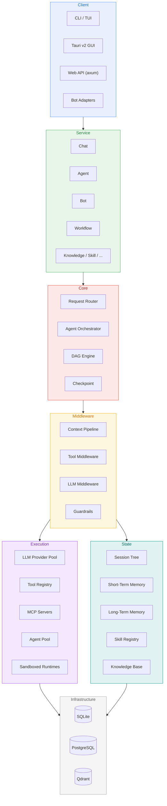

# y-agent

> A modular, extensible AI agent framework written in Rust.

**Async-first** -- **Model-agnostic** -- **Full observability** -- **WAL-based recoverability** -- **Self-evolving skills**

---

## Table of Contents

- [Highlights](#highlights)
- [Quick Start](#quick-start)
- [GUI Desktop App](#gui-desktop-app)
- [Knowledge Base](#knowledge-base)
- [Bot Adapters](#bot-adapters)
- [Configuration Reference](#configuration-reference)
- [Architecture](#architecture)
- [Crate Map](#crate-map)
- [Building from Source](#building-from-source)
- [Deployment](#deployment)
- [Documentation](#documentation)
- [License](#license)

---

## Highlights

| Capability                    | Description                                                                                                               |
| ----------------------------- | ------------------------------------------------------------------------------------------------------------------------- |
| **Multi-Provider LLM Pool**   | Tag-based routing, automatic failover, provider freeze/thaw, enable/disable toggle                                        |
| **DAG Workflow Engine**       | Typed channels, checkpointing, interrupt/resume protocol                                                                  |
| **Tool System**               | JSON Schema validation, LRU activation, dynamic tool creation, multi-format parser (OpenAI, DeepSeek DSML, MiniMax, GLM4, Longcat, Qwen3Coder) |
| **Three-Tier Memory**         | Short-term, long-term (Qdrant), and working memory with semantic search                                                   |
| **Multi-Agent Collaboration** | Session tree, parent/child delegation, TOML-defined agents with template expansion                                        |
| **Guardrails & Safety**       | Content filtering, PII detection, loop detection, risk scoring middleware                                                 |
| **Context Pipeline**          | 7-stage middleware chain for token-budget-aware prompt assembly                                                           |
| **Knowledge Base**            | Multi-level chunking (L0/L1/L2), hybrid retrieval (BM25 + vector), semantic search                                        |
| **Skill Evolution**           | Git-like versioning, experience capture, self-improvement with HITL approval                                              |
| **Browser Tool**              | Web browsing via Chrome DevTools Protocol, headless or visible mode                                                       |
| **Bot Adapters**              | Discord, Feishu (Lark), and Telegram integration via `y-bot`                                                              |
| **Full Observability**        | Span-based tracing, cost intelligence, trace replay                                                                       |
| **Built-in Tools**            | `ShellExec`, `FileRead`, `FileWrite`, `WebFetch`, `KnowledgeSearch`, `ToolSearch`, `Task` (delegation)                    |

---

## Quick Start

### 1. Prerequisites

| Dependency            | Required?      | Notes                                |
| --------------------- | -------------- | ------------------------------------ |
| **Rust 1.94+**        | Yes            | Pinned in `rust-toolchain.toml`      |
| **Node.js 18+**       | Yes (GUI only) | [nodejs.org](https://nodejs.org)     |
| **SQLite 3.35+**      | Embedded       | Bundled, no action needed            |
| **Chrome / Chromium** | Optional       | For the browser tool (auto-detected) |
| PostgreSQL 14+        | Optional       | For diagnostics / analytics          |
| Qdrant                | Optional       | For semantic vector search           |

### 2. Build

```bash
# Clone
git clone https://github.com/gorgias/y-agent.git
cd y-agent

# Build CLI + Web server
cargo build --release
# Binary: target/release/y-agent

# Or build the GUI desktop app (Tauri v2)
cd crates/y-gui && npm install && cd ../..
./scripts/build-release.sh gui
```

### 3. Initialize Configuration

```bash
# Interactive (recommended for first setup)
y-agent init

# Non-interactive
y-agent init --non-interactive --provider openai
```

This generates the configuration tree:

```
./
  .env                         # API key placeholders
  config/
    y-agent.example.toml       # Global settings (log level, output)
    providers.example.toml     # LLM provider pool  ** MUST configure **
    knowledge.example.toml     # Knowledge base & embedding
    storage.example.toml       # Database & transcript
    session.example.toml       # Session tree, compaction, auto-archive
    runtime.example.toml       # Docker / Native sandbox, resource limits
    browser.example.toml       # Browser tool
    hooks.example.toml         # Middleware timeouts, event bus capacity
    tools.example.toml         # Tool registry limits, MCP servers
    guardrails.example.toml    # Permission model, loop detection, risk scoring
    agents/                    # TOML-based agent definitions
    prompts/                   # System prompt templates
  data/
    transcripts/               # Session transcript storage
```

### 4. Configure at Least One LLM Provider

This is the **most critical step**. Without a provider, y-agent cannot function.

Copy `config/providers.example.toml` to `config/providers.toml` and edit it (or use the GUI Settings -> Providers tab):

```toml
[[providers]]
id = "openai-main"
provider_type = "openai"
model = "gpt-4o"
tags = ["reasoning", "general"]
max_concurrency = 3
context_window = 128000
api_key = "sk-your-openai-key-here"
enabled = true
# Or use an environment variable:
# api_key_env = "OPENAI_API_KEY"
```

<details>
<summary>Provider presets (click to expand)</summary>

| Provider          | `provider_type` | Model Example              | API Key Env Var             | Base URL                                                           |
| ----------------- | --------------- | -------------------------- | --------------------------- | ------------------------------------------------------------------ |
| OpenAI            | `openai`        | `gpt-4o`                   | `OPENAI_API_KEY`            | _(default)_                                                        |
| Anthropic         | `anthropic`     | `claude-sonnet-4-20250514` | `ANTHROPIC_API_KEY`         | _(default)_                                                        |
| Google Gemini     | `gemini`        | `gemini-2.5-flash`         | `GEMINI_API_KEY`            | _(default)_                                                        |
| DeepSeek          | `openai`        | `deepseek-chat`            | `DEEPSEEK_API_KEY`          | `https://api.deepseek.com/v1`                                      |
| Groq              | `openai`        | `llama-3.3-70b-versatile`  | `GROQ_API_KEY`              | `https://api.groq.com/openai/v1`                                   |
| Together AI       | `openai`        | `meta-llama/Llama-3.3-70B` | `TOGETHER_API_KEY`          | `https://api.together.xyz/v1`                                      |
| Ollama (local)    | `ollama`        | `llama3.1:8b`              | _(none -- no key required)_ | `http://localhost:11434`                                           |
| Azure OpenAI      | `azure`         | `gpt-4o`                   | _(your key)_                | `https://your-resource.openai.azure.com/openai/deployments/gpt-4o` |
| Any OpenAI-compat | `openai`        | _(user-specified)_         | _(user-specified)_          | _(your endpoint /v1)_                                              |

Multiple providers can coexist. y-agent routes requests by tags and automatically fails over when a provider is unavailable. Providers can be toggled on/off with the `enabled` field.

</details>

### 5. Start

```bash
# CLI interactive chat
y-agent chat

# TUI mode (ratatui terminal UI)
y-agent tui

# Start the Web API server (axum, port 8080)
y-agent serve

# Or launch the GUI desktop app
# (built via build-release.sh -- .app / .dmg / .AppImage in dist/)
```

---

## GUI Desktop App

y-agent ships with a **Tauri v2 desktop GUI** built with React 19 and TypeScript. The frontend uses Radix UI primitives, Lucide icons, react-virtuoso for virtualized lists, and Mermaid for diagram rendering.

### Layout

The GUI follows a **VSCode-style layout** with a sidebar and main content area:

| Sidebar Panel  | Description                                          |
| -------------- | ---------------------------------------------------- |
| **Sessions**   | Chat history, organized by workspaces                |
| **Automation** | Workflow automation (DAG editor)                     |
| **Skills**     | Installed skills -- search, import, enable/disable   |
| **Knowledge**  | Knowledge base collections -- create, import, search |
| **Agents**     | Registered agents -- built-in, user-defined, dynamic |

### Chat Interface

- **New Session** -- Click the `+` button in the sidebar to start a new chat
- **Send** -- Press `Enter` to send, `Shift+Enter` for a newline
- **Slash Commands** -- Type `/` to open the command menu (`/new`, `/clear`, `/settings`, `/model <name>`, `/status`, `/diagnostics`, `/export`)
- **Skill Mention** -- Type `/` and select a skill to attach as `@skill-name`
- **Knowledge RAG** -- Click the knowledge button in the toolbar to attach collections for retrieval-augmented generation
- **Model Selector** -- Click the `@` button to switch between configured providers
- **Context Reset** -- Click the eraser button to insert a context reset divider; messages before it are excluded from future context
- **Stop Generation** -- Click the stop button during streaming to cancel

### Workspaces

1. Click the folder icon in the sidebar header to create a new workspace
2. Give it a name and a filesystem path
3. Create sessions within a workspace
4. Move sessions between workspaces via the context menu

### Settings

Open via `/settings` or the gear icon:

| Tab            | Configures                                                    |
| -------------- | ------------------------------------------------------------- |
| **General**    | Theme (dark / light), log level, output format                |
| **Providers**  | Add / edit / delete / test / toggle LLM providers             |
| **Session**    | Max tree depth, compaction threshold, auto-archive            |
| **Runtime**    | Execution backend (Native / Docker / SSH), Python / Bun venvs |
| **Browser**    | Browser tool toggle, headless mode, Chrome path               |
| **Storage**    | SQLite path, WAL mode, transcript directory                   |
| **Tools**      | Max active tools, MCP server configuration                    |
| **Guardrails** | Permission model, loop detection, risk scoring                |
| **Knowledge**  | Embedding model, chunking, retrieval strategy                 |
| **Prompts**    | View and edit system prompt templates                         |

### Status Bar

The bottom status bar displays:

- Current session ID and turn count
- Token usage progress relative to the context window
- Active provider and model name

---

## Knowledge Base

The knowledge base supports **multi-level chunking** (L0 summary, L1 sections, L2 paragraphs) and **hybrid retrieval** (BM25 keyword search + vector semantic search).

### Keyword-Only (No External Services)

```toml
# config/knowledge.toml
embedding_enabled = false
retrieval_strategy = "keyword"
```

### Full Semantic / Hybrid Search

#### Step 1 -- Start Qdrant

```bash
# Docker
docker run -p 6333:6333 -p 6334:6334 qdrant/qdrant:v1.8.4

# Or via docker-compose (includes PostgreSQL + Qdrant)
docker compose up -d qdrant
```

#### Step 2 -- Configure Embedding

```toml
# config/knowledge.toml
embedding_enabled = true
embedding_model = "text-embedding-3-small"
embedding_dimensions = 1536
embedding_base_url = "https://api.openai.com/v1"
embedding_api_key_env = "OPENAI_API_KEY"
embedding_max_tokens = 8192

retrieval_strategy = "hybrid"   # "hybrid" | "semantic" | "keyword"
bm25_weight = 1.0
vector_weight = 1.0
```

<details>
<summary>Alternative embedding providers (click to expand)</summary>

Any **OpenAI-compatible** `/v1/embeddings` endpoint works:

```toml
# Ollama local
embedding_model = "nomic-embed-text"
embedding_dimensions = 768
embedding_base_url = "http://localhost:11434/v1"
embedding_api_key = "not-needed"
embedding_max_tokens = 512

# Azure OpenAI
embedding_model = "text-embedding-3-small"
embedding_dimensions = 1536
embedding_base_url = "https://your-resource.openai.azure.com/openai/deployments/text-embedding-3-small"
embedding_api_key_env = "AZURE_EMBEDDING_KEY"
```

</details>

#### Step 3 -- Configure Qdrant

```bash
export Y_QDRANT_URL=http://localhost:6334
# Or set in docker-compose (pre-wired)
```

### Usage

**Via GUI:**

1. Open the **Knowledge** tab in the sidebar
2. Click `+` to create a collection
3. Click **Import** to add files (`.md`, `.txt`, `.pdf`, `.rs`, `.py`, `.js`, `.ts`, `.toml`, `.yaml`, `.json`, `.html`, `.csv`, and more) or entire folders
4. Attach collections to a chat via the knowledge button in the input toolbar

**Via CLI:**

```bash
y-agent knowledge ingest --file docs/guide.md --collection project-docs
y-agent knowledge search "how does the auth module work"
```

### Chunking Configuration

```toml
# config/knowledge.toml
l0_max_tokens = 200       # L0: document summary
l1_max_tokens = 500       # L1: section overviews
l2_max_tokens = 450       # L2: paragraph chunks (retrieval source)

max_chunks_per_entry = 5000
min_similarity_threshold = 0.65
```

---

## Bot Adapters

The `y-bot` crate provides platform adapters that expose y-agent as a messaging bot:

| Platform          | Transport                                              | Status      |
| ----------------- | ------------------------------------------------------ | ----------- |
| **Discord**       | Interactions Endpoint (Ed25519 signature verification) | Implemented |
| **Feishu (Lark)** | Event webhook                                          | Implemented |
| **Telegram**      | Bot API webhook                                        | Implemented |

Bot adapters are wired into `y-web` and share the same `ServiceContainer`. Configure them in `config/bots.toml`.

---

## Configuration Reference

### Precedence (Highest to Lowest)

1. **CLI arguments** -- `--log-level debug`
2. **Environment variables** -- `Y_AGENT_LOG_LEVEL=debug`
3. **User config directory** -- `~/.config/y-agent/`
4. **Project config directory** -- `./config/`
5. **Built-in defaults**

### Config Files

| File              | Description                                                       | Must Configure?         |
| ----------------- | ----------------------------------------------------------------- | ----------------------- |
| `providers.toml`  | LLM provider pool (API keys, models, routing tags, enable toggle) | **Yes**                 |
| `y-agent.toml`    | Global settings (log level, output format)                        | No                      |
| `knowledge.toml`  | Knowledge base embedding & retrieval                              | Only if using embedding |
| `storage.toml`    | SQLite database path, WAL mode, transcripts                       | No                      |
| `session.toml`    | Session tree depth, compaction, auto-archive                      | No                      |
| `runtime.toml`    | Execution backend (Docker / Native / SSH), sandboxing             | No                      |
| `browser.toml`    | Browser tool (Chrome, headless mode, CDP)                         | Only if using browser   |
| `hooks.toml`      | Middleware timeouts, event bus capacity                           | No                      |
| `tools.toml`      | Tool registry limits, MCP server connections                      | Only if using MCP       |
| `guardrails.toml` | Permission model, loop detection, risk scoring                    | No                      |
| `bots.toml`       | Bot adapter configuration (Discord, Feishu, Telegram)             | Only if using bots      |

### Agent Definitions

Agent definitions live in `config/agents/` as TOML files. They support **template expansion** -- placeholders like `{{YAGENT_CONFIG_PATH}}` are resolved to system-specific paths at load time. Built-in agents include:

| Agent                    | Purpose                               |
| ------------------------ | ------------------------------------- |
| `skill-ingestion`        | Skill import and validation           |
| `skill-security-check`   | Security audit for skill packages     |
| `agent-architect`        | Agent design and configuration        |
| `tool-engineer`          | Dynamic tool creation                 |
| `title-generator`        | Session title auto-generation         |
| `compaction-summarizer`  | Context compaction                    |
| `pruning-summarizer`     | Context pruning optimization          |
| `knowledge-summarizer`   | Knowledge base document summarization |
| `knowledge-metadata`     | Knowledge entry metadata extraction   |
| `task-intent-analyzer`   | Intent classification for delegation  |
| `pattern-extractor`      | Pattern extraction from conversations |
| `capability-assessor`    | Capability assessment                 |

### Proxy Configuration

```toml
# providers.toml -- multi-level proxy (global -> tag-based -> per-provider)
[proxy]
default_scheme = "socks5"

[proxy.global]
url = "socks5://proxy.company.com:1080"

[proxy.providers.ollama-local]
enabled = false   # Local provider, no proxy
```

### Browser Tool Configuration

```toml
# config/browser.toml
enabled = true
auto_launch = true
headless = true
# chrome_path = ""       # Leave empty for auto-detection
local_cdp_port = 9222
```

### MCP Server Configuration

```toml
# config/tools.toml
[[mcp_servers]]
name = "filesystem"
transport = "stdio"
command = "npx"
args = ["-y", "@modelcontextprotocol/server-filesystem", "/workspace"]
enabled = true
```

### Environment Variables

```bash
# LLM Provider API keys
OPENAI_API_KEY=sk-...
ANTHROPIC_API_KEY=sk-ant-...
DEEPSEEK_API_KEY=sk-...
GEMINI_API_KEY=AIza...

# Infrastructure
Y_AGENT_PORT=8080
Y_QDRANT_URL=http://localhost:6334
RUST_LOG=info
```

---

## Architecture



### Layer Responsibilities

| Layer              | Purpose                                                                                                    |
| ------------------ | ---------------------------------------------------------------------------------------------------------- |
| **Client**         | Thin I/O wrappers -- CLI, TUI, Tauri GUI, REST API, bot adapters                                           |
| **Service**        | Business logic -- Chat, Agent, Bot, Workflow, Knowledge, Skill, Scheduler, Observability, DI container     |
| **Core**           | Request routing, agent orchestration, DAG engine with typed channels and checkpointing                     |
| **Middleware**     | Context pipeline, tool middleware, LLM middleware, guardrails, async event bus                              |
| **Execution**      | LLM provider pool with tag routing and failover, tool registry (built-in + dynamic + MCP), sandboxed runtimes |
| **State**          | Session tree, three-tier memory (STM / LTM / WM), skill registry, knowledge base, file journal            |
| **Infrastructure** | SQLite (operational state), PostgreSQL (diagnostics / analytics), Qdrant (semantic vectors)                |

---

## Crate Map

The workspace contains **24 crates** organized by concern:

### Core

| Crate    | Description                                  |
| -------- | -------------------------------------------- |
| `y-core` | Trait definitions, shared types, error types |

### Infrastructure

| Crate           | Description                                                                          |
| --------------- | ------------------------------------------------------------------------------------ |
| `y-provider`    | LLM provider pool (OpenAI, Anthropic, Gemini, Azure, Ollama), tag routing, streaming |
| `y-session`     | Session tree, transcript, branching                                                  |
| `y-context`     | Context pipeline, token budget, memory integration                                   |
| `y-storage`     | SQLite / PostgreSQL / Qdrant backends                                                |
| `y-knowledge`   | Knowledge base chunking, indexing, hybrid retrieval                                  |
| `y-diagnostics` | Tracing, metrics, health checks                                                      |

### Middleware

| Crate          | Description                                         |
| -------------- | --------------------------------------------------- |
| `y-hooks`      | Middleware chains, event bus, plugin loading        |
| `y-guardrails` | Content filtering, PII detection, safety middleware |
| `y-prompt`     | Prompt sections, templates, TOML store              |
| `y-mcp`        | Model Context Protocol client / server              |

### Capabilities

| Crate         | Description                                                |
| ------------- | ---------------------------------------------------------- |
| `y-tools`     | Tool registry, JSON Schema validation, multi-format parser |
| `y-skills`    | Skill discovery, validation, manifest                      |
| `y-runtime`   | Native / Docker / SSH sandbox execution                    |
| `y-scheduler` | Cron / interval scheduling, workflow triggers              |
| `y-browser`   | Browser tool via Chrome DevTools Protocol                  |
| `y-journal`   | File change journal, rollback engine                       |

### Orchestration

| Crate     | Description                                            |
| --------- | ------------------------------------------------------ |
| `y-agent` | Orchestrator, DAG engine, multi-agent pool, delegation |
| `y-bot`   | Bot adapters (Discord, Feishu, Telegram)               |

### Service

| Crate       | Description                                                                                                                                                      |
| ----------- | ---------------------------------------------------------------------------------------------------------------------------------------------------------------- |
| `y-service` | Business logic layer -- `ChatService`, `AgentService`, `BotService`, `WorkflowService`, `KnowledgeService`, `SkillService`, `SchedulerService`, DI container |

### Presentation

| Crate   | Description                                     |
| ------- | ----------------------------------------------- |
| `y-cli` | CLI + TUI (clap + ratatui)                      |
| `y-web` | REST API server (axum) with bot adapter routing |
| `y-gui` | Desktop GUI (Tauri v2 + React 19 + TypeScript)  |

### Testing

| Crate          | Description                        |
| -------------- | ---------------------------------- |
| `y-test-utils` | Mocks, fixtures, assertion helpers |

---

## Building from Source

### CLI + Web Server

```bash
cargo build --release
# Binary: target/release/y-agent
```

### GUI (Tauri v2 Desktop App)

```bash
cd crates/y-gui && npm install && cd ../..
./scripts/build-release.sh gui
# Output: dist/y-agent-gui-<version>-<platform>.zip
#   macOS:   .dmg, .app
#   Linux:   .deb, .AppImage, .pkg.tar.zst
#   Windows: .msi, .exe
```

### Full Release Build

```bash
./scripts/build-release.sh
# Builds both CLI zip and GUI bundle
```

### Nix

```bash
nix build           # Build the CLI package
nix develop          # Enter dev shell with all dependencies
```

### Tests

```bash
cargo test                     # All workspace tests
cargo test -p y-core           # Single crate
```

### Quality Gates

After any code change, all four checks must pass:

```bash
cargo clippy --workspace -- -D warnings
cargo check --workspace
cargo doc --workspace --no-deps
cargo fmt --all
```

---

## Deployment

### Docker Compose

```bash
y-agent init
docker compose up -d
./scripts/health-check.sh
docker compose logs -f y-agent
```

The `docker-compose.yml` provisions:

- **y-agent** -- Main application (port 8080)
- **PostgreSQL 16** -- Diagnostics & analytics
- **Qdrant v1.8.4** -- Vector store for knowledge base & memory

### Native Install

```bash
./scripts/native-install.sh
# Or customize:
./scripts/native-install.sh --prefix ~/.local --data-dir ~/y-agent-data
```

Creates: binary at `$PREFIX/bin/y-agent`, config at `~/.config/y-agent/`, data at `~/.local/share/y-agent/`.

### Production (GitHub Actions)

Push a version tag to trigger the CI/CD pipeline:

```bash
./scripts/bump-version.sh 0.2.0    # Update version across Cargo.toml, package.json, tauri.conf.json, package.nix
git tag v0.2.0 && git push origin v0.2.0
```

The CI pipeline (`.github/workflows/ci.yml`) runs:

1. **Format** -- `cargo fmt --check`
2. **Build & Test** -- clippy, check, test, doc (single runner with shared compilation cache)

<details>
<summary>Required GitHub Secrets for deployment</summary>

| Secret           | Description                    |
| ---------------- | ------------------------------ |
| `DEPLOY_HOST`    | Target server address          |
| `DEPLOY_USER`    | SSH username                   |
| `DEPLOY_SSH_KEY` | SSH private key                |
| `DEPLOY_PATH`    | Deployment directory on server |

</details>

---

## Documentation

Detailed documentation is organized under `docs/`:

| Directory         | Purpose                                                                                                                   |
| ----------------- | ------------------------------------------------------------------------------------------------------------------------- |
| `docs/standards/` | Engineering standards, test strategy, database schema, tool call protocol, skill standard, DSL spec, agent autonomy model |
| `docs/api/`       | API documentation                                                                                                         |
| `docs/guides/`    | User and developer guides                                                                                                 |
| `docs/schema/`    | Schema specifications                                                                                                     |

Top-level references:

| Document             | Purpose                                            |
| -------------------- | -------------------------------------------------- |
| `DESIGN_OVERVIEW.md` | Authoritative cross-cutting alignment index        |
| `DESIGN_RULE.md`     | Design document standards and validation checklist |
| `VISION.md`          | Project vision (Chinese)                           |
| `CLAUDE.md`          | Engineering protocol and contribution rules        |

---

## License

MIT
