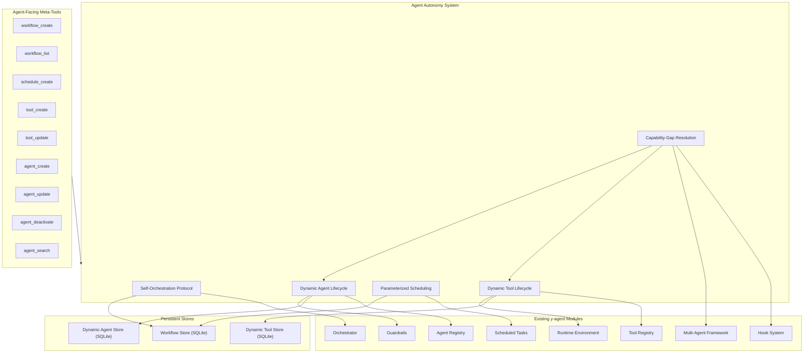
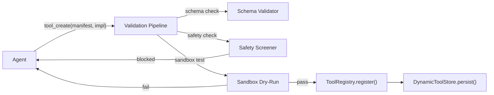
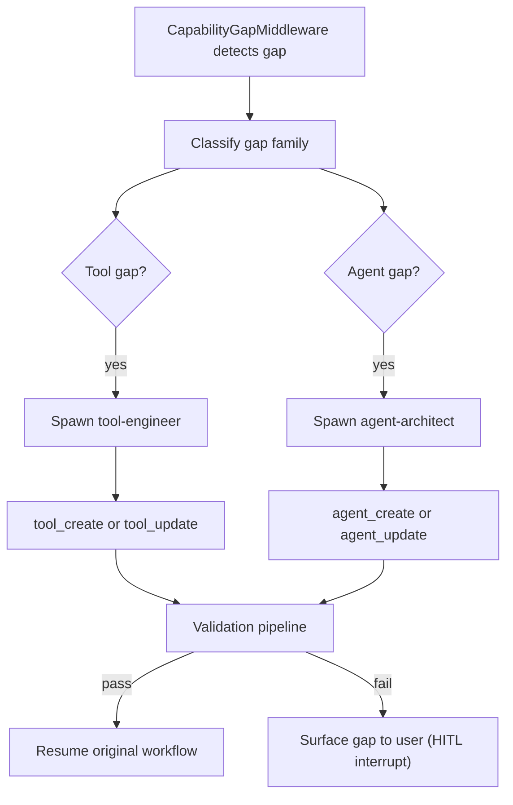
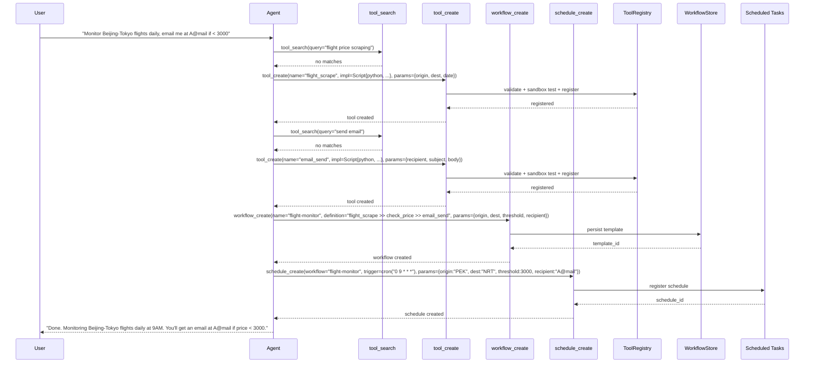
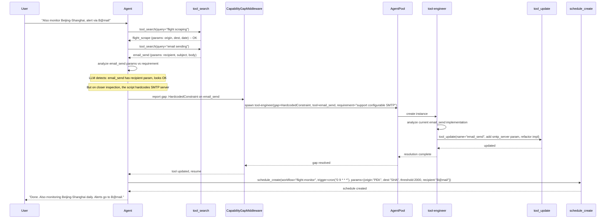
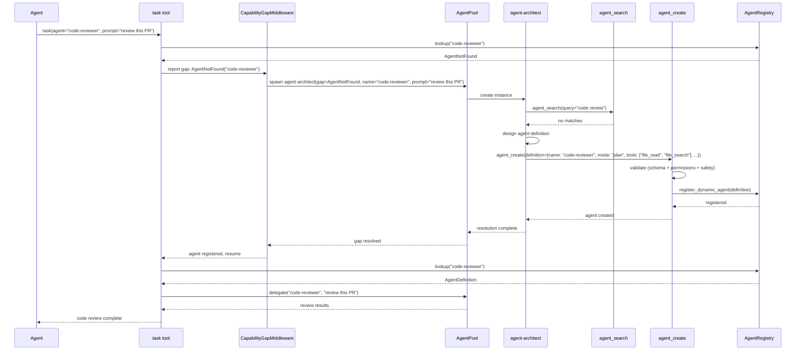
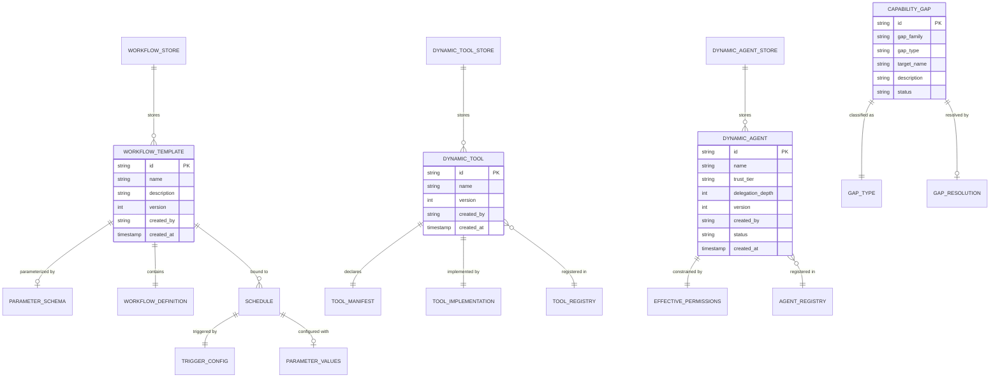

# Agent Autonomy Design

> Self-orchestration, dynamic tool lifecycle, parameterized scheduling, capability-gap resolution, and dynamic agent lifecycle for y-agent

**Version**: v0.2
**Created**: 2026-03-06
**Updated**: 2026-03-07
**Status**: Draft

---

## TL;DR

The Agent Autonomy system closes the loop between agent intelligence and agent capability. Five mechanisms enable agents to evolve their own operational toolkit without code changes: (1) **Self-Orchestration Protocol** lets agents create, persist, and manage reusable workflow templates via meta-tools; (2) **Dynamic Tool Lifecycle** lets agents define, validate, sandbox, and register runtime-created tools (scripts, HTTP APIs, composite chains); (3) **Parameterized Scheduling** enhances the scheduler with JSON Schema parameter definitions for workflow reuse across varied inputs; (4) **Capability-Gap Resolution** provides a CapabilityGapMiddleware that detects missing or inadequate tools/agents and triggers resolution automatically; (5) **Dynamic Agent Lifecycle** lets agents create, update, deactivate, and search sub-agent definitions at runtime via meta-tools, with permission inheritance, trust hierarchy, and an AgentGapMiddleware that detects when a needed agent does not exist and spawns a specialized `agent-architect` to design one. Together, these enable scenarios where an agent not only builds a complete monitoring pipeline today but also creates the specialized sub-agents needed to operate and maintain it -- without human intervention on the implementation side.

---

## Background and Goals

### Background

y-agent's current design excels at executing predefined workflows and using registered tools. However, a critical class of real-world scenarios requires the agent to go beyond execution into capability construction:

**Motivating Scenario**: A user asks the agent to monitor daily Beijing-Tokyo flight prices and send an email alert if prices drop below a threshold. The agent needs to:

1. Create a flight-scraping tool (no existing tool covers this).
2. Create an email-sending tool.
3. Compose these tools into a workflow (scrape, check price, conditionally email).
4. Bind the workflow to a daily cron schedule.
5. The next day, when the user requests Beijing-Shanghai monitoring with a different email recipient, the agent must detect that the email tool has a hardcoded recipient, refactor it to accept a parameter, and create a new schedule instance with different parameter values.

Current design gaps that block this scenario:

| Gap | Current State | Required State |
|-----|--------------|----------------|
| **Workflow persistence** | Orchestrator executes workflows but does not persist definitions for reuse | Agent-created workflows stored in WorkflowStore, retrievable by name/tags |
| **Dynamic tool creation** | ToolRegistry accepts tools at startup or via skill ingestion pipeline; no runtime creation API | Agent can create tools via `tool_create` meta-tool; tools validated and sandboxed |
| **Parameterized scheduling** | Scheduled tasks use static `input_template` with simple variable interpolation | Parameter schemas with JSON Schema validation; clone schedules with different parameters |
| **Capability-gap detection** | No mechanism to detect when existing tools are inadequate for a new request | CapabilityGapMiddleware detects tool and agent gaps; auto-resolution via specialized sub-agents |
| **Dynamic agent creation** | AgentDefinition is static TOML; AgentRegistry only accepts definitions at startup; no runtime creation API | Agent can create, update, and deactivate sub-agent definitions at runtime via meta-tools; permission inheritance ensures delegation safety |

### Goals

| Goal | Measurable Criteria |
|------|-------------------|
| **Agent-driven workflow creation** | Agent can create, persist, and retrieve workflow templates via tool calls; workflow store survives restarts |
| **Dynamic tool registration** | Agent can register a new tool at runtime in < 5s; tool immediately usable in subsequent calls |
| **Parameterized schedule reuse** | Same workflow template bindable to N schedules with different parameters; parameter validation at bind time |
| **Automatic gap resolution** | CapabilityGapMiddleware detects tool and agent capability gaps and triggers resolution within the same session; resolution success rate > 80% for parameter-mismatch, tool-not-found, and agent-not-found gaps |
| **Security invariant** | Dynamic tools always execute in Runtime sandbox; no dynamic tool can bypass capability checks |
| **Permission inheritance invariant** | Dynamic agents' effective permissions are the intersection of their declared permissions and their creator's permissions at creation time (snapshot model); no dynamic agent can exceed its creator's authority |
| **Agent-driven agent creation** | Agent can create a new sub-agent definition in < 2s; definition immediately usable for delegation; definition persists across restarts |
| **Persistence** | All agent-created artifacts (workflows, tools, schedules, agent definitions) persist across agent restarts |

### Assumptions

1. Dynamic tools are always sandboxed in the Runtime environment (Docker container by default); they never execute in the host process.
2. Tool creation requires implicit user consent (configurable: auto-approve for low-risk tools, HITL approval for dangerous tools).
3. The agent uses LLM reasoning to design tool implementations; the quality of generated tools depends on the LLM's coding capability.
4. WorkflowStore, DynamicToolStore, and DynamicAgentStore use SQLite, consistent with the existing checkpoint storage backend.
5. Capability-gap resolution is best-effort; unresolvable gaps surface to the user as HITL interrupts.
6. Dynamic agents cannot create further dynamic agents by default; `delegation_depth` is decremented on each level. This prevents unbounded recursive agent creation.
7. Dynamic agent definitions are soft-deleted (deactivated) rather than hard-deleted, preserving experience records and enabling reactivation.

---

## Scope

### In Scope

- **Self-Orchestration Protocol**: WorkflowStore persistence, `workflow_create` / `workflow_list` / `workflow_get` meta-tools, workflow template versioning
- **Dynamic Tool Lifecycle**: DynamicToolDefinition format, `tool_create` / `tool_update` meta-tools, three implementation types (Script, HttpApi, Composite), validation pipeline, sandbox-by-default policy, DynamicToolStore persistence
- **Parameterized Scheduling**: ParameterSchema on workflow templates and schedule bindings, parameter validation at bind time, runtime parameter resolution, `schedule_create` / `schedule_list` meta-tools
- **Capability-Gap Resolution**: CapabilityGapMiddleware (unified, replaces ToolGapMiddleware) in ToolMiddleware chain, tool gap types (NotFound, ParameterMismatch, HardcodedConstraint) + agent gap types (AgentNotFound, CapabilityMismatch, ModeInappropriate), `tool-engineer` and `agent-architect` built-in agent definitions, resolution protocol with fallback to HITL
- **Dynamic Agent Lifecycle**: DynamicAgentDefinition format, `agent_create` / `agent_update` / `agent_deactivate` / `agent_search` meta-tools, permission inheritance (snapshot model), three-tier trust hierarchy (built-in > user-defined > dynamic), DynamicAgentStore persistence, AgentRegistry dynamic registration APIs, `agent-architect` built-in agent definition
- Integration with existing modules: Orchestrator, Tool Registry, Scheduled Tasks, Multi-Agent, Hook System, Runtime, Guardrails

### Out of Scope

- Auto-generated compiled code (Rust, C); dynamic tools are interpreted (Python, shell) or declarative (HTTP, composite)
- Distributed workflow template sharing across y-agent instances
- Tool or agent marketplace or publishing
- Automatic testing of generated tools (deferred; quality relies on LLM and sandbox validation)
- GUI for workflow/tool/agent creation (agent-driven via tool calls only)
- Persistent long-running dynamic agent instances (dynamic agents follow the same ephemeral instance model as static agents)

---

## High-Level Design

### Architecture Overview



**Diagram type rationale**: Flowchart chosen to show the five autonomy subsystems, their agent-facing meta-tools, and integration with existing y-agent modules.

**Legend**:
- **Agent Autonomy System**: Five capabilities introduced by this design.
- **Meta-Tools**: Built-in tools callable by the agent to exercise autonomy capabilities.
- **Existing Modules**: Current y-agent modules that the autonomy system integrates with.
- **Persistent Stores**: New SQLite-backed stores for workflow templates and dynamic tools.

### Self-Orchestration Protocol

The Self-Orchestration Protocol enables agents to create, persist, and manage reusable workflow templates. A `WorkflowStore` provides persistent storage for workflow definitions, extending the Orchestrator's existing in-memory workflow execution.

| Component | Responsibility |
|-----------|---------------|
| **WorkflowStore** | CRUD operations on workflow templates; SQLite-backed; survives restarts |
| **TemplateVersioning** | Semantic versioning on templates; agents can update templates without breaking active schedules |
| **workflow_create** | Meta-tool: agent provides workflow definition (DSL or structured), name, description, parameter schema; system validates and persists |
| **workflow_list** | Meta-tool: query templates by name, tags, or creator |
| **workflow_get** | Meta-tool: retrieve a specific template with its full definition and parameter schema |

The agent creates workflows using the same definition formats the Orchestrator already supports (TOML or Expression DSL), but wraps them in a `WorkflowTemplate` with metadata and an optional `ParameterSchema`.

### Dynamic Tool Lifecycle

The Dynamic Tool Lifecycle allows agents to define, validate, and register new tools at runtime. Three implementation types cover the common patterns:

| Implementation Type | Description | Use Case |
|--------------------|-------------|----------|
| **Script** | Python or shell script with defined entrypoint and parameter mapping | Web scraping, data processing, custom API calls |
| **HttpApi** | Declarative HTTP endpoint with method, headers, parameter-to-body/query mapping | REST API integrations, webhook calls |
| **Composite** | Ordered chain of existing registered tools with data mapping between steps | Multi-step operations composed from existing tools |

All dynamic tools are wrapped in a `ToolManifest` and validated through the same pipeline as statically registered tools (JSON Schema parameter validation, capability declaration). The critical security constraint: **dynamic tools always execute inside a Runtime sandbox** (Docker container), regardless of their `is_dangerous` flag.



**Diagram type rationale**: Flowchart chosen to show the validation pipeline that dynamic tools must pass before registration.

**Legend**:
- **Validation Pipeline**: Three-stage validation: schema correctness, safety screening, sandbox dry-run.
- **Sandbox Dry-Run**: Executes the tool with synthetic inputs in a sandboxed container to verify it runs without errors.
- Only tools that pass all three stages are registered and persisted.

### Parameterized Scheduling

The Parameterized Scheduling enhancement extends the Scheduled Tasks module with a proper `ParameterSchema` on workflow bindings. This enables the same workflow template to be reused across multiple schedules with different parameter values.

| Enhancement | Description |
|-------------|-------------|
| **ParameterSchema** | JSON Schema attached to WorkflowTemplate; defines required/optional parameters with types, constraints, defaults |
| **Parameter Validation** | Parameters validated against schema at schedule creation time; invalid parameters rejected with clear errors |
| **Runtime Resolution** | Parameters resolved at trigger time; supports static values, trigger context (time, event payload), and expression evaluation |
| **Schedule Cloning** | `schedule_create` can reference an existing schedule as a template, overriding only the changed parameters |

### Capability-Gap Resolution (Unified)

The Capability-Gap Resolution system detects when the agent's current tool or agent inventory is insufficient for a task and triggers automatic resolution. With the addition of the Dynamic Agent Lifecycle, this subsystem unifies tool gaps and agent gaps under a single **CapabilityGapMiddleware** (replacing the previous ToolGapMiddleware).

**Tool Gap Types** (unchanged):

| Gap Type | Detection | Example |
|----------|-----------|---------|
| **NotFound** | Agent requests a tool that does not exist in the registry | "I need a flight_scrape tool but none exists" |
| **ParameterMismatch** | Tool exists but its parameter schema lacks required fields | "email_send exists but has no `recipient` parameter" |
| **HardcodedConstraint** | LLM analysis determines internal behavior is hardcoded | "email_send always sends to a fixed address" |

**Agent Gap Types** (new):

| Gap Type | Detection | Example |
|----------|-----------|---------|
| **AgentNotFound** | Delegation targets an agent name not in AgentRegistry (structural) | "I need a code-reviewer agent but none exists" |
| **CapabilityMismatch** | Agent exists but its tools/skills do not cover the delegation prompt (LLM-assisted) | "data-analyst exists but lacks web_search for this task" |
| **ModeInappropriate** | Agent's mode is incompatible with required operation type (structural) | "researcher is explore-mode but this task needs build-mode execution" |

**Unified Resolution Protocol**:



**Diagram type rationale**: Flowchart chosen to show the unified decision tree for both tool and agent gap detection, classification, and resolution.

**Legend**:
- **CapabilityGapMiddleware**: Unified middleware that handles both tool gaps and agent gaps in the same middleware chain.
- Tool gaps route to `tool-engineer`; agent gaps route to `agent-architect`.
- Resolution always goes through the relevant validation pipeline; failures escalate to HITL.

### Built-in Agent: tool-engineer

```toml
[agent]
name = "tool-engineer"
role = "Specialized agent for creating, modifying, and refactoring dynamic tools"
mode = "build"

[agent.model]
preferred = ["claude-sonnet", "gpt-4o"]
fallback = ["gpt-4o-mini"]
temperature = 0.2

[agent.tools]
allowed = ["tool_create", "tool_update", "tool_search", "file_read", "file_write", "shell_exec"]
denied = []

[agent.context]
sharing = "filtered"
max_tokens = 8192

[agent.limits]
max_iterations = 15
max_tool_calls = 30
timeout = "3m"

[agent.instructions]
system = """
You are a tool engineer. Your job is to create or modify dynamic tools for the y-agent system.
When creating a tool:
1. Analyze the capability gap description
2. Design the tool's parameter schema (make all variable aspects configurable)
3. Implement the tool (Python script, HTTP API, or composite)
4. Register it via tool_create or tool_update
When modifying a tool:
1. Retrieve the current tool definition
2. Identify hardcoded values that should be parameters
3. Refactor the implementation to accept parameters
4. Register the updated version via tool_update
Always prefer parameterization over hardcoding. Every value that might vary across use cases should be a parameter.
"""
```

### Dynamic Agent Lifecycle

The Dynamic Agent Lifecycle enables agents to create, update, deactivate, and search sub-agent definitions at runtime. This is the "agent manages agent" meta-capability that makes the y-agent system truly self-evolving.

#### Core Concepts

| Concept | Description |
|---------|-------------|
| **DynamicAgentDefinition** | A runtime-created AgentDefinition plus metadata: `created_by`, `trust_tier`, `version`, `effective_permissions`, `delegation_depth`. Follows the same TOML schema as static AgentDefinitions. |
| **Trust Hierarchy** | Three tiers: `built-in` > `user-defined` > `dynamic`. Mirrors the tool trust model. Dynamic agents receive the lowest default trust. Risk scoring in the Permission Model incorporates the trust tier. |
| **Permission Inheritance** | `effective_permissions = intersection(declared_permissions, creator_permissions_at_creation_time)`. This is a snapshot model: the creator's permission set is captured once at agent creation time. If the creator's permissions are later reduced, existing dynamic agents are not retroactively affected (consistent with the scheduled task model). |
| **Permission Scope Dimensions** | `tools.allowed` (must be subset of creator's), `tools.denied` (must be superset of creator's), `limits` (each limit <= creator's limit). |
| **Delegation Depth** | Starts at the creator's current depth minus 1. When depth reaches 0, the agent cannot create further dynamic agents. Default initial depth for top-level agents: 2. |

#### Validation Pipeline

Dynamic agent definitions go through a three-stage validation pipeline (no sandbox dry-run, since agent behavior is LLM-reasoning-dependent):

| Stage | Checks | Failure Action |
|-------|--------|---------|
| **Schema Validation** | Valid TOML schema, required fields (name, role, mode), mode enum, model names in provider pool | Reject with schema errors |
| **Permission Validation** | Permission inheritance rule (effective_permissions = intersection), delegation depth check (> 0), tool allowlist subset check | Reject with permission violation details |
| **Safety Screening** | System prompt injection patterns, dangerous tool combination heuristics (e.g., shell_exec + network + no denied tools) | Reject with safety flags or escalate to HITL |

Risk-based HITL rules for `agent_create`:
- **Auto-approve**: No shell_exec, no network tools, delegation_depth <= 1
- **HITL required**: shell_exec or file_write in allowed tools, delegation_depth > 1, or safety screening flags

#### AgentGapMiddleware

The AgentGapMiddleware is a component within the unified CapabilityGapMiddleware that handles agent-specific gaps. Three agent gap types:

| Gap Type | Detection Method |
|----------|-----------------|
| **AgentNotFound** | Structural: delegation targets a name not in AgentRegistry |
| **CapabilityMismatch** | LLM-assisted: agent exists but its declared tools/skills do not cover the delegation prompt |
| **ModeInappropriate** | Structural: delegation requests a mode incompatible with the agent's declared modes |

Resolution: spawn `agent-architect` -> design definition -> validate -> register -> resume original delegation. Unresolvable gaps escalate to HITL.

### Built-in Agent: agent-architect

```toml
[agent]
name = "agent-architect"
role = "Specialized agent for designing and creating sub-agent definitions"
mode = "plan"

[agent.model]
preferred = ["claude-sonnet", "gpt-4o"]
fallback = ["gpt-4o-mini"]
temperature = 0.3

[agent.tools]
allowed = ["agent_create", "agent_update", "agent_deactivate", "agent_search", "tool_search", "file_read"]
denied = ["shell_exec", "file_write"]

[agent.context]
sharing = "filtered"
max_tokens = 8192

[agent.limits]
max_iterations = 10
max_tool_calls = 20
timeout = "2m"

[agent.instructions]
system = """
You are an agent architect. Your job is to design and create sub-agent definitions for the y-agent system.
When an agent gap is detected:
1. Analyze the capability gap description and the original delegation prompt
2. Search existing agents to avoid duplication (agent_search)
3. Search available tools to determine what tools the new agent should have access to (tool_search)
4. Design the agent definition: choose appropriate mode, model, tools, skills, context strategy, and limits
5. Write clear, focused system instructions that define the agent's role and behavior
6. Register the definition via agent_create
Design principles:
- Each agent should have a single, clear responsibility
- Prefer narrow tool allowlists over broad access
- Set conservative resource limits (iterations, tool calls, timeout)
- Use the most appropriate mode: plan for analysis, build for implementation, explore for research
- Never include shell_exec or file_write unless the gap specifically requires them
"""
```

The `agent-architect` operates in `plan` mode with no write access (`shell_exec` and `file_write` are denied). It can only design agent definitions, not execute arbitrary code. This is a deliberate security separation from the `tool-engineer`, which requires build-mode write access to create tool implementations.

### Meta-Tools Summary

| Tool | Category | Description | Key Parameters |
|------|----------|-------------|----------------|
| `workflow_create` | Orchestration | Create and persist a workflow template | `name`, `description`, `definition` (DSL or TOML), `parameter_schema`, `tags` |
| `workflow_list` | Orchestration | List available workflow templates | `filter` (name, tags, creator), `limit` |
| `workflow_get` | Orchestration | Retrieve a workflow template by ID or name | `id` or `name` |
| `schedule_create` | Scheduling | Create a schedule binding workflow to trigger | `workflow_template`, `trigger` (cron/interval/event), `parameters`, `policy` |
| `schedule_list` | Scheduling | List active and paused schedules | `filter` (workflow, status, tags) |
| `tool_create` | Meta | Define and register a new dynamic tool | `manifest` (name, description, parameters, capabilities), `implementation` (script/http/composite) |
| `tool_update` | Meta | Update an existing dynamic tool | `tool_name`, `manifest_patch`, `implementation_patch` |
| `agent_create` | Meta | Create and register a new dynamic agent definition | `definition` (TOML: name, role, mode, model, tools, instructions), `tags` |
| `agent_update` | Meta | Update an existing dynamic agent definition | `agent_name`, `definition_patch` (partial TOML update) |
| `agent_deactivate` | Meta | Soft-delete a dynamic agent definition | `agent_name`, `reason` |
| `agent_search` | Meta | Search agent definitions by name, role, capability, or tags | `query`, `names`, `filter` (mode, trust_tier, status) |

---

## Key Flows/Interactions

### End-to-End: Flight Monitoring Pipeline Construction



**Diagram type rationale**: Sequence diagram chosen to show the complete temporal flow of the motivating scenario from user request to fully operational scheduled pipeline.

**Legend**:
- The agent first searches for existing tools, finds none, and creates them dynamically.
- The workflow is created with parameterized inputs and persisted for reuse.
- The schedule binds the workflow to a cron trigger with specific parameter values.

### Capability-Gap Detection and Resolution



**Diagram type rationale**: Sequence diagram chosen to show the capability-gap detection and automatic resolution flow with sub-agent delegation.

**Legend**:
- The agent detects a HardcodedConstraint gap during tool analysis.
- CapabilityGapMiddleware spawns the tool-engineer agent to refactor the tool.
- After resolution, the original agent resumes and creates the new schedule.

### Agent Gap Detection and Resolution



**Diagram type rationale**: Sequence diagram chosen to show the complete agent gap detection and auto-resolution flow, from initial delegation failure through agent-architect resolution to successful delegation.

**Legend**:
- The primary agent attempts to delegate to a non-existent agent.
- CapabilityGapMiddleware spawns agent-architect to design the missing agent.
- After validation and registration, the original delegation is retried successfully.

---

## Data and State Model

### Core Entities



**Diagram type rationale**: ER diagram chosen to show the structural relationships between the new persistent entities.

**Legend**:
- **WorkflowTemplate** links to ParameterSchema and is bound to one or more Schedules.
- **DynamicTool** wraps a ToolManifest and ToolImplementation; registered in the existing ToolRegistry.
- **DynamicAgent** wraps an AgentDefinition with trust tier, delegation depth, and effective permissions; registered in AgentRegistry.
- **CapabilityGap** tracks detected tool and agent gaps and their resolutions for observability and learning.

### WorkflowTemplate

```rust
struct WorkflowTemplate {
    id: WorkflowTemplateId,
    name: String,
    description: String,
    definition: WorkflowDefinition,
    parameter_schema: Option<JsonSchema>,
    tags: Vec<String>,
    created_by: CreatorId,
    version: u64,
    created_at: Timestamp,
    updated_at: Timestamp,
}
```

### DynamicToolDefinition

```rust
struct DynamicToolDefinition {
    manifest: ToolManifest,
    implementation: ToolImplementation,
    source: ToolSource,
    version: u64,
    created_by: CreatorId,
    created_at: Timestamp,
}

enum ToolImplementation {
    Script {
        language: ScriptLanguage,
        code: String,
        entrypoint: String,
        dependencies: Vec<String>,
    },
    HttpApi {
        base_url: String,
        method: HttpMethod,
        headers: HashMap<String, String>,
        body_template: Option<String>,
        response_extract: Option<JsonPath>,
    },
    Composite {
        steps: Vec<CompositeStep>,
    },
}

enum ScriptLanguage { Python, Shell, JavaScript }

struct CompositeStep {
    tool_name: String,
    input_mapping: HashMap<String, InputSource>,
    output_key: String,
}
```

### ParameterSchema

Workflow templates and schedule bindings share a `ParameterSchema` defined using JSON Schema:

```rust
struct ParameterSchema {
    schema: JsonSchema,
    defaults: HashMap<String, Value>,
    examples: Vec<HashMap<String, Value>>,
}
```

At schedule creation time, the provided `parameter_values` are validated against the schema. At trigger time, values are resolved through the expression evaluation engine, supporting:

| Source | Syntax | Example |
|--------|--------|---------|
| Static value | literal | `"PEK"` |
| Trigger context | `{{ trigger.time }}` | ISO 8601 timestamp of trigger fire |
| Event payload | `{{ event.payload.path }}` | Payload field from event trigger |
| Expression | `{{ now() - 1d }}` | Computed expression |

### DynamicAgentDefinition

```rust
struct DynamicAgentDefinition {
    id: DynamicAgentId,
    definition: AgentDefinition,     // reuses the standard AgentDefinition schema
    source: AgentSource,
    trust_tier: TrustTier,
    effective_permissions: EffectivePermissions,
    delegation_depth: u32,
    version: u64,
    status: AgentStatus,
    created_by: CreatorId,
    created_at: Timestamp,
    updated_at: Timestamp,
    deactivated_at: Option<Timestamp>,
    deactivation_reason: Option<String>,
}

enum AgentSource { BuiltIn, UserDefined, Dynamic { creator_agent_id: AgentInstanceId } }
enum TrustTier { BuiltIn, UserDefined, Dynamic }
enum AgentStatus { Active, Deactivated }

struct EffectivePermissions {
    tools_allowed: Vec<String>,       // intersection with creator
    tools_denied: Vec<String>,        // union with creator
    max_iterations: u32,              // min(declared, creator)
    max_tool_calls: u32,              // min(declared, creator)
    max_tokens: u64,                  // min(declared, creator)
    delegation_depth: u32,            // creator.depth - 1
}
```

### CapabilityGap

```rust
struct CapabilityGap {
    id: GapId,
    gap_family: GapFamily,
    gap_type: GapType,
    context: GapContext,
    status: GapStatus,
    resolution: Option<GapResolution>,
    detected_at: Timestamp,
    resolved_at: Option<Timestamp>,
}

enum GapFamily { Tool, Agent }

enum GapType {
    // Tool gaps
    ToolNotFound { desired_capability: String },
    ParameterMismatch { tool_name: String, missing_params: Vec<String> },
    HardcodedConstraint { tool_name: String, constraint_description: String },
    // Agent gaps
    AgentNotFound { desired_agent: String, delegation_prompt: String },
    CapabilityMismatch { agent_name: String, missing_capabilities: Vec<String> },
    ModeInappropriate { agent_name: String, current_mode: String, required_mode: String },
}

enum GapStatus { Detected, Resolving, Resolved, Unresolvable, EscalatedToUser }

struct GapResolution {
    resolution_type: ResolutionType,
    target_name: String,             // tool name or agent name
    resolver_agent_id: Option<AgentInstanceId>,
    changes_made: String,
}

enum ResolutionType {
    ToolCreated, ToolUpdated, ToolRefactored,
    AgentCreated, AgentUpdated,
    UserResolved,
}
```

---

## Failure Handling and Edge Cases

| Scenario | Handling |
|----------|---------|
| Dynamic tool sandbox test fails | Return detailed error to agent; agent can revise implementation and retry `tool_create` |
| Dynamic tool creates security violation (network access, file escape) | Caught by Runtime capability checks; tool rejected with `PermissionDenied`; never registered |
| Workflow template references non-existent tool | Validation at `workflow_create` time checks all tool names against ToolRegistry; rejects with list of missing tools |
| Schedule parameter validation fails | `schedule_create` returns `ValidationError` with specific schema violations; agent can correct parameters |
| tool-engineer agent fails to resolve gap | Gap status set to `Unresolvable`; CapabilityGapMiddleware escalates to user via HITL interrupt |
| tool-engineer exceeds iteration/timeout limits | Agent instance terminated; gap escalated to user |
| Concurrent tool_update during active schedule execution | Running workflow instances continue with the tool version captured at execution start; new executions use updated tool |
| Dynamic tool dependency unavailable (Python package not installed) | Sandbox dry-run detects import failure; `tool_create` returns error suggesting dependency addition |
| WorkflowStore SQLite corruption | Standard SQLite WAL recovery; worst case: templates rebuilt from agent conversation history |
| Circular composite tool (tool A calls tool B which calls tool A) | Composite tool validation detects cycles at registration time; rejects with `CircularDependency` error |
| Agent creates excessive dynamic tools (resource exhaustion) | Configurable limit on dynamic tools per workspace (default: 100); exceeding triggers cleanup of unused tools |
| HardcodedConstraint gap detection false positive | Agent's LLM-based analysis may incorrectly flag a tool; resolution attempt fails validation; falls back to HITL |
| agent_create with tools not in creator's allowlist | Permission validation rejects immediately; returns `PermissionViolation` with details on which tools exceeded scope |
| Dynamic agent attempts to create further dynamic agents (depth exhaustion) | `delegation_depth` check fails; `agent_create` returns `DelegationDepthExhausted` error |
| agent-architect fails to design valid agent definition | Gap status set to `Unresolvable`; CapabilityGapMiddleware escalates to user via HITL interrupt |
| Agent name collision between dynamic and static agents | Dynamic agent names are prefixed with `dyn:` internally to avoid collision; search returns both with source tags |
| Dynamic agent deactivation while instances are running | Running instances complete normally; new delegation requests receive `AgentDeactivated` error; reactivation possible via `agent_update` |
| Agent creates excessive dynamic agents | Configurable limit on dynamic agents per workspace (default: 50); exceeding triggers HITL escalation |

---

## Security and Permissions

| Concern | Approach |
|---------|----------|
| **Dynamic tool sandboxing** | All dynamic tools execute in Runtime sandbox (Docker container) regardless of `is_dangerous` flag. Dynamic tools never run in the host process. This is a hard invariant, not configurable. |
| **Tool creation approval** | Configurable per risk level: auto-approve for tools with no network/filesystem capabilities; HITL approval for tools requiring network, filesystem, or process capabilities. Controlled by the Guardrails Permission Model. |
| **Script injection** | Dynamic tool scripts are stored as opaque blobs; never executed outside the sandbox. Script content is validated for known dangerous patterns (rm -rf, curl to untrusted hosts) during safety screening. |
| **Parameter schema trust** | Parameter schemas for dynamic tools are validated using the same JSON Schema validator as static tools. No schema bypass for dynamic tools. |
| **tool-engineer agent scope** | The tool-engineer agent has access to `tool_create`, `tool_update`, and read/write/shell tools but operates within its own session branch with resource limits. Cannot modify non-dynamic tools. |
| **Workflow template trust** | Agent-created workflow templates go through the same validation as TOML-defined workflows (DAG cycle detection, tool existence checks). Templates are flagged as agent-created vs user-created for audit. |
| **Schedule creation authority** | Schedule creation inherits the session's permission context. Scheduled executions run with the schedule creator's permission set, not elevated privileges. |
| **Dynamic agent permission inheritance** | `effective_permissions = intersection(declared, creator_at_creation_time)`. No dynamic agent can exceed its creator's authority. Validated at `agent_create` time; violation causes rejection. |
| **Delegation depth limit** | Prevents unbounded recursive agent creation. Each level decrements depth by 1; at 0, `agent_create` is denied. Default initial depth: 2. |
| **agent-architect agent scope** | The agent-architect has `plan` mode with no `shell_exec` or `file_write`. It can only design definitions, not execute code. Deliberate security separation from `tool-engineer`. |
| **Dynamic agent trust tier** | Dynamic agents receive `Dynamic` (lowest) trust tier. Risk scoring in the Permission Model multiplies risk by `1.5x` for dynamic-trust agents (same multiplier as dynamic tools). |
| **Agent definition safety screening** | System prompt patterns (injection, prompt leaking) and dangerous tool combinations are flagged. High-risk definitions require HITL approval. |

---

## Performance and Scalability

### Performance Targets

| Metric | Target |
|--------|--------|
| `tool_create` end-to-end (validate + sandbox test + register + persist) | < 5s (dominated by sandbox startup) |
| `tool_update` (no sandbox re-test if implementation unchanged) | < 500ms |
| `workflow_create` (validate + persist) | < 100ms |
| `schedule_create` (validate params + register) | < 50ms |
| `agent_create` (validate + persist + register) | < 2s |
| `agent_update` (re-validate + persist) | < 500ms |
| `agent_search` (keyword match against definitions) | < 5ms |
| WorkflowStore query (list templates) | < 10ms for 100 templates |
| DynamicToolStore query | < 10ms for 100 dynamic tools |
| DynamicAgentStore query | < 10ms for 50 dynamic agents |
| CapabilityGapMiddleware overhead (no gap detected) | < 1ms |
| tool-engineer agent resolution | < 60s typical (depends on gap complexity) |
| agent-architect agent resolution | < 30s typical (no sandbox; definition-only) |

### Optimization Strategies

- **Warm container pool**: Reuse sandbox containers for sequential `tool_create` calls to avoid repeated startup overhead.
- **Schema validation caching**: Compiled JSON Schema validators for dynamic tool parameters are cached in memory after first use.
- **Lazy sandbox test**: For `HttpApi` and `Composite` tools, the sandbox dry-run can be skipped if the tool only references known-safe tools and endpoints. Feature flag: `dynamic_tool_lazy_sandbox`.
- **Template index**: WorkflowStore maintains an in-memory index of template names and tags for fast search; rebuilt from SQLite on startup.
- **Agent definition caching**: DynamicAgentStore maintains an in-memory cache of active agent definitions; rebuilt from SQLite on startup.

---

## Observability

| Signal | Metrics / Events |
|--------|-----------------|
| **Workflow templates** | `autonomy.templates.created`, `autonomy.templates.executions`, `autonomy.templates.versions` (by template name, creator type) |
| **Dynamic tools** | `autonomy.tools.created`, `autonomy.tools.updated`, `autonomy.tools.validation_failures`, `autonomy.tools.sandbox_failures` (by tool name, implementation type) |
| **Dynamic agents** | `autonomy.agents.created`, `autonomy.agents.updated`, `autonomy.agents.deactivated`, `autonomy.agents.validation_failures`, `autonomy.agents.permission_violations` (by agent name, trust tier, mode) |
| **Scheduling** | `autonomy.schedules.created`, `autonomy.schedules.parameter_validation_failures` (by workflow template) |
| **Capability gaps** | `autonomy.gaps.detected`, `autonomy.gaps.resolved`, `autonomy.gaps.escalated`, `autonomy.gaps.resolution_duration_ms` (by gap family, gap type) |
| **tool-engineer** | `autonomy.engineer.spawned`, `autonomy.engineer.succeeded`, `autonomy.engineer.failed`, `autonomy.engineer.duration_ms` |
| **agent-architect** | `autonomy.architect.spawned`, `autonomy.architect.succeeded`, `autonomy.architect.failed`, `autonomy.architect.duration_ms` |
| **Tracing** | Each `tool_create` / `workflow_create` / `schedule_create` / `agent_create` call creates a trace span; tool-engineer and agent-architect delegations create child spans linked to the parent agent span |

---

## Rollout and Rollback

### Phased Implementation

| Phase | Scope | Duration |
|-------|-------|----------|
| **Phase 1**: Dynamic Tool Foundation | DynamicToolDefinition format, `tool_create` meta-tool (Script type only), sandbox validation pipeline, DynamicToolStore persistence, ToolRegistry dynamic registration | 2-3 weeks |
| **Phase 2**: Self-Orchestration | WorkflowStore, `workflow_create` / `workflow_list` / `workflow_get` meta-tools, template versioning, Orchestrator integration | 2-3 weeks |
| **Phase 3**: Parameterized Scheduling | ParameterSchema on templates and schedules, `schedule_create` / `schedule_list` meta-tools, parameter validation and runtime resolution | 1-2 weeks |
| **Phase 4**: Capability-Gap Resolution (Tools) | CapabilityGapMiddleware (tool gaps), gap type classification, `tool-engineer` agent definition, resolution protocol, HITL fallback | 2-3 weeks |
| **Phase 5**: Dynamic Agent Lifecycle | DynamicAgentDefinition format, `agent_create` / `agent_update` / `agent_deactivate` / `agent_search` meta-tools, permission inheritance validation, DynamicAgentStore persistence, `agent-architect` agent definition, AgentRegistry dynamic registration | 2-3 weeks |
| **Phase 6**: Unified Gap Resolution and Advanced Types | Agent gap types (AgentNotFound, CapabilityMismatch, ModeInappropriate), unified CapabilityGapMiddleware, HttpApi and Composite tool types, `tool_update` meta-tool, HardcodedConstraint detection | 2-3 weeks |

### Rollback Plan

| Component | Rollback |
|-----------|----------|
| Dynamic tools | Feature flag `dynamic_tools`; disabled = `tool_create` returns `FeatureDisabled`; existing dynamic tools remain registered but non-updatable |
| Self-orchestration | Feature flag `self_orchestration`; disabled = `workflow_create` returns `FeatureDisabled`; existing templates still executable |
| Parameterized scheduling | Feature flag `parameterized_schedules`; disabled = schedules use static input_template (v0.1 behavior) |
| Capability-gap resolution | Feature flag `capability_gap_resolution`; disabled = CapabilityGapMiddleware becomes no-op; tool/agent errors returned directly to agent |
| Dynamic agents | Feature flag `dynamic_agents`; disabled = `agent_create` returns `FeatureDisabled`; existing dynamic agents remain registered but non-modifiable |
| tool-engineer agent | Deregister from AgentRegistry; tool gap resolution falls back to HITL for all tool gaps |
| agent-architect agent | Deregister from AgentRegistry; agent gap resolution falls back to HITL for all agent gaps |

---

## Alternatives and Trade-offs

### Dynamic Tool Implementation: Script-in-Sandbox vs WASM

| | Script-in-Sandbox (chosen) | WASM |
|-|---------------------------|------|
| **Language flexibility** | Python, shell, JavaScript (familiar to LLMs) | Rust, C, AssemblyScript |
| **LLM code generation quality** | High (LLMs excel at Python/shell) | Lower (WASM toolchains less common in training data) |
| **Security** | Container-level isolation | Memory-safe sandbox |
| **Startup latency** | 1-3s (container) | < 100ms |
| **Ecosystem** | Full OS package ecosystem | Limited WASI imports |

**Decision**: Script-in-sandbox. LLMs generate significantly better Python code than WASM-compatible languages. Container isolation is already available via the Runtime module. WASM can be added as an additional implementation type later.

### Gap Detection: Middleware vs Explicit Agent Reasoning

| | CapabilityGapMiddleware (chosen) | Agent self-assessment only |
|-|---------------------------|---------------------------|
| **Detection coverage** | Automatic for NotFound and ParameterMismatch (tool/agent); LLM-assisted for HardcodedConstraint and CapabilityMismatch | Depends entirely on agent reasoning quality |
| **Consistency** | Structural checks are deterministic | Non-deterministic; weaker LLMs may miss gaps |
| **Overhead** | < 1ms for structural checks | Zero (part of normal reasoning) |
| **Integration** | Integrates with Hook System for observability | No integration point |

**Decision**: CapabilityGapMiddleware for structural gap detection (both tools and agents), with LLM-assisted analysis for HardcodedConstraint (tools) and CapabilityMismatch (agents). The middleware catches the easy cases deterministically; the agent's reasoning handles the subtle cases.

### Workflow Persistence: SQLite vs Filesystem

| | SQLite (chosen) | TOML files on disk |
|-|----------------|-------------------|
| **Query capability** | Rich (filter by name, tags, date) | Glob + grep |
| **Atomicity** | Transactional | Manual rename pattern |
| **Consistency with existing stores** | Matches checkpoint storage backend | Different persistence pattern |
| **Human editability** | Requires tooling | Direct text editing |

**Decision**: SQLite. Consistent with the existing checkpoint and schedule storage backends. Templates can be exported to TOML files for human review via a CLI command.

### Tool Creation Approval: Always HITL vs Risk-Based

| | Always HITL | Risk-based (chosen) |
|-|------------|---------------------|
| **User friction** | High (every tool needs approval) | Low (only risky tools) |
| **Safety** | Maximum | High (sandbox provides baseline) |
| **Autonomy** | Limited | Practical autonomy for safe operations |

**Decision**: Risk-based approval using the existing Guardrails Permission Model. Tools with no network/filesystem/process capabilities are auto-approved (sandbox provides containment). Tools requiring dangerous capabilities trigger HITL approval via the Orchestrator's interrupt/resume protocol.

---

## Open Questions

| # | Question | Owner | Due Date | Status |
|---|----------|-------|----------|--------|
| 1 | Should dynamic tools support hot-reload (update takes effect for running workflows)? | Autonomy team | 2026-03-20 | Open |
| 2 | What is the maximum script size for a dynamic tool? Large scripts may indicate the need should be an Agent, not a Tool. | Autonomy team | 2026-03-27 | Open |
| 3 | Should the tool-engineer agent have access to web_search for finding API documentation and code examples? | Autonomy team | 2026-03-20 | Open |
| 4 | Should resolved capability gaps feed into the self-evolution pipeline as experience records? | Autonomy team | 2026-04-03 | Open |
| 5 | Should composite tools support conditional branching (if/else between steps), or only linear chains? | Autonomy team | 2026-04-03 | Open |
| 6 | How should dynamic tool dependencies (Python packages) be managed across sandbox containers? Pre-installed base image vs per-tool requirements.txt? | Autonomy team | 2026-03-27 | Open |
| 7 | Should dynamic agents inherit the creator's skills, or must skills be explicitly declared? | Autonomy team | 2026-04-10 | Open |
| 8 | Should deactivated dynamic agents be auto-reactivated if an AgentNotFound gap matches a deactivated agent's name? | Autonomy team | 2026-04-10 | Open |
| 9 | Should dynamic agents support versioned rollback (revert to previous definition version)? | Autonomy team | 2026-04-17 | Open |

---

## Decision Log

| # | Date | Decision | Rationale |
|---|------|----------|-----------|
| D1 | 2026-03-06 | Dynamic tools always sandbox in Runtime | Defense in depth; agent-generated code is untrusted by nature; sandbox-by-default eliminates an entire class of security risks |
| D2 | 2026-03-06 | Script-in-sandbox over WASM for dynamic tools | LLMs generate high-quality Python/shell; container isolation already available; WASM deferred until ecosystem matures |
| D3 | 2026-03-06 | SQLite for WorkflowStore and DynamicToolStore | Consistent with checkpoint storage; rich query capability; transactional safety |
| D4 | 2026-03-06 | Risk-based tool creation approval | Balances autonomy with safety; sandbox provides baseline containment; HITL for dangerous capabilities |
| D5 | 2026-03-06 | CapabilityGapMiddleware for structural detection + LLM for semantic detection | Structural checks are fast and deterministic; LLM reasoning handles subtle HardcodedConstraint and CapabilityMismatch cases |
| D6 | 2026-03-06 | Dedicated tool-engineer agent (not general agent) | Specialized system prompt and tool set produce higher quality tool implementations; clear separation of concerns |
| D7 | 2026-03-06 | Three dynamic tool implementation types: Script, HttpApi, Composite | Covers the dominant patterns: custom logic (Script), API integration (HttpApi), tool composition (Composite) |
| D8 | 2026-03-06 | ParameterSchema uses JSON Schema | Consistent with existing tool parameter validation; well-understood by LLMs; validates at bind time |
| D9 | 2026-03-07 | Permission inheritance uses snapshot model | Creator's permissions captured at creation time; consistent with scheduled task permission model; avoids cascading permission revocation complexity |
| D10 | 2026-03-07 | Three-tier trust hierarchy (built-in > user-defined > dynamic) | Mirrors the tool trust model; provides consistent risk scoring across tool and agent dimensions |
| D11 | 2026-03-07 | Delegation depth limit for dynamic agents | Prevents unbounded recursive agent creation; default depth 2 allows one level of meta-agent creation |
| D12 | 2026-03-07 | Dedicated agent-architect in plan mode (no write access) | Security separation: agent-architect designs definitions only; cannot execute code; reduces blast radius of agent-creation bugs |
| D13 | 2026-03-07 | Soft-delete (deactivate) for dynamic agents | Preserves experience records and audit trail; enables reactivation; avoids data loss from hard-delete |
| D14 | 2026-03-07 | Unified CapabilityGapMiddleware (replaces ToolGapMiddleware) | Single middleware handles both tool and agent gaps; consistent detection → resolution → HITL escalation flow; avoids middleware proliferation |

---

## Changelog

| Version | Date | Changes |
|---------|------|---------|
| v0.1 | 2026-03-06 | Initial design: Self-Orchestration Protocol, Dynamic Tool Lifecycle, Parameterized Scheduling, Capability-Gap Resolution, 7 meta-tools, tool-engineer agent definition |
| v0.2 | 2026-03-07 | Added Dynamic Agent Lifecycle (5th subsystem): DynamicAgentDefinition with trust hierarchy, permission inheritance (snapshot model), delegation depth, three-stage validation pipeline, AgentGapMiddleware; added `agent-architect` built-in agent definition (plan mode, no write access); added 4 agent meta-tools (`agent_create`, `agent_update`, `agent_deactivate`, `agent_search`); renamed ToolGapMiddleware to CapabilityGapMiddleware (unified); added 3 agent gap types (AgentNotFound, CapabilityMismatch, ModeInappropriate); expanded ER diagram and data model with DynamicAgentDefinition, EffectivePermissions, agent gap types; added DynamicAgentStore; added Agent Gap Detection flow; updated Failure Handling, Security, Performance, Observability, and Rollout sections |
