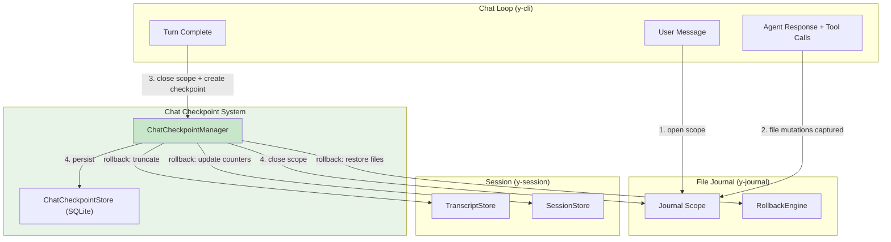
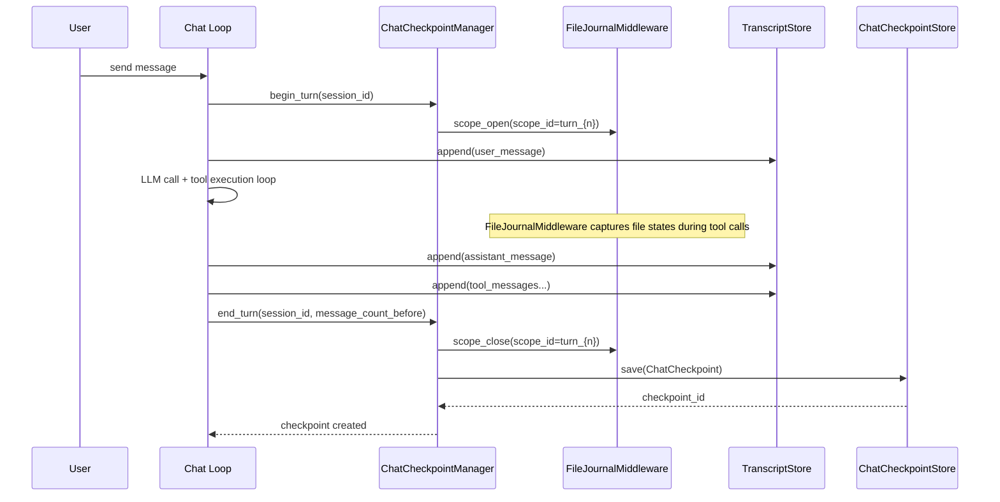
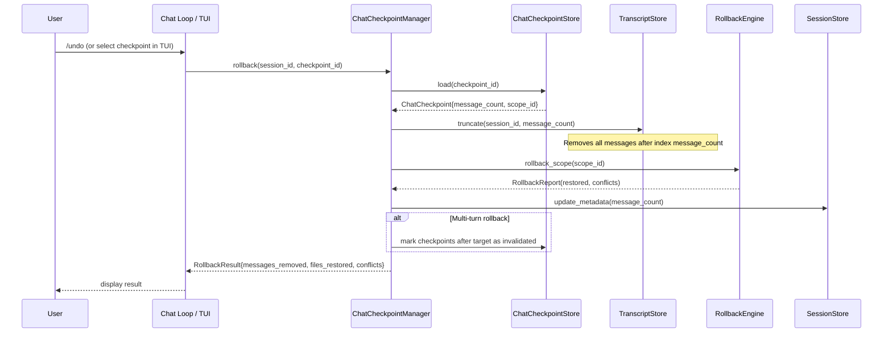
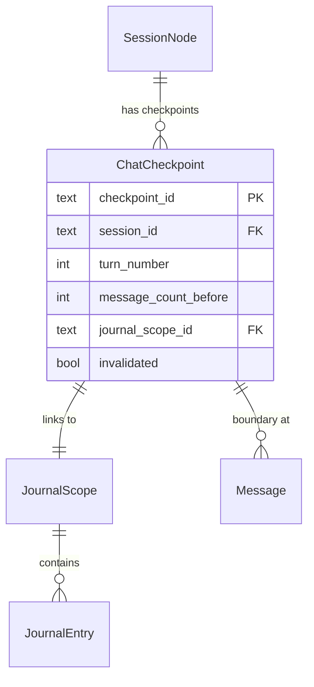

# Chat Checkpoint Design

> Turn-level checkpoint and rollback for interactive chat sessions

**Version**: v0.1
**Created**: 2026-03-11
**Updated**: 2026-03-11
**Status**: Draft

---

## TL;DR

y-agent provides two recovery mechanisms — Workflow Checkpoint (DAG state) and File Journal (filesystem) — but neither operates at the **chat turn granularity** that users expect from modern AI coding assistants (Cline, Cursor, Claude Code). When an agent produces an unsatisfactory response or makes incorrect file modifications, the user has no single action to "undo" that turn: the conversation history contains the unwanted messages, and modified files remain changed. The Chat Checkpoint system closes this gap by automatically creating a lightweight checkpoint after each **agent turn** (user message → assistant response + tool calls), linking the conversation position to a File Journal scope. A rollback operation truncates the transcript to the checkpoint boundary and invokes the File Journal to restore all files modified during that turn. The result is a Cline-style "undo last turn" experience: one command reverts both conversation state and filesystem state atomically.

---

## Background and Goals

### Background

Modern AI coding assistants provide checkpoint/rollback as a core UX feature:

| Product | Checkpoint Granularity | What Gets Rolled Back |
|---------|----------------------|----------------------|
| **Cline** | Per agent response | Files + conversation history |
| **Cursor** | Per agent response | Files + conversation history |
| **Claude Code** | Per tool call (implicit via /undo) | Files only (conversation retained) |

y-agent has the building blocks but lacks the coordination layer:

| Existing Component | What It Does | What It Cannot Do |
|-------------------|-------------|-------------------|
| File Journal (`y-journal`) | Captures file state before tool mutations; rollback by scope | Does not know which messages triggered the mutations |
| Workflow Checkpoint (`y-agent`) | Snapshots DAG channel/task state | Does not operate at chat message level |
| TranscriptStore (`y-core`) | Append-only JSONL message log | No truncation, no message-level addressing |
| Session Branch (`y-session`) | Creates a new session from a parent | Does not undo — creates a parallel timeline |

### Related Designs

| Module | Relationship |
|--------|-------------|
| [context-session-design.md](context-session-design.md) | Chat Checkpoint extends session management with turn-level addressing |
| [file-journal-design.md](file-journal-design.md) | Chat Checkpoint creates a journal scope per turn; rollback delegates to File Journal |
| [hooks-plugin-design.md](hooks-plugin-design.md) | Checkpoint creation can be implemented as a lifecycle hook |
| [client-layer-design.md](client-layer-design.md) | TUI/CLI expose checkpoint list and rollback commands |

### Goals

| Goal | Measurable Criteria |
|------|-------------------|
| **Automatic checkpointing** | 100% of completed agent turns produce a checkpoint without user intervention |
| **Atomic rollback** | Rollback restores both conversation history and filesystem to the checkpoint state in a single operation |
| **Low overhead** | Checkpoint creation adds < 2ms per turn (metadata write only; file capture is already handled by File Journal) |
| **User-accessible** | TUI displays checkpoint list; user can rollback to any checkpoint via command |
| **Idempotent rollback** | Rolling back to the same checkpoint multiple times produces identical results |
| **Multi-turn rollback** | User can rollback past multiple turns (e.g., undo last 3 turns) |

### Assumptions

1. File Journal (`y-journal`) is enabled and functioning. Chat Checkpoint depends on it for file-level rollback.
2. The `TranscriptStore` trait will be extended with a `truncate` method for removing messages beyond a given index.
3. `Message` struct will be extended with a unique `message_id` field for precise addressing.
4. Checkpoints are session-scoped and only affect the current session's transcript and associated file changes.

---

## Scope

### In Scope

- `ChatCheckpoint` data model linking turn boundaries to file journal scopes
- `ChatCheckpointStore` trait and SQLite implementation for checkpoint persistence
- Extensions to `Message` (add `message_id`) and `TranscriptStore` (add `truncate`)
- `ChatCheckpointManager` coordinating checkpoint creation and rollback
- Integration with File Journal scope lifecycle
- TUI checkpoint display and rollback command (`/undo`, `/checkpoint`)
- CLI checkpoint commands (`y-agent checkpoint list`, `y-agent checkpoint rollback`)

### Out of Scope

- Undoing LLM API costs (tokens consumed cannot be refunded)
- Reverting side effects of network-calling tools (e.g., HTTP requests, API calls)
- Distributed checkpoint synchronization across multiple agents
- Checkpoint compression or garbage collection (future optimization)

---

## High-Level Design

### Architecture Overview



**Diagram type rationale**: Flowchart chosen to show the data flow between the chat loop, checkpoint system, file journal, and session components during both checkpoint creation and rollback.

**Legend**:
- Green: Chat Checkpoint components (focus of this design).
- Numbers indicate execution order during checkpoint creation.
- Rollback arrows show the three operations executed during a rollback.

### Core Components

| Component | Responsibility | Crate |
|-----------|---------------|-------|
| **ChatCheckpointManager** | Coordinates checkpoint creation and rollback; bridges session and file journal | `y-session` |
| **ChatCheckpointStore** | Persists and queries checkpoint records (SQLite) | `y-storage` |
| **Message.message_id** | Unique identifier for each message, enabling precise transcript truncation | `y-core` |
| **TranscriptStore.truncate** | Removes messages after a given index, enabling conversation rollback | `y-core` / `y-storage` |

### Design Principles

| Principle | Application |
|-----------|-------------|
| **Composability** | Chat Checkpoint composes existing File Journal and TranscriptStore — it does not duplicate their functionality |
| **Minimal invasion** | Extends existing traits (`TranscriptStore`) and types (`Message`) rather than introducing parallel systems |
| **Fail-safe** | If checkpoint creation fails, the chat continues normally; if rollback partially fails (e.g., file conflict), the conversation is still truncated and conflicts are reported |
| **Scope alignment** | One chat turn = one File Journal scope = one checkpoint record. This 1:1:1 mapping simplifies reasoning and debugging |

---

## Key Flows/Interactions

### Flow 1: Checkpoint Creation (per agent turn)



**Diagram type rationale**: Sequence diagram chosen to show the temporal ordering of checkpoint creation within a single chat turn.

### Flow 2: Rollback to Checkpoint



**Diagram type rationale**: Sequence diagram chosen to show the three-phase rollback: transcript truncation, file restoration, and metadata update.

### Flow 3: Multi-Turn Rollback

When rolling back past multiple turns, the system processes checkpoints from newest to oldest:

1. Load target checkpoint (e.g., turn N-3)
2. Collect all journal scopes from turn N-2, N-1, and N
3. Truncate transcript to turn N-3's message_count
4. Rollback each scope in reverse order (N → N-1 → N-2)
5. Invalidate checkpoints N-2, N-1, N

---

## Data and State Model

### ChatCheckpoint Record

```rust
struct ChatCheckpoint {
    /// Unique checkpoint identifier.
    checkpoint_id: String,
    /// Session this checkpoint belongs to.
    session_id: SessionId,
    /// Turn number (1-indexed, incremented per user message).
    turn_number: u32,
    /// Number of messages in transcript BEFORE this turn started.
    /// Truncating to this count restores the pre-turn state.
    message_count_before: u32,
    /// File Journal scope ID associated with this turn.
    journal_scope_id: String,
    /// Whether this checkpoint has been invalidated (e.g., by a rollback past it).
    invalidated: bool,
    /// Timestamp when checkpoint was created.
    created_at: Timestamp,
}
```

### Database Schema

```sql
CREATE TABLE chat_checkpoints (
    checkpoint_id TEXT PRIMARY KEY,
    session_id TEXT NOT NULL,
    turn_number INTEGER NOT NULL,
    message_count_before INTEGER NOT NULL,
    journal_scope_id TEXT NOT NULL,
    invalidated INTEGER NOT NULL DEFAULT 0,
    created_at INTEGER NOT NULL,
    CONSTRAINT unique_session_turn UNIQUE (session_id, turn_number)
);

CREATE INDEX idx_chat_cp_session ON chat_checkpoints(session_id, turn_number DESC);
```

### Extended Message Model

```rust
/// A single message in a conversation.
struct Message {
    /// Unique message identifier (new field).
    pub message_id: String,
    pub role: Role,
    pub content: String,
    pub tool_call_id: Option<String>,
    pub tool_calls: Vec<ToolCallRequest>,
    pub timestamp: Timestamp,
    pub metadata: serde_json::Value,
}
```

### Extended TranscriptStore Trait

```rust
#[async_trait]
pub trait TranscriptStore: Send + Sync {
    // ... existing methods ...

    /// Truncate the transcript, keeping only the first `count` messages.
    /// Returns the number of messages removed.
    async fn truncate(
        &self,
        session_id: &SessionId,
        keep_count: usize,
    ) -> Result<usize, SessionError>;
}
```

### Entity Relationships



**Diagram type rationale**: ER diagram chosen to show how ChatCheckpoint bridges SessionNode and JournalScope.

---

## Failure Handling and Edge Cases

| Scenario | Handling |
|----------|---------|
| Checkpoint creation fails (SQLite error) | Log warning; chat continues without checkpoint for this turn. Next turn still creates a checkpoint. |
| Rollback encounters file conflict (third-party modification) | Transcript is still truncated (conversation rollback succeeds). File conflicts are reported in RollbackResult for user resolution. |
| Rollback of a turn with no file modifications | Transcript truncation only; File Journal rollback is a no-op (empty scope). |
| Rollback target checkpoint is invalidated | Return error: "checkpoint already rolled back". User must select an earlier checkpoint. |
| TranscriptStore.truncate fails mid-operation | JSONL rewrite is atomic (write to temp file, then rename). If rename fails, original transcript is preserved. |
| Multiple rapid rollbacks | Each rollback is serialized via session-level lock (inherited from message scheduling). |
| Rollback during active tool execution | Reject rollback if the session has an in-progress turn. User must wait for the turn to complete or cancel it first. |
| Session with no checkpoints | `/undo` returns "no checkpoints available" message. |

---

## Security and Permissions

| Concern | Approach |
|---------|---------|
| **Rollback is destructive** | Rollback removes messages and restores files. In permission model, rollback requires no additional permission beyond session ownership (the user who owns the session can always undo their own agent's work). |
| **Checkpoint data sensitivity** | Checkpoints store only metadata (message counts, scope IDs), not message content. Sensitive content remains in the TranscriptStore and File Journal, which have their own access controls. |
| **Multi-user safety** | Checkpoints are session-scoped. Only the session owner can trigger rollback. Cross-session rollback is not supported. |

---

## Performance and Scalability

### Performance Targets

| Metric | Target |
|--------|--------|
| Checkpoint creation | < 2ms (single SQLite INSERT) |
| Single-turn rollback | < 200ms (transcript rewrite + file restore) |
| Multi-turn rollback (5 turns) | < 500ms |
| Checkpoint list query | < 5ms (indexed by session_id) |

### Optimization Strategies

1. **Metadata-only checkpoints**: Checkpoints store counts and scope IDs, not message content or file snapshots. This keeps checkpoint creation at constant cost regardless of turn complexity.
2. **Lazy scope creation**: File Journal scope is opened at turn start but costs nothing if no file-mutating tools are called during the turn.
3. **JSONL truncation**: For the common case (undo last turn), truncation can be implemented as a file length adjustment rather than a full rewrite.

---

## Observability

### Metrics

| Metric | Type | Description |
|--------|------|-------------|
| `chat_checkpoint.created` | Counter | Checkpoints created |
| `chat_checkpoint.rollback_count` | Counter | Rollback operations performed |
| `chat_checkpoint.rollback_duration_ms` | Histogram | Rollback latency |
| `chat_checkpoint.rollback_files_restored` | Counter | Files restored via rollback |
| `chat_checkpoint.rollback_conflicts` | Counter | File conflicts during rollback |

### Events

| Event | When | Payload |
|-------|------|---------|
| `ChatCheckpointCreated` | After checkpoint saved | session_id, checkpoint_id, turn_number |
| `ChatCheckpointRollback` | After rollback completes | session_id, target_turn, messages_removed, files_restored, conflicts |

---

## Rollout and Rollback

### Phased Implementation

| Phase | Scope | Duration | Deliverables |
|-------|-------|----------|-------------|
| **Phase 1**: Core infrastructure | `message_id` field, `TranscriptStore.truncate`, `ChatCheckpointStore` | 1-2 days | Message addressing, transcript truncation, checkpoint persistence |
| **Phase 2**: Checkpoint manager | `ChatCheckpointManager`, integration with File Journal scope lifecycle | 1-2 days | Automatic checkpoint creation, single-turn rollback |
| **Phase 3**: Chat loop integration | Wire checkpoint manager into CLI/TUI chat loops, `/undo` command | 1 day | End-to-end undo experience |
| **Phase 4**: TUI enhancement | Checkpoint list panel, visual rollback selection, confirmation dialog | 1-2 days | Full TUI UX |

### Feature Flags

| Flag | Default | Effect When Disabled |
|------|---------|---------------------|
| `chat_checkpoint` | enabled | No checkpoints created; `/undo` returns "feature disabled" |

### Rollback Plan

| Component | Rollback |
|-----------|---------|
| `message_id` field | Backward-compatible addition; `#[serde(default)]` ensures old messages deserialize with empty ID |
| `TranscriptStore.truncate` | New trait method; unused when feature flag is off |
| `chat_checkpoints` table | Independent table; can be dropped without affecting other stores |

---

## Alternatives and Trade-offs

### Alternative 1: Branch-Based Undo (Git-style)

| Aspect | Branch-based | Checkpoint rollback (chosen) |
|--------|-------------|------------------------------|
| User mental model | "Fork to explore" | "Undo mistake" |
| Conversation state | Both timelines preserved | Old timeline discarded |
| File state | Both versions exist (in different sessions) | Files restored to pre-turn state |
| Complexity | Requires session branch UI | Simpler linear undo |
| Storage | 2x transcript for each undo | Minimal (truncation) |

**Decision**: Checkpoint rollback for Cline/Cursor parity. Branch-based undo is complementary (already exists via `/branch`) and can coexist for exploratory workflows.

### Alternative 2: Full Snapshot per Checkpoint

| Aspect | Full snapshot | Metadata-only (chosen) |
|--------|-------------|----------------------|
| Storage cost | O(messages × turns) | O(turns) |
| Rollback speed | Instant (replace) | Fast (truncate + file restore) |
| Implementation | Duplicates TranscriptStore content | Composes existing components |

**Decision**: Metadata-only checkpoints. File Journal already captures file state; TranscriptStore already stores messages. Duplicating this data provides no benefit.

---

## Open Questions

| Question | Owner | Due Date | Status |
|----------|-------|----------|--------|
| Should `/undo` require confirmation in TUI, or should it be instant with a "redo" option? | TBD | Phase 3 | Open |
| Should checkpoints have a maximum retention count per session (e.g., keep last 50)? | TBD | Phase 4 | Open |
| Should rollback also revert LTM memories created during the rolled-back turn? | TBD | Future | Deferred |
