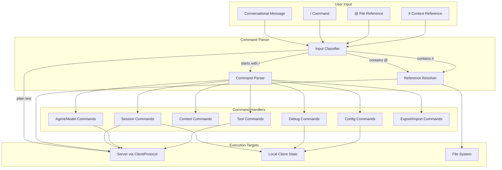

# Client Commands Design

> Command system for CLI/TUI interaction in y-agent

**Version**: v0.2
**Created**: 2026-03-04
**Updated**: 2026-03-06
**Status**: Draft

---

## TL;DR

y-agent's command system provides a unified, `/`-prefixed command vocabulary shared by CLI and TUI clients, covering session control, file and context references, agent/model management, tool invocation, debugging, and configuration. It also defines `@file` and `#context` reference syntaxes for injecting external content into conversations. Commands are designed to be intuitive for daily use, context-aware for smart completion, and extensible for future plugin commands. Batch and pipe modes enable scripting and automation.

---

## Background and Goals

### Background

Users interact with y-agent through conversational messages and structural commands. Messages are forwarded to the agent for processing; commands control the client-side environment (sessions, agents, models, tools, configuration). A well-designed command system reduces friction in common workflows like switching sessions, referencing files, and debugging agent behavior.

The command system must work identically in CLI (readline-based) and TUI (ratatui-based) clients to avoid user confusion when switching between interfaces.

### Goals

| Goal | Measurable Criteria |
|------|-------------------|
| **Intuitive syntax** | New users can discover commands via `/help` within 30 seconds |
| **Full coverage** | All session, agent, model, tool, and config operations accessible via commands |
| **Context-aware completion** | Tab completion for commands, file paths, session IDs, and agent names |
| **Cross-client consistency** | CLI and TUI share 100% of the command vocabulary |
| **Extensibility** | New command addable with a single handler registration |
| **Scriptability** | All commands executable in batch mode via `.yagent` script files |

### Assumptions

1. Commands are prefixed with `/` to distinguish them from conversational messages.
2. File references use `@` prefix; context references use `#` prefix.
3. Command parsing happens client-side before any server communication.
4. All commands are synchronous from the user's perspective (they block until complete or return immediately with status).

---

## Scope

### In Scope

- Session control commands (`/new`, `/switch`, `/list`, `/reset`, `/delete`, `/branch`, `/merge`, `/fork`, `/tree`)
- File reference system (`@file`, `@dir/`, line ranges, symbol lookup)
- Context reference system (`#git-diff`, `#clipboard`, `#recent`, etc.)
- Agent and model management commands (`/agent`, `/model`)
- Context management commands (`/context`, `/add`, `/remove`)
- Memory management commands (`/memory`)
- Tool invocation commands (`/tool`, `/exec`)
- Debug and status commands (`/debug`, `/status`, `/logs`, `/stats`)
- Configuration commands (`/config`)
- Export/import commands (`/export`, `/import`)
- Built-in aliases and custom alias support
- TUI keyboard shortcuts
- Batch mode and pipe mode
- Smart completion engine

### Out of Scope

- Plugin command framework (deferred)
- Natural language command interpretation (e.g., "switch to my research session")
- Voice command input
- Server-side command execution

---

## High-Level Design

### Command Categories



**Diagram rationale**: Flowchart chosen to show how user input is classified, routed to the appropriate handler, and ultimately targets either the server, local state, or file system.

**Legend**:
- **Input**: Four types of user input, distinguished by prefix (`/`, `@`, `#`, or plain text).
- **Handlers**: Grouped by domain; each handler processes one category of commands.
- **Targets**: Commands may affect the server (via ClientProtocol), local client state, or the file system.

### Command Reference

#### Session Commands

| Command | Description | Key Options |
|---------|-------------|-------------|
| `/new` | Create a new session | `--label`, `--agent`, `--model`, `--parent`, `--inherit` |
| `/switch <target>` | Switch to a session (ID, label, `-` for previous, `..` for parent, `/` for root) | Fuzzy matching supported |
| `/list` | List sessions | `--all`, `--tree`, `--agent`, `--sort`, `--limit` |
| `/reset` | Reset current session | `--keep-config`, `--confirm` |
| `/delete <id>` | Delete a session | `--recursive`, `--archive`, `--confirm` |
| `/branch` | Create a branch from current session | `--from <msg_id>`, `--label`, `--message` |
| `/merge <source>` | Merge another session into current | `--strategy (append/interleave/summarize)`, `--delete-source` |
| `/fork` | Create a working copy of current session | `--label`, `--shallow`, `--keep-link` |
| `/tree` | Display session tree structure | Optional root session ID |

#### File and Context References

| Syntax | Description | Example |
|--------|-------------|---------|
| `@path/to/file` | Reference entire file | `Explain @src/main.rs` |
| `@file:10` | Reference line 10 | `Bug at @src/main.rs:42` |
| `@file:10-20` | Reference line range | `Review @src/lib.rs:10-20` |
| `@file:symbol` | Reference function/struct by name | `Improve @src/parser.rs:parse_expression` |
| `@dir/` | Reference directory tree | `What's in @src/?` |
| `@dir/**/*.rs` | Glob pattern match | `Find TODOs in @src/**/*.rs` |
| `#git-diff` | Staged git diff | `Explain #git-diff` |
| `#git-status` | Git status | `What changed? #git-status` |
| `#clipboard` | Clipboard contents | `Analyze: #clipboard` |
| `#recent` | Recently modified files | `Review #recent` |
| `#cwd` | Current working directory | `Where am I? #cwd` |

#### Agent and Model Commands

| Command | Description |
|---------|-------------|
| `/agent list` | List available agents with descriptions and capabilities |
| `/agent select <id>` | Switch to a different agent |
| `/agent info <id>` | Show agent details (model, tools, skills) |
| `/model list` | List available models with context window and cost info |
| `/model select <name>` | Switch model |
| `/model params` | View/set model parameters (temperature, max_tokens) |

#### Context, Tool, Debug, Config Commands

| Command | Description |
|---------|-------------|
| `/context` | Show current context usage (files, tokens, memory) |
| `/add file <path>` | Manually add file to context |
| `/remove file <path>` | Remove file from context |
| `/memory search <query>` | Search long-term memory |
| `/memory add <key> <value>` | Store a memory entry |
| `/tool <name> [args]` | Invoke a tool directly (bypassing LLM) |
| `/exec <command>` | Execute a shell command |
| `/debug --on/--off` | Toggle debug mode |
| `/status` | Show system status (connection, session, usage, cost) |
| `/logs --tail N` | View recent logs |
| `/stats` | Show token usage and cost statistics |
| `/config show` | Display current configuration |
| `/config set <key> <val>` | Set a configuration value |
| `/export [file]` | Export session (markdown/json/html) |
| `/import <file>` | Import session from file |

### Alias System

Built-in single-character aliases for common commands:

| Alias | Expands To |
|-------|-----------|
| `/n` | `/new` |
| `/s` | `/switch` |
| `/l` | `/list` |
| `/r` | `/reset` |
| `/a` | `/agent` |
| `/m` | `/model` |
| `/h` | `/help` |
| `/q` | `/exit` |

Users can define custom aliases via `/alias <name> <command>`.

### TUI Keyboard Shortcuts

| Shortcut | Action |
|----------|--------|
| Ctrl+N | New session |
| Ctrl+L | List sessions |
| Ctrl+O | Switch session |
| Ctrl+A | Select agent |
| Ctrl+H | Help |
| Ctrl+C | Cancel current operation |
| Ctrl+D | Exit |
| Ctrl+R | Search command history |
| Tab | Auto-complete |
| Esc | Return to chat panel |

### Batch and Pipe Modes

**Batch mode**: Execute a script file containing commands and messages:

```bash
y-agent batch script.yagent
```

Script format (`.yagent`):
```
# Comments start with #
/new --label "Code Review"
@src/main.rs
Please review this code for security issues
/export review.md
/exit
```

**Pipe mode**: Accept input from stdin:

```bash
echo "Explain this code" | y-agent run --agent coder < code.rs
```

---

## Data and State Model

### Command Registry

```rust
struct CommandRegistry {
    commands: HashMap<String, Box<dyn CommandHandler>>,
    aliases: HashMap<String, String>,
}

trait CommandHandler: Send + Sync {
    fn name(&self) -> &str;
    fn description(&self) -> &str;
    fn usage(&self) -> &str;
    async fn execute(&self, args: &[&str], ctx: &mut ClientContext) -> Result<()>;
    fn completions(&self, partial: &str, ctx: &ClientContext) -> Vec<String>;
}
```

### File Reference Model

| Field | Type | Description |
|-------|------|-------------|
| `path` | PathBuf | File or directory path |
| `range` | Option<LineRange> | Single line, line range, or none (entire file) |
| `symbol` | Option<String> | Function/struct name for symbol-based lookup |
| `glob` | Option<String> | Glob pattern for directory references |

### Completion Context

The completion engine uses the current client state to provide context-aware suggestions:
- **Command position**: Suggest command names from the registry
- **Argument position**: Suggest values based on command type (session IDs, agent names, file paths)
- **File reference**: Suggest file paths from the workspace
- **Session ID**: Suggest from cached session list with fuzzy matching on IDs and labels

---

## Failure Handling and Edge Cases

| Scenario | Handling |
|----------|---------|
| Unknown command | Display "Unknown command: X. Type /help for available commands." |
| File reference to non-existent file | Display warning, continue processing message without the reference |
| File reference exceeds context budget | Truncate with warning: "File truncated to fit context window (showing first N lines)" |
| Symbol not found in file | Fall back to full file reference with warning |
| Glob pattern matches too many files | Cap at configurable limit (default 20); display count of skipped files |
| `/exec` command returns non-zero exit code | Display stderr output; do not abort session |
| `/merge` with conflicting message timestamps | Use source session timestamps; warn if clock skew detected |
| `/branch --from` with invalid message ID | Display error with list of valid recent message IDs |
| Batch script syntax error | Report line number and error; abort script |
| Alias creates circular reference | Detect at alias creation time; reject with error |

---

## Security and Permissions

| Concern | Approach |
|---------|----------|
| **Shell execution** (`/exec`) | Commands run with user's permissions; optional sandboxing via config flag `cli.sandbox_exec` |
| **File access** (`@file`) | Restricted to workspace root by default; `..` traversal blocked unless explicitly allowed |
| **Context injection** (`#context`) | Built-in contexts are read-only; no write operations possible via context references |
| **Sensitive file detection** | Warn when referencing files matching `.env`, `credentials.*`, `*secret*` patterns |
| **Batch mode** | Batch scripts cannot execute `/config set` commands that modify security settings |
| **Alias safety** | Aliases cannot override built-in security commands (`/exit`, `/config`) |

---

## Performance and Scalability

| Metric | Target |
|--------|--------|
| Command parse time | < 1ms for any command |
| File reference resolution | < 50ms for single file; < 200ms for glob with 20 files |
| Tab completion response | < 100ms |
| Session list retrieval | < 200ms for up to 1000 sessions |
| Batch script throughput | > 10 commands/second |
| Alias resolution | < 0.1ms (single HashMap lookup) |

### Optimization Strategies

- File path completion uses an in-memory directory tree cache, refreshed on workspace change.
- Session list is cached client-side with a 5-second TTL to avoid repeated server calls during rapid `/list` commands.
- Symbol lookup uses a lightweight AST parser for Rust/Python/TypeScript; falls back to regex for other languages.

---

## Observability

- All commands are logged with timestamp, command name, arguments (with sensitive values redacted), and execution duration.
- `/stats` command provides per-session metrics: message count, token usage, tool call count, cost, and session duration.
- `/debug --show-tokens` overlays token count on each message in the chat display.
- `/debug --show-latency` displays round-trip time for each server request.
- Failed commands increment a `client.command_errors` counter by command name.

---

## Rollout and Rollback

### Phased Implementation

| Phase | Scope | Duration |
|-------|-------|----------|
| **Phase 1** | Core commands: `/new`, `/switch`, `/list`, `/reset`, `@file`, `@dir/`, `/agent`, `/model`, `/help`, `/status` | 1-2 weeks |
| **Phase 2** | Advanced session: `/branch`, `/merge`, `/fork`, `/tree`; context: `/context`, `/add`, `/remove`; memory: `/memory` | 1-2 weeks |
| **Phase 3** | Tools and debug: `/tool`, `/exec`, `/debug`, `/logs`, `/stats`, `/config` | 1 week |
| **Phase 4** | Polish: `/export`, `/import`, `/alias`, batch mode, smart completion | 1-2 weeks |

### Rollback Plan

Commands are independently registered in the `CommandRegistry`. Any command can be disabled by removing its handler registration without affecting other commands. Batch mode and alias features are additive and can be feature-flagged independently.

---

## Alternatives and Trade-offs

### Command Prefix

| | `/` prefix (chosen) | `:` prefix | `!` prefix |
|-|---------------------|-----------|-----------|
| **Familiarity** | Slack, Discord, many chat apps | Vim-like | Jupyter notebooks |
| **Conflict with messages** | Rare in natural language | Rare | Common in exclamations |
| **Visual distinction** | Good | Good | Moderate |

**Decision**: `/` prefix chosen for familiarity with chat application conventions.

### File Reference Syntax

| | `@path` (chosen) | `{path}` | `[[path]]` |
|-|------------------|---------|-----------|
| **Readability** | High | Moderate | High |
| **Typing speed** | Fast (1 char) | Slow (2 chars) | Slow (4 chars) |
| **Conflict with text** | Email addresses (handled by path validation) | Code blocks | Wiki syntax |

**Decision**: `@path` chosen for minimal typing overhead and familiarity from IDE conventions.

### Merge Strategy for `/merge`

| Strategy | Behavior | Best For |
|----------|----------|----------|
| **Append** | Concatenate source messages after target | Simple sequential merges |
| **Interleave** | Sort all messages by timestamp | Reconstructing parallel work |
| **Summarize** | LLM-summarize source, append summary | Reducing context size |

**Decision**: Support all three strategies with append as default; let user choose via `--strategy` flag.

---

## Open Questions

| # | Question | Owner | Due Date | Status |
|---|----------|-------|----------|--------|
| 1 | Should `/exec` support background execution with status tracking? | Client team | 2026-03-20 | Open |
| 2 | Should file references support URL syntax (`@https://...`) for remote files? | Client team | 2026-03-27 | Open |
| 3 | Should custom commands be registerable via a plugin API or only via aliases? | Client team | 2026-04-03 | Open |
| 4 | Should `/branch --from` support branching from a specific tool call result, not just messages? | Client team | 2026-03-27 | Open |

---

## Decision Log

| # | Date | Decision | Rationale |
|---|------|----------|-----------|
| D1 | 2026-03-04 | Use `/` as command prefix | Familiar from chat applications; minimal conflict with natural language |
| D2 | 2026-03-04 | Use `@` for file references and `#` for context references | Distinct prefixes avoid ambiguity; `@` is familiar from IDE file mentions |
| D3 | 2026-03-04 | Support session tree operations (branch/merge/fork) | Enables exploratory workflows where users try multiple approaches from the same starting point |
| D4 | 2026-03-04 | Share command vocabulary between CLI and TUI | Avoids user confusion; commands learned in one client work in the other |
| D5 | 2026-03-06 | Support three merge strategies (append/interleave/summarize) | Different workflows need different merge semantics; no single strategy fits all cases |

---

## Changelog

| Version | Date | Changes |
|---------|------|---------|
| v0.1 | 2026-03-04 | Initial design: command categories, file/context references, session operations, aliases, batch mode |
| v0.2 | 2026-03-06 | Restructured to standard design doc format; condensed implementation details; added Security, Rollout, Alternatives, Decision Log sections |
