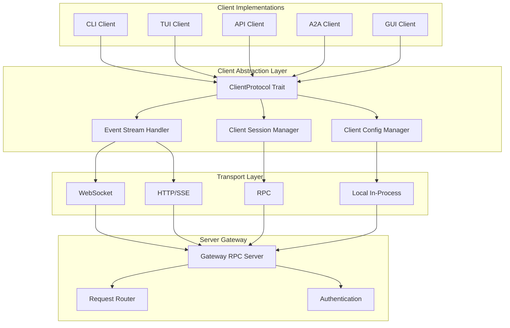
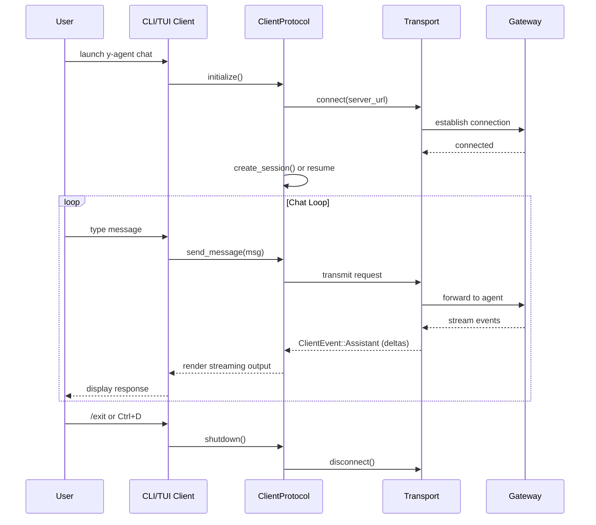
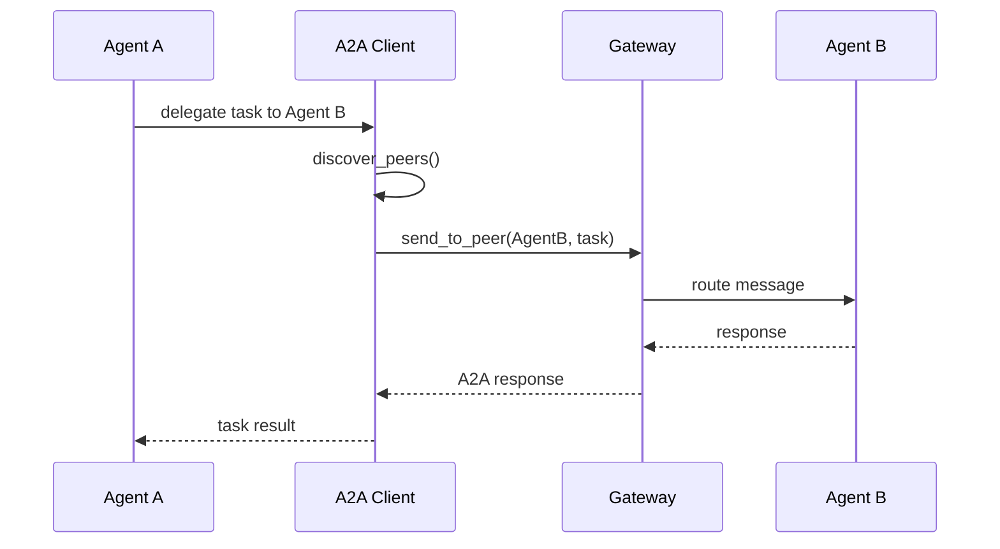

# Client Layer Design

> Unified client abstraction and multi-implementation architecture for y-agent

**Version**: v0.2
**Created**: 2026-03-04
**Updated**: 2026-03-06
**Status**: Draft

---

## TL;DR

The Client Layer is the entry point for all user interactions with y-agent. It defines a unified `ClientProtocol` trait that all client types (CLI, TUI, API, A2A, GUI) implement, backed by a pluggable transport layer (WebSocket, HTTP, RPC, in-process). This architecture enables consistent behavior across interfaces while allowing each client to optimize for its specific interaction model. Streaming events, session management, and authentication are handled at the abstraction layer so individual clients need only focus on presentation.

---

## Background and Goals

### Background

y-agent needs to serve users through multiple interaction surfaces: a command-line interface for quick tasks, a terminal UI for extended sessions, an HTTP API for programmatic access, an agent-to-agent protocol for multi-agent collaboration, and eventually a desktop/web GUI. Without a unifying abstraction, each client would re-implement session management, event handling, authentication, and message routing independently, leading to behavioral inconsistencies and high maintenance cost.

### Goals

| Goal | Measurable Criteria |
|------|-------------------|
| **Unified abstraction** | All clients implement the same `ClientProtocol` trait; adding a new client type requires zero changes to server-side code |
| **Streaming experience** | Token-level streaming with < 50ms latency from server event to client display |
| **Cross-platform** | CLI and TUI work on Linux, macOS, and Windows |
| **Offline-first** | CLI can operate via in-process local transport with no network dependency |
| **Extensibility** | New client type implementable in < 500 lines by conforming to `ClientProtocol` |
| **Session continuity** | Sessions are client-agnostic; a session started in CLI can be resumed in TUI or API |

### Assumptions

1. The server-side Gateway is a single process exposing RPC/HTTP/WebSocket endpoints.
2. Streaming uses Server-Sent Events (SSE) over HTTP or native WebSocket frames.
3. GUI client is deferred; this design covers the framework only.
4. All clients share the same configuration file format (`~/.config/y-agent/config.toml`).

---

## Scope

### In Scope

- `ClientProtocol` trait definition and core abstractions
- CLI client (interactive chat + single-run mode)
- TUI client (ratatui-based terminal UI)
- API client (HTTP/REST + OpenAI-compatible endpoint)
- A2A client (agent-to-agent protocol)
- Transport layer abstraction (WebSocket, HTTP, RPC, Local)
- Client-side event stream handling
- Client session management (create, switch, list, delete)
- Configuration and authentication management
- Client-level command system (delegated to [client-commands-design.md](client-commands-design.md))

### Out of Scope

- GUI client detailed implementation (framework placeholder only)
- Server-side Gateway internals (separate design)
- Message scheduling and queue modes (see [message-scheduling-design.md](message-scheduling-design.md))
- Context and session state management (see [context-session-design.md](context-session-design.md))

---

## High-Level Design

### Layered Architecture



**Diagram rationale**: Flowchart chosen to show module boundaries and dependency relationships across the four architectural layers.

**Legend**:
- **Client Implementations**: Concrete UI surfaces, each implementing `ClientProtocol`.
- **Client Abstraction Layer**: Shared logic for protocol, events, sessions, and config.
- **Transport Layer**: Pluggable communication backends selected by server URL scheme.
- **Server Gateway**: Entry point on the server side handling routing and authentication.

### Layer Responsibilities

| Layer | Responsibility | Components |
|-------|---------------|------------|
| **Client Implementations** | User-facing interaction surface | CLI, TUI, API, A2A, GUI |
| **Client Abstraction** | Unified protocol, shared behaviors | ClientProtocol, EventStreamHandler, SessionManager, ConfigManager |
| **Transport** | Wire-level communication | WebSocket, HTTP/SSE, RPC, Local (in-process) |
| **Server Gateway** | Server-side ingress | Gateway, Router, Auth |

### ClientProtocol Trait

All clients implement a common trait covering five capability groups:

```rust
#[async_trait]
trait ClientProtocol: Send + Sync {
    fn client_type(&self) -> ClientType;
    fn version(&self) -> &str;

    // Connection
    async fn connect(&mut self, config: &ClientConfig) -> Result<()>;
    async fn disconnect(&mut self) -> Result<()>;
    fn is_connected(&self) -> bool;

    // Messaging
    async fn send_message(&mut self, message: ClientMessage) -> Result<SendResult>;
    async fn send_command(&mut self, command: ClientCommand) -> Result<CommandResult>;

    // Events
    async fn subscribe_events(&mut self, filter: EventFilter) -> Result<EventStream>;

    // Sessions
    async fn list_sessions(&self) -> Result<Vec<SessionInfo>>;
    async fn create_session(&mut self, config: SessionConfig) -> Result<SessionId>;
    async fn switch_session(&mut self, id: SessionId) -> Result<()>;

    // Lifecycle
    async fn initialize(&mut self) -> Result<()>;
    async fn shutdown(&mut self) -> Result<()>;
}
```

### Client Types

| Client | Primary Use Case | Default Transport | Default Queue Mode |
|--------|-----------------|-------------------|-------------------|
| **CLI** | Quick single-run commands and interactive chat | Local or HTTP | Collect |
| **TUI** | Extended interactive sessions with rich UI | WebSocket | Steer |
| **API** | Programmatic access, integrations | HTTP/SSE | Followup |
| **A2A** | Agent-to-agent delegation and collaboration | RPC | Followup |
| **GUI** | Desktop/web graphical interface (deferred) | WebSocket | Collect |

### Transport Selection

Transport is selected automatically based on the server URL scheme:

| URL Scheme | Transport | Streaming Support |
|-----------|-----------|-------------------|
| `ws://` / `wss://` | WebSocket | Native frame-level |
| `http://` / `https://` | HTTP + SSE | Server-Sent Events |
| `grpc://` | RPC | gRPC streaming |
| (no URL / local) | In-process | Channel-based |

---

## Key Flows/Interactions

### Interactive Chat Session (CLI/TUI)



**Diagram rationale**: Sequence diagram chosen to show the temporal interaction between user, client, and server during an interactive session.

**Legend**:
- The loop represents the main chat cycle; events stream back asynchronously.
- `ClientEvent::Assistant` delivers token-level deltas for typewriter rendering.

### A2A Communication Flow



**Diagram rationale**: Sequence diagram chosen to illustrate the agent-to-agent delegation handshake.

**Legend**:
- **A2A Client** handles peer discovery, message signing, and trust verification.
- Communication passes through the Gateway for routing and authentication.

---

## Data and State Model

### Event Model

Client events are the primary mechanism for server-to-client communication:

| Event Type | Content | Use Case |
|-----------|---------|----------|
| **Lifecycle** | run_id, phase (Start/Running/End/Error) | Track run lifecycle |
| **Assistant** | delta text, accumulated text | Streaming response rendering |
| **Thinking** | delta reasoning text | Display agent reasoning process |
| **Tool** | tool name, phase, result | Show tool execution progress |
| **Compaction** | session_id, phase, summary | Notify context compaction |
| **Error** | error message, recoverable flag | Display errors with recovery hint |
| **System** | message, log level | System notifications |

### Client Configuration

```toml
[server]
url = "http://localhost:3000"
timeout = 30
retry_attempts = 3

[auth]
method = "api_key"
api_key = "${Y_AGENT_API_KEY}"

[defaults]
agent_id = "main"
model = "gpt-4o"
streaming = true

[cli]
output_format = "text"
color = true
history_file = "~/.config/y-agent/history"

[tui]
theme = "dark"
show_timestamps = true
```

### Message Model

```rust
struct ClientMessage {
    content: String,
    attachments: Vec<Attachment>,
    agent_id: Option<AgentId>,
    session_id: Option<SessionId>,
    metadata: HashMap<String, Value>,
}

struct SendResult {
    run_id: RunId,
    accepted_at: Timestamp,
    status: RunStatus,
}
```

### A2A Identity and Trust

| Concept | Description |
|---------|-------------|
| **AgentIdentity** | Agent ID, name, capabilities list, optional public key |
| **PeerAgent** | Remote agent endpoint, last-seen timestamp, trust level |
| **TrustLevel** | Trusted (verified key), KnownNode (seen before), Unknown |
| **SignedMessage** | A2A message with cryptographic signature for verification |

---

## Failure Handling and Edge Cases

| Scenario | Handling |
|----------|---------|
| Transport connection lost | Automatic reconnect with exponential backoff (3 attempts); switch to fallback transport if primary fails |
| Server unavailable at startup | CLI falls back to local transport if available; otherwise exits with clear error |
| Event stream interrupted | Re-subscribe from last known event ID; missed events replayed by server |
| Session not found on server | Create new session transparently; warn user if session was expected to exist |
| Authentication token expired | Refresh token automatically (OAuth2); prompt for new API key (API key auth) |
| Message send timeout | Retry with idempotency key; display timeout error after max retries |
| A2A peer unreachable | Mark peer as unavailable; retry with other peers if task allows delegation |
| Invalid command input | Display contextual error with suggestion; do not abort session |
| TUI terminal resize | Re-render layout immediately; preserve scroll position and input buffer |

---

## Security and Permissions

### Authentication Methods

| Method | Storage | Use Case |
|--------|---------|----------|
| **API Key** | Environment variable or encrypted credential store | Default for CLI/API |
| **OAuth 2.0** | Token cache with automatic refresh | Enterprise deployments (deferred) |
| **JWT** | Short-lived token from auth service | Web GUI sessions (deferred) |
| **None** | N/A | Local-only development mode |

### Credential Management

- API keys loaded from environment variables (`Y_AGENT_API_KEY`) with fallback to encrypted credential store at `~/.config/y-agent/credentials`.
- Credentials never logged, never included in error messages, never persisted in session history.
- Credential store supports optional encryption at rest.

### A2A Security

- Messages between agents are signed with the sender's private key.
- Receiving agents verify signatures before processing.
- Trust levels (Trusted/KnownNode/Unknown) gate which operations a peer can request.
- Untrusted peers can only send read-only queries; write operations require Trusted status.

### Transport Security

- WebSocket and HTTP transports require TLS in production (wss://, https://).
- Local transport is inherently secure (in-process, no network exposure).
- Proxy authentication credentials are stored in the same credential store as API keys.

---

## Performance and Scalability

### Performance Targets

| Metric | Target |
|--------|--------|
| Event-to-display latency (streaming) | < 50ms |
| CLI startup time (local transport) | < 200ms |
| CLI startup time (remote transport) | < 1s |
| TUI frame render time | < 16ms (60fps) |
| Concurrent event subscriptions per client | 1 active + 1 reconnecting |
| Session list/switch latency | < 100ms |

### Optimization Strategies

- **Connection pooling**: HTTP transport reuses connections via `reqwest::Client` connection pool.
- **Event batching**: TUI batches rapid event updates into single frame renders to avoid flickering.
- **Lazy initialization**: Transport connection established on first message, not on client construction.
- **Local transport zero-copy**: In-process transport passes messages via channels without serialization.

---

## Observability

### Client-Side Metrics

| Metric | Type | Description |
|--------|------|-------------|
| `client.messages_sent` | Counter | Messages sent per session |
| `client.events_received` | Counter | Events received by type |
| `client.latency_ms` | Histogram | Round-trip time per message |
| `client.reconnect_count` | Counter | Transport reconnection attempts |
| `client.session_switches` | Counter | Session switches per client lifetime |

### Debug Mode

CLI and TUI support a `/debug` command that enables:
- Token usage display per message
- Request/response latency overlay
- Transport connection state indicator
- Event stream health monitoring

### Logging

- Structured logs written to `~/.local/share/y-agent/logs/client.log`.
- Log level configurable via config file or `--verbose`/`--quiet` CLI flags.
- Sensitive data (API keys, message content) redacted from logs by default.

---

## Rollout and Rollback

### Phased Implementation

| Phase | Scope | Duration | Deliverables |
|-------|-------|----------|-------------|
| **Phase 1** | Core abstraction + CLI | 3-4 weeks | ClientProtocol trait, Transport layer (HTTP/WebSocket/Local), basic CLI (chat + run), config management, auth system |
| **Phase 2** | TUI client | 2-3 weeks | ratatui-based TUI, chat panel, session list panel, agent list panel, keyboard shortcuts |
| **Phase 3** | API + A2A clients | 2-3 weeks | HTTP API client, OpenAI-compatible client, A2A protocol, peer discovery, message signing |
| **Phase 4** | GUI framework | 3-4 weeks | GUI framework selection, main window, settings UI, packaging |

### Rollback Plan

| Phase | Rollback Approach |
|-------|-------------------|
| Phase 1 | Feature flag `cli_client`; revert to direct API calls |
| Phase 2 | TUI is an optional binary; CLI remains fully functional |
| Phase 3 | API/A2A clients are independent crates; removal does not affect CLI/TUI |
| Phase 4 | GUI is a separate application; removal has zero impact on core |

---

## Alternatives and Trade-offs

### Transport Protocol Selection

| | WebSocket Only | HTTP + SSE | Hybrid (chosen) |
|-|---------------|-----------|-----------------|
| **Streaming** | Native bidirectional | SSE (server-to-client only) | Best of both |
| **Firewall compatibility** | May be blocked | Works everywhere | HTTP fallback for restricted networks |
| **Complexity** | Single protocol | Single protocol | Two protocols to maintain |
| **Offline/local** | Requires WS server | Requires HTTP server | Local transport bypasses both |

**Decision**: Hybrid approach. WebSocket for interactive clients (TUI, GUI) that benefit from bidirectional streaming. HTTP+SSE for API clients and environments with WebSocket restrictions. Local transport for CLI offline mode.

### TUI Framework

| | ratatui | cursive | egui (terminal) |
|-|---------|---------|-----------------|
| **Ecosystem** | Large, active | Moderate | Small for TUI |
| **Rendering model** | Immediate mode | Retained mode | Immediate mode |
| **Cross-platform** | Excellent | Good | Moderate |
| **Async support** | Via tokio integration | Limited | Limited |

**Decision**: ratatui for its active ecosystem, immediate-mode rendering model (simpler for streaming updates), and strong tokio integration.

### A2A Protocol

| | Custom RPC | Google A2A Standard | JSON-RPC |
|-|-----------|-------------------|----------|
| **Flexibility** | Full control | Standardized | Standardized |
| **Interoperability** | None | Cross-vendor | Moderate |
| **Complexity** | Medium | High | Low |

**Decision**: Start with custom RPC for simplicity. Design the message format to be compatible with the Google A2A standard for future interoperability.

---

## Open Questions

| # | Question | Owner | Due Date | Status |
|---|----------|-------|----------|--------|
| 1 | Should the A2A protocol support multi-hop delegation (Agent A -> Agent B -> Agent C)? | Client team | 2026-03-20 | Open |
| 2 | Should TUI support split-pane view for concurrent sessions? | Client team | 2026-03-27 | Open |
| 3 | What is the maximum attachment size for ClientMessage? Should large files be uploaded separately? | Client team | 2026-03-20 | Open |
| 4 | Should the OpenAI-compatible API endpoint support tool_choice parameter mapping? | Client team | 2026-04-03 | Open |

