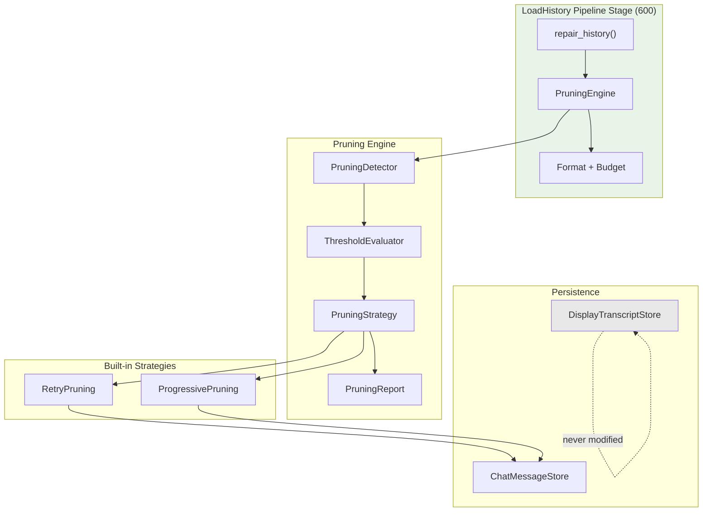
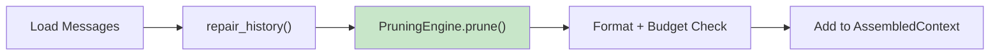
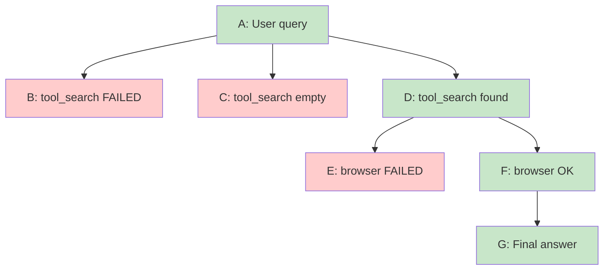
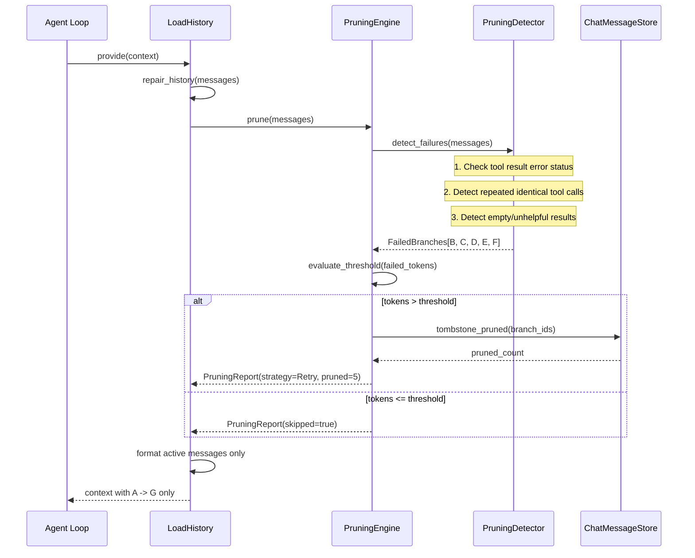
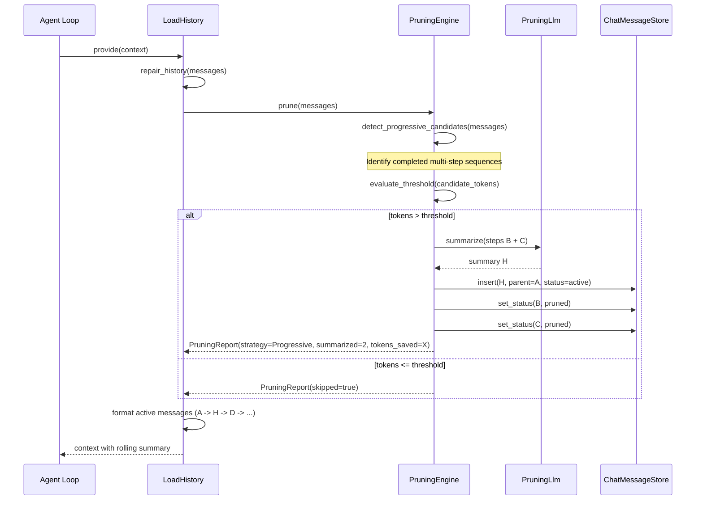
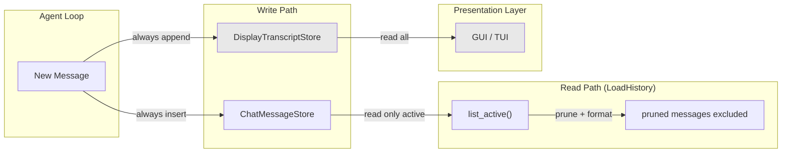
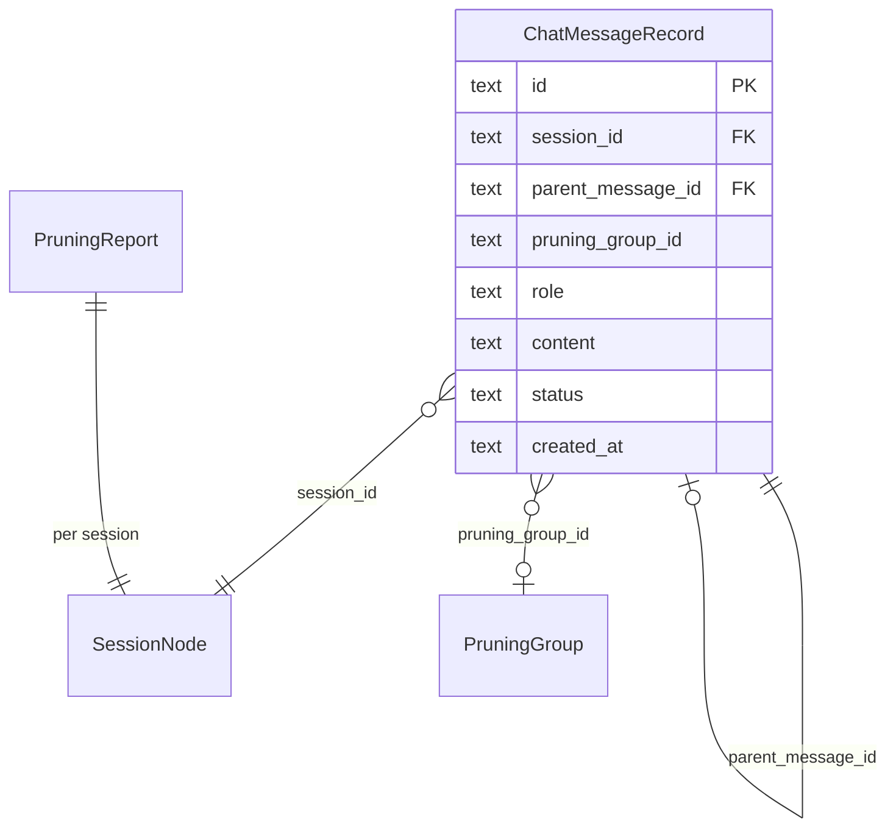

# Context Pruning Design

> Message-level branch pruning for attention quality optimization in the LLM context window

**Version**: v0.1
**Created**: 2026-03-19
**Updated**: 2026-03-19
**Status**: Draft
**Depends on**: [context-session-design.md](context-session-design.md), [memory-short-term-design.md](memory-short-term-design.md), [chat-checkpoint-design.md](chat-checkpoint-design.md)

---

## TL;DR

Context Pruning removes or compresses wasteful message branches from the LLM API payload while preserving full history in the display transcript. It addresses **attention dilution** -- the degradation of LLM reasoning caused by noisy intermediate steps (failed tool retries, verbose multi-step sequences) that consume tokens without contributing useful context. Unlike compaction (which solves capacity by summarizing old messages when the context window fills), pruning solves **quality** by eliminating noise even when tokens are plentiful.

Two built-in strategies share a common `PruningStrategy` trait:

- **RetryPruning**: Detects failed tool calls via hybrid analysis (error status + heuristics), tombstones the failed branch, and retains only the successful path. Zero LLM cost, < 5ms latency.
- **ProgressivePruning**: Detects completed multi-step sequences and replaces them with a compact LLM-generated rolling summary. One LLM call per pruning cycle, < 3s latency.

Pruning operates within the `LoadHistory` pipeline stage (priority 600), after `repair_history()` but before context formatting. It uses the existing `ChatMessageStore` tombstone infrastructure for non-destructive branch removal. `DisplayTranscriptStore` is never touched -- the GUI always shows the full, unedited conversation history. Pruning is threshold-gated: it only activates when a candidate branch's cumulative tokens exceed a configurable threshold (default 2,000 tokens).

---

## Background and Goals

### Background

AI agents frequently encounter situations that generate wasteful context:

1. **Retry cascades**: An agent tries tool A, fails, tries tool B, fails, tries tool C, and finally succeeds with tool D. Steps A, B, and C contribute nothing but noise to subsequent LLM calls.

2. **Verbose progressive workflows**: An agent navigates a website across 5 steps (search tool, open browser, inspect elements, extract data, close browser). Each step's full output occupies context even after the information has been consumed and the next step has begun.

Existing mechanisms do not address this:

| Mechanism | What It Solves | What It Misses |
|-----------|---------------|----------------|
| **Compaction** (context-session-design.md) | Context window overflow | Does not activate when tokens are under budget; no awareness of "failed" vs "useful" steps |
| **STM Compact** (memory-short-term-design.md) | Large tool outputs | Disk offload with preview; does not remove failed branches |
| **STM Compress** (memory-short-term-design.md) | Older message groups | Groups by position, not by failure/success semantics |
| **IndexedExperience** (memory-short-term-design.md) | Agent-controlled archival | Agent must explicitly call compress_experience; no automatic detection of waste |
| **Chat Checkpoint** (chat-checkpoint-design.md) | Undo last turn | User-initiated; does not optimize context for ongoing conversation |

### Goals

| Goal | Measurable Criteria |
|------|-------------------|
| **Attention quality** | Pruned context contains only the successful execution path; failed branches are excluded from LLM API payload |
| **Retry pruning speed** | RetryPruning completes within 5ms (SQL tombstone operation only) |
| **Progressive compression ratio** | ProgressivePruning reduces intermediate step tokens by >= 60% while preserving essential context for the next step |
| **Display preservation** | DisplayTranscriptStore is never modified by pruning; GUI always shows full A-B-C-D-E-F-G history |
| **Threshold-gated** | Pruning only activates when candidate branch tokens exceed configurable threshold (default 2,000) |
| **Non-destructive** | All pruned messages are recoverable via existing `restore_tombstoned()` mechanism |
| **Backward compatible** | Sessions without pruning metadata (pre-migration) continue to function without change |

### Assumptions

1. The `ChatMessageStore` (Phase 2 SQLite store) is the authoritative message store for context assembly. `TranscriptStore` (JSONL) remains for backward compatibility but is not the pruning target.
2. Failed tool calls are detectable via error status in tool result messages and simple heuristics (repeated identical calls, empty results).
3. ProgressivePruning uses the same model pool as compaction (configurable, default `gpt-4o-mini`).
4. Pruning and compaction are complementary: pruning runs first (quality), compaction runs later if needed (capacity).

---

## Scope

### In Scope

- `PruningStrategy` trait with unified detect-evaluate-prune-verify pipeline
- `RetryPruning` strategy: hybrid failure detection (error status + heuristics), branch tombstoning
- `ProgressivePruning` strategy: threshold-gated LLM rolling summary of completed steps
- Message tree extension: `parent_message_id` and `pruning_group_id` fields on `ChatMessageRecord`
- `PruningEngine` coordinating strategy selection and execution
- `PruningDetector` for hybrid failure detection (error status + heuristic patterns)
- Token threshold configuration (`pruning.token_threshold`)
- Integration with `LoadHistory` pipeline stage
- SQLite migration for new columns
- `PruningReport` for observability

### Out of Scope

- Cross-session pruning (pruning only operates within a single session)
- User-facing pruning controls (no `/prune` command in v0.1; future consideration)
- Semantic deduplication of similar messages (handled by LoopGuard in guardrails-hitl-design.md)
- Pruning of System or User messages (only Assistant + Tool messages are candidates)
- Agent-initiated pruning (like `compress_experience`; future consideration)

---

## High-Level Design

### Component Overview



**Diagram type rationale**: Flowchart chosen to show the module boundaries and data flow between the pruning engine components, strategies, and storage layer.

**Legend**:
- **LoadHistory Pipeline Stage**: The existing context pipeline stage where pruning is integrated.
- **PruningEngine**: Coordinates detection, threshold evaluation, strategy dispatch, and reporting.
- **Strategies**: Two built-in implementations of the `PruningStrategy` trait.
- **DisplayTranscriptStore** (gray): Explicitly never modified by pruning -- shown to emphasize the separation.

### Integration Point

Pruning operates inside `LoadHistory.provide()`, inserted after `repair_history()` and before formatting:



**Diagram type rationale**: Flowchart chosen to show the sequential position of pruning within the LoadHistory pipeline.

**Legend**:
- Green node: New pruning step inserted into existing pipeline.
- All other nodes are existing steps in `LoadHistory.provide()`.

### Message Tree Model

Messages within a session form a tree via `parent_message_id`. The active path (from root to current leaf) is what gets loaded for LLM context:



**Diagram type rationale**: Flowchart chosen to show the tree structure where failed branches (red) are pruned and only the successful path (green) remains in context.

**Legend**:
- Red nodes: Failed/pruned messages (status = `pruned` in ChatMessageStore).
- Green nodes: Active path sent to LLM.
- `parent_message_id` links define the tree edges.

---

## Key Flows/Interactions

### Flow 1: Retry Pruning (Scenario 1 -- Error Elimination)



**Diagram type rationale**: Sequence diagram chosen to show the temporal ordering of retry pruning within the LoadHistory pipeline stage.

**Legend**:
- **PruningDetector** applies three detection methods in sequence.
- **ThresholdEvaluator** gates pruning on cumulative token count.
- **ChatMessageStore** performs the actual tombstoning (non-destructive).

#### Hybrid Failure Detection

The `PruningDetector` uses three detection signals:

| Signal | Detection Method | Example |
|--------|-----------------|---------|
| **Error status** (primary) | Tool result message contains error field or error-indicating status | `{"error": "parameter validation failed"}` |
| **Repeated calls** (heuristic) | Same tool name with similar arguments called within N turns without state change | Three consecutive `tool_search` calls with different query variations |
| **Empty results** (heuristic) | Tool result contains patterns indicating no useful output | `{"results": [], "count": 0}`, `"no results found"` |

Detection is conservative: a message is only marked as failed if at least one signal fires. When uncertain, messages are kept (safe default).

### Flow 2: Progressive Pruning (Scenario 2 -- Rolling Summary)



**Diagram type rationale**: Sequence diagram chosen to show the progressive summarization cycle with LLM involvement.

**Legend**:
- **PruningLlm**: Uses the same model pool and trait pattern as `CompactionLlm`.
- Summary message H replaces steps B and C in the active path.
- B and C remain in `ChatMessageStore` with status `pruned` (recoverable).

#### Progressive Pruning Trigger

Progressive pruning is **threshold-gated only** (not per-turn):

1. After each completed agent turn, calculate cumulative tokens of intermediate steps since last pruning.
2. If cumulative tokens exceed `pruning.token_threshold`, trigger progressive pruning.
3. This avoids unnecessary LLM calls for short conversations while ensuring pruning activates for verbose multi-step workflows.

### Flow 3: Dual Transcript Separation



**Diagram type rationale**: Flowchart chosen to show the dual-path architecture ensuring pruning affects only the LLM context, not the user-visible history.

**Legend**:
- **Write path**: Both stores receive every message unconditionally.
- **Read path**: `LoadHistory` reads only active messages from `ChatMessageStore`; pruned messages are excluded.
- **UI path** (gray): `DisplayTranscriptStore` is read directly by the GUI -- always full, never pruned.

---

## Data and State Model

### Extended ChatMessageRecord

Two new nullable fields added to the existing `ChatMessageRecord`:

| Field | Type | Description |
|-------|------|-------------|
| `parent_message_id` | `Option<String>` | Parent message in the session message tree. NULL for root-level messages and pre-migration messages. |
| `pruning_group_id` | `Option<String>` | Logical grouping identifier for batch pruning operations. All messages in a retry cascade share the same group ID. |

### Extended ChatMessageStatus

A new status value distinguishes pruning from user-initiated rollback:

| Status | Meaning | Recovery |
|--------|---------|----------|
| `active` | Normal, included in LLM context | N/A |
| `tombstone` | Removed by user rollback (checkpoint) | `restore_tombstoned()` |
| `pruned` | Removed by pruning engine for quality | `restore_pruned()` (new) |

### PruningConfig

| Parameter | Default | Description |
|-----------|---------|-------------|
| `enabled` | `true` | Master switch for pruning |
| `token_threshold` | `2000` | Minimum cumulative tokens in a branch before pruning activates |
| `strategy` | `auto` | Strategy selection: `retry_only`, `progressive_only`, `auto` (both, retry first) |
| `progressive.model` | (same as compaction) | LLM model for progressive summaries |
| `progressive.max_retries` | `2` | Maximum retry attempts for progressive LLM calls |
| `progressive.preserve_identifiers` | `true` | Apply identifier preservation policy to summaries |
| `retry.heuristic_patterns` | (built-in) | Additional regex patterns for failure detection |

### PruningReport

| Field | Type | Description |
|-------|------|-------------|
| `strategy_used` | `PruningStrategyType` | Which strategy was applied |
| `messages_pruned` | `usize` | Number of messages pruned |
| `tokens_before` | `u32` | Total tokens in candidate messages before pruning |
| `tokens_after` | `u32` | Total tokens remaining after pruning |
| `tokens_saved` | `u32` | Tokens reclaimed |
| `skipped` | `bool` | Whether pruning was skipped (below threshold) |
| `summary_inserted` | `bool` | Whether a progressive summary was inserted |

### Database Migration (014_context_pruning)

```sql
-- Up migration
ALTER TABLE chat_messages ADD COLUMN parent_message_id TEXT;
ALTER TABLE chat_messages ADD COLUMN pruning_group_id TEXT;
CREATE INDEX IF NOT EXISTS idx_cm_parent ON chat_messages(parent_message_id);
CREATE INDEX IF NOT EXISTS idx_cm_pruning_group ON chat_messages(session_id, pruning_group_id);

-- Extend status CHECK to include 'pruned'
-- SQLite does not support ALTER CHECK; handled via application-level validation
```

### Entity Relationships



**Diagram type rationale**: ER diagram chosen to show how the message tree is formed via self-referential `parent_message_id` and how pruning groups relate to messages.

**Legend**:
- Self-referential relationship on `ChatMessageRecord` creates the message tree.
- `PruningGroup` is a logical concept (group ID string), not a separate table.

---

## Failure Handling and Edge Cases

| Scenario | Handling |
|----------|---------|
| Progressive pruning LLM call fails | Skip pruning for this cycle; keep full messages in context (safe default). Log warning. Retry on next LoadHistory invocation. |
| Progressive pruning returns empty/nonsensical summary | Discard summary; keep original messages unpruned. Log warning. |
| `parent_message_id` is NULL (pre-migration messages) | Treat as root-level; message is not part of any branch tree. Not pruneable by RetryPruning (no branch structure). Still eligible for ProgressivePruning (position-based). |
| All messages in a turn are detected as failures | Keep the last failure (most recent attempt) to provide context for the next step. Never prune all messages. |
| Pruning and compaction both want to act on same messages | Pruning runs first (within LoadHistory); compaction runs later (Guard stage). Pruned messages are already tombstoned and excluded from compaction candidates. No conflict. |
| Rollback to a checkpoint that includes pruned messages | Pruned messages stay pruned. Rollback operates on `tombstone` status (checkpoint-based), not `pruned` status. The two statuses are independent. User can explicitly restore pruned messages if needed. |
| Concurrent sessions modifying same messages | Session-level write lock (inherited from message-scheduling-design.md) prevents concurrent modification. Pruning operates within the session lock scope. |
| Token threshold set to 0 | Pruning always activates (no threshold gate). Valid configuration for aggressive pruning. |
| Token threshold set very high | Pruning rarely activates. Valid configuration for conservative mode. |
| Re-entering a session with previously pruned messages | Pruned messages remain pruned (status persisted in SQLite). LoadHistory loads only active messages. Display transcript shows full history including pruned steps. |

---

## Security and Permissions

| Concern | Approach |
|---------|---------|
| **Summary content safety** | Progressive pruning summaries use the same identifier preservation policy as compaction. Summaries do not introduce new information beyond what was in the original messages. |
| **Audit trail** | All pruned messages remain in `ChatMessageStore` with status `pruned` and in `DisplayTranscriptStore` with full content. Nothing is permanently deleted. |
| **Cross-session isolation** | Pruning operates exclusively within a single session. No cross-session data access or modification. |
| **LLM prompt safety** | Progressive pruning prompts instruct the LLM to summarize factually. No user-controlled content is used as system-level instructions in pruning prompts. |
| **Pruning reversal** | `restore_pruned()` reverses pruning. No elevated permissions required beyond session ownership. |
| **Sensitive data in summaries** | Progressive summaries may contain sensitive data present in original messages. Same risk profile as compaction summaries. |

---

## Performance and Scalability

### Performance Targets

| Metric | Target |
|--------|--------|
| RetryPruning (detection + tombstone) | < 5ms for sessions with < 100 messages |
| ProgressivePruning (detection + LLM call) | < 3s (dominated by LLM call) |
| Threshold evaluation | < 1ms (sum of pre-computed token estimates) |
| PruningDetector (hybrid analysis) | < 10ms for 50 messages |
| Message tree traversal (find active path) | < 5ms for trees with depth < 20 |

### Optimization Strategies

1. **Threshold gating**: Token threshold prevents pruning from running on short conversations where the overhead is not justified.
2. **Lazy detection**: `PruningDetector` processes messages newest-first and stops at the first non-failed message (for RetryPruning). No need to scan the entire history.
3. **Batch tombstone**: Pruning groups allow batch SQL UPDATE operations instead of per-message updates.
4. **Cached token estimates**: Messages carry `input_tokens` / `output_tokens` fields; no re-estimation needed during threshold evaluation.
5. **Summary model**: Uses same fast, cheap model pool as compaction (e.g., `gpt-4o-mini`) to minimize latency and cost.

---

## Observability

### Metrics

| Metric | Type | Description |
|--------|------|-------------|
| `pruning.retry.count` | Counter | Number of RetryPruning operations executed |
| `pruning.progressive.count` | Counter | Number of ProgressivePruning operations executed |
| `pruning.skipped.count` | Counter | Pruning skipped (below threshold) |
| `pruning.messages_pruned` | Counter | Total messages pruned |
| `pruning.tokens_saved` | Counter | Total tokens reclaimed by pruning |
| `pruning.retry.latency_ms` | Histogram | RetryPruning latency |
| `pruning.progressive.latency_ms` | Histogram | ProgressivePruning latency (includes LLM call) |
| `pruning.progressive.llm_failures` | Counter | Progressive LLM call failures |
| `pruning.detection.failures_found` | Counter | Failed branches detected by PruningDetector |

### Events (via y-hooks EventBus)

| Event | Payload | Trigger |
|-------|---------|---------|
| `PruningApplied` | session_id, strategy, messages_pruned, tokens_before, tokens_after | Pruning executed successfully |
| `PruningSkipped` | session_id, reason (below_threshold / disabled / no_candidates) | Pruning evaluated but not executed |
| `PruningFailed` | session_id, strategy, error | Pruning attempted but failed (LLM error) |

---

## Rollout and Rollback

### Phased Implementation

| Phase | Scope | Deliverables |
|-------|-------|-------------|
| **Phase 1**: Foundation | Data model extension, PruningStrategy trait, PruningDetector, threshold evaluator | Migration 014, trait definitions in y-core, detection logic in y-context |
| **Phase 2**: RetryPruning | RetryPruning strategy implementation, LoadHistory integration | Zero LLM cost; immediate value for retry-heavy workflows |
| **Phase 3**: ProgressivePruning | ProgressivePruning strategy, PruningLlm integration, summary generation | LLM-based rolling summaries for multi-step workflows |
| **Phase 4**: Auto mode | Strategy auto-selection (retry first, then progressive), combined reporting, configuration | Full pruning experience |

### Feature Flags

| Flag | Default | Effect When Disabled |
|------|---------|---------------------|
| `context_pruning` | enabled | No pruning occurs; LoadHistory behaves as before |
| `pruning_progressive` | enabled | Only RetryPruning is available; ProgressivePruning skipped |

### Migration Strategy

- **New columns** (`parent_message_id`, `pruning_group_id`): Nullable; existing rows have NULL values. No data migration needed.
- **New status value** (`pruned`): Application-level validation. SQLite CHECK constraint not modified (would require table rebuild); status validation handled in Rust code.
- **Backward compatibility**: Sessions without pruning metadata function identically to pre-pruning behavior. NULL `parent_message_id` is treated as root-level.

### Rollback Plan

| Component | Rollback |
|-----------|---------|
| Migration 014 | Drop columns (down migration). Existing data unaffected. |
| Feature flag `context_pruning` | Disable to skip all pruning logic. |
| Pruned messages | Run `UPDATE chat_messages SET status = 'active' WHERE status = 'pruned'` to restore all pruned messages. |

---

## Alternatives and Trade-offs

### Strategy count: One unified vs Two specialized

| | One unified (rejected) | Two specialized (chosen) |
|-|----------------------|------------------------|
| **Simplicity** | Single code path | Two implementations |
| **LLM cost** | Always incurs LLM cost (even for simple retries) | RetryPruning is free; LLM cost only for progressive |
| **Detection accuracy** | LLM classifies all failures (high accuracy, high cost) | Hybrid heuristics for retries (good enough); LLM only for summaries |
| **Latency** | Always 1-3s (LLM call) | RetryPruning < 5ms; ProgressivePruning < 3s |

**Decision**: Two strategies. RetryPruning (deterministic, zero-cost) and ProgressivePruning (LLM-based, lossy) have fundamentally different cost and accuracy profiles. Forcing a single approach wastes LLM budget on trivially detectable failures or misses optimization opportunities for progressive workflows.

### Pruning timing: Write-time vs Read-time

| | Write-time (rejected) | Read-time (chosen) |
|-|----------------------|-------------------|
| **Reversibility** | Must store originals separately for recovery | Tombstone is reversible by status flip |
| **Complexity** | Must intercept message writes across all code paths | Single integration point in LoadHistory |
| **Consistency** | Risk of pruning before full branch is visible | All messages available when pruning evaluates |
| **Performance** | Pruning cost paid once per message | Pruning cost paid per context assembly (but threshold-gated and cached) |

**Decision**: Read-time (in LoadHistory). Non-destructive, single integration point, and full branch visibility at evaluation time. The per-assembly cost is mitigated by threshold gating and lazy detection.

### Branch removal: Tombstone vs Hard delete

| | Hard delete (rejected) | Tombstone (chosen) |
|-|----------------------|-------------------|
| **Recoverability** | Permanent; must rely on DisplayTranscriptStore for history | Fully recoverable via status flip |
| **Audit trail** | Gaps in ChatMessageStore | Complete record with status annotations |
| **Complexity** | Must handle foreign key cascades | Simple status update |
| **Composability** | Must build new delete path | Reuses existing tombstone infrastructure |

**Decision**: Tombstone with new `pruned` status. Composes with existing `ChatMessageStore.tombstone_after()` pattern. Adds a distinct status so that pruning and checkpoint rollback are independent and non-interfering.

---

## Open Questions

| # | Question | Owner | Due Date | Status |
|---|----------|-------|----------|--------|
| 1 | Should progressive pruning summaries be stored in Experience Store for cross-reference (allowing `read_experience` to retrieve pruning summaries)? | Context team | 2026-04-03 | Open |
| 2 | Should the agent be able to explicitly request pruning (analogous to `compress_experience`)? This would add a `prune_context` tool. | Context team | 2026-04-03 | Open |
| 3 | What is the maximum depth of the pruning summary chain before forced flattening (to prevent summary-of-summary-of-summary quality degradation)? | Context team | 2026-04-10 | Open |
| 4 | Should pruning heuristic patterns be configurable per agent or per skill (e.g., a browser skill knows what "empty page" looks like)? | Context team | 2026-04-10 | Open |
| 5 | Should pruned messages contribute to Experience Store promotion at session end (i.e., should the agent learn from its failures)? | Memory team | 2026-04-17 | Open |
