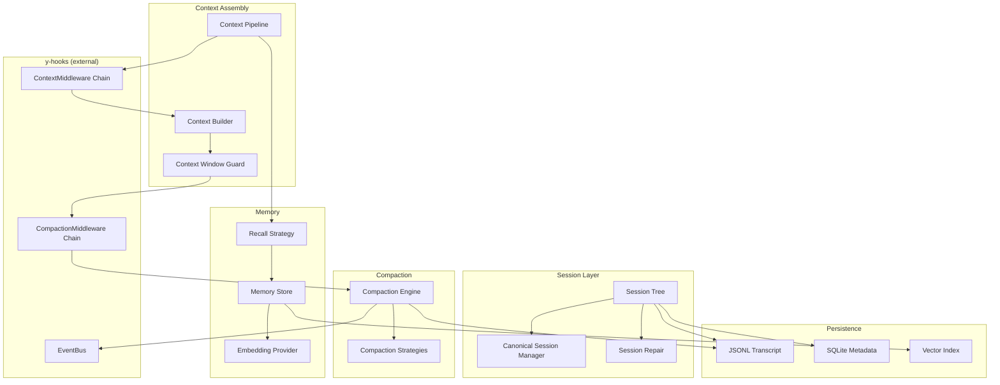
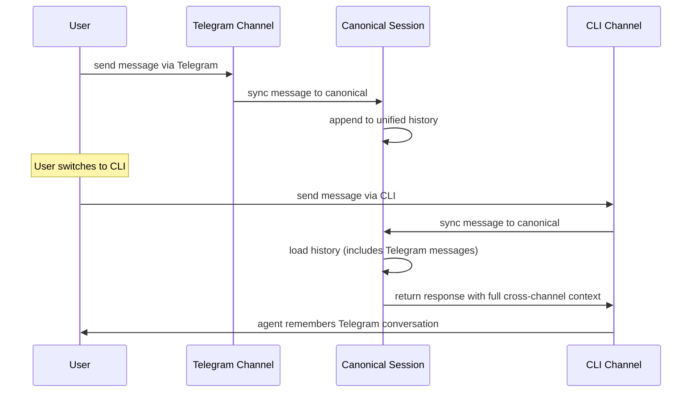
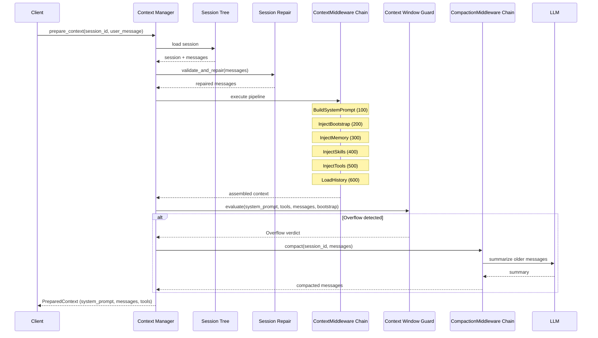
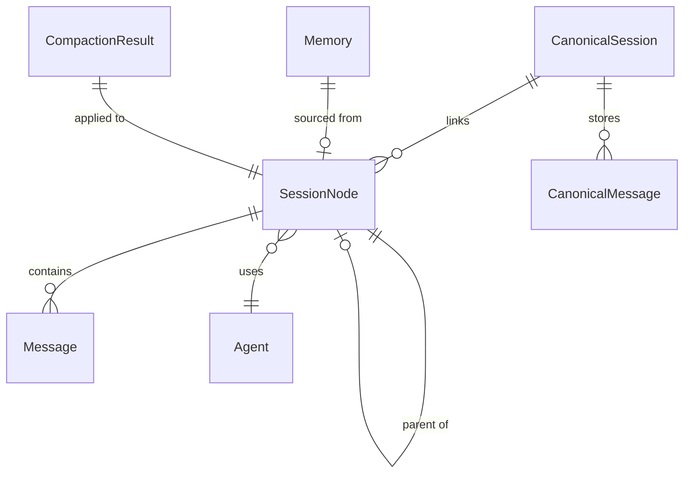

# Context and Session Management Design

> Session tree, context injection, compaction, and memory recall for y-agent

**Version**: v0.6
**Created**: 2026-03-04
**Updated**: 2026-03-06
**Status**: Draft

---

## TL;DR

Context and session management is the core infrastructure that governs y-agent's memory, multi-turn conversation quality, and cross-channel continuity. The design introduces a **Session Tree** structure supporting branching, child sessions, and cross-channel canonical sessions. Context is assembled via a multi-stage **Context Assembly Pipeline** -- an ordered sequence of **context providers** (system prompt, workspace bootstrap, memory recall, skills, tools, context status) implemented as a `ContextMiddleware` chain on top of the y-hooks middleware system (see [hooks-plugin-design.md](hooks-plugin-design.md)). The **InjectTools** stage uses **Tool Lazy Loading**: instead of injecting all tool schemas, it injects only a lightweight **ToolIndex** (tool names) and the **`ToolSearch`** meta-tool definition; full tool schemas are loaded on demand into a session-scoped **ToolActivationSet** (see [tools-design.md](tools-design.md)). A **Context Window Guard** monitors token usage and supports three trigger modes: **auto** (system-triggered compaction at threshold), **soft** (exposes context status to the agent as a learnable signal, enabling agent-initiated compression via indexed experience memory tools), and **hybrid** (soft warnings with hard fallback). **Session Repair** handles history corruption. Together, these mechanisms ensure the agent maintains coherent long-term memory within the finite context window of any LLM.

---

## Background and Goals

### Background

AI agents are bounded by their LLM's context window. Without careful management, long conversations exhaust the window, degrade response quality, or fail entirely. Users also expect cross-channel continuity (starting a conversation in Telegram, continuing in CLI) and the ability to branch conversations for exploratory workflows. These requirements demand a sophisticated session and context management layer.

### Goals

| Goal | Measurable Criteria |
|------|-------------------|
| **Long-term memory** | Agent recalls relevant facts from sessions > 100 messages old |
| **Context efficiency** | Context window utilization stays below 85% under normal operation |
| **Session tree** | Support branch, merge, fork operations with < 200ms latency |
| **Cross-channel continuity** | Canonical Session syncs messages across channels within 1 second |
| **Compaction quality** | Post-compaction summaries preserve all identifiers (strict mode) with < 5% information loss |
| **Recovery** | Session Repair fixes all known corruption patterns (orphan tool results, empty messages, duplicate system messages) automatically |
| **Pipeline extensibility** | New context provider addable by registering a `ContextMiddleware` via y-hooks; no core code changes |

### Assumptions

1. Session data is persisted in JSONL format (one entry per message/event).
2. SQLite is the backing store for session metadata and indexes.
3. Compaction uses a dedicated LLM call (configurable model, default `gpt-4o-mini`).
4. Memory recall uses vector similarity search with a configurable embedding provider.
5. A single user may interact through multiple channels but has one canonical identity.

---

## Scope

### In Scope

- Session Tree structure (parent/child, branch, ephemeral, canonical)
- Session lifecycle management (create, branch, merge, fork, archive, delete, prune)
- Canonical Session for cross-channel unified memory
- Context Assembly Pipeline with ordered, priority-based providers (using y-hooks `ContextMiddleware` chain)
- Built-in context providers: DateTime, Workspace, Memory Recall, Skills, Tools
- Context compaction with multiple strategies (Summarize, Segmented, SelectiveRetain)
- Identifier preservation policy during compaction
- Context Window Guard with token budgeting and overflow recovery
- Session Repair for history consistency
- Memory recall via hybrid vector + text search (RAG)

### Out of Scope

- Long-term memory storage design (see [memory-long-term.md](memory-long-term.md))
- Short-term memory buffer design (see [memory-short-term.md](memory-short-term.md))
- Message scheduling and queue modes (see [message-scheduling-design.md](message-scheduling-design.md))
- Client-side session UI (see [client-layer-design.md](client-layer-design.md))

---

## High-Level Design

### Component Overview



**Diagram rationale**: Flowchart chosen to show module boundaries and dependencies between session, context, compaction, and memory subsystems.

**Legend**:
- **Session Layer**: Manages session tree structure, cross-channel sync, and repair.
- **Context Assembly**: Pipeline that builds the final prompt; delegates to y-hooks `ContextMiddleware` chain for ordered provider execution.
- **y-hooks (external)**: Middleware chains and EventBus from [hooks-plugin-design.md](hooks-plugin-design.md); this module consumes them, does not define them.
- **Compaction**: Summarizes older messages to reclaim context window space.
- **Memory**: Vector-based long-term recall providing relevant facts from past sessions.

### Session Tree

Sessions are organized in a tree structure where each node represents a conversation:

```rust
struct SessionNode {
    id: SessionId,
    parent_id: Option<SessionId>,
    root_id: SessionId,
    depth: u32,
    path: Vec<SessionId>,
    session_type: SessionType,
    state: SessionState,
    metadata: SessionMetadata,
    created_at: Timestamp,
    updated_at: Timestamp,
}
```

| Session Type | Description | Created By |
|-------------|-------------|------------|
| **Main** | Direct user conversation on a channel | User initiates chat |
| **Child** | Sub-task spawned by an agent | Agent delegation |
| **Branch** | Fork from a specific message in another session | User `/branch` command |
| **Ephemeral** | Temporary session with TTL for single-use tasks | System (e.g., compaction) |
| **Canonical** | Virtual session linking multiple channel sessions | Cross-channel sync |

| Session State | Description |
|--------------|-------------|
| **Active** | Currently in use |
| **Paused** | Temporarily suspended |
| **Archived** | Read-only historical record |
| **Merged** | Folded into another session |
| **Tombstone** | Deleted (metadata retained for referential integrity) |

### Canonical Session (Cross-Channel)

When a user interacts through multiple channels (Telegram, Slack, CLI), a Canonical Session provides a unified view:



**Diagram rationale**: Sequence diagram chosen to illustrate how messages from different channels merge into one unified session over time.

**Legend**:
- **Canonical Session** stores the unified message history; each channel session links to it.
- Messages from any channel are available to all other channels via the canonical view.

### Context Assembly Pipeline

Context assembly follows an ordered pipeline of **context providers**, each contributing content to the final prompt. The pipeline is implemented as a `ContextMiddleware` chain registered with the y-hooks middleware system (see [hooks-plugin-design.md](hooks-plugin-design.md)). This ensures that the same extensibility mechanisms (ordering, short-circuit, transformation) available to all y-hooks middleware also apply to context assembly -- without introducing a parallel hook system.


**Diagram rationale**: Flowchart chosen to show the sequential pipeline of context assembly stages.

**Legend**:
- Each stage is a `ContextMiddleware` registered at a specific priority in the y-hooks `ContextMiddleware` chain.
- Middleware can add, modify, or remove context items, and can short-circuit (skip downstream stages) by not calling `next`.
- The **Context Window Guard** is the final gate that ensures total tokens stay within budget.

#### Pipeline Stages (as ContextMiddleware)

| Stage | Priority | Purpose | Built-in Provider |
|-------|----------|---------|------------------|
| `EnrichInput` | 50 | Analyze user input for ambiguity; enrich and replace if needed | TaskIntentAnalyzer sub-agent with interactive clarification (see [input-enrichment-design.md](input-enrichment-design.md)) |
| `BuildSystemPrompt` | 100 | Construct the system message | Inject date/time, agent persona |
| `InjectBootstrap` | 200 | Add workspace context | README.md, AGENTS.md, project structure |
| `InjectMemory` | 300 | Recall relevant memories | Vector search on user message via Memory system |
| `InjectSkills` | 400 | Add active skill descriptions | Skill prompts and knowledge from Skill Registry |
| `InjectTools` | 500 | Inject tool index and active tool schemas | ToolIndex (names only) + `ToolSearch` definition + ToolActivationSet members' full schemas (see [tools-design.md](tools-design.md) Tool Lazy Loading) |
| `LoadHistory` | 600 | Load and filter message history | Session message loading with repair |
| `InjectContextStatus` | 700 | Append context window status | Token counts, threshold, and utilization as a deterministic system message |

Lower priority values execute first. Third-party context providers register at custom priority values to insert themselves between built-in stages (e.g., priority 250 for a custom RAG source between Bootstrap and Memory).

#### Context Status Injection

The `InjectContextStatus` middleware appends a deterministic status message to the end of the assembled context at each agent loop iteration. This message reports current token usage and the compression threshold:

```
[Context Status: working_tokens=6932, threshold=8000, utilization=87%]
```

When utilization exceeds configurable warning levels, additional guidance is injected:

| Utilization | Injected Message |
|-------------|-----------------|
| < 70% | Status only (no action needed) |
| 70-85% | Status + "Consider using compress_experience to archive evidence before context grows further." |
| 85-95% | Status + "WARNING: working context approaching threshold. Use compress_experience now to avoid forced compaction." |
| > 95% | Status + "CRITICAL: context overflow imminent. System compaction will be triggered if compress_experience is not called." |

This design is inspired by [Memex(RL)](../research/memex-rl.md): exposing context status transforms compression timing from a system-enforced constraint into a learnable agent skill. The agent can learn to compress proactively at natural semantic boundaries rather than being forced at arbitrary token thresholds.

#### Integration with y-hooks

The relationship between this document and [hooks-plugin-design.md](hooks-plugin-design.md) follows the same separation pattern as tools-design.md and runtime-design.md: **this module declares what context to assemble; y-hooks provides the infrastructure for how to extend it.**

| Concern | Owned By | Mechanism |
|---------|----------|-----------|
| Pipeline stage ordering and built-in providers | This document (context-session) | `ContextMiddleware` implementations registered at known priorities |
| Middleware chain infrastructure, dispatch, short-circuit | hooks-plugin-design.md (y-hooks) | `ContextMiddleware` chain in the `MiddlewareChain` registry |
| Compaction lifecycle observation | hooks-plugin-design.md (y-hooks) | `pre_compaction` / `post_compaction` lifecycle hooks (read-only) |
| Compaction behavior modification | hooks-plugin-design.md (y-hooks) | `CompactionMiddleware` chain (mutable, can transform) |
| Context and compaction events | hooks-plugin-design.md (y-hooks) | `EventBus` events: `CompactionTriggered`, `ContextOverflow` |

### Compaction

When the Context Window Guard detects that token usage exceeds the configured threshold (default 85%), it triggers compaction:

| Strategy | Behavior | Best For |
|----------|----------|----------|
| **Summarize** | Single LLM call summarizes all messages beyond the retain window | Simple conversations |
| **SegmentedSummarize** | Divide messages into segments, summarize each independently | Long conversations with topic shifts |
| **SelectiveRetain** | Score messages by importance; retain high-scoring ones, summarize the rest | Conversations with key decision points |
| **Custom** | User-provided prompt template for domain-specific summarization | Specialized domains |

#### Identifier Preservation Policy

During compaction, critical identifiers must survive summarization:

| Policy | Behavior |
|--------|----------|
| **Strict** | All identifiers (phone numbers, emails, URLs, session keys, file paths, user IDs) must appear verbatim in the summary |
| **Relaxed** | Identifiers may be paraphrased for shorter summaries |
| **Custom** | User-defined regex patterns specify which identifiers to preserve |

### Context Window Guard

The guard supports three trigger modes that control how context overflow is handled:

| Mode | Behavior | Best For |
|------|----------|----------|
| **auto** (default) | System triggers compaction when utilization exceeds threshold (85%). Agent is unaware of compression. | Simple setups; models without compress_experience tool training |
| **soft** | System only injects Context Status messages. The agent is expected to call `compress_experience` proactively. Hard compaction only triggers at the 95% emergency threshold. | Long-horizon tasks; models that understand indexed experience memory |
| **hybrid** | Soft warnings at 70-85% utilization; system compaction at 85% as fallback. Combines agent autonomy with safety net. | General-purpose; recommended default for agents with memory tools enabled |

The mode is configured per agent or per session via `context.guard.trigger_mode`. When `compress_experience` / `read_experience` tools are enabled for an agent, the guard defaults to `hybrid`.

The guard enforces a token budget across five categories:

| Budget Category | Default Allocation | Description |
|----------------|-------------------|-------------|
| System Prompt | 8,000 tokens | Agent persona, date/time, instructions |
| Tools Schema | 16,000 tokens | Tool definitions and schemas. With Tool Lazy Loading enabled, initial usage is ~300-500 tokens (ToolIndex + ToolSearch); grows incrementally as tools are activated. Budget ceiling unchanged for safety. |
| History | 80,000 tokens | Conversation messages |
| Bootstrap | 8,000 tokens | Workspace context, README, etc. |
| Response Reserve | 16,000 tokens | Reserved for LLM output |

**Total**: 128,000 tokens (configurable per model).

When overflow is detected, the guard applies recovery actions in priority order:
1. **Compact history** (most common)
2. **Trim bootstrap** (remove low-priority workspace files)
3. **Evict tools** (deactivate least-recently-used tools from the ToolActivationSet, keeping only always-active tools; when lazy loading is disabled, fall back to removing non-essential tool schemas)
4. **Abort** (if all else fails)

### Session Repair

Session history may become inconsistent due to crashes, network interruptions, or bugs. The repair mechanism fixes:

| Issue | Detection | Repair |
|-------|-----------|--------|
| Orphan tool results (no matching tool call) | Tool result without preceding tool call ID | Remove orphan result |
| Empty messages | Message with no content blocks | Remove empty message |
| Duplicate system messages | Multiple system messages in history | Keep first, remove duplicates |
| Consecutive same-role messages | Adjacent messages with same role | Merge into single message |
| Corrupted message format | JSON parse failure | Skip corrupted entry, log warning |

### Memory Recall (RAG)

The recall system searches long-term memory for facts relevant to the current conversation:

| Recall Method | Description | Use Case |
|--------------|-------------|----------|
| **Text** | Full-text search on memory content | Keyword-specific queries |
| **Vector** | Cosine similarity on embeddings | Semantic similarity |
| **Hybrid** | Weighted combination of text and vector scores | Default; balances precision and recall |
| **TimeWeighted** | Decay factor reduces score of older memories | Prefer recent context |
| **ImportanceBased** | Score multiplied by stored importance weight | Prioritize key decisions |

Recall results are filtered by relevance threshold (default 0.6) and diversity factor (MMR algorithm) before injection into context.

---

## Key Flows/Interactions

### Full Context Preparation Flow



**Diagram rationale**: Sequence diagram chosen to show the temporal ordering of context preparation steps including the conditional compaction branch.

**Legend**:
- **Context Manager** orchestrates the flow by invoking the `ContextMiddleware` chain.
- **ContextMiddleware Chain** executes built-in and third-party context providers in priority order.
- **CompactionMiddleware Chain** wraps compaction, allowing middleware to preserve data or alter strategy.
- Both middleware chains are managed by y-hooks (see [hooks-plugin-design.md](hooks-plugin-design.md)).

---

## Data and State Model

### Session Entity

| Field | Type | Description |
|-------|------|-------------|
| `id` | SessionId | Unique identifier |
| `parent_id` | Option<SessionId> | Parent in session tree |
| `root_id` | SessionId | Root of the session tree |
| `session_type` | SessionType | Main, Child, Branch, Ephemeral, Canonical |
| `state` | SessionState | Active, Paused, Archived, Merged, Tombstone |
| `agent_id` | AgentId | Associated agent |
| `label` | Option<String> | User-defined label |
| `channel` | Option<String> | Source channel (Telegram, Slack, CLI, etc.) |
| `message_count` | usize | Total messages |
| `token_count` | usize | Estimated total tokens |
| `last_compaction` | Option<Timestamp> | When last compacted |
| `compaction_count` | u32 | Number of compactions performed |

### Canonical Session Entity

| Field | Type | Description |
|-------|------|-------------|
| `id` | CanonicalSessionId | Unique identifier |
| `agent_id` | AgentId | Associated agent |
| `user_id` | UserId | Associated user |
| `linked_sessions` | Vec<LinkedSession> | Channel sessions linked to this canonical |
| `compaction_cursor` | usize | Messages before this index are compacted |
| `summary` | String | Compaction summary of older messages |

### Entity Relationships



**Diagram rationale**: ER diagram chosen to show structural relationships between session, message, memory, and compaction entities.

**Legend**:
- **SessionNode** is the central entity; it can be a parent of other sessions and contains messages.
- **CanonicalSession** links multiple channel-specific sessions into a unified view.
- **Memory** entries are sourced from specific sessions and recalled across sessions.

---

## Failure Handling and Edge Cases

| Scenario | Handling |
|----------|---------|
| Compaction LLM call fails | Retry up to 3 times; fall back to simple truncation (keep retain window, drop older messages) |
| Compaction produces invalid summary (too short, missing identifiers) | Re-run with explicit instructions; after 2 failures, use truncation fallback |
| Session JSONL file corrupted | Session Repair processes what it can; corrupted entries skipped with warning log |
| Canonical session sync conflict | Last-write-wins with timestamp ordering; warn if clock skew > 5 seconds |
| Memory recall returns no results | Proceed without memory context; log for observability |
| Context middleware fails | Handled by y-hooks middleware error policy: log error, skip failed middleware, continue with remaining providers (do not abort context build). See [hooks-plugin-design.md](hooks-plugin-design.md) failure handling. |
| Context window too small for system prompt + tools alone | Abort with clear error: "Model context window too small for configured tools" |
| Concurrent writes to same session | JSONL append is serialized via session-level write lock (see message-scheduling-design) |
| Branch from compacted region | Restore full pre-compaction history from JSONL archive; create branch from original messages |
| Prune removes session with active children | Refuse prune; require `--recursive` flag or manual child reassignment |

---

## Security and Permissions

| Concern | Approach |
|---------|----------|
| **Cross-channel isolation** | Canonical sessions are scoped to (user_id, agent_id) pairs; no cross-user access |
| **Memory access control** | Memory entries tagged with source session; agents can only recall memories from sessions they are authorized for |
| **Compaction audit trail** | Every compaction logs: original message count, summary hash, tokens saved, model used |
| **Sensitive data in summaries** | Strict identifier policy preserves but does not add sensitive data; optional redaction hook can scrub PII before persistence |
| **Session deletion** | Tombstone state preserves metadata for audit; message content deleted after configurable retention period |
| **Pipeline security** | Context providers execute as y-hooks middleware (in-process). Third-party extensions follow the same trust model as y-hooks hook handlers (see [hooks-plugin-design.md](hooks-plugin-design.md) security model). |

---

## Performance and Scalability

### Performance Targets

| Metric | Target |
|--------|--------|
| Context preparation (no compaction) | < 100ms |
| Context preparation (with compaction) | < 5s (dominated by LLM call) |
| Session tree traversal (1000 nodes) | < 10ms |
| Memory recall (hybrid search, 5 results) | < 200ms |
| Session Repair (100 messages) | < 50ms |
| Canonical Session sync latency | < 1s end-to-end |
| Context pipeline (all built-in providers) | < 50ms total |

### Optimization Strategies

- **Lazy compaction**: Only compact when the guard detects overflow, not on every message.
- **Incremental repair**: Repair only processes messages added since last repair, not the full history.
- **Cached embeddings**: Memory embeddings are computed once and cached; re-computed only on content change.
- **Session tree index**: SQLite indexes on `parent_id`, `root_id`, and `state` for fast tree queries.
- **Compaction model selection**: Use a fast, cheap model (e.g., `gpt-4o-mini`) for compaction to minimize cost and latency.

---

## Observability

### Metrics

| Metric | Type | Description |
|--------|------|-------------|
| `context.tokens_used` | Gauge | Current token usage by category (system, history, tools, bootstrap) |
| `context.window_utilization` | Gauge | Percentage of context window used |
| `context.compaction_count` | Counter | Compactions triggered |
| `context.compaction_tokens_saved` | Counter | Tokens reclaimed by compaction |
| `context.compaction_duration_ms` | Histogram | Compaction latency |
| `session.tree_depth` | Gauge | Maximum depth of session tree |
| `session.active_count` | Gauge | Number of active sessions |
| `memory.recall_count` | Counter | Memory recall invocations |
| `memory.recall_latency_ms` | Histogram | Memory recall latency |
| `repair.fixes_applied` | Counter | Repairs applied by type |

### Events (via y-hooks EventBus)

All events below are published through the y-hooks `EventBus` (see [hooks-plugin-design.md](hooks-plugin-design.md)), ensuring unified event delivery and subscriber management across the entire system.

| Event | Payload | Trigger |
|-------|---------|---------|
| `CompactionTriggered` | session_id, strategy, tokens_before, tokens_after | Context overflow detected and compaction executed |
| `CompactionFailed` | session_id, error, fallback_used | Compaction error |
| `SessionRepaired` | session_id, fixes (empty, orphan, merge, dedup counts) | Repair executed |
| `ContextOverflow` | session_id, estimated_tokens, budget | Guard detects overflow before compaction |
| `CanonicalSynced` | canonical_id, source_channel, message_count | Cross-channel sync |

---

## Rollout and Rollback

### Phased Implementation

| Phase | Scope | Duration |
|-------|-------|----------|
| **Phase 1**: Session Foundation | Session CRUD, Session Tree, persistence (JSONL + SQLite) | 2-3 weeks |
| **Phase 2**: Context Management | Context Window Guard, Session Repair, Context Assembly Pipeline (built-in providers via y-hooks `ContextMiddleware`), basic compaction (Summarize) | 3-4 weeks |
| **Phase 3**: Advanced Features | Canonical Session, Memory Recall (RAG), multi-strategy compaction, `CompactionMiddleware` chain integration with y-hooks | 3-4 weeks |
| **Phase 4**: Optimization | Performance tuning, test coverage, monitoring, documentation | 2-3 weeks |

### Migration Strategy

- **Session Tree**: New sessions automatically use tree structure. Existing flat sessions treated as root nodes with no children.
- **Compaction**: Backward-compatible; sessions without compaction history start fresh.
- **Canonical Session**: Opt-in via config flag `context.canonical.enabled`. No impact on single-channel users.
- **Context Pipeline**: Built-in context providers registered by default at standard priorities. Custom providers registered via y-hooks middleware chain API (see [hooks-plugin-design.md](hooks-plugin-design.md)).

### Rollback Plan

| Component | Rollback |
|-----------|----------|
| Session Tree | Feature flag `session_tree`; disable to revert to flat session list |
| Compaction | Feature flag `compaction`; disable to use simple message truncation |
| Canonical Session | Feature flag `canonical_session`; disable for per-channel isolation |
| Memory Recall | Feature flag `memory_recall`; disable to skip memory injection |

---

## Alternatives and Trade-offs

### Session Structure: Tree vs Flat

| | Tree (chosen) | Flat List |
|-|--------------|-----------|
| **Branch/merge support** | Native | Requires workaround |
| **Sub-task modeling** | Natural parent-child | Unrelated sessions |
| **Complexity** | Higher (tree traversal, prune) | Simple |
| **Query performance** | Requires tree indexes | Simple list scan |

**Decision**: Tree structure. Branch/merge is a core workflow requirement; flat lists cannot model parent-child relationships needed for sub-agent delegation.

### Compaction Approach: LLM vs Truncation

| | LLM Summarization (chosen) | Simple Truncation |
|-|---------------------------|-------------------|
| **Information preservation** | High (key facts retained) | Low (oldest messages lost) |
| **Cost** | LLM call per compaction | Zero |
| **Latency** | 1-5 seconds | Instant |
| **Identifier safety** | Configurable policy | N/A (messages deleted entirely) |

**Decision**: LLM summarization as primary strategy with truncation as fallback. Information preservation justifies the cost; compaction model can be cheap (`gpt-4o-mini`).

### Cross-Channel: Canonical Session vs Independent Sessions

| | Canonical (chosen) | Independent |
|-|-------------------|-------------|
| **Memory continuity** | Full cross-channel | Per-channel only |
| **Complexity** | Sync protocol needed | None |
| **Privacy** | All channels see all history | Channel-isolated |

**Decision**: Canonical Session as opt-in feature. Users who want cross-channel continuity enable it; privacy-sensitive users keep channels independent.

### Memory Recall: Hybrid vs Vector Only

| | Hybrid (chosen) | Vector Only | Text Only |
|-|----------------|------------|-----------|
| **Precision** | High (exact + semantic) | Moderate | High for exact terms |
| **Recall** | High | High | Low for paraphrases |
| **Cost** | Embedding + text search | Embedding only | No embedding |

**Decision**: Hybrid search with configurable weights (default: text 0.4, vector 0.6). Combines exact keyword matching with semantic similarity for best overall recall quality.

---

## Open Questions

| # | Question | Owner | Due Date | Status |
|---|----------|-------|----------|--------|
| 1 | What is the maximum session tree depth? Should there be a configurable limit? | Context team | 2026-03-20 | Open |
| 2 | Should compaction summaries be editable by users (for correction)? | Context team | 2026-03-27 | Open |
| 3 | How should Canonical Session handle conflicting agent configurations across channels? | Context team | 2026-03-27 | Open |
| 4 | Should memory recall use a dedicated embedding model or share the agent's LLM? | Context team | 2026-04-03 | Open |
| 5 | What is the retention policy for tombstoned sessions? 30 days? 90 days? Configurable? | Context team | 2026-03-20 | Open |

