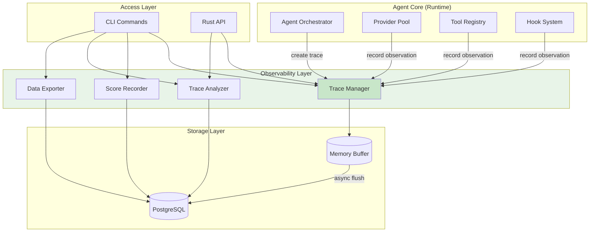
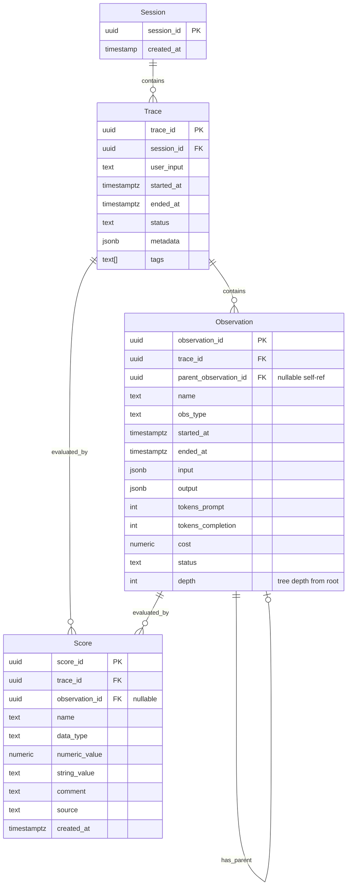
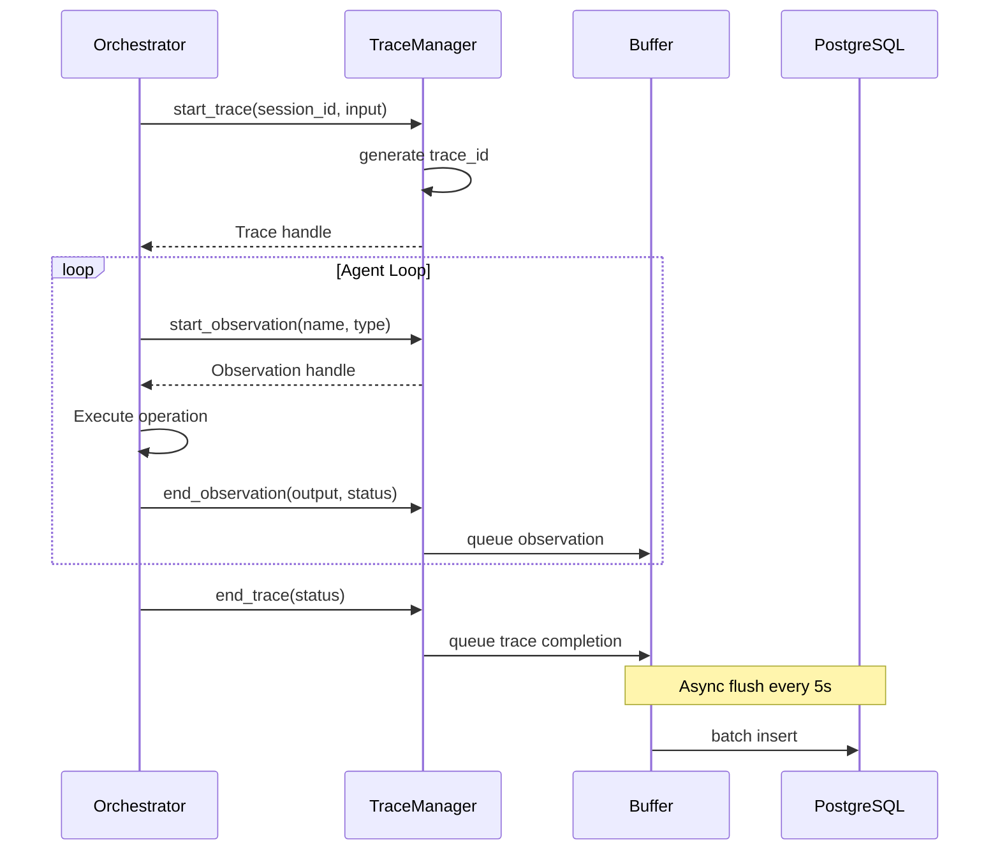
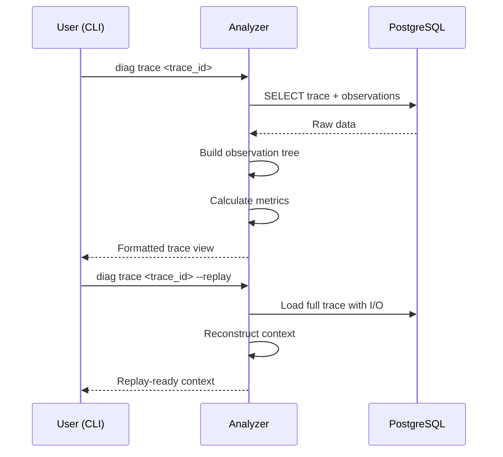
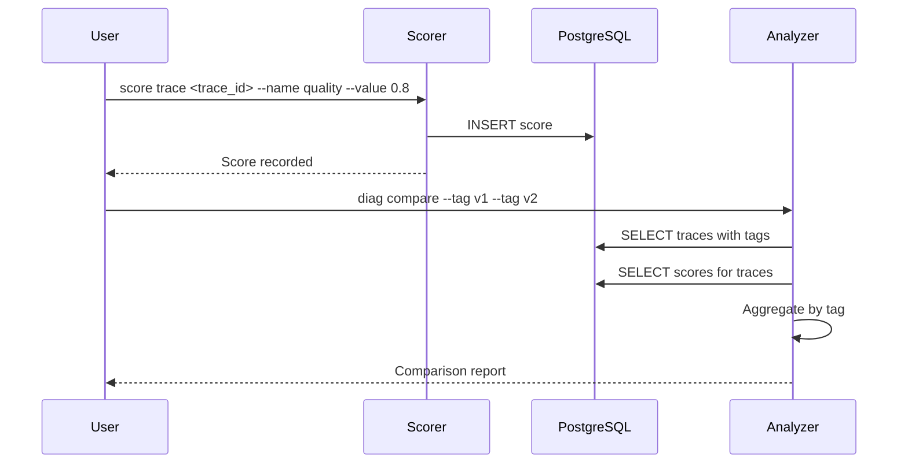

# y-agent Observability Design v0.2

> Enhanced observability for LLM Agent debugging, analysis, and iteration

## TL;DR

This document optimizes the diagnostics module design with a focus on **observability** - the ability to understand what the agent is doing, why it fails, and how to improve it. Key enhancements over v0.1:

- **Trace-centric model**: Everything revolves around structured traces with rich observations
- **Lightweight evaluation**: Simple scoring system for iterating on prompts and behaviors
- **Replay capability**: Reconstruct exact execution context for debugging
- **Cost intelligence**: Deep insights into token usage and cost optimization
- **Semantic search**: Find traces by content patterns, not just IDs

Designed for personal research: PostgreSQL-backed (shared infrastructure), CLI-first.

---

## Background and Goals

### Why Observability Matters for LLM Agents

Traditional logging tells you "what happened." Observability tells you "why it happened" and "how to make it better." For LLM agents, this means:

1. **Debugging**: When an agent produces wrong output, trace back the exact prompt, context, and reasoning
2. **Iteration**: Compare different prompts, models, or strategies with measurable outcomes
3. **Cost control**: Understand where tokens are spent and how to optimize
4. **Pattern discovery**: Identify common failure modes and success patterns

### Design Goals

| Goal | Description | Success Criteria |
|------|-------------|------------------|
| Debuggability | Replay any conversation to see exactly what happened | 100% trace reconstruction accuracy |
| Measurability | Quantify agent behavior changes | Support before/after comparisons |
| Low overhead | Minimal impact on agent performance | < 1% latency increase |
| Integrated | Reuse existing PostgreSQL infrastructure | No separate storage management |
| Research-friendly | Easy export and analysis | JSON/Parquet export support |

### Non-Goals

- Production-grade multi-tenant observability (use Langfuse for that)
- Real-time dashboards with sub-second updates
- Distributed tracing across multiple services
- Automated alerting systems

---

## Scope

### In Scope

- Trace and observation data model (Langfuse-inspired, simplified)
- Lightweight evaluation scoring
- Cost and performance analytics
- CLI-based query and analysis tools
- Local storage with export capabilities
- Trace replay for debugging

### Out of Scope

- Web dashboard (defer to future version)
- Prompt management and versioning (separate concern)
- A/B testing framework
- Automated anomaly detection
- Integration with external APM tools

---

## High-Level Design

### Architecture Overview



**Rationale**: Flowchart chosen to show component relationships and data flow. The observability layer sits alongside the core, receiving events but not blocking execution.

**Legend**:
- Green nodes: Observability components (focus of this design)
- Arrows: Data flow direction
- Dashed lines would indicate optional/future connections

### Core Concept: Trace as First-Class Citizen

Following Langfuse's model, every agent interaction produces a **Trace** containing **Observations**:



**Rationale**: ER diagram chosen to show entity relationships. This is the foundation of all observability features.

**Legend**:
- Session: User session context (FK from core module)
- Trace: Top-level container for one agent task execution
- Observation: Individual operation (LLM call, tool use, etc.); supports nesting via `parent_observation_id` forming a tree structure where `depth=0` is root
- Score: Evaluation attached to trace or specific observation

---

## Key Flows/Interactions

### Flow 1: Trace Recording



**Rationale**: Sequence diagram shows the temporal flow of trace recording, emphasizing non-blocking writes.

### Flow 2: Trace Analysis and Replay



**Rationale**: Sequence diagram illustrates the debug workflow, a key use case for research.

### Flow 3: Scoring and Evaluation



**Rationale**: Shows how scoring enables quantitative iteration, inspired by Langfuse's evaluation model.

---

## Data and State Model

### Enhanced Observation Types

Expanding beyond v0.1 to cover more LLM agent patterns:

```rust
pub enum ObservationType {
    // Core types
    Span,           // Generic time span (custom logic)
    LlmCall,        // LLM invocation

    // Tool ecosystem
    ToolCall,       // External tool execution
    McpCall,        // MCP server interaction

    // RAG pipeline
    Retrieval,      // Document retrieval
    Embedding,      // Embedding generation
    Reranking,      // Result reranking

    // Agent patterns
    SubAgent,       // Sub-agent spawning
    Planning,       // Planning/reasoning step
    Reflection,     // Self-reflection/critique

    // Safety
    Guardrail,      // Safety check execution

    // System
    Hook,           // Hook execution
    Cache,          // Cache hit/miss
}
```

### Score Data Model

Following Langfuse's score types, adapted for simplicity:

```rust
pub struct Score {
    pub score_id: ScoreId,
    pub trace_id: TraceId,
    pub observation_id: Option<ObservationId>,  // Optional: score whole trace or specific observation
    pub name: String,                            // e.g., "accuracy", "helpfulness", "cost_efficiency"
    pub data_type: ScoreDataType,
    pub value: ScoreValue,
    pub comment: Option<String>,
    pub source: ScoreSource,
    pub created_at: Timestamp,
}

pub enum ScoreDataType {
    Numeric,    // 0.0-1.0 or custom range
    Categorical,// "good", "bad", "neutral"
    Boolean,    // pass/fail
}

pub enum ScoreValue {
    Numeric(f64),
    Categorical(String),
    Boolean(bool),
}

pub enum ScoreSource {
    Manual,      // Human annotation
    Automatic,   // Rule-based evaluation
    LlmJudge,    // LLM-as-judge evaluation
    UserFeedback,// End-user feedback
}
```

### Enhanced Trace Metadata

```rust
pub struct Trace {
    pub trace_id: TraceId,
    pub session_id: SessionId,
    pub user_input: String,

    // Timing
    pub started_at: Timestamp,
    pub ended_at: Option<Timestamp>,

    // Status
    pub status: TraceStatus,

    // Aggregated metrics (computed on trace end)
    pub total_tokens: u32,
    pub total_cost: f64,
    pub total_duration_ms: u64,
    pub llm_duration_ms: u64,
    pub tool_duration_ms: u64,

    // Organization
    pub tags: Vec<String>,           // For grouping: ["v1", "experiment-a", "gpt-4"]
    pub metadata: HashMap<String, Value>,

    // Replay support
    pub replay_context: Option<ReplayContext>,
}

pub struct ReplayContext {
    pub system_prompt: String,
    pub conversation_history: Vec<Message>,
    pub tool_definitions: Vec<ToolDefinition>,
    pub config_snapshot: HashMap<String, Value>,
}
```

### Database Schema (PostgreSQL)

Database connection and migration are managed by the core infrastructure module. The observability module only defines its schema requirements.

```sql
-- Schema namespace for observability tables
CREATE SCHEMA IF NOT EXISTS observability;

-- Traces table with enhanced fields
CREATE TABLE observability.traces (
    trace_id UUID PRIMARY KEY DEFAULT gen_random_uuid(),
    session_id UUID NOT NULL,
    user_input TEXT NOT NULL,
    started_at TIMESTAMPTZ NOT NULL DEFAULT NOW(),
    ended_at TIMESTAMPTZ,
    status TEXT NOT NULL DEFAULT 'running',

    -- Aggregated metrics (computed on trace end)
    total_tokens INTEGER DEFAULT 0,
    total_cost NUMERIC(12, 6) DEFAULT 0.0,
    total_duration_ms INTEGER,
    llm_duration_ms INTEGER DEFAULT 0,
    tool_duration_ms INTEGER DEFAULT 0,

    -- Organization
    tags TEXT[] DEFAULT '{}',
    metadata JSONB DEFAULT '{}',
    replay_context JSONB,

    -- Constraints
    CONSTRAINT valid_status CHECK (status IN ('running', 'completed', 'failed', 'timeout'))
);

-- Observations table with tree structure support
CREATE TABLE observability.observations (
    observation_id UUID PRIMARY KEY DEFAULT gen_random_uuid(),
    trace_id UUID NOT NULL REFERENCES observability.traces(trace_id) ON DELETE CASCADE,
    parent_observation_id UUID REFERENCES observability.observations(observation_id) ON DELETE CASCADE,

    -- Tree metadata
    depth INTEGER NOT NULL DEFAULT 0,
    path UUID[] NOT NULL DEFAULT '{}',  -- Materialized path for efficient tree queries

    name TEXT NOT NULL,
    obs_type TEXT NOT NULL,
    started_at TIMESTAMPTZ NOT NULL DEFAULT NOW(),
    ended_at TIMESTAMPTZ,

    -- Content (nullable for async recording)
    input JSONB,
    output JSONB,

    -- Metrics
    tokens_prompt INTEGER DEFAULT 0,
    tokens_completion INTEGER DEFAULT 0,
    cost NUMERIC(12, 6) DEFAULT 0.0,
    duration_ms INTEGER,

    status TEXT NOT NULL DEFAULT 'running',
    error_message TEXT,
    metadata JSONB DEFAULT '{}',

    -- Constraints
    CONSTRAINT valid_obs_type CHECK (obs_type IN (
        'span', 'llm_call', 'tool_call', 'mcp_call',
        'retrieval', 'embedding', 'reranking',
        'sub_agent', 'planning', 'reflection',
        'guardrail', 'hook', 'cache'
    )),
    CONSTRAINT valid_obs_status CHECK (status IN ('running', 'success', 'failed'))
);

-- Scores table for evaluation
CREATE TABLE observability.scores (
    score_id UUID PRIMARY KEY DEFAULT gen_random_uuid(),
    trace_id UUID NOT NULL REFERENCES observability.traces(trace_id) ON DELETE CASCADE,
    observation_id UUID REFERENCES observability.observations(observation_id) ON DELETE CASCADE,

    name TEXT NOT NULL,
    data_type TEXT NOT NULL,
    numeric_value NUMERIC(10, 4),
    string_value TEXT,
    comment TEXT,
    source TEXT NOT NULL,
    created_at TIMESTAMPTZ NOT NULL DEFAULT NOW(),

    -- Constraints
    CONSTRAINT valid_data_type CHECK (data_type IN ('numeric', 'categorical', 'boolean')),
    CONSTRAINT valid_source CHECK (source IN ('manual', 'automatic', 'llm_judge', 'user_feedback'))
);

-- Indexes for common query patterns
CREATE INDEX idx_traces_session ON observability.traces(session_id);
CREATE INDEX idx_traces_started ON observability.traces(started_at DESC);
CREATE INDEX idx_traces_status ON observability.traces(status);
CREATE INDEX idx_traces_tags ON observability.traces USING GIN(tags);

CREATE INDEX idx_obs_trace ON observability.observations(trace_id);
CREATE INDEX idx_obs_type ON observability.observations(obs_type);
CREATE INDEX idx_obs_parent ON observability.observations(parent_observation_id);
CREATE INDEX idx_obs_path ON observability.observations USING GIN(path);

CREATE INDEX idx_scores_trace ON observability.scores(trace_id);
CREATE INDEX idx_scores_name ON observability.scores(name);
CREATE INDEX idx_scores_created ON observability.scores(created_at DESC);

-- Full-text search for semantic queries
CREATE INDEX idx_traces_fts ON observability.traces
    USING GIN(to_tsvector('english', user_input));

CREATE INDEX idx_obs_fts ON observability.observations
    USING GIN(to_tsvector('english', COALESCE(name, '') || ' ' || COALESCE(input::text, '') || ' ' || COALESCE(output::text, '')));

-- Materialized view for aggregated statistics (refreshed periodically)
CREATE MATERIALIZED VIEW observability.trace_stats AS
SELECT
    DATE_TRUNC('hour', started_at) AS hour,
    COUNT(*) AS trace_count,
    SUM(total_tokens) AS total_tokens,
    SUM(total_cost) AS total_cost,
    AVG(total_duration_ms) AS avg_duration_ms,
    COUNT(*) FILTER (WHERE status = 'failed') AS failed_count
FROM observability.traces
WHERE started_at > NOW() - INTERVAL '30 days'
GROUP BY DATE_TRUNC('hour', started_at);

CREATE UNIQUE INDEX idx_trace_stats_hour ON observability.trace_stats(hour);
```

**Tree Query Examples**:

```sql
-- Get all observations for a trace as a tree
SELECT
    observation_id,
    parent_observation_id,
    depth,
    REPEAT('  ', depth) || name AS indented_name,
    obs_type,
    duration_ms
FROM observability.observations
WHERE trace_id = $1
ORDER BY path;

-- Get all descendants of an observation
SELECT * FROM observability.observations
WHERE path @> ARRAY[$observation_id]::uuid[];

-- Get root observations only
SELECT * FROM observability.observations
WHERE trace_id = $1 AND depth = 0;
```

---

## Failure Handling and Edge Cases

### Failure Scenarios

| Scenario | Detection | Handling | Recovery |
|----------|-----------|----------|----------|
| Buffer overflow | Buffer size check | Drop oldest entries | Log warning, continue |
| DB connection failure | Connection pool error | Retry with backoff | Buffer in memory, retry |
| Trace not found | Query returns empty | Return clear error | Suggest similar traces |
| Corrupted JSONB data | Parse/validation error | Mark as corrupted | Skip in aggregations |
| High-frequency traces | Rate monitoring | Auto-sampling | Configurable rate limit |
| Transaction deadlock | PostgreSQL error code | Retry transaction | Exponential backoff |

### Edge Cases

1. **Very long traces**: Truncate input/output fields beyond configurable limit; PostgreSQL TOAST handles large JSONB automatically
2. **Concurrent trace access**: PostgreSQL MVCC handles concurrent reads/writes natively
3. **Clock skew**: Use TIMESTAMPTZ for consistent timezone handling; rely on database server time for ordering
4. **Orphaned observations**: Foreign key constraints with ON DELETE CASCADE prevent orphans
5. **Tree integrity**: Materialized path array ensures consistent tree structure; validated on insert

---

## Security and Permissions

### Sensitive Data Handling

```rust
pub struct RedactionConfig {
    /// Patterns to redact (regex)
    pub patterns: Vec<RedactionPattern>,
    /// Fields to never capture
    pub excluded_fields: Vec<String>,
    /// Maximum content length before truncation
    pub max_content_length: usize,
}

pub struct RedactionPattern {
    pub name: String,
    pub pattern: Regex,
    pub replacement: String,  // e.g., "[REDACTED:api_key]"
}

// Default patterns for personal use
impl Default for RedactionConfig {
    fn default() -> Self {
        Self {
            patterns: vec![
                RedactionPattern::api_key(),    // sk-..., key-...
                RedactionPattern::email(),       // user@domain.com
                RedactionPattern::credit_card(), // 16-digit patterns
            ],
            excluded_fields: vec!["password", "secret", "token"],
            max_content_length: 50_000,
        }
    }
}
```

### Access Control (Simple)

For personal research, access control is minimal:
- PostgreSQL role-based access (managed by infrastructure)
- Schema-level isolation (`observability` schema)
- CLI uses shared database credentials from environment

---

## Performance and Scalability

### Performance Targets

| Metric | Target | Measurement |
|--------|--------|-------------|
| Observation recording latency | < 100us | Time from call to return |
| Buffer flush latency | < 50ms | 95th percentile |
| Trace query latency | < 100ms | Single trace with observations |
| Aggregation query latency | < 500ms | 1000 traces |
| Memory overhead | < 50MB | Buffer + indexes |
| Disk usage | < 1GB default | Configurable retention |

### Optimization Strategies

1. **Async buffered writes**: All writes go to memory buffer, flushed every 5 seconds
2. **Batch inserts**: Multiple observations inserted in single transaction
3. **Lazy aggregation**: Trace metrics computed on end, not incrementally
4. **Sampling**: Configurable sample rate for high-throughput scenarios
5. **Index optimization**: Indexes only on frequently-queried columns
6. **Retention policies**: Auto-delete traces older than N days

### Scalability Limits

For personal research use:
- PostgreSQL handles millions of traces efficiently with proper indexing
- Up to 1,000 observations per trace (soft limit for tree depth/width)
- Materialized views refresh for analytics; configurable retention via `pg_cron` or application-level cleanup

---

## Observability

Yes, observability for the observability system:

### Internal Metrics

```rust
pub struct ObservabilityMetrics {
    pub traces_created: Counter,
    pub observations_recorded: Counter,
    pub buffer_size: Gauge,
    pub flush_duration_ms: Histogram,
    pub query_duration_ms: Histogram,
    pub errors: Counter,
}
```

### Health Checks

```bash
# Check observability system health
y-agent diag self-check

# Output:
# Observability System Health
# - Database: OK (connection pool: 5/10, latency: 2ms)
# - Traces: 12,340 (last 30 days)
# - Buffer: OK (pending: 23 items)
# - Last flush: 2.3s ago
# - Write rate: 15 traces/min
```

---

## Rollout and Rollback

### Migration from v0.1

1. **Schema migration**: Add new columns (tags, replay_context, scores table)
2. **Data migration**: Existing traces get empty tags and no replay context
3. **Config migration**: New config options use sensible defaults

```sql
-- Migration script
ALTER TABLE traces ADD COLUMN tags TEXT;
ALTER TABLE traces ADD COLUMN replay_context TEXT;
ALTER TABLE traces ADD COLUMN total_tokens INTEGER DEFAULT 0;
ALTER TABLE traces ADD COLUMN total_cost REAL DEFAULT 0.0;

CREATE TABLE IF NOT EXISTS scores (...);

-- Backfill aggregated metrics
UPDATE traces SET total_tokens = (
    SELECT COALESCE(SUM(tokens_prompt + tokens_completion), 0)
    FROM observations WHERE observations.trace_id = traces.trace_id
);
```

### Rollback

Keep v0.1 schema compatible: new columns are nullable, new tables can be dropped.

---

## Alternatives and Trade-offs

### Alternative 1: Use Langfuse Directly

| Aspect | Using Langfuse | Custom Solution |
|--------|----------------|-----------------|
| Setup complexity | Higher (external service) | Lower (embedded) |
| Features | Rich, production-ready | Minimal, research-focused |
| Data ownership | Cloud/self-hosted | Fully local |
| Customization | Limited | Full control |
| Cost | Free tier limits | Free |

**Decision**: Custom solution better fits personal research needs for simplicity and data ownership.

### Alternative 2: OpenTelemetry Integration

| Aspect | OTel Integration | Standalone |
|--------|------------------|------------|
| Ecosystem | Rich tooling | Custom only |
| Complexity | Higher (spec compliance) | Lower |
| LLM-specific | Requires extensions | Native support |
| Export | Standard formats | Custom + standard |

**Decision**: Standalone with optional OTel export provides best balance. Implement OTel exporter as P2 feature.

### Alternative 3: Log-based Observability

| Aspect | Structured Logs | Trace Model |
|--------|-----------------|-------------|
| Query flexibility | Lower (text search) | Higher (relations) |
| Storage efficiency | Lower (redundant) | Higher (normalized) |
| Analysis capability | Basic | Advanced |
| Implementation | Simple | Medium |

**Decision**: Trace model enables richer analysis critical for LLM debugging.

---

## Open Questions

| Question | Owner | Due Date | Status |
|----------|-------|----------|--------|
| Should replay context be stored inline or in separate table? | TBD | 2026-03-15 | Resolved: inline in JSONB, PostgreSQL TOAST handles large values |
| FTS index update strategy: sync or async? | TBD | 2026-03-12 | Resolved: sync via GIN index, async refresh for materialized views |
| Default retention period for research use? | TBD | 2026-03-10 | Open |
| Score aggregation: mean, median, or configurable? | TBD | 2026-03-12 | Open |
| Materialized path vs. recursive CTE for tree queries? | TBD | 2026-03-15 | Resolved: materialized path for read performance |

