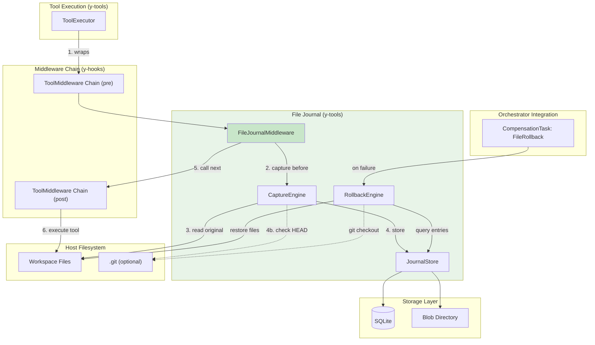
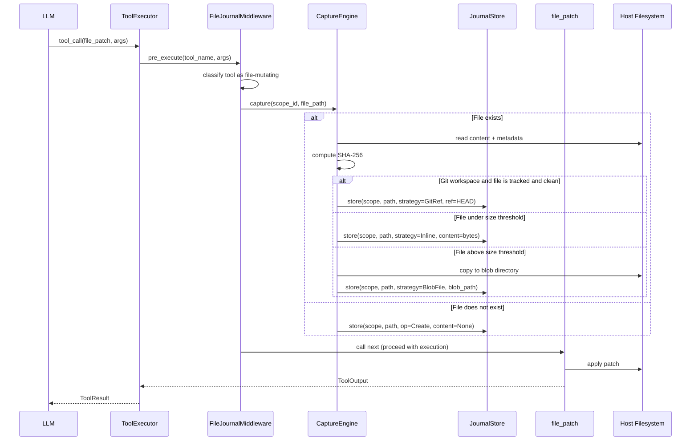
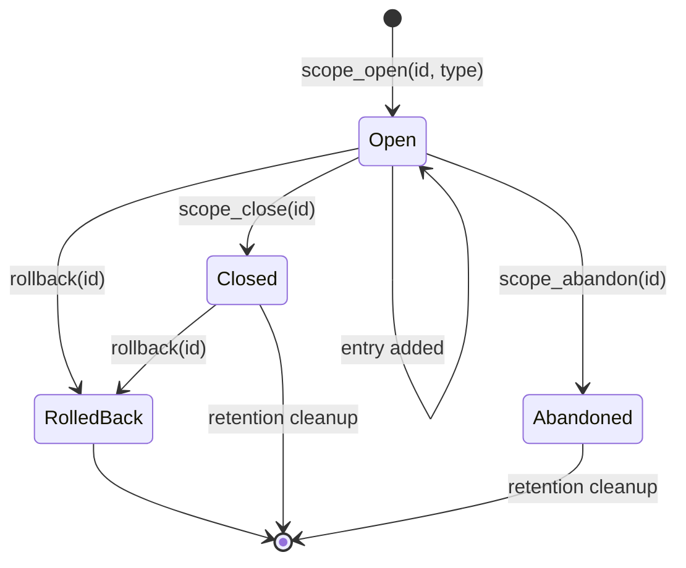
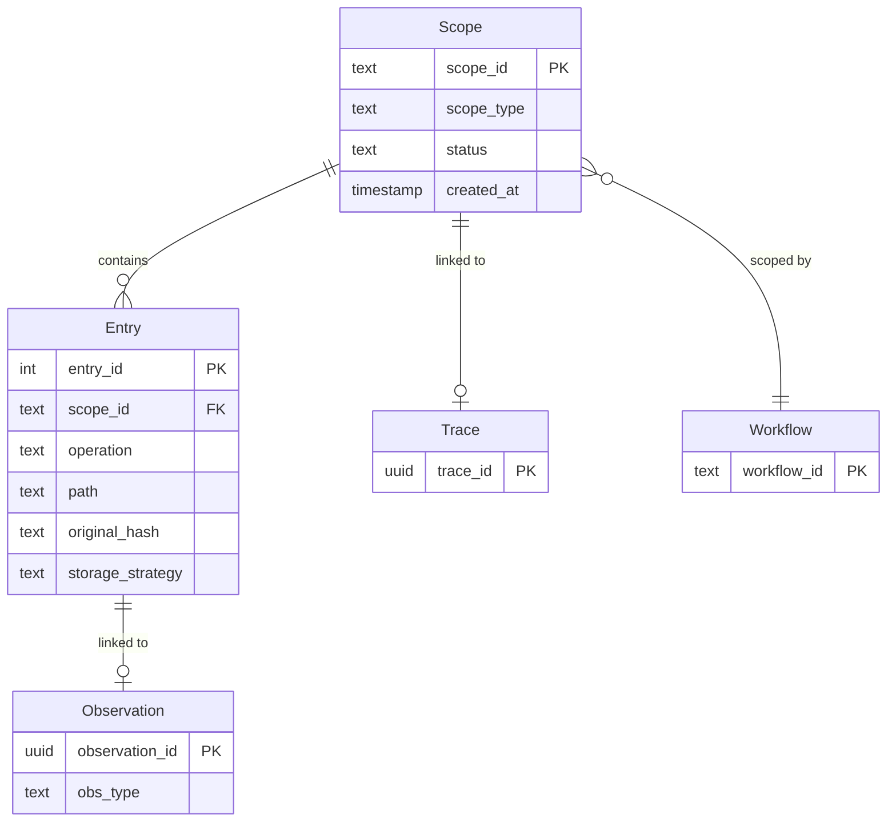

# File Journal Design

> Automatic file-level change tracking and reversible rollback for y-agent tool operations

**Version**: v0.1
**Created**: 2026-03-06
**Updated**: 2026-03-06
**Status**: Draft

---

## TL;DR

y-agent's Orchestrator provides task-level checkpointing and compensation for workflow state recovery, but it cannot restore files that tools have modified on the host filesystem. When an agent writes to `src/main.rs` via `file_write` or `file_patch`, and a subsequent step fails, the Orchestrator can rewind its internal state -- yet the file remains changed on disk. The File Journal closes this gap with a **ToolMiddleware** that intercepts file-mutating tool calls, captures the original file state before execution, and stores it in a local journal. On failure or explicit rollback, the journal replays entries in reverse to restore files to their pre-operation state. The journal operates at **scope** granularity (task, pipeline, or manual checkpoint), integrates with the Orchestrator's existing `CompensationTask` mechanism as a built-in strategy, and opportunistically leverages git when the workspace is a repository. Inspired by copy-on-write overlay patterns (AgentFS OverlayFS), but designed as a lightweight middleware rather than a virtual filesystem -- preserving direct host file access, cross-platform compatibility, and IDE transparency.

---

## Background and Goals

### Background

y-agent's tool system includes file-mutating operations (file_write, file_patch, shell_exec) that modify the host filesystem directly. The current safety model provides several layers:

| Layer | What It Protects | What It Cannot Protect |
|-------|-----------------|----------------------|
| Runtime isolation (runtime-design.md) | Host system from untrusted code | File content after authorized writes |
| Guardrails/ToolMiddleware (guardrails-hitl-design.md) | Dangerous ops via permission model | Files once a permitted write succeeds |
| file_patch old/new validation (micro-agent-pipeline-design.md) | Against applying patches to stale content | Against needing to undo a successfully applied patch |
| Orchestrator checkpoint (orchestrator-design.md) | Workflow state, channel values, task completion status | Host filesystem changes |
| CompensationTask (orchestrator-design.md) | Side effects via custom undo logic | Requires manually authoring compensation per tool; no built-in file awareness |

The gap is clear: **no mechanism exists to automatically track and reverse host filesystem changes made by authorized tool executions.** This becomes critical in three scenarios:

1. **Pipeline step failure**: A Micro-Agent Pipeline's Execute step applies a file_patch, but a subsequent validation step determines the change is incorrect. The pipeline can retry from the failed step, but the file is already modified.
2. **Multi-file workflow rollback**: An Orchestrator workflow modifies multiple files across several tasks. Task 7 fails, triggering a Rollback failure strategy. The Orchestrator can compensate API calls, but has no way to restore the 5 files modified by tasks 1-6.
3. **User-initiated undo**: A user reviews the agent's changes and wants to revert everything from a specific task or pipeline execution, without manually identifying which files were touched.

### Related Designs

| Module | Relationship |
|--------|-------------|
| [tools-design.md](tools-design.md) | File Journal tracks tool executions that mutate the filesystem |
| [hooks-plugin-design.md](hooks-plugin-design.md) | File Journal is implemented as a `ToolMiddleware` in the y-hooks chain |
| [orchestrator-design.md](orchestrator-design.md) | Journal rollback integrates as a built-in `CompensationTask` strategy |
| [micro-agent-pipeline-design.md](micro-agent-pipeline-design.md) | Pipelines are a primary consumer; journal scope maps to pipeline execution |
| [runtime-design.md](runtime-design.md) | Runtime handles isolation; journal handles reversibility -- different concerns |
| [diagnostics-observability-v0.2.md](diagnostics-observability-v0.2.md) | Journal entries are linked to Observations for unified traceability |
| [guardrails-hitl-design.md](guardrails-hitl-design.md) | Guardrails decide whether to allow a tool call; journal records what happened after it was allowed |

### Goals

| Goal | Measurable Criteria |
|------|-------------------|
| **Automatic capture** | 100% of file-mutating built-in tool calls produce journal entries without tool code modification |
| **Correct rollback** | Rollback restores files to byte-identical content as pre-operation state; validated by SHA-256 comparison |
| **Scope granularity** | Support rollback at task, pipeline, and manual checkpoint granularity |
| **Low latency overhead** | Journal capture adds < 5ms per file operation for files under 1MB |
| **Storage efficiency** | Avoid duplicate storage when workspace is a git repository |
| **Cross-platform** | Works on macOS, Linux, and Windows with no platform-specific dependencies |
| **Non-intrusive** | Existing tool implementations require zero code changes |

### Assumptions

1. File-mutating built-in tools are identifiable by their `ToolManifest` metadata (category or capability declaration). The initial set is: `file_write`, `file_patch`, `shell_exec`.
2. The workspace directory is writable and has sufficient disk space for journal storage.
3. Files modified by agent tools are primarily text files under 10MB. Binary files and very large files receive degraded journal coverage (metadata only).
4. `shell_exec` is a special case: it can modify any file, so its journal coverage depends on explicit tracking hooks or git integration.

---

## Scope

### In Scope

- `FileJournalMiddleware` as a `ToolMiddleware` in the y-hooks chain
- Journal storage backend (SQLite, co-located with Orchestrator checkpoint)
- Scope model: task, pipeline, and manual checkpoint scoping
- Rollback engine: reverse-order file restoration with conflict detection
- Git-aware optimization: avoid content duplication in git workspaces
- Integration with Orchestrator `CompensationTask` as `FileRollback` strategy
- CLI commands for journal inspection and manual rollback
- Observability integration: journal entries linked to Observations
- Retention and cleanup policies

### Out of Scope

- Tracking file changes made by processes outside y-agent's tool system (e.g., user edits in IDE)
- Tracking changes inside Docker/SSH runtimes (those are isolated environments with their own lifecycle)
- Distributed file journal across multiple nodes
- Real-time file watching or filesystem event monitoring
- Binary file diffing or delta compression
- Version control features beyond what git already provides (branching, merging, etc.)

---

## High-Level Design

### Architecture Overview



**Diagram type rationale**: Flowchart chosen to show the component boundaries, data flow direction, and integration points between the File Journal, the tool execution pipeline, and the Orchestrator.

**Legend**:
- Green: File Journal components (focus of this design).
- Solid arrows: Primary data flow during tool execution.
- Dashed arrows: Optional git-aware paths.
- Numbers indicate execution order within a single tool call.

### Core Components

| Component | Responsibility | Crate |
|-----------|---------------|-------|
| **FileJournalMiddleware** | Intercepts file-mutating tool calls in the ToolMiddleware chain; delegates to CaptureEngine before execution | y-tools |
| **CaptureEngine** | Reads original file state, computes hashes, decides storage strategy (inline vs blob vs git-ref) | y-tools |
| **JournalStore** | Persists and queries journal entries; manages SQLite tables and blob directory | y-storage |
| **RollbackEngine** | Executes rollback operations: queries scope, validates state, restores files | y-tools |
| **ScopeManager** | Manages scope lifecycle (open/close/abandon); propagates scope IDs from Orchestrator | y-tools |

### Design Principles

| Principle | Application |
|-----------|-------------|
| **Separation of concerns** | Guardrails decide "should this run?"; Runtime decides "how to isolate?"; Journal decides "how to undo?" |
| **Middleware, not modification** | No tool code changes required; journal logic lives entirely in the middleware layer |
| **Opportunistic efficiency** | Uses git when available, falls back to content capture; never the only storage path |
| **Fail-open for capture, fail-safe for rollback** | If capture fails (disk full, permission error), the tool executes anyway with a warning. If rollback encounters a conflict, it stops and reports rather than forcing a potentially incorrect restore. |

---

## Key Flows/Interactions

### Flow 1: Capture on Tool Execution



**Diagram type rationale**: Sequence diagram chosen to show the temporal ordering of capture, storage decision, and tool execution within a single tool call.

**Legend**:
- FileJournalMiddleware intercepts before the tool executes (pre-position in chain).
- CaptureEngine selects a storage strategy based on workspace context and file size.
- The tool executes after capture completes; capture failure does not block execution.

### Flow 2: Rollback on Pipeline Failure

```mermaid
sequenceDiagram
    participant Orch as Orchestrator
    participant RE as RollbackEngine
    participant JS as JournalStore
    participant FS as Host Filesystem

    Orch->>RE: rollback(scope_id=pipeline_123)
    RE->>JS: query entries WHERE scope_id = pipeline_123 ORDER BY created_at DESC
    JS-->>RE: [entry_3, entry_2, entry_1]

    loop For each entry (reverse chronological)
        RE->>FS: stat(entry.path)
        RE->>RE: verify current hash matches post-operation expectation

        alt File unmodified since journal entry
            alt entry.op = Create
                RE->>FS: delete(entry.path)
            else entry.op = Modify
                RE->>FS: write(entry.path, original_content)
                RE->>FS: restore metadata (permissions, mtime)
            else entry.op = Delete
                RE->>FS: write(entry.path, original_content)
                RE->>FS: restore metadata
            end
            RE->>JS: mark entry rolled_back = true
        else File modified by third party
            RE->>RE: record conflict; skip entry
        end
    end

    RE-->>Orch: RollbackReport(restored, skipped, conflicts)
```

**Diagram type rationale**: Sequence diagram chosen to show the rollback decision logic and conflict handling for each journal entry.

**Legend**:
- Entries are processed in reverse chronological order to correctly handle multi-step modifications.
- Conflict detection compares current file hash against the expected post-operation state.

### Flow 3: Orchestrator Integration

```mermaid
sequenceDiagram
    participant Orch as Orchestrator
    participant Task as Task 5 (file_patch)
    participant Task6 as Task 6 (validation)
    participant FJM as FileJournalMiddleware
    participant RE as RollbackEngine
    participant CP as CheckpointManager

    Note over Orch: Workflow starts; scope opened
    Orch->>Task: execute task 5
    Task->>FJM: (middleware captures file state)
    Task-->>Orch: success

    Orch->>CP: checkpoint(task 5 committed)

    Orch->>Task6: execute task 6
    Task6-->>Orch: FAILURE

    alt FailureStrategy = Rollback
        Orch->>RE: rollback(scope=workflow_xyz)
        RE-->>Orch: RollbackReport
        Orch->>CP: checkpoint(rollback completed)
    end
```

**Diagram type rationale**: Sequence diagram chosen to show how file journal rollback integrates with the Orchestrator's existing failure strategy and checkpoint mechanism.

**Legend**:
- The Orchestrator triggers rollback through the existing `FailureStrategy::Rollback` path.
- RollbackEngine is invoked as a built-in compensation strategy, requiring no custom compensation task authoring for file operations.

---

## Data and State Model

### Journal Entry

```rust
struct JournalEntry {
    entry_id: u64,
    scope_id: String,
    scope_type: ScopeType,
    operation: FileOperation,
    path: String,
    original_hash: Option<String>,
    storage_strategy: StorageStrategy,
    original_mode: Option<u32>,
    original_mtime_secs: Option<i64>,
    created_at: i64,
    rolled_back: bool,
}

enum ScopeType {
    Task,
    Pipeline,
    Checkpoint,
}

enum FileOperation {
    Create,
    Modify,
    Delete,
    Rename { from_path: String },
}

enum StorageStrategy {
    Inline,
    BlobFile { blob_path: String },
    GitRef { commit_hash: String },
}
```

### Scope Lifecycle



**Diagram type rationale**: State diagram chosen to show the lifecycle states of a journal scope, which determines what operations are valid at each stage.

**Legend**:
- **Open**: Actively receiving entries. Rollback is valid.
- **Closed**: Scope completed normally. Rollback is still valid (user-initiated undo).
- **RolledBack**: Files have been restored. Terminal state.
- **Abandoned**: Scope discarded without rollback (e.g., user chose not to undo). Subject to cleanup.

### Database Schema

Journal storage co-locates with the Orchestrator's checkpoint SQLite database to enable transactional consistency between journal writes and checkpoint commits.

```sql
CREATE TABLE file_journal_scopes (
    scope_id TEXT PRIMARY KEY,
    scope_type TEXT NOT NULL,
    status TEXT NOT NULL DEFAULT 'open',
    created_at INTEGER NOT NULL,
    closed_at INTEGER,
    trace_id TEXT,
    CONSTRAINT valid_scope_type CHECK (scope_type IN ('task', 'pipeline', 'checkpoint')),
    CONSTRAINT valid_status CHECK (status IN ('open', 'closed', 'rolled_back', 'abandoned'))
);

CREATE TABLE file_journal_entries (
    entry_id INTEGER PRIMARY KEY AUTOINCREMENT,
    scope_id TEXT NOT NULL REFERENCES file_journal_scopes(scope_id),
    operation TEXT NOT NULL,
    path TEXT NOT NULL,
    rename_from TEXT,
    original_hash TEXT,
    storage_strategy TEXT NOT NULL,
    original_content BLOB,
    blob_path TEXT,
    git_ref TEXT,
    original_mode INTEGER,
    original_mtime_secs INTEGER,
    created_at INTEGER NOT NULL,
    rolled_back INTEGER NOT NULL DEFAULT 0,
    observation_id TEXT,
    CONSTRAINT valid_operation CHECK (operation IN ('create', 'modify', 'delete', 'rename')),
    CONSTRAINT valid_strategy CHECK (storage_strategy IN ('inline', 'blob_file', 'git_ref'))
);

CREATE INDEX idx_journal_scope ON file_journal_entries(scope_id);
CREATE INDEX idx_journal_path ON file_journal_entries(path, created_at DESC);
```

### Entity Relationships



**Diagram type rationale**: ER diagram chosen to show the structural relationships between journal entities and their links to the observability and orchestration systems.

**Legend**:
- A Scope groups multiple Entries; Scopes are linked to Orchestrator Workflows and Observability Traces.
- Each Entry optionally links to the Observation that recorded the tool call.

---

## Failure Handling and Edge Cases

### Failure Scenarios

| Scenario | Detection | Handling | Recovery |
|----------|-----------|----------|----------|
| Capture fails (disk full) | IO error from write | Log warning; allow tool to proceed; emit `journal.capture_failed` event | Journal entry marked `capture_failed`; rollback for this entry is unavailable |
| Capture fails (permission denied) | IO error from read | Log warning; allow tool to proceed | Same as above |
| Rollback encounters modified file | SHA-256 mismatch between current file and expected post-operation hash | Skip entry; report in RollbackReport as conflict | User resolves manually; CLI shows diff between journal content and current content |
| Rollback target file deleted externally | File not found on disk | For Modify entries: recreate file from journal. For Create entries: nothing to delete (already gone). | Correct behavior for both cases |
| Journal database corrupted | SQLite integrity check failure | Fall back to git-based rollback if available; report error | Manual recovery from git or backups |
| Blob file missing | File not found at blob_path | Report as unrecoverable entry; skip | Entry marked as degraded |
| Git ref no longer reachable | `git cat-file` fails | Attempt inline/blob fallback; report if no fallback | Entry marked as degraded |

### Edge Cases

| Edge Case | Handling |
|-----------|---------|
| Same file modified multiple times in one scope | Each modification creates a separate entry; only the first entry per path stores the original state. Rollback replays all entries in reverse but only restores content from the first entry for each unique path. |
| shell_exec modifies files not declared in args | For shell_exec, journal captures workspace git status before execution and diffs afterward; newly modified files are retrospectively added to the journal. In non-git workspaces, shell_exec modifications are not tracked (documented limitation). |
| File created and then deleted in same scope | Create entry followed by Delete entry. Rollback of Delete restores the file; rollback of Create deletes it. Net effect: file returns to pre-scope state (did not exist). |
| Symbolic links | Journal stores the symlink target path, not the resolved content. Restore recreates the symlink. |
| File permissions changed but content unchanged | Metadata-only changes are captured via `original_mode`; restore resets permissions. |
| Concurrent scopes modifying same file | Each scope independently tracks its own view. Rollback of one scope may conflict with another scope's entries. Conflict detection (hash mismatch) prevents incorrect restores. |
| Workspace root changes between capture and rollback | Paths are stored as workspace-relative. If the workspace root moves, rollback resolves paths against the current workspace root. |

---

## Security and Permissions

| Concern | Approach |
|---------|----------|
| **Journal stores file content** | Journal may contain sensitive file content (API keys, credentials). The journal SQLite database inherits the same encryption-at-rest policy as the Orchestrator checkpoint database. |
| **Rollback overwrites files** | Rollback is a privileged operation. In the permission model (guardrails-hitl-design.md), rollback requires the same permission level as the original tool that created the entry (e.g., if file_write requires `ask`, rollback of a file_write entry also requires `ask`). |
| **Blob directory access** | The blob directory is created inside the y-agent data directory with restrictive permissions (0o700). |
| **Git ref access** | GitRef strategy only references commits; it does not modify the git repository. No git write operations are performed during capture. |
| **Scope manipulation** | Only the Orchestrator and CLI can open/close/rollback scopes. Scopes are not exposed to LLM tool calls. |

---

## Performance and Scalability

### Performance Targets

| Metric | Target | Measurement |
|--------|--------|-------------|
| Capture latency (file < 1MB) | < 5ms | Time from middleware entry to capture complete |
| Capture latency (file 1-10MB) | < 50ms | Blob copy time |
| Capture latency (git-ref strategy) | < 2ms | Only hash computation + git status check |
| Rollback latency (10 entries) | < 100ms | Full scope rollback |
| Storage overhead (inline) | 1:1 with original file size | Raw content in SQLite BLOB |
| Storage overhead (git-ref) | ~100 bytes per entry | Only metadata, no content |
| Journal query latency | < 5ms | Scope-based entry lookup |

### Storage Strategies and Thresholds

| File Size | Strategy | Rationale |
|-----------|----------|-----------|
| < 256KB | Inline (SQLite BLOB) | SQLite handles small BLOBs efficiently; single-file deployment |
| 256KB - 10MB | BlobFile (external) | Avoids bloating the SQLite database; sequential I/O for large files |
| > 10MB | Metadata-only | Capture only hash and metadata; content recovery relies on git or manual backup. Emit a warning. |

### Optimization Strategies

1. **Git-aware deduplication**: In git workspaces, if the file is tracked and clean (no uncommitted changes), store only the git commit ref. Content is recoverable via `git show <ref>:<path>`.
2. **Deferred blob write**: For BlobFile strategy, use `rename` from a temp file to ensure atomicity without holding the middleware lock during I/O.
3. **Hash-based deduplication**: If the same file content (by SHA-256) already exists in the journal from a previous scope, reference the existing blob instead of creating a duplicate.
4. **Batch capture for shell_exec**: Instead of per-file capture, take a single git snapshot (via `git stash create` or `git diff`) before shell_exec and diff afterward.

---

## Observability

### Metrics

| Metric | Type | Description |
|--------|------|-------------|
| `file_journal.captures` | Counter | Total file captures, by strategy (inline/blob/git_ref) |
| `file_journal.capture_failures` | Counter | Failed captures, by reason (disk_full/permission/io_error) |
| `file_journal.capture_duration_ms` | Histogram | Capture latency distribution |
| `file_journal.rollbacks` | Counter | Rollback operations, by outcome (success/partial/conflict) |
| `file_journal.rollback_duration_ms` | Histogram | Rollback latency distribution |
| `file_journal.entries_total` | Gauge | Total entries in journal |
| `file_journal.storage_bytes` | Gauge | Total storage used (inline + blob) |

### Events

The following events are published to the y-hooks EventBus:

| Event | When | Payload |
|-------|------|---------|
| `FileJournalCaptured` | After successful capture | scope_id, path, strategy, hash |
| `FileJournalCaptureFailed` | After capture failure | scope_id, path, reason |
| `FileJournalRollbackStarted` | When rollback begins | scope_id, entry_count |
| `FileJournalRollbackCompleted` | When rollback finishes | scope_id, restored, skipped, conflicts |
| `FileJournalScopeOpened` | When a new scope starts | scope_id, scope_type |
| `FileJournalScopeClosed` | When a scope completes | scope_id, entry_count |

### Trace Integration

Each journal entry stores an optional `observation_id` linking it to the Observation that recorded the tool call in the diagnostics system. This enables:

- Viewing journal entries alongside the execution trace in `y-agent diag trace <id> --tree`
- Querying which files were modified by a specific trace: `SELECT path FROM file_journal_entries WHERE observation_id IN (SELECT observation_id FROM observability.observations WHERE trace_id = ?)`

---

## Rollout and Rollback

### Phased Implementation

| Phase | Scope | Duration | Deliverables |
|-------|-------|----------|-------------|
| **Phase 1** | Core journal: FileJournalMiddleware, CaptureEngine (inline strategy only), JournalStore, basic rollback | 1 week | file_write and file_patch tracking; manual rollback via Rust API |
| **Phase 2** | Git integration, BlobFile strategy, Orchestrator CompensationTask integration | 1 week | Git-aware capture, large file support, automatic rollback on workflow failure |
| **Phase 3** | CLI commands, shell_exec tracking (git-based), observability integration | 1 week | `y-agent journal` CLI, event bus integration, trace linking |
| **Phase 4** | Retention policies, hash deduplication, performance optimization | 1 week | Configurable cleanup, storage optimization |

### Feature Flags

| Flag | Default | Effect When Disabled |
|------|---------|---------------------|
| `file_journal` | enabled | FileJournalMiddleware becomes a no-op pass-through |
| `file_journal_git` | enabled (when git detected) | Disables git-aware optimization; all captures use inline/blob strategy |
| `file_journal_shell_tracking` | disabled | Disables pre/post git diff for shell_exec |

### Rollback Plan

The File Journal is a pure addition with no modification to existing modules beyond middleware registration.

| Component | Rollback |
|-----------|----------|
| FileJournalMiddleware | Disable `file_journal` feature flag; middleware becomes pass-through; all existing tool behavior unchanged |
| JournalStore tables | Tables can be dropped without affecting checkpoint tables (separate table namespace) |
| Blob directory | Delete `.y-agent/journal/blobs/`; no other component depends on it |

---

## Alternatives and Trade-offs

### Alternative 1: Virtual Filesystem (AgentFS OverlayFS Approach)

| Aspect | VFS/OverlayFS | File Journal (chosen) |
|--------|---------------|----------------------|
| Rollback guarantee | Complete (base layer untouched) | Near-complete (third-party modifications may conflict) |
| Platform support | Linux only (FUSE); macOS via NFS (degraded) | All platforms |
| IDE compatibility | Requires mounting; some IDE features may break | Transparent; files are real |
| Architecture impact | Requires daemon process, mount management | Single middleware, no external processes |
| Performance | Every I/O through FUSE/NFS overhead | Zero overhead for reads; capture cost only on writes |
| Scope | All file access virtualized | Only tool-initiated mutations |

**Decision**: File Journal chosen. The VFS approach provides stronger guarantees but at unacceptable cost in platform compatibility, architecture complexity, and IDE integration. y-agent must work natively on macOS development environments where FUSE support is limited.

### Alternative 2: Git-Only Strategy

| Aspect | Git-only | File Journal (chosen) |
|--------|----------|----------------------|
| Non-git workspaces | Not supported | Fully supported |
| Granularity | Commit-level (coarse) | Per-tool-call (fine) |
| Uncommitted changes | Requires stash/temp commit (pollutes history) | No git history pollution |
| Multi-file atomicity | Natural (single commit) | Manual scope grouping |
| Setup requirement | Requires git repo initialization | None |

**Decision**: File Journal with git as an optimization layer. Git provides excellent storage efficiency when available, but the journal cannot depend on it exclusively.

### Alternative 3: Tool-Internal Backup

| Aspect | Tool-internal | Middleware (chosen) |
|--------|--------------|---------------------|
| Implementation | Each tool implements its own backup logic | Single middleware for all tools |
| Coverage | Requires per-tool work; easy to miss | Automatic for all registered file-mutating tools |
| Consistency | Each tool may implement differently | Uniform storage, rollback, and observability |
| Maintenance | N tools x M backup patterns | 1 middleware implementation |

**Decision**: Middleware approach. Follows y-agent's architectural principle of separating cross-cutting concerns into the hook/middleware layer rather than embedding them in tool implementations.

### Alternative 4: Filesystem Snapshots (btrfs/APFS)

| Aspect | FS Snapshots | File Journal (chosen) |
|--------|-------------|----------------------|
| Granularity | Entire filesystem or subvolume | Per-file, per-tool-call |
| Platform | btrfs (Linux), APFS (macOS, limited API) | All platforms |
| Performance | Near-instant snapshot creation | Per-file capture cost |
| Partial rollback | All-or-nothing per snapshot | Per-scope, per-file control |
| API stability | OS-specific, may change | Application-level, fully controlled |

**Decision**: Filesystem snapshots are fast but lack the fine-grained, cross-platform control needed. Could be explored as a future optimization for bulk operations on supported platforms.

---

## Open Questions

| Question | Owner | Due Date | Status |
|----------|-------|----------|--------|
| Should shell_exec tracking be enabled by default, or opt-in per workflow? | TBD | 2026-03-15 | Open |
| What is the appropriate default retention period for closed journal scopes? | TBD | 2026-03-15 | Open |
| Should the journal support manual "named checkpoints" that users create via CLI before risky operations? | TBD | 2026-03-20 | Open |
| How should concurrent agent sessions sharing a workspace coordinate journal scopes? | TBD | Future | Deferred |

---

## Decision Log

| Date | Decision | Rationale | Alternatives Rejected |
|------|----------|-----------|----------------------|
| 2026-03-06 | Implement as ToolMiddleware, not tool-internal | Cross-cutting concern; follows y-agent's middleware-first architecture; zero tool code changes | Tool-internal backup (per-tool duplication), Orchestrator-level capture (too coarse) |
| 2026-03-06 | Co-locate journal in Orchestrator's SQLite database | Enables transactional consistency between checkpoint and journal; single-file deployment | Separate SQLite file (consistency gap), PostgreSQL (unnecessary for local data) |
| 2026-03-06 | Three-tier storage strategy (inline/blob/git-ref) | Balances storage efficiency, performance, and platform support | Inline-only (bloats DB for large files), Git-only (excludes non-git workspaces) |
| 2026-03-06 | Fail-open on capture, fail-safe on rollback | Agent usability requires that journal failures never block tool execution; rollback safety requires that conflicts never silently overwrite user changes | Fail-closed on capture (blocks agent), force-overwrite on rollback (data loss risk) |
| 2026-03-06 | SHA-256 for conflict detection | Reliable content comparison; detects any modification including third-party edits and IDE auto-formatting | Timestamp-based (unreliable across filesystems), size-based (misses content changes) |
| 2026-03-06 | Inspired by AgentFS OverlayFS but not adopted | OverlayFS provides perfect isolation but requires FUSE/NFS, daemon process, and is Linux-centric; incompatible with y-agent's cross-platform, IDE-transparent requirements | Full VFS adoption, ptrace-based interception |

---

## Changelog

| Version | Date | Changes |
|---------|------|---------|
| v0.1 | 2026-03-06 | Initial design: FileJournalMiddleware, CaptureEngine with three-tier storage, RollbackEngine with conflict detection, Orchestrator and observability integration. Inspired by AgentFS OverlayFS copy-on-write patterns. |
