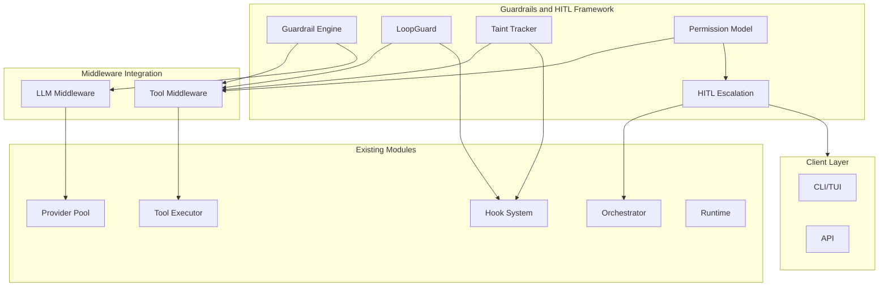
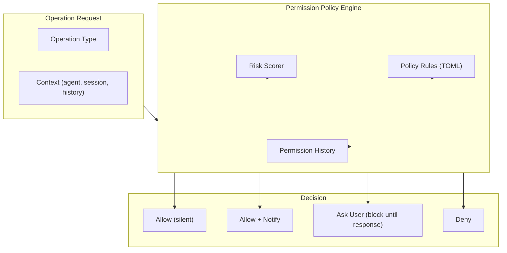
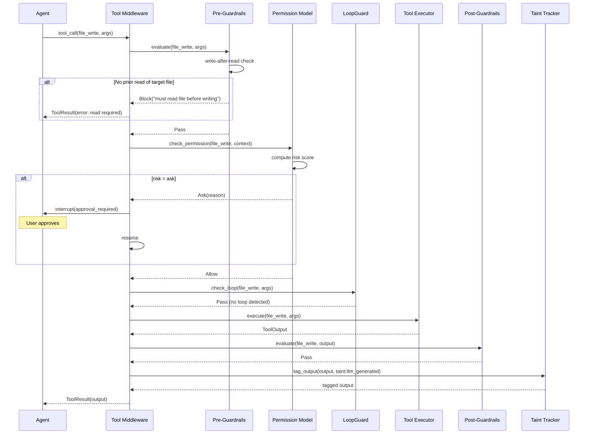
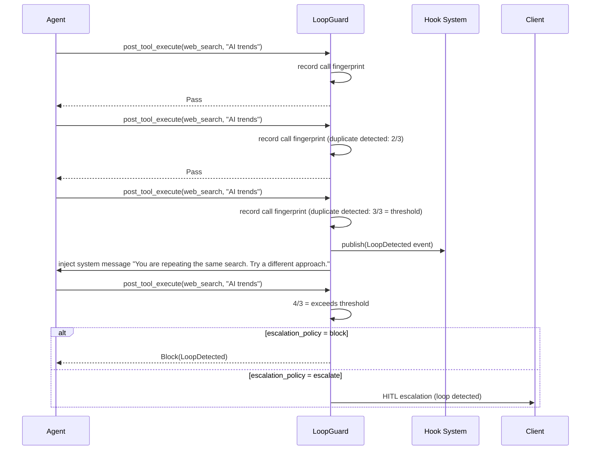
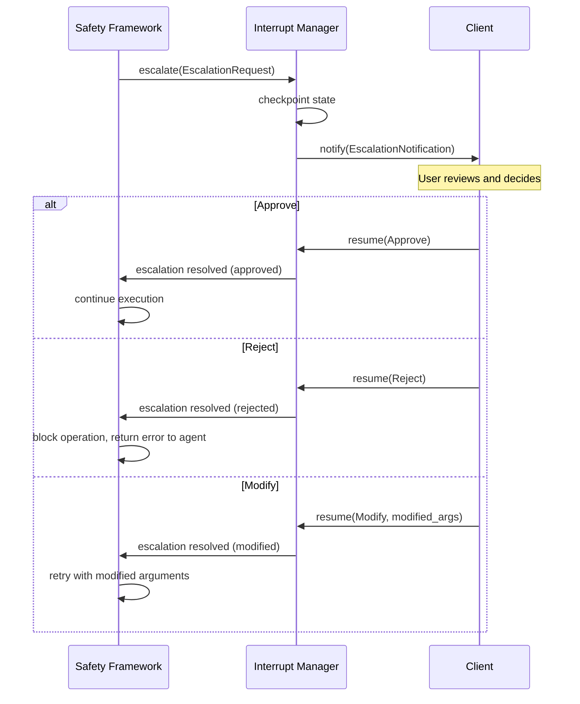
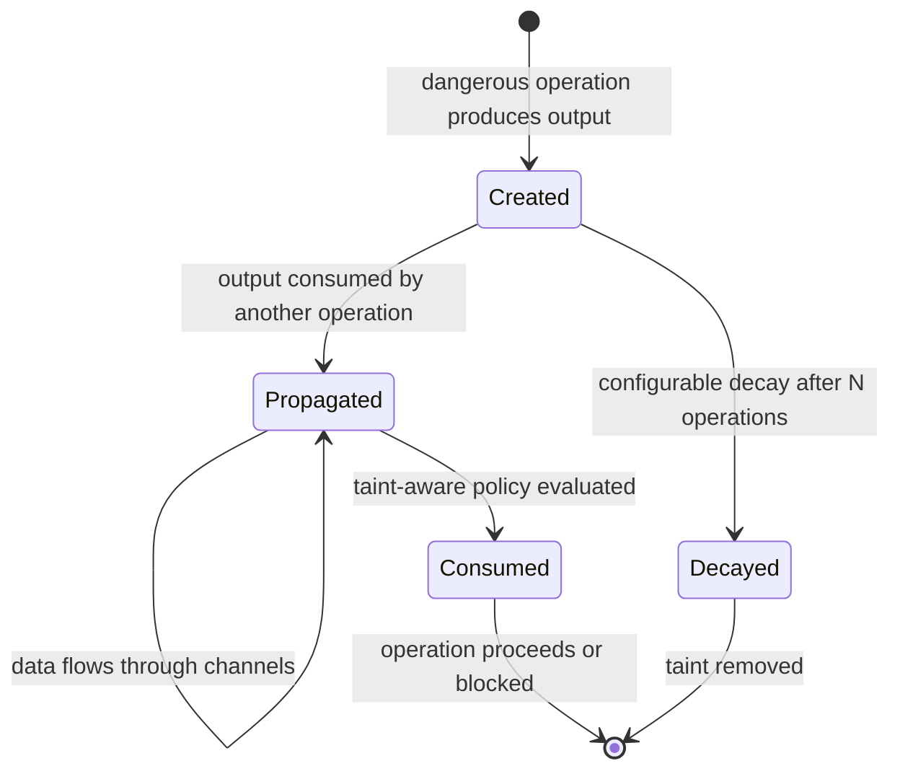

# Guardrails and Human-in-the-Loop Safety Framework Design

> Application-level safety guardrails, loop detection, taint tracking, permission model, and structured human escalation for y-agent

**Version**: v0.3
**Created**: 2026-03-06
**Updated**: 2026-03-07
**Status**: Draft

---

## TL;DR

The Guardrails and HITL framework provides application-level safety that sits above the Runtime's OS-level isolation. It introduces four complementary safety mechanisms: **Guardrails** (pre-execution and post-execution validators implemented as middleware that can block, modify, or flag operations), **LoopGuard** (detection and prevention of agent loops through repeated tool call patterns, token budget exhaustion, and iteration runaway), **Taint Tracking** (propagation of danger tags through the data flow so downstream operations inherit risk awareness from upstream dangerous operations), and a **Unified Permission Model** (granular ask/allow/deny decisions per operation type with risk-based automatic escalation to human review). The framework integrates with the Hook/Middleware system: guardrails are implemented as `ToolMiddleware` and `LlmMiddleware` instances, while HITL escalation uses the Orchestrator's interrupt/resume protocol. This design draws on OpenFang's LoopGuard and taint tracking, CrewAI's pre/post execution guardrails, OpenCode's PermissionNext model, and DeerFlow's ask_clarification pattern.

---

## Background and Goals

### Background

y-agent's current safety design operates at two levels:

1. **Runtime isolation** (runtime-design.md): Docker containers with capability-based permissions provide OS-level sandboxing for dangerous tools.
2. **Orchestrator interrupt/resume** (orchestrator-design.md): Workflow-level interrupts enable human approval at specific task boundaries.

These mechanisms are necessary but insufficient for production safety. They do not address:

- **Agent loops**: An agent repeatedly calling the same tool with the same arguments (or cycling through tools) without making progress.
- **Output validation**: Verifying that LLM outputs and tool results meet quality, safety, and format requirements before they are used downstream.
- **Taint propagation**: When a dangerous operation (shell_exec) produces output, downstream operations that consume that output should be aware of its tainted origin.
- **Granular permissions**: The current dangerous-tool approval (AutoApprove/Notify/Confirm/Reject) is binary. There is no nuanced permission model that considers context, history, and risk level.

Analysis of competitors reveals mature safety patterns:

- **OpenFang**: LoopGuard detects repeated tool calls and enforces maximum iterations. Taint tracking marks outputs from shell and network operations, propagating the taint through the data flow. A 16-layer security model provides defense in depth.
- **CrewAI**: Guardrails are pre/post execution validators on tasks and tools that can block execution or modify outputs.
- **OpenCode**: PermissionNext provides a three-state model (ask/allow/deny) with per-operation granularity and user-configurable auto-approve rules.
- **Oh-My-OpenCode**: Write guard requires a preceding read before any file write. Compaction preservers ensure critical data survives context compression.
- **DeerFlow**: ask_clarification enables agents to request human input mid-execution when uncertain.

### Goals

| Goal | Measurable Criteria |
|------|-------------------|
| **Loop detection** | Detect repeated tool call patterns within 3 iterations; configurable threshold |
| **Budget enforcement** | Terminate agent runs that exceed token budget, tool call budget, or wall-clock time |
| **Taint tracking** | All outputs from dangerous operations carry taint tags that propagate through data flow |
| **Permission granularity** | Per-operation-type permission decisions with at least 3 levels (deny, ask, allow) |
| **Low latency guardrails** | Pre-execution guardrail check adds < 5ms to tool dispatch |
| **Zero false terminations** | Loop detection must not flag legitimate repeated operations (e.g., polling, batch processing) |
| **Escalation response time** | Human escalation notifications delivered to client within 1s of trigger |

### Assumptions

1. Guardrails execute in the same process as the agent; remote guardrail services are out of scope.
2. Taint tags are metadata labels, not cryptographic proofs. They prevent accidental misuse, not malicious bypass.
3. The permission model is per-workspace; multi-user permission delegation is deferred.
4. Human escalation uses the Orchestrator's existing interrupt/resume protocol for workflow-level pauses.
5. Guardrail rules are configured in TOML; LLM-driven dynamic guardrail generation is deferred.

---

## Scope

### In Scope

- Guardrail framework: pre-execution and post-execution validators for tools and LLM calls
- LoopGuard: repeated call detection, token budget enforcement, iteration limits
- Taint tracking: taint tags on data, propagation rules, taint-aware policy decisions
- Unified permission model: operation-type permissions, risk scoring, auto-approve rules
- Human escalation: triggers, notification delivery, and integration with Orchestrator interrupt/resume
- Built-in guardrails: write-after-read guard, output format validation, basic content safety
- Configuration schema for guardrail rules and permission policies
- Guardrail observability: metrics, audit trail, alert events

### Out of Scope

- Content moderation / toxicity filtering (delegate to specialized LLM-based content filters)
- Cryptographic audit chains (Merkle proofs, blockchain-style audit)
- Distributed guardrail enforcement across nodes
- Automated guardrail learning from past incidents
- Real-time threat detection or intrusion prevention

---

## High-Level Design

### Architecture Overview



**Diagram type rationale**: Flowchart chosen to show module boundaries and how the safety framework integrates with existing modules via middleware and hooks.

**Legend**:
- **Safety**: The four safety mechanisms in the new framework.
- **Middleware**: Integration layer using the Hook/Middleware system from hooks-plugin-design.md.
- **Existing**: Modules that the safety framework wraps and augments.
- **Clients**: Recipients of human escalation notifications.

### Four Safety Mechanisms

| Mechanism | Purpose | Implementation | Integration Point |
|-----------|---------|---------------|------------------|
| **Guardrails** | Validate operations before/after execution | Middleware (ToolMiddleware, LlmMiddleware) | Hook system middleware chains |
| **LoopGuard** | Detect and prevent agent loops | Hook handler (post_tool_execute) + budget counters | Hook system + agent loop |
| **Taint Tracker** | Track dangerous output provenance | Metadata tags on ToolOutput and channel values | Tool executor + Orchestrator channels |
| **Permission Model** | Granular operation approval | Policy engine queried by Tool middleware | Tool middleware + HITL escalation |

### Guardrail Types

| Type | Phase | Can Block | Can Modify | Example |
|------|-------|----------|-----------|---------|
| **Pre-execution** | Before tool/LLM call | Yes | Yes (input) | Write-after-read guard, argument sanitization |
| **Post-execution** | After tool/LLM call | Yes (reject result) | Yes (output) | Output format validation, PII detection |
| **Structural** | At configuration time | Yes (prevent activation) | No | Maximum tool count per agent, model allowlist |

```rust
#[async_trait]
trait Guardrail: Send + Sync {
    fn name(&self) -> &str;
    fn phase(&self) -> GuardrailPhase;  // Pre, Post, Structural
    fn applies_to(&self) -> GuardrailScope;  // Tool(name), AllTools, LLM, Agent

    async fn evaluate(&self, ctx: &GuardrailContext) -> GuardrailResult;
}

enum GuardrailResult {
    Pass,
    Warn(String),
    Block(String),
    Modify(ModifiedContext),
    Escalate(EscalationRequest),
}
```

### LoopGuard

LoopGuard monitors agent behavior for four types of problematic patterns:

| Loop Type | Detection Method | Default Threshold | Action |
|-----------|-----------------|------------------|--------|
| **Repeated tool call** | Same tool + same arguments hash within N iterations | 3 consecutive identical calls | Warn at threshold; block at 2x threshold |
| **Tool cycle** | Sequence of tools repeats (A->B->C->A->B->C) | Cycle detected twice | Block with explanation to LLM |
| **Budget exhaustion** | Token count, tool call count, or wall-clock time exceeds limit | Configured per agent/workflow | Graceful termination with partial result |
| **Redundant tool call** | Same (tool, args) previously executed with no state-modifying operation in between | 1 redundant call detected | Suggest `read_experience` retrieval instead; warn at 1; block at 3 |

#### Redundant Tool Call Detection

Inspired by [Memex(RL)](../research/memex-rl.md), the **redundant tool call** pattern detects when an agent re-executes a tool call that has already been executed with identical arguments and no intervening state change (file modification, environment mutation). Unlike the **repeated tool call** pattern which catches immediate repetition, redundant detection tracks call history across the entire session.

When a redundant call is detected, LoopGuard:

1. **Suggests retrieval**: Injects a system message: "This tool was already called with identical arguments. Use `read_experience(index)` to retrieve the previous result if it was archived, or check the conversation history."
2. **Tracks redundancy rate**: Computes `N_redundant / N_tool_calls` for observability.
3. **Escalates on persistence**: If the agent makes > 3 redundant calls without state changes, the call is blocked.

State-modifying operations that reset the redundancy tracker for affected resources: `file_write`, `file_patch`, `shell_exec` (with write commands), `compress_experience` (context rewrite counts as state change).

This mechanism encourages the agent to leverage the Experience Store for evidence recall rather than re-executing expensive tool calls (file reads, web searches, API calls).

LoopGuard maintains a sliding window of recent tool calls (default: last 20) and computes:
- **Call fingerprint**: hash of (tool_name, canonical_args)
- **Sequence fingerprint**: hash of last N call fingerprints for cycle detection

When a loop is detected, LoopGuard can:
1. Inject a system message warning the agent about the loop
2. Block the repeated tool call and return an error to the LLM
3. Escalate to human review via HITL
4. Terminate the agent run

### Taint Tracking

Taint tags are metadata labels attached to data flowing through the system. They track the provenance of data produced by dangerous operations.

| Taint Tag | Source | Propagation | Policy Impact |
|-----------|--------|-------------|--------------|
| `taint:shell` | shell_exec tool output | Any value derived from shell output inherits tag | Downstream file writes with shell-tainted content require confirmation |
| `taint:network` | web_fetch, web_search output | Values containing network-sourced content inherit tag | LLM calls with network-tainted context get a safety preamble |
| `taint:user_input` | Raw user input | Propagates through tool args | Prevents direct injection into shell commands |
| `taint:llm_generated` | LLM response content | Values from LLM responses | LLM-generated file content flagged for review |

Taint propagation rules:

1. **Direct assignment**: If value A (tainted) is assigned to variable B, B inherits A's taint tags.
2. **Aggregation**: If values A (taint:shell) and B (taint:network) are combined, the result carries both tags.
3. **Channel writes**: Taint tags propagate through Orchestrator typed channels.
4. **LLM context**: Taint tags on messages in the LLM context are tracked but do not block LLM calls (the LLM itself is a sanitization boundary for most taints).

### Unified Permission Model



**Diagram type rationale**: Flowchart chosen to show the decision flow from operation request through policy evaluation to permission decision.

**Legend**:
- **Request**: The operation being evaluated (tool call, file write, shell command).
- **Policy Engine**: Evaluates risk and applies configured rules.
- **Decisions**: Four possible outcomes, from silent allow to hard deny.

| Permission Level | Behavior | Use Case |
|-----------------|----------|----------|
| **allow** | Execute immediately, no notification | Trusted operations (file_read, web_search) |
| **notify** | Execute immediately, notify user after | Low-risk writes (file_write to known paths) |
| **ask** | Pause execution, ask user for approval | Dangerous operations (shell_exec, git push) |
| **deny** | Block execution, return error to agent | Forbidden operations (privilege escalation, path traversal) |

Risk scoring factors:

| Factor | Weight | Description |
|--------|--------|-------------|
| **Operation type** | High | shell_exec is inherently riskier than file_read |
| **Taint level** | Medium | Operations on tainted data are riskier |
| **Repetition** | Medium | Repeated dangerous operations escalate risk |
| **Scope** | Low-Medium | Operations outside workspace are riskier |
| **Agent trust** | Low | New/unknown agents have higher risk |
| **Dynamic agent operations** | Medium | Operations creating/modifying dynamic agents inherit risk from the agent's trust tier |

---

## Key Flows/Interactions

### Guardrail-Protected Tool Execution



**Diagram type rationale**: Sequence diagram chosen to show the complete safety pipeline for a single tool execution.

**Legend**:
- Pre-guardrails and permission checks happen before execution.
- LoopGuard checks for repeated patterns.
- Post-guardrails validate the output.
- Taint tracker tags the output for downstream propagation.

### LoopGuard Detection and Response



**Diagram type rationale**: Sequence diagram chosen to show the progressive response to a detected loop.

**Legend**:
- LoopGuard counts consecutive identical calls.
- At threshold: warning injected as system message.
- Above threshold: block or escalate depending on configured policy.

### Human Escalation Flow



**Diagram type rationale**: Sequence diagram chosen to show the async escalation handshake between the safety framework and the human user.

**Legend**:
- Escalation uses the Orchestrator's existing interrupt/resume protocol.
- Three resolution types: approve (proceed), reject (block), modify (retry with changes).

---

## Data and State Model

### Core Entities

```mermaid
erDiagram
    GUARDRAIL_ENGINE ||--o{ GUARDRAIL : manages
    GUARDRAIL ||--|| GUARDRAIL_SCOPE : "applies to"

    LOOP_GUARD ||--o{ CALL_RECORD : tracks
    CALL_RECORD ||--|| CALL_FINGERPRINT : "identified by"

    TAINT_TRACKER ||--o{ TAINT_TAG : manages
    TAINT_TAG }o--o{ DATA_VALUE : "attached to"

    PERMISSION_MODEL ||--o{ POLICY_RULE : enforces
    POLICY_RULE ||--|| OPERATION_TYPE : "applies to"

    ESCALATION_REQUEST }o--|| PERMISSION_MODEL : "triggered by"
    ESCALATION_REQUEST }o--|| LOOP_GUARD : "triggered by"
    ESCALATION_REQUEST }o--|| GUARDRAIL : "triggered by"

    GUARDRAIL {
        string name
        string phase
        int priority
    }
    CALL_RECORD {
        string tool_name
        string args_hash
        int64 timestamp
    }
    TAINT_TAG {
        string tag
        string source_tool
        string source_id
    }
    POLICY_RULE {
        string operation
        string default_permission
        int risk_threshold
    }
```



**Diagram type rationale**: ER diagram chosen to show structural relationships between safety framework entities.

**Legend**:
- Guardrails, LoopGuard, and the Permission Model can all trigger HITL escalation.
- Taint tags are attached to data values and propagate through the system.

### Permission Policy Configuration

```toml
[permissions]
default = "ask"

[permissions.rules]
file_read = "allow"
file_list = "allow"
file_search = "allow"
file_write = "notify"
shell_exec = "ask"
web_search = "allow"
web_fetch = "allow"
memory_store = "allow"
memory_recall = "allow"
agent_create = "ask"
agent_update = "ask"
agent_deactivate = "ask"
agent_search = "allow"

[permissions.auto_approve]
file_write_within_workspace = true
shell_exec_read_only_commands = ["ls", "cat", "head", "grep", "find", "wc"]
max_auto_approvals_per_session = 50

[loop_guard]
enabled = true
repeated_call_threshold = 3
cycle_detection_window = 20
max_iterations_per_run = 50
max_tool_calls_per_run = 200
token_budget_per_run = 100000

[loop_guard.escalation]
at_threshold = "warn"
above_threshold = "block"

[loop_guard.redundant_call]
enabled = true
warn_threshold = 1
block_threshold = 3
suggest_read_experience = true

[taint]
enabled = true
propagation = true
shell_output_taint = "taint:shell"
network_output_taint = "taint:network"

[guardrails]
write_after_read = true
max_file_size_bytes = 10485760
```

### Taint Tag Lifecycle



**Diagram type rationale**: State diagram chosen to show the lifecycle of a taint tag through the system.

**Legend**:
- Taint is created when a dangerous operation produces output.
- Taint propagates as data flows through the system.
- Taint is consumed when a policy decision considers it.
- Optional decay removes taint after configurable distance from the source.

---

## Failure Handling and Edge Cases

| Scenario | Handling |
|----------|---------|
| Guardrail evaluation throws an error | Error caught; guardrail treated as `Pass` with warning logged. Fail-open prevents a buggy guardrail from blocking all operations. Configurable to fail-closed for high-security deployments. |
| LoopGuard false positive (legitimate repeated calls) | Agents can annotate tool calls with `loop_guard_exempt: true` for known batch operations. Exemptions are logged for audit. |
| Permission decision timeout (user does not respond to escalation) | Configurable timeout (default 5 minutes). On timeout, operation is blocked (fail-closed) and agent receives a timeout error. |
| Taint tag accumulation on long-running workflows | Maximum taint tag count per value (default 10). Oldest tags are merged or dropped when limit is exceeded. |
| Conflicting guardrail results (one says Pass, another says Block) | Most restrictive wins. If any guardrail returns Block, the operation is blocked. |
| Permission model config missing for a tool | Fall back to `default` permission level. Log warning about unconfigured tool. |
| Agent attempts to bypass guardrails by using alternative tool names | Guardrails match on tool category and capability tags, not just tool name. MCP tools inherit the category of their declared capabilities. |
| Human escalation during automated workflow (no human available) | Configurable auto-resolution policy: auto-deny after timeout for fully automated workflows. |

---

## Security and Permissions

| Concern | Approach |
|---------|----------|
| **Guardrail bypass** | Guardrails are middleware in the tool execution pipeline. There is no API to execute a tool without passing through middleware. Direct tool execution (bypassing ToolExecutor) is not exposed. |
| **Permission escalation** | Auto-approve rules cannot be more permissive than the workspace-level policy. A rule allowing `shell_exec = "allow"` is rejected if the workspace policy is `shell_exec = "ask"`. |
| **Taint spoofing** | Taint tags are set by the framework, not by tools or agents. Tools cannot self-declare their output as untainted. |
| **Escalation integrity** | Escalation requests include the full operation context (tool name, args, risk score). Clients display this context to the user for informed decision-making. |
| **Audit trail** | Every guardrail evaluation, permission decision, loop detection event, and taint propagation is logged to the diagnostics system with full context. |
| **Configuration security** | Permission policy files are read-only during agent operation. Changes require agent restart or explicit reload command. |

---

## Performance and Scalability

### Performance Targets

| Metric | Target |
|--------|--------|
| Pre-guardrail evaluation (no blocking guardrails) | < 1ms |
| Permission check (cached policy) | < 0.5ms |
| LoopGuard fingerprint computation | < 0.1ms |
| Taint tag propagation per value | < 0.1ms |
| Total safety overhead per tool call (all mechanisms) | < 5ms |
| Event bus notification for safety events | < 1ms |

### Optimization Strategies

- **Policy caching**: Permission rules are compiled into a lookup table at startup. Per-call evaluation is a HashMap lookup, not a rule evaluation.
- **Fingerprint caching**: LoopGuard caches the last N call fingerprints in a ring buffer. No allocation during steady-state operation.
- **Taint tag interning**: Taint tags are interned strings (small fixed set). Tag comparison is pointer equality, not string comparison.
- **Lazy evaluation**: Post-guardrails are skipped if no post-guardrails are registered (checked via a single boolean flag).
- **Batched audit**: Safety audit events are batched and written to the diagnostics system asynchronously (non-blocking).

---

## Observability

| Signal | Metrics / Events |
|--------|-----------------|
| **Guardrails** | `guardrails.evaluations`, `guardrails.blocks`, `guardrails.warnings`, `guardrails.modifications` (by guardrail name, phase) |
| **LoopGuard** | `loop_guard.detections`, `loop_guard.warnings_injected`, `loop_guard.blocks`, `loop_guard.budget_exhaustions`, `loop_guard.redundant_calls`, `loop_guard.redundant_suggestions` |
| **Taint** | `taint.tags_created`, `taint.propagations`, `taint.policy_triggers` (by taint type) |
| **Permissions** | `permissions.decisions` (by operation, result), `permissions.escalations`, `permissions.auto_approvals` |
| **HITL** | `hitl.escalations`, `hitl.approved`, `hitl.rejected`, `hitl.modified`, `hitl.timeouts` |
| **Tracing** | Safety checks create sub-spans within the tool execution span. Guardrail names and results are span attributes. |

---

## Rollout and Rollback

### Phased Implementation

| Phase | Scope | Duration |
|-------|-------|----------|
| **Phase 1** | Permission Model (allow/notify/ask/deny), basic guardrail framework (pre/post), write-after-read built-in guardrail | 2-3 weeks |
| **Phase 2** | LoopGuard (repeated call detection, cycle detection, budget enforcement), warning injection | 2-3 weeks |
| **Phase 3** | Taint Tracker (tag creation, propagation rules, taint-aware policies), HITL escalation integration with Orchestrator | 2-3 weeks |
| **Phase 4** | Risk scoring engine, auto-approve rules, configurable escalation policies, audit trail integration with diagnostics | 1-2 weeks |

### Rollback Plan

| Component | Rollback |
|-----------|----------|
| Guardrail framework | Feature flag `guardrails_enabled`; disabled = middleware passes through without evaluation |
| LoopGuard | Feature flag `loop_guard`; disabled = no loop detection, agent iterations unlimited (original behavior) |
| Taint tracking | Feature flag `taint_tracking`; disabled = no taint tags created or propagated |
| Permission model | Feature flag `permissions`; disabled = all operations auto-approved (development mode) |
| HITL escalation | Depends on Orchestrator interrupt/resume; disabling guardrails removes escalation triggers |

---

## Alternatives and Trade-offs

### Fail-Open vs Fail-Closed Guardrails

| | Fail-Open (chosen default) | Fail-Closed |
|-|---------------------------|------------|
| **On guardrail error** | Operation proceeds with warning | Operation blocked |
| **Availability** | Higher; buggy guardrails do not paralyze the agent | Lower; any guardrail bug blocks operations |
| **Safety** | Lower; a broken guardrail is ineffective | Higher; broken guardrails err on the side of caution |
| **Configuration** | Easier to deploy; fewer false blocks | Requires thorough guardrail testing |

**Decision**: Fail-open as default with per-guardrail override to fail-closed. High-security deployments can set `fail_mode = "closed"` on critical guardrails. This is configurable, not hardcoded.

### Taint Tracking: Tag-Based vs Data Flow Analysis

| | Tag-Based (chosen) | Full Data Flow Analysis |
|-|-------------------|----------------------|
| **Complexity** | Low (metadata labels) | High (tracking all data transformations) |
| **Accuracy** | Approximate (may over-taint) | Precise (exact provenance) |
| **Performance** | Negligible overhead | Significant overhead |
| **Implementation** | Attach/check metadata | Instrument all data operations |

**Decision**: Tag-based taint tracking. It provides 90% of the safety benefit at 1% of the implementation cost. Over-tainting (false positives) is acceptable because taint only affects policy decisions, not correctness.

### Permission Granularity: Per-Tool vs Per-Operation-Type

| | Per-Tool (chosen) | Per-Operation-Type | Per-Call |
|-|------------------|-------------------|----------|
| **Granularity** | Medium | Low | High |
| **Configuration** | Manageable (~20 tools) | Simple (~5 types) | Unmanageable |
| **Precision** | Good for most use cases | Too coarse | Perfect but impractical |

**Decision**: Per-tool permissions as the primary granularity, with per-operation-type as a shorthand (e.g., `filesystem = "notify"` sets all filesystem tools to notify). Per-call permissions are handled by guardrails that can inspect arguments.

### Loop Detection: Fingerprint-Based vs LLM-Based

| | Fingerprint-Based (chosen) | LLM-Based |
|-|---------------------------|-----------|
| **Latency** | < 0.1ms | 1-5s (LLM call) |
| **Accuracy** | Exact match only | Semantic understanding of loops |
| **Cost** | Zero | LLM API cost per check |
| **False negatives** | Misses semantic loops (same intent, different args) | Catches semantic loops |

**Decision**: Fingerprint-based for v0. It catches the most common loop pattern (identical calls) with zero latency. Semantic loop detection via LLM is a Phase 2 enhancement.

---

## Open Questions

| # | Question | Owner | Due Date | Status |
|---|----------|-------|----------|--------|
| 1 | Should taint tags have a configurable decay distance (auto-remove after N operations)? | Safety team | 2026-03-27 | Open |
| 2 | Should the permission model support time-based auto-approve (e.g., "allow file_write for the next 5 minutes")? | Safety team | 2026-03-27 | Open |
| 3 | Should LoopGuard track cross-agent loops (Agent A delegates to Agent B which calls the same tool Agent A was looping on)? | Safety team | 2026-04-03 | Open |
| 4 | What is the right default fail mode -- fail-open or fail-closed? Needs user research. | Safety team | 2026-04-15 | Open |
| 5 | Should guardrails be composable (guardrail A's output feeds guardrail B's input) or independent (parallel evaluation)? | Safety team | 2026-04-03 | Open |

---

## Decision Log

| # | Date | Decision | Rationale |
|---|------|----------|-----------|
| D1 | 2026-03-06 | Four safety mechanisms: Guardrails, LoopGuard, Taint, Permissions | Each addresses a distinct failure mode; combining them provides defense in depth |
| D2 | 2026-03-06 | Guardrails implemented as middleware | Leverages existing Hook/Middleware system; no new execution pathway needed |
| D3 | 2026-03-06 | Fail-open default for guardrails | Prioritizes availability for development; fail-closed available per-guardrail for production |
| D4 | 2026-03-06 | Tag-based taint tracking | 90% safety benefit at minimal implementation and performance cost |
| D5 | 2026-03-06 | Per-tool permission granularity | Balances precision with configuration manageability |
| D6 | 2026-03-06 | Fingerprint-based loop detection | Zero-latency, zero-cost detection of the most common loop pattern |
| D7 | 2026-03-06 | HITL escalation via Orchestrator interrupt/resume | Reuses existing protocol; no new async communication mechanism needed |
| D8 | 2026-03-06 | Four permission levels: allow, notify, ask, deny | Extends OpenCode's three-level model (ask/allow/deny) with notify for low-risk awareness (inspired by tools-design.md dangerous tool handling) |
| D9 | 2026-03-06 | Add redundant tool call detection as fourth LoopGuard pattern | Encourages agent to use read_experience for evidence recall instead of re-executing tools. Inspired by Memex(RL) redundancy penalty. Complements indexed experience memory. |

---

## Changelog

| Version | Date | Changes |
|---------|------|---------|
| v0.1 | 2026-03-06 | Initial design: guardrail framework, LoopGuard, taint tracking, permission model, HITL escalation, built-in guardrails |
| v0.2 | 2026-03-06 | Added redundant tool call detection to LoopGuard (fourth pattern type). Suggests read_experience retrieval as alternative to re-execution. Inspired by Memex(RL) redundancy penalty design. |
| v0.3 | 2026-03-07 | Added permission rules for agent meta-tools (`agent_create`, `agent_update`, `agent_deactivate` = "ask"; `agent_search` = "allow"); added dynamic agent operations as risk scoring factor. Part of Agent Autonomy v0.2 (ref: agent-autonomy-design.md). |
