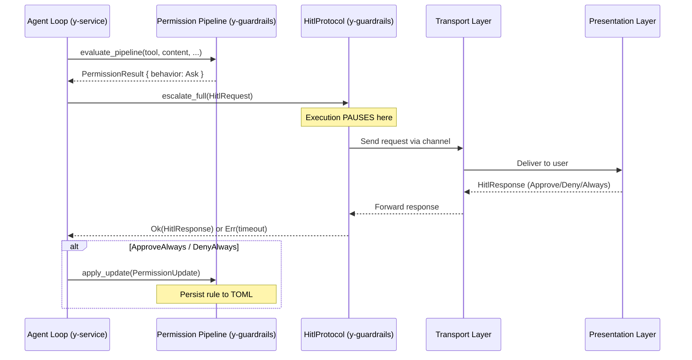

# Ask Permission -- GUI and Bot Layer Handling

When the permission pipeline resolves to `Ask`, execution pauses and the system enters the HITL (Human-in-the-Loop) flow. Here is how each presentation layer handles it.

---

## Architecture Overview



---

## Layer Mapping

| Layer | Crate | Responsibility |
|-------|-------|---------------|
| **Pipeline** | `y-guardrails` | Evaluates rules, returns `Ask` behavior |
| **Protocol** | `y-guardrails::hitl` | Channel-based pause/resume with timeout |
| **Service** | `y-service` | Wires HITL into the agent loop, passes `HitlHandler` to transport |
| **Transport** | `y-gui` (Tauri) / `y-cli` (TUI) / `y-web` (REST) | Bridges HITL channels to the user |
| **UI** | Frontend (React) / Terminal | Renders the prompt and collects the decision |

---

## GUI Layer (Tauri Desktop App -- `y-gui`)

### Data Flow

```
y-service (agent loop)
    |
    v
HitlProtocol::escalate_full()  -- sends HitlRequest via mpsc channel
    |
    v
y-gui Tauri command handler     -- receives from HitlHandler.request_rx
    |
    v
Tauri emit("chat:permission_request", payload)  -- Tauri event to frontend
    |
    v
React ChatPanel                 -- renders inline permission card
    |
    v
User clicks [Allow] / [Allow Always] / [Deny] / [Deny Always]
    |
    v
Tauri invoke("respond_permission", { request_id, response })
    |
    v
y-gui command handler           -- sends HitlResponse via oneshot channel
    |
    v
HitlProtocol receives response  -- agent loop resumes
```

### Frontend UI Design

The GUI renders an **inline permission card** in the chat stream, similar to how Claude Code shows permission prompts:

```
+---------------------------------------------------------------+
|  [!] Permission Required                                      |
|                                                                |
|  ShellExec wants to run:                                       |
|  > npm install --save lodash                                   |
|                                                                |
|  Reason: ShellExec is dangerous -- requires approval           |
|                                                                |
|  [Allow]  [Allow Always (project)]  [Deny]  [Deny Always]     |
+---------------------------------------------------------------+
```

**Key elements:**
- Tool name and action summary
- Content preview (command, file path, URL, etc.)
- Reason string from the pipeline
- 4 action buttons:
  - **Allow** -- one-time approval, resume execution
  - **Allow Always (project)** -- persist an allow rule to `.y-agent/y-agent.toml`
  - **Deny** -- one-time denial, abort tool execution
  - **Deny Always** -- persist a deny rule

### Implementation Plan

1. **New Tauri events:**
   - `chat:permission_request` -- emitted with `HitlRequest` payload
   - `chat:permission_response` -- Tauri command for user response

2. **New `ChatBusEvent` variant:**
   ```typescript
   | {
       type: 'permission_request';
       session_id: string;
       request_id: string;
       tool_name: string;
       reason: string;
       context: string;
       suggestions: string[];
     }
   ```

3. **New React component:** `PermissionCard.tsx` in `chat-panel/chat-box/`
   - Renders inline in the message stream
   - Shows tool name, action preview, reason
   - 4 buttons mapping to `HitlResponse` variants
   - Timeout indicator (countdown bar)
   - Disabled state after response

4. **State management:** Permission requests tracked in chat message metadata as a special message type, similar to `tool_result` events.

---

## Bot/CLI Layer (`y-cli` / TUI)

### Data Flow

```
y-service (agent loop)
    |
    v
HitlProtocol::escalate_full()  -- sends HitlRequest via mpsc channel
    |
    v
CLI HITL task (spawned at startup) -- receives from HitlHandler.request_rx
    |
    v
Terminal prompt:
    [?] ShellExec wants to run: npm install --save lodash
        Reason: dangerous tool
    
    (a)llow  (A)lways allow  (d)eny  (D)eny always  [a/A/d/D]:
    |
    v
User types response
    |
    v
CLI handler sends HitlResponse via oneshot channel
    |
    v
HitlProtocol receives response  -- agent loop resumes
```

### Terminal UI Design

```
------------------------------------------------------------
[?] Permission required for ShellExec

    Command: npm install --save lodash
    Reason:  dangerous tool -- requires approval

    (a) Allow this time
    (A) Always allow ShellExec          [saves to project config]
    (p) Always allow ShellExec(npm:*)   [saves to project config]
    (d) Deny this time
    (D) Always deny ShellExec           [saves to project config]

    Choice [a/A/p/d/D]: _
------------------------------------------------------------
```

**Key elements:**
- Single-key input for fast approval (`a` + Enter, or just `a` in raw mode)
- Pattern-based "always" options extracted from `suggestions` field
- Timeout countdown (e.g., `[30s remaining]`)
- Colored output: yellow for the prompt, green for allow options, red for deny

### Headless / Background Mode

When running as a bot (e.g., Discord bot, scheduled agent, CI pipeline):

| Mode | Behavior |
|------|----------|
| `DontAsk` | All `Ask` results auto-convert to `Deny`. No prompt shown. |
| `BypassPermissions` | All `Ask` results auto-convert to `Allow`. For trusted automation only. |
| `Default` (no TTY) | Falls back to `DontAsk` when `stdin` is not a TTY. |

The bot layer (`y-bot`) configures `PermissionMode::DontAsk` by default, so permission prompts never block execution. The pipeline automatically converts `Ask -> Deny` and logs the event for audit.

---

## Web API Layer (`y-web` REST)

For the REST API, HITL is handled via WebSocket or long-polling:

1. **SSE stream** emits a `permission_request` event (same as Tauri event)
2. Client sends `POST /api/v1/sessions/{id}/permission` with the response
3. Backend routes the response to the oneshot channel

This allows web-based clients (dashboards, remote UIs) to participate in HITL flows.

---

## Comparison Table

| Aspect | GUI (Tauri) | CLI/TUI | Bot/Headless | Web API |
|--------|-------------|---------|--------------|---------|
| **Transport** | Tauri events | stdin/stdout | N/A (auto-resolve) | SSE + REST |
| **Prompt style** | Inline card in chat | Terminal prompt | No prompt | JSON event |
| **Always options** | Buttons | Keyboard shortcuts | N/A | JSON payload |
| **Timeout handling** | Visual countdown | Text countdown | Instant deny | Configurable |
| **Persist target** | Global or Project | Global or Project | N/A | Global or Project |
| **Default mode** | `Default` | `Default` | `DontAsk` | `Default` |

---

## Key Design Decisions

> [!IMPORTANT]
> **The `HitlHandler` is consumed by the presentation layer.** The `ServiceContainer` creates the `(HitlProtocol, HitlHandler)` pair. The protocol stays in the service/agent loop; the handler is passed to whichever presentation layer is active (CLI, GUI, or Web). Only one consumer can hold the handler at a time.

> [!IMPORTANT]
> **Permission requests are NOT chat messages.** They are ephemeral events in the streaming pipeline. The frontend renders them inline but they are not persisted in chat history. The _result_ of the permission check (allow/deny) is logged as metadata on the tool_result event.

> [!TIP]
> **"Allow Always" target inference:** When the user clicks "Allow Always", the system infers the most useful rule from the tool invocation context. For `ShellExec(npm install --save lodash)`, suggestions might include:
> - `ShellExec(npm install:*)` -- allow all npm install commands
> - `ShellExec(npm:*)` -- allow all npm commands
> - `ShellExec` -- allow all shell commands (broad)
