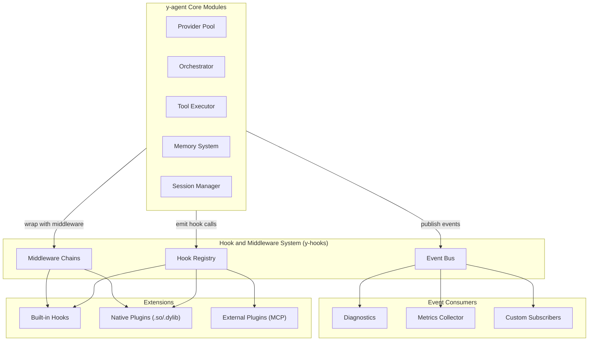
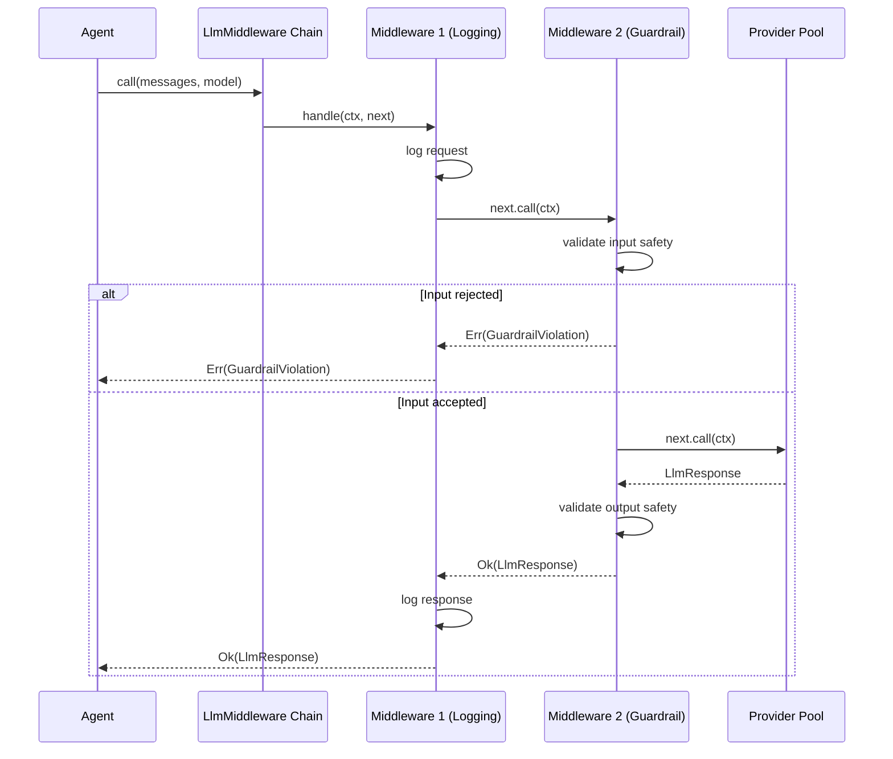
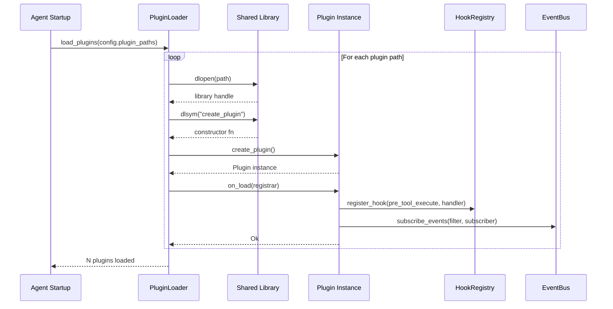
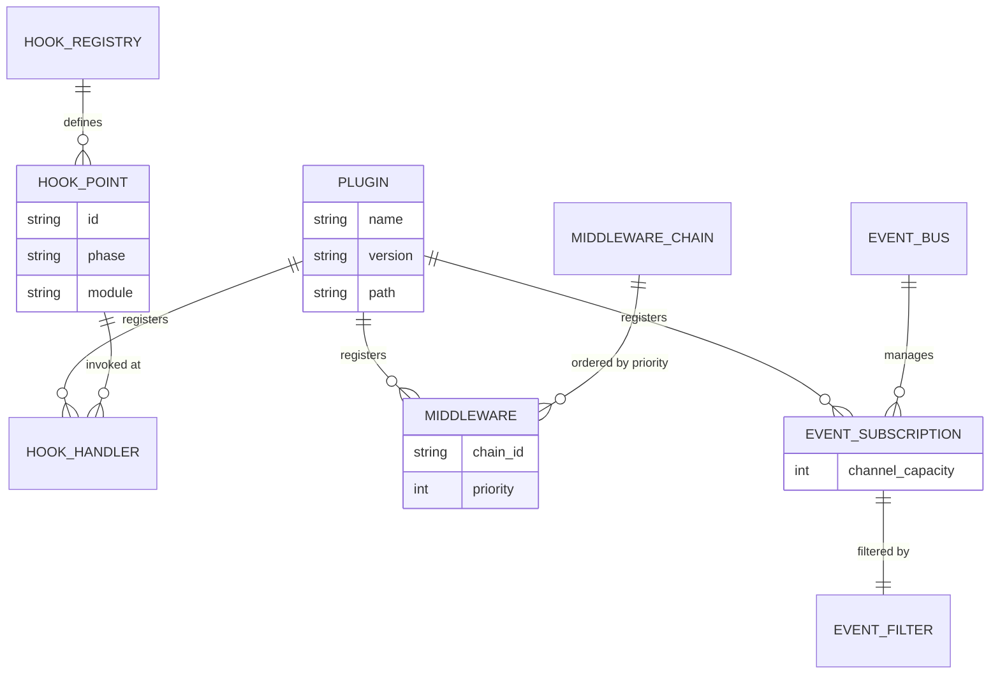

# Hook, Middleware, and Plugin System Design

> Extensibility framework providing lifecycle hooks, middleware chains, async event bus, and plugin loading for y-agent

**Version**: v0.7
**Created**: 2026-03-06
**Updated**: 2026-03-07
**Status**: Draft

---

## TL;DR

The Hook/Middleware/Plugin system is the extensibility backbone of y-agent. It provides three complementary mechanisms: **Lifecycle Hooks** that fire at well-defined points in the agent execution lifecycle (pre/post LLM call, tool execution, compaction, session events, memory operations), **Middleware Chains** (LLM, Tool, Context, Compaction, Memory) that wrap core operations with ordered, composable interceptors capable of transforming inputs/outputs or short-circuiting execution, and an **Event Bus** that decouples publishers from subscribers for async notifications. Third-party code integrates through a **Plugin API** based on a `Plugin` trait that registers hooks and middleware at load time. Plugins are loaded via Rust's `libloading` for native extensions and via the `Tool` trait's MCP pathway for external processes. This design draws on patterns from LangChain's `AgentMiddleware` (before/after/wrap hooks), Oh-My-OpenCode's rich hook point catalog, and CrewAI's `EventBus` with `TraceListener`.

---

## Background and Goals

### Background

y-agent's vision promises extensibility as a core value: developers should be able to customize agent behavior without modifying core code. The `y-hooks` crate is listed in the module structure but has no design. Meanwhile, five of eight analyzed competitors implement hook or middleware systems:

- **LangChain**: `AgentMiddleware` with `before_model_call`, `after_model_call`, `wrap_tool_execution`, plus a `Callbacks` system for tracing and observability.
- **Oh-My-OpenCode**: 8+ hook points including `chat.message`, `chat.params`, `tool.execute.before`, `tool.execute.after`, `experimental.session.compacting`, and `event` hooks.
- **CrewAI**: `EventBus` for async event dispatch with `TraceListener` subscribers.
- **OpenClaw**: Session-level hooks for compaction and memory flush.
- **CoPaw**: `BootstrapHook` and `MemoryCompactionHook` for lifecycle interception.

Without a hook system, every customization requires forking core code -- directly contradicting the extensibility vision.

### Goals

| Goal | Measurable Criteria |
|------|-------------------|
| **Comprehensive hook coverage** | At least 17 lifecycle hook points covering LLM, tool, memory, session, context, compaction, orchestration, and pipeline events |
| **Middleware composability** | Middleware chains support ordered insertion, async execution, input/output transformation, and short-circuit |
| **Low overhead** | Empty hook point (no registered handlers) adds < 100ns overhead per invocation |
| **Plugin isolation** | A failing plugin handler cannot crash the agent; errors are caught and logged |
| **Event bus throughput** | Sustain > 10,000 events/second with 10 subscribers without backpressure on publishers |
| **Dynamic loading** | Native plugins loadable at runtime via shared library; no agent recompile required |

### Assumptions

1. Hooks execute in the same process as the agent core; cross-process hooks are deferred.
2. Middleware chains are configured at startup; runtime chain modification is deferred to Phase 2.
3. The event bus is in-process; distributed event delivery (across nodes) is out of scope.
4. Native plugin ABI stability is the plugin author's responsibility; y-agent provides versioned trait definitions.

---

## Scope

### In Scope

- Lifecycle hook point definitions and the `HookRegistry`
- Middleware chain abstraction with ordered, async interceptors
- `EventBus` for publish/subscribe async event delivery
- `Plugin` trait and `PluginLoader` for dynamic extension loading
- Integration points with existing modules: Provider Pool, Orchestrator, Tools, Memory, Session/Context (see [context-session-design.md](context-session-design.md)), Compaction
- Built-in hooks for diagnostics and observability
- Configuration schema for hook ordering and plugin paths

### Out of Scope

- Cross-process hook delivery (RPC-based plugins)
- WASM plugin runtime (deferred; evaluate after WASI stabilization)
- Visual plugin marketplace UI
- Plugin dependency resolution (plugins are independent units)
- Hook point hot-add at runtime (hook points are compile-time defined)

---

## High-Level Design

### Architecture Overview



**Diagram type rationale**: Flowchart chosen to show module boundaries and dependency relationships between core modules, the hook system, and extensions.

**Legend**:
- **Core Modules**: Existing y-agent components that emit hooks, use middleware, and publish events.
- **Hook System**: The three extensibility mechanisms provided by `y-hooks`.
- **Extensions**: Concrete hook/middleware implementations from built-in, native, or external sources.
- **Consumers**: Subscribers to EventBus events.

### Three Extensibility Mechanisms

| Mechanism | Pattern | Timing | Can Transform | Can Short-Circuit |
|-----------|---------|--------|--------------|------------------|
| **Lifecycle Hooks** | Observer (fire-and-forget) | Before or after an operation | No (read-only access to context) | No |
| **Middleware Chains** | Chain of Responsibility | Wraps an operation | Yes (transform input and output) | Yes (return early without calling inner) |
| **Event Bus** | Publish/Subscribe | After an event occurs | No (events are immutable) | No |

### Hook Points

| Hook Point | Phase | Context Available | Module |
|-----------|-------|------------------|--------|
| `pre_llm_call` | Before | model, messages, tools, temperature | Provider Pool |
| `post_llm_call` | After | model, response, token_usage, latency | Provider Pool |
| `pre_tool_execute` | Before | tool_name, args, session_id | Tool Executor |
| `post_tool_execute` | After | tool_name, args, result, duration | Tool Executor |
| `pre_compaction` | Before | session_id, message_count, token_count | Session/Memory |
| `post_compaction` | After | session_id, removed_count, summary | Session/Memory |
| `session_created` | After | session_id, config | Session Manager |
| `session_closed` | After | session_id, message_count, duration | Session Manager |
| `memory_stored` | After | memory_id, memory_type, scope | Memory (LTM) |
| `memory_recalled` | After | query, result_count, top_score | Memory (LTM) |
| `context_overflow` | After | session_id, estimated_tokens, budget, action_taken | Context/Session |
| `workflow_started` | After | workflow_id, task_count | Orchestrator |
| `workflow_completed` | After | workflow_id, status, duration | Orchestrator |
| `agent_loop_start` | Before | run_id, session_id, message | Agent Core |
| `agent_loop_end` | After | run_id, session_id, response, tool_calls | Agent Core |
| `pre_pipeline_step` | Before | pipeline_id, step_name, reads, writes | Micro-Agent Pipeline |
| `post_pipeline_step` | After | pipeline_id, step_name, duration_ms, tokens_used, wm_diff | Micro-Agent Pipeline |
| `post_skill_injection` | After | run_id, session_id, injected_skill_ids, task_description | Skill Registry / Orchestrator |
| `tool_gap_detected` | After | gap_id, gap_type, tool_name, desired_capability, session_id | Tool Executor (via CapabilityGapMiddleware) |
| `tool_gap_resolved` | After | gap_id, resolution_type, tool_name, agent_instance_id | Tool Executor (via CapabilityGapMiddleware) |
| `agent_gap_detected` | After | gap_id, gap_type, agent_name, delegation_prompt, session_id | Agent Delegation (via CapabilityGapMiddleware) |
| `agent_gap_resolved` | After | gap_id, resolution_type, agent_name, agent_instance_id | Agent Delegation (via CapabilityGapMiddleware) |
| `dynamic_agent_created` | After | agent_name, trust_tier, created_by, delegation_depth | Agent Autonomy (via agent_create) |
| `dynamic_agent_deactivated` | After | agent_name, reason, deactivated_by | Agent Autonomy (via agent_deactivate) |

### Middleware Chains

Each wrappable operation has a dedicated middleware chain. Middleware is invoked in registered order, with each middleware calling `next` to proceed or returning early to short-circuit.

```rust
#[async_trait]
trait Middleware<Ctx, Out>: Send + Sync {
    async fn handle(&self, ctx: Ctx, next: Next<Ctx, Out>) -> Result<Out>;
}
```

| Middleware Chain | Wraps | Transform Capabilities |
|----------------|-------|----------------------|
| `LlmMiddleware` | Provider Pool LLM call | Modify messages, inject system prompts, alter model selection, filter response |
| `ToolMiddleware` | Tool execution | Modify args, intercept result, block execution, add approval step |
| `ContextMiddleware` | Context assembly pipeline | Add, modify, or remove context items; reorder content; inject custom context sources. Built-in providers (system prompt, bootstrap, memory, skills, tools, history) are registered at standard priorities; third-party providers insert at custom priorities. See [context-session-design.md](context-session-design.md). |
| `CompactionMiddleware` | Context compaction | Preserve specific messages, inject post-compaction content, alter compaction strategy |
| `MemoryMiddleware` | Memory store/recall | Enrich memories before storage, filter recall results, add metadata |

#### Known Middleware Implementations

The following modules register middleware in these chains. This list is maintained here for cross-reference; the authoritative design is in each module's own document.

| Middleware | Chain | Module | Purpose |
|-----------|-------|--------|---------|
| Guardrail Pre/Post Validators | `ToolMiddleware`, `LlmMiddleware` | [guardrails-hitl-design.md](guardrails-hitl-design.md) | Pre-execution validation (write-after-read guard, argument sanitization), post-execution validation (output format, PII detection) |
| LoopGuard | `ToolMiddleware` (post) | [guardrails-hitl-design.md](guardrails-hitl-design.md) | Detect repeated tool call patterns; inject warning messages or block |
| Taint Tracker | `ToolMiddleware` (post) | [guardrails-hitl-design.md](guardrails-hitl-design.md) | Tag outputs from dangerous operations with taint metadata |
| Permission Model | `ToolMiddleware` (pre) | [guardrails-hitl-design.md](guardrails-hitl-design.md) | Risk-scored allow/notify/ask/deny decisions per tool call |
| WorkingMemoryMiddleware | `ContextMiddleware` | [micro-agent-pipeline-design.md](micro-agent-pipeline-design.md) | Inject declared Working Memory slots into pipeline step agent context |
| Built-in Context Providers | `ContextMiddleware` | [context-session-design.md](context-session-design.md) | System prompt, bootstrap, memory recall, skills, tools, history (priorities 100-600) |
| SkillUsageAuditMiddleware | `LlmMiddleware` (post) | [skill-versioning-evolution-design.md](skill-versioning-evolution-design.md) | Async post-task audit: determines whether injected skills were actually used by the LLM; updates injection_count/actual_usage_count metrics |
| FileJournalMiddleware | `ToolMiddleware` (pre) | [file-journal-design.md](file-journal-design.md) | Captures original file state before file-mutating tool calls; stores in journal for scope-based rollback |
| ToolGapMiddleware (now CapabilityGapMiddleware) | `ToolMiddleware` (post) | [agent-autonomy-design.md](agent-autonomy-design.md) | Detects tool and agent capability gaps after tool execution failures or agent delegation failures; triggers tool-engineer or agent-architect sub-agent for auto-resolution or HITL escalation |

### Event Bus

The Event Bus provides fire-and-forget async event delivery. Publishers are never blocked by slow subscribers.

```rust
trait EventSubscriber: Send + Sync {
    fn event_filter(&self) -> EventFilter;
    async fn handle(&self, event: AgentEvent);
}
```

Events are delivered to subscribers via a bounded channel per subscriber. If a subscriber's channel is full, events are dropped for that subscriber (with a metric increment) rather than applying backpressure to the publisher.

### Plugin API

```rust
trait Plugin: Send + Sync {
    fn name(&self) -> &str;
    fn version(&self) -> &str;
    fn on_load(&self, registrar: &mut PluginRegistrar) -> Result<()>;
    fn on_unload(&self) -> Result<()>;
}

struct PluginRegistrar {
    // Register lifecycle hooks
    fn register_hook(&mut self, point: HookPoint, handler: Box<dyn HookHandler>);
    // Register middleware
    fn register_middleware(&mut self, chain: ChainId, priority: i32, mw: Box<dyn AnyMiddleware>);
    // Subscribe to events
    fn subscribe_events(&mut self, filter: EventFilter, sub: Box<dyn EventSubscriber>);
}
```

---

## Key Flows/Interactions

### Middleware-Wrapped LLM Call



**Diagram type rationale**: Sequence diagram chosen to show the temporal middleware chain invocation with short-circuit capability.

**Legend**:
- Each middleware calls `next` to proceed to the next middleware or the actual operation.
- Middleware 2 (Guardrail) demonstrates short-circuiting by returning an error without calling `next`.

### Plugin Loading Flow



**Diagram type rationale**: Sequence diagram chosen to show the temporal ordering of dynamic plugin loading and registration.

**Legend**:
- `dlopen`/`dlsym` represent the `libloading` API for native shared library loading.
- Each plugin self-registers its hooks and subscriptions via the `PluginRegistrar`.

### Event Bus Delivery

```mermaid
sequenceDiagram
    participant Core as Core Module
    participant EB as EventBus
    participant S1 as Subscriber 1 (Diagnostics)
    participant S2 as Subscriber 2 (Custom)

    Core->>EB: publish(ToolExecuted event)
    EB->>EB: match against subscriber filters

    par Parallel delivery
        EB->>S1: channel.send(event)
        EB->>S2: channel.send(event)
    end

    Note over EB: Publisher returns immediately; delivery is async
```

**Diagram type rationale**: Sequence diagram chosen to show the async, non-blocking event delivery pattern.

**Legend**:
- Events are delivered in parallel to all matching subscribers.
- The publisher (Core Module) never waits for subscriber processing.

---

## Data and State Model

### Core Entities



**Diagram type rationale**: ER diagram chosen to show the structural relationships between plugins, hooks, middleware, and events.

**Legend**:
- A Plugin registers zero or more hooks, middleware, and event subscriptions.
- Hook handlers are grouped by HookPoint; middleware is ordered by priority within a chain.

### Event Types

| Category | Event | Key Fields |
|----------|-------|-----------|
| **LLM** | `LlmCallStarted` | model, message_count, tool_count |
| **LLM** | `LlmCallCompleted` | model, token_usage, latency_ms, finish_reason |
| **LLM** | `LlmCallFailed` | model, error, retry_attempt |
| **Tool** | `ToolExecuted` | tool_name, duration_ms, success, cache_hit |
| **Tool** | `ToolFailed` | tool_name, error_type, args_summary |
| **Memory** | `MemoryStored` | memory_id, memory_type, importance |
| **Memory** | `MemoryRecalled` | query_summary, result_count, top_score |
| **Session** | `SessionCreated` | session_id, parent_session_id |
| **Session** | `SessionClosed` | session_id, message_count |
| **Compaction** | `CompactionTriggered` | session_id, strategy, tokens_before, tokens_after |
| **Compaction** | `CompactionFailed` | session_id, error, fallback_used |
| **Context** | `ContextOverflow` | session_id, estimated_tokens, budget |
| **Context** | `CanonicalSynced` | canonical_id, source_channel, message_count |
| **Context** | `SessionRepaired` | session_id, fixes (empty, orphan, merge, dedup counts) |
| **Orchestration** | `WorkflowEvent` | workflow_id, event_type, task_id |
| **Agent** | `AgentLoopIteration` | run_id, iteration, tool_calls_count |
| **Pipeline** | `PipelineStarted` | pipeline_id, template_name, step_count, model_config |
| **Pipeline** | `PipelineStepCompleted` | pipeline_id, step_name, duration_ms, tokens_used, slots_written |
| **Pipeline** | `PipelineStepFailed` | pipeline_id, step_name, error, retry_count |
| **Pipeline** | `PipelineCompleted` | pipeline_id, total_duration_ms, total_tokens, merge_level |
| **Pipeline** | `WorkingMemorySlotWritten` | pipeline_id, slot_key, category, token_estimate |
| **Autonomy** | `ToolGapDetected` | gap_id, gap_type (NotFound/ParameterMismatch/HardcodedConstraint), tool_name, session_id |
| **Autonomy** | `ToolGapResolved` | gap_id, resolution_type (ToolCreated/ToolUpdated/ToolRefactored), tool_name, duration_ms |
| **Autonomy** | `AgentGapDetected` | gap_id, gap_type (AgentNotFound/CapabilityMismatch/ModeInappropriate), agent_name, session_id |
| **Autonomy** | `AgentGapResolved` | gap_id, resolution_type (AgentCreated/AgentUpdated), agent_name, duration_ms |
| **Autonomy** | `DynamicToolRegistered` | tool_name, implementation_type (Script/HttpApi/Composite), created_by |
| **Autonomy** | `DynamicAgentRegistered` | agent_name, trust_tier, mode, created_by, delegation_depth |
| **Autonomy** | `DynamicAgentDeactivated` | agent_name, reason, deactivated_by |
| **Autonomy** | `WorkflowTemplateCreated` | template_id, template_name, parameter_count, created_by |

### Plugin Configuration

```toml
[hooks]
enabled = true

[[hooks.plugins]]
name = "safety-guardrails"
path = "/usr/lib/y-agent/plugins/libsafety.so"
config = { max_tool_loops = 5, require_read_before_write = true }
priority = 100

[[hooks.plugins]]
name = "custom-logger"
path = "/home/user/.y-agent/plugins/liblogger.so"
config = { log_level = "debug", output = "/tmp/agent.log" }
priority = 200

[hooks.event_bus]
default_channel_capacity = 1024
drop_policy = "drop_oldest"
```

---

## Failure Handling and Edge Cases

| Scenario | Handling |
|----------|---------|
| Hook handler panics | Caught via `catch_unwind`; error logged with plugin name; execution continues with remaining handlers |
| Middleware panics | Caught via `catch_unwind`; middleware chain aborted; error propagated to caller as `MiddlewareError` |
| Plugin `on_load` fails | Plugin skipped; error logged; agent continues without that plugin's hooks/middleware |
| Shared library load fails | `PluginLoader` logs error with path and OS error; continues loading remaining plugins |
| ABI version mismatch | Plugin declares its API version; loader rejects incompatible versions before calling `create_plugin` |
| Event subscriber channel full | Event dropped for that subscriber; `event_bus.drops` metric incremented; other subscribers unaffected |
| Slow middleware blocking chain | Per-middleware timeout (configurable, default 5s); timeout triggers chain abort with `MiddlewareTimeout` error |
| Circular middleware dependency | Middleware is ordered by numeric priority; no dependency graph; circular references are impossible by design |
| Plugin attempts unsafe operation | Plugin code runs in the same process; security relies on code review and trust level. Untrusted plugins should use MCP (out-of-process) pathway instead. |

---

## Security and Permissions

| Concern | Approach |
|---------|----------|
| **Plugin trust model** | Native plugins run in-process with full access. Only trusted, reviewed plugins should be loaded as native. Untrusted extensions should use MCP (separate process, sandboxed). |
| **Hook context access** | Hook handlers receive read-only references to context. Middleware receives mutable access only for its designated transformation scope. |
| **Event data sensitivity** | Events carry summaries, not raw content. Full message content and tool arguments are not included in events by default. A `verbosity` configuration controls detail level. |
| **Plugin path restrictions** | Plugin paths must be absolute and within configured allowed directories. Relative paths and symlinks outside allowed directories are rejected. |
| **ABI safety** | Plugins declare a compatibility version. The loader checks version before calling any plugin function. Version mismatches result in load rejection. |

---

## Performance and Scalability

### Performance Targets

| Metric | Target |
|--------|--------|
| Empty hook point overhead | < 100ns (check handler count and return) |
| Hook dispatch (10 handlers) | < 10us total |
| Middleware chain (5 middleware, pass-through) | < 50us total |
| Event bus publish (10 subscribers) | < 5us (channel send only; subscriber processing is async) |
| Plugin load time | < 100ms per native plugin |

### Optimization Strategies

- **Inline fast path**: Hook points check handler count first; if zero, return immediately with no allocation.
- **Pre-allocated handler vectors**: Handler lists are `Vec` with pre-allocated capacity; no allocation during hook dispatch.
- **Bounded channels for events**: Tokio bounded channels prevent unbounded memory growth from slow subscribers.
- **Middleware chain compilation**: At registration time, the chain is compiled into a single nested async function to avoid dynamic dispatch overhead during hot-path execution.

---

## Observability

| Signal | Metrics / Events |
|--------|-----------------|
| **Hook execution** | `hooks.dispatch.total`, `hooks.dispatch.duration_us`, `hooks.dispatch.errors` (by hook point) |
| **Middleware** | `middleware.chain.duration_us`, `middleware.chain.short_circuits`, `middleware.chain.errors` (by chain) |
| **Event bus** | `event_bus.published`, `event_bus.delivered`, `event_bus.dropped` (by event category) |
| **Plugins** | `plugins.loaded`, `plugins.load_failures`, `plugins.handler_errors` (by plugin name) |
| **Tracing** | Each hook dispatch and middleware chain creates a `tracing` span with hook/chain ID and duration |

---

## Rollout and Rollback

### Phased Implementation

| Phase | Scope | Duration |
|-------|-------|----------|
| **Phase 1** | HookRegistry with 6 core hook points (LLM pre/post, tool pre/post, session created/closed), basic EventBus, built-in diagnostics hooks | 2-3 weeks |
| **Phase 2** | Middleware chains for LLM, Tool, and Context operations, `CompactionMiddleware`, compaction and memory hook points, plugin configuration schema | 2-3 weeks |
| **Phase 3** | PluginLoader with native shared library support, Plugin trait, ABI versioning, remaining hook points | 2-3 weeks |
| **Phase 4** | Performance optimization (chain compilation, inline fast path), plugin marketplace integration (with y-skills) | 1-2 weeks |

### Rollback Plan

| Component | Rollback |
|-----------|----------|
| Hook system | Feature flag `hooks_enabled`; disabled = all hook points become no-ops |
| Middleware chains | Feature flag per chain (`llm_middleware`, `tool_middleware`, `context_middleware`); disabled = direct call to underlying operation |
| Event bus | Feature flag `event_bus`; disabled = publish calls become no-ops |
| Plugins | Remove plugin paths from config; no plugins loaded on next startup |

---

## Alternatives and Trade-offs

### Hook Dispatch: Trait Objects vs Enum-Based

| | Trait Objects (chosen) | Enum-Based Dispatch |
|-|----------------------|-------------------|
| **Extensibility** | Unlimited handler types | Closed set of handler variants |
| **Performance** | Virtual dispatch overhead | Static dispatch, inlineable |
| **Plugin support** | Natural for dynamic loading | Requires recompilation for new variants |
| **Type safety** | Runtime type checking | Compile-time guarantees |

**Decision**: Trait objects. The primary purpose of hooks is third-party extensibility, which requires open-ended handler types. The virtual dispatch overhead (< 10ns) is negligible compared to the operations being hooked (LLM calls, tool execution).

### Event Bus: Channel-per-Subscriber vs Broadcast

| | Channel-per-Subscriber (chosen) | tokio::broadcast |
|-|---------------------------------|-----------------|
| **Backpressure isolation** | Per-subscriber; slow subscriber cannot block others | Shared; slow receiver affects all |
| **Memory** | Higher (one channel per subscriber) | Lower (shared buffer) |
| **Filtering** | Pre-filter before send; only matching events enter channel | All events broadcast; filter at receiver |
| **Drop policy** | Configurable per subscriber | Lagging receiver loses oldest |

**Decision**: Channel-per-subscriber. Backpressure isolation is critical: a slow diagnostics subscriber must not slow down the agent core. Pre-filtering also reduces memory pressure.

### Plugin Loading: `libloading` vs WASM

| | `libloading` (chosen for v0) | WASM (deferred) |
|-|------------------------------|----------------|
| **Performance** | Native speed; no overhead | Interpreter/JIT overhead |
| **Safety** | Unsafe; full process access | Sandboxed; memory-safe |
| **Ecosystem** | Mature; all Rust code works | Growing; limited async support |
| **Distribution** | Platform-specific binaries | Cross-platform .wasm files |

**Decision**: `libloading` for v0 with trusted plugins. WASM deferred until WASI async support matures. Untrusted extensions should use MCP (out-of-process) until WASM is available.

### Middleware vs Hooks: Unified or Separate

| | Separate (chosen) | Unified (single mechanism) |
|-|-------------------|--------------------------|
| **Clarity** | Clear: hooks observe, middleware transforms | Ambiguous: is this handler observing or modifying? |
| **Safety** | Hooks get read-only context | All handlers get mutable access |
| **Complexity** | Two APIs to learn | One API, simpler surface |

**Decision**: Separate mechanisms. The distinction between observation (hooks) and transformation (middleware) is fundamental. Conflating them leads to subtle bugs where observation handlers accidentally modify state.

---

## Open Questions

| # | Question | Owner | Due Date | Status |
|---|----------|-------|----------|--------|
| 1 | Should middleware chains support runtime reordering (changing priority after startup)? | Hooks team | 2026-03-20 | Open |
| 2 | Should the EventBus support replay (new subscribers receive recent events)? | Hooks team | 2026-03-27 | Open |
| 3 | What is the maximum number of plugins that should be loaded simultaneously? | Hooks team | 2026-03-20 | Open |
| 4 | Should hook handlers receive a mutable `HookContext` for cross-handler communication within a single dispatch? | Hooks team | 2026-04-03 | Open |
| 5 | Should plugins declare required hook points, and fail to load if those points are unavailable? | Hooks team | 2026-04-03 | Open |

