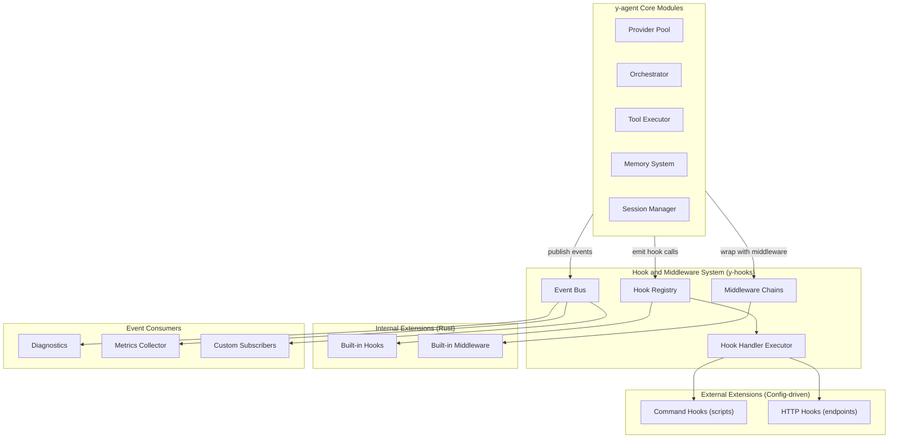
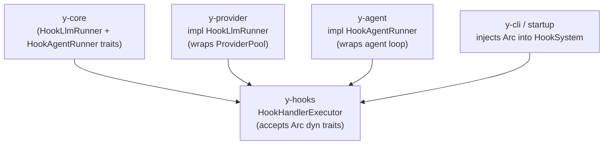
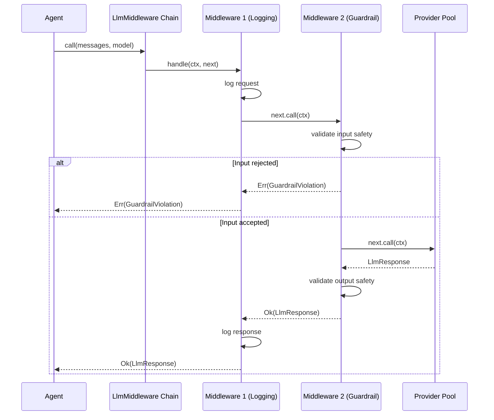
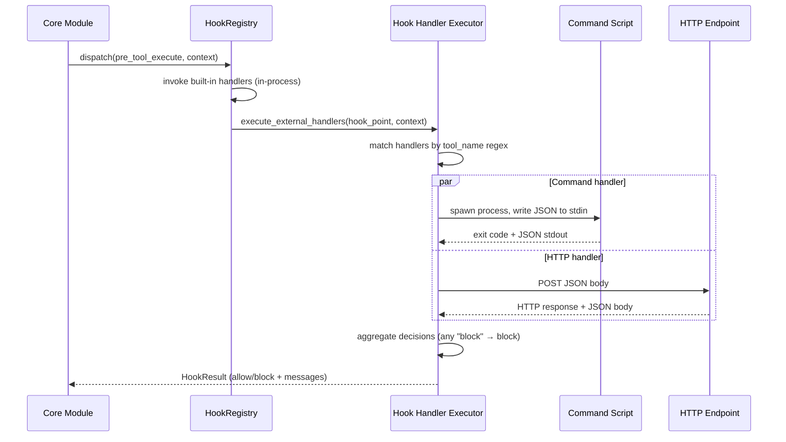
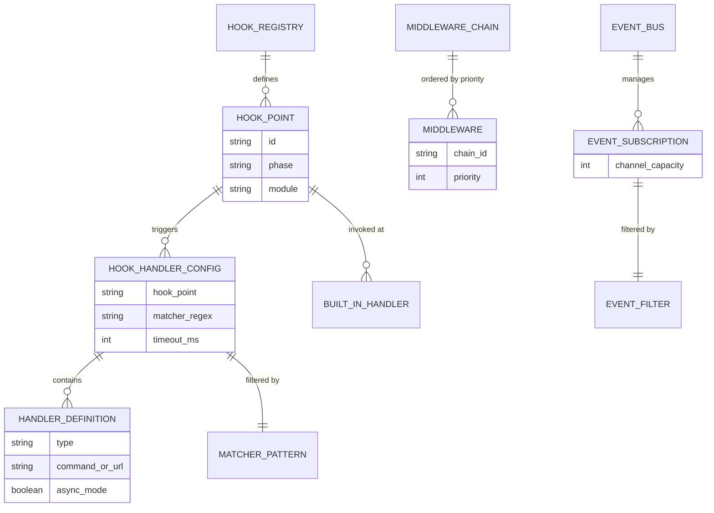

# Hook, Middleware, and Event System Design

> Extensibility framework providing lifecycle hooks, middleware chains, async event bus, and configuration-driven hook handlers for y-agent

**Version**: v0.10
**Created**: 2026-03-06
**Updated**: 2026-03-11
**Status**: Draft

---

## TL;DR

The Hook/Middleware/Event system is the extensibility backbone of y-agent. It provides three complementary in-process mechanisms: **Lifecycle Hooks** that fire at well-defined points in the agent execution lifecycle (pre/post LLM call, tool execution, compaction, session events, memory operations), **Middleware Chains** (LLM, Tool, Context, Compaction, Memory) that wrap core operations with ordered, composable interceptors capable of transforming inputs/outputs or short-circuiting execution, and an **Event Bus** that decouples publishers from subscribers for async notifications. External extensibility is provided through four **configuration-driven Hook Handler** types: **Command hooks** execute shell scripts with JSON-over-stdin I/O, **HTTP hooks** POST event context to URL endpoints, **Prompt hooks** send event context to an LLM for single-turn yes/no evaluation, and **Agent hooks** spawn a subagent with read-only tools for multi-turn verification. This replaces the previous `Plugin`/`PluginLoader`/`libloading` approach with a simpler, configuration-only model that requires no recompilation, no ABI management, and no `unsafe` code. The design draws on patterns from Claude Code's hook handler model (command/HTTP/prompt/agent types with matchers), LangChain's `AgentMiddleware`, and CrewAI's `EventBus`.

---

## Background and Goals

### Background

y-agent's vision promises extensibility as a core value: developers should be able to customize agent behavior without modifying core code. The `y-hooks` crate provides the internal extensibility infrastructure (middleware chains, event bus, hook registry). For external extensibility, the previous design relied on `libloading` to load native shared libraries (`.so/.dylib`). This introduced significant complexity for a personal research project:

- **ABI fragility**: Plugin and host must use identical Rust compiler versions and crate layouts.
- **Unsafe code**: `dlopen`/`dlsym` require `unsafe` blocks with no memory safety guarantees.
- **Platform coupling**: Shared libraries are platform-specific binaries requiring separate builds per OS.
- **Distribution overhead**: A user base of one does not justify maintaining a plugin ABI contract.

Claude Code demonstrates a simpler model: hooks are defined in configuration files and executed as shell commands or HTTP requests. This provides the same extensibility (custom validation, logging, notifications, integrations) without any of the above costs.

### Goals

| Goal | Measurable Criteria |
|------|-------------------|
| **Comprehensive hook coverage** | At least 17 lifecycle hook points covering LLM, tool, memory, session, context, compaction, orchestration, and pipeline events |
| **Middleware composability** | Middleware chains support ordered insertion, async execution, input/output transformation, and short-circuit |
| **Low overhead** | Empty hook point (no registered handlers) adds < 100ns overhead per invocation |
| **Handler isolation** | A failing hook handler (command or HTTP) cannot crash the agent; errors are caught and logged |
| **Event bus throughput** | Sustain > 10,000 events/second with 10 subscribers without backpressure on publishers |
| **Configuration-driven extensibility** | External hooks defined in TOML configuration; no recompilation required to add, remove, or modify hook handlers |

### Assumptions

1. Hooks execute in the same process as the agent core; hook handlers (command/HTTP) execute out-of-process.
2. Middleware chains are configured at startup; runtime chain modification is deferred to Phase 2.
3. The event bus is in-process; distributed event delivery (across nodes) is out of scope.
4. Command hooks run on the host OS; they inherit the agent process's environment and permissions.

---

## Scope

### In Scope

- Lifecycle hook point definitions and the `HookRegistry`
- Middleware chain abstraction with ordered, async interceptors
- `EventBus` for publish/subscribe async event delivery
- **Command hook handlers**: shell script execution with JSON stdin/stdout protocol
- **HTTP hook handlers**: HTTP POST to URL endpoints with JSON request/response
- Integration points with existing modules: Provider Pool, Orchestrator, Tools, Memory, Session/Context (see [context-session-design.md](context-session-design.md)), Compaction
- Built-in hooks for diagnostics and observability
- Configuration schema for hook ordering, matcher patterns, and handler definitions

### Out of Scope

- Native shared library plugin loading (`libloading`/`dlopen`) — removed; see Alternatives
- WASM plugin runtime — deferred; see Alternatives
- Cross-process hook delivery (RPC-based plugins beyond command/HTTP)
- Visual plugin marketplace UI
- Hook point hot-add at runtime (hook points are compile-time defined)

---

## High-Level Design

### Architecture Overview



**Diagram type rationale**: Flowchart chosen to show module boundaries and dependency relationships between core modules, the hook system, and both internal and external extension mechanisms.

**Legend**:
- **Core Modules**: Existing y-agent components that emit hooks, use middleware, and publish events.
- **Hook System**: The four components: HookRegistry, Middleware Chains, Event Bus, and Hook Handler Executor.
- **Internal Extensions**: In-process Rust implementations (built-in hooks and middleware like guardrails, file journal, etc.).
- **External Extensions**: Out-of-process handlers defined in configuration (command scripts, HTTP endpoints).
- **Consumers**: Subscribers to EventBus events.

### Three Extensibility Mechanisms

| Mechanism | Pattern | Timing | Can Transform | Can Short-Circuit |
|-----------|---------|--------|--------------|------------------|
| **Lifecycle Hooks** | Observer (fire-and-forget) | Before or after an operation | No (read-only access to context) | No |
| **Middleware Chains** | Chain of Responsibility | Wraps an operation | Yes (transform input and output) | Yes (return early without calling inner) |
| **Event Bus** | Publish/Subscribe | After an event occurs | No (events are immutable) | No |

### Hook Points

| Hook Point | Phase | Context Available | Module |
|-----------|-------|------------------|--------|
| `pre_llm_call` | Before | model, messages, tools, temperature | Provider Pool |
| `post_llm_call` | After | model, response, token_usage, latency | Provider Pool |
| `pre_tool_execute` | Before | tool_name, args, session_id | Tool Executor |
| `post_tool_execute` | After | tool_name, args, result, duration | Tool Executor |
| `pre_compaction` | Before | session_id, message_count, token_count | Session/Memory |
| `post_compaction` | After | session_id, removed_count, summary | Session/Memory |
| `session_created` | After | session_id, config | Session Manager |
| `session_closed` | After | session_id, message_count, duration | Session Manager |
| `memory_stored` | After | memory_id, memory_type, scope | Memory (LTM) |
| `memory_recalled` | After | query, result_count, top_score | Memory (LTM) |
| `context_overflow` | After | session_id, estimated_tokens, budget, action_taken | Context/Session |
| `workflow_started` | After | workflow_id, task_count | Orchestrator |
| `workflow_completed` | After | workflow_id, status, duration | Orchestrator |
| `agent_loop_start` | Before | run_id, session_id, message | Agent Core |
| `agent_loop_end` | After | run_id, session_id, response, tool_calls | Agent Core |
| `pre_pipeline_step` | Before | pipeline_id, step_name, reads, writes | Micro-Agent Pipeline |
| `post_pipeline_step` | After | pipeline_id, step_name, duration_ms, tokens_used, wm_diff | Micro-Agent Pipeline |
| `post_skill_injection` | After | run_id, session_id, injected_skill_ids, task_description | Skill Registry / Orchestrator |
| `tool_gap_detected` | After | gap_id, gap_type, tool_name, desired_capability, session_id | Tool Executor (via CapabilityGapMiddleware) |
| `tool_gap_resolved` | After | gap_id, resolution_type, tool_name, agent_instance_id | Tool Executor (via CapabilityGapMiddleware) |
| `agent_gap_detected` | After | gap_id, gap_type, agent_name, delegation_prompt, session_id | Agent Delegation (via CapabilityGapMiddleware) |
| `agent_gap_resolved` | After | gap_id, resolution_type, agent_name, agent_instance_id | Agent Delegation (via CapabilityGapMiddleware) |
| `dynamic_agent_created` | After | agent_name, trust_tier, created_by, delegation_depth | Agent Autonomy (via agent_create) |
| `dynamic_agent_deactivated` | After | agent_name, reason, deactivated_by | Agent Autonomy (via agent_deactivate) |

### Middleware Chains

Each wrappable operation has a dedicated middleware chain. Middleware is invoked in registered order, with each middleware calling `next` to proceed or returning early to short-circuit.

```rust
#[async_trait]
trait Middleware<Ctx, Out>: Send + Sync {
    async fn handle(&self, ctx: Ctx, next: Next<Ctx, Out>) -> Result<Out>;
}
```

| Middleware Chain | Wraps | Transform Capabilities |
|----------------|-------|----------------------|
| `LlmMiddleware` | Provider Pool LLM call | Modify messages, inject system prompts, alter model selection, filter response |
| `ToolMiddleware` | Tool execution | Modify args, intercept result, block execution, add approval step |
| `ContextMiddleware` | Context assembly pipeline | Add, modify, or remove context items; reorder content; inject custom context sources. Built-in providers (system prompt, bootstrap, memory, skills, tools, history) are registered at standard priorities; third-party providers insert at custom priorities. See [context-session-design.md](context-session-design.md). |
| `CompactionMiddleware` | Context compaction | Preserve specific messages, inject post-compaction content, alter compaction strategy |
| `MemoryMiddleware` | Memory store/recall | Enrich memories before storage, filter recall results, add metadata |

#### Known Middleware Implementations

The following modules register middleware in these chains. This list is maintained here for cross-reference; the authoritative design is in each module's own document.

| Middleware | Chain | Module | Purpose |
|-----------|-------|--------|---------|
| Guardrail Pre/Post Validators | `ToolMiddleware`, `LlmMiddleware` | [guardrails-hitl-design.md](guardrails-hitl-design.md) | Pre-execution validation (write-after-read guard, argument sanitization), post-execution validation (output format, PII detection) |
| LoopGuard | `ToolMiddleware` (post) | [guardrails-hitl-design.md](guardrails-hitl-design.md) | Detect repeated tool call patterns; inject warning messages or block |
| Taint Tracker | `ToolMiddleware` (post) | [guardrails-hitl-design.md](guardrails-hitl-design.md) | Tag outputs from dangerous operations with taint metadata |
| Permission Model | `ToolMiddleware` (pre) | [guardrails-hitl-design.md](guardrails-hitl-design.md) | Risk-scored allow/notify/ask/deny decisions per tool call |
| WorkingMemoryMiddleware | `ContextMiddleware` | [micro-agent-pipeline-design.md](micro-agent-pipeline-design.md) | Inject declared Working Memory slots into pipeline step agent context |
| Built-in Context Providers | `ContextMiddleware` | [context-session-design.md](context-session-design.md) | System prompt, bootstrap, memory recall, skills, tools, history (priorities 100-600) |
| SkillUsageAuditMiddleware | `LlmMiddleware` (post) | [skill-versioning-evolution-design.md](skill-versioning-evolution-design.md) | Async post-task audit: determines whether injected skills were actually used by the LLM; updates injection_count/actual_usage_count metrics |
| FileJournalMiddleware | `ToolMiddleware` (pre) | [file-journal-design.md](file-journal-design.md) | Captures original file state before file-mutating tool calls; stores in journal for scope-based rollback |
| ToolGapMiddleware (now CapabilityGapMiddleware) | `ToolMiddleware` (post) | [agent-autonomy-design.md](agent-autonomy-design.md) | Detects tool and agent capability gaps after tool execution failures or agent delegation failures; triggers tool-engineer or agent-architect sub-agent for auto-resolution or HITL escalation |

### Event Bus

The Event Bus provides fire-and-forget async event delivery. Publishers are never blocked by slow subscribers.

```rust
trait EventSubscriber: Send + Sync {
    fn event_filter(&self) -> EventFilter;
    async fn handle(&self, event: AgentEvent);
}
```

Events are delivered to subscribers via a bounded channel per subscriber. If a subscriber's channel is full, events are dropped for that subscriber (with a metric increment) rather than applying backpressure to the publisher.

### Hook Handler Types

External extensibility is provided through configuration-driven hook handlers. Handlers are defined in TOML and executed by the **Hook Handler Executor** when a matching lifecycle hook fires.

#### Handler Configuration Model

Each hook point can have zero or more **handler groups**. Each group has an optional **matcher** (regex filter) and one or more **handlers** to execute when matched.

```toml
[hooks]
enabled = true

[[hooks.pre_tool_execute]]
matcher = "Bash|ShellExec"   # regex; omit or "*" for all events
timeout_ms = 5000

  [[hooks.pre_tool_execute.handlers]]
  type = "command"
  command = "/home/user/.y-agent/hooks/block-rm.sh"

  [[hooks.pre_tool_execute.handlers]]
  type = "http"
  url = "http://localhost:8080/hooks/pre-tool-use"
  headers = { Authorization = "Bearer $MY_TOKEN" }

[[hooks.post_tool_execute]]
matcher = "*"
  [[hooks.post_tool_execute.handlers]]
  type = "command"
  command = "/home/user/.y-agent/hooks/log-tool.sh"
  async = true   # fire-and-forget; do not wait for result

# Agent loop end: LLM-based evaluation of completion
[[hooks.agent_loop_end]]
  [[hooks.agent_loop_end.handlers]]
  type = "prompt"
  prompt = "Evaluate if the agent should stop: $ARGUMENTS. Check if all tasks are complete."
  model = "haiku"   # optional; defaults to fastest available model
  timeout_ms = 30000

# Pre-tool-execute: agent-based verification with tools
[[hooks.pre_tool_execute]]
matcher = "Bash"
  [[hooks.pre_tool_execute.handlers]]
  type = "agent"
  prompt = "Verify that this bash command is safe to run. Check the project for any .env or secrets files that might be affected. $ARGUMENTS"
  timeout_ms = 120000
```

#### Common Handler Fields

| Field | Type | Required | Description |
|-------|------|----------|-------------|
| `type` | `"command"` / `"http"` / `"prompt"` / `"agent"` | Yes | Handler execution type |
| `timeout_ms` | integer | No | Per-handler timeout in milliseconds (default: 5000 for command/HTTP, 30000 for prompt, 120000 for agent) |
| `async` | boolean | No | If `true`, handler runs in background; results are not awaited (default: `false`). Not supported for prompt/agent types. |

#### Command Hook Fields

| Field | Type | Required | Description |
|-------|------|----------|-------------|
| `command` | string | Yes | Absolute path to script or shell command to execute |

**Execution protocol**:
1. The hook event's context is serialized as JSON and written to the command's **stdin**.
2. The command communicates results via **exit codes** and optional **JSON on stdout**.

**Exit code semantics**:

| Exit Code | Meaning |
|-----------|---------|
| `0` | Success; hook allows the operation to proceed |
| `1` | Non-blocking error; logged, operation continues |
| `2` | Blocking error; operation is prevented (for `pre_*` hooks) or agent stops (for `post_*` hooks) |

**JSON output** (optional, on stdout):

```json
{
  "decision": "block",
  "reason": "Destructive command blocked by hook",
  "context_message": "Optional message injected into agent context"
}
```

| Output Field | Type | Description |
|--------------|------|-------------|
| `decision` | `"allow"` / `"block"` | Override hook decision (for `pre_*` hooks). If omitted, exit code determines the decision. |
| `reason` | string | Human-readable reason for the decision; logged and optionally shown to user |
| `context_message` | string | Message injected into the agent's context as a system message |
| `suppress_output` | boolean | If `true`, suppresses handler output from logs |

#### HTTP Hook Fields

| Field | Type | Required | Description |
|-------|------|----------|-------------|
| `url` | string | Yes | URL to POST to |
| `headers` | table | No | HTTP headers; values support `$ENV_VAR` substitution |

**Execution protocol**:
1. The hook event's context is sent as a JSON POST body with `Content-Type: application/json`.
2. The response uses the same JSON output format as command hooks.

**Response handling**:

| Response | Handling |
|----------|---------|
| 2xx with empty body | Success; equivalent to exit code 0 |
| 2xx with JSON body | Parsed using the same JSON output schema |
| Non-2xx status | Non-blocking error; logged, operation continues |
| Connection failure / timeout | Non-blocking error; logged, operation continues |

#### Prompt Hook Fields

Prompt hooks send the hook event context and a user-defined prompt to an LLM for single-turn evaluation. The LLM returns a structured yes/no decision. This is useful for nuanced decisions that are hard to express as simple scripts (e.g., "should the agent stop?").

| Field | Type | Required | Description |
|-------|------|----------|-------------|
| `prompt` | string | Yes | Prompt template sent to the LLM. `$ARGUMENTS` is replaced with the hook's JSON input. |
| `model` | string | No | Model to use for evaluation. Defaults to the fastest available model (e.g., Haiku-class). |

**Execution protocol**:
1. The `$ARGUMENTS` placeholder in the prompt is replaced with the hook event's JSON input.
2. The combined prompt is sent to the configured model as a single-turn completion request.
3. The LLM responds with structured JSON.

**Response schema**:

```json
{
  "ok": true,
  "reason": "All tasks are complete and tests pass."
}
```

| Field | Type | Description |
|-------|------|-------------|
| `ok` | boolean | `true` = allow the operation to proceed; `false` = block the operation |
| `reason` | string | Explanation for the decision; fed back to the agent as context when `ok` is `false` |

**Supported hook points**: Prompt hooks are only supported on decision-capable hook points: `pre_tool_execute`, `post_tool_execute`, `pre_llm_call`, `agent_loop_start`, `agent_loop_end`, `pre_compaction`. Other hook points only support command and HTTP handlers.

#### Agent Hook Fields

Agent hooks spawn a subagent that can use read-only tools (file read, grep, glob) to investigate the codebase before making a decision. This enables multi-turn verification that goes beyond what a single LLM call can assess (e.g., "verify that all unit tests pass before stopping").

| Field | Type | Required | Description |
|-------|------|----------|-------------|
| `prompt` | string | Yes | Task prompt for the subagent. `$ARGUMENTS` is replaced with the hook's JSON input. |
| `model` | string | No | Model for the subagent. Defaults to the fastest available model. |

**Execution protocol**:
1. A subagent is spawned with the given prompt (with `$ARGUMENTS` substituted) and the hook event's JSON input.
2. The subagent can use read-only tools: `Read`, `Grep`, `Glob` to investigate the workspace.
3. After up to 50 turns, the subagent returns a structured `{ok, reason}` decision (same schema as prompt hooks).
4. The decision is processed identically to a prompt hook response.

**Supported hook points**: Same as prompt hooks — only decision-capable hook points.

**Security**: Agent hooks run in a sandboxed context with read-only filesystem access. They cannot execute commands, write files, or make network requests. The subagent's tool set is restricted to `Read`, `Grep`, and `Glob`.

#### Hook Input Format

All handlers (command and HTTP) receive a JSON object with common fields plus hook-specific fields:

```json
{
  "session_id": "abc-123",
  "hook_event": "pre_tool_execute",
  "timestamp": "2026-03-11T10:00:00Z",
  "tool_name": "Bash",
  "tool_input": {
    "command": "rm -rf /tmp/build"
  }
}
```

| Common Field | Type | Description |
|--------------|------|-------------|
| `session_id` | string | Current session identifier |
| `hook_event` | string | The hook point that triggered this handler |
| `timestamp` | string (ISO 8601) | When the hook fired |

Additional fields are hook-specific and correspond to the "Context Available" column in the Hook Points table above.

#### Matcher Patterns

The `matcher` field uses regex patterns to filter when handlers fire:

- Omitted or `"*"` — matches all events at this hook point.
- For tool-related hooks (`pre_tool_execute`, `post_tool_execute`): matches against `tool_name`.
- For session hooks: matches against session event subtype.
- Multiple patterns can be combined with `|` (regex alternation).

---

## LLM Hook Integration Architecture

Prompt and agent hooks require access to LLM providers and agent execution capabilities. To avoid circular crate dependencies (`y-hooks` → `y-provider` → `y-core` ← `y-hooks`), these capabilities are injected via traits defined in `y-core`.

### Dependency Injection Traits

Two traits are defined in `y-core::hook` and injected into `HookHandlerExecutor` at construction time:

```rust
// y-core/src/hook.rs

/// Single-turn LLM evaluation for prompt hooks.
/// Implemented by y-provider (wraps ProviderPool).
#[async_trait]
pub trait HookLlmRunner: Send + Sync {
    /// Send a single-turn completion and return structured JSON.
    async fn evaluate(
        &self,
        system_prompt: &str,
        user_message: &str,
        model: Option<&str>,
        timeout: Duration,
    ) -> Result<String, String>;
}

/// Multi-turn subagent execution for agent hooks.
/// Implemented by y-agent (wraps the agent loop).
#[async_trait]
pub trait HookAgentRunner: Send + Sync {
    /// Run a subagent with read-only tools (Read, Grep, Glob).
    /// Returns the final structured JSON response.
    async fn run_agent(
        &self,
        task_prompt: &str,
        model: Option<&str>,
        max_turns: u32,
        timeout: Duration,
    ) -> Result<String, String>;
}
```

### Injection Flow



**Diagram type rationale**: Flowchart showing dependency direction — traits flow from y-core, implementations from y-provider/y-agent, wiring at startup.

### `HookHandlerExecutor` Changes

The executor stores optional `Arc<dyn HookLlmRunner>` and `Arc<dyn HookAgentRunner>`. Prompt/agent handlers are skipped with a warning if the corresponding runner is `None`.

```rust
// y-hooks/src/hook_handler.rs
pub struct HookHandlerExecutor {
    // ... existing fields ...
    llm_runner: Option<Arc<dyn HookLlmRunner>>,
    agent_runner: Option<Arc<dyn HookAgentRunner>>,
}
```

The `HookSystem` exposes `set_llm_runner()` and `set_agent_runner()` methods, called during application startup after all crates are initialized. This post-construction injection avoids the need for the runners at config-parse time.

---

## Key Flows/Interactions

### Middleware-Wrapped LLM Call



**Diagram type rationale**: Sequence diagram chosen to show the temporal middleware chain invocation with short-circuit capability.

**Legend**:
- Each middleware calls `next` to proceed to the next middleware or the actual operation.
- Middleware 2 (Guardrail) demonstrates short-circuiting by returning an error without calling `next`.

### Hook Handler Execution Flow



**Diagram type rationale**: Sequence diagram chosen to show the temporal ordering of hook handler dispatch with both command and HTTP handler types executing in parallel.

**Legend**:
- Built-in handlers (Rust) execute in-process first.
- External handlers (command/HTTP) are dispatched by the Hook Handler Executor.
- Decisions are aggregated: if any handler returns "block", the operation is blocked.

### Event Bus Delivery

```mermaid
sequenceDiagram
    participant Core as Core Module
    participant EB as EventBus
    participant S1 as Subscriber 1 (Diagnostics)
    participant S2 as Subscriber 2 (Custom)

    Core->>EB: publish(ToolExecuted event)
    EB->>EB: match against subscriber filters

    par Parallel delivery
        EB->>S1: channel.send(event)
        EB->>S2: channel.send(event)
    end

    Note over EB: Publisher returns immediately; delivery is async
```

**Diagram type rationale**: Sequence diagram chosen to show the async, non-blocking event delivery pattern.

**Legend**:
- Events are delivered in parallel to all matching subscribers.
- The publisher (Core Module) never waits for subscriber processing.

---

## Data and State Model

### Core Entities



**Diagram type rationale**: ER diagram chosen to show the structural relationships between hook handler configs, hook points, middleware, and events.

**Legend**:
- Hook handler configs are defined in TOML and loaded at startup.
- Each config contains one or more handler definitions (command or HTTP) and an optional matcher pattern.
- Built-in handlers are Rust implementations registered programmatically; hook handler configs are external handlers loaded from configuration.

### Event Types

| Category | Event | Key Fields |
|----------|-------|-----------| 
| **LLM** | `LlmCallStarted` | model, message_count, tool_count |
| **LLM** | `LlmCallCompleted` | model, token_usage, latency_ms, finish_reason |
| **LLM** | `LlmCallFailed` | model, error, retry_attempt |
| **Tool** | `ToolExecuted` | tool_name, duration_ms, success, cache_hit |
| **Tool** | `ToolFailed` | tool_name, error_type, args_summary |
| **Memory** | `MemoryStored` | memory_id, memory_type, importance |
| **Memory** | `MemoryRecalled` | query_summary, result_count, top_score |
| **Session** | `SessionCreated` | session_id, parent_session_id |
| **Session** | `SessionClosed` | session_id, message_count |
| **Compaction** | `CompactionTriggered` | session_id, strategy, tokens_before, tokens_after |
| **Compaction** | `CompactionFailed` | session_id, error, fallback_used |
| **Context** | `ContextOverflow` | session_id, estimated_tokens, budget |
| **Context** | `CanonicalSynced` | canonical_id, source_channel, message_count |
| **Context** | `SessionRepaired` | session_id, fixes (empty, orphan, merge, dedup counts) |
| **Orchestration** | `WorkflowEvent` | workflow_id, event_type, task_id |
| **Agent** | `AgentLoopIteration` | run_id, iteration, tool_calls_count |
| **Pipeline** | `PipelineStarted` | pipeline_id, template_name, step_count, model_config |
| **Pipeline** | `PipelineStepCompleted` | pipeline_id, step_name, duration_ms, tokens_used, slots_written |
| **Pipeline** | `PipelineStepFailed` | pipeline_id, step_name, error, retry_count |
| **Pipeline** | `PipelineCompleted` | pipeline_id, total_duration_ms, total_tokens, merge_level |
| **Pipeline** | `WorkingMemorySlotWritten` | pipeline_id, slot_key, category, token_estimate |
| **Autonomy** | `ToolGapDetected` | gap_id, gap_type (NotFound/ParameterMismatch/HardcodedConstraint), tool_name, session_id |
| **Autonomy** | `ToolGapResolved` | gap_id, resolution_type (ToolCreated/ToolUpdated/ToolRefactored), tool_name, duration_ms |
| **Autonomy** | `AgentGapDetected` | gap_id, gap_type (AgentNotFound/CapabilityMismatch/ModeInappropriate), agent_name, session_id |
| **Autonomy** | `AgentGapResolved` | gap_id, resolution_type (AgentCreated/AgentUpdated), agent_name, duration_ms |
| **Autonomy** | `DynamicToolRegistered` | tool_name, implementation_type (Script/HttpApi/Composite), created_by |
| **Autonomy** | `DynamicAgentRegistered` | agent_name, trust_tier, mode, created_by, delegation_depth |
| **Autonomy** | `DynamicAgentDeactivated` | agent_name, reason, deactivated_by |
| **Autonomy** | `WorkflowTemplateCreated` | template_id, template_name, parameter_count, created_by |

### Hook Handler Configuration

```toml
[hooks]
enabled = true

# Pre-tool-execute: block dangerous commands
[[hooks.pre_tool_execute]]
matcher = "Bash|ShellExec"
timeout_ms = 5000

  [[hooks.pre_tool_execute.handlers]]
  type = "command"
  command = "/home/user/.y-agent/hooks/block-rm.sh"

# Post-tool-execute: log all tool executions (async, non-blocking)
[[hooks.post_tool_execute]]
matcher = "*"

  [[hooks.post_tool_execute.handlers]]
  type = "command"
  command = "/home/user/.y-agent/hooks/log-tool.sh"
  async = true

# Pre-LLM-call: send to external validator
[[hooks.pre_llm_call]]

  [[hooks.pre_llm_call.handlers]]
  type = "http"
  url = "http://localhost:8080/hooks/validate-llm-call"
  headers = { Authorization = "Bearer $API_TOKEN" }
  timeout_ms = 10000

[hooks.event_bus]
default_channel_capacity = 1024
drop_policy = "drop_oldest"
```

---

## Failure Handling and Edge Cases

| Scenario | Handling |
|----------|---------|
| Built-in hook handler panics | Caught via `catch_unwind`; error logged with handler name; execution continues with remaining handlers |
| Middleware panics | Caught via `catch_unwind`; middleware chain aborted; error propagated to caller as `MiddlewareError` |
| Command hook script not found | Logged as non-blocking error; hook result defaults to "allow"; operation continues |
| Command hook exits with code 1 | Non-blocking error; logged with stderr output; operation continues |
| Command hook exits with code 2 | Blocking error; operation is prevented (for `pre_*` hooks); error reason extracted from stderr or JSON stdout |
| Command hook exceeds timeout | Process killed; logged as timeout error; operation continues (non-blocking) |
| HTTP hook connection refused | Non-blocking error; logged; operation continues |
| HTTP hook returns non-2xx | Non-blocking error; logged with status code and body; operation continues |
| HTTP hook exceeds timeout | Request aborted; logged as timeout error; operation continues |
| Multiple handlers disagree | Aggregate decision: if any synchronous handler returns "block", the operation is blocked |
| Async hook handler fails | Error logged; no effect on operation (fire-and-forget) |
| Prompt hook LLM call fails | Non-blocking error; logged; decision defaults to "allow"; operation continues |
| Prompt hook returns invalid JSON | Non-blocking error; logged; decision defaults to "allow"; operation continues |
| Prompt hook returns `ok: false` | Blocking: operation is prevented (for `pre_*` hooks); `reason` fed back to agent context |
| Agent hook subagent exceeds max turns | Subagent terminated; decision defaults to "allow"; timeout logged |
| Agent hook subagent tool error | Subagent continues with error context; final decision still processed normally |
| Agent hook on unsupported hook point | Configuration validation error at startup; hook not registered |
| Event subscriber channel full | Event dropped for that subscriber; `event_bus.drops` metric incremented; other subscribers unaffected |
| Slow middleware blocking chain | Per-middleware timeout (configurable, default 5s); timeout triggers chain abort with `MiddlewareTimeout` error |
| Circular middleware dependency | Middleware is ordered by numeric priority; no dependency graph; circular references are impossible by design |

---

## Security and Permissions

| Concern | Approach |
|---------|----------|
| **Command hook execution** | Hook commands execute as the same OS user as the agent. Scripts must be absolute paths. The configuration supports `allowed_hook_dirs` to restrict which directories hook scripts can be loaded from. |
| **HTTP hook endpoints** | HTTP hooks POST to configured URLs. TLS is recommended for non-localhost endpoints. Headers support `$ENV_VAR` substitution for secrets (tokens are never stored in config plaintext). |
| **Hook context data sensitivity** | Hook handlers receive summaries by default, not raw content. A `verbosity` configuration level controls what data is serialized to hook handlers (minimal/standard/full). |
| **Hook handler trust model** | Command hooks run with the agent's OS permissions. HTTP hooks can reach any network endpoint. Both are configured by the user explicitly. No hook handler is auto-discovered. |
| **Middleware access** | Hook handlers (command/HTTP) receive read-only copies of context. Middleware (in-process Rust) receives mutable access only for its designated transformation scope. |
| **Disable mechanism** | `hooks.enabled = false` disables all external hook handlers globally. Individual hook points can be disabled. The `disableAllHooks` flag in configuration provides an emergency kill switch. |

---

## Performance and Scalability

### Performance Targets

| Metric | Target |
|--------|--------|
| Empty hook point overhead | < 100ns (check handler count and return) |
| Hook dispatch (10 built-in handlers) | < 10us total |
| Middleware chain (5 middleware, pass-through) | < 50us total |
| Event bus publish (10 subscribers) | < 5us (channel send only; subscriber processing is async) |
| Command hook handler latency | < 500ms (script execution; configurable timeout) |
| HTTP hook handler latency | < 1000ms (network round-trip; configurable timeout) |

### Optimization Strategies

- **Inline fast path**: Hook points check handler count first; if zero, return immediately with no allocation.
- **Pre-allocated handler vectors**: Handler lists are `Vec` with pre-allocated capacity; no allocation during hook dispatch.
- **Bounded channels for events**: Tokio bounded channels prevent unbounded memory growth from slow subscribers.
- **Middleware chain compilation**: At registration time, the chain is compiled into a single nested async function to avoid dynamic dispatch overhead during hot-path execution.
- **Async hook handlers**: Handlers marked `async = true` run in background tasks; they do not add latency to the hooked operation.
- **Connection pooling for HTTP hooks**: HTTP hook executor uses a shared `reqwest::Client` with connection pooling across hooks targeting the same endpoint.

---

## Observability

| Signal | Metrics / Events |
|--------|-----------------|
| **Hook execution** | `hooks.dispatch.total`, `hooks.dispatch.duration_us`, `hooks.dispatch.errors` (by hook point) |
| **Middleware** | `middleware.chain.duration_us`, `middleware.chain.short_circuits`, `middleware.chain.errors` (by chain) |
| **Event bus** | `event_bus.published`, `event_bus.delivered`, `event_bus.dropped` (by event category) |
| **Hook handlers** | `hook_handler.invocations`, `hook_handler.duration_ms`, `hook_handler.errors`, `hook_handler.timeouts`, `hook_handler.blocks` (by handler type and hook point) |
| **Tracing** | Each hook dispatch and middleware chain creates a `tracing` span with hook/chain ID and duration |

---

## Rollout and Rollback

### Phased Implementation

| Phase | Scope | Duration |
|-------|-------|----------|
| **Phase 1** | HookRegistry with 6 core hook points (LLM pre/post, tool pre/post, session created/closed), basic EventBus, built-in diagnostics hooks | 2-3 weeks |
| **Phase 2** | Middleware chains for LLM, Tool, and Context operations, `CompactionMiddleware`, compaction and memory hook points, configuration schema | 2-3 weeks |
| **Phase 3** | Hook Handler Executor with command and HTTP handler support, matcher patterns, async handler execution, remaining hook points | 2-3 weeks |
| **Phase 4** | Performance optimization (chain compilation, inline fast path, connection pooling), hook handler debug tooling | 1-2 weeks |
| **Phase 5** | LLM hook handlers: `HookLlmRunner` and `HookAgentRunner` traits in y-core, prompt hook implementation via ProviderPool, agent hook implementation via restricted subagent, post-construction injection in HookSystem | 2-3 weeks |

### Rollback Plan

| Component | Rollback |
|-----------|----------|
| Hook system | Feature flag `hooks_enabled`; disabled = all hook points become no-ops |
| Middleware chains | Feature flag per chain (`llm_middleware`, `tool_middleware`, `context_middleware`); disabled = direct call to underlying operation |
| Event bus | Feature flag `event_bus`; disabled = publish calls become no-ops |
| Hook handlers | Remove handler entries from config; no handlers executed on next startup |

---

## Alternatives and Trade-offs

### Hook Dispatch: Trait Objects vs Enum-Based

| | Trait Objects (chosen) | Enum-Based Dispatch |
|-|----------------------|-------------------|
| **Extensibility** | Unlimited handler types | Closed set of handler variants |
| **Performance** | Virtual dispatch overhead | Static dispatch, inlineable |
| **Plugin support** | Natural for dynamic registration | Requires recompilation for new variants |
| **Type safety** | Runtime type checking | Compile-time guarantees |

**Decision**: Trait objects. The primary purpose of hooks is extensibility, which requires open-ended handler types. The virtual dispatch overhead (< 10ns) is negligible compared to the operations being hooked (LLM calls, tool execution).

### Event Bus: Channel-per-Subscriber vs Broadcast

| | Channel-per-Subscriber (chosen) | tokio::broadcast |
|-|---------------------------------|-----------------|
| **Backpressure isolation** | Per-subscriber; slow subscriber cannot block others | Shared; slow receiver affects all |
| **Memory** | Higher (one channel per subscriber) | Lower (shared buffer) |
| **Filtering** | Pre-filter before send; only matching events enter channel | All events broadcast; filter at receiver |
| **Drop policy** | Configurable per subscriber | Lagging receiver loses oldest |

**Decision**: Channel-per-subscriber. Backpressure isolation is critical: a slow diagnostics subscriber must not slow down the agent core. Pre-filtering also reduces memory pressure.

### External Extensibility: Command/HTTP vs libloading vs WASM

| | Command/HTTP (chosen) | `libloading` (previous) | WASM (deferred) |
|-|----------------------|------------------------|-----------------|
| **Complexity** | Configuration-only, no compilation | ABI management, `unsafe` FFI, platform-specific binaries | WASM runtime integration |
| **Safety** | Process isolation (command) or network isolation (HTTP) | Unsafe; full process access; can crash host | Sandboxed; memory-safe |
| **Performance** | Process spawn (~1-5ms) or HTTP request (~10-100ms) | Native speed; no overhead | Interpreter/JIT overhead |
| **Portability** | Any language; any platform | Rust only; platform-specific | Cross-platform .wasm files |
| **Distribution** | Script files or HTTP services | Shared libraries per OS | .wasm bundles |
| **Use case fit** | Personal research; validation, logging, notifications | Large-scale plugin ecosystem | Untrusted third-party code |

**Decision**: Command/HTTP for v0.8. The `libloading` approach was over-engineered for a personal research project with a user base of one. Command hooks provide process isolation and language-agnostic scripting. HTTP hooks enable integration with external services. WASM remains deferred until WASI async support matures and a use case for sandboxed untrusted code arises.

### Middleware vs Hooks: Unified or Separate

| | Separate (chosen) | Unified (single mechanism) |
|-|-------------------|--------------------------| 
| **Clarity** | Clear: hooks observe, middleware transforms | Ambiguous: is this handler observing or modifying? |
| **Safety** | Hooks get read-only context | All handlers get mutable access |
| **Complexity** | Two APIs to learn | One API, simpler surface |

**Decision**: Separate mechanisms. The distinction between observation (hooks) and transformation (middleware) is fundamental. Conflating them leads to subtle bugs where observation handlers accidentally modify state.

---

## Open Questions

| # | Question | Owner | Due Date | Status |
|---|----------|-------|----------|--------|
| 1 | Should middleware chains support runtime reordering (changing priority after startup)? | Hooks team | 2026-03-20 | Open |
| 2 | Should the EventBus support replay (new subscribers receive recent events)? | Hooks team | 2026-03-27 | Open |
| 3 | Should hook handlers receive a mutable `HookContext` for cross-handler communication within a single dispatch? | Hooks team | 2026-04-03 | Open |
| 4 | Should command hooks support a persistent daemon mode (long-running process with line-delimited JSON) to avoid per-invocation process spawn overhead? | Hooks team | 2026-04-10 | Open |
