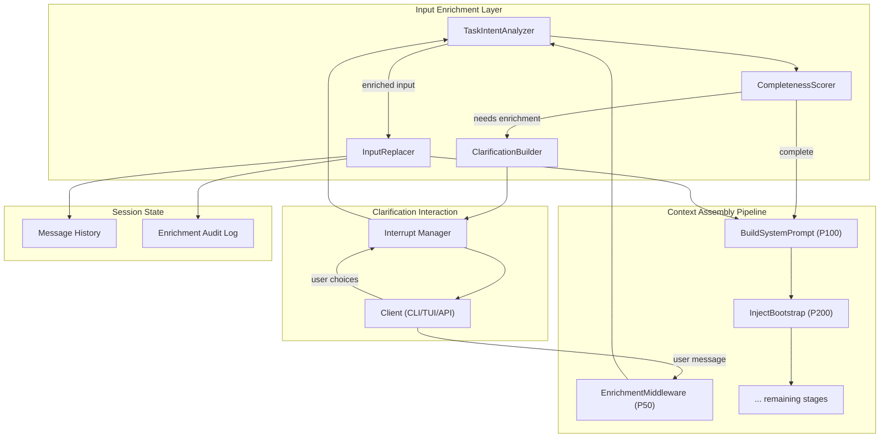
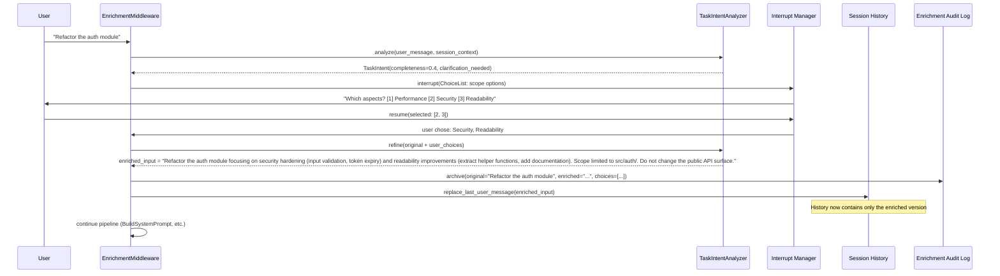
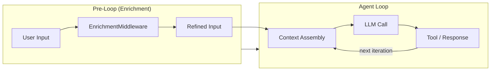
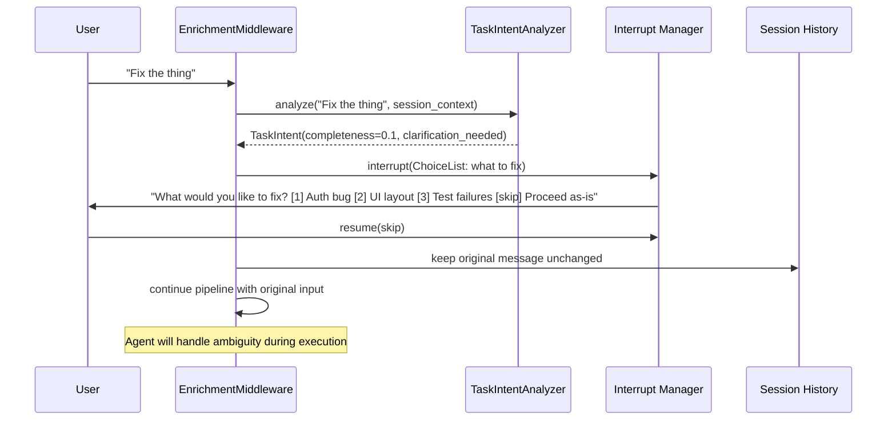
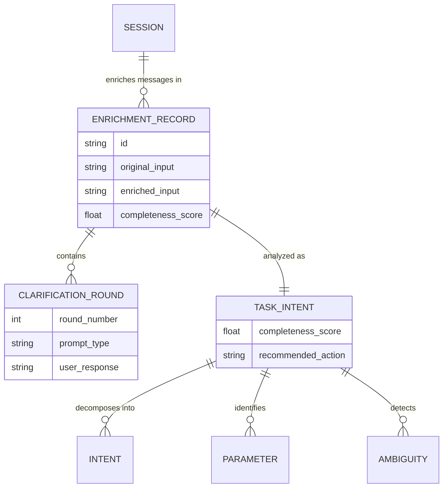
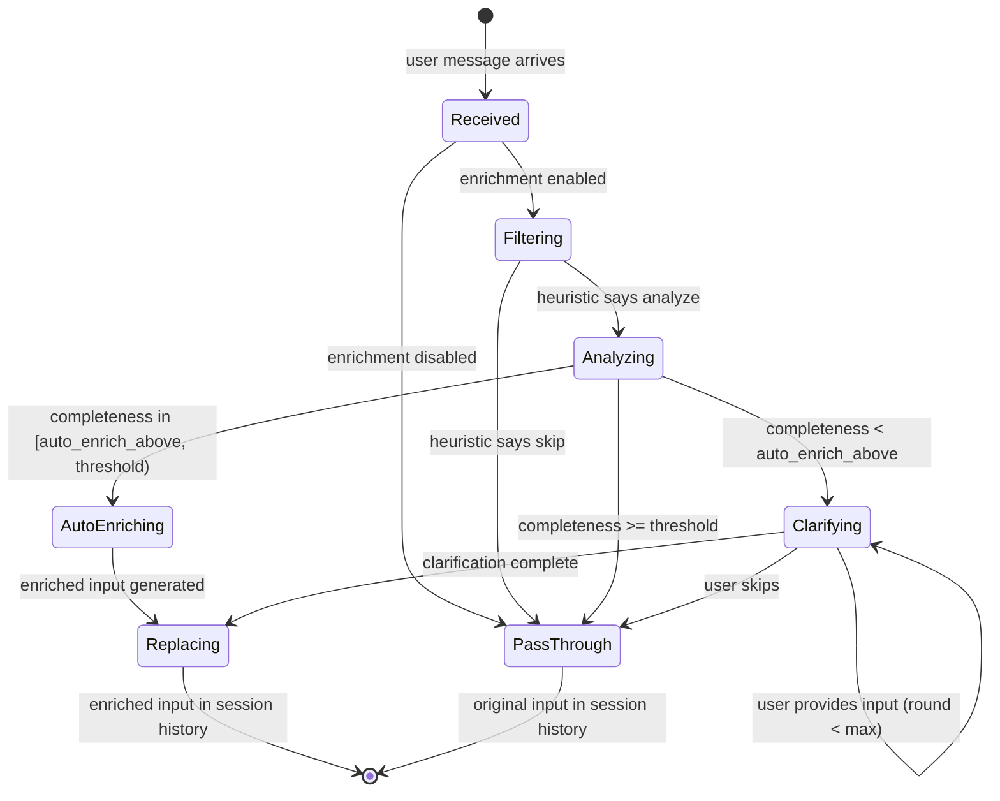

# User Input Enrichment Design

> Task intent analysis, interactive clarification, and input replacement for y-agent

**Version**: v0.1
**Created**: 2026-03-09
**Updated**: 2026-03-09
**Status**: Draft

---

## TL;DR

User Input Enrichment addresses the fundamental gap between what users say and what they mean. In real-world scenarios, user inputs are often ambiguous, incomplete, or under-specified -- lacking critical parameters, conflating multiple intents, or assuming context that the agent does not possess. This design introduces a **TaskIntentAnalyzer** sub-agent that intercepts each user message at the earliest stage of context assembly, evaluates whether enrichment is needed, and -- when necessary -- engages the user through structured interactive clarification (choice lists, confirmation prompts, parameter requests) using the Orchestrator's interrupt/resume protocol. The enriched output **replaces** the original user input in the session history rather than being appended alongside it, preserving the context window for downstream reasoning. An **EnrichmentPolicy** governs when enrichment triggers (always, heuristic, never), balancing thoroughness against friction. The replacement semantics are critical: because LLMs are stateless but the agent is stateful, concatenating raw input with enrichment wastes tokens and introduces noise; replacement ensures the LLM sees only the refined, unambiguous task specification.

---

## Background and Goals

### Background

AI agent interactions differ from traditional chatbot conversations in a critical way: the agent is expected to **act**, not merely respond. This raises the stakes for input quality -- a misunderstood task leads to wasted tool calls, incorrect file modifications, or irrelevant research, all of which consume tokens, time, and potentially cause side effects that require rollback.

Current y-agent design assumes user input arrives fully formed and unambiguous. The Context Assembly Pipeline (see [context-session-design.md](context-session-design.md)) processes the raw user message directly: it is injected into history, context is assembled around it, and the LLM generates a response or tool plan based on what may be an incomplete specification.

Real-world user input patterns reveal systematic deficiencies:

| Input Pattern | Example | Missing Information |
|---------------|---------|-------------------|
| **Under-specified scope** | "Refactor the auth module" | Which aspects? Performance, security, readability? What boundaries? |
| **Ambiguous reference** | "Fix the bug we discussed" | Which bug? Which session? What was the expected behavior? |
| **Implicit parameters** | "Deploy to staging" | Which version? Which services? Pre-deployment checks needed? |
| **Conflated intents** | "Research React frameworks and set up a new project" | Sequential or parallel? Research scope? Project template preferences? |
| **Missing constraints** | "Generate a report" | Format? Time range? Data sources? Audience? |

Without enrichment, the agent either (a) guesses, risking incorrect execution with expensive rollback, or (b) asks clarifying questions mid-execution, consuming additional agent loop iterations and tokens on questions that could have been resolved upfront. Both outcomes are suboptimal compared to front-loading clarification before the agent loop begins.

Three competitor patterns inform this design:

- **DeerFlow**: `ask_clarification` enables agents to request human input mid-execution. However, this happens during the agent loop, not before it -- meaning context has already been assembled and tokens spent.
- **OpenCode**: Task tool spawns sub-agents with mode-specific configuration. Input validation happens at the delegation boundary, not at the user input boundary.
- **Claude (Anthropic)**: The "agentic loop" pattern includes pre-processing to understand task intent, but this is tightly coupled to the model layer rather than the agent framework.

### Goals

| Goal | Measurable Criteria |
|------|-------------------|
| **Ambiguity detection** | Detect under-specified inputs with > 80% precision (measured via human evaluation) |
| **Interactive clarification** | Present structured choices (lists, confirmations, parameter forms) with < 1s delivery latency |
| **Token efficiency** | Enriched input replaces original; no net token increase from the enrichment process itself |
| **User friction control** | Configurable enrichment policy; `auto` mode triggers enrichment on < 30% of typical inputs |
| **Transparent enrichment** | User can review the enriched version before execution begins |
| **Session coherence** | Enrichment decisions are persisted and auditable within the session history |
| **Low false-trigger rate** | Clear, unambiguous inputs pass through without enrichment in < 50ms |

### Assumptions

1. The TaskIntentAnalyzer uses a dedicated LLM call (configurable model, default fast model like `gpt-4o-mini`) for cost efficiency.
2. Enrichment runs synchronously before the agent loop begins; it does not occur mid-execution.
3. Interactive clarification reuses the Orchestrator's existing interrupt/resume protocol -- no new async communication mechanism.
4. The enriched input is a single, self-contained task specification that can fully replace the original user message.
5. The user always has the option to skip enrichment and proceed with the original input.

---

## Scope

### In Scope

- TaskIntentAnalyzer sub-agent: intent decomposition, ambiguity detection, completeness scoring
- Interactive clarification protocol: choice lists, confirmation prompts, parameter requests via interrupt/resume
- Input replacement semantics: enriched input replaces original in session message history
- EnrichmentPolicy: configurable trigger modes (always, auto, never) per agent or session
- EnrichmentMiddleware: integration with Context Assembly Pipeline via y-hooks `ContextMiddleware` chain
- Enrichment audit trail: original input preserved in metadata for traceability
- Multi-turn enrichment: iterative clarification rounds (bounded)

### Out of Scope

- Natural language understanding model training or fine-tuning
- Proactive task suggestion (agent suggests tasks without user input)
- Input translation (language conversion)
- Voice/multimodal input preprocessing
- Enrichment for tool-generated inputs (only user-originated messages)

---

## High-Level Design

### Architecture Overview



**Diagram type rationale**: Flowchart chosen to show module boundaries and the enrichment layer's position before the existing Context Assembly Pipeline.

**Legend**:
- **Input Enrichment Layer**: New modules for analyzing and enriching user input.
- **Clarification Interaction**: Reuses Orchestrator's interrupt/resume for user dialogue.
- **Context Assembly Pipeline**: Existing pipeline; EnrichmentMiddleware inserts at priority 50 (before all existing stages).
- **Session State**: Enrichment replaces the message in history; original preserved in audit log.

### Core Components

**TaskIntentAnalyzer**: A lightweight sub-agent (not a full agent instance) that performs structured analysis of the user's input. It uses a dedicated LLM call with a focused prompt to produce a structured `TaskIntent` output containing: decomposed intents, identified parameters (present and missing), ambiguity flags, and a completeness score.

**CompletenessScorer**: Evaluates the TaskIntentAnalyzer's output against configurable thresholds. If the completeness score falls below the threshold (default 0.7), or if critical parameters are missing, enrichment is triggered. The scorer applies both the LLM-derived analysis and deterministic heuristics (message length, question mark presence, reference resolution).

**ClarificationBuilder**: Translates the TaskIntentAnalyzer's "missing information" output into structured interaction primitives (choice lists, confirmation prompts, free-text parameter requests). These are packaged as `WorkflowInterrupt::InputRequired` payloads for the Orchestrator's interrupt/resume protocol.

**InputReplacer**: After enrichment, constructs the refined input message and performs the replacement operation on the session history. The original message is archived in the enrichment audit log (session metadata, not message history) to preserve traceability without consuming context window tokens.

### Enrichment Policy

The EnrichmentPolicy controls when and how enrichment triggers. It is configurable per agent definition or per session.

| Mode | Behavior | Best For |
|------|----------|----------|
| **always** | Every user message is analyzed by TaskIntentAnalyzer | High-stakes workflows where precision outweighs speed |
| **auto** (default) | Quick heuristic pre-filter; only messages flagged as potentially ambiguous are analyzed by the LLM | General-purpose balance of quality and friction |
| **never** | Enrichment disabled; raw input passes through directly | Simple Q&A, experienced users who provide detailed inputs |
| **first_only** | Enrichment runs only on the first message in a session; subsequent messages inherit context | Sessions where the initial task definition matters most |

#### Auto Mode Heuristic Pre-Filter

Before invoking the TaskIntentAnalyzer LLM call, the auto mode applies fast deterministic checks to filter out clearly unambiguous inputs:

| Heuristic | Signal | Action |
|-----------|--------|--------|
| **Short command** | Message < 10 tokens and matches known command pattern | Skip enrichment |
| **Explicit structure** | Message contains numbered steps or structured parameters | Skip enrichment |
| **Follow-up turn** | Message is clearly a response to a previous agent question | Skip enrichment |
| **Continuation signal** | Message starts with "continue", "yes", "go ahead", etc. | Skip enrichment |
| **High ambiguity signals** | Vague verbs ("fix", "improve", "handle"), missing object references, wide scope words ("everything", "all") | Trigger analysis |
| **Task-like structure** | Imperative sentence with action verb but no specifics | Trigger analysis |

These heuristics prevent unnecessary LLM calls for routine follow-up messages while catching the input patterns most likely to benefit from enrichment.

### TaskIntentAnalyzer Output Schema

```rust
struct TaskIntent {
    original_input: String,
    intents: Vec<Intent>,
    parameters: Vec<Parameter>,
    ambiguities: Vec<Ambiguity>,
    completeness_score: f32,  // 0.0 to 1.0
    recommended_action: EnrichmentAction,
    enriched_input: Option<String>,
}

struct Intent {
    description: String,
    intent_type: IntentType,  // Action, Query, Continuation, Meta
    confidence: f32,
}

struct Parameter {
    name: String,
    status: ParameterStatus,  // Present, Missing, Ambiguous, Inferred
    value: Option<String>,
    inferred_from: Option<String>,
    options: Option<Vec<String>>,  // For choice-based clarification
}

enum Ambiguity {
    ScopeUnclear { description: String, options: Vec<String> },
    ReferenceUnresolved { reference: String, candidates: Vec<String> },
    IntentConflated { intents: Vec<String> },
    ConstraintMissing { parameter: String, suggested_defaults: Vec<String> },
}

enum EnrichmentAction {
    PassThrough,          // Input is complete; no enrichment needed
    AutoEnrich,           // Input can be enriched without user interaction
    ClarificationNeeded,  // User interaction required to resolve ambiguities
}
```

### Clarification Interaction Model

When enrichment requires user interaction, the ClarificationBuilder generates structured prompts using three interaction primitives:

| Primitive | Description | Example |
|-----------|-------------|---------|
| **ChoiceList** | User selects one or more options from a list | "Which aspect of auth to refactor? [1] Performance [2] Security [3] Readability [4] All" |
| **Confirmation** | User confirms or rejects an inferred parameter | "I understand you want to deploy service-A to staging. Correct? [Y/N]" |
| **ParameterRequest** | User provides a missing value (free-text or constrained) | "Which time range for the report? (e.g., 'last 7 days', '2026-01 to 2026-03')" |

These map to the Orchestrator's existing interrupt types:

| Clarification Primitive | Orchestrator Interrupt Type | Resume Payload |
|------------------------|---------------------------|---------------|
| ChoiceList | `WorkflowInterrupt::HumanApproval` | `ResumeCommand::Approve { selected: Value }` |
| Confirmation | `WorkflowInterrupt::Confirmation` | `ResumeCommand::Approve` or `ResumeCommand::Reject` |
| ParameterRequest | `WorkflowInterrupt::InputRequired` | `ResumeCommand::Provide { data: Value }` |

Multi-turn clarification is bounded: maximum 3 clarification rounds per enrichment (configurable). If after 3 rounds the input is still incomplete, the enrichment proceeds with available information and flags remaining gaps for the agent to resolve during execution.

### Input Replacement Semantics

The replacement mechanism is the design's most critical differentiator. Because the LLM is stateless, every token in the context window directly affects reasoning quality. Appending enrichment alongside the original creates three problems:

1. **Token waste**: The original ambiguous input and the enriched version occupy separate context space, saying roughly the same thing twice.
2. **Attention dilution**: The LLM must reconcile potentially contradictory signals between the vague original and the precise enrichment.
3. **Compaction inefficiency**: When context is compacted, the summarizer must process both versions, increasing compaction cost and risking information loss.

Replacement eliminates all three problems. The enriched input is a single, self-contained message that fully supersedes the original.

#### Replacement Protocol



**Diagram type rationale**: Sequence diagram chosen to show the temporal flow of enrichment, interaction, replacement, and audit.

**Legend**:
- **EnrichmentMiddleware** orchestrates the entire flow as the first pipeline stage.
- **Replacement** occurs in the session history: the original message is overwritten, not appended.
- **Audit Log** preserves the original for traceability, stored in session metadata (not consuming context tokens).

#### What Gets Replaced

| Component | Before Replacement | After Replacement |
|-----------|-------------------|------------------|
| Session message history | `[user]: "Refactor the auth module"` | `[user]: "Refactor the auth module focusing on security hardening..."` |
| Context assembly input | Raw ambiguous text | Precise, parameterized task specification |
| Enrichment audit log | (empty) | `{ original, enriched, choices, timestamp, analyzer_model }` |
| Token impact | Baseline | Net zero (same single user message, more informative) |

#### Skip and Override

The user always has escape hatches:

| Action | Trigger | Behavior |
|--------|---------|----------|
| **Skip enrichment** | User responds to clarification with "skip" or a designated command | Original input passes through unchanged |
| **Edit enrichment** | User reviews enriched version and modifies it | Modified version replaces original |
| **Disable enrichment** | Session-level `enrichment_policy = "never"` | All messages pass through without analysis |

### Integration with Context Assembly Pipeline

The EnrichmentMiddleware registers at **priority 50** in the y-hooks `ContextMiddleware` chain, executing before all existing stages:

| Stage | Priority | Purpose |
|-------|----------|---------|
| **`EnrichInput`** | **50** | **Analyze, clarify, and replace user input (this design)** |
| `BuildSystemPrompt` | 100 | Construct the system message |
| `InjectBootstrap` | 200 | Add workspace context |
| `InjectMemory` | 300 | Recall relevant memories |
| `InjectKnowledge` | 350 | Inject domain knowledge |
| `InjectSkills` | 400 | Add active skill descriptions |
| `InjectTools` | 500 | Inject tool index and active tool schemas |
| `LoadHistory` | 600 | Load and filter message history |
| `InjectContextStatus` | 700 | Append context window status |

This positioning ensures enrichment happens before any context is assembled, so all downstream stages work with the refined input. Memory recall (priority 300) benefits from clearer query terms. Skill injection (priority 400) benefits from unambiguous intent classification.

### Relationship Between Enrichment and Agent Loop

A critical design boundary: enrichment is **pre-loop**, not **in-loop**.



**Diagram type rationale**: Flowchart chosen to show the clear boundary between pre-loop enrichment and the iterative agent loop.

**Legend**:
- Enrichment runs once per new user message, before the agent loop starts.
- The agent loop operates on the enriched input as if it were the original.
- Mid-loop clarification (DeerFlow-style `ask_clarification`) remains separately possible via the agent's own judgment; this design does not replace it.

---

## Key Flows/Interactions

### Flow 1: Auto-Enrichment (No Interaction)

When the TaskIntentAnalyzer determines that the input can be enriched without user interaction (e.g., by inferring defaults from session context):

```mermaid
sequenceDiagram
    participant User
    participant EM as EnrichmentMiddleware
    participant TIA as TaskIntentAnalyzer
    participant Session as Session History

    User->>EM: "Continue with the tests"
    EM->>EM: heuristic check (continuation signal)
    EM->>EM: skip enrichment (pass-through)
    Note over EM: No LLM call; no delay

    User->>EM: "Deploy to staging"
    EM->>TIA: analyze("Deploy to staging", session_context)
    TIA-->>EM: TaskIntent(completeness=0.6, auto_enrich)
    Note over TIA: Inferred: current branch version, service-A (from workspace context)

    EM->>Session: replace("Deploy service-A (v2.3.1) from branch main to staging environment. Run pre-deployment health checks.")
    EM->>EM: continue pipeline
```

**Diagram type rationale**: Sequence diagram chosen to contrast pass-through and auto-enrichment flows.

**Legend**:
- Heuristic pre-filter avoids unnecessary LLM calls for simple continuations.
- Auto-enrichment infers parameters from session context without interrupting the user.

### Flow 2: Interactive Enrichment (Multi-Round)

```mermaid
sequenceDiagram
    participant User
    participant EM as EnrichmentMiddleware
    participant TIA as TaskIntentAnalyzer
    participant IM as Interrupt Manager
    participant Session as Session History
    participant Audit as Audit Log

    User->>EM: "Generate a report"
    EM->>TIA: analyze("Generate a report", session_context)
    TIA-->>EM: TaskIntent(completeness=0.2, clarification_needed)
    Note over TIA: Missing: format, time_range, data_source, audience

    EM->>IM: interrupt(ChoiceList: format)
    IM->>User: "Report format? [1] PDF [2] Markdown [3] HTML"
    User->>IM: resume(selected: 2)

    EM->>IM: interrupt(ParameterRequest: time_range)
    IM->>User: "Time range? (e.g., 'last 30 days', '2026-Q1')"
    User->>IM: resume(data: "last 30 days")

    EM->>TIA: refine(original + choices)
    TIA-->>EM: enriched_input + completeness=0.85
    Note over TIA: Remaining: data_source inferred from workspace; audience defaulted to "internal"

    EM->>Audit: archive(original, enriched, interaction_log)
    EM->>Session: replace_last_user_message(enriched_input)
    EM->>EM: continue pipeline
```

**Diagram type rationale**: Sequence diagram chosen to illustrate multi-round interactive clarification before input replacement.

**Legend**:
- Multiple clarification rounds are supported (default max: 3).
- The TaskIntentAnalyzer refines its output with each round of user input.
- Final enriched input replaces the original in session history.

### Flow 3: User Skips Enrichment



**Diagram type rationale**: Sequence diagram chosen to show the skip escape hatch.

**Legend**:
- User can always skip enrichment by selecting the "skip" option.
- The original input passes through unchanged; the agent resolves ambiguity during execution.

---

## Data and State Model

### Enrichment Record

| Field | Type | Description |
|-------|------|-------------|
| `id` | EnrichmentId | Unique identifier |
| `session_id` | SessionId | Session where enrichment occurred |
| `message_index` | usize | Position of the enriched message in session history |
| `original_input` | String | Original user message (verbatim) |
| `enriched_input` | String | Final enriched message that replaced the original |
| `task_intent` | TaskIntent | Full analyzer output (intents, parameters, ambiguities) |
| `interaction_log` | Vec\<ClarificationRound\> | Record of each clarification round (prompt, response) |
| `policy_mode` | EnrichmentPolicyMode | Policy that triggered this enrichment |
| `analyzer_model` | String | LLM model used for analysis |
| `duration_ms` | u64 | Total enrichment time including user interaction |
| `created_at` | Timestamp | When enrichment was performed |

### Entity Relationships



**Diagram type rationale**: ER diagram chosen to show structural relationships between enrichment entities.

**Legend**:
- **EnrichmentRecord** is the central audit entity, linking original and enriched inputs.
- **ClarificationRound** records each user interaction during enrichment.
- **TaskIntent** contains the structured analysis output.

### Enrichment Policy Configuration

```toml
[enrichment]
enabled = true
policy = "auto"  # always | auto | never | first_only

[enrichment.analyzer]
model = "gpt-4o-mini"
temperature = 0.2
max_analysis_tokens = 1000

[enrichment.interaction]
max_clarification_rounds = 3
clarification_timeout = "2m"
show_enriched_preview = true  # Show enriched version to user before proceeding
allow_user_edit = true        # Allow user to modify enriched version

[enrichment.auto_filter]
min_message_tokens = 10         # Skip enrichment for very short messages
skip_continuations = true       # Skip "yes", "continue", "go ahead"
skip_structured_input = true    # Skip numbered lists, JSON, etc.
ambiguity_signal_threshold = 2  # Minimum ambiguity signals to trigger analysis

[enrichment.completeness]
threshold = 0.7       # Below this score, enrichment is triggered
auto_enrich_above = 0.5  # Above this, auto-enrich without interaction; below, ask
```

### Enrichment State Lifecycle



**Diagram type rationale**: State diagram chosen to show the lifecycle of a user message through the enrichment process.

**Legend**:
- **Filtering**: Fast heuristic check (no LLM call).
- **Analyzing**: LLM-based intent analysis.
- **Clarifying**: Interactive user dialogue (may loop up to max rounds).
- **Replacing**: Enriched input replaces original in session history.
- **PassThrough**: Original input proceeds unchanged.

---

## Failure Handling and Edge Cases

| Scenario | Handling |
|----------|---------|
| TaskIntentAnalyzer LLM call fails | Log error; pass through original input unchanged. Enrichment is best-effort, never blocking. |
| User does not respond to clarification within timeout | Cancel enrichment; proceed with original input. Log timeout for observability. |
| Enriched input is longer than original (exceeds token budget) | Truncation not applied; the enriched input is still a single message. Context Window Guard handles overall budget downstream. |
| TaskIntentAnalyzer produces invalid output (malformed JSON) | Retry once with explicit schema instructions; on second failure, pass through original. |
| User provides contradictory clarification answers | TaskIntentAnalyzer re-analyzes with contradiction flag; presents reconciliation choices to user. |
| Enrichment triggered on a message that is a tool result response | Heuristic pre-filter catches this: enrichment only applies to `role=user` messages, never to system or tool messages. |
| Multiple rapid user messages before enrichment completes | Message Scheduler serializes per-session (see [message-scheduling-design.md](message-scheduling-design.md)). Second message queued until first completes enrichment. |
| Enrichment produces an input that is semantically different from user intent | Preview mode (`show_enriched_preview = true`) lets user review and edit before proceeding. This is the primary safety mechanism against misinterpretation. |
| Session context is empty (first message, no history) | TaskIntentAnalyzer relies only on workspace bootstrap context (README, project structure) for inference. Lower completeness threshold expectations for first messages. |
| User explicitly provides a detailed, structured task specification | Auto-mode heuristic recognizes structured input (numbered steps, parameters) and skips enrichment. Zero overhead. |

---

## Security and Permissions

| Concern | Approach |
|---------|----------|
| **Privacy of clarification data** | Clarification prompts and responses are stored in the session's enrichment audit log, scoped to (user_id, session_id). No cross-session leakage. |
| **Enrichment prompt injection** | The TaskIntentAnalyzer prompt is system-controlled; user input is passed as a structured parameter, not interpolated into the analysis prompt template. |
| **Audit trail integrity** | Original user input is preserved in the enrichment audit log even after replacement. The replacement is always traceable. |
| **Enrichment bypass** | Users can always skip or disable enrichment. The system never prevents the user from submitting raw input. |
| **Model trust** | The TaskIntentAnalyzer uses a configurable model; sensitive deployments can use a local/private model for analysis to avoid sending user intent to external APIs. |

---

## Performance and Scalability

### Performance Targets

| Metric | Target |
|--------|--------|
| Heuristic pre-filter evaluation | < 1ms |
| TaskIntentAnalyzer LLM call | < 2s (fast model, focused prompt) |
| Clarification round-trip (system side) | < 100ms (excluding user think time) |
| Input replacement in session history | < 5ms |
| Total enrichment overhead (no interaction) | < 2.5s |
| Total enrichment overhead (with interaction) | Dominated by user response time |

### Optimization Strategies

- **Heuristic pre-filter**: Eliminates 70%+ of messages without an LLM call. The filter uses deterministic rules that execute in microseconds.
- **Fast model selection**: TaskIntentAnalyzer defaults to a cheap, fast model (e.g., `gpt-4o-mini`) because intent analysis requires comprehension, not generation creativity.
- **Structured output**: TaskIntentAnalyzer uses JSON mode / structured output to avoid parsing overhead and retry cycles.
- **Cached analysis prompts**: The analysis prompt template is compiled once; only the user message and session summary are injected per call.
- **Parallel clarification**: When multiple parameters need clarification, present them in a single interaction round rather than sequential rounds (batch clarification).

---

## Observability

### Metrics

| Metric | Type | Description |
|--------|------|-------------|
| `enrichment.triggered` | Counter | Number of enrichment analyses triggered (by policy mode) |
| `enrichment.skipped` | Counter | Number of messages that passed heuristic filter without analysis |
| `enrichment.completed` | Counter | Number of successful enrichments (by action: pass_through, auto_enrich, clarification) |
| `enrichment.failed` | Counter | Number of enrichment failures (by reason: llm_error, timeout, invalid_output) |
| `enrichment.clarification_rounds` | Histogram | Number of clarification rounds per enrichment |
| `enrichment.user_skipped` | Counter | Number of times user chose to skip enrichment |
| `enrichment.duration_ms` | Histogram | Total enrichment duration (excluding user think time) |
| `enrichment.completeness_before` | Histogram | Completeness score of original input |
| `enrichment.completeness_after` | Histogram | Completeness score after enrichment |
| `enrichment.token_delta` | Histogram | Token count difference between original and enriched input |

### Events (via y-hooks EventBus)

| Event | Payload | Trigger |
|-------|---------|---------|
| `EnrichmentTriggered` | session_id, original_input_hash, policy_mode | Enrichment analysis begins |
| `EnrichmentCompleted` | session_id, action, completeness_before, completeness_after, rounds | Enrichment finishes (any outcome) |
| `EnrichmentSkipped` | session_id, skip_reason (heuristic/user/policy) | Message passes through without enrichment |
| `ClarificationRequested` | session_id, round, primitive_type, options_count | Clarification presented to user |
| `ClarificationReceived` | session_id, round, response_type | User responds to clarification |

---

## Rollout and Rollback

### Phased Implementation

| Phase | Scope | Duration |
|-------|-------|----------|
| **Phase 1** | TaskIntentAnalyzer with structured output, heuristic pre-filter, `auto` and `never` policy modes, pass-through and auto-enrich actions (no interactive clarification) | 2-3 weeks |
| **Phase 2** | Interactive clarification via interrupt/resume (ChoiceList, Confirmation, ParameterRequest), input replacement protocol, enrichment audit log | 2-3 weeks |
| **Phase 3** | Preview mode (user reviews enriched input), user edit capability, multi-turn clarification, batch clarification optimization | 1-2 weeks |
| **Phase 4** | `always` and `first_only` policy modes, enrichment analytics dashboard, completeness score tuning based on production data | 1-2 weeks |

### Migration Strategy

- Enrichment is opt-in via `enrichment.enabled = true` (default: `false` during rollout, flipped to `true` after Phase 2 validation).
- Sessions without enrichment history are unaffected; enrichment only applies to new messages.
- The EnrichmentMiddleware is registered at priority 50 in the ContextMiddleware chain. If disabled, it calls `next()` immediately with no overhead.

### Rollback Plan

| Component | Rollback |
|-----------|----------|
| EnrichmentMiddleware | Feature flag `enrichment_enabled`; disabled = middleware passes through without analysis |
| TaskIntentAnalyzer | Depends on EnrichmentMiddleware; disabling enrichment disables the analyzer |
| Interactive clarification | Feature flag `enrichment_interactive`; disabled = only auto-enrich and pass-through, no interrupts |
| Input replacement | Feature flag `enrichment_replace`; disabled = enriched input appended as system context note instead of replacing |

---

## Alternatives and Trade-offs

### Enrichment Timing: Pre-Loop vs In-Loop

| | Pre-Loop (chosen) | In-Loop (DeerFlow-style) |
|-|-------------------|-------------------------|
| **Token efficiency** | High: enrichment happens before context assembly, no context wasted on vague input | Low: full context already assembled when clarification occurs |
| **User experience** | Single clarification dialogue before work begins | Interruptions during execution |
| **Scope** | Can only use session context + heuristics for analysis | Can use full context including tool results |
| **Complexity** | Moderate (new middleware stage) | Low (agent decides when to ask) |
| **Precision** | Lower (no execution context yet) | Higher (more context available) |

**Decision**: Pre-loop enrichment as the primary mechanism. The token savings and better UX (upfront clarification before any work begins) justify the lower precision. In-loop clarification via the agent's own judgment remains separately possible for situations where execution reveals new ambiguities.

### Replacement vs Augmentation

| | Replacement (chosen) | Augmentation (append) |
|-|---------------------|-----------------------|
| **Token efficiency** | Net zero (1 message replaces 1 message) | Negative (2 messages: original + enrichment) |
| **Attention quality** | High (LLM sees only the clear version) | Lower (LLM must reconcile two versions) |
| **Traceability** | Requires separate audit log | Natural (both versions in history) |
| **Reversibility** | Audit log enables reconstruction | Trivially reversible |
| **Compaction behavior** | Clean compaction of single message | Compactor must handle related-but-different messages |

**Decision**: Replacement with audit log. The token and attention benefits outweigh the need for a separate audit mechanism. The audit log preserves full traceability without consuming context window tokens.

### Enrichment Agent: Full Agent Instance vs Lightweight Sub-Agent

| | Full Agent Instance | Lightweight Sub-Agent (chosen) |
|-|--------------------|-------------------------------|
| **Overhead** | Full agent loop, session branch, tool set | Single focused LLM call with structured output |
| **Capability** | Can use tools for research | Analysis only; no tool access |
| **Latency** | 5-30s (multiple LLM iterations) | 1-2s (single LLM call) |
| **Cost** | Multiple LLM calls | Single cheap LLM call |
| **Extensibility** | Can evolve into sophisticated analysis | Limited to prompt engineering |

**Decision**: Lightweight sub-agent (single LLM call). Enrichment must be fast and cheap to avoid becoming a bottleneck. If a user's input requires extensive research to understand, the agent loop itself is the appropriate place for that work -- not the pre-loop enrichment stage.

### Clarification Interface: Structured Primitives vs Free-Form Dialogue

| | Structured Primitives (chosen) | Free-Form Dialogue |
|-|-------------------------------|-------------------|
| **Parse reliability** | High (constrained responses map directly to parameters) | Low (LLM must parse natural language responses) |
| **User effort** | Low (select from options, confirm/deny) | Higher (compose response) |
| **Flexibility** | Limited to predefined options | Unlimited |
| **Implementation** | Reuses WorkflowInterrupt types directly | Requires new conversational sub-agent |

**Decision**: Structured primitives (ChoiceList, Confirmation, ParameterRequest). These are more reliable, lower friction, and map directly to the existing Orchestrator interrupt types. Free-form clarification can be added later as an enhancement.

---

## Open Questions

| # | Question | Owner | Due Date | Status |
|---|----------|-------|----------|--------|
| 1 | Should the enrichment preview be opt-out (shown by default) or opt-in? User research needed. | Context team | 2026-04-03 | Open |
| 2 | How should enrichment interact with Canonical Sessions? Should enrichment results sync across channels? | Context team | 2026-04-10 | Open |
| 3 | Should the TaskIntentAnalyzer have access to workspace context (file structure, README) for better inference, or should it operate only on the user message and session history? | Context team | 2026-03-27 | Open |
| 4 | What is the right completeness threshold (default 0.7)? Needs calibration against real user inputs. | Context team | 2026-04-15 | Open |
| 5 | Should enrichment records count toward session message limits for compaction purposes? | Context team | 2026-03-27 | Open |
| 6 | Should the heuristic pre-filter be configurable per agent, or global? | Context team | 2026-04-03 | Open |

