# Knowledge Base Design

> External knowledge ingestion, domain-classified indexing, and retrieval for y-agent

**Version**: v0.3
**Created**: 2026-03-06
**Updated**: 2026-03-08
**Status**: Draft
**Depends on**: [Memory Architecture Design](./memory-architecture.md), [Tools Design](./tools-design.md), [Context & Session Design](./context-session-design.md), [Hook/Middleware/Plugin Design](./hooks-plugin-design.md), [Skills & Knowledge Design](./skills-knowledge-design.md)

---

## TL;DR

The Knowledge Base is a structured, searchable store for **externally sourced reference knowledge** -- documents, articles, checklists, API references, and curated content ingested from PDFs, web pages, APIs, and other external sources. Unlike Long-Term Memory (which extracts agent experience from conversations) and Skills (which provide LLM reasoning instructions), the Knowledge Base holds factual reference content that agents consult during planning and execution. Knowledge is ingested through **agent-driven ingestion pipelines** -- leveraging existing agent orchestration and tool infrastructure -- that fetch, parse, chunk, classify, embed, and store content. Each knowledge entry is stored at **three resolution levels** -- **L0** (abstract, ~100 tokens), **L1** (overview, ~500 tokens), and **L2** (full chunk content) -- enabling **progressive loading** that minimizes token waste: retrieval returns L0 summaries first, and agents load L1/L2 on demand. Retrieval operates through both explicit tools (`knowledge_search`, `knowledge_lookup`) and automatic context injection via a `ContextMiddleware` provider that triggers on domain-relevant queries. The system reuses the Memory Service infrastructure (vector store, embedding pipeline, gateway) but maintains a separate collection with its own domain-classification index, source provenance tracking, and freshness management.

---

## Background and Goals

### Background

Agents performing complex tasks frequently need access to reference knowledge that does not exist in their training data or conversation history. Two concrete scenarios motivate this design:

1. **Checklist-driven planning**: An agent tasked with automated testing needs to retrieve relevant checklists from the knowledge base before generating a test plan. The checklists were previously ingested from internal documents (PDFs, wikis).

2. **Curated article libraries**: A user maintains a GitHub Awesome repository with links to high-quality articles across multiple domains. An ingestion agent collects, cleans, classifies, and stores these articles. Later, when any agent encounters a task in a relevant domain, the knowledge base surfaces applicable reference material.

These scenarios share a common pattern: **external knowledge acquired ahead of time, stored persistently, and retrieved on demand or by domain trigger during agent execution.**

Existing y-agent subsystems do not cover this pattern:

| Subsystem | What It Stores | Source | Gap |
|-----------|---------------|--------|-----|
| **Long-Term Memory** | Personal/Task/Tool/Experience observations | Extracted from agent conversations | Does not ingest external documents |
| **Skills** | LLM reasoning instructions (how to think) | Ingested from external skill files | Does not store factual reference content |
| **Experience Store** | Session-scoped indexed context archives | Agent-generated within a session | Session-scoped; not persistent; not for reference material |
| **Working Memory** | Pipeline-scoped intermediate results | Micro-Agent Pipeline steps | Ephemeral; pipeline-scoped only |

The Knowledge Base fills this gap as a persistent, workspace-scoped store for externally sourced factual content.

### Goals

| Goal | Measurable Criteria |
|------|-------------------|
| **Agent-driven ingestion** | Ingestion orchestrated by standard y-agent agents using existing tool infrastructure; no separate ingestion daemon |
| **Multi-source support** | Support at least PDF, web page, and plain text sources at launch; extensible to APIs and custom connectors |
| **Domain classification** | Every knowledge entry tagged with at least one domain; classification accuracy > 80% on a test set |
| **Retrieval quality** | Hybrid retrieval (semantic + keyword + domain filter) achieves > 0.7 MRR on a benchmark query set |
| **Automatic context injection** | Relevant knowledge injected into agent context when domain keywords match, without explicit agent action |
| **Token efficiency** | Retrieved knowledge chunks respect the Context Window Guard budget; never exceed allocated knowledge token budget |
| **Source provenance** | Every knowledge entry traceable to its original source (URL, file path, API endpoint) with ingestion timestamp |

### Assumptions

1. The embedding model used by the Memory Service is also suitable for knowledge chunk embeddings.
2. PDF parsing uses an external library (e.g., `pdf-extract`, `lopdf`) or delegates to a tool; OCR is out of scope for v0.
3. Ingestion agents run as standard y-agent tasks, subject to the same orchestration, guardrails, and observability as any other agent task.
4. Knowledge volume per workspace stays under 500K chunks for v0 (single-node vector store sufficient).
5. Domain classification can use a cost-efficient LLM (e.g., `gpt-4o-mini`) or rule-based heuristics for known domains.

---

## Scope

### In Scope

- Knowledge Base architecture and its relationship to existing Memory Service infrastructure
- Agent-driven ingestion pipeline: source fetching, parsing, chunking, cleaning, domain classification, embedding, storage
- Source connectors: PDF, web page (HTML), plain text, Markdown; extensible connector interface
- Knowledge entry data model: chunks with domain tags, source provenance, quality scores, freshness metadata
- Domain taxonomy: hierarchical domain classification with user-defined and auto-detected domains
- Retrieval engine: semantic search, keyword matching, domain filtering, source filtering, freshness weighting
- Built-in tools: `knowledge_search` (semantic + filtered retrieval), `knowledge_lookup` (exact entry retrieval)
- Context integration: `InjectKnowledge` ContextMiddleware for automatic domain-triggered injection
- Knowledge maintenance: update, refresh, expiry, deduplication, quality scoring
- Integration with Skills (knowledge_bases references in skill manifests)

### Out of Scope

- Specific API connector implementations (deferred; the connector interface is in scope)
- Knowledge graph construction (Phase 2; current design uses flat chunks with domain tags)
- Real-time web crawling or continuous monitoring (ingestion is agent-initiated, not continuous)
- Multi-modal knowledge (images, audio, video); text extraction from PDFs is in scope
- Distributed knowledge sharing across workspaces
- Knowledge base editor UI
- Automated ingestion scheduling (can be composed with y-scheduler externally, but the KB itself does not own scheduling)

---

## High-Level Design

### Architecture Overview

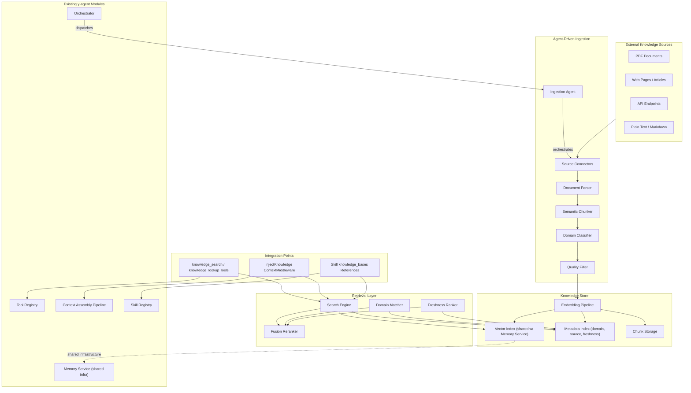

**Diagram type rationale**: Flowchart chosen to show module boundaries across ingestion, storage, retrieval, and integration layers, and their relationships to existing y-agent modules.

**Legend**:
- **Sources**: External content origins.
- **Ingestion**: Agent-driven pipeline that transforms raw content into indexed knowledge chunks.
- **KBStore**: Persistent storage with vector, metadata, and chunk indexes; vector infrastructure shared with Memory Service.
- **Retrieval**: Multi-strategy search engine combining semantic, keyword, domain, and freshness signals.
- **Integration**: Three access paths: explicit tools, automatic context injection, and skill references.
- Dashed arrow indicates infrastructure sharing, not data sharing.

### Design Principles

| Principle | Rationale |
|-----------|-----------|
| **Agent-driven ingestion** | Ingestion agents reuse existing orchestration, tools, guardrails, and observability -- no parallel ingestion daemon needed. This also enables LLM-assisted parsing and classification. |
| **Separate store, shared infrastructure** | Knowledge Base maintains its own collection (separate from LTM) in the same vector store. Avoids polluting LTM recall with reference documents while reusing embedding and search infrastructure. |
| **Domain-first organization** | Every chunk is tagged with one or more domains. This enables both targeted retrieval (domain filter) and automatic injection (domain trigger). |
| **Source provenance as first class** | Every chunk links back to its original source with URL/path, ingestion timestamp, and content hash. Enables freshness checks, re-ingestion, and deduplication. |
| **Chunk, not document** | Large documents are split into semantically coherent chunks (target: 500-1500 tokens each). Retrieval returns chunks, not entire documents, to respect token budgets. |
| **Reference, not embed** | Following the Skills design principle: knowledge chunks are referenced by ID, not duplicated. Skills reference knowledge bases by name; agents retrieve specific chunks on demand. |

### Boundary Definitions (Decoupling)

| Boundary | Knowledge Base | Other Subsystem | Integration Point |
|----------|---------------|----------------|------------------|
| **vs Long-Term Memory** | Externally sourced reference content (documents, articles, checklists) | Agent experience extracted from conversations (Personal/Task/Tool/Experience) | Shared vector store infrastructure; separate collections; both accessible via Context Assembly Pipeline at different priorities |
| **vs Skills** | Factual content (what to know) | LLM reasoning instructions (how to think) | Skills reference knowledge bases via `[skill.references] knowledge_bases` in manifests; KB provides content, Skills provide reasoning |
| **vs Experience Store** | Workspace-scoped, persistent | Session-scoped, ephemeral | No direct interaction; different lifecycles and access patterns |
| **vs Working Memory** | Persistent reference store | Pipeline-scoped blackboard | No direct interaction; Knowledge can be loaded into Working Memory by a pipeline step |

---

## Key Flows/Interactions

### Ingestion Flow

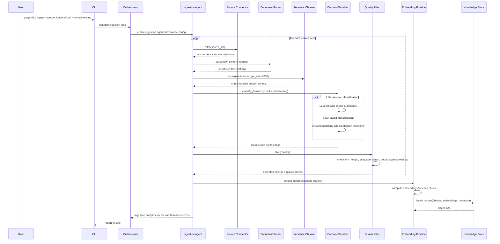

**Diagram type rationale**: Sequence diagram chosen to show the temporal ordering of the ingestion pipeline stages and the agent-driven orchestration pattern.

**Legend**:
- The Ingestion Agent is a standard y-agent agent dispatched by the Orchestrator.
- Source Connectors are pluggable adapters (PDF, web, API, text).
- Domain classification supports both LLM-assisted and rule-based modes.
- Quality Filter deduplicates against existing chunks to prevent redundancy.

### Retrieval Flow (Explicit Tool)

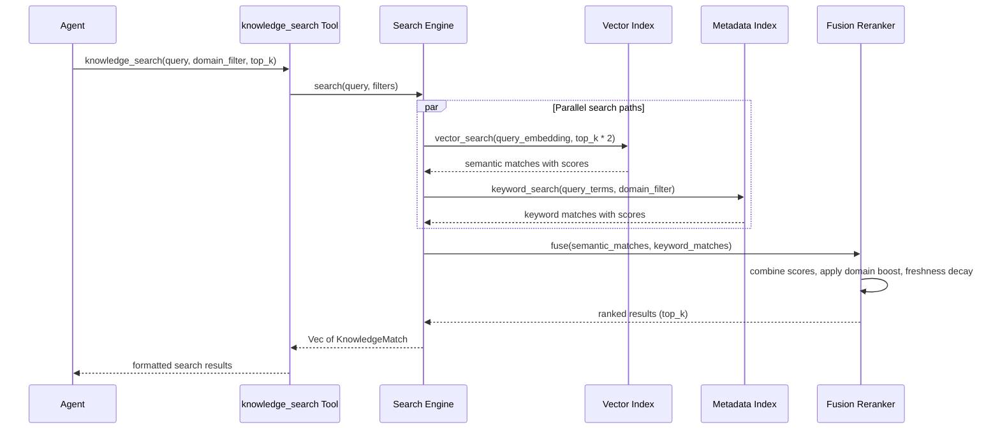

**Diagram type rationale**: Sequence diagram chosen to show the parallel search paths and fusion reranking during retrieval.

**Legend**:
- Vector search and keyword search run in parallel for efficiency.
- Fusion Reranker combines scores with configurable weights for semantic, keyword, domain relevance, and freshness.

### Automatic Context Injection Flow

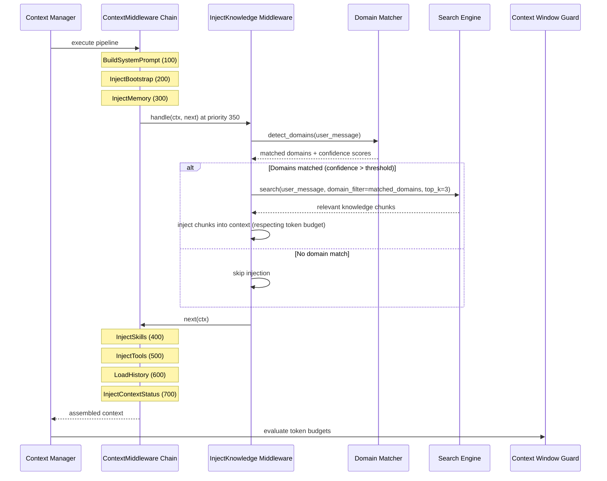

**Diagram type rationale**: Sequence diagram chosen to show how the InjectKnowledge middleware integrates into the existing Context Assembly Pipeline at priority 350.

**Legend**:
- InjectKnowledge runs between InjectMemory (300) and InjectSkills (400), ensuring knowledge is available before skill selection.
- Domain Matcher checks the user's message against the knowledge base domain taxonomy.
- Injection respects the Context Window Guard's token budget for the knowledge category.

### Skill-Referenced Knowledge Flow

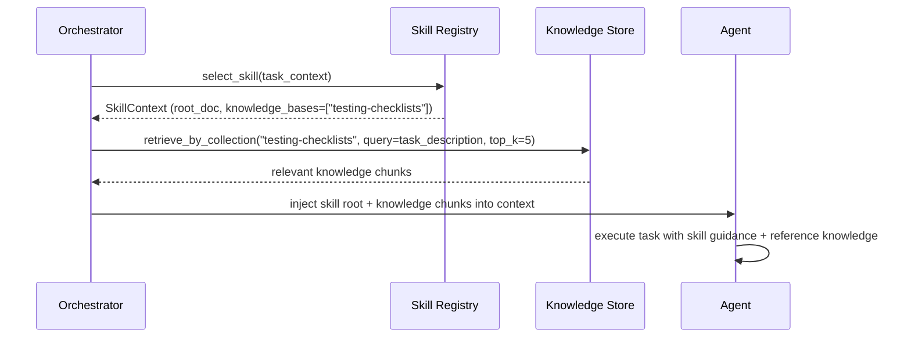

**Diagram type rationale**: Sequence diagram chosen to show how skills reference knowledge bases and how the orchestrator resolves those references at runtime.

**Legend**:
- Skills declare knowledge base dependencies in their manifest.
- The Orchestrator resolves references at skill selection time, retrieving relevant chunks from the named knowledge collection.

---

## Data and State Model

### Knowledge Entry

| Field | Type | Description |
|-------|------|-------------|
| `id` | String | Globally unique chunk identifier |
| `workspace_id` | String | Owning workspace |
| `collection` | String | Logical grouping (e.g., "testing-checklists", "rust-best-practices") |
| `content` | String | Full chunk text content (**L2** resolution) |
| `overview` | String | Overview paragraph (~500 tokens) covering key points of the chunk (**L1** resolution); LLM-generated at ingestion |
| `summary` | String | One-sentence abstract (~100 tokens; used as embedding input, analogous to LTM's `when_to_use`) (**L0** resolution) |
| `domains` | Vec<String> | Domain tags (hierarchical, e.g., "testing/automation", "rust/async") |
| `source` | SourceRef | Provenance reference (see below) |
| `quality_score` | f32 (0.0--1.0) | Ingestion-time quality assessment |
| `token_count` | u32 | Chunk token count |
| `chunk_index` | u32 | Position within the source document |
| `total_chunks` | u32 | Total chunks from the same source document |
| `created_at` | i64 | Ingestion timestamp |
| `refreshed_at` | i64 | Last re-ingestion timestamp |
| `access_count` | u32 | Retrieval hit count |
| `metadata` | Map<String, String> | Extensible key-value metadata (author, language, version, etc.) |

### Source Reference

| Field | Type | Description |
|-------|------|-------------|
| `source_type` | Enum (PDF, Web, API, Text, Markdown) | Source format |
| `uri` | String | Original location (file path, URL, API endpoint) |
| `content_hash` | String | SHA-256 of raw source content (for change detection) |
| `title` | Option<String> | Document title if extractable |
| `author` | Option<String> | Document author if extractable |
| `fetched_at` | i64 | When the source was fetched |
| `connector_id` | String | Which source connector was used |

### Knowledge Collection

| Field | Type | Description |
|-------|------|-------------|
| `name` | String | Collection identifier (unique within workspace) |
| `description` | String | Human-readable description |
| `domains` | Vec<String> | Primary domain tags for this collection |
| `entry_count` | u32 | Number of chunks in this collection |
| `source_count` | u32 | Number of distinct sources |
| `created_at` | i64 | Collection creation timestamp |
| `updated_at` | i64 | Last modification timestamp |
| `config` | CollectionConfig | Chunk size, overlap, embedding model, refresh policy |

### Domain Taxonomy

Domains are organized in a hierarchical tree:

```
testing/
  testing/automation
  testing/checklist
  testing/performance
programming/
  programming/rust
  programming/python
  programming/async
architecture/
  architecture/microservices
  architecture/event-driven
devops/
  devops/ci-cd
  devops/containers
```

Users can extend the taxonomy by adding custom domains. The Domain Classifier uses the taxonomy for consistent tagging. Queries against a parent domain (e.g., "testing") match all children.

### Entity Relationships

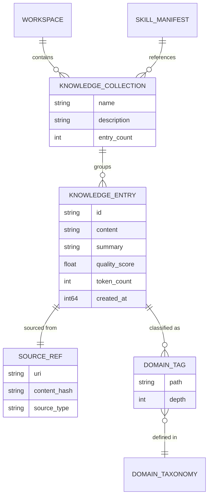

**Diagram type rationale**: ER diagram chosen to show structural relationships between knowledge entities, collections, sources, domains, and the skill reference linkage.

**Legend**:
- Knowledge Entries belong to Collections and are tagged with Domains.
- Source References track provenance for every entry.
- Skill Manifests reference Knowledge Collections by name (see [skills-knowledge-design.md](skills-knowledge-design.md)).

### Knowledge Entry States

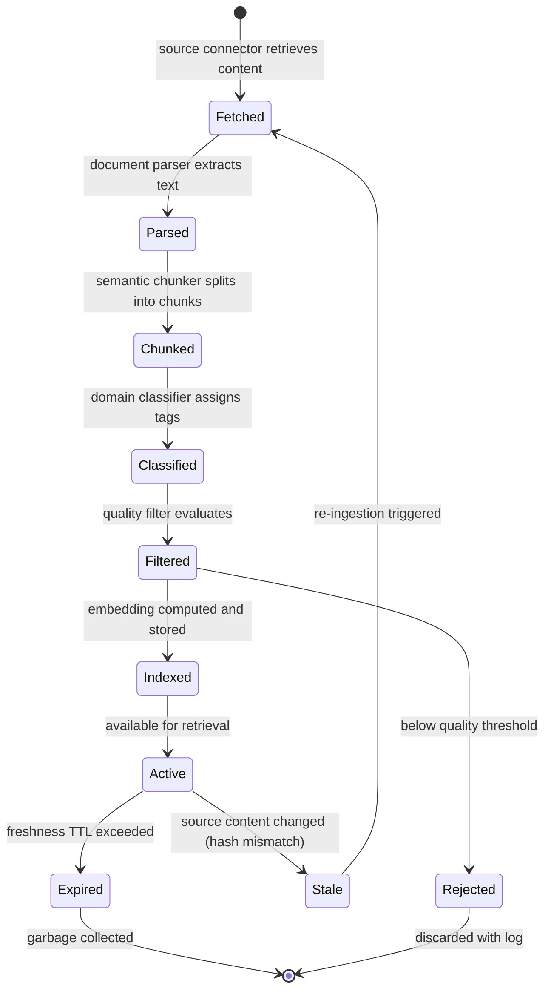

**Diagram type rationale**: State diagram chosen to show the lifecycle of knowledge content from source fetching through indexing to eventual expiry.

**Legend**:
- **Fetched through Indexed**: Ingestion pipeline stages.
- **Active**: Chunk is searchable and retrievable.
- **Stale**: Source has changed; re-ingestion is needed.
- **Expired**: Content exceeded its configured TTL and is eligible for removal.

---

## Ingestion Pipeline Detail

### Source Connectors

Source connectors implement a common `SourceConnector` trait:

| Connector | Input | Output | Parsing Strategy |
|-----------|-------|--------|-----------------|
| **PDF** | File path or URL to PDF | Extracted text with page boundaries | `pdf-extract` / `lopdf` for text; LLM-assisted extraction for complex layouts |
| **Web** | URL | Cleaned article text | HTML parsing with readability heuristics (remove nav, ads, footers); Markdown conversion |
| **API** | Endpoint + auth config | Structured response text | JSON/XML parsing; schema-aware field extraction |
| **Text/Markdown** | File path or raw text | Structured sections | Heading-based sectioning; Markdown AST parsing |

New connectors are added by implementing the `SourceConnector` trait and registering with the connector registry. Connectors can also be implemented as MCP tools for external process isolation.

### Semantic Chunker

The chunker respects document structure rather than splitting at arbitrary token boundaries:

| Strategy | Trigger | Behavior |
|----------|---------|----------|
| **Heading-based** | Document has clear heading structure | Split at heading boundaries; each chunk inherits its heading hierarchy as context |
| **Paragraph-based** | No clear headings | Group consecutive paragraphs up to target chunk size |
| **Sliding window** | Fallback for unstructured text | Fixed-size window with configurable overlap (default 10%) |
| **Semantic** | LLM-assisted (optional, for high-value content) | LLM identifies natural topic boundaries; highest quality but highest cost |

Target chunk size: 500-1500 tokens (configurable per collection). Chunks below 50 tokens are merged with adjacent chunks. Each chunk retains a `section_context` field describing its position in the source document (e.g., "Chapter 3 > Section 3.2 > Paragraph 4").

### Multi-Resolution Content (L0/L1/L2 Progressive Loading)

Each knowledge entry is stored at three resolution levels to enable **token-efficient progressive loading**. Retrieval and context injection start at L0 (cheapest); agents or the system load L1/L2 on demand only when needed.

| Level | Name | Token Budget | Content | Generation | Use Case |
|-------|------|-------------|---------|------------|----------|
| **L0** | Abstract | ~100 tokens | One-sentence summary capturing the chunk's core point | LLM-generated at ingestion (same call that produces embeddings) | Search result previews; InjectKnowledge auto-injection; fast scanning |
| **L1** | Overview | ~500 tokens | Key-points paragraph covering the main concepts, definitions, and conclusions | LLM-generated at ingestion (batch call after chunking) | Agent decides to "read more" before committing to L2; intermediate context injection |
| **L2** | Full Content | 500-1500 tokens | Complete chunk text as ingested | Raw (no generation; this is the original chunk) | Detailed reference; copy-paste; fact verification |

**Progressive Loading Flow**:

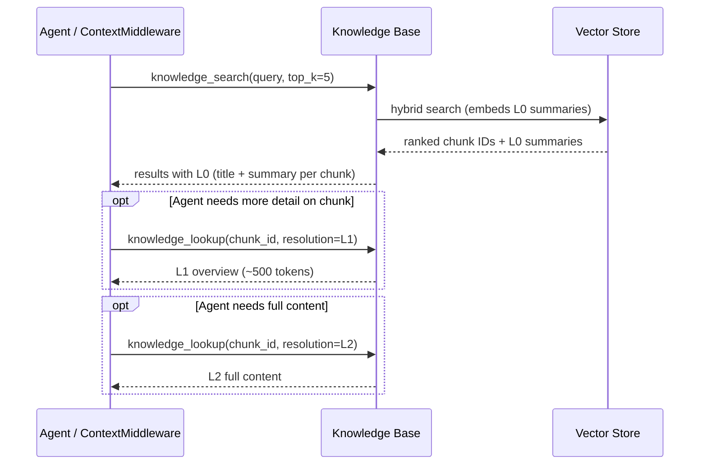

**Diagram type rationale**: Sequence diagram shows the progressive resolution escalation from L0 through L1 to L2.

**Legend**: Initial search returns lightweight L0 summaries. Agent (or InjectKnowledge middleware) can request L1 or L2 for specific chunks on demand.

**Token Savings Estimate**:

| Scenario | Without L0/L1/L2 | With L0/L1/L2 | Savings |
|----------|-----------------|---------------|---------|
| Auto-inject top 3 results | 3 x 1000 = 3,000 tokens (full content) | 3 x 100 = 300 tokens (L0 only) | ~90% |
| Agent scans 5 results, reads 2 in detail | 5 x 1000 = 5,000 tokens | 5 x 100 + 2 x 500 = 1,500 tokens (L0 + L1) | ~70% |
| Agent needs full content for 1 result | 5 x 1000 = 5,000 tokens | 5 x 100 + 1 x 1000 = 1,500 tokens (L0 + L2) | ~70% |

**InjectKnowledge Integration**: The `InjectKnowledge` ContextMiddleware injects at **L0 resolution by default**. If the Knowledge token budget allows and fewer than 3 chunks are injected, it escalates to L1. This ensures automatic injection stays within budget while providing useful previews for the agent to decide whether to load more.

**knowledge_search Tool Enhancement**: The `knowledge_search` tool returns L0 summaries by default. An optional `resolution` parameter (L0/L1/L2) allows the agent to request higher resolution in the initial search, though this consumes more tokens. The `knowledge_lookup` tool supports a `resolution` parameter for per-chunk escalation.

### Domain Classifier

Two classification modes:

| Mode | Description | Cost | Accuracy |
|------|-------------|------|----------|
| **Rule-based** | Keyword matching against domain taxonomy; fast and deterministic | Near-zero | Moderate (good for well-defined domains) |
| **LLM-assisted** | Single LLM call per batch of chunks with structured output schema | One LLM call per batch | High (handles ambiguous content) |

The classifier uses rule-based mode by default and falls back to LLM-assisted mode when confidence is below a configurable threshold (default 0.5). User-provided domain hints (via CLI `--domain` flag or collection config) boost classification accuracy.

### Quality Filter

| Check | Threshold | Action |
|-------|-----------|--------|
| **Minimum length** | < 50 tokens | Reject (too short to be useful) |
| **Language detection** | Configurable allowed languages | Reject if not in allowed set |
| **Deduplication** | Content hash match or cosine similarity > 0.95 with existing chunk | Reject duplicate; update existing if source is newer |
| **Coherence** | LLM-assessed (optional) | Flag low-coherence chunks for review |
| **Quality score** | Combined signal from length, structure, and coherence | Stored on entry for retrieval-time weighting |

---

## Retrieval Engine Detail

### Multi-Dimensional Index

Each knowledge entry is indexed along four dimensions. The indexes are maintained incrementally at ingestion time and queried in combination at retrieval time.

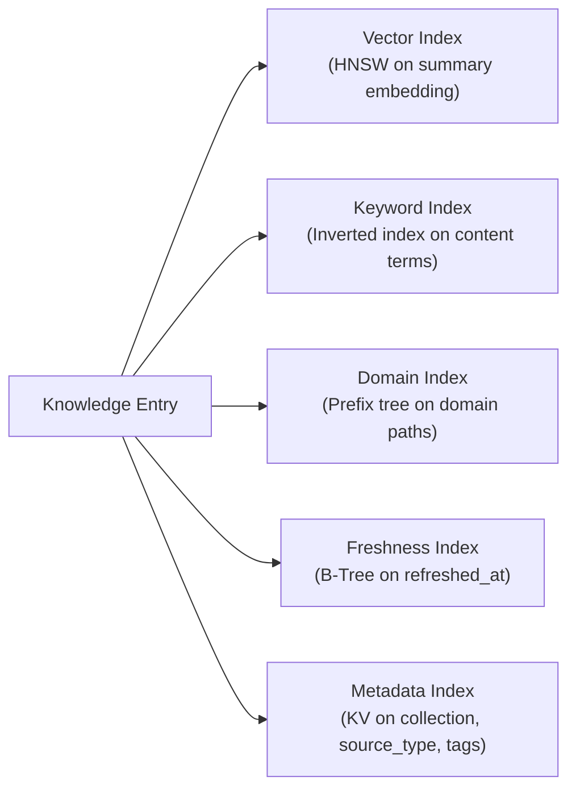

**Diagram type rationale**: Flowchart illustrates the fan-out from a single knowledge entry to multiple index structures supporting different retrieval dimensions.

**Legend**: Each index supports a different retrieval dimension; search strategies compose these indexes depending on the query.

| Index | Structure | Indexed Field | Purpose |
|-------|-----------|--------------|---------|
| **Vector Index** | HNSW (Hierarchical Navigable Small Worlds) | `summary` embedding (dense vector) | Approximate nearest neighbor search for semantic similarity |
| **Keyword Index** | Inverted index with BM25 scoring | Tokenized `content` + `summary` terms | Exact and partial term matching with statistical relevance |
| **Domain Index** | Prefix tree on hierarchical domain paths | `domains` (e.g., "testing/automation") | Domain-scoped filtering; parent domain queries match all descendants |
| **Freshness Index** | B-Tree on timestamp | `refreshed_at` | Time-ordered access for freshness-weighted ranking and staleness detection |
| **Metadata Index** | Hash map / KV store | `collection`, `source_type`, `metadata` tags | Fast equality and set-membership filters |

### Query Processing Pipeline

Before retrieval, the raw query undergoes a multi-stage processing pipeline:

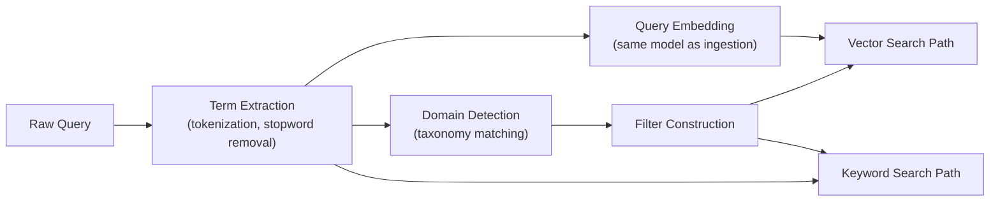

**Diagram type rationale**: Flowchart chosen to show how a raw query is processed into parallel search inputs.

**Legend**: Term Extraction feeds both the keyword path and domain detection. Query Embedding feeds the vector path. Domain Detection produces filters applied to both paths.

| Stage | Input | Output | Algorithm |
|-------|-------|--------|-----------|
| **Term Extraction** | Raw query string | Tokenized terms, n-grams | Whitespace + punctuation tokenization; stopword removal; optional stemming for supported languages |
| **Query Embedding** | Raw query string | Dense vector (same dimensionality as chunk embeddings) | Same embedding model used at ingestion (e.g., `text-embedding-3-small`, 1536 dims); ensures query-document alignment |
| **Domain Detection** | Extracted terms | Matched domain paths + confidence scores | Prefix match against domain taxonomy nodes; synonym expansion from a configurable synonym table; confidence = matched_terms / total_taxonomy_terms for each domain |
| **Filter Construction** | Domain matches + caller-provided filters (collection, source_type, min_score) | Structured filter object | Combine domain pre-filter with explicit caller filters into a conjunctive filter set |

### Retrieval Algorithms

#### Vector Search (Semantic Path)

The vector search path performs approximate nearest neighbor (ANN) retrieval:

| Property | Detail |
|----------|--------|
| **Algorithm** | HNSW (Hierarchical Navigable Small Worlds) via vector store backend (Qdrant default) |
| **Distance metric** | Cosine similarity (normalized dot product) |
| **Embedding target** | `summary` field (short, retrieval-focused text; analogous to LTM's `when_to_use`) |
| **Candidate count** | Retrieve `top_k * 3` candidates before post-filtering (over-retrieval compensates for filter losses) |
| **Pre-filtering** | Domain and collection filters applied as vector store payload filters (pushed down to the HNSW search, not post-hoc) to avoid scanning irrelevant partitions |
| **Score normalization** | Cosine similarity scores are in [0, 1] range; no additional normalization needed |

HNSW parameters (configurable per collection):

| Parameter | Default | Rationale |
|-----------|---------|-----------|
| `ef_construct` | 128 | Higher values improve recall at index build time; acceptable since ingestion is offline |
| `m` | 16 | Number of bi-directional links per node; balances memory and search quality |
| `ef_search` | 64 | Higher values improve recall at query time at the cost of latency; tunable per query |

#### Keyword Search (Lexical Path)

The keyword search path uses BM25 (Best Matching 25) scoring over an inverted index:

| Property | Detail |
|----------|--------|
| **Algorithm** | BM25 with parameters k1=1.2, b=0.75 (standard Okapi BM25) |
| **Index** | Inverted index mapping terms to `{chunk_id, term_frequency, field}` postings |
| **Fields indexed** | `content` (weight 1.0) and `summary` (weight 1.5); summary terms are boosted because they are more retrieval-relevant |
| **Tokenization** | Language-aware tokenizer; Chinese uses jieba/ICU segmentation; English uses Unicode word boundaries |
| **Term weighting** | BM25 score = `IDF * (tf * (k1 + 1)) / (tf + k1 * (1 - b + b * dl/avgdl))` where tf = term frequency in chunk, dl = chunk length, avgdl = average chunk length across collection |
| **Pre-filtering** | Domain and collection filters applied before scoring to reduce candidate set |
| **Score normalization** | BM25 raw scores are unbounded; normalized to [0, 1] via `score / (score + k)` where k is the score at the 95th percentile of the collection's score distribution (computed at index build time) |

#### Hybrid Search (Reciprocal Rank Fusion)

The default retrieval strategy runs vector and keyword searches in parallel, then fuses results using Reciprocal Rank Fusion (RRF) -- a parameter-free method that is robust across different score distributions:

| Property | Detail |
|----------|--------|
| **Algorithm** | RRF: `score(d) = sum over search paths r of 1 / (k + rank_r(d))` where `k` is a constant (default 60) |
| **Input** | Ranked result lists from vector search and keyword search (each up to `top_k * 3` candidates) |
| **Fusion** | For each chunk appearing in any result list, compute the RRF score by summing reciprocal ranks across all lists the chunk appears in. Chunks appearing in multiple lists receive a natural rank boost. |
| **Post-fusion adjustments** | After RRF scoring, apply two multiplicative adjustments: (1) `quality_boost = quality_score ^ 0.5` (square root to dampen extreme quality differences); (2) `freshness_boost = 1 / (1 + decay_rate * days_since_refresh)` where `decay_rate` is configurable per collection (default 0.01, meaning ~1% decay per day) |
| **Final score** | `final_score = rrf_score * quality_boost * freshness_boost` |
| **Truncation** | Sort by `final_score` descending; return top `top_k` results |

RRF was chosen over weighted linear combination because it does not require score calibration between vector (cosine, [0,1]) and keyword (BM25, unbounded) paths. The constant `k=60` is the standard value from the original RRF paper (Cormack et al., 2009).

**Alternative considered**: Weighted linear combination (`w1 * semantic + w2 * keyword`). Rejected because BM25 and cosine scores have incompatible distributions; tuning weights per collection is fragile. RRF operates on ranks, not scores, avoiding this calibration problem entirely.

### Multi-Stage Retrieval Pipeline

Complex queries benefit from multi-stage retrieval that progressively refines results:

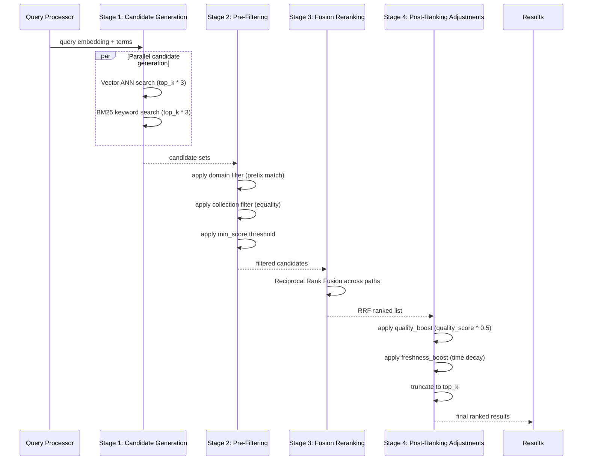

**Diagram type rationale**: Sequence diagram chosen to show the temporal stages of the multi-stage retrieval pipeline.

**Legend**:
- **Stage 1**: Parallel candidate generation from vector and keyword indexes; over-retrieves to compensate for later filtering.
- **Stage 2**: Hard filters (domain, collection, min_score) reduce the candidate set.
- **Stage 3**: RRF merges the two ranked lists into a single fused ranking.
- **Stage 4**: Multiplicative adjustments for quality and freshness; final truncation to `top_k`.

### Search Strategies (Summary)

Each named strategy configures the multi-stage pipeline differently:

| Strategy | Stage 1 Paths | Stage 2 Filters | Stage 3 Fusion | Stage 4 Adjustments |
|----------|--------------|-----------------|---------------|-------------------|
| **SemanticSearch** | Vector only | Optional domain/collection | N/A (single path) | Quality + freshness |
| **KeywordSearch** | BM25 only | Domain + collection | N/A (single path) | Quality + freshness |
| **DomainScoped** | Vector + BM25 | Domain filter required | RRF | Quality + freshness |
| **CollectionScoped** | Vector + BM25 | Collection filter required | RRF | Quality + freshness |
| **Hybrid** (default) | Vector + BM25 | Optional | RRF | Quality + freshness |
| **Deep** | Vector + BM25 + LLM sub-query expansion (up to 2 rounds) | Optional | RRF across all rounds | Quality + freshness + diversity penalty (MMR) |

#### Deep Retrieval Strategy

For high-stakes queries (e.g., agent pre-task planning), the Deep strategy performs iterative retrieval with query expansion:

| Round | Action | Purpose |
|-------|--------|---------|
| **Round 1** | Standard hybrid search (vector + BM25 + RRF) | Baseline candidates |
| **Round 2** | LLM generates 2-3 sub-queries from the original query + Round 1 results; each sub-query runs a hybrid search | Expand recall to related concepts the original query missed |
| **Fusion** | RRF across Round 1 + all Round 2 result lists | Combine baseline and expanded results |
| **Diversity** | MMR (Maximal Marginal Relevance) with lambda=0.7 to penalize redundant chunks | Ensure result diversity when multiple chunks cover the same concept |

MMR scoring: `MMR(d) = lambda * sim(d, query) - (1 - lambda) * max(sim(d, d_selected))` where `d_selected` is the set of already-selected chunks. This prevents the top-k results from being dominated by near-duplicate chunks from the same source.

### Domain-Triggered Retrieval

The `InjectKnowledge` ContextMiddleware performs automatic domain matching on each user message:

1. **Term extraction**: Tokenize user message; extract terms and n-grams (bi-grams for compound concepts like "automated testing").
2. **Taxonomy matching**: For each extracted term/n-gram, check against the domain taxonomy:
   - Exact match: term matches a taxonomy node name or synonym (confidence = 1.0).
   - Prefix match: term matches the start of a taxonomy node (confidence = 0.8).
   - Synonym match: term found in the synonym expansion table (confidence = 0.9).
3. **Domain scoring**: For each matched domain, compute `domain_confidence = max(term_confidences) * coverage` where `coverage = matched_terms_for_this_domain / total_taxonomy_terms_for_this_domain`.
4. **Trigger decision**: If any domain scores above threshold (default 0.6), trigger a DomainScoped retrieval for the top-scoring domain(s).
5. **Injection**: Top-k results (default 3) injected into context, respecting the knowledge token budget.

This mechanism enables the user's scenario: "when an agent encounters a task in a relevant domain, it can quickly retrieve knowledge" -- without the agent needing to explicitly call `knowledge_search`.

---

## Built-in Tools

### knowledge_search

| Aspect | Detail |
|--------|--------|
| **Category** | Knowledge |
| **Parameters** | `query` (string, required): search query; `domain` (string, optional): domain filter; `collection` (string, optional): collection filter; `top_k` (int, optional, default 5): max results; `min_score` (float, optional, default 0.5): minimum relevance threshold; `resolution` (enum L0/L1/L2, optional, default L0): content resolution level |
| **Returns** | Array of `{chunk_id, summary, domains, source_uri, score}` (L0) or with `overview` (L1) or `content` (L2) |
| **Dangerous** | No |
| **Runtime** | No isolation needed (in-process search) |

### knowledge_lookup

| Aspect | Detail |
|--------|--------|
| **Category** | Knowledge |
| **Parameters** | `chunk_id` (string, optional): exact chunk ID; `source_uri` (string, optional): retrieve all chunks from a source; `collection` (string, optional): filter by collection; `resolution` (enum L0/L1/L2, optional, default L2): content resolution level |
| **Returns** | Knowledge entry at requested resolution with metadata |
| **Dangerous** | No |
| **Runtime** | No isolation needed |

### knowledge_ingest (Agent-Facing)

| Aspect | Detail |
|--------|--------|
| **Category** | Knowledge |
| **Parameters** | `source` (string, required): file path or URL; `source_type` (enum, required): PDF/Web/Text/Markdown; `collection` (string, required): target collection; `domain_hint` (string, optional): domain classification hint |
| **Returns** | Ingestion report: `{chunks_created, chunks_rejected, source_hash, collection_name}` |
| **Dangerous** | No (reads external content; does not execute it) |
| **Runtime** | No isolation needed for local files; web fetching uses existing `web_fetch` tool pipeline |

These tools are registered in the Tool Registry alongside existing built-in tools (see [tools-design.md](tools-design.md)).

---

## Context Assembly Integration

The Knowledge Base integrates into the Context Assembly Pipeline (see [context-session-design.md](context-session-design.md)) via a new `InjectKnowledge` ContextMiddleware:

| Property | Value |
|----------|-------|
| **Pipeline stage name** | `InjectKnowledge` |
| **Priority** | 350 (between InjectMemory at 300 and InjectSkills at 400) |
| **Token budget category** | New category: Knowledge (default 4,000 tokens; configurable) |
| **Trigger condition** | Domain match on user message OR active skill references a knowledge collection |
| **Injection format** | L0: `[Knowledge: {domain}] {summary}`; L1: `[Knowledge: {domain}] {summary}\n{overview}`; L2: `[Knowledge: {domain}] {summary}\n{content}` |
| **Default resolution** | L0 (auto-escalate to L1 if budget allows and chunk count <= 3) |
| **Short-circuit** | Never; always calls `next` to continue the pipeline |

### Context Window Guard Extension

The Context Window Guard's budget categories are extended with a Knowledge allocation:

| Budget Category | Default Allocation | Description |
|----------------|-------------------|-------------|
| System Prompt | 8,000 tokens | Agent persona, date/time, instructions |
| Tools Schema | 16,000 tokens | Tool definitions and schemas |
| **Knowledge** | **4,000 tokens** | **Retrieved knowledge chunks (new)** |
| History | 76,000 tokens | Conversation messages (reduced from 80,000 to accommodate Knowledge) |
| Bootstrap | 8,000 tokens | Workspace context, README, etc. |
| Response Reserve | 16,000 tokens | Reserved for LLM output |

**Total**: 128,000 tokens (unchanged).

---

## Knowledge Maintenance

### Freshness Management

| Operation | Trigger | Behavior |
|-----------|---------|----------|
| **Re-ingestion** | Manual (`kb refresh`) or scheduled | Re-fetch source, compare content hash, update changed chunks |
| **Staleness detection** | Background check (configurable interval) | Mark entries as Stale when source content hash differs from stored hash |
| **Expiry** | TTL exceeded (configurable per collection, default: none) | Mark entries as Expired; garbage collect after grace period |

### Deduplication

| Level | Detection | Resolution |
|-------|-----------|------------|
| **Exact duplicate** | Content hash match | Keep existing; skip new |
| **Near duplicate** | Cosine similarity > 0.95 | Keep higher quality score; merge metadata |
| **Cross-source duplicate** | Same content from different sources | Keep both with cross-reference; surface to user for review |

### Collection Management

| Operation | Description |
|-----------|-------------|
| `kb collection create <name>` | Create a new knowledge collection with config |
| `kb collection list` | List all collections with entry counts and domains |
| `kb collection inspect <name>` | Show collection details, source list, domain distribution |
| `kb collection delete <name>` | Delete collection and all its entries |
| `kb collection refresh <name>` | Re-ingest all sources in the collection |

---

## Failure Handling and Edge Cases

| Scenario | Handling |
|----------|---------|
| **PDF parsing fails** (encrypted, image-only) | Log error with source URI; skip source; report to user in ingestion summary |
| **Web page unreachable** | Retry 3 times with exponential backoff; if all fail, skip with warning |
| **Web page requires authentication** | Reject with clear error: "Source requires authentication; configure credentials in connector config" |
| **Embedding service unavailable** | Queue chunks for later embedding; ingestion continues without indexing; background job retries |
| **Chunk too large after splitting** | Recursive split with smaller target size; fail if chunk cannot be reduced below 2x target |
| **Domain classification LLM call fails** | Fall back to rule-based classification; if no rules match, tag as "unclassified" |
| **Deduplication finds many near-duplicates** | Accept first N (configurable, default 3); warn user about high duplication from source |
| **Knowledge token budget exceeded during injection** | Truncate to budget; prioritize chunks with highest relevance scores |
| **Source content changes between re-ingestions** | Detect via content hash; update existing chunks; add new chunks; mark removed content as expired |
| **Concurrent ingestion of same source** | Source-level lock prevents duplicate ingestion; second attempt waits or skips with notification |
| **Vector store returns zero results** | Return empty result set; InjectKnowledge middleware skips injection; agent proceeds without knowledge context |

---

## Security and Permissions

| Concern | Approach |
|---------|----------|
| **Source trust** | Ingestion agents operate under the same guardrails as any agent. File system sources respect workspace path restrictions (see [tools-design.md](tools-design.md)). Web sources use existing `web_fetch` security model. |
| **Content filtering** | Quality Filter screens for minimum coherence. No automatic execution of ingested content (knowledge is text-only, never executed). |
| **Workspace isolation** | All knowledge entries are partitioned by `workspace_id`. No cross-workspace knowledge access. |
| **Collection access control** | Collections inherit workspace-level permissions. Fine-grained per-collection ACLs are deferred to Phase 2. |
| **Sensitive content** | Ingestion does not automatically detect PII or secrets in source documents. Users are responsible for not ingesting sensitive content. A future phase will add optional content scanning. |
| **Audit trail** | Every ingestion, retrieval, and deletion operation is logged with workspace_id, collection, source_uri, and chunk counts. |
| **Injection safety** | Knowledge chunks injected into LLM context are plaintext; no prompt injection risk beyond what exists in any RAG system. The InjectKnowledge middleware escapes any content that resembles system prompt delimiters. |

---

## Performance and Scalability

### Performance Targets

| Metric | Target |
|--------|--------|
| PDF parsing (100-page document) | < 30s |
| Web page fetching + parsing | < 5s per page |
| Chunking (1000 chunks) | < 1s |
| Domain classification (rule-based, 100 chunks) | < 100ms |
| Domain classification (LLM-assisted, batch of 20 chunks) | < 10s |
| Embedding (batch of 100 chunks) | < 5s |
| Full ingestion pipeline (single PDF, 100 pages) | < 60s |
| knowledge_search (Hybrid, single round) | < 100ms p99 |
| knowledge_search (Deep, 2 rounds with sub-query) | < 500ms p99 (dominated by LLM sub-query generation) |
| Vector ANN search (HNSW, 500K chunks) | < 20ms p99 |
| BM25 keyword search (inverted index, 500K chunks) | < 30ms p99 |
| RRF fusion (two result lists, 100 candidates) | < 1ms |
| InjectKnowledge context middleware | < 150ms (domain matching + hybrid search) |
| knowledge_lookup by ID | < 5ms |

### Optimization Strategies

- **Batch embedding**: Accumulate chunks from an ingestion run; embed in a single batch call to amortize API overhead.
- **Incremental ingestion**: On re-ingestion, only process chunks whose source content hash has changed.
- **Embedding cache**: Cache embeddings by content hash; reuse for identical content across sources.
- **Domain index precomputation**: Domain taxonomy index is precomputed at startup and updated on taxonomy changes.
- **Collection-level vector partitioning**: Each collection maps to a vector store partition (namespace/collection in Qdrant) for efficient scoped search.
- **Lazy domain matching**: The InjectKnowledge middleware performs lightweight keyword extraction first; only triggers full search if keywords match the domain taxonomy.

---

## Observability

| Signal | Metrics / Events |
|--------|-----------------|
| **Ingestion** | `kb.ingest.sources_processed`, `kb.ingest.chunks_created`, `kb.ingest.chunks_rejected`, `kb.ingest.duration_ms`, `kb.ingest.errors` (by source_type) |
| **Classification** | `kb.classify.mode` (rule_based / llm_assisted), `kb.classify.domain_distribution` (by domain) |
| **Retrieval** | `kb.search.latency_ms`, `kb.search.results_count`, `kb.search.top_score`, `kb.search.strategy` (by strategy) |
| **Context injection** | `kb.inject.triggered`, `kb.inject.skipped`, `kb.inject.chunks_injected`, `kb.inject.tokens_injected` |
| **Maintenance** | `kb.refresh.sources_updated`, `kb.refresh.chunks_changed`, `kb.expire.chunks_removed` |
| **Capacity** | `kb.total_collections`, `kb.total_chunks`, `kb.total_sources`, `kb.storage_size_bytes` |
| **Errors** | `kb.errors.parse_failed`, `kb.errors.fetch_failed`, `kb.errors.embed_failed`, `kb.errors.search_failed` |

### Hook Points

The Knowledge Base registers two lifecycle hooks in the y-hooks system (see [hooks-plugin-design.md](hooks-plugin-design.md)):

| Hook Point | Phase | Context Available | Module |
|-----------|-------|------------------|--------|
| `kb_ingestion_completed` | After | collection, source_count, chunk_count, duration | Knowledge Base |
| `kb_knowledge_retrieved` | After | query, collection, result_count, top_score | Knowledge Base |

### Event Bus Events

| Event | Key Fields |
|-------|-----------|
| `KnowledgeIngested` | collection, source_uri, chunk_count, duration_ms |
| `KnowledgeRetrieved` | query_summary, collection, result_count, top_score, strategy |
| `KnowledgeExpired` | collection, chunk_count, reason |
| `KnowledgeCollectionCreated` | collection_name, domains |

---

## Rollout and Rollback

### Phased Implementation

| Phase | Scope | Duration |
|-------|-------|----------|
| **Phase 1** | Knowledge entry data model, Knowledge Store (vector + metadata), collection CRUD, `knowledge_search` / `knowledge_lookup` tools, PDF and Markdown source connectors, heading-based chunker, rule-based domain classifier | 3-4 weeks |
| **Phase 2** | Web source connector, `knowledge_ingest` agent-facing tool, LLM-assisted domain classification, quality filter with deduplication, `InjectKnowledge` ContextMiddleware, domain taxonomy management | 3-4 weeks |
| **Phase 3** | Freshness management (re-ingestion, staleness detection, expiry), collection-level config, fusion reranking with freshness weighting, skill-referenced knowledge resolution, observability metrics and hook points | 2-3 weeks |
| **Phase 4** | API source connector interface, semantic chunker (LLM-assisted), advanced deduplication (cross-source), performance optimization, knowledge base CLI commands | 2-3 weeks |

### Rollback Plan

| Component | Rollback |
|-----------|----------|
| Knowledge Store | Feature flag `knowledge_base`; disabled = all KB tools return "feature disabled"; InjectKnowledge middleware becomes no-op |
| InjectKnowledge middleware | Feature flag `kb_context_injection`; disabled = middleware skips injection; agents can still use explicit `knowledge_search` tool |
| LLM-assisted classification | Feature flag `kb_llm_classification`; disabled = rule-based classification only |
| Freshness management | Feature flag `kb_freshness`; disabled = no expiry or staleness detection; all indexed entries remain active |
| Domain-triggered retrieval | Feature flag `kb_domain_trigger`; disabled = InjectKnowledge only activates on explicit skill references, not on domain matching |

---

## Alternatives and Trade-offs

### Knowledge as LTM Memory Type vs Separate Store

| | Fifth LTM Type (rejected) | Separate Store (chosen) |
|-|--------------------------|------------------------|
| **Ingestion pipeline** | Must share LTM's conversation-extraction pipeline | Own ingestion pipeline designed for external documents |
| **Retrieval isolation** | KB results mixed with experience memories in recall | Separate search; no contamination of LTM recall quality |
| **Index optimization** | Shared index not optimized for document chunks | Collection-level partitioning; domain index; freshness index |
| **Maintenance** | LTM's time-decay would inappropriately age reference knowledge | Own freshness model: source-hash-based staleness, configurable TTL |
| **Complexity** | Lower (reuse LTM extraction/recall) | Higher (separate pipeline and store) |

**Decision**: Separate store sharing infrastructure. The ingestion pattern (external documents vs conversation extraction), retrieval needs (domain-scoped vs experience recall), and maintenance model (source freshness vs time decay) are sufficiently different to justify separation. Sharing the underlying vector store and embedding pipeline avoids duplicating infrastructure.

### Ingestion: Dedicated Daemon vs Agent-Driven

| | Dedicated Daemon (rejected) | Agent-Driven (chosen) |
|-|---------------------------|----------------------|
| **Infrastructure** | Separate long-running process | Reuses existing agent orchestration |
| **LLM access** | Needs own LLM integration for classification | Uses agent's LLM via standard provider pool |
| **Observability** | Needs own metrics/tracing | Inherits agent-level observability for free |
| **Guardrails** | Needs own safety checks | Inherits guardrails, permissions, rate limiting |
| **Scheduling** | Built-in scheduler | Composes with y-scheduler externally |
| **Complexity** | Higher (new component) | Lower (new agent type, not new infrastructure) |

**Decision**: Agent-driven ingestion. Reusing the agent framework eliminates the need for a parallel ingestion infrastructure. Ingestion agents get LLM access, guardrails, tool pipelines, and observability for free.

### Retrieval: RAG-Only vs Domain-Triggered Hybrid

| | RAG-Only (rejected) | Domain-Triggered Hybrid (chosen) |
|-|--------------------|---------------------------------|
| **Precision** | High (explicit query) | High (domain matching + semantic search) |
| **Recall for implicit needs** | Low (agent must know to search) | High (automatic injection on domain match) |
| **Token cost** | Zero when not queried | Small cost for domain matching; injection only when matched |
| **Agent burden** | Agent must explicitly call knowledge_search | Automatic for common cases; explicit tool still available |

**Decision**: Domain-triggered hybrid. The automatic injection ensures agents benefit from relevant knowledge even when they do not explicitly search. The explicit `knowledge_search` tool remains available for targeted queries.

### Hybrid Fusion: RRF vs Weighted Linear Combination

| | RRF (chosen) | Weighted Linear |
|-|-------------|----------------|
| **Score calibration** | Not needed (operates on ranks) | Required (cosine vs BM25 have incompatible distributions) |
| **Parameter tuning** | Single constant k=60 (robust default) | Two+ weights per query type; fragile across collections |
| **Theoretical basis** | Rank aggregation theory (Cormack et al., 2009) | Ad hoc; no formal guarantees |
| **Multi-path extension** | Naturally extends to 3+ lists (Deep retrieval rounds) | Weight explosion with more paths |
| **Score interpretability** | Rank-based; less interpretable | Direct weighted sum; more interpretable |

**Decision**: RRF. The calibration-free property is decisive: BM25 scores vary by orders of magnitude across collections, making stable weight tuning impractical. RRF's rank-based fusion is robust by construction.

### Diversity: MMR vs No Diversity Control

| | MMR (chosen for Deep) | No Diversity Control |
|-|----------------------|---------------------|
| **Redundancy** | Penalizes near-duplicate chunks | Top-k may contain 5 chunks from the same section |
| **Coverage** | Ensures diverse source coverage | May miss relevant but different sources |
| **Cost** | O(k * n) pairwise similarity; < 5ms for typical k=10 | Zero |
| **Applicability** | Deep retrieval (high-stakes queries) | Simple retrieval (fast, low-stakes) |

**Decision**: MMR applied only in Deep retrieval strategy. For standard Hybrid search, the RRF fusion already provides implicit diversity (chunks ranked high in different paths are naturally diverse). MMR adds explicit diversity control for planning-critical queries where source coverage matters.

### Content Resolution: Single-Level vs Multi-Resolution (L0/L1/L2)

| | Single-Level (rejected) | Multi-Resolution L0/L1/L2 (chosen) |
|-|------------------------|--------------------------------------|
| **Token efficiency** | Full chunk always injected (~1000 tokens each) | L0 summary (~100 tokens); escalate only when needed |
| **Agent decision quality** | Agent sees everything or nothing | Agent scans L0 summaries, reads L1/L2 selectively |
| **Auto-injection cost** | 3 chunks = ~3000 tokens per injection | 3 chunks = ~300 tokens (L0); 90% savings |
| **Ingestion cost** | Lower (no summary generation) | Higher (LLM call to generate L0 + L1 per chunk) |
| **Storage** | Lower | ~30% more storage (L0 + L1 fields added) |

**Decision**: Multi-resolution L0/L1/L2. The token savings during retrieval and context injection far outweigh the one-time ingestion cost. This directly supports y-agent's token efficiency principle (P5). Inspired by OpenViking's L0/L1/L2 hierarchical context loading pattern.

### Chunking: Fixed-Size vs Semantic

| | Fixed-Size (simpler) | Semantic/Heading-Based (chosen) |
|-|---------------------|-------------------------------|
| **Coherence** | May split mid-sentence or mid-paragraph | Preserves logical boundaries |
| **Retrieval quality** | Lower (partial concepts in chunks) | Higher (complete concepts per chunk) |
| **Implementation** | Trivial | Moderate (requires document structure parsing) |
| **Consistency** | Uniform chunk sizes | Variable sizes (bounded by target range) |

**Decision**: Heading-based as default with sliding window fallback. Semantic coherence in chunks directly improves retrieval quality. The implementation cost is moderate and one-time.

---

## Open Questions

| # | Question | Owner | Due Date | Status |
|---|----------|-------|----------|--------|
| 1 | What embedding model should be used for knowledge chunks -- same as LTM or a specialized document embedding model? | Knowledge team | 2026-04-01 | Open |
| 2 | Should the domain taxonomy be user-editable at runtime, or only at configuration time? | Knowledge team | 2026-03-27 | Open |
| 3 | What is the optimal chunk size range for different source types (PDF vs web articles vs API docs)? | Knowledge team | 2026-04-15 | Open |
| 4 | Should knowledge chunks support versioning (keep old versions when source is re-ingested)? | Knowledge team | 2026-04-15 | Open |
| 5 | Should the InjectKnowledge middleware support user-defined injection rules (beyond domain matching)? | Knowledge team | 2026-04-01 | Open |
| 6 | How should the Knowledge Base interact with the future Knowledge Graph (Phase 2 of LTM)? | Knowledge + Memory team | 2026-05-01 | Open |
| 7 | Should ingestion support incremental updates for APIs that provide change feeds (e.g., RSS, webhooks)? | Knowledge team | 2026-05-01 | Open |

