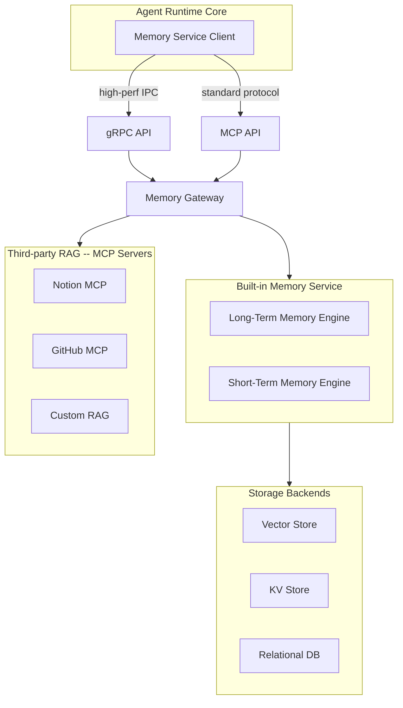
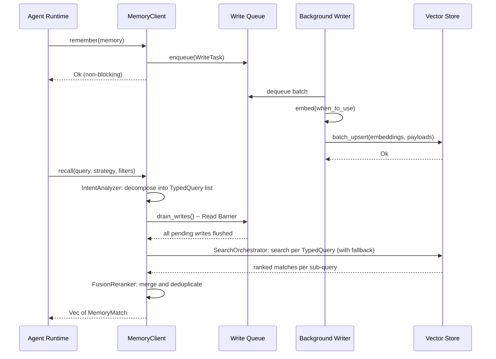
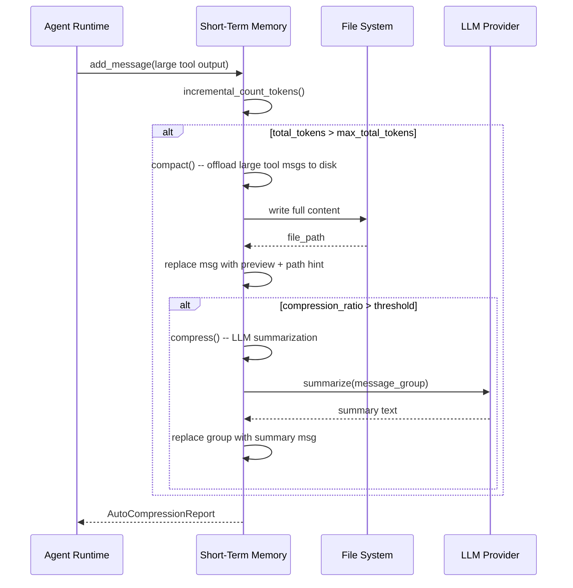
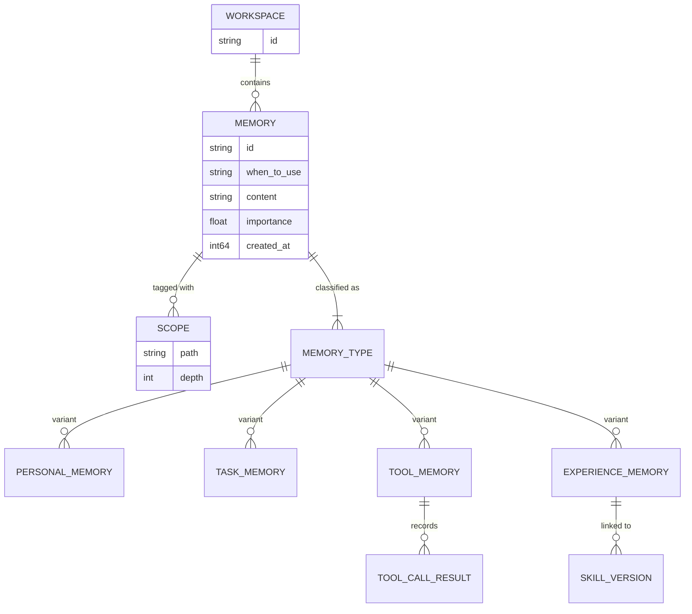

# Memory System Architecture Design

> Core architecture for y-agent's memory subsystem covering long-term knowledge persistence and short-term context management.

**Version**: v0.6
**Created**: 2026-03-04
**Updated**: 2026-03-08
**Status**: Draft

---

## TL;DR

The Memory system gives y-agent the ability to retain knowledge across sessions (long-term), manage context within a single session (short-term), and share structured intermediate results within a pipeline execution (working memory). It adopts a **layered architecture** with a **Memory Service Client** that hides transport details from the Agent Runtime, a **Memory Gateway** that routes requests across protocols, and pluggable **Memory Engines** (built-in or third-party RAG via MCP). Communication uses **gRPC** for internal high-performance IPC and **MCP** for third-party integration. Long-term memory stores four categories of knowledge -- Personal, Task, Tool, and Experience -- in a multi-dimensional index (vector + time + scope + importance), with **intent-aware query decomposition** for compound recalls and a **Search Orchestrator** providing multi-strategy fallback (Vector -> Hybrid -> Keyword). Writes use **two-phase deduplication**: content-hash fast path (zero LLM cost) followed by LLM-judged 4-action semantic dedup (create/merge/skip/delete). Short-term memory keeps the context window under model limits through Compact (lossless offload to disk), Compress (LLM-driven summarization), and **IndexedExperience** (agent-controlled archival to an **Experience Store** under stable indices with exact dereference recovery -- inspired by [Memex(RL)](../research/memex-rl.md)). **Working Memory** is a pipeline-scoped, ephemeral, typed blackboard for Micro-Agent Pipeline step communication (see [micro-agent-pipeline-design.md](micro-agent-pipeline-design.md)). Writes are non-blocking with a **Read Barrier** that drains pending writes before any read, guaranteeing write-then-read consistency without sacrificing throughput.

---

## Background and Goals

### Background

AI agents that operate across many conversations and tasks lose valuable context when each session starts from scratch. A memory system allows the agent to accumulate reusable knowledge (what worked, what failed, who the user is) and to manage the finite context window within a single session so that important information is never silently dropped. This design draws on patterns from several reference systems:

- **OpenFang**: SQLite + vector + knowledge-graph hybrid store; background writes with read barrier.
- **ReMe**: Four-tier memory classification; Compact/Compress dual compression.
- **CrewAI**: Unified Memory API with LLM-driven analysis; non-blocking writes.

### Goals

| Goal | Measurable Criteria |
|------|---------------------|
| **Clear separation** | Long-term and short-term memory have disjoint responsibilities and independent storage |
| **High performance IPC** | gRPC latency < 10 ms p99 for local calls; MCP available for third-party RAG |
| **Multi-dimensional retrieval** | Support semantic, temporal, importance, and scope-based recall in any combination |
| **Intelligent compression** | Context never exceeds model window; Compact first, Compress only when needed |
| **Write-then-read consistency** | Read Barrier ensures all pending writes are visible before any recall query |
| **Extensibility** | Third-party RAG servers pluggable via MCP without changing client code |

### Non-Goals

- Not a general-purpose vector database (delegates to Qdrant/Chroma/Lance).
- Not a distributed consensus system (single-writer, no multi-node replication in v0).
- Not a replacement for the Session Store (JSONL history persistence is a separate concern).

### Assumptions

1. A single user operates per workspace; multi-tenant isolation is scope-based, not OS-level.
2. The embedding model is available locally or via API with acceptable latency (< 200 ms per call).
3. LLM calls for compression and extraction are budgeted separately from the main conversation.
4. The built-in vector store runs in-process for v0; external deployment is a Phase 2 goal.

### Design Principles

| Principle | Origin | Application |
|-----------|--------|-------------|
| Non-blocking writes | OpenFang, CrewAI | `remember()` enqueues and returns immediately; a background worker persists |
| Read Barrier consistency | OpenFang | `recall()` drains the write queue before searching |
| Compact before Compress | ReMe | Prefer lossless disk offload; resort to LLM summarization only when necessary |
| Scope tree isolation | Original | Hierarchical path-based scopes enable fine-grained access control |
| Unified client abstraction | CrewAI | A single `MemoryClient` trait hides Local / gRPC / MCP backends |

---

## Scope

### In Scope

- `MemoryClient` trait abstracting Local, gRPC, and MCP backends
- `MemoryGateway` for protocol adaptation and request routing
- Long-Term Memory Engine: store, retrieve, delete with multi-dimensional index
- Short-Term Memory Engine: compact, compress, auto-compress, reload
- Scope tree model for hierarchical access control
- Unified `Memory` data model shared across memory types
- Background write queue with Read Barrier
- Configuration schema (TOML-based)
- Health check and status APIs

### Out of Scope

- Third-party RAG server implementations (only the MCP integration surface)
- Knowledge Graph construction (Phase 2)
- Distributed replication or sharding
- TUI debugging tools (Phase 2)
- Embedding model training or fine-tuning

---

## High-Level Design

### Layered Architecture



> **Diagram type rationale**: Flowchart chosen to show module boundaries, dependency direction, and deployment topology.
>
> **Legend**: MC = the only entry point for Runtime code; GW = routes to built-in or third-party; arrows indicate call direction.

### Core Components

| Component | Responsibility | Tech Choice |
|-----------|---------------|-------------|
| **Memory Service Client** | Unified async interface for Runtime; hides transport | Rust async trait |
| **gRPC API** | High-performance cross-process communication | tonic |
| **MCP API** | Standard protocol for third-party RAG integration | MCP Protocol |
| **Memory Gateway** | Request routing, protocol adaptation | Rust (axum / tonic) |
| **Long-Term Memory Engine** | Knowledge extraction, multi-dimensional indexing, recall | Built-in |
| **Short-Term Memory Engine** | Context compression, disk offload, reload | Built-in |
| **Vector Store** | Embedding storage and ANN search | Qdrant / Chroma / Lance |
| **KV Store** | Metadata and session state | RocksDB / Redis |
| **Relational DB** | Complex queries and relational indexing | PostgreSQL / SQLite |

### Backend Selection

The `MemoryClient` selects a backend at initialization based on configuration priority:

1. **MCP** -- if an MCP server is configured, connect to the external RAG service.
2. **gRPC** -- if a gRPC endpoint is configured, connect to a remote Memory Service.
3. **Local** -- default; run the built-in engine in-process (zero-copy, lowest latency).

---

## Key Flows / Interactions

### Long-Term Memory: Store and Recall



> **Diagram type rationale**: Sequence diagram shows the temporal ordering of store (non-blocking) and recall (barrier then search).
>
> **Legend**: WQ = write queue; dashed arrows = immediate return; solid arrows = blocking call.

### Short-Term Memory: Auto-Compress



> **Diagram type rationale**: Sequence diagram shows the conditional two-phase compression flow.
>
> **Legend**: Compact phase is lossless (disk offload); Compress phase is lossy (LLM summary). The `alt` blocks reflect the auto-mode decision tree.

---

## Data and State Model

### Scope Tree

Scopes form a hierarchical path structure used for multi-tenant isolation and access control:

```
/workspace/{workspace_id}/agent/{agent_id}/user/{user_id}
/workspace/{workspace_id}/session/{session_id}
```

A memory is visible to any query whose scope is an ancestor or descendant of the memory's scope. During deep recall, the engine expands the query scope upward (to parent scopes) to broaden the search.

### Unified Memory Entity

| Field | Type | Description |
|-------|------|-------------|
| `id` | String | Globally unique identifier |
| `workspace_id` | String | Owning workspace |
| `memory_type` | Enum (Personal / Task / Tool / Experience) | Determines extraction and recall behavior |
| `scopes` | Vec of Scope | Hierarchical access paths |
| `when_to_use` | String | Semantic trigger description (used as embedding input) |
| `content` | String | Actual knowledge payload |
| `importance` | f32 (0.0 -- 1.0) | Importance score, subject to time decay |
| `created_at` | i64 | Creation timestamp |
| `last_accessed_at` | i64 | Last retrieval timestamp (for decay calculation) |
| `access_count` | u32 | Hit count (for hotness ranking) |
| `metadata` | Map | Extensible key-value metadata |

### Memory Type Variants

| Variant | Key Fields | Purpose |
|---------|-----------|---------|
| **Personal** | target, reflection_subject, category | User preferences, habits, observations |
| **Task** | pattern_type (Success/Failure/Comparative), trajectory_id | Reusable strategies and lessons learned |
| **Tool** | tool_name, call_results | Tool usage patterns, best practices, common errors |
| **Experience** | skill_id, skill_version, outcome, trajectory_summary, key_decisions, tool_calls, evidence_entries, duration_ms, token_usage | Execution trajectory records captured by the self-evolution pipeline; `skill_id` is nullable (enables Skillless Experience Analysis); `evidence_entries` carry provenance tags (user_stated/user_correction/task_outcome/agent_observation) for bias prevention. See [skill-versioning-evolution-design.md](skill-versioning-evolution-design.md). |

### Memory Tiers

The Memory System comprises three tiers with distinct scopes and lifecycles, plus a session-scoped Experience Store that enhances the Short-Term Memory tier:

| Tier | Scope | Persistence | Access Pattern | Design Doc |
|------|-------|-------------|---------------|------------|
| **Long-Term Memory** | Workspace | Persistent (vector + KV store) | Semantic recall via multi-dimensional index | This document |
| **Short-Term Memory** | Session | Session lifetime (compact/compress/indexed-experience) | Token-counted message buffer | [memory-short-term.md](memory-short-term.md) |
| **Experience Store** | Session (within STM) | Session lifetime (in-memory HashMap) | Exact key-based dereference via `compress_experience` / `read_experience` tools | [memory-short-term.md](memory-short-term.md) |
| **Working Memory** | Pipeline execution | Ephemeral (destroyed on completion) | Structured typed slots; cognitive categories (Perception, Structure, Analysis, Action) | [micro-agent-pipeline-design.md](micro-agent-pipeline-design.md) |

The **Experience Store** is not a separate tier but an enhancement of Short-Term Memory, inspired by [Memex(RL)](../research/memex-rl.md). It stores full-fidelity artifacts (tool outputs, reasoning traces, code snippets) under agent-assigned stable indices, enabling precise evidence recovery without re-executing tools. The agent manages the Experience Store through first-class tools (`compress_experience`, `read_experience`) defined in [tools-design.md](tools-design.md).

Working Memory is owned by the Micro-Agent Pipeline module and communicates with Long-Term Memory through promotion (successful pipeline results persisted as Task memories) and priming (relevant past experiences loaded into Working Memory at pipeline start). Experience Store entries may also be promoted to Long-Term Memory at session end, based on access frequency and task relevance.

### Entity Relationships



> **Diagram type rationale**: ER diagram shows the data/entity relationships between the core memory concepts.
>
> **Legend**: Double lines = mandatory relationship; `o{` = zero-or-many; `|{` = one-or-many.

---

## Failure Handling and Edge Cases

| Scenario | Handling |
|----------|----------|
| **Write queue overflow** | Bounded queue; reject with backpressure error when full; caller retries with exponential backoff |
| **Embedding service unavailable** | Retry 3 times with jitter; Search Orchestrator falls back to keyword-only search if all retries fail |
| **Vector store completely unavailable** | Search Orchestrator switches to KeywordOnly strategy; emits degradation alert via event bus |
| **Vector store crash during write** | Write tasks are idempotent (upsert); unfinished tasks replayed from the queue on restart |
| **LLM unavailable during compress** | Skip Compress step; Compact alone keeps the system functional (larger context but no data loss) |
| **Corrupt disk file (compacted message)** | Return error on reload; log warning; the preview in context remains usable |
| **Read Barrier timeout** | Configurable drain timeout (default 5 s); if exceeded, proceed with stale read and log warning |
| **Scope path malformed** | Validate on construction; reject with descriptive error before any storage operation |

---

## Security and Permissions

| Control | Description |
|---------|-------------|
| **Scope-based access** | A query only returns memories whose scopes overlap (ancestor or descendant) with the caller's scope |
| **Workspace isolation** | All storage is partitioned by `workspace_id`; cross-workspace access is impossible at the API level |
| **No secret storage** | Memory content is not encrypted at rest in v0; users must not store secrets (API keys, passwords) as memory content. A future phase will add field-level encryption. |
| **gRPC authentication** | mTLS between Memory Service and Runtime for gRPC transport |
| **MCP server trust** | Only explicitly configured MCP servers are connected; no dynamic discovery |
| **Audit logging** | Every store, retrieve, and delete operation is logged with caller identity and scope |

---

## Performance and Scalability

| Dimension | Target | Approach |
|-----------|--------|----------|
| **Write throughput** | > 100 memories/s sustained | Background batch writer; configurable batch size and flush interval |
| **Recall latency** | < 50 ms p99 (local), < 100 ms p99 (gRPC) | LRU cache for hot memories; query result cache with 5-min TTL |
| **Token counting** | < 1 ms per message | tiktoken with incremental counting; recalculate only after compression |
| **Embedding** | Batch embedding to reduce API calls | Accumulate texts and call `embed_batch`; amortize network overhead |
| **Vector index** | Sub-linear search | HNSW index (via Qdrant); periodic background optimization |
| **Storage growth** | Linear with memory count | Time-decay reduces importance; low-importance memories pruned periodically |

---

## Observability

| Signal | Metrics / Events |
|--------|-----------------|
| **Write pipeline** | `memory.writes.total`, `memory.write.queue_depth`, `memory.write.batch_latency_ms` |
| **Read pipeline** | `memory.recall.latency_ms`, `memory.recall.results_count`, `memory.recall.top_score` |
| **Cache** | `memory.cache.hit_rate`, `memory.cache.evictions` |
| **Compression** | `memory.compact.count`, `memory.compress.count`, `memory.compression_ratio` |
| **Capacity** | `memory.total_count`, `memory.total_size_bytes`, `memory.count_by_type` |
| **Errors** | `memory.errors.write_failed`, `memory.errors.recall_failed`, `memory.errors.embed_failed` |
| **Tracing** | Every `remember` and `recall` call is instrumented with `tracing::instrument` carrying memory_id, type, and importance |

---

## Rollout and Rollback

### Phased Rollout

| Phase | Scope | Exit Criteria |
|-------|-------|--------------|
| **Phase 0 (MVP)** | Local in-process engine; Compact only; basic semantic recall | Single-session context management works end-to-end |
| **Phase 1** | gRPC transport; multi-dimensional recall (semantic + time + importance); Compress; Read Barrier | Cross-process memory service passes integration tests |
| **Phase 2** | MCP integration; third-party RAG; Knowledge Graph; distributed storage (PostgreSQL) | At least one external RAG server connected and returning results |
| **Phase 3** | Production hardening -- advanced caching, auto index optimization, multi-tenant isolation, full tracing | p99 recall < 100 ms under load; cache hit rate > 60% |

### Rollback Strategy

- **Configuration-driven**: Backend type is a config value (`local` / `grpc` / `mcp`). Rolling back to a previous backend requires only a config change and restart.
- **Data compatibility**: Storage schema changes are versioned. Migrations are forward-only but include a snapshot step so data can be restored to the previous schema version.
- **Feature flags**: Compress and deep-recall can be independently disabled via config without affecting Compact or basic semantic search.

---

## Alternatives and Trade-offs

| Decision | Chosen | Rejected | Rationale |
|----------|--------|----------|-----------|
| **IPC protocol** | gRPC + MCP dual | REST-only, or gRPC-only | gRPC gives performance for internal calls; MCP is the emerging standard for third-party AI tool integration. REST adds no value over gRPC here. |
| **Vector store** | Pluggable (Qdrant default) | Embedded-only (e.g., FAISS) | Qdrant supports filtering, payload storage, and HNSW out of the box. FAISS requires more glue code and lacks metadata filtering. |
| **Consistency model** | Async writes + Read Barrier | Synchronous writes | Sync writes block the agent loop; the Read Barrier provides write-then-read consistency without blocking on every write. |
| **Compression strategy** | Compact-first, then Compress | Compress-only | Compact is fast and lossless; Compress is slow and lossy. Using Compact first minimizes information loss and LLM cost. |
| **Embedding target** | `when_to_use` field | Full `content` field | `when_to_use` is short and focused, producing better retrieval embeddings. Embedding full content wastes dimensions on noise. |
| **Scope model** | Hierarchical path tree | Flat tags | Path tree naturally supports ancestor queries and permission inheritance; flat tags require explicit enumeration. |

---

## Open Questions

| # | Question | Owner | Due Date |
|---|----------|-------|----------|
| 1 | What is the optimal time-decay half-life for importance scores? Needs experimentation. | Memory team | 2026-04-15 |
| 2 | Should Compress summaries be stored as regular memories in long-term storage for cross-session reuse? | Memory team | 2026-04-01 |
| 3 | How should memory conflicts be surfaced to the user (silently resolved vs. user confirmation)? | Product / Memory team | 2026-04-15 |
| 4 | What is the maximum acceptable memory count before we need pruning or archival? | Memory team | 2026-05-01 |
| 5 | Should the MCP memory tools expose short-term operations (compact/compress) or only long-term? | Memory team | 2026-04-01 |

---

## Decision Log

| Date | Decision | Context |
|------|----------|---------|
| 2026-03-04 | Adopt dual-protocol (gRPC + MCP) for Memory Service communication | Need high-performance internal IPC and standard third-party integration simultaneously |
| 2026-03-04 | Use `when_to_use` as the embedding target instead of `content` | Shorter, more focused text produces better retrieval quality |
| 2026-03-04 | Implement Read Barrier on recall rather than synchronous writes | Avoids blocking the agent loop while guaranteeing consistency for reads |
| 2026-03-05 | Separate long-term and short-term memory into independent engines | Different lifecycles, storage backends, and access patterns justify separation |
| 2026-03-06 | Default to local in-process backend; gRPC/MCP are opt-in | Simplifies MVP; most single-user deployments do not need cross-process overhead |
| 2026-03-06 | Experience Store is an STM enhancement, not a separate tier | Avoids tier proliferation; session-scoped indexed archival belongs logically within STM. Cross-session knowledge goes to LTM via promotion. Inspired by Memex(RL). |
| 2026-03-08 | LTM recall enhanced with intent-aware query decomposition and Search Orchestrator with multi-strategy fallback | Intent decomposition improves recall for compound queries; Search Orchestrator ensures retrieval availability under partial failures. See [memory-long-term-design.md](memory-long-term-design.md) for details. |
| 2026-03-08 | LTM write path enhanced with two-phase deduplication (content-hash + LLM 4-action) | Zero-cost hash fast path catches exact dupes; LLM 4-action model (create/merge/skip/delete) handles semantic overlaps. See [memory-long-term-design.md](memory-long-term-design.md) for details. |

---

## Changelog

| Date | Version | Changes |
|------|---------|---------|
| 2026-03-04 | v0.1 | Initial draft with layered architecture, data model, and IPC design |
| 2026-03-06 | v0.2 | Restructured to standard design doc format; replaced ASCII diagrams with Mermaid; removed implementation-level code; added required sections (failure handling, security, observability, rollout, alternatives, open questions, decision log) |
| 2026-03-06 | v0.3 | Alignment: added Working Memory as third memory tier (pipeline-scoped, see micro-agent-pipeline-design.md); added Experience memory type for self-evolution pipeline (see skill-versioning-evolution-design.md); fixed STM participant naming to avoid collision with Working Memory |
| 2026-03-06 | v0.4 | Added Experience Store as an STM enhancement for indexed experience memory (Memex-inspired). Updated memory tiers table. Experience Store provides agent-controlled, full-fidelity archival with exact dereference recovery via stable indices. |
| 2026-03-06 | v0.5 | Updated Experience memory type: skill_id now nullable (for Skillless Experience Analysis); added evidence_entries with provenance tags (user_stated, user_correction, task_outcome, agent_observation). AutoSkill-inspired bias prevention. |
| 2026-03-08 | v0.6 | Cross-referenced LTM enhancements from competitive analysis: intent-aware query decomposition (TypedQuery), Search Orchestrator with multi-strategy fallback, two-phase deduplication (content-hash + LLM 4-action). Updated recall flow diagram and failure handling. See [memory-long-term-design.md](memory-long-term-design.md) v0.3 for full details and [memory-context-feature-analysis.md](../research/memory-context-feature-analysis.md) for competitive analysis. |
