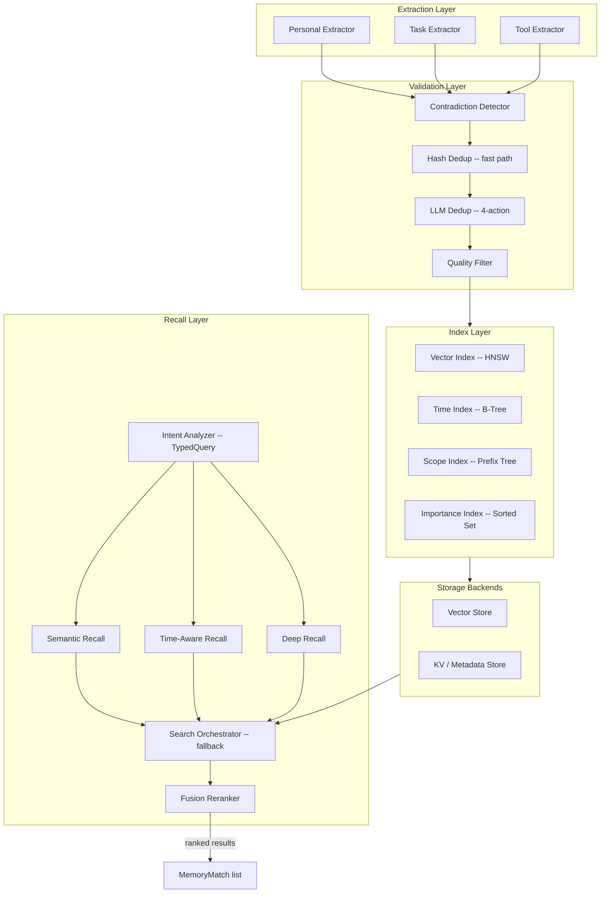
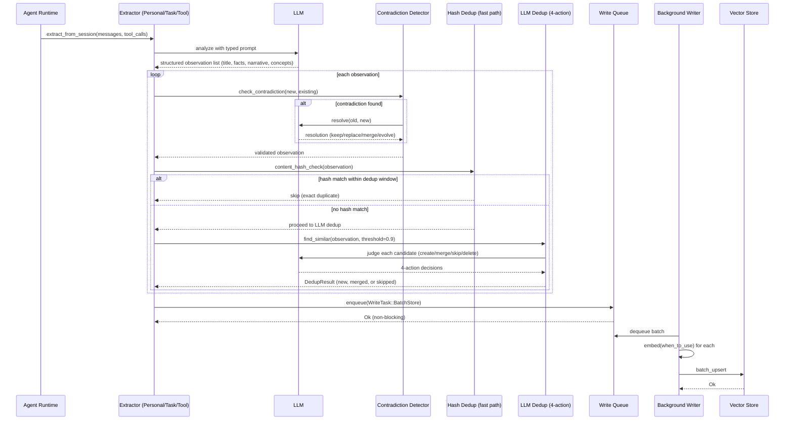
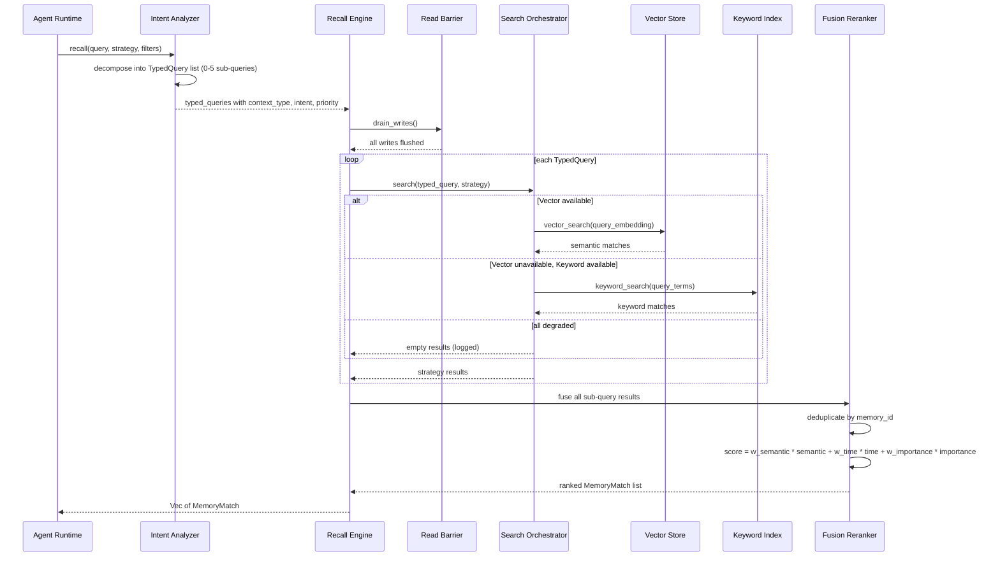
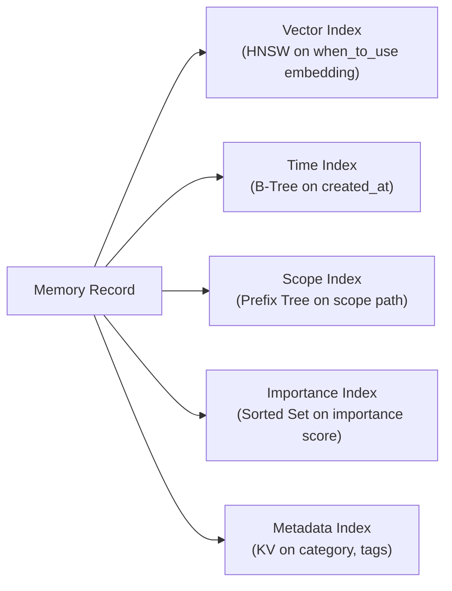

# Long-Term Memory Engine Design

> Persistent knowledge management for y-agent -- extraction, indexing, recall, and evolution of cross-session memories.

**Version**: v0.3
**Created**: 2026-03-05
**Updated**: 2026-03-08
**Status**: Draft
**Depends on**: [Memory Architecture Design](./memory-architecture.md)

---

## TL;DR

The Long-Term Memory Engine persists three categories of knowledge -- **Personal** (user preferences and observations), **Task** (success/failure/comparative patterns), and **Tool** (usage statistics and best practices) -- enabling the agent to reuse learned experience across sessions and tasks. Knowledge is **extracted** from conversations and tool calls via LLM-driven analysis into **structured observations** (typed schema with title, facts, narrative, concepts, and files_modified), **indexed** along four dimensions (vector embedding, timestamp, importance score, scope path), and **recalled** through composable strategies: semantic-only, time-aware, importance-weighted, or deep multi-round retrieval with **intent-aware query decomposition**. Deduplication uses a **two-phase approach**: a zero-cost content-hash fast path catches exact duplicates at write time, followed by an LLM-judged **4-action model** (create/merge/skip/delete) for semantic dedup. Recall supports **multi-strategy search with graceful fallback** (Vector -> Hybrid -> Keyword) to ensure retrieval availability even when subsystems degrade. Writes are non-blocking (enqueued to a background worker); reads go through a **Read Barrier** that drains pending writes first.

---

## Background and Goals

### Background

An AI agent that cannot remember past interactions is forced to re-learn user preferences, repeat failed strategies, and ignore successful patterns. Long-term memory closes this gap by persisting reusable knowledge extracted from each session. The design draws on:

- **ReMe**: Four-tier memory classification with structured extraction prompts.
- **OpenFang**: Multi-index storage (SQLite + vector + knowledge graph) with background writes.
- **CrewAI**: Unified Memory API with LLM-driven analysis for quality scoring.

### Goals

| Goal | Measurable Criteria |
|------|---------------------|
| **Automatic extraction** | Extract relevant memories from every completed session without manual intervention |
| **Multi-dimensional retrieval** | Recall supports semantic, temporal, importance, and scope filters in any combination |
| **Duplicate-free** | Semantic similarity > 0.9 triggers deduplication (merge or update) |
| **Contradiction resolution** | Conflicting memories are detected and resolved (via LLM or time-based heuristics) |
| **Time decay** | Memory importance decays with configurable half-life; stale memories lose rank naturally |
| **Low write latency** | `remember()` returns in < 1 ms (enqueue only); actual persistence is background |

### Non-Goals

- Not a general-purpose knowledge base or document store.
- Not a replacement for external RAG systems (Notion, GitHub, etc.) -- those integrate via MCP.
- Not responsible for context-window management (that is Short-Term Memory's job).

### Assumptions

1. An embedding model (e.g., `text-embedding-3-small`, 1536 dims) is available with < 200 ms latency.
2. LLM calls for extraction and conflict resolution use a cost-efficient model (e.g., `gpt-4o-mini`).
3. Memory volume per workspace stays under 100K entries for v0 (no sharding needed).
4. The `when_to_use` field is the primary embedding target; `content` is stored as payload but not embedded.

### Design Principles

| Principle | Origin | Application |
|-----------|--------|-------------|
| Structured extraction | ReMe | LLM extracts memories into typed schemas (Personal/Task/Tool) with explicit `when_to_use` |
| Multi-path recall | ReMe, OpenFang | Semantic, time, and importance paths run independently then fuse results |
| Background writes | OpenFang, CrewAI | Write queue decouples extraction from persistence; Read Barrier ensures consistency |
| Importance decay | Original | Exponential half-life decay prevents unbounded growth of "important" memories |
| Contradiction-aware | ReMe | New observations are checked against existing memories before insertion |
| Two-phase deduplication | Claude-Mem + OpenViking | Content-hash fast path (zero LLM cost) + LLM-judged 4-action model (create/merge/skip/delete) for semantic dedup |
| Intent-aware retrieval | OpenViking | Query decomposed into typed sub-queries with context_type and priority for targeted multi-query recall |
| Graceful search fallback | Claude-Mem | Multi-strategy search with automatic degradation (Vector -> Hybrid -> Keyword) for resilience |
| Structured extraction | Claude-Mem | Extraction produces typed observation schemas (title, facts, narrative, concepts, files) for richer indexing |

---

## Scope

### In Scope

- Three memory type schemas: Personal, Task, Tool
- LLM-driven extraction pipelines for each type
- Contradiction detection and resolution (keep-old / replace / merge / time-evolution / context-dependent)
- Multi-dimensional index: vector (HNSW), time (B-tree), scope (prefix tree), importance (sorted set)
- Recall strategies: SemanticOnly, TimeAware, ImportanceWeighted, Deep (multi-round), Custom
- Fusion reranking across recall paths
- Two-phase deduplication: content-hash fast path + LLM-judged 4-action semantic dedup
- Intent-aware query decomposition (TypedQuery) for multi-query recall
- Multi-strategy search with graceful fallback (Vector -> Hybrid -> Keyword)
- Structured observation schema for extraction output
- Time-decay background job
- Vectorization using `when_to_use` field
- VectorStore trait abstraction with Qdrant default implementation

### Out of Scope

- Knowledge Graph construction (Phase 2)
- User-facing memory editing UI
- Embedding model training or selection logic
- Session history persistence (handled by Session Store)
- Short-term context compression (handled by Short-Term Memory Engine)

---

## High-Level Design

### Component Overview

> **Diagram type rationale**: Flowchart shows the two main data paths (write via extraction/validation/index, read via recall/fusion) and their shared storage layer.
>
> **Legend**: Extraction Layer produces structured observations; Validation Layer applies two-phase dedup (hash then LLM) and filters; Index Layer maintains searchable structures; Recall Layer decomposes intent, executes search with fallback, and fuses results.

---

## Key Flows / Interactions

### Memory Extraction Flow (Write Path)

> **Diagram type rationale**: Sequence diagram captures the temporal flow of extraction, validation, and asynchronous persistence.
>
> **Legend**: Dashed return arrows = non-blocking responses; the `alt` block handles the contradiction branch.

### Memory Recall Flow (Read Path)

> **Diagram type rationale**: Sequence diagram shows the intent decomposition, strategy-with-fallback execution, and fusion pipeline.
>
> **Legend**: Intent Analyzer decomposes a query into typed sub-queries. Search Orchestrator tries Vector first, falls back to Keyword. Fusion Reranker merges and deduplicates all sub-query results.

---

## Data and State Model

### Three Memory Categories

#### Personal Memory

Captures observations about the user: identity, preferences, habits, emotions, feedback.

| Field | Description |
|-------|-------------|
| `target` | Observation subject (username or entity) |
| `category` | Profile / Preference / Habit / Emotion / Feedback |
| `confidence` | LLM-assigned confidence (0.0 -- 1.0) |
| `sentiment` | Positive / Negative / Neutral |
| `reflection_subject` | Optional higher-level reflection topic |

Extraction prompt instructs the LLM to identify only **explicitly stated** user information, avoiding over-inference. Output is a structured JSON array with at most 10 observations per session.

#### Task Memory

Captures reusable strategies and lessons from task execution.

| Field | Description |
|-------|-------------|
| `pattern_type` | Success (with success_rate, sample_count) / Failure (with error_type, root_cause) / Comparative (option_a, option_b, recommendation, context) |
| `trajectory_id` | Links back to the task execution trace |
| `task_type` | Debug / Implement / Refactor / etc. |
| `tools_used` | List of tools involved |
| `user_rating` | Optional 1-5 star rating from user feedback |

Extraction runs three parallel pipelines: success extractor, failure extractor, and comparative extractor. Results pass through quality filtering and deduplication before storage.

#### Tool Memory

Captures tool usage patterns, aggregated statistics, and best practices.

| Field | Description |
|-------|-------------|
| `tool_name` | Name of the tool |
| `call_results` | Recent call history (input, output, success, latency, optional LLM quality score) |
| `avg_success_rate` | Running average across all recorded calls |
| `avg_time_cost_ms` | Running average latency |
| `best_practices` | LLM-generated usage guide (updated periodically) |
| `common_errors` | LLM-generated list of frequent mistakes |

New tool call results are appended in real time. Periodically (or when call count reaches a threshold), the engine invokes an LLM to regenerate the `best_practices` and `common_errors` summaries.

### Multi-Dimensional Index

> **Diagram type rationale**: Flowchart illustrates the fan-out from a single memory record to multiple index structures.
>
> **Legend**: Each index supports a different recall dimension; recall strategies compose these indexes as needed.

### Recall Strategies

| Strategy | Indexes Used | Behavior |
|----------|-------------|----------|
| **SemanticOnly** | Vector | Pure cosine similarity; fastest |
| **TimeAware** | Vector + Time | Fuses semantic score with time score (exponential decay or intent-based) |
| **ImportanceWeighted** | Vector + Importance | Boosts high-importance memories; optionally applies time decay |
| **Deep** | Vector + Scope + (LLM) | Up to 3 rounds: basic search, scope expansion, LLM-generated sub-queries |
| **Custom** | All | Caller specifies weights for semantic, time, and importance dimensions |

### Structured Observation Schema

All extraction pipelines (Personal, Task, Tool) produce output conforming to a **structured observation schema** before storage. This enriches the memory record with multiple retrieval surfaces beyond raw content.

| Field | Type | Description |
|-------|------|-------------|
| `observation_type` | Enum | The extraction category: Personal, Task (Success/Failure/Comparative), Tool |
| `title` | String | Short descriptive title (used with `when_to_use` for indexing) |
| `facts` | Vec<String> | Discrete factual statements extracted from the observation |
| `narrative` | String | Free-text summary of the observation context |
| `concepts` | Vec<String> | Key concepts and domain terms (used for keyword-level retrieval) |
| `files_modified` | Vec<String> | File paths involved (for Task and Tool types) |
| `confidence` | f32 | LLM-assigned extraction confidence (0.0--1.0) |

The structured schema ensures that extraction output is consistent across memory types and provides multiple indexing dimensions (title for semantic, facts for factual recall, concepts for keyword matching). The `facts` field is particularly valuable for contradiction detection -- individual facts can be compared rather than entire narratives.

### Two-Phase Deduplication

Deduplication uses a two-phase approach to balance cost and precision:

**Phase 1: Content-Hash Fast Path (zero LLM cost)**

| Property | Detail |
|----------|--------|
| **Hash input** | `SHA-256(memory_type + title + narrative)` |
| **Dedup window** | Configurable, default 60 seconds |
| **Action** | If hash matches an existing memory within the time window, skip insertion |
| **Purpose** | Catches exact duplicates from retries, duplicate events, or rapid re-extraction |
| **Cost** | Zero (hash computation only) |

**Phase 2: LLM-Judged 4-Action Semantic Dedup**

For observations that pass the hash fast path, the engine queries the vector store for similar memories (cosine similarity > 0.9) and presents each candidate pair to an LLM for judgment:

| Action | When Applied | Effect |
|--------|-------------|--------|
| **Create** | New observation is genuinely novel | Insert as new memory record |
| **Merge** | New observation extends or updates an existing memory | Combine content; update `when_to_use` and `importance`; keep the higher score |
| **Skip** | New observation is semantically redundant | Discard; increment `access_count` on existing |
| **Delete** | New observation supersedes and invalidates an existing memory | Remove old memory; insert new |

The LLM receives both the new observation and each candidate (up to 5 candidates) with a structured prompt requesting one of the four actions per candidate. If the LLM call fails, the engine falls back to the simpler heuristic: insert if similarity < 0.9, merge if similarity >= 0.9.

### Intent-Aware Query Decomposition (TypedQuery)

Before recall execution, an optional **Intent Analyzer** decomposes a natural-language query into 0-5 typed sub-queries, each targeting a specific memory dimension. This prevents compound queries (e.g., "how did we handle auth errors last time and what tools worked best?") from being evaluated as a single opaque embedding.

| TypedQuery Field | Type | Description |
|-----------------|------|-------------|
| `context_type` | Enum (Personal / Task / Tool / Experience / Any) | Which memory category to search |
| `intent` | Enum (FactLookup / PatternRecall / ToolDiscovery / ExperienceReplay) | The retrieval intent |
| `query_text` | String | The refined sub-query text |
| `priority` | f32 (0.0--1.0) | Relative importance for result fusion |

The Intent Analyzer is implemented as an LLM call with a structured output schema. For simple queries (single intent, single type), the analyzer returns the original query as a single TypedQuery with `priority = 1.0`. For compound queries, it decomposes and assigns priorities.

The analyzer is optional and controlled by the recall strategy: Deep recall always uses it; other strategies use it when `intent_analysis = true` is set in the recall request. When disabled, the raw query is passed directly to the search engine.

### Search Orchestrator (Multi-Strategy Fallback)

The Search Orchestrator wraps the recall execution with a strategy-selection and fallback mechanism. This ensures that retrieval continues to function when individual subsystems (vector store, keyword index) degrade.

| Strategy | Primary Path | Fallback Path | When Used |
|----------|-------------|---------------|-----------|
| **VectorFirst** | Vector ANN search | Keyword search via metadata index | Default for SemanticOnly strategy |
| **HybridFusion** | Vector + Keyword in parallel, RRF fusion | Vector-only or Keyword-only if one path fails | Default for TimeAware, ImportanceWeighted strategies |
| **KeywordOnly** | Keyword search via metadata/scope index | Empty results (no further fallback) | When embedding service is completely unavailable |
| **DeepWithExpansion** | Vector + Keyword + LLM sub-queries (up to 3 rounds) | Standard Hybrid if LLM unavailable | Default for Deep strategy |

Fallback triggers:

| Condition | Action |
|-----------|--------|
| Vector store returns error or times out (> 200 ms) | Switch to Keyword path; log degradation event |
| Keyword index unavailable | Switch to Vector-only; log degradation event |
| Both paths fail | Return empty results; emit `ltm.recall.fallback_exhausted` metric |
| LLM sub-query generation fails (Deep strategy) | Proceed with Round 1 results only; log and continue |

The orchestrator emits `ltm.recall.strategy_used` and `ltm.recall.fallback_triggered` metrics for observability.

### Fusion Reranking

When multiple recall paths or sub-queries produce results, the Fusion Reranker merges them:

1. Collect all matches into a map keyed by `memory_id`.
2. For matches from different TypedQuery sub-queries, weight each by the sub-query's `priority`.
3. For each match, compute: `final_score = w_semantic * semantic_score + w_time * time_score + w_importance * importance_score`.
4. Sort by `final_score` descending; truncate to the requested limit.

Default weights: semantic = 0.6, time = 0.2, importance = 0.2.

---

## Failure Handling and Edge Cases

| Scenario | Handling |
|----------|----------|
| **LLM extraction returns malformed JSON** | Parse with lenient mode; fall back to raw text insertion with low confidence |
| **Contradiction resolution LLM call fails** | Default to TimeEvolution (keep both; mark the newer one as "updated from" the older) |
| **Duplicate detection finds > 5 near-duplicates** | Batch-merge into a single consolidated memory; log a warning for review |
| **Embedding service rate-limited** | Exponential backoff with jitter; buffer un-embedded memories in the write queue |
| **Vector store returns zero results** | Search Orchestrator falls back to Keyword path; if Keyword also returns zero, return empty list |
| **LLM dedup call fails** | Fall back to cosine-similarity heuristic: insert if < 0.9, merge if >= 0.9 |
| **Intent Analyzer LLM call fails** | Pass raw query as single TypedQuery with priority 1.0; log warning |
| **Vector store completely unavailable** | Search Orchestrator switches to KeywordOnly strategy; emit degradation alert |
| **Time decay reduces all importance to near-zero** | Floor importance at 0.05 to keep memories discoverable; prune only on explicit garbage-collection |
| **Extraction produces > 10 memories from one session** | Truncate to top 10 by confidence; log the overflow for tuning the extraction prompt |

---

## Security and Permissions

| Control | Description |
|---------|-------------|
| **Scope-based visibility** | Recall queries only return memories whose scope overlaps with the caller's scope |
| **Workspace isolation** | All indexes are partitioned by `workspace_id`; no cross-workspace leakage |
| **Extraction content filtering** | The extraction prompt explicitly instructs the LLM to skip secrets, credentials, and PII unless the user opts in |
| **No raw storage of secrets** | Memory content is plain text; secrets (API keys, tokens) must not be stored. A future phase adds encryption at rest. |
| **Audit trail** | Every store, delete, and merge operation is logged with timestamp, caller, and affected memory IDs |

---

## Performance and Scalability

| Dimension | Target | Approach |
|-----------|--------|----------|
| **Extraction throughput** | Process one session's memories in < 5 s | Parallel extraction for Personal/Task/Tool; batch embedding |
| **Write latency** | < 1 ms for `remember()` | Enqueue only; background worker handles persistence |
| **Recall latency (local)** | < 50 ms p99 | HNSW index; LRU cache for hot memories; query result cache (5-min TTL) |
| **Deep recall latency** | < 500 ms p99 (up to 3 rounds) | Early exit if confidence threshold met in round 1 |
| **Storage capacity** | 100K memories per workspace | Qdrant handles this scale with a single node; periodic pruning of decayed entries |
| **Batch embedding** | Reduce API calls by 5-10x | Accumulate `when_to_use` texts; single batch call per extraction cycle |

---

## Observability

| Signal | Metrics / Events |
|--------|-----------------|
| **Extraction** | `ltm.extraction.count` (by type), `ltm.extraction.latency_ms`, `ltm.extraction.confidence_avg` |
| **Contradiction** | `ltm.contradiction.detected`, `ltm.contradiction.resolution` (by action type) |
| **Deduplication** | `ltm.dedup.hash_skipped`, `ltm.dedup.llm_create`, `ltm.dedup.llm_merge`, `ltm.dedup.llm_skip`, `ltm.dedup.llm_delete`, `ltm.dedup.llm_fallback` |
| **Intent Analysis** | `ltm.intent.queries_decomposed`, `ltm.intent.subqueries_generated`, `ltm.intent.latency_ms` |
| **Recall** | `ltm.recall.latency_ms`, `ltm.recall.results_count`, `ltm.recall.top_score`, `ltm.recall.strategy_used`, `ltm.recall.fallback_triggered` |
| **Decay** | `ltm.decay.run_count`, `ltm.decay.memories_updated` |
| **Capacity** | `ltm.total_memories`, `ltm.memories_by_type`, `ltm.storage_size_bytes` |
| **Errors** | `ltm.errors.extraction_failed`, `ltm.errors.embed_failed`, `ltm.errors.recall_failed` |

---

## Rollout and Rollback

### Phased Rollout

| Phase | Scope | Exit Criteria |
|-------|-------|--------------|
| **Phase 0 (MVP)** | Personal extraction + SemanticOnly recall + local Qdrant | Memories extracted from test sessions are retrievable with > 0.7 relevance |
| **Phase 1** | Task and Tool extraction; TimeAware and Deep recall; time decay | All three memory types populated; deep recall outperforms semantic-only on a benchmark set |
| **Phase 2** | Comparative patterns; fusion reranking; contradiction resolution | Contradictions detected and resolved in integration tests |
| **Phase 3** | Performance hardening; pruning; Knowledge Graph (future) | p99 recall < 50 ms at 100K memories |

### Rollback Strategy

- **Extraction can be disabled** per memory type via config without affecting existing stored memories.
- **Recall strategy** defaults to SemanticOnly if advanced strategies are disabled.
- **Vector store data** is append-only (upsert); rolling back extraction logic does not corrupt existing data.
- **Time decay** can be paused by setting `enabled = false`; importance scores freeze at their current values.

---

## Alternatives and Trade-offs

| Decision | Chosen | Rejected | Rationale |
|----------|--------|----------|-----------|
| **Embedding target** | `when_to_use` | Full `content` | `when_to_use` is short and retrieval-focused; embedding full content wastes vector dimensions on noise |
| **Three memory types** | Personal / Task / Tool | Single generic type | Typed schemas enable specialized extraction prompts and recall behaviors per category |
| **Contradiction handling** | LLM-based resolution with heuristic fallback | Always-replace or always-keep | Neither extreme is correct; LLM resolution handles nuance while heuristics (time-based) provide a safe fallback |
| **Deep recall rounds** | Max 3 rounds | Unbounded iterative | Bounding iterations prevents runaway latency; 3 rounds covers scope expansion + sub-query generation |
| **Dedup threshold** | 0.9 cosine similarity | 0.8 or 0.95 | 0.9 balances catching true duplicates vs. accidentally merging distinct but related memories |
| **Dedup approach** | Two-phase (hash + LLM 4-action) | Hash-only, LLM-only, or cosine-threshold-only | Hash catches exact dupes at zero cost; LLM handles semantic overlaps precisely; combined approach is both cheap and accurate |
| **LLM dedup actions** | 4-action model (create/merge/skip/delete) | Binary insert/skip | 4 actions handle nuanced scenarios (evolving knowledge, superseded facts) that binary decisions miss |
| **Intent decomposition** | Optional LLM-based TypedQuery | Single-query pass-through | Compound queries benefit from decomposition; simple queries skip it for latency |
| **Search fallback** | Multi-strategy with automatic degradation | Single strategy, fail on error | Graceful degradation keeps retrieval functional during partial outages |
| **Decay model** | Exponential with configurable half-life | Linear decay or no decay | Exponential is well-studied and tunable; no decay leads to unbounded importance accumulation |

---

## Open Questions

| # | Question | Owner | Due Date |
|---|----------|-------|----------|
| 1 | What is the optimal extraction prompt temperature for each memory type? | Memory team | 2026-04-15 |
| 2 | Should Tool Memory's `best_practices` summary be regenerated on every N calls or on a time schedule? | Memory team | 2026-04-01 |
| 3 | How to handle extraction from multi-modal sessions (images, audio)? | Memory team | 2026-05-01 |
| 4 | Should users be able to pin memories (exempt from time decay)? | Product / Memory team | 2026-04-15 |
| 5 | What minimum `confidence` threshold should be applied before storing a Personal memory? | Memory team | 2026-04-01 |

---

## Decision Log

| Date | Decision | Context |
|------|----------|---------|
| 2026-03-05 | Use three typed memory categories (Personal/Task/Tool) rather than a single generic store | Different extraction logic and recall behavior per type justifies the schema split |
| 2026-03-05 | Embed `when_to_use` rather than `content` for vector indexing | Tested internally; shorter retrieval-oriented text produces better cosine similarity scores |
| 2026-03-05 | Default recall strategy is Deep (3 rounds) | Provides highest recall quality for the typical low-QPS personal-agent workload |
| 2026-03-05 | Contradiction resolution defaults to TimeEvolution when LLM is unavailable | Preserves both memories rather than silently dropping one |
| 2026-03-06 | Set deduplication threshold at 0.9 cosine similarity | Empirically balances false positives vs. false negatives on a sample dataset |
| 2026-03-08 | Adopt two-phase dedup: content-hash fast path + LLM 4-action model | Hash catches exact dupes at zero LLM cost; LLM 4-action (create/merge/skip/delete) handles semantic overlaps precisely. Inspired by Claude-Mem (hash) and OpenViking (LLM-judged actions) |
| 2026-03-08 | Add structured observation schema for extraction output | Typed schema (title/facts/narrative/concepts/files) provides richer indexing surfaces and enables per-fact contradiction detection. Inspired by Claude-Mem's observation structure |
| 2026-03-08 | Add intent-aware query decomposition (TypedQuery) for recall | Compound queries decomposed into typed sub-queries with context_type and priority; prevents single-embedding bottleneck. Inspired by OpenViking's IntentAnalyzer |
| 2026-03-08 | Add Search Orchestrator with multi-strategy fallback | Automatic degradation (Vector -> Hybrid -> Keyword) ensures retrieval availability when subsystems degrade. Inspired by Claude-Mem's SearchOrchestrator pattern |

---

## Changelog

| Date | Version | Changes |
|------|---------|---------|
| 2026-03-05 | v0.1 | Initial draft with three memory types, extraction prompts, multi-dimensional index, recall strategies, and evolution mechanisms |
| 2026-03-06 | v0.2 | Restructured to standard design doc format; replaced code-heavy sections with high-level descriptions and tables; added Mermaid diagrams; added required sections (failure handling, security, performance, observability, rollout, alternatives, open questions, decision log) |
| 2026-03-08 | v0.3 | Added four features from competitive analysis (OpenViking, Claude-Mem, EdgeQuake): (1) two-phase deduplication (content-hash fast path + LLM 4-action semantic dedup); (2) structured observation schema for extraction output; (3) intent-aware query decomposition (TypedQuery) with optional LLM-based Intent Analyzer; (4) Search Orchestrator with multi-strategy fallback (Vector -> Hybrid -> Keyword). Updated component diagram, write/read flow diagrams, observability metrics, failure handling, alternatives table, and decision log. See [memory-context-feature-analysis.md](../research/memory-context-feature-analysis.md) for competitive analysis. |
