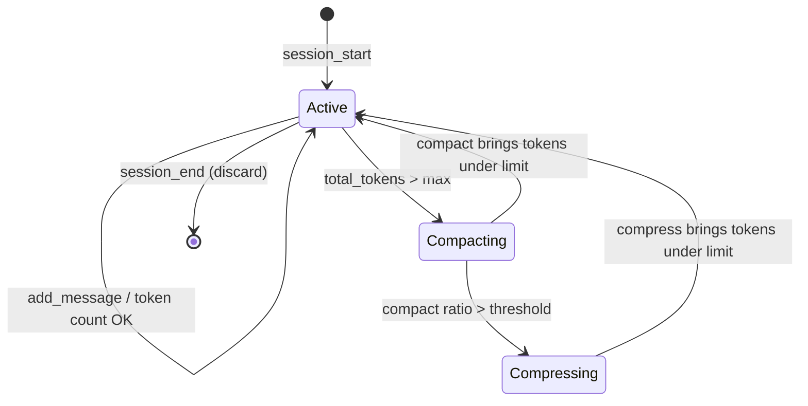
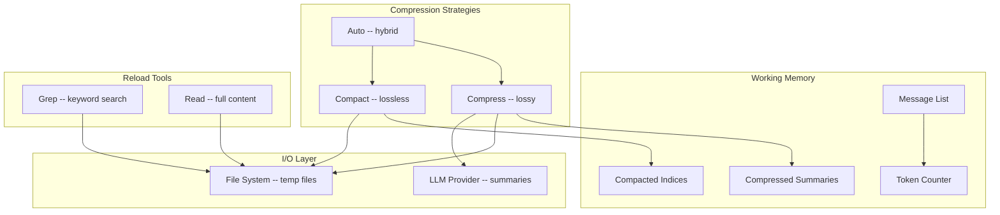
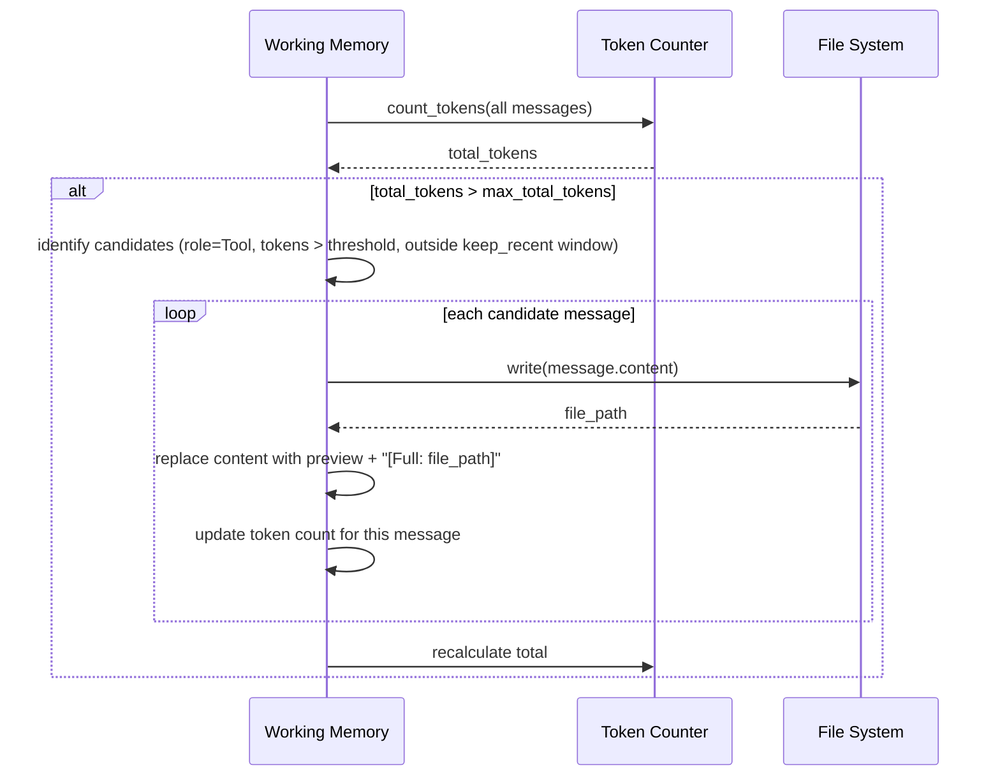
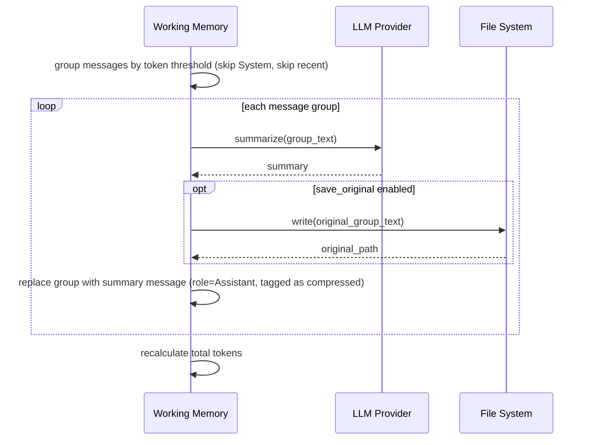
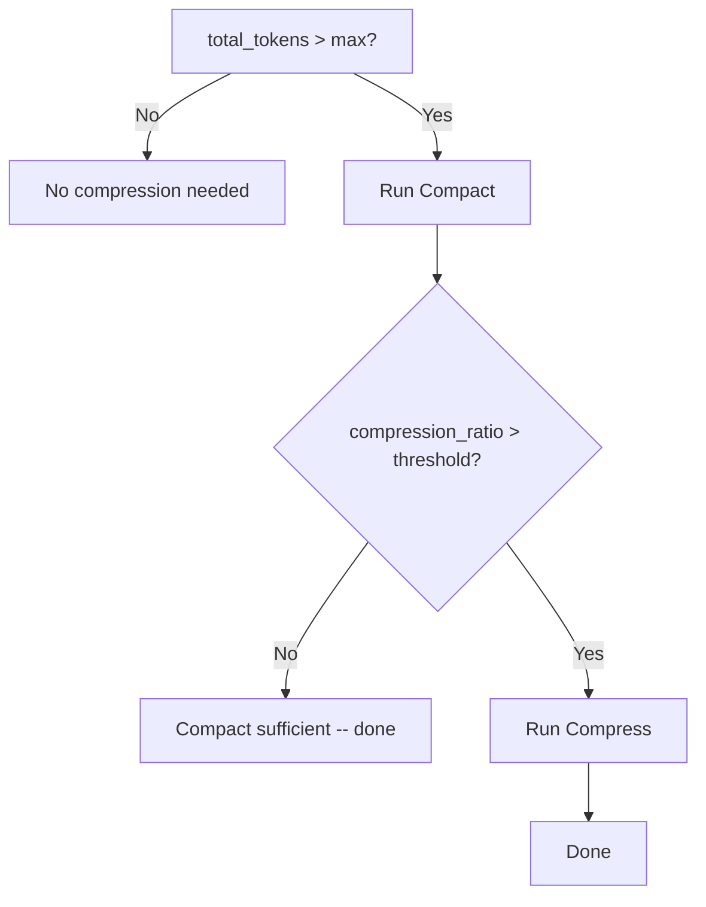
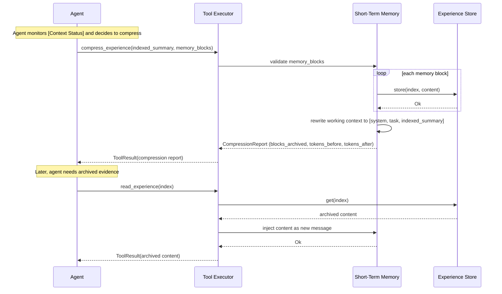

# Short-Term Memory Engine Design

> Context window management, intelligent compression, and indexed experience archival for y-agent's single-session working memory.

**Version**: v0.3
**Created**: 2026-03-05
**Updated**: 2026-03-06
**Status**: Draft
**Depends on**: [Memory Architecture Design](./memory-architecture.md)

---

## TL;DR

The Short-Term Memory Engine keeps the conversation context within the model's token limit without silently dropping information. It provides four compression modes: **Compact** (lossless -- offloads large tool outputs to disk, retains a short preview and a file-path hint for on-demand reload), **Compress** (lossy -- groups older messages and replaces them with LLM-generated summaries), **IndexedExperience** (agent-controlled -- the agent archives full-fidelity artifacts into an external **Experience Store** under stable indices and rewrites its working context to a compact structured **indexed summary**; later, the agent retrieves exact evidence by dereferencing an index via `read_experience`), and **Auto** (runs Compact first; if the compression ratio remains above a threshold, continues with Compress; IndexedExperience is always agent-initiated and runs alongside Auto). Offloaded content is retrievable via **grep** (keyword search across disk files), **read** (full reload of a specific file), and **read_experience** (exact key-based dereference from the Experience Store). Token counting uses tiktoken with incremental updates to avoid re-scanning the entire message list on every turn. The engine is session-scoped: it is created when a session starts, operates entirely in memory plus temporary files, and is discarded when the session ends.

The IndexedExperience mode is inspired by [Memex(RL)](../research/memex-rl.md). Unlike Compact and Compress which are system-triggered, IndexedExperience is agent-initiated: the agent decides when, what, and how to archive through the `compress_experience` / `read_experience` tools (see [tools-design.md](tools-design.md)). This makes context management an explicit, auditable agent action rather than a transparent system heuristic.

---

## Background and Goals

### Background

Large language models have a fixed context window. In agentic workflows, context can explode quickly: a single `FileRead` tool call may return megabytes of text, multi-step debugging accumulates thousands of lines of tool output, and batch operations (e.g., linting 100 files) produce output far exceeding any model's capacity. Naive truncation loses critical context; sliding-window approaches drop early decisions that later turns depend on. This engine solves the problem with a two-phase compression strategy inspired by:

- **ReMe**: Compact (lossless disk offload) + Compress (LLM summarization) dual strategy.
- **OpenClaw**: MEMORY.md compaction mechanism for simple file-based persistence.
- **LangChain**: Sliding window and summarization memory patterns.

### Goals

| Goal | Measurable Criteria |
|------|---------------------|
| **Never exceed context window** | `total_tokens <= context_window * (1 - safety_margin)` at all times |
| **Lossless first** | Compact (disk offload) is always attempted before Compress (LLM summary) |
| **On-demand reload** | Any offloaded content retrievable via grep or read within 100 ms |
| **Minimal LLM cost** | Compress invoked only when Compact alone cannot bring tokens under limit |
| **Fast token counting** | Incremental count; full recount only after compression events |
| **Transparent to agent** | Previews and path hints allow the agent to decide when to reload details |
| **Agent-controlled archival** | IndexedExperience allows the agent to archive and retrieve full-fidelity evidence via stable indices with < 1ms dereference latency |
| **Precise evidence recovery** | Archived content is retrievable verbatim; zero information loss for agent-archived entries |

### Non-Goals

- Not responsible for cross-session knowledge persistence (that is Long-Term Memory).
- Not a full-text search engine (grep is keyword-based, not semantic).
- Not a prompt assembly layer (Context Manager composes the final prompt from Working Memory + injected long-term memories).

### Assumptions

1. The model's context window size is known at session start (configured per model).
2. A safety margin of 15% is reserved for the model's response tokens.
3. Tool messages (role = Tool) are the primary compression targets; User and Assistant messages are compressed only as a last resort.
4. The LLM used for Compress summaries is a cost-efficient model (e.g., `gpt-4o-mini`), separate from the main conversation model.
5. Disk I/O for compacted files is negligible compared to LLM call latency.

### Design Principles

| Principle | Origin | Application |
|-----------|--------|-------------|
| Compact before Compress | ReMe | Lossless offload first; lossy summarization only when necessary |
| Preview + path hint | ReMe | Compacted messages leave a short preview and file path so the agent can decide to reload |
| Group-then-summarize | Original | Compress groups consecutive messages by token threshold before sending to LLM |
| Incremental counting | Original | Token count updated incrementally on message add; full recount only after compression |
| Session-scoped lifecycle | Original | Working Memory is ephemeral; created and destroyed with the session |
| Indexed archival with dereference | Memex(RL) | Full-fidelity content archived under stable indices; agent dereferences exact evidence on demand |
| Agent-controlled compression | Memex(RL) | Agent decides what/when/how to archive; compression is an explicit action, not a background heuristic |

---

## Scope

### In Scope

- `WorkingMemory` data structure: message list, compressed summaries, compacted indices, Experience Store, token bookkeeping
- Compact strategy: identify large tool messages, write to disk, replace with preview
- Compress strategy: group messages by token threshold, LLM summarization, replace group with summary
- IndexedExperience strategy: agent-initiated archival of full-fidelity artifacts into an in-memory Experience Store under stable indices; context rewritten to a structured indexed summary
- Auto mode: Compact first, then Compress if compression ratio exceeds threshold; IndexedExperience runs alongside (agent-initiated, not auto-triggered)
- Experience Store: session-scoped key-value store (index -> content) managed by agent through `compress_experience` / `read_experience` tools
- Grep: keyword search across compacted and compressed original files
- Read: full content reload from disk
- ReadExperience: exact key-based dereference from Experience Store
- Reload: restore a compacted message back into the active context
- Token counting via tiktoken (incremental and batch)
- Configuration: context window, safety margin, compact/compress/auto/indexed-experience parameters

### Out of Scope

- Prompt assembly (handled by Context Manager)
- Long-term memory injection into context (handled by Context Manager + Long-Term Memory Engine)
- Session history persistence to JSONL (handled by Session Store)
- Semantic search over offloaded content (grep is keyword-only in v0)

---

## High-Level Design

### Working Memory Lifecycle

> **Diagram type rationale**: State diagram captures the lifecycle transitions of Working Memory within a session.
>
> **Legend**: `Active` = normal operation; `Compacting` = disk offload in progress; `Compressing` = LLM summarization in progress. Transitions are triggered by token-count checks.

### Component Relationships

> **Diagram type rationale**: Flowchart shows module boundaries, data dependencies, and the relationship between strategies and I/O.
>
> **Legend**: WM = the core in-memory structure; Strategies operate on WM and produce side effects in I/O; Reload Tools read back from I/O.

---

## Key Flows / Interactions

### Compact Flow (Lossless Disk Offload)

> **Diagram type rationale**: Sequence diagram shows the step-by-step compact process including the candidate selection loop.
>
> **Legend**: Only Tool messages exceeding the token threshold and outside the `keep_recent_count` window are compacted.

### Compress Flow (LLM Summarization)

> **Diagram type rationale**: Sequence diagram shows the group-then-summarize pattern with optional original preservation.
>
> **Legend**: Groups are formed from consecutive non-System, non-recent messages whose cumulative tokens exceed the group threshold.

### Auto Mode Decision Flow

> **Diagram type rationale**: Flowchart shows the simple two-step decision tree of Auto mode.
>
> **Legend**: `compression_ratio` = tokens_after_compact / tokens_before_compact. A ratio above threshold (default 0.75) means Compact alone did not free enough space.

### IndexedExperience Flow (Agent-Controlled Archival)

Unlike Compact and Compress which are system-triggered, IndexedExperience is initiated by the agent through the `compress_experience` tool. The agent decides what to archive, how to index it, and what summary to keep in context. This makes context management an explicit, auditable agent action.

**Diagram type rationale**: Sequence diagram shows the agent-initiated compress and read cycle with the Experience Store.

**Legend**:
- The agent explicitly calls `compress_experience` to archive and `read_experience` to retrieve.
- Experience Store is an in-memory key-value map within the STM, scoped to the session.
- The working context is rewritten to contain only the system prompt, task instruction, and indexed summary.

#### Experience Store

The Experience Store is a session-scoped, in-memory key-value store that holds full-fidelity artifacts archived by the agent. It is owned and managed by the Short-Term Memory Engine.

| Property | Value |
|----------|-------|
| **Scope** | Session (destroyed when session ends) |
| **Storage** | In-memory HashMap; optionally backed by session temp directory for large entries |
| **Key** | Agent-assigned stable index (string, e.g., `ctx_repo_snapshot_001`) |
| **Value** | Archived content (string -- tool outputs, reasoning traces, code snippets) |
| **Access** | Exclusively through `compress_experience` (write) and `read_experience` (read) tools |
| **Capacity** | Configurable max entries (default 50) and max total bytes (default 1MB) |

#### Indexed Summary

When the agent calls `compress_experience`, the working context is replaced by an **indexed summary** -- a structured state containing:

1. **Progress state**: A concise description of current status, verified information, and planned next steps.
2. **Index map**: A set of `{index: description}` pairs where each index is a stable key in the Experience Store and each description is a short semantic summary of the archived content.

The indexed summary is compact (typically 200-500 tokens), enabling the agent to maintain situational awareness without carrying full evidence in context. When specific evidence is needed, the agent dereferences the relevant index via `read_experience`.

#### Comparison: Compression Strategies

| Dimension | Compact | Compress | IndexedExperience |
|-----------|---------|----------|-------------------|
| **Trigger** | System (token overflow) | System (after Compact) | Agent (explicit tool call) |
| **Information loss** | None (full content on disk) | Lossy (LLM summary) | None (full content in Experience Store) |
| **Context residue** | Preview + file path | Summary text | Structured indexed summary |
| **Recovery method** | grep / read (keyword) | Not recoverable | read_experience (exact index) |
| **Recovery precision** | Fuzzy (depends on keyword) | N/A | Exact (deterministic dereference) |
| **Agent control** | None | None | Full (what, when, how to index) |
| **LLM cost** | Zero | One LLM call per group | Zero (agent writes summary inline) |
| **Best for** | Large tool outputs | Older conversation history | Long-horizon tasks needing precise evidence recall |

---

## Data and State Model

### Working Memory Structure

| Field | Type | Description |
|-------|------|-------------|
| `session_id` | String | Owning session identifier |
| `messages` | Vec of Message | Ordered list of active messages (may include previews and summaries) |
| `compressed_summaries` | Vec of CompressedSummary | Metadata for each compression event |
| `compacted_indices` | Map (index -> CompactedMessage) | Tracks which messages have been offloaded |
| `experience_store` | ExperienceStore | Agent-managed key-value archive for indexed experience memory |
| `total_tokens` | usize | Cached token count for the entire message list |
| `config` | WorkingMemoryConfig | All tuning parameters |

### ExperienceStore

| Field | Type | Description |
|-------|------|-------------|
| `entries` | HashMap (String -> ExperienceEntry) | Stable index to archived content |
| `total_bytes` | usize | Current total size of all archived entries |
| `compression_count` | u32 | Number of compress_experience calls in this session |

### ExperienceEntry

| Field | Type | Description |
|-------|------|-------------|
| `index` | String | Stable key assigned by the agent |
| `content` | String | Full-fidelity archived content |
| `description` | String | Short semantic description (from the indexed summary) |
| `byte_size` | usize | Size of the content in bytes |
| `created_at` | i64 | When this entry was archived |
| `access_count` | u32 | Number of read_experience calls for this index |
| `last_accessed_at` | Option of i64 | Last dereference timestamp |

### Message

| Field | Type | Description |
|-------|------|-------------|
| `id` | String | Unique message identifier |
| `role` | Enum (System / User / Assistant / Tool) | Message role |
| `content` | Enum (Text / ToolCall / ToolResult / Multimodal) | Polymorphic content |
| `tokens` | usize | Estimated token count |
| `timestamp` | i64 | Creation time |
| `metadata` | Map | Extensible key-value pairs |

### CompactedMessage

| Field | Type | Description |
|-------|------|-------------|
| `message_id` | String | Original message ID |
| `preview` | String | First N characters of the original content |
| `full_path` | PathBuf | Disk path to the complete content |
| `preview_tokens` | usize | Token count of the preview |
| `full_tokens` | usize | Token count of the original content |

### CompressedSummary

| Field | Type | Description |
|-------|------|-------------|
| `id` | String | Summary identifier |
| `message_range` | (start, end) | Index range of original messages that were compressed |
| `summary` | String | LLM-generated summary text |
| `original_path` | Option of PathBuf | Disk path to original messages (if saved) |
| `compression_ratio` | f32 | summary_tokens / original_tokens |
| `tokens` | usize | Token count of the summary |

### Configuration Parameters

| Parameter | Default | Description |
|-----------|---------|-------------|
| `context_window` | 128,000 | Model's maximum token capacity |
| `safety_margin` | 0.15 | Fraction reserved for response generation |
| `max_total_tokens` | 108,800 | `context_window * (1 - safety_margin)` |
| `compact.max_tool_message_tokens` | 5,000 | Tool messages above this are compact candidates |
| `compact.keep_recent_count` | 10 | Most recent N messages are never compacted |
| `compact.preview_char_length` | 200 | Characters retained in the preview |
| `compress.group_token_threshold` | 2,000 | Token threshold for grouping messages |
| `compress.keep_recent_count` | 10 | Most recent N messages are never compressed |
| `compress.llm_model` | gpt-4o-mini | Model used for summarization |
| `auto.compact_ratio_threshold` | 0.75 | If Compact leaves ratio above this, trigger Compress |
| `auto.priority` | CompactFirst | Compact before Compress (vs. CompressFirst) |
| `indexed_experience.max_entries` | 50 | Maximum number of entries in the Experience Store |
| `indexed_experience.max_total_bytes` | 1,048,576 | Maximum total size of all archived entries (1MB) |
| `indexed_experience.max_entry_bytes` | 102,400 | Maximum size of a single archived entry (100KB) |
| `indexed_experience.summary_max_tokens` | 500 | Maximum tokens for the indexed summary |
| `store_dir` | .y-agent/working-memory | Directory for offloaded files |

---

## Failure Handling and Edge Cases

| Scenario | Handling |
|----------|----------|
| **Disk write failure during Compact** | Retry once; if still failing, skip this message (leave it in context uncompacted) and log error |
| **LLM unavailable during Compress** | Skip Compress step entirely; Compact alone provides partial relief. Log warning. |
| **LLM returns empty or nonsensical summary** | Discard the summary; keep the original messages uncompressed for this group |
| **Compacted file deleted externally** | Reload returns an error; the preview in context remains usable; log warning |
| **All messages are within keep_recent window** | No compression possible; return a report with zero compacted/compressed |
| **Single message exceeds entire context window** | Compact it immediately regardless of role; if still too large, truncate with a warning marker |
| **Token count estimation error** | Use a 10% buffer above the estimated count; re-count on discrepancy |
| **Grep finds no matches in offloaded files** | Return empty result; do not fall back to searching in-context messages (they are already visible) |
| **Experience Store entry limit reached** | Return error to agent with current entry count; agent should consolidate or remove stale entries |
| **read_experience with unknown index** | Return error listing available indices from the current indexed summary |
| **Agent provides malformed indexed summary** | Validate structure (must contain index map); reject with format guidance if invalid |
| **Experience Store total size exceeded** | Return error; agent must archive smaller blocks or consolidate existing entries |

---

## Security and Permissions

| Control | Description |
|---------|-------------|
| **Temporary file cleanup** | Compacted and compressed original files are deleted when the session ends |
| **File path validation** | Offloaded file paths are restricted to `store_dir`; no path traversal allowed |
| **No secrets in previews** | Preview generation truncates blindly by character count; if sensitive data appears in tool output, it may appear in previews. Users should avoid sending secrets through tool calls. |
| **Session isolation** | Each session's Working Memory and temp files are namespaced by `session_id` |
| **LLM prompt safety** | Compress prompts instruct the LLM to summarize factually; no user-controlled content is used as system-level instructions |

---

## Performance and Scalability

| Dimension | Target | Approach |
|-----------|--------|----------|
| **Compact latency** | < 50 ms for 10 messages | Parallel async file writes; no LLM calls |
| **Compress latency** | < 3 s per group | Use fast model (gpt-4o-mini); parallelize across groups |
| **Token counting** | < 1 ms per message | tiktoken encoder cached per model; incremental counting on add |
| **Grep latency** | < 100 ms across all offloaded files | Simple regex scan; files are small (individual tool outputs) |
| **Read latency** | < 10 ms per file | Single async file read |
| **Memory overhead** | < 10 MB per session | Messages are text; compacted content is on disk |
| **Disk usage** | Proportional to compacted content | Cleaned up on session end |

---

## Observability

| Signal | Metrics / Events |
|--------|-----------------|
| **Token tracking** | `stm.total_tokens`, `stm.max_total_tokens`, `stm.utilization_ratio` |
| **Compact** | `stm.compact.count`, `stm.compact.messages_offloaded`, `stm.compact.compression_ratio`, `stm.compact.latency_ms` |
| **Compress** | `stm.compress.count`, `stm.compress.groups_summarized`, `stm.compress.compression_ratio`, `stm.compress.latency_ms` |
| **Auto mode** | `stm.auto.strategy_used` (None / CompactOnly / CompactThenCompress) |
| **Reload** | `stm.grep.count`, `stm.read.count`, `stm.reload.count` |
| **IndexedExperience** | `stm.experience.compress_count`, `stm.experience.read_count`, `stm.experience.entries`, `stm.experience.total_bytes`, `stm.experience.tokens_saved` |
| **Errors** | `stm.errors.compact_failed`, `stm.errors.compress_failed`, `stm.errors.read_failed`, `stm.errors.experience_store_full` |
| **Session** | `stm.session.messages_total`, `stm.session.duration_s` |

---

## Rollout and Rollback

### Phased Rollout

| Phase | Scope | Exit Criteria |
|-------|-------|--------------|
| **Phase 0 (MVP)** | Compact only; basic token counting; file-based offload | Context never exceeds window in a 50-turn test session with large tool outputs |
| **Phase 1** | Compress (LLM summarization); Auto mode; grep and read reload | Auto mode correctly selects strategy; summaries preserve key decisions in manual review |
| **Phase 2** | Streaming compression for very large files; batch parallel writes | Compress handles 1 MB+ tool outputs without timeout |
| **Phase 3** | Semantic search over offloaded content (upgrade grep); cross-session summary reuse | Grep replaced with vector-based search for higher recall |

### Rollback Strategy

- **Compress can be disabled** via config (`default_mode = "compact"`); system falls back to Compact-only.
- **Auto mode** can be replaced with explicit Compact or Compress via config.
- **Offloaded files** are self-contained text; they remain readable regardless of engine version.
- **No schema migration needed** -- Working Memory is ephemeral and rebuilt each session.

---

## Alternatives and Trade-offs

| Decision | Chosen | Rejected | Rationale |
|----------|--------|----------|-----------|
| **Compression order** | Compact first, then Compress | Compress-only or Compress-first | Compact is fast (no LLM call), lossless, and often sufficient on its own. Starting with Compress wastes LLM budget and loses detail unnecessarily. |
| **Compact targets** | Tool messages only (by default) | All message roles | Tool messages are the primary source of context explosion. User and Assistant messages are typically short and contextually critical. |
| **Compress granularity** | Group-then-summarize | Per-message summary | Summarizing individual short messages is wasteful; grouping produces more coherent and cost-efficient summaries. |
| **Summary model** | gpt-4o-mini (fast, cheap) | Main conversation model | Summaries do not need frontier-level reasoning; a fast model reduces latency and cost by 10x. |
| **Token counter** | tiktoken (exact for OpenAI models) | Character-based estimation | Character heuristics drift by 20-30% on mixed-language content; tiktoken is exact for the target model family. |
| **Reload mechanism** | Grep (keyword) + Read (full file) | Automatic re-injection | Automatic re-injection risks re-inflating context; giving the agent control over when to reload is safer and more flexible. |
| **File format for offloaded content** | Plain text | JSON or structured format | Tool outputs are heterogeneous; plain text is universally readable and avoids serialization overhead. |

---

## Open Questions

| # | Question | Owner | Due Date |
|---|----------|-------|----------|
| 1 | Should the Compress summary prompt be customizable per agent persona or task type? | Memory team | 2026-04-15 |
| 2 | What is the optimal `group_token_threshold` for different model context sizes? | Memory team | 2026-04-01 |
| 3 | Should compressed summaries be stored in Long-Term Memory for cross-session reuse? | Memory team | 2026-04-15 |
| 4 | How should multi-modal content (images) be handled during Compact? | Memory team | 2026-05-01 |
| 5 | Should the agent be able to request a specific message for reload, or only use grep? | Product / Memory team | 2026-04-01 |
| 6 | Should Experience Store entries auto-promote to LTM on session end? What selection criteria? | Memory team | 2026-04-15 |
| 7 | Should the indexed summary format be structured (JSON) or free-form text? | Memory team | 2026-04-01 |
| 8 | How to handle compress_experience when the model is too weak to produce quality indexed summaries? Provide prompt templates? | Memory team | 2026-04-15 |

