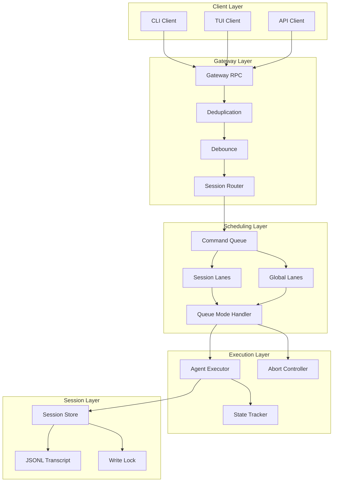
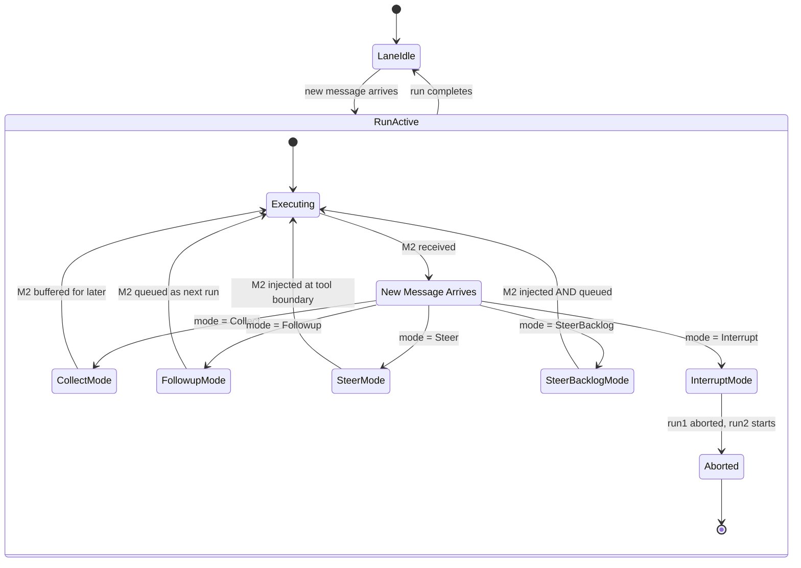
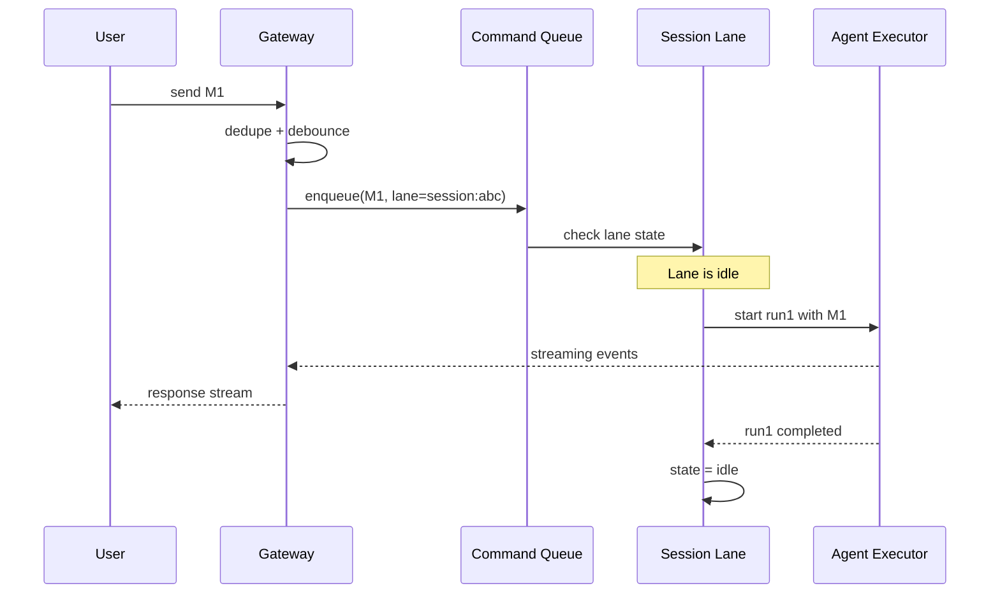
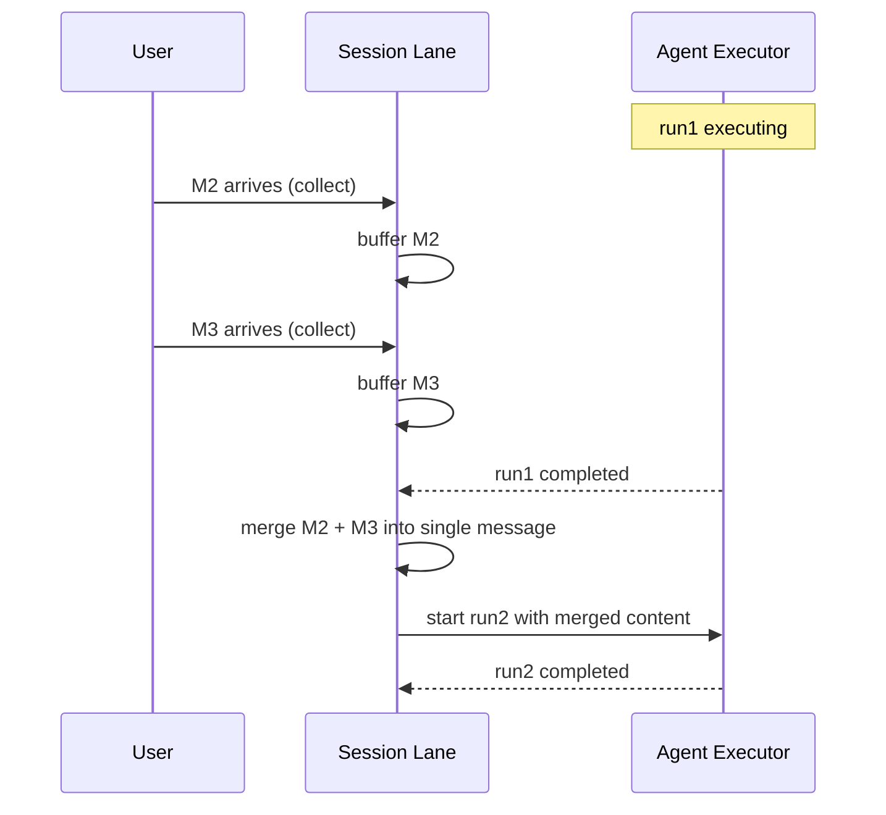

# Message Scheduling and Concurrency Control Design

> Intelligent message scheduling for multi-message scenarios in y-agent

**Version**: v0.2
**Created**: 2026-03-04
**Updated**: 2026-03-06
**Status**: Draft

---

## TL;DR

When users send multiple messages while the agent is still processing, naive handling leads to session history corruption, wasted resources, and poor user experience. This design introduces a **Session Lane** model that serializes runs within a session, combined with five **Queue Modes** (Collect, Followup, Steer, SteerBacklog, Interrupt) that control how incoming messages interact with active runs. Message deduplication and debounce at the gateway layer prevent duplicate and overly-rapid submissions. The system supports per-client and per-session queue mode configuration, enabling CLI to default to Collect mode, TUI to Steer mode, and API to Followup mode.

---

## Background and Goals

### Background

In practice, users frequently send additional messages while the agent is mid-execution. Without concurrency control:

1. **History corruption**: Multiple runs concurrently writing to the same session JSONL produces inconsistent history.
2. **Resource waste**: The agent continues executing outdated instructions when the user has already corrected course.
3. **Poor UX**: Users cannot interrupt or refine an active run, forcing them to wait for completion.
4. **State inconsistency**: Tool execution and model call states become difficult to track across concurrent runs.

Inspiration from established patterns (e.g., session lane serialization and steer-at-tool-boundary injection) informs this design.

### Goals

| Goal | Measurable Criteria |
|------|-------------------|
| **Session isolation** | Runs within the same session are strictly serialized; zero concurrent writes to the same JSONL |
| **Flexible scheduling** | 5 queue modes cover all common multi-message patterns |
| **User correction** | Steer mode injects corrections at the next tool boundary with < 500ms delay |
| **Low overhead** | Scheduling adds < 5ms latency to message processing |
| **Configurable** | Queue mode settable at global, client, and session levels |
| **Observable** | All scheduling decisions (enqueue, steer, abort) emit structured events |

### Assumptions

1. Each session has a unique `SessionKey` used to identify its lane.
2. A "Run" is a complete agent execution cycle: user message -> agent reasoning -> tool calls -> final response.
3. Steer injection happens at tool call boundaries (between tool calls, not mid-call).
4. Global lanes exist for system-level tasks (compaction, maintenance) that are not session-scoped.

---

## Scope

### In Scope

- Command Queue for routing messages to session and global lanes
- Session Lane with strict per-session serialization
- Five Queue Modes: Collect, Followup, Steer, SteerBacklog, Interrupt
- Active Run lifecycle management with abort controller
- Message deduplication (idempotency key based)
- Message debounce (configurable delay, per-session)
- Per-client and per-session queue mode configuration
- Scheduling events and metrics

### Out of Scope

- Agent execution engine internals (only the scheduling boundary is defined here)
- Session persistence format (see [context-session-design.md](context-session-design.md))
- Client-side UI for queue status display (see [client-layer-design.md](client-layer-design.md))
- Distributed scheduling across multiple server instances

---

## High-Level Design

### Architecture Overview



**Diagram rationale**: Flowchart chosen to show the layered architecture and data flow from client through gateway, scheduling, execution, and session storage.

**Legend**:
- **Gateway Layer**: Pre-processes messages (dedupe, debounce) before routing to the correct session lane.
- **Scheduling Layer**: Command Queue distributes messages to Session or Global Lanes; Queue Mode Handler applies the configured scheduling policy.
- **Execution Layer**: Agent Executor runs the agent; Abort Controller enables cancellation and steer injection.

### Core Concepts

| Concept | Description |
|---------|-------------|
| **Run** | A complete agent execution cycle from user message to final response |
| **Session Lane** | Per-session execution channel; runs within a lane are strictly serialized |
| **Global Lane** | System-level execution channel for cross-session tasks (compaction, maintenance) |
| **Command Queue** | Central dispatcher routing incoming commands to the appropriate lane |
| **Queue Mode** | Policy governing how new messages interact with an active run |
| **Abort Controller** | Signal mechanism enabling run cancellation and message injection |

### Queue Modes



**Diagram rationale**: State diagram chosen to show the lifecycle of a session lane and how each queue mode handles a new message arriving during an active run.

**Legend**:
- **LaneIdle**: No active run; next message starts immediately.
- **RunActive**: A run is in progress; incoming messages are handled according to the configured queue mode.

#### Queue Mode Details

| Mode | Behavior | When Run Completes | Best For |
|------|----------|-------------------|----------|
| **Collect** | Buffer new messages; do not start new runs. When the active run completes, merge all buffered messages into a single followup run. | Followup run with merged content | Default chat; user sends rapid corrections |
| **Followup** | Queue each new message as an independent run. Execute strictly in FIFO order. | Next queued run starts | API/batch; each message is an independent instruction |
| **Steer** | Inject the new message into the active run at the next tool boundary. Cancel pending tool calls; rebuild prompt with injected content. | Normal completion | TUI; user course-corrects the agent mid-execution |
| **SteerBacklog** | Inject into the active run (like Steer) AND queue as a separate followup run. | Followup run with same message | Complex tasks; immediate correction + dedicated processing |
| **Interrupt** | Abort the active run immediately. Start a new run with the new message. | N/A (run was aborted) | User abandons current task entirely |

#### Per-Client Defaults

| Client | Default Queue Mode | Rationale |
|--------|-------------------|-----------|
| CLI | Collect | Users type fast; merge rapid corrections into one followup |
| TUI | Steer | Interactive; users want immediate course correction |
| API | Followup | Programmatic; each request is independent |
| A2A | Followup | Agent delegation; strict ordering matters |

---

## Key Flows/Interactions

### Normal Message Flow (Lane Idle)



**Diagram rationale**: Sequence diagram chosen to show the simple case where no scheduling contention exists.

**Legend**: Straightforward path: message -> dedupe -> enqueue -> execute -> respond.

### Steer Mode Flow (Mid-Run Correction)

```mermaid
sequenceDiagram
    participant User
    participant GW as Gateway
    participant SL as Session Lane
    participant AE as Agent Executor
    participant AC as Abort Controller

    Note over AE: run1 executing, calling tool2

    User->>GW: send M2 (correction)
    GW->>SL: enqueue(M2, mode=Steer)
    SL->>AC: inject_message signal
    AC->>AE: signal at next tool boundary

    Note over AE: tool2 completes; check signal

    AE->>AE: cancel remaining tool calls
    AE->>AE: rebuild prompt with M2 injected
    AE->>AE: continue execution with new context
    AE-->>GW: streaming events (corrected direction)
    GW-->>User: corrected response
```

**Diagram rationale**: Sequence diagram chosen to illustrate the asynchronous steer injection at a tool boundary.

**Legend**:
- **Abort Controller** sends a signal that the executor checks between tool calls.
- The agent continues the same run but with the corrected context.

### Collect Mode Flow (Buffered Merge)



**Diagram rationale**: Sequence diagram chosen to show the temporal buffering and merge behavior of Collect mode.

**Legend**: Multiple messages arriving during run1 are merged into a single followup run after run1 completes.

---

## Data and State Model

### Command

```rust
struct Command {
    kind: CommandKind,       // AgentRun, SessionManagement, SystemMaintenance
    lane: LaneType,          // Session(key) or Global(name)
    queue_mode: QueueMode,
    message: Option<ClientMessage>,
    metadata: HashMap<String, Value>,
}
```

### Session Lane

| Field | Type | Description |
|-------|------|-------------|
| `session_key` | SessionKey | Unique session identifier |
| `active_run` | Option<ActiveRun> | Currently executing run, if any |
| `pending_queue` | VecDeque<Command> | Queued commands (Followup mode) |
| `collected_messages` | Vec<ClientMessage> | Buffered messages (Collect mode) |
| `state` | LaneState | Idle, Running, Paused, Aborting |
| `stats` | LaneStats | Total runs, queue length, last run timestamp |

### Active Run

| Field | Type | Description |
|-------|------|-------------|
| `run_id` | RunId | Unique run identifier |
| `command` | Command | Original command that started this run |
| `abort_controller` | AbortController | Signal sender for abort/inject |
| `injected_messages` | Vec<ClientMessage> | Messages injected via Steer mode |
| `state` | RunState | Starting, Running, ToolExecuting, Aborting, Aborted, Completed, Error |
| `started_at` | Timestamp | Run start time |

### Abort Signal

| Signal | Meaning |
|--------|---------|
| `None` | No signal; continue normally |
| `Abort` | Cancel the run as soon as possible |
| `InjectMessage` | New message available for injection; check at next tool boundary |

---

## Failure Handling and Edge Cases

| Scenario | Handling |
|----------|---------|
| Run aborted mid-tool-call | Mark tool call as cancelled in session history; record partial results if available |
| Agent executor panics | Catch panic; mark run as Error; release lane; log stack trace |
| Queue overflow (> 100 pending commands) | Reject new commands with `QueueFull` error; client receives 429 status |
| Deduplication false positive | Use message ID + content hash for dedup key; TTL-based cache expiry (60s default) |
| Debounce timer and immediate-need message | Steer and Interrupt modes bypass debounce; only Collect and Followup are debounced |
| Session lane stuck (run neither completes nor aborts) | Watchdog timer (configurable, default 5 minutes); force-abort after timeout |
| Aborted run leaves incomplete history | Session Repair (context-session-design) handles orphan tool results and incomplete messages |
| Steer injection when no tool calls pending | Inject message as a system note appended to the conversation; agent sees it in next LLM call |
| Multiple steer messages before tool boundary | All injected messages accumulated; presented as a single concatenated injection at the boundary |

---

## Security and Permissions

| Concern | Approach |
|---------|----------|
| **Rate limiting** | Per-session and per-user rate limits enforced at gateway; configurable burst allowance |
| **Queue mode override** | Only authenticated clients can set queue mode; API key scoping limits available modes |
| **Interrupt abuse** | Interrupt mode rate-limited (max 5 interrupts per minute per session) to prevent denial-of-service on agent resources |
| **Message injection integrity** | Steer-injected messages are clearly tagged in session history to distinguish from normal user messages |
| **Global lane access** | Only system-level operations (compaction, maintenance) can use global lanes; client messages are always routed to session lanes |

---

## Performance and Scalability

### Performance Targets

| Metric | Target |
|--------|--------|
| Scheduling overhead per message | < 5ms |
| Lane state check | < 1ms |
| Deduplication lookup | < 1ms (in-memory HashMap) |
| Debounce timer precision | +/- 10ms |
| Maximum concurrent session lanes | 10,000 |
| Queue drain rate (Followup mode) | Limited by agent execution speed |
| Steer injection delay (message to tool boundary) | < 500ms (depends on tool execution time) |

### Optimization Strategies

- **Lock-free lane state**: Lane state uses atomic operations for `is_active()` check; write lock only for state transitions.
- **Per-session granularity**: No global lock for message routing; each session lane is independently locked.
- **Dedup cache eviction**: LRU eviction with configurable max size (default 10,000 entries) prevents unbounded memory growth.
- **Debounce batching**: Debouncer coalesces messages arriving within the delay window, reducing unnecessary wake-ups.

---

## Observability

### Scheduling Events

| Event | Payload |
|-------|---------|
| `CommandEnqueued` | command_id, lane, queue_mode |
| `RunStarted` | run_id, session_key |
| `MessagesCollected` | session_key, count |
| `MessageInjected` | run_id, message_count |
| `RunAborted` | run_id, reason |
| `RunCompleted` | run_id, duration |
| `QueueStateChanged` | session_key, queue_length |

### Metrics

| Metric | Type | Description |
|--------|------|-------------|
| `scheduling.queue_length` | Gauge | Pending commands per session lane |
| `scheduling.runs_total` | Counter | Total runs by queue mode and result |
| `scheduling.run_duration_ms` | Histogram | Run execution time |
| `scheduling.messages_collected` | Counter | Messages merged via Collect mode |
| `scheduling.messages_injected` | Counter | Messages injected via Steer mode |
| `scheduling.runs_aborted` | Counter | Runs aborted by reason |
| `scheduling.dedupe_hits` | Counter | Duplicate messages caught |
| `scheduling.debounce_merges` | Counter | Messages merged by debouncer |

### Queue Status API

Scheduling state is exposed via a REST endpoint for monitoring:

```
GET /api/scheduling/lanes

Response: {
  "session_lanes": [{
    "session_key": "session:main-123",
    "state": "running",
    "active_run": { "run_id": "run-456", "state": "tool_executing" },
    "queue_length": 2,
    "collected_messages": 1
  }],
  "global_lanes": [...]
}
```

---

## Rollout and Rollback

### Phased Implementation

| Phase | Scope | Duration |
|-------|-------|----------|
| **Phase 1** | Command Queue, Session Lane, Collect and Followup modes, basic tests | 1-2 weeks |
| **Phase 2** | Steer mode, Abort Controller, deduplication, debounce, Agent Executor integration | 1-2 weeks |
| **Phase 3** | Observability: scheduling events, metrics, queue status API | 1 week |
| **Phase 4** | Client integration (CLI/TUI/API), documentation, per-client defaults | 1 week |

### Rollback Plan

- **Phase 1**: Feature flag `message_scheduling`; disable to use direct synchronous execution (one message at a time, no queuing).
- **Phase 2**: Steer mode can be disabled independently; falls back to Collect behavior.
- **Phase 3**: Observability is read-only; removal has no functional impact.
- **Phase 4**: Client defaults are configuration; revert to Followup for all clients as safe fallback.

---

## Alternatives and Trade-offs

### Serialization Approach: Session Lane vs Global Lock

| | Session Lane (chosen) | Global Lock |
|-|----------------------|-------------|
| **Parallelism** | Full parallelism across sessions | One run at a time, system-wide |
| **Complexity** | Per-session state management | Simple single lock |
| **Throughput** | Scales with session count | Bottleneck at 1 concurrent run |
| **Isolation** | Perfect per-session | Unnecessary cross-session blocking |

**Decision**: Session Lane. Global lock is unacceptable for multi-session workloads; per-session serialization provides isolation without sacrificing cross-session parallelism.

### Steer Injection Point: Tool Boundary vs Immediate

| | Tool Boundary (chosen) | Immediate (mid-tool) |
|-|----------------------|---------------------|
| **Safety** | Tool call completes cleanly | Tool call may be interrupted mid-execution |
| **Latency** | Depends on current tool duration | Near-instant |
| **Side effects** | No partial side effects | May leave external state inconsistent |

**Decision**: Tool boundary injection. Interrupting a tool mid-execution (e.g., mid-HTTP-request, mid-file-write) risks leaving external systems in an inconsistent state. Waiting for the tool boundary is a small latency cost for much better safety.

### Queue Mode Design: Configurable vs Fixed

| | Configurable per-client/session (chosen) | Single fixed mode |
|-|----------------------------------------|------------------|
| **Flexibility** | Each use case gets optimal behavior | One-size-fits-all compromise |
| **Complexity** | Mode selection logic | None |
| **User experience** | Tailored to interaction style | Suboptimal for some clients |

**Decision**: Configurable at three levels (global default, per-client default, per-session override). Different interaction styles have genuinely different needs; TUI users expect steer, API users expect strict ordering.

---

## Open Questions

| # | Question | Owner | Due Date | Status |
|---|----------|-------|----------|--------|
| 1 | Should queue mode be auto-detected based on message content (e.g., "no wait, instead..." triggers Steer)? | Scheduling team | 2026-03-27 | Open |
| 2 | Should there be a priority queue within Session Lane for urgent messages? | Scheduling team | 2026-03-20 | Open |
| 3 | Should debounce be disabled entirely for API clients to ensure lowest latency? | Scheduling team | 2026-03-20 | Open |
| 4 | How should Steer mode handle messages that arrive while no tool calls are pending (pure LLM generation phase)? | Scheduling team | 2026-04-03 | Open |

