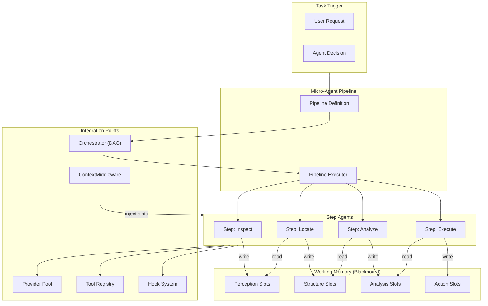
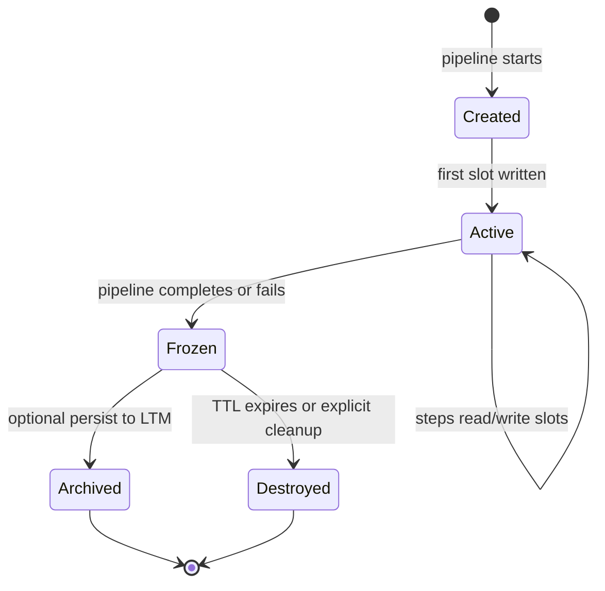
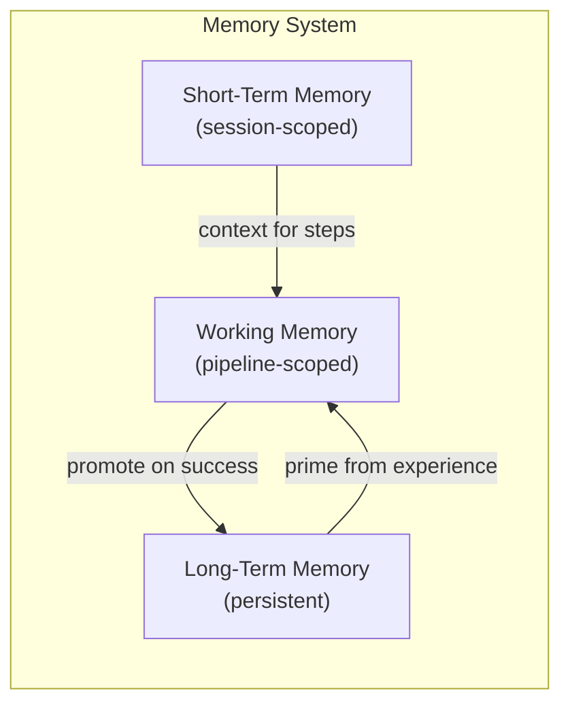
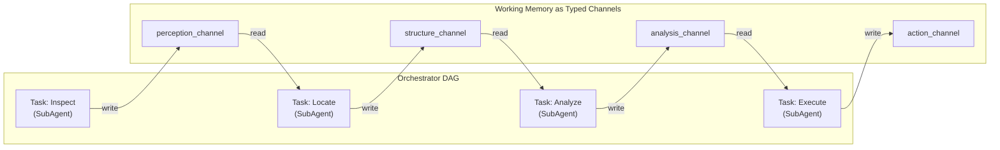
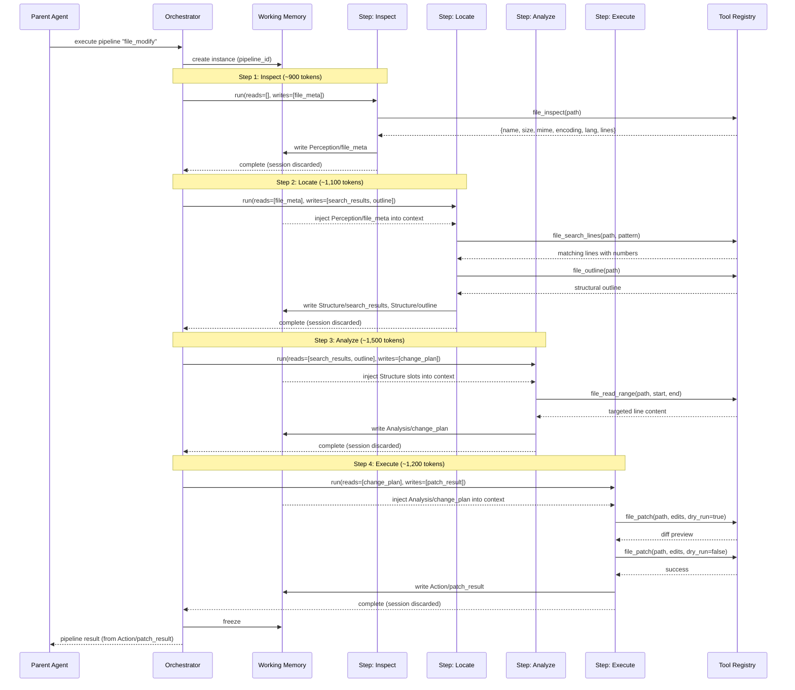
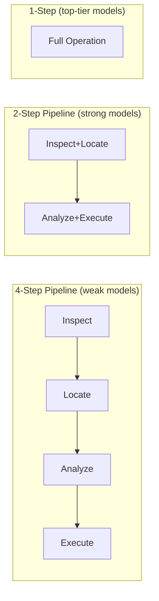
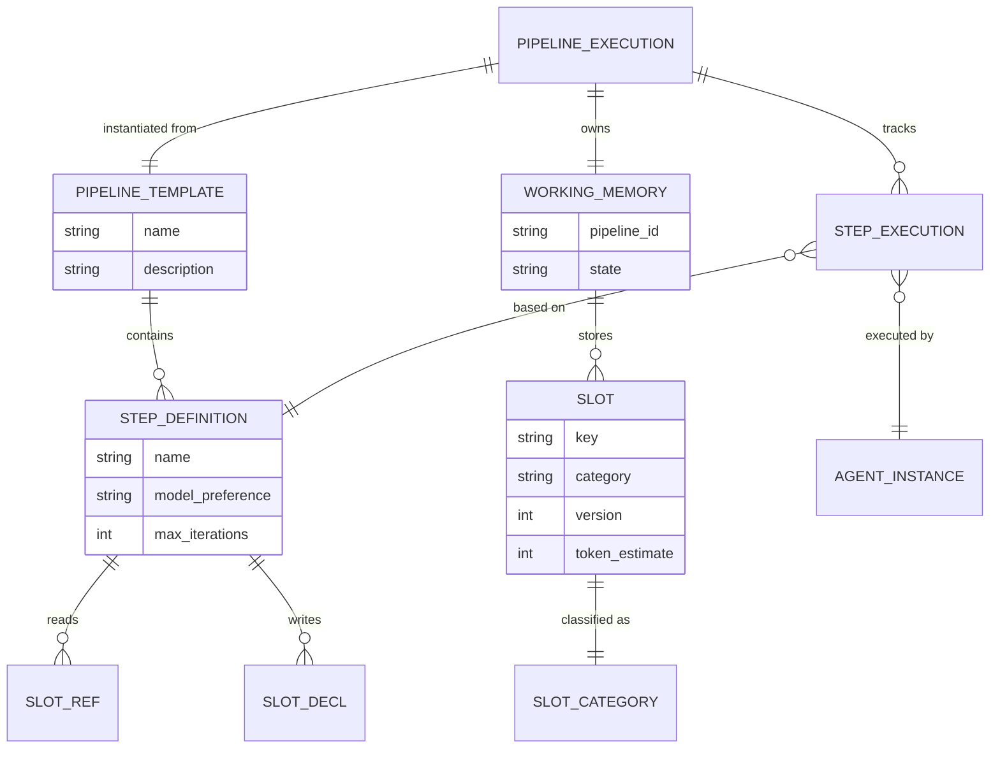

# Micro-Agent Pipeline and Atomic Operations Design

> Stateless step execution with structured Working Memory and fine-grained resource operations for y-agent

**Version**: v0.1
**Created**: 2026-03-06
**Updated**: 2026-03-06
**Status**: Draft

---

## TL;DR

Current AI agent architectures suffer from a "monolithic session" anti-pattern: one agent reads entire files, reasons across all content, and rewrites whole files -- wasting tokens, diluting attention, and requiring top-tier LLMs for reliability. The Micro-Agent Pipeline introduces a **stateless step execution** model where complex tasks (e.g., file modification) are decomposed into a sequence of focused micro-agents (Inspect, Locate, Analyze, Execute) that communicate exclusively through a structured **Working Memory** (blackboard). Each step receives only the minimal context it needs from Working Memory, performs a narrow task, writes structured results back, and terminates -- discarding its session context. This enables cheaper LLMs to handle each step reliably, reduces per-step token consumption by an estimated 60-80% compared to monolithic execution, and eliminates attention dilution. New **Atomic File Operation** tools (`file_inspect`, `file_search_lines`, `file_read_range`, `file_patch`) replace whole-file read/write patterns with surgical, line-level operations. Working Memory is organized into cognitive-inspired categories (Perception, Structure, Analysis, Action) that mirror human information processing stages.

---

## Background and Goals

### Background

Most existing agent frameworks -- including commercial products like Cursor and open-source frameworks like LangChain, AutoGPT -- follow a monolithic session model for file operations:

1. **Read entire file** into context (~10K+ tokens for a 1000-line file)
2. **Reason about the whole content** in a single LLM call (attention diluted across irrelevant lines)
3. **Rewrite entire file** (one wrong line and the whole file is corrupted)

This approach has three fundamental problems:

| Problem | Impact |
|---------|--------|
| **Token waste** | Reading a 1000-line file consumes ~10K tokens; only 5-20 lines may be relevant |
| **Attention dilution** | LLM attention is spread across irrelevant content, reducing accuracy on the target lines |
| **Model capability floor** | Only top-tier LLMs (Claude, GPT-4) can reliably handle complex multi-step reasoning in a single pass; weaker models (DeepSeek, Qwen) struggle |

The root cause is treating LLMs as stateful processors. In reality, LLMs are **stateless**: each call is independent. Current architectures simulate statefulness by accumulating session context, which grows token usage linearly with task complexity.

**Human analogy**: When a human edits a file, they do not memorize the entire file before making a change. They:
1. **Perceive**: Glance at the file name, size, type
2. **Locate**: Search or scroll to the relevant section
3. **Analyze**: Read only the relevant lines and decide what to change
4. **Execute**: Edit only the specific lines

Each cognitive step uses focused attention on a small amount of information, with the results held in working memory for the next step.

### Related Designs

This design extends and integrates with several existing y-agent modules:

| Module | Relationship |
|--------|-------------|
| [Multi-Agent Collaboration](multi-agent-design.md) | Micro-Agent Pipeline is a new collaboration pattern alongside Sequential, Hierarchical, and Peer-to-Peer |
| [Memory Architecture](memory-architecture.md) | Working Memory is a new tier alongside Short-Term and Long-Term Memory |
| [Tools Design](tools-design.md) | Atomic File Operations are new built-in tools |
| [Orchestrator Design](orchestrator-design.md) | Pipeline steps execute as DAG tasks with Working Memory channels |
| [Context & Session Design](context-session-design.md) | Step agents use ephemeral sessions with Working Memory injection via ContextMiddleware |
| [Hook/Middleware/Plugin Design](hooks-plugin-design.md) | Working Memory injection is a ContextMiddleware; step lifecycle emits hook events |

### Goals

| Goal | Measurable Criteria |
|------|-------------------|
| **Token efficiency** | Per-step context consumption < 2,000 tokens for typical file operations (vs. 10K+ monolithic) |
| **Model flexibility** | File modification pipeline completes successfully with models scoring >= 60 on HumanEval (enabling DeepSeek, Qwen, Llama) |
| **Attention focus** | Each step's context contains > 80% task-relevant content (vs. < 20% in monolithic reads) |
| **Surgical precision** | File modifications touch only the targeted lines; zero unintended changes to surrounding content |
| **Pipeline overhead** | Working Memory read/write < 1ms; total pipeline coordination overhead < 50ms (excluding LLM calls) |
| **Composability** | Steps are independently testable and recombinable into different pipelines without code changes |

### Assumptions

1. Working Memory is pipeline-scoped and in-process; cross-process Working Memory is deferred.
2. Atomic File Operations operate within the workspace boundary enforced by the existing Tool System.
3. Step agents are ephemeral (like the multi-agent framework's ephemeral instances); no persistent micro-agents.
4. The Orchestrator's DAG engine is used for pipeline scheduling; no separate pipeline scheduler.
5. File operations are the primary use case, but the pattern generalizes to any resource manipulation.

---

## Scope

### In Scope

- Working Memory (blackboard) architecture with cognitive-inspired categories
- Working Memory slot type system and lifecycle management
- Micro-Agent Pipeline pattern: step definitions, pipeline templates, step executor
- Integration with Orchestrator as a new pipeline execution mode
- Integration with Multi-Agent framework as a new collaboration pattern
- Atomic File Operation tools: `file_inspect`, `file_search_lines`, `file_read_range`, `file_patch`
- ContextMiddleware for Working Memory injection into step agents
- Pre-built pipeline templates for common operations (file modify, file refactor, multi-file search-and-replace)
- Adaptive step merging for capable models (optional optimization)

### Out of Scope

- General file system design (existing tools-design.md covers FileRead/file_write)
- Distributed Working Memory across nodes
- Binary file editing (deferred; initial focus on text files)
- Visual pipeline editor
- Step-level fine-tuning or model training
- Working Memory persistence to long-term storage (deferred to Phase 2)

---

## High-Level Design

### Architecture Overview



**Diagram type rationale**: Flowchart chosen to show module boundaries, data flow direction between steps and Working Memory categories, and integration with existing y-agent components.

**Legend**:
- **Pipeline**: Defines and executes the step sequence.
- **Steps**: Individual micro-agents, each with a focused task.
- **Working Memory**: Structured blackboard with four cognitive categories; arrows show read/write directions per step.
- **Integration**: Connections to existing y-agent modules.

### Working Memory (Blackboard)

Working Memory is a structured, typed, pipeline-scoped store that enables stateless micro-agents to share intermediate results without accumulating session context. It is distinct from both Short-Term Memory (session context management) and Long-Term Memory (cross-session knowledge).

#### Cognitive Categories

Inspired by human information processing, Working Memory is organized into four categories. Each category corresponds to a stage of cognitive processing and holds specific types of information:

| Category | Human Analogy | Holds | Typical Producers | Typical Consumers |
|----------|--------------|-------|-------------------|-------------------|
| **Perception** | Sensory register | File metadata: name, MIME type, encoding, size, language, line count, last modified | Inspect step | Locate, Analyze steps |
| **Structure** | Visuospatial sketchpad | Outlines, search results with line numbers, AST summaries, section boundaries, binary positions | Locate step | Analyze step |
| **Analysis** | Central executive | Change decisions, reasoning traces, impact assessment, conflict detection | Analyze step | Execute step |
| **Action** | Motor output buffer | Edit commands (patches), confirmation status, diff previews, rollback data | Execute step | Pipeline completion handler |

#### Slot Model

Each piece of information in Working Memory is stored as a typed **Slot**:

| Field | Type | Description |
|-------|------|-------------|
| `key` | String | Unique identifier within the category (e.g., `file_metadata`, `search_results`) |
| `category` | Enum (Perception / Structure / Analysis / Action) | Cognitive category |
| `schema` | JsonSchema | Expected structure of the value |
| `value` | serde_json::Value | The actual data |
| `producer_step` | String | Which step wrote this slot |
| `version` | u32 | Incremented on each write (for conflict detection) |
| `token_estimate` | usize | Estimated token count when serialized for LLM context |
| `created_at` | Timestamp | When the slot was first written |
| `updated_at` | Timestamp | When the slot was last updated |

#### Lifecycle

Working Memory instances are scoped to a single pipeline execution:



**Diagram type rationale**: State diagram chosen to show the lifecycle transitions of a Working Memory instance.

**Legend**:
- **Active**: Steps can read and write slots.
- **Frozen**: Pipeline finished; slots are read-only for inspection and optional archival.
- **Archived**: Valuable results persisted to Long-Term Memory for future reuse.

#### Memory Tier Relationship



**Diagram type rationale**: Flowchart chosen to show the relationships and data flow between the three memory tiers.

**Legend**:
- Working Memory is the narrowest scope (single pipeline execution).
- Successful pipeline results can be promoted to Long-Term Memory as Task memories.
- Long-Term Memory can prime Working Memory with relevant past experience when a similar pipeline starts.

### Micro-Agent Pipeline Pattern

A Micro-Agent Pipeline defines an ordered sequence of **steps**, each executed by a minimal, ephemeral agent. The key distinction from the existing Sequential Pipeline (multi-agent-design.md) is that steps communicate through Working Memory slots rather than passing unstructured text, and each step's session context is discarded after completion.

#### Step Definition

Each step declares:

| Field | Type | Description |
|-------|------|-------------|
| `name` | String | Step identifier (e.g., "inspect", "locate") |
| `description` | String | What this step does (used as system prompt component) |
| `reads` | Vec of SlotRef | Working Memory slots this step needs in its context |
| `writes` | Vec of SlotDecl | Working Memory slots this step is expected to produce |
| `tools` | Vec of String | Tools available to this step (subset of full tool registry) |
| `model_preference` | ModelPreference | Preferred model tier: `fast`, `balanced`, `capable` |
| `max_iterations` | u32 | Maximum agent loop iterations for this step |
| `prompt_template` | String | System prompt template with `{{slot}}` placeholders for Working Memory values |

#### Context Injection

When a step agent starts, the `WorkingMemoryMiddleware` (a `ContextMiddleware` registered with y-hooks) injects the declared Working Memory slots into the agent's system prompt. Only the slots listed in the step's `reads` field are included.

This means:
- Step A (Inspect) starts with **zero** Working Memory context (nothing to read yet)
- Step B (Locate) starts with only the Perception category slots from Step A
- Step C (Analyze) starts with only the Structure category slots from Step B
- Step D (Execute) starts with only the Analysis category slots from Step C

Each step's context is minimal and focused.

#### Pipeline Definition

Pipelines are defined as TOML configurations or via the Orchestrator's expression DSL:

```
inspect >> locate >> analyze >> execute
```

A pipeline template declares the step sequence, Working Memory slot schemas, and default model preferences. Pre-built templates cover common patterns; users can define custom pipelines.

#### Comparison: Monolithic vs Micro-Agent Pipeline

| Dimension | Monolithic Session | Micro-Agent Pipeline |
|-----------|-------------------|---------------------|
| **Context per LLM call** | Entire file + full session history (10K-50K tokens) | Working Memory slots only (500-2,000 tokens per step) |
| **Attention focus** | < 20% relevant content | > 80% relevant content |
| **Model requirement** | Top-tier (Claude, GPT-4) for reliability | Mid-tier sufficient per step (DeepSeek, Qwen, Llama) |
| **Failure blast radius** | Entire operation fails; full retry | Single step fails; retry from that step |
| **Token cost (typical file edit)** | ~15K-30K tokens (1 call) | ~5K-8K tokens total (4 calls x 1.2K-2K each) |
| **Latency** | 1 LLM call (but large context = slow) | 4 LLM calls (but small context = fast each) |
| **Observability** | Black box (one big call) | Per-step visibility into reasoning |

### Atomic File Operations

New built-in tools that operate at the line/region level instead of whole-file level. These replace the `FileRead` (whole file) followed by `FileWrite` (whole file) pattern with surgical operations.

| Tool | Description | Input | Output | Token Cost |
|------|-------------|-------|--------|------------|
| `file_inspect` | Get file metadata without reading content | file path | name, size, mime, encoding, language, line count, last modified | ~100 tokens |
| `file_search_lines` | Search for patterns, return matching lines with numbers | file path, pattern (regex or literal), context lines | Vec of (line_number, line_content, surrounding context) | ~200-500 tokens |
| `file_read_range` | Read a specific line range | file path, start line, end line | numbered lines in range | Proportional to range |
| `file_patch` | Apply surgical edits at specific line ranges | file path, Vec of (range, old_content, new_content) | diff preview + success/failure | ~200-400 tokens |
| `file_outline` | Generate structural outline (functions, classes, sections) | file path, depth | Vec of (line_number, symbol_name, symbol_type, indent) | ~300-800 tokens |

#### Patch Format

`file_patch` accepts a structured patch specification:

```json
{
  "file": "src/main.rs",
  "edits": [
    {
      "range": [42, 44],
      "old": "fn old_function() {\n    // old impl\n}",
      "new": "fn new_function() {\n    // new impl\n}"
    }
  ],
  "dry_run": false
}
```

The tool validates that `old` matches the actual content at the specified range before applying `new`. If `dry_run` is true, it returns a unified diff preview without applying changes. This triple of (range, old, new) ensures edits are only applied when the file is in the expected state, preventing corruption from stale line numbers.

### Integration with Existing Modules

#### Orchestrator Integration

Micro-Agent Pipelines are executed as Orchestrator workflows. Each step is a `TaskType::SubAgent` with a micro-agent-specific configuration that includes Working Memory slot declarations. The Orchestrator's existing DAG scheduling, checkpointing, and interrupt/resume mechanisms apply to pipeline steps.



**Diagram type rationale**: Flowchart chosen to show how pipeline steps map to Orchestrator DAG tasks with Working Memory categories mapped to typed channels.

**Legend**:
- Each step is an Orchestrator task.
- Working Memory categories are implemented as typed channels with `LastValue` reducers.
- The DAG dependency graph ensures correct step ordering.

#### Multi-Agent Integration

The Micro-Agent Pipeline is registered as a fourth collaboration pattern alongside the three existing patterns (Sequential Pipeline, Hierarchical Delegation, Peer-to-Peer):

| Pattern | Communication | Context Model | Agent Lifetime |
|---------|-------------|--------------|----------------|
| Sequential Pipeline | Output text -> Input text | Unstructured | Full session per agent |
| Hierarchical Delegation | Manager assigns tasks | Summary/filtered | Full session per agent |
| Peer-to-Peer | Shared channels | Typed channels | Full session per agent |
| **Micro-Agent Pipeline** (new) | **Working Memory slots** | **Structured, category-typed** | **Ephemeral, context discarded** |

#### Memory Integration

Working Memory is a new tier in the Memory System, sitting between Short-Term and Long-Term Memory:

| Tier | Scope | Persistence | Access Pattern |
|------|-------|-------------|---------------|
| Working Memory | Pipeline execution | Ephemeral (destroyed on completion) | Structured slots; typed read/write |
| Short-Term Memory | Session | Session lifetime (compact/compress) | Token-counted message buffer |
| Long-Term Memory | Workspace | Persistent (vector + KV store) | Semantic recall |

On pipeline completion, selected Working Memory contents can be promoted to Long-Term Memory as Task memories (success patterns, failure lessons).

#### Hook System Integration

Two new hook points and one new middleware:

| Extension | Type | Purpose |
|-----------|------|---------|
| `WorkingMemoryMiddleware` | ContextMiddleware | Injects declared Working Memory slots into step agent's context |
| `pre_pipeline_step` | Lifecycle Hook | Fires before each pipeline step; provides step name, reads/writes declarations |
| `post_pipeline_step` | Lifecycle Hook | Fires after each pipeline step; provides step name, Working Memory diff |

---

## Key Flows/Interactions

### File Modification Pipeline (Primary Flow)



**Diagram type rationale**: Sequence diagram chosen to show the temporal ordering of pipeline steps, Working Memory read/write patterns, and context discarding between steps.

**Legend**:
- Each step receives only Working Memory slots, not previous step's full session.
- "(session discarded)" indicates the step's conversational context is not carried to the next step.
- Token estimates in parentheses show approximate per-step context size.

### Adaptive Step Merging

For capable models (Claude, GPT-4), adjacent steps can be merged to reduce LLM call count at the cost of larger per-call context:



**Diagram type rationale**: Flowchart chosen to visually compare pipeline configurations at different model capability tiers.

**Legend**:
- **4-Step**: Maximum decomposition for weaker models; each step under 2K tokens.
- **2-Step**: Merged pairs for mid-tier models; each step under 5K tokens.
- **1-Step**: Equivalent to monolithic execution for top-tier models when the task is simple.

The pipeline executor selects the merge level based on model capability metadata from the Provider Pool and task complexity estimate. This is a runtime optimization, not a configuration requirement.

---

## Data and State Model

### Core Entities



**Diagram type rationale**: ER diagram chosen to show structural relationships between pipeline templates, step definitions, Working Memory, and slots.

**Legend**:
- **Pipeline Template**: Reusable definition of a step sequence.
- **Pipeline Execution**: A single run of a template with its own Working Memory.
- **Slot**: Typed data item in Working Memory, classified by cognitive category.
- **Step Execution**: Tracks the runtime state of a step within a pipeline execution.

### Pre-Built Pipeline Templates

| Template | Steps | Use Case |
|----------|-------|----------|
| `file_modify` | inspect -> locate -> analyze -> execute | Modify specific lines in a file based on a condition |
| `file_refactor` | inspect -> outline -> plan_changes -> execute_batch | Rename symbols or restructure across a file |
| `multi_file_search_replace` | scan_workspace -> filter_files -> (per-file: locate -> execute) | Search and replace a pattern across multiple files |
| `code_review` | inspect -> outline -> analyze_sections -> summarize | Review a file for issues without modifying it |

---

## Failure Handling and Edge Cases

| Scenario | Handling |
|----------|---------|
| **Step agent fails (LLM error, timeout)** | Retry from the failed step using checkpointed Working Memory; previous steps not re-executed |
| **Step produces invalid slot data** | Validate against slot's JsonSchema before writing to Working Memory; reject with descriptive error; retry step |
| **file_patch old content mismatch** | File was modified between Locate and Execute steps; re-run from Locate step with fresh search |
| **Working Memory slot not found** | Step declared a `reads` dependency that was not written by a prior step; pipeline fails with configuration error |
| **File deleted between steps** | Detect at next file operation; abort pipeline with `FileNotFound`; Working Memory preserved for inspection |
| **Pipeline timeout** | Configurable per-pipeline timeout; on expiry, kill current step, freeze Working Memory, report partial progress |
| **Model returns unstructured output** | Step executor parses output against expected slot schema; if parsing fails, retry with explicit format instructions |
| **Large file (> 50K lines)** | `file_outline` returns high-level structure only; `file_search_lines` uses streaming grep; `file_read_range` enforces maximum range (default 200 lines) |
| **Binary file encountered** | `file_inspect` detects binary MIME type; pipeline aborts with `UnsupportedFileType` (binary editing deferred) |
| **Concurrent pipeline edits to same file** | Pipeline acquires a file-level advisory lock; second pipeline waits or fails based on configuration |

---

## Security and Permissions

| Concern | Approach |
|---------|----------|
| **Working Memory isolation** | Each pipeline execution has its own Working Memory instance; no cross-pipeline access. Instance ID is cryptographically random. |
| **Slot data sensitivity** | Working Memory slots may contain file content snippets. Slots are not persisted to disk by default. Promotion to LTM is explicit and goes through the Memory System's scope-based access control. |
| **Atomic file operation permissions** | Atomic file tools inherit the existing Tool System's capability model: `file_inspect`, `file_search_lines`, `file_read_range` require Filesystem ReadOnly; `file_patch` requires Filesystem ReadWrite. All paths validated against workspace boundary. |
| **Step agent tool restrictions** | Each step declares its allowed tools. The pipeline executor enforces this via the agent's tool filter (same mechanism as multi-agent mode-based tool restrictions). |
| **Patch validation** | `file_patch` requires the `old` content to match the actual file content at the specified range. This prevents blind writes and ensures the agent has verified what it is replacing. |

---

## Performance and Scalability

### Token Usage Analysis

| Operation | Monolithic Approach | Micro-Agent Pipeline | Reduction |
|-----------|-------------------|---------------------|-----------|
| **System prompt per call** | ~1,000 tokens (1 call) | ~500 tokens x 4 calls = 2,000 tokens | -1,000 (overhead) |
| **File content in context** | ~10,000 tokens (full file) | ~800 tokens (targeted ranges across 4 steps) | +9,200 |
| **Session history** | ~5,000 tokens (accumulated) | ~0 tokens (no session accumulation) | +5,000 |
| **Working Memory slots** | N/A | ~400 tokens (average per step) | -400 |
| **Total** | ~16,000 tokens | ~4,800 tokens (across 4 calls) | **~70% reduction** |

These are estimates for a typical 1000-line file modification. Actual savings vary with file size and task complexity.

### Latency Analysis

| Dimension | Monolithic | Micro-Agent Pipeline |
|-----------|-----------|---------------------|
| **LLM calls** | 1 large call | 4 small calls |
| **Per-call latency** | ~3-5s (large context) | ~0.5-1.5s each (small context) |
| **Total LLM latency** | ~3-5s | ~2-6s |
| **Pipeline overhead** | N/A | ~50ms |
| **Net latency** | ~3-5s | ~2-6s |

Latency is comparable; the benefit is reliability and model flexibility rather than speed. For capable models, adaptive step merging reduces call count.

### Performance Targets

| Metric | Target |
|--------|--------|
| Working Memory slot write | < 0.5ms |
| Working Memory slot read | < 0.5ms |
| Working Memory context injection (4 slots) | < 2ms |
| Pipeline coordination overhead (4 steps) | < 50ms |
| `file_inspect` execution | < 5ms |
| `file_search_lines` execution (10K-line file) | < 50ms |
| `file_read_range` execution (200 lines) | < 5ms |
| `file_patch` execution (5 edits) | < 10ms |
| Slot schema validation | < 1ms |

### Scalability Considerations

- **Pipeline concurrency**: Multiple pipelines can run concurrently on different files; Working Memory instances are isolated.
- **Step parallelism**: Within a pipeline, independent steps (e.g., multiple Locate operations on different sections) can run in parallel via the Orchestrator's parallel task support.
- **Working Memory size**: Bounded by pipeline complexity; typical pipelines produce 4-10 slots totaling < 5K tokens. No unbounded growth risk.

---

## Observability

### Metrics

| Metric | Type | Description |
|--------|------|-------------|
| `pipeline.executions.total` | Counter | Pipeline executions by template name and result (success/failure) |
| `pipeline.steps.total` | Counter | Step executions by step name and result |
| `pipeline.steps.duration_ms` | Histogram | Per-step duration (including LLM call) by step name |
| `pipeline.steps.tokens_used` | Histogram | Token usage per step (input + output) by step name |
| `pipeline.tokens_saved` | Counter | Estimated tokens saved vs. monolithic approach |
| `pipeline.working_memory.slots` | Gauge | Active Working Memory slot count |
| `pipeline.working_memory.total_tokens` | Gauge | Total token estimate across all Working Memory slots |
| `pipeline.step_retries` | Counter | Step retry count by step name and error type |
| `pipeline.merge_level` | Histogram | Adaptive merge level (1/2/4 steps) by model |
| `file_ops.atomic.total` | Counter | Atomic file operation calls by tool name |
| `file_ops.atomic.duration_ms` | Histogram | Atomic file operation latency by tool name |
| `file_ops.patch.edits_per_call` | Histogram | Number of edits per file_patch call |

### Hook Events

| Event | Payload | Trigger |
|-------|---------|---------|
| `PipelineStarted` | pipeline_id, template_name, step_count, model_config | Pipeline execution begins |
| `PipelineStepCompleted` | pipeline_id, step_name, duration_ms, tokens_used, slots_written | Step finishes successfully |
| `PipelineStepFailed` | pipeline_id, step_name, error, retry_count | Step fails |
| `PipelineCompleted` | pipeline_id, total_duration_ms, total_tokens, steps_executed, merge_level | Pipeline finishes |
| `WorkingMemorySlotWritten` | pipeline_id, slot_key, category, token_estimate, producer_step | Slot written to Working Memory |

### Tracing

Each pipeline execution creates a parent span. Each step creates a child span with:
- `pipeline.id`, `pipeline.template`
- `step.name`, `step.model`, `step.reads`, `step.writes`
- `step.tokens_input`, `step.tokens_output`
- `step.tool_calls` (list of tools invoked)

---

## Rollout and Rollback

### Phased Implementation

| Phase | Scope | Duration | Exit Criteria |
|-------|-------|----------|---------------|
| **Phase 1** | Working Memory (in-memory blackboard), slot type system, `WorkingMemoryMiddleware`, `file_inspect` and `file_search_lines` tools | 2-3 weeks | Working Memory read/write works end-to-end; two atomic file tools pass integration tests |
| **Phase 2** | Pipeline executor, step definitions, `file_read_range` and `file_patch` tools, `file_modify` template, Orchestrator integration | 3-4 weeks | Complete file modification pipeline executes successfully with a mid-tier model |
| **Phase 3** | Adaptive step merging, remaining pipeline templates (`file_refactor`, `multi_file_search_replace`, `code_review`), `file_outline` tool, LTM promotion | 2-3 weeks | Step merging adjusts based on model capability; 4 templates available |
| **Phase 4** | Performance optimization, production hardening, documentation, benchmark suite | 1-2 weeks | Token savings > 50% confirmed on benchmark; pipeline overhead < 50ms |

### Rollback Plan

| Component | Rollback |
|-----------|----------|
| Working Memory | Feature flag `working_memory`; disabled = pipeline steps use standard Sequential Pipeline context sharing |
| Micro-Agent Pipeline | Feature flag `micro_agent_pipeline`; disabled = file operations use existing monolithic `FileRead` + `FileWrite` |
| Atomic file tools | Individual tool deregistration from ToolRegistry; existing `FileRead`/`FileWrite` remain functional |
| Adaptive step merging | Feature flag `adaptive_merge`; disabled = always use full 4-step pipeline |
| WorkingMemoryMiddleware | Deregister from ContextMiddleware chain; steps receive standard context only |

---

## Alternatives and Trade-offs

### Monolithic Session vs Micro-Agent Pipeline

| | Monolithic Session | Micro-Agent Pipeline (chosen) |
|-|-------------------|------------------------------|
| **Token efficiency** | Low (entire file + history in context) | High (only relevant slots per step) |
| **Model requirement** | Top-tier only | Any model per step |
| **Failure recovery** | Full retry from scratch | Retry from failed step |
| **Latency** | Single call (large) | Multiple calls (small each) |
| **Complexity** | Simple (one agent, one call) | Higher (pipeline, Working Memory, step coordination) |
| **Observability** | Opaque (one big LLM call) | Transparent (per-step metrics) |

**Decision**: Micro-Agent Pipeline. The token savings, model flexibility, and granular recovery justify the additional complexity. Adaptive merging recovers the simplicity for capable models.

### Working Memory vs Session Context Forwarding

| | Working Memory (chosen) | Forward Session Context |
|-|------------------------|------------------------|
| **Structure** | Typed slots with schemas | Unstructured text |
| **Token efficiency** | Only declared slots injected | Full previous session grows linearly |
| **Validation** | Schema-enforced | None |
| **Inspectability** | Slot-level visibility | Embedded in session history |
| **Implementation** | New component | Reuse existing session |

**Decision**: Working Memory. Structured, typed slots enable selective context injection (only what a step needs) and schema validation (catch errors early). Session context forwarding would reintroduce the token accumulation problem the pipeline is designed to solve.

### Atomic Operations vs Whole-File Operations

| | Atomic (chosen) | Whole-File |
|-|----------------|-----------|
| **Precision** | Line-level edits | Full file replacement |
| **Safety** | Old-content verification prevents stale edits | Any content written regardless of current state |
| **Token cost** | Proportional to edit size | Proportional to file size |
| **Conflict risk** | Low (small ranges locked) | High (entire file locked) |
| **Complexity** | Higher (range tracking, patch validation) | Simple (read all, write all) |

**Decision**: Atomic operations as the primary pattern for the pipeline. Whole-file operations (`FileRead`, `FileWrite`) remain available for cases where they are genuinely needed (new file creation, small files).

### Working Memory Categories: Cognitive Model vs Flat Namespace

| | Cognitive Categories (chosen) | Flat Key-Value |
|-|------------------------------|---------------|
| **Developer clarity** | Categories guide step design ("what stage am I?") | No guidance; any key anywhere |
| **Access control** | Steps can be restricted to specific categories | No category-based restrictions |
| **Conceptual alignment** | Maps to human processing stages | Arbitrary |
| **Flexibility** | Categories are a convention, not a hard constraint | Maximum flexibility |

**Decision**: Cognitive categories. The four-category model (Perception, Structure, Analysis, Action) provides developer guidance for pipeline design and enables category-based access control. Categories are advisory in v0 (no hard enforcement), becoming enforced in a future version.

---

## Open Questions

| # | Question | Owner | Due Date | Status |
|---|----------|-------|----------|--------|
| 1 | What is the optimal default range limit for `file_read_range`? 200 lines? 500 lines? Needs benchmarking with different file types. | Pipeline team | 2026-04-01 | Open |
| 2 | Should Working Memory support slot subscriptions (step B notified when step A writes a slot) for streaming pipelines? | Pipeline team | 2026-04-15 | Open |
| 3 | How should the adaptive merge algorithm weigh model capability vs. task complexity? Simple heuristic or LLM-based decision? | Pipeline team | 2026-04-15 | Open |
| 4 | Should `file_patch` support AST-aware edits (e.g., "replace function X" rather than line ranges) for programming languages? | Tools team | 2026-05-01 | Open |
| 5 | When promoting Working Memory to Long-Term Memory, what is the retention policy for pipeline results? Keep all? Only successful? Only novel patterns? | Memory team | 2026-04-15 | Open |
| 6 | Should the pipeline support conditional steps (e.g., skip Execute if Analyze determines no change needed)? | Pipeline team | 2026-04-01 | Open |
| 7 | For multi-file operations, should there be a shared Working Memory across per-file sub-pipelines, or isolated instances? | Pipeline team | 2026-04-15 | Open |

