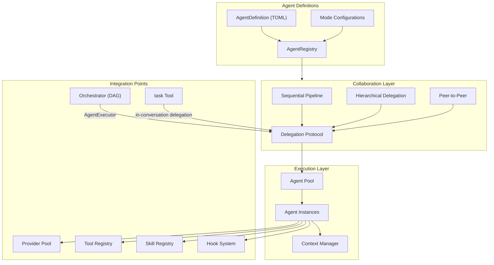
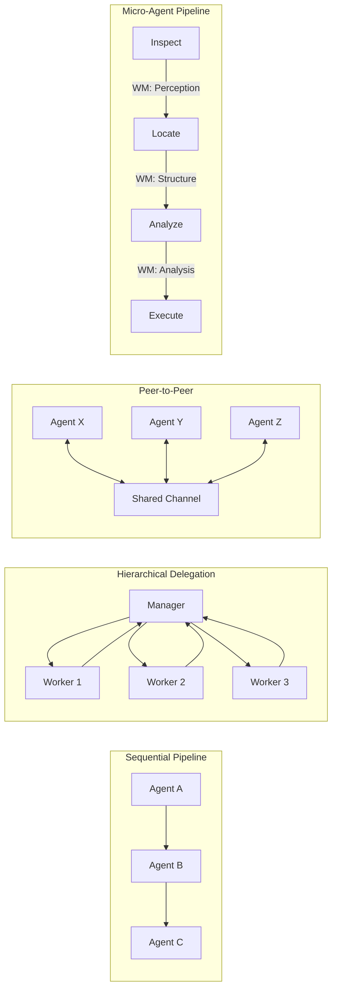
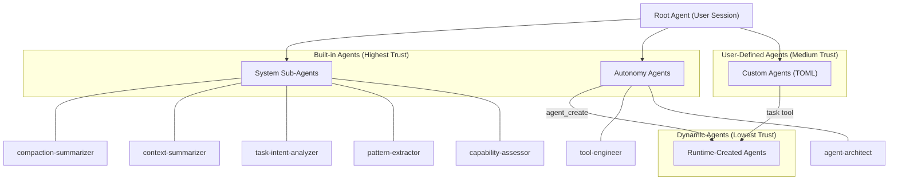
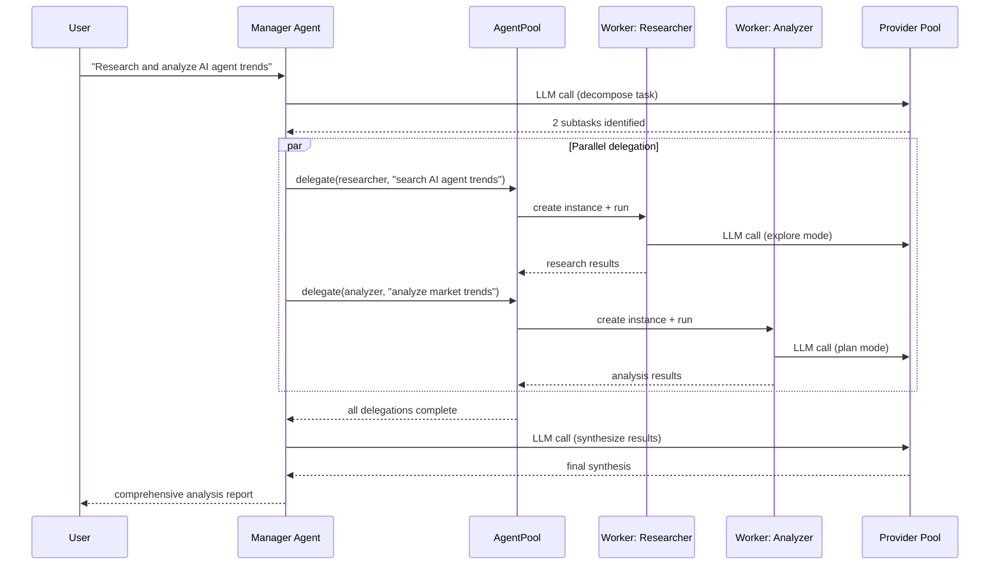
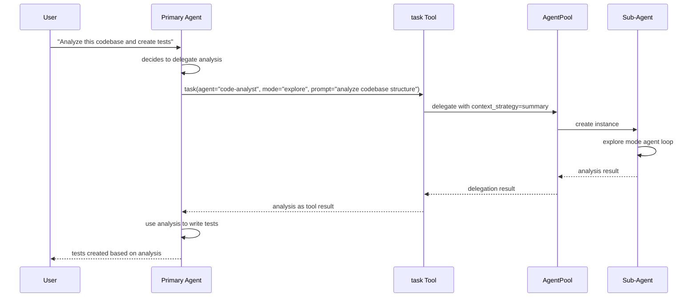
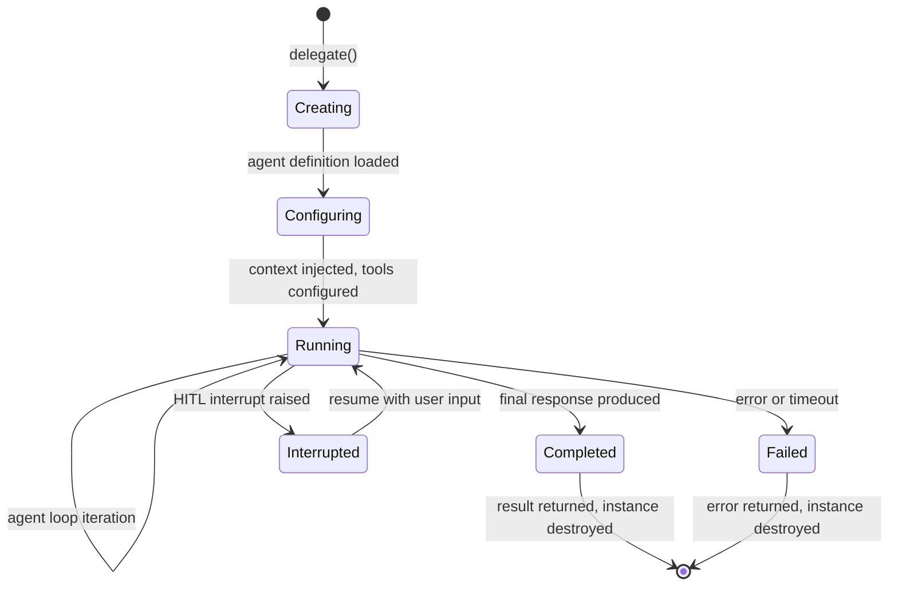
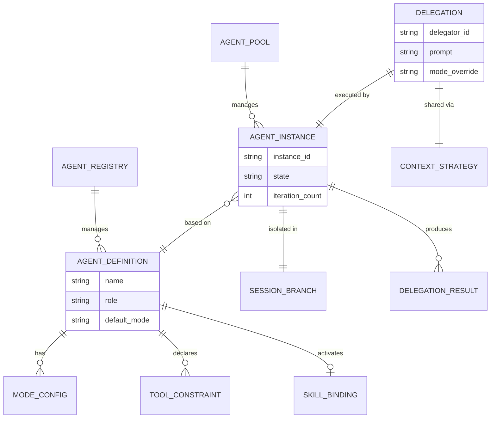

# Multi-Agent Collaboration Framework Design

> Agent definition, delegation protocols, collaboration patterns, and concurrency management for y-agent

**Version**: v0.5
**Created**: 2026-03-06
**Updated**: 2026-03-11
**Status**: Draft

---

## TL;DR

The Multi-Agent Collaboration framework elevates agents from simple orchestrator task executors to first-class entities with defined roles, specialized capabilities, and structured collaboration protocols. An **AgentDefinition** (TOML) declares an agent's role, model preferences, available tools, skills, system instructions, and behavioral **mode** (build, plan, explore, general). The framework supports four collaboration patterns: **Sequential Pipeline** (agents process in order), **Hierarchical Delegation** (a manager agent decomposes tasks and delegates to worker agents), **Peer-to-Peer** (agents communicate through shared channels), and **Micro-Agent Pipeline** (stateless step agents communicate through structured Working Memory slots; see [micro-agent-pipeline-design.md](micro-agent-pipeline-design.md)). A **Delegation Protocol** governs how agents request work from each other, share context, and collect results. An **AgentPool** manages agent instance lifecycle with configurable concurrency limits and resource isolation. Agents integrate with the existing Orchestrator as a first-class executor type (`AgentExecutor`), enabling workflows to mix LLM calls, tool executions, and agent delegations in a single DAG. Crucially, the framework establishes an **Agent Autonomy Model**: every LLM reasoning operation in y-agent — including internal operations like context compaction, input enrichment, and capability-gap assessment — is expressed as an agent delegation through the unified framework. Agents can autonomously create and manage other agents at runtime via meta-tools (`agent_create`, `agent_update`, `agent_deactivate`), forming a hierarchical trust tree with permission inheritance and trust tiers. This makes the agent framework the **sole entry point** for all LLM reasoning, ensuring uniform observability, guardrails, and resource management. Full autonomy standard: [AGENT_AUTONOMY.md](../../docs/standards/AGENT_AUTONOMY.md). This design draws on CrewAI's Crew/Manager model, DeerFlow's SubagentExecutor with concurrency limits, OpenCode's Task tool with agent modes, and Oh-My-OpenCode's multi-model category routing.

---

## Background and Goals

### Background

y-agent's Orchestrator design includes a `SubAgent` task type and an `AgentExecutor`, but these are thin abstractions that simply run another agent loop as a task. There is no design for:

- How agents are defined and configured (roles, capabilities, constraints)
- How agents collaborate beyond simple delegation (sequential, hierarchical, peer-to-peer)
- How context is shared between agents (full, filtered, summarized)
- How agent concurrency is governed (pool size, resource limits, isolation)
- How agent behavioral modes (build, plan, explore) affect tool availability and prompts

Four of eight analyzed competitors implement multi-agent collaboration:

- **CrewAI**: Crew model with sequential and hierarchical execution. A Manager agent in hierarchical mode decomposes tasks and delegates to specialized workers via `AgentTools`. Memory is unified across the crew.
- **DeerFlow**: SubagentExecutor with a default concurrency limit of 3 background agents. Each subagent runs in a thread sandbox with isolated state.
- **OpenCode**: Task tool that spawns subagents with behavioral modes (build, plan, explore, general). Each mode configures a different system prompt, tool set, and model.
- **Oh-My-OpenCode**: Category + Agent routing where tasks are classified into categories, each mapped to a specific agent with its own model and skill configuration.

### Goals

| Goal | Measurable Criteria |
|------|-------------------|
| **Declarative agent definition** | Agent configurable via TOML with role, model, tools, skills, mode; no code required for new agents |
| **Three collaboration patterns** | Sequential, hierarchical, and peer-to-peer patterns supported through the same framework |
| **Context isolation** | Agents share only declared context; no accidental leakage of full conversation history |
| **Concurrency governance** | Configurable per-pool and global concurrency limits; default maximum 5 concurrent agents |
| **Mode-based behavior** | Agent modes alter tool availability, system prompt, and model selection without changing agent definition |
| **Orchestrator integration** | Agents usable as first-class executors in DAG workflows alongside LLM calls and tool executions |
| **Delegation overhead** | Agent delegation adds < 50ms overhead beyond the delegated work itself |

### Assumptions

1. Multi-agent collaboration is single-node; distributed agent pools across nodes are deferred.
2. Agent instances are ephemeral (created per delegation, destroyed after completion); persistent agents are deferred.
3. The Manager agent in hierarchical mode uses the same LLM as the parent agent unless explicitly overridden.
4. Agent-to-agent communication within a single y-agent process uses in-memory channels; cross-process A2A uses the Client Layer's A2A protocol.
5. Each agent instance has its own session branch for context isolation.

---

## Scope

### In Scope

- `AgentDefinition` (TOML) format for declarative agent configuration
- `AgentRegistry` for managing available agent definitions
- Four collaboration patterns: Sequential Pipeline, Hierarchical Delegation, Peer-to-Peer, Micro-Agent Pipeline
- `DelegationProtocol`: task delegation, context sharing, result collection
- `AgentPool`: instance lifecycle, concurrency limits, resource management
- Agent behavioral modes: build, plan, explore, general (configurable tool sets and prompts)
- `AgentExecutor` integration with the Orchestrator's DAG execution engine
- Context sharing strategies: full, filtered, summary, none
- Built-in "task" tool for in-conversation agent delegation
- Built-in agent definitions for specialized system tasks (e.g., `tool-engineer` for tool gap resolution, `agent-architect` for agent gap resolution)

### Out of Scope

- Distributed multi-node agent pools
- Persistent long-running agent instances (daemon agents)
- Agent training or fine-tuning
- Agent reputation or performance scoring
- Visual agent workflow designer
- Cross-process A2A protocol details (see client-layer-design.md)

---

## High-Level Design

### Architecture Overview



**Diagram type rationale**: Flowchart chosen to show module boundaries and relationships between agent definitions, collaboration patterns, execution, and integration with existing modules.

**Legend**:
- **Definition**: How agents are declared and registered.
- **Collaboration**: Patterns governing how agents work together.
- **Execution**: Runtime agent instances and their resource management.
- **Integration**: Connections to existing y-agent modules.

### Agent Definition

```toml
[agent]
name = "researcher"
role = "Research specialist for web information gathering"
mode = "explore"

[agent.model]
preferred = ["gpt-4o", "claude-sonnet"]
fallback = ["gpt-4o-mini"]
temperature = 0.3

[agent.tools]
allowed = ["web_search", "web_fetch", "file_read", "file_write"]
denied = ["shell_exec"]

[agent.skills]
activated = ["web-researcher"]

[agent.context]
sharing = "summary"
max_tokens = 4096

[agent.limits]
max_iterations = 20
max_tool_calls = 50
timeout = "5m"

[agent.instructions]
system = """
You are a research specialist. Your job is to:
1. Search the web for relevant information
2. Extract key facts and data
3. Provide structured summaries with source citations
"""
```

### Collaboration Patterns



**Diagram type rationale**: Flowchart chosen to visually compare the four collaboration topologies side by side.

**Legend**:
- **Sequential**: Output of each agent becomes input to the next.
- **Hierarchical**: Manager decomposes, delegates, and aggregates. Workers report back to the Manager.
- **Peer-to-Peer**: Agents communicate through typed shared channels (from the Orchestrator's channel model).
- **Micro-Agent Pipeline**: Stateless steps communicate through Working Memory (WM) cognitive categories. Sessions discarded after each step.

| Pattern | Best For | Context Sharing | Coordination |
|---------|----------|----------------|-------------|
| **Sequential Pipeline** | Linear workflows (research -> analyze -> summarize) | Previous agent's output passed as input | Implicit (DAG ordering) |
| **Hierarchical Delegation** | Complex tasks requiring decomposition | Manager provides filtered context per worker | Manager agent handles decomposition and aggregation |
| **Peer-to-Peer** | Collaborative tasks with shared state | Typed channels with reducers | Channel-based (Orchestrator's channel model) |
| **Micro-Agent Pipeline** | Token-sensitive operations (file editing, multi-step reasoning) | Structured Working Memory slots (typed, category-scoped) | Pipeline executor via Orchestrator DAG; each step's session discarded after completion |

The Micro-Agent Pipeline pattern is distinct from the Sequential Pipeline in two critical ways: (1) steps communicate through structured, typed Working Memory slots rather than unstructured text, and (2) each step's session context is discarded after completion (stateless execution), preventing token accumulation across steps. This enables weaker LLMs to handle individual steps reliably. Full design: [micro-agent-pipeline-design.md](micro-agent-pipeline-design.md).

### Agent Behavioral Modes

| Mode | Description | Tool Availability | System Prompt Focus | Typical Model |
|------|-------------|------------------|-------------------|--------------|
| **build** | Implementation-focused execution | All allowed tools | "Execute the task, produce artifacts" | High-capability model |
| **plan** | Read-only analysis and planning | Read-only tools only (no write, no shell) | "Analyze and propose a plan, do not execute" | High-capability model |
| **explore** | Fast information gathering | Search and read tools | "Find relevant information quickly" | Fast/cheap model |
| **general** | Balanced conversation and task execution | All allowed tools | Default instructions | Default model |

Modes are implemented as configuration overlays: when an agent runs in `plan` mode, the mode configuration filters the agent's tool list to read-only tools and prepends a mode-specific instruction to the system prompt. The agent definition specifies a default mode, but the delegator can override it per delegation.

### Built-in Agent Definitions

The framework ships with specialized agent definitions for system-level tasks. These are registered in the `AgentRegistry` at startup alongside user-defined agents.

| Agent | Mode | Purpose | Key Tools |
|-------|------|---------|-----------|
| **tool-engineer** | build | Create, modify, and refactor dynamic tools in response to tool capability gaps | `tool_create`, `tool_update`, `tool_search`, `file_read`, `file_write`, `shell_exec` |
| **agent-architect** | plan | Design and create sub-agent definitions in response to agent capability gaps | `agent_create`, `agent_update`, `agent_deactivate`, `agent_search`, `tool_search`, `file_read` |

The `tool-engineer` agent is spawned by the CapabilityGapMiddleware (see [agent-autonomy-design.md](agent-autonomy-design.md)) when a tool capability gap is detected. It analyzes the gap (NotFound, ParameterMismatch, or HardcodedConstraint), designs or refactors the tool implementation, and registers the result via `tool_create` or `tool_update`.

The `agent-architect` agent is spawned by the CapabilityGapMiddleware when an agent capability gap is detected (AgentNotFound, CapabilityMismatch, or ModeInappropriate). It searches existing agents to avoid duplication, designs a new agent definition with appropriate mode, tools, and instructions, and registers it via `agent_create`. It operates in `plan` mode with no write access (`shell_exec` and `file_write` denied) -- a deliberate security separation from `tool-engineer`.

**Dynamic Agent Definitions**: In addition to static (TOML-defined) and built-in agents, the AgentRegistry supports runtime-created **DynamicAgentDefinition** entries. These are created via `agent_create`, validated through a three-stage pipeline (schema, permissions, safety screening), and stored in the `DynamicAgentStore`. Dynamic agents follow a trust hierarchy (`built-in` > `user-defined` > `dynamic`) and inherit permissions from their creator via a snapshot model. See [agent-autonomy-design.md](agent-autonomy-design.md) for full details.

Full agent definitions and resolution protocols: [agent-autonomy-design.md](agent-autonomy-design.md).

### Agent Autonomy Model

The multi-agent framework is not just a collaboration tool — it is the **sole mechanism** through which y-agent performs LLM reasoning. This is the Agent Autonomy Model: every LLM call, whether user-facing or internal, is an agent delegation.

#### Autonomy Principle

Traditional agent frameworks treat sub-agents as a user-facing feature while internal operations (compaction, enrichment, assessment) use ad-hoc LLM abstractions. y-agent rejects this split. The autonomy principle is:

> **All LLM reasoning operations in y-agent are agent delegations through the AgentPool.** No module may bypass the multi-agent framework to call the ProviderPool directly.

This ensures:
- **Uniform observability**: Every LLM call — including a compaction summary — generates trace spans, token metrics, and cost records
- **Uniform guardrails**: The LLM middleware chain (rate limiting, content filtering, taint tracking) applies to all reasoning
- **Uniform resource management**: AgentPool concurrency limits manage all LLM usage, preventing internal operations from starving user-facing agents
- **Self-evolution readiness**: When agents manage their own sub-agents, the system can optimize, replace, or retire internal agents based on performance data

#### Agent Trust Tree



**Diagram type rationale**: Flowchart chosen to show the trust hierarchy and autonomy relationships between agent categories.

**Legend**:
- **Built-in Agents**: Highest trust; compiled into binary or shipped as TOML. Divided into system sub-agents (internal operations) and autonomy agents (meta-capabilities).
- **User-Defined Agents**: Medium trust; created by users via TOML configuration.
- **Dynamic Agents**: Lowest trust; created at runtime by other agents via `agent_create`, subject to permission inheritance.
- Arrows show delegation and creation relationships.

#### Built-in System Agent Catalog

These agents handle internal LLM reasoning tasks that were historically implemented as ad-hoc LLM calls within individual modules. Moving them to the agent framework ensures they receive full observability, guardrails, and resource management.

| Agent | Owner Module | Purpose | Mode | Tools | Model Tier |
|-------|-------------|---------|------|-------|------------|
| `compaction-summarizer` | y-context | Summarize conversation history during compaction overflow recovery | explore | None | Fast/cheap |
| `context-summarizer` | y-agent | Summarize parent conversation context for `Summary` context strategy in delegation | explore | None | Fast/cheap |
| `title-generator` | y-session | Generate a concise session title from conversation messages | explore | None | Fast/cheap |
| `task-intent-analyzer` | y-context | Analyze user input for ambiguity/incompleteness; propose clarifications (EnrichInput middleware) | plan | None | Balanced |
| `tool-engineer` | y-agent | Create, modify, and refactor dynamic tools in response to tool capability gaps | build | `tool_create`, `tool_update`, `tool_search`, `file_read`, `file_write`, `shell_exec` | High-capability |
| `agent-architect` | y-agent | Design and create sub-agent definitions in response to agent capability gaps | plan | `agent_create`, `agent_update`, `agent_deactivate`, `agent_search`, `tool_search`, `file_read` | High-capability |
| `pattern-extractor` | y-skills | Extract improvement patterns from experience records for skill self-evolution | plan | `file_read` | High-capability |
| `capability-assessor` | y-hooks | Assess tool/agent capability mismatch (LLM-assisted gap detection for `CapabilityMismatch` and `HardcodedConstraint`) | plan | `tool_search`, `agent_search` | Balanced |

**Design rationale**: System sub-agents (summarizers, analyzers) use `explore` or `plan` mode with no tool access and fast/cheap models. This keeps their token cost minimal while still routing through the full agent framework for observability. Autonomy agents (`tool-engineer`, `agent-architect`) require higher-capability models and tool access because they produce artifacts.

#### Cross-Module Invocation Protocol

Modules in peer crates (e.g., `y-context`, `y-skills`) cannot depend on `y-agent` directly (crate dependency direction must be inward toward `y-core`). The invocation protocol uses a trait in `y-core`:

```rust
/// Defined in y-core — the interface for any module to request agent delegation.
#[async_trait]
pub trait AgentDelegator: Send + Sync {
    /// Delegate a reasoning task to a named built-in agent.
    ///
    /// The caller provides the agent name and structured input data.
    /// The agent controls its own prompt — the framework handles agent lookup,
    /// prompt construction (from AgentDefinition + input data), instance creation,
    /// context injection, middleware chains, and result collection.
    async fn delegate(
        &self,
        agent_name: &str,
        input: serde_json::Value,
        context_strategy: ContextStrategyHint,
    ) -> Result<DelegationOutput, DelegationError>;
}

/// Hint for context sharing (lightweight version for cross-crate use).
pub enum ContextStrategyHint {
    None,
    Summary,
    Filtered,
    Full,
}

/// Result of a delegation.
pub struct DelegationOutput {
    pub text: String,
    pub tokens_used: u32,
    pub duration_ms: u64,
}
```

At startup, `y-cli` wires `AgentPool` (which implements `AgentDelegator`) into all modules that need it via dependency injection. For example, `CompactionEngine` receives an `Arc<dyn AgentDelegator>` instead of defining its own `CompactionLlm` trait. The `AgentPool` resolves the agent's `AgentDefinition`, formats the input data via the agent's prompt template, and executes the delegation.

#### Autonomy Invariants

| Invariant | Enforcement |
|-----------|------------|
| No direct `ProviderPool` calls outside agent context | Code review checklist; lint rule (future) |
| No hardcoded prompt strings in `.rs` files | Code review checklist; prompts in TOML |
| All system sub-agents registered at startup | `AgentRegistry` initialization in `y-cli` |
| Dynamic agents cannot exceed creator's permissions | `agent_create` validation pipeline |
| Delegation depth prevents infinite recursion | Depth counter decremented per level; rejected at 0 |
| All agent delegations emit trace spans | Guaranteed by `AgentPool.delegate()` implementation |

Full autonomy standard: [AGENT_AUTONOMY.md](../../docs/standards/AGENT_AUTONOMY.md).

### Integration with Orchestrator

The Orchestrator's existing `TaskType::SubAgent` is extended with the multi-agent framework:

```rust
enum TaskType {
    LLMCall,
    ToolExecution,
    SubAgent(AgentDelegation),
    SubWorkflow,
    Script,
    HumanApproval,
    Branch,
    Parallel,
    Loop,
}

struct AgentDelegation {
    agent_name: String,
    mode_override: Option<AgentMode>,
    context_strategy: ContextStrategy,
    input_prompt: String,
}
```

The `AgentExecutor` creates an agent instance from the `AgentRegistry`, configures it with the delegation parameters, runs the agent loop, and returns the result as a `TaskOutput`.

---

## Key Flows/Interactions

### Hierarchical Delegation Flow



**Diagram type rationale**: Sequence diagram chosen to show the temporal interaction between manager agent, pool, and parallel worker agents.

**Legend**:
- The Manager agent uses an LLM call to decompose the task.
- Workers run in parallel, each with their own mode and context.
- The Manager synthesizes results from all workers.

### In-Conversation Delegation (Task Tool)



**Diagram type rationale**: Sequence diagram chosen to show how the built-in `task` tool enables mid-conversation agent delegation.

**Legend**:
- The primary agent invokes the `task` tool like any other tool.
- The sub-agent runs with a summarized context (not the full conversation history).
- The sub-agent's result is returned as a tool result.

### Agent Instance Lifecycle



**Diagram type rationale**: State diagram chosen to show the lifecycle of an individual agent instance.

**Legend**:
- Agent instances are ephemeral: created per delegation, destroyed after completion.
- Interrupted state enables HITL interaction through the orchestrator's interrupt/resume protocol.

---

## Data and State Model

### Core Entities



**Diagram type rationale**: ER diagram chosen to show the structural relationships between agent definitions, instances, delegations, and the existing session model.

**Legend**:
- An Agent Definition is a template; Agent Instances are ephemeral runtime entities.
- Each instance gets its own session branch for context isolation.
- Delegations link a delegator to an instance with a specific context strategy.

### Context Sharing Strategies

| Strategy | Description | Token Cost | Privacy |
|----------|-------------|-----------|---------|
| **none** | Only the delegation prompt is provided | Minimal | Full isolation |
| **summary** | LLM-generated summary of relevant conversation context | Low-medium | Filtered |
| **filtered** | Specific messages matching a filter (by role, recency, keyword) | Medium | Controlled |
| **full** | Complete conversation history up to token limit | High | None |

The choice of strategy is declared in the delegation request and can be overridden by the agent definition's maximum context policy.

### Agent Pool Configuration

```toml
[agent_pool]
max_concurrent_agents = 5
max_agents_per_delegation = 3
default_timeout = "5m"
instance_memory_limit = "256MB"

[agent_pool.resource_limits]
max_llm_calls_per_instance = 30
max_tool_calls_per_instance = 100
max_tokens_per_instance = 50000
```

---

## Failure Handling and Edge Cases

| Scenario | Handling |
|----------|---------|
| Agent definition not found | Return `AgentNotFound` error with list of available agents |
| Agent pool at capacity | Queue delegation with priority; reject if queue is full (configurable queue size) |
| Worker agent timeout | Kill instance; return partial results if available; Manager decides whether to retry or proceed without |
| Worker agent loop (excessive iterations) | Enforced by `max_iterations` in agent definition; exceeded = forced termination with `IterationLimitExceeded` |
| Model unavailable for agent's preferred model | Fall back to agent definition's fallback model list; if all unavailable, delegation fails with `NoModelAvailable` |
| Context strategy produces token overflow | Truncate context to agent's `max_tokens` limit; warn the delegator that context was truncated |
| Circular delegation (Agent A delegates to Agent B which delegates to Agent A) | Delegation depth counter; reject at configurable max depth (default 3) |
| Worker produces invalid output | Output validated against expected schema if declared; invalid output returns error to manager |
| Manager agent fails mid-delegation | Running workers are cancelled; partial results are checkpointed for potential recovery |
| Agent definition hot-reload during active instance | Running instances continue with their original definition; new delegations use updated definition |

---

## Security and Permissions

| Concern | Approach |
|---------|----------|
| **Tool access control** | Agent definition declares allowed and denied tools. The framework intersects this with the workspace-level tool permissions. An agent can never access tools not allowed at the workspace level. |
| **Context isolation** | Each agent instance operates in its own session branch. Context sharing is explicit and governed by the delegation's `ContextStrategy`. No agent can access another agent's full session without explicit sharing. |
| **Resource limits** | Per-instance limits on LLM calls, tool calls, tokens, and wall-clock time. These prevent a runaway agent from consuming unbounded resources. |
| **Delegation depth** | Maximum delegation depth prevents infinite recursive delegation. Default 3, configurable. |
| **Model access** | Agent definitions can restrict which models an agent may use. A cost-sensitive deployment can limit expensive models to the manager agent while workers use cheaper alternatives. |
| **Skill isolation** | Agent skill bindings are validated against the Skill Registry. An agent cannot activate skills not installed in the workspace. |

---

## Performance and Scalability

### Performance Targets

| Metric | Target |
|--------|--------|
| Delegation overhead (instance creation + context injection) | < 50ms |
| Agent pool scheduling | < 1ms |
| Context summary generation | < 5s (LLM call) |
| Context filtering | < 10ms |
| Concurrent agent instances | Up to 5 per delegation, 10 global |
| Agent instance teardown | < 5ms |

### Optimization Strategies

- **Instance reuse for sequential pipelines**: In a sequential pipeline, the agent pool may reuse a warm instance (same definition, cleared state) to avoid repeated configuration overhead.
- **Parallel delegation**: Hierarchical and peer-to-peer patterns delegate to multiple workers concurrently, bounded by `max_agents_per_delegation`.
- **Lazy context injection**: Context is not prepared until the agent instance's first LLM call, avoiding work for agents that may be immediately filtered by a Branch task.
- **Streaming results**: Worker agents stream partial results to the manager via the Orchestrator's EventBus, enabling the manager to begin synthesis before all workers complete.

---

## Observability

| Signal | Metrics / Events |
|--------|-----------------|
| **Delegation** | `agents.delegations.total`, `agents.delegations.duration_ms`, `agents.delegations.failed` (by agent name, mode) |
| **Pool** | `agents.pool.active_instances`, `agents.pool.queued`, `agents.pool.rejected` |
| **Instance** | `agents.instance.iterations`, `agents.instance.tool_calls`, `agents.instance.tokens_used` (by agent name) |
| **Context** | `agents.context.strategy_used` (by strategy), `agents.context.tokens_shared` |
| **Patterns** | `agents.pattern.used` (sequential, hierarchical, peer-to-peer) |
| **Tracing** | Each delegation creates a child span linked to the parent task/agent span. Instance iterations create sub-spans. |

---

## Rollout and Rollback

### Phased Implementation

| Phase | Scope | Duration |
|-------|-------|----------|
| **Phase 1** | AgentDefinition format, AgentRegistry, basic `task` tool for in-conversation delegation, `none` and `summary` context strategies | 2-3 weeks |
| **Phase 2** | AgentPool with concurrency limits, Sequential Pipeline pattern, AgentExecutor integration with Orchestrator, agent modes | 2-3 weeks |
| **Phase 3** | Hierarchical Delegation (Manager pattern), `filtered` and `full` context strategies, delegation depth limits | 2-3 weeks |
| **Phase 4** | Peer-to-Peer pattern (shared channel communication), streaming partial results, performance optimization | 2-3 weeks |

### Rollback Plan

| Component | Rollback |
|-----------|----------|
| Multi-agent framework | Feature flag `multi_agent`; disabled = Orchestrator's SubAgent falls back to simple agent loop (current behavior) |
| Agent modes | Feature flag `agent_modes`; disabled = all agents run in `general` mode |
| Agent pool | Feature flag `agent_pool`; disabled = unlimited concurrent agents (original behavior) |
| Task tool | Deregister from Tool Registry; agents lose in-conversation delegation capability |

---

## Alternatives and Trade-offs

### Collaboration Model: CrewAI Crew vs Orchestrator-Integrated

| | Standalone Crew (CrewAI-style) | Orchestrator-Integrated (chosen) |
|-|---------------------------------|--------------------------------|
| **Simplicity** | Self-contained; easy to reason about | Requires understanding Orchestrator concepts |
| **Flexibility** | Limited to crew patterns | Full DAG power: agents mixed with tools, LLM calls, scripts |
| **State management** | Custom crew state | Reuses Orchestrator's typed channels and checkpoints |
| **Recovery** | Custom | Task-level checkpoint/resume from Orchestrator |

**Decision**: Orchestrator-integrated. Agents are first-class executors in the existing DAG engine. This avoids duplicating state management, checkpointing, and scheduling logic while enabling richer workflows that mix agents with other task types.

### Agent Instance Model: Ephemeral vs Persistent

| | Ephemeral (chosen) | Persistent (daemon) |
|-|-------------------|-------------------|
| **Resource usage** | Zero when idle | Constant memory/connections |
| **State management** | Simple (no long-lived state) | Complex (state persistence, reconnection) |
| **Cold start** | Small overhead per delegation | None (always warm) |
| **Use case** | Task-oriented delegation | Background monitoring, event-driven reactions |

**Decision**: Ephemeral for v0. Agent instances are created per delegation and destroyed on completion. Persistent agents (for scheduled tasks, monitoring) are deferred to a future phase.

### Context Sharing: Explicit Strategies vs Automatic

| | Explicit strategies (chosen) | Automatic context management |
|-|------------------------------|------------------------------|
| **Control** | Delegator chooses strategy | Framework decides |
| **Predictability** | Deterministic token usage | Variable, depends on heuristics |
| **Privacy** | Clear boundaries | Potential leakage |
| **Complexity** | Delegator must choose | Simpler API |

**Decision**: Explicit strategies. Context sharing is a critical decision affecting both quality and cost. The delegator (or agent definition) explicitly declares `none`, `summary`, `filtered`, or `full` to maintain control over what information crosses agent boundaries.

### Manager Pattern: Dedicated Manager Agent vs Any-Agent-as-Manager

| | Dedicated Manager type | Any agent can manage (chosen) |
|-|----------------------|------------------------------|
| **Flexibility** | Fixed role | Any agent delegates via `task` tool |
| **Configuration** | Special `manager` config | Standard agent definition |
| **Reusability** | Manager-specific logic | All agents have delegation capability |

**Decision**: Any agent can act as a manager by using the `task` tool. The "hierarchical" pattern is a collaboration topology, not a special agent type. This is more flexible than CrewAI's dedicated Manager agent and aligns with OpenCode's approach where any agent can spawn sub-agents.

---

## Open Questions

| # | Question | Owner | Due Date | Status |
|---|----------|-------|----------|--------|
| 1 | Should agents be able to negotiate capabilities (e.g., "I need web_search but it's denied -- can the delegator grant temporary access")? | Multi-agent team | 2026-03-27 | Open |
| 2 | Should the framework support agent-to-agent streaming (worker streams tokens to manager in real-time)? | Multi-agent team | 2026-04-03 | Open |
| 3 | What is the optimal default concurrency limit? DeerFlow uses 3; we propose 5. Needs benchmarking. | Multi-agent team | 2026-04-15 | Open |
| 4 | Should agent definitions support conditional tool availability (tool X available only in mode Y)? | Multi-agent team | 2026-03-27 | Open |
| 5 | How should agent memory work -- should worker agents persist memories to long-term storage, or only to their session branch? | Multi-agent team | 2026-04-03 | Open |

