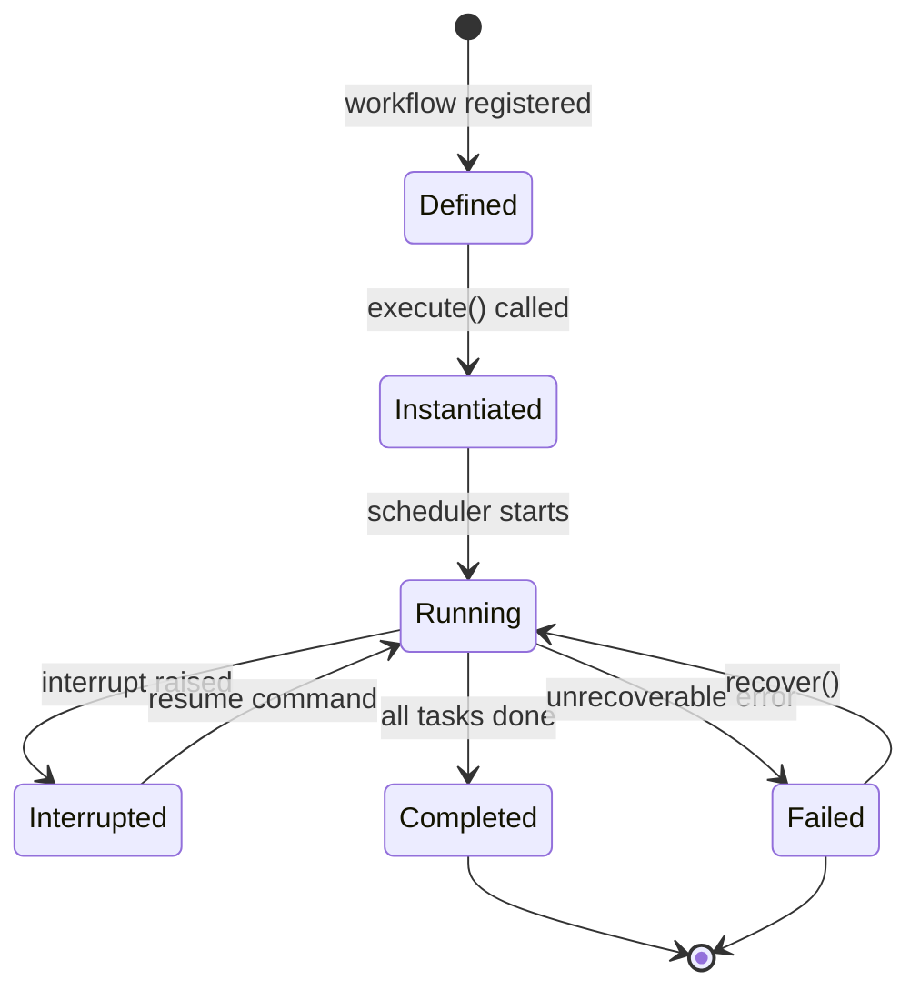
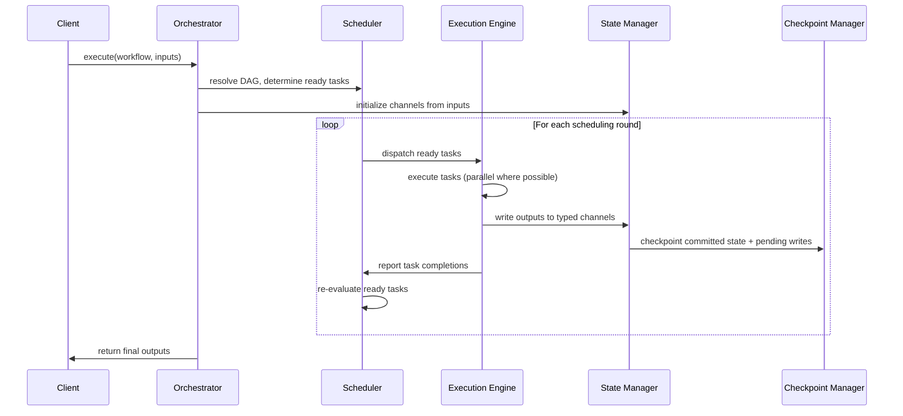
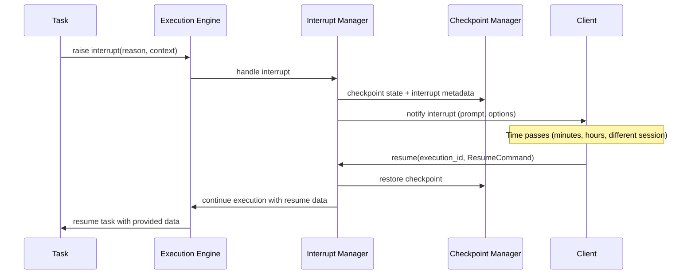
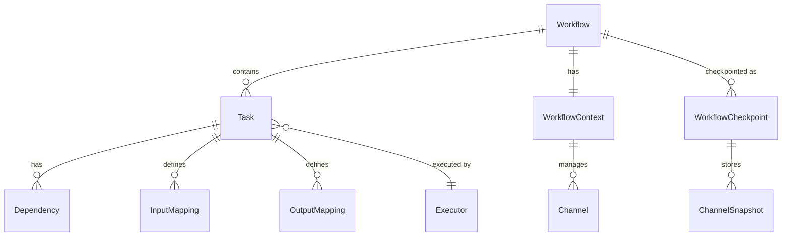

# Agent Orchestrator Design

> Task orchestration and execution engine for y-agent

**Version**: v0.5
**Created**: 2026-03-04
**Updated**: 2026-03-06
**Status**: Draft

---

## TL;DR

The Agent Orchestrator is y-agent's core execution engine, responsible for scheduling and coordinating multi-task workflows. It executes tasks organized as a DAG, supports serial, parallel, conditional, and loop patterns, and provides robust error handling with task-level recovery. Key capabilities include typed state channels with configurable reducers, dual workflow definition modes (TOML and expression DSL), configurable stream modes for diverse client needs, and a first-class interrupt/resume protocol for human-in-the-loop workflows.

---

## Background and Goals

### Background

y-agent requires a general-purpose orchestration engine that can coordinate heterogeneous tasks (LLM calls, tool execution, sub-agents, scripts, human approval) into coherent workflows. Workflows range from simple sequential chains to complex DAGs with parallel branches, conditional routing, and iterative loops.

Analysis of established orchestration patterns (FlowLLM's expression-based composition, LangGraph's Pregel-style supersteps and channel-based state) revealed opportunities to strengthen y-agent's state management, recovery granularity, and developer ergonomics while preserving the existing DAG-centric architecture.

### Goals

| Goal | Measurable Criteria |
|------|-------------------|
| **Flexible orchestration** | Support serial, parallel (All/Any/AtLeast), conditional branch, and loop patterns |
| **Data integrity** | Typed channels with reducers eliminate silent data loss from concurrent writes |
| **Cost-efficient recovery** | Task-level checkpoint/resume; recovering a 10-task workflow at task 8 re-executes only tasks 8-10 |
| **Developer ergonomics** | Simple 3-task sequential workflow expressible in 1 line via expression DSL |
| **Client flexibility** | 5 stream modes (None, Values, Updates, Messages, Debug) configurable per execution |
| **Human-in-the-loop** | Any task can trigger a workflow-level interrupt; resume from any session/device via checkpoint |
| **Observability** | Distributed tracing with per-task spans; structured metrics for duration, concurrency, and error rates |

### Assumptions

1. Single-node deployment for initial release; distributed execution deferred.
2. SQLite is the checkpoint storage backend; external stores (Postgres, S3) deferred.
3. Workflows are acyclic at the DAG level; loops are modeled as special task types with bounded iterations.
4. All tasks are idempotent or explicitly marked as non-idempotent for recovery decisions.

---

## Scope

### In Scope

- DAG-based task dependency resolution and scheduling
- Typed state channels with configurable reducers (LastValue, Append, Merge, Custom)
- Dual workflow definition: TOML configuration and expression DSL shorthand
- Eager and optional superstep execution models
- Task-level checkpointing with pending writes for granular recovery
- Workflow-level interrupt/resume protocol
- Configurable stream modes per execution
- Retry, rollback, and compensation failure strategies
- Workflow templates with parameterization and ParameterSchema (JSON Schema)
- Dynamic workflow generation via LLM
- Runtime workflow modification (add/cancel/update tasks)
- WorkflowStore for persistent template storage, enabling agent-driven workflow creation and reuse (see [agent-autonomy-design.md](agent-autonomy-design.md))

### Out of Scope

- Distributed multi-node execution (deferred to future phase)
- Visual drag-and-drop workflow editor
- External checkpoint services (Postgres, Redis)
- A/B testing of workflow variants
- Cost-based automatic path optimization

---

## High-Level Design

### Component Overview


**Diagram rationale**: Flowchart chosen to show module boundaries and dependency relationships between orchestrator components.

**Legend**:
- **Orchestrator** (yellow): Core engine responsible for scheduling, execution, state, events, checkpoints, and interrupts.
- **Workflow Definition**: Multiple input paths for defining workflows.
- **Runtime Components**: Per-execution instances handling task execution, state channels, and streaming.
- **External**: Dependencies and consumers outside the orchestrator boundary.

### Core Components

**Orchestrator**: Top-level coordinator. Accepts a workflow definition and input parameters, delegates scheduling and execution, and returns results. Owns the lifecycle of a single workflow execution.

**Scheduler**: Resolves the task DAG, determines execution order based on dependency satisfaction and priority, and enforces concurrency limits. Supports both eager scheduling (execute as soon as dependencies satisfy) and superstep scheduling (batch into synchronized rounds).

**Execution Engine**: Runs individual tasks through type-specific executors (LLM, Tool, SubAgent, Script, etc.). Manages retry logic, timeout enforcement, and failure strategy application.

**State Manager**: Maintains the workflow context via typed channels. Each channel has a declared reducer that governs how concurrent writes merge. Provides transactional read/write semantics aligned with checkpoint boundaries.

**Event Bus**: Publishes workflow and task lifecycle events. The Stream Router filters events based on the configured StreamMode before forwarding to clients.

**Checkpoint Manager**: Persists workflow state at defined boundaries (per-task completion or per-superstep). Separates committed state from pending writes to enable granular recovery.

**Interrupt Manager**: Handles workflow-level interrupts raised by any task. Persists interrupt state to checkpoint storage, enabling resume from a different session or device.

### Workflow Definition Modes

The orchestrator accepts workflows through two complementary definition modes:

| Mode | Best For | Example |
|------|----------|---------|
| **TOML Configuration** | Complex workflows with conditions, loops, detailed I/O mappings | 50-150 lines for a full pipeline |
| **Expression DSL** | Simple sequential/parallel flows, rapid prototyping | `search >> analyze >> summarize` |

Both compile to the same internal `Workflow` representation. The expression DSL supports two operators: `>>` for sequential composition and `|` for parallel composition. Parentheses control grouping.

```rust
enum WorkflowDefinition {
    Detailed(TomlWorkflow),
    Expression(String),  // "search >> (analyze | score) >> summarize"
}
```

Expression templates extend the DSL with parameterization: `web_research("{{query}}")` expands to a registered search-scrape-summarize template with variable injection.

### Execution Models

| Model | Behavior | When to Use |
|-------|----------|-------------|
| **Eager** (default) | Tasks execute as soon as dependencies satisfy | Most workflows; maximizes throughput |
| **Superstep** | Tasks batch into synchronized rounds; all results commit atomically per round | Workflows with shared mutable state requiring deterministic ordering |

```rust
enum ExecutionModel {
    Eager,
    Superstep { checkpoint_per_step: bool },
}
```

In superstep mode, each round provides a natural checkpoint boundary, a deterministic execution order (same input produces same task grouping), and simplified debugging ("bug occurred in superstep 3").

### Workflow Instance Lifecycle

Each workflow execution creates a fresh instance to prevent state leakage between runs. The orchestrator follows copy-on-execute semantics: the workflow definition is treated as an immutable template, and each invocation produces an independent execution context with its own channels, checkpoints, and task state.



**Diagram rationale**: State diagram chosen to show the lifecycle transitions of a workflow execution instance.

**Legend**:
- **Defined**: The workflow template exists but no execution is active.
- **Instantiated**: A new execution context has been created from the template.
- **Interrupted**: Execution is paused, awaiting external input; state is persisted for cross-session resume.

This design ensures that concurrent executions of the same workflow definition do not interfere with each other, and that workflow definitions can be safely cached and reused.

### Orchestrator Public Interface

The orchestrator exposes a minimal API surface for workflow lifecycle management:

| Method | Description |
|--------|-------------|
| `execute(definition, inputs, config)` | Create a new execution instance from a workflow definition and start it; returns an `ExecutionHandle` |
| `resume(execution_id, command)` | Resume an interrupted execution with a `ResumeCommand`; returns an `ExecutionHandle` |
| `recover(execution_id)` | Restore the latest checkpoint and re-execute only pending/remaining tasks |
| `cancel(execution_id)` | Cancel a running or interrupted execution; triggers compensation for completed side-effect tasks |
| `status(execution_id)` | Query current execution state, progress, and active task information |
| `subscribe(execution_id, stream_mode)` | Attach a streaming client to a running execution with the specified `StreamMode` |
| `register_template(template)` | Persist a workflow template to the WorkflowStore for reuse; returns a `WorkflowTemplateId` |
| `list_templates(filter)` | Query available templates by name, tags, or creator; returns summary list |
| `get_template(template_id)` | Load a persisted workflow template with its full definition and parameter schema |

The `ExecutionHandle` provides access to the event stream (filtered by `StreamMode`) and a future that resolves to the final workflow output or error.

### WorkflowStore

The WorkflowStore provides persistent storage for workflow templates, enabling agent-driven workflow creation and reuse. Templates are stored in SQLite (consistent with the checkpoint storage backend) and survive agent restarts.

```rust
struct WorkflowTemplate {
    id: WorkflowTemplateId,
    name: String,
    description: String,
    definition: WorkflowDefinition,
    parameter_schema: Option<JsonSchema>,
    tags: Vec<String>,
    created_by: CreatorId,
    version: u64,
}
```

Templates carry an optional `ParameterSchema` (JSON Schema) that defines required and optional parameters. When a template is executed, parameter values are validated against the schema before workflow instantiation. This enables the same workflow definition to be reused with different inputs -- critical for the Parameterized Scheduling feature (see [agent-autonomy-design.md](agent-autonomy-design.md)).

Agents interact with the WorkflowStore through `WorkflowCreate`, `WorkflowList`, and `WorkflowGet` meta-tools (see [agent-autonomy-design.md](agent-autonomy-design.md)).

---

## Key Flows/Interactions

### Workflow Execution Flow



**Diagram rationale**: Sequence diagram chosen to show the temporal interaction between components during workflow execution.

**Legend**:
- The loop represents either eager or superstep scheduling rounds.
- Checkpoint occurs after each task (eager mode) or after each superstep (superstep mode).

### Interrupt and Resume Flow



**Diagram rationale**: Sequence diagram chosen to illustrate the asynchronous interrupt/resume handshake across potentially different sessions.

**Legend**:
- **Interrupt Manager** persists all state needed for cross-session resume.
- **ResumeCommand** carries the user's decision (Approve, Reject, Provide data, Cancel).

### Recovery Flow

```mermaid
sequenceDiagram
    participant Client
    participant Orchestrator
    participant CP as Checkpoint Manager
    participant Engine as Execution Engine

    Client->>Orchestrator: recover(workflow_id)
    Orchestrator->>CP: load latest checkpoint
    CP->>Orchestrator: committed state + pending writes

    Note over Orchestrator: Skip tasks in committed; re-execute pending + remaining

    Orchestrator->>Engine: execute only pending/remaining tasks
    Engine->>Orchestrator: task results
    Orchestrator->>Client: return final outputs
```

**Diagram rationale**: Sequence diagram chosen to show the recovery protocol and which tasks are skipped vs re-executed.

**Legend**:
- **Committed state**: Task outputs that were successfully persisted before failure.
- **Pending writes**: Outputs from tasks that started but did not commit before failure.

---

## Data and State Model

### Typed Channels

The workflow context uses typed channels instead of a plain HashMap to handle concurrent writes safely. Each channel declares a reducer that governs merge semantics.

```rust
struct WorkflowContext {
    workflow_id: WorkflowId,
    inputs: HashMap<String, Value>,
    channels: HashMap<String, Channel>,
    task_outputs: HashMap<TaskId, TaskOutput>,
    state: WorkflowState,
    metadata: HashMap<String, Value>,
}

struct Channel {
    value: Value,
    channel_type: ChannelType,
    version: u64,
}

enum ChannelType {
    LastValue,
    Append,
    Merge { conflict: MergeConflict },
    Custom(Box<dyn Reducer>),
}
```

| Channel Type | Behavior | Use Case |
|-------------|----------|----------|
| **LastValue** | Last write wins (backward-compatible default) | Single-writer variables |
| **Append** | Accumulates values into a list | Multiple search sources writing results |
| **Merge** | Deep-merges maps with configurable conflict resolution | Aggregating structured data from parallel tasks |
| **Custom** | User-defined reducer function | Domain-specific aggregation logic |

**Migration path**: Existing `variables: HashMap<String, Value>` becomes `channels` with `LastValue` type by default. No breaking change for current workflows.

### Checkpoint Data

```rust
struct WorkflowCheckpoint {
    committed_channels: HashMap<String, ChannelSnapshot>,
    committed_tasks: HashMap<TaskId, TaskOutput>,

    pending_channel_writes: Vec<(String, Value)>,
    pending_task_outputs: Vec<(TaskId, TaskOutput)>,

    versions_seen: HashMap<TaskId, u64>,

    step_number: u64,
    checkpoint_time: Timestamp,
}
```

The separation of committed vs pending state enables task-level recovery. On failure at task N, recovery restores committed state and re-executes only tasks whose outputs are in `pending` or not yet started.

### Entity Relationships



**Diagram rationale**: ER diagram chosen to show the structural relationships between core data entities.

**Legend**:
- **Workflow** is the top-level container; it owns tasks, context, and checkpoints.
- **Channel** replaces the previous plain variable storage with typed, reducer-aware state.
- **WorkflowCheckpoint** captures both committed and pending state for recovery.

### Interrupt and Resume Types

The interrupt/resume protocol uses two core types. Any task can raise a `WorkflowInterrupt` during execution, and the orchestrator suspends the workflow until a matching `ResumeCommand` is received.

```rust
enum WorkflowInterrupt {
    HumanApproval {
        prompt: String,
        options: Vec<ApprovalOption>,
        timeout: Duration,
    },
    Confirmation {
        action: String,
        details: Value,
    },
    InputRequired {
        schema: JsonSchema,
        prompt: String,
    },
}

enum ResumeCommand {
    Approve { selected: Value },
    Reject { reason: String },
    Provide { data: Value },
    Cancel,
}
```

| Interrupt Type | Trigger | Expected Resume |
|---------------|---------|-----------------|
| **HumanApproval** | Task detects a high-risk or irreversible operation | `Approve` or `Reject` |
| **Confirmation** | Agent wants to verify intent before proceeding | `Approve` or `Cancel` |
| **InputRequired** | Task needs additional information not available in context | `Provide` with data matching the declared schema |

The Interrupt Manager persists the interrupt metadata alongside the checkpoint, enabling resume from a different session or device. Resume commands are validated against the interrupt's declared schema before application.

### Task Definition

```rust
struct TaskDefinition {
    id: TaskId,
    name: String,
    task_type: TaskType,
    executor: ExecutorConfig,
    inputs: Vec<InputMapping>,
    outputs: Vec<OutputMapping>,
    condition: Option<Condition>,
    retry: Option<RetryConfig>,
    timeout: Option<Duration>,
    metadata: TaskMetadata,
}
```

Task types include: `LLMCall`, `ToolExecution`, `SubAgent`, `SubWorkflow`, `Script`, `HumanApproval`, `Branch`, `Parallel`, and `Loop`. Each type is handled by a dedicated executor.

### Data Flow and Mapping

Tasks receive inputs from four sources and write outputs to three targets:

| Input Source | Description |
|-------------|-------------|
| `WorkflowInput` | Parameters provided at workflow invocation |
| `TaskOutput` | Output from a predecessor task (by task ID and field) |
| `Context` | Shared channel variable |
| `Constant` / `Expression` | Static values or computed expressions |

| Output Target | Description |
|--------------|-------------|
| `WorkflowOutput` | Final output of the workflow |
| `Context` | Write to a typed channel (reducer applies) |
| `NextTaskInput` | Direct input to a specific downstream task |

Optional transforms (JsonPath, Regex, Cast, Function) can be applied during mapping.

---

## Failure Handling and Edge Cases

### Failure Strategies

Each task and workflow can declare a failure strategy:

| Strategy | Behavior | When to Use |
|----------|----------|-------------|
| **FailFast** | Abort workflow immediately | Critical path; any failure is fatal |
| **ContinueOnError** | Mark task failed, continue other branches | Best-effort parallel tasks |
| **Retry** | Re-execute with backoff | Transient errors (network, rate limits) |
| **Rollback** | Execute compensation tasks in reverse order | Side-effect-bearing tasks (emails, API calls) |
| **Ignore** | Mark as succeeded despite failure | Optional enrichment tasks |
| **Compensation** | Execute a specific compensating task | Undo a specific side effect |
| **FileRollback** | Restore files modified by tasks in scope via File Journal | File-mutating workflows (built-in; see [file-journal-design.md](file-journal-design.md)) |

### Retry Configuration

```rust
struct RetryConfig {
    max_attempts: usize,
    delay: Duration,
    backoff: BackoffStrategy,  // Fixed, Linear, Exponential
    retry_on: RetryCondition,  // Always, ErrorTypes, Custom
}
```

### Task-Level Recovery with Pending Writes

When a workflow fails mid-execution:

1. **Committed tasks** (outputs in `committed_tasks`): Skipped on recovery.
2. **Pending tasks** (outputs in `pending_task_outputs`): Re-executed because their writes were not committed.
3. **Unstarted tasks**: Executed normally.

This avoids re-executing expensive LLM calls and prevents duplicate side effects from non-idempotent tasks.

| Scenario | Without Pending Writes | With Pending Writes |
|----------|----------------------|---------------------|
| 10 tasks, fail at task 8 | Re-run all 10 | Re-run tasks 8-10 |
| Recovery time | ~100% of original | ~30% of original |
| Wasted LLM calls | 7 | 0 |

### Edge Cases

| Edge Case | Handling |
|-----------|---------|
| Circular dependency in DAG | Detected at workflow validation time; rejected with clear error |
| Task timeout during interrupt | Interrupt persists state; timeout cancels the waiting task, not the interrupt |
| Concurrent writes to same channel | Reducer applies deterministically; Append preserves all values, LastValue takes latest |
| Checkpoint storage failure | Retry checkpoint write with exponential backoff; fail workflow if storage is persistently unavailable |
| Resume with stale checkpoint | Version tracking in `versions_seen` detects stale state; reject resume with clear error |
| Dynamic task addition during superstep | Queued for next superstep; does not disrupt current round |

### Compensation Mechanism

For tasks with side effects, a compensation task can be registered:

```rust
struct CompensationTask {
    original_task: TaskId,
    compensation: TaskDefinition,
    trigger_on: CompensationTrigger,  // OnFailure, OnRollback, Manual
}
```

On rollback, compensation tasks execute in reverse dependency order to undo side effects. For file-mutating operations, the built-in `FileRollback` strategy leverages the File Journal (see [file-journal-design.md](file-journal-design.md)) to automatically restore modified files without requiring manually authored compensation tasks.

---

## Security and Permissions

### Task Execution Sandboxing

| Concern | Approach |
|---------|----------|
| **Script execution** | Script tasks run in a sandboxed environment with restricted filesystem and network access |
| **Tool access control** | Each task declares required tools; the orchestrator validates tool permissions before execution |
| **Secret management** | Secrets are injected into task context at execution time, never persisted in checkpoints |
| **Resource limits** | Per-task CPU, memory, and network limits enforced via `ResourceLimits` configuration |

### Workflow-Level Permissions

| Permission | Description |
|-----------|-------------|
| `workflow:execute` | Permission to start a workflow |
| `workflow:cancel` | Permission to cancel a running workflow |
| `workflow:resume` | Permission to resume an interrupted workflow |
| `task:approve` | Permission to respond to human approval interrupts |

### Checkpoint Security

- Checkpoint data is encrypted at rest when containing sensitive context.
- Interrupt metadata (prompts, options) is sanitized to exclude raw secrets.
- Resume commands are validated against the interrupt schema before application.

---

## Performance and Scalability

### Concurrency Control

```rust
struct ConcurrencyController {
    global_semaphore: Semaphore,
    resource_semaphores: HashMap<ResourceType, Semaphore>,
}
```

The orchestrator enforces concurrency at two levels:
1. **Global**: `max_concurrent_tasks` per workflow limits total parallel tasks.
2. **Per-resource**: Separate semaphores for CPU-bound, network-bound, and custom resource types prevent any single category from starving others.

### Task Priority Scheduling

Tasks carry a priority level (Critical, High, Normal, Low, Background) and a numeric weight. The scheduler uses priority as the primary sort key and weight as the tiebreaker. This ensures high-priority tasks (e.g., user-facing LLM calls) are scheduled before background enrichment tasks.

### Task Caching

Deterministic tasks can opt into result caching:

| Cache Strategy | Description |
|---------------|-------------|
| **InputHash** | Cache key derived from task inputs; same inputs return cached output |
| **Custom** | User-defined cache key expression |
| **Composite** | Cache key composed from multiple fields |

Cache entries have configurable TTL and conditional invalidation. Caching is particularly valuable for expensive LLM calls with deterministic prompts.

### Performance Targets

| Metric | Target |
|--------|--------|
| Task scheduling overhead | < 1ms per task |
| Checkpoint write latency (SQLite) | < 10ms per checkpoint |
| Maximum concurrent tasks per workflow | 50 |
| Workflow DAG validation | < 5ms for 100-task DAG |
| Expression DSL parsing | < 1ms |

---

## Observability

### Stream Modes

The orchestrator supports five stream modes, configurable per execution:

| Stream Mode | Output | Use Case |
|------------|--------|----------|
| **None** | Final result only | API clients awaiting completion |
| **Values** | Full context snapshot per task completion | Dashboards showing workflow state |
| **Updates** | Delta changes only | Bandwidth-sensitive real-time progress |
| **Messages** | Token-level output for LLM tasks | CLI typewriter effect |
| **Debug** | All internal events including scheduling decisions | Development and troubleshooting |

```rust
enum StreamMode {
    None,
    Values,
    Updates,
    Messages,
    Debug,
}

struct ExecutionConfig {
    stream_mode: StreamMode,
    execution_model: ExecutionModel,
    // ...
}
```

The Event Bus publishes all events internally. The Stream Router filters events based on the configured StreamMode before forwarding to the client, avoiding unnecessary serialization and transmission overhead.

### Execution Tracing

Each workflow execution produces a trace with per-task spans:

- **Trace ID**: Unique identifier for the entire workflow execution.
- **Span per task**: Captures task ID, start/end time, status, and custom attributes.
- **Parent-child spans**: Sub-workflows and sub-agents create child spans linked to the parent task span.
- **Span events**: Key milestones within a task (e.g., LLM request sent, response received, tool invoked).

### Metrics

| Metric Category | Examples |
|----------------|----------|
| **Execution** | Total/successful/failed executions (counters) |
| **Latency** | Workflow duration, per-task duration (histograms) |
| **Concurrency** | Active tasks, queued tasks (gauges) |
| **Recovery** | Recovery attempts, tasks skipped via checkpoint (counters) |
| **Streaming** | Events emitted per mode, client connection count (counters/gauges) |

### Event Types

```rust
enum WorkflowEvent {
    WorkflowStarted { workflow_id: WorkflowId },
    WorkflowCompleted { workflow_id: WorkflowId, status: WorkflowStatus },
    WorkflowFailed { workflow_id: WorkflowId, error: String },
    TaskStarted { workflow_id: WorkflowId, task_id: TaskId },
    TaskCompleted { workflow_id: WorkflowId, task_id: TaskId, output: TaskOutput },
    TaskFailed { workflow_id: WorkflowId, task_id: TaskId, error: String },
    TaskRetrying { workflow_id: WorkflowId, task_id: TaskId, attempt: usize },
    StateChanged { workflow_id: WorkflowId, old_state: WorkflowState, new_state: WorkflowState },
    ContextUpdated { workflow_id: WorkflowId, channel: String, value: Value },
    InterruptRaised { workflow_id: WorkflowId, reason: InterruptReason },
    InterruptResumed { workflow_id: WorkflowId, command: ResumeCommand },
    CheckpointCreated { workflow_id: WorkflowId, step: u64 },
}
```

---

## Rollout and Rollback

### Phased Implementation

| Phase | Scope | Duration | Deliverables |
|-------|-------|----------|-------------|
| **Phase 1**: State Management Foundation | Typed channels, pending writes, context API | Weeks 1-2 | `ChannelType` enum, `WorkflowCheckpoint` with committed/pending, backward-compatible channel access |
| **Phase 2**: Execution Model | Stream modes, interrupt/resume, superstep | Weeks 3-4 | 5 stream modes, `WorkflowInterrupt` and `ResumeCommand`, optional superstep execution |
| **Phase 3**: DSL and Migration | Expression parser, TOML-to-expression tooling | Weeks 5-6 | `>>` and `|` operators, expression templates, migration documentation |

### Migration Strategy

1. **Typed Channels**: Existing `variables: HashMap<String, Value>` silently upgraded to `LastValue` channels. No workflow configuration changes required. New workflows can opt into Append/Merge/Custom.

2. **Checkpoint Format**: New checkpoint format includes committed/pending separation. Old checkpoints are migrated on first load by treating all task outputs as committed.

3. **Stream Mode**: Default stream mode is backward-compatible with current EventBus behavior (`Debug` mode). Clients can opt into filtered modes.

4. **Expression DSL**: Purely additive. Existing TOML workflows are unaffected. New `WorkflowDefinition::Expression` variant added alongside existing `Detailed`.

### Rollback Plan

Each phase is independently rollbackable:

| Phase | Rollback Approach |
|-------|-------------------|
| Phase 1 | Feature flag `typed_channels`; disable to revert to HashMap behavior |
| Phase 2 | Feature flag `stream_modes` and `interrupt_resume`; disable individually |
| Phase 3 | Expression DSL is opt-in; removal does not affect TOML workflows |

---

## Alternatives and Trade-offs

### Full Pregel Adoption vs Optional Superstep

| | Full Pregel | Optional Superstep (chosen) |
|-|-------------|----------------------------|
| **Effort** | High (full rewrite) | Medium (additive) |
| **Impact on existing workflows** | Breaking change | None (opt-in) |
| **Determinism** | Always deterministic | Deterministic when selected |
| **Performance** | Synchronization overhead always | Overhead only when needed |

**Decision**: Offer superstep as an optional execution model. Most workflows benefit from eager execution; superstep is reserved for shared-state-heavy workflows.

### FlowLLM-Style Op Composition vs Expression DSL Shorthand

| | Full Op Composition | Expression DSL (chosen) |
|-|---------------------|------------------------|
| **Abstraction** | Operators as first-class objects | String-based shorthand |
| **Type safety** | Strong (compile-time) | Weak (runtime parsing) |
| **Debuggability** | Harder (nested closures) | Easier (maps to familiar DAG) |
| **Migration** | Architecture change | Syntactic sugar, no architecture change |

**Decision**: Expression DSL as syntactic sugar that compiles to the existing internal representation. Complex workflows continue to use TOML.

### Separate Checkpoint Service vs Embedded SQLite

| | External Service (Postgres) | Embedded SQLite (chosen) |
|-|----------------------------|--------------------------|
| **Deployment complexity** | Requires additional service | Zero additional dependencies |
| **Performance** | Network round-trip per checkpoint | Local file I/O |
| **Distributed support** | Native | Not supported |
| **Scalability** | Horizontal | Single-node |

**Decision**: Start with SQLite for single-node deployment. Design the `CheckpointStorage` trait to be backend-agnostic for future migration to external services.

### Last-Write-Wins vs Typed Channels

| | Last-Write-Wins (current) | Typed Channels (chosen) |
|-|--------------------------|------------------------|
| **Simplicity** | Trivial implementation | Additional complexity |
| **Data safety** | Silent data loss on concurrent writes | Explicit merge semantics |
| **Backward compatibility** | N/A | Full (LastValue = default) |
| **Developer experience** | Manual merge logic in downstream tasks | Declarative reducer at channel level |

**Decision**: Typed channels with LastValue as default. Eliminates a class of subtle bugs where parallel tasks silently overwrite each other's results.

---

## Open Questions

| # | Question | Owner | Due Date | Status |
|---|----------|-------|----------|--------|
| 1 | Should expression DSL support conditional routing (e.g., `if/else` syntax), or limit it to sequential/parallel composition? | Orchestrator team | 2026-03-20 | Open |
| 2 | What is the maximum checkpoint retention policy? How many checkpoints per workflow should be kept? | Orchestrator team | 2026-03-20 | Open |
| 3 | Should custom reducers be defined inline in TOML or registered in a global reducer registry? | Orchestrator team | 2026-03-27 | Open |
| 4 | For superstep mode, should cross-step channel reads see the previous step's committed state or the current step's pending writes? | Orchestrator team | 2026-03-27 | Open |
| 5 | How should interrupt timeouts interact with workflow-level timeouts? Should an interrupted workflow's timeout pause? | Orchestrator team | 2026-04-03 | Open |

