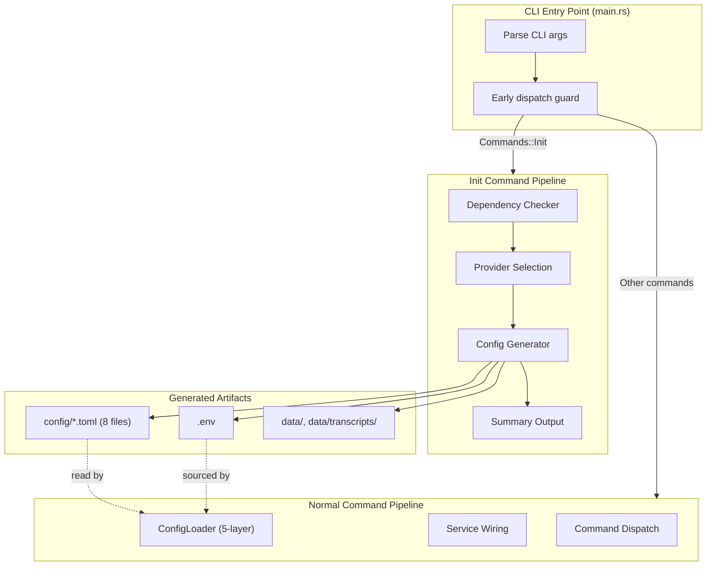
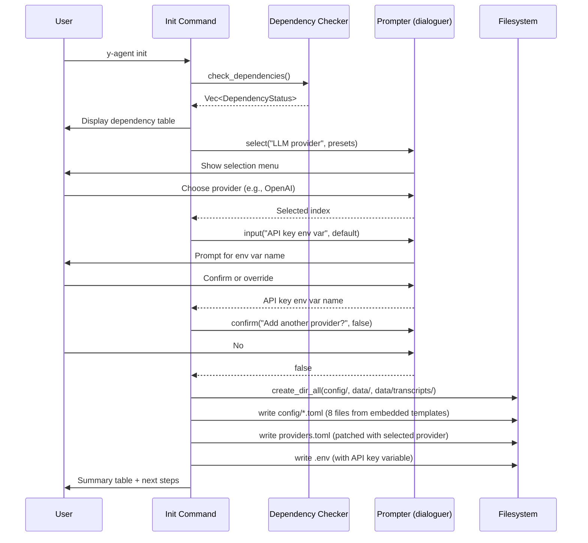

# Project Initialization Design

> First-run setup command for y-agent: environment detection, interactive provider selection, and configuration scaffolding

**Version**: v0.1
**Created**: 2026-03-10
**Updated**: 2026-03-10
**Status**: Draft

---

## TL;DR

The `y-agent init` command is a first-run CLI subcommand that bootstraps a new y-agent deployment. It detects environment dependencies (Rust, Docker, PostgreSQL, Qdrant), guides the user through interactive LLM provider selection from a preset table, generates all configuration files from embedded templates, and creates required data directories. The command executes before the ConfigLoader pipeline and requires no pre-existing configuration. It supports both interactive (terminal) and non-interactive (CI/scripting) modes.

---

## Background and Goals

### Background

y-agent requires eight TOML configuration files, a `.env` file, and two data directories before any other command can execute. The five-layer configuration hierarchy (CLI args, env vars, user config, project config, defaults) assumes these files exist. Without an automated setup flow, users must manually copy `.example.toml` files, select and configure an LLM provider, verify infrastructure dependencies, and create data directories -- a process that is error-prone and undocumented at the tool level.

The init command is a one-time entry point that must run before the standard ConfigLoader pipeline, since it creates the very files that pipeline reads.

### Goals

| Goal | Measurable Criteria |
|------|-------------------|
| **Zero manual file copying** | All 8 config files + `.env` + 2 data directories created by a single command |
| **Correct provider configuration** | Selected provider's TOML parses successfully via `ProviderPoolConfig::validate()` |
| **Dependency transparency** | All 8 environment dependencies detected and reported in < 5 seconds |
| **Non-interactive support** | Full initialization possible with `--non-interactive --provider <key>` for CI/scripting |
| **Idempotent re-runs** | Running init on an existing project prompts before overwriting; `--force` bypasses |
| **Self-contained binary** | Init works from an installed binary with no access to the source tree |

### Assumptions

1. The user has a working Rust toolchain if building from source; for binary distribution the toolchain is not required.
2. SQLite is embedded and does not require external installation.
3. PostgreSQL and Qdrant are optional services; their absence does not block initialization.
4. LLM provider API keys are set in environment variables, never in config files.
5. The init command is the only command that runs before configuration loading.

---

## Scope

### In Scope

- Environment dependency detection (8 checks: rustc, cargo, sqlite3, docker, docker compose, PostgreSQL, Qdrant, sqlx-cli)
- Interactive LLM provider selection from 7 presets plus a custom endpoint option
- Configuration file generation from compile-time embedded templates
- Provider-specific `providers.toml` patching based on user selection
- `.env` file generation with provider-specific API key variable
- Data directory creation (`config/`, `data/`, `data/transcripts/`)
- Non-interactive mode with CLI flags for CI/scripting
- Overwrite protection for existing files with `--force` override
- Post-initialization summary with next-step instructions

### Out of Scope

- Database migration execution (handled by `sqlx migrate run` or future `y-agent migrate` command)
- Provider API key validation or connectivity testing (deferred to `y-agent status`)
- Docker Compose service startup (user responsibility)
- User config file creation at `~/.config/y-agent/` (created on first use by ConfigLoader)
- Configuration editing or interactive tuning after initial generation

---

## High-Level Design

### Initialization Pipeline



**Diagram type rationale**: Flowchart chosen to show the branching control flow between init and normal command pipelines, and the dependency relationship between generated artifacts and the ConfigLoader.

**Legend**:
- **CLI Entry Point**: The `main()` function intercepts `Init` before ConfigLoader runs.
- **Init Command Pipeline**: The four sequential stages of initialization.
- **Generated Artifacts**: Files and directories created by the init command.
- **Normal Command Pipeline**: The standard config-loading path used by all other commands.

### Early Dispatch Design

The init command must execute before `ConfigLoader::load()` because it creates the configuration files that the loader reads. The dispatch guard in `main.rs` checks for `Commands::Init` immediately after argument parsing and returns before any configuration loading:

```rust
if let Some(Commands::Init(ref args)) = cli.command {
    return commands::init::run(args);
}
// ConfigLoader runs only after this point.
```

### Prompter Abstraction

All user interaction is mediated through a `Prompter` trait, enabling three execution strategies:

| Strategy | Implementation | Use Case |
|----------|---------------|----------|
| **Interactive** | Wraps `dialoguer` (Select, Input, Confirm) | Terminal sessions |
| **Non-interactive** | Returns defaults for all prompts | CI/scripting (`--non-interactive`) |
| **Mock** | Returns preprogrammed responses | Unit testing |

### Template Embedding

All 8 example configuration files and the `.env.example` are embedded into the binary at compile time via `include_str!()`. This ensures the init command works from an installed binary without access to the source tree. The embedded templates total approximately 4 KB.

---

## Key Flows/Interactions

### Interactive Initialization Flow



**Diagram type rationale**: Sequence diagram chosen to show the temporal interaction between user, init subsystems, and filesystem during the interactive flow.

**Legend**:
- **Dependency Checker**: Runs CLI commands and TCP probes to detect infrastructure.
- **Prompter**: Abstracts terminal interaction; replaceable with non-interactive or mock.
- **Filesystem**: Target directory for all generated artifacts.

### Non-Interactive Flow

In non-interactive mode (`--non-interactive --provider openai`), the Prompter returns defaults for all prompts. The provider is selected by the `--provider` flag, and the API key env var uses the preset default (overridable via `--api-key-env`). No user interaction occurs.

---

## Data and State Model

### Provider Preset Schema

Each preset maps to a complete `ProviderConfig` entry:

| Field | Example (OpenAI) | Example (Ollama) |
|-------|-----------------|-----------------|
| `id` | `openai-main` | `ollama-local` |
| `provider_type` | `openai` | `openai` |
| `model` | `gpt-4o` | `llama3.1` |
| `tags` | `["reasoning", "general"]` | `["local", "general"]` |
| `max_concurrency` | 3 | 1 |
| `context_window` | 128,000 | 131,072 |
| `api_key_env` | `OPENAI_API_KEY` | (none) |
| `base_url` | (default) | `http://localhost:11434/v1` |

### Built-in Presets

| Key | Display Name | Provider Type | Requires API Key |
|-----|-------------|---------------|-----------------|
| `openai` | OpenAI (GPT-4o) | openai | Yes |
| `anthropic` | Anthropic (Claude 3.5 Sonnet) | anthropic | Yes |
| `deepseek` | DeepSeek (Chat) | openai | Yes |
| `deepseek-reasoner` | DeepSeek (Reasoner) | openai | Yes |
| `groq` | Groq (Llama 3.1 70B) | openai | Yes |
| `together` | Together AI (Llama 3.1 70B) | openai | Yes |
| `ollama` | Ollama (Local) | openai | No |

Additionally, a **Custom** option allows the user to specify arbitrary `model`, `base_url`, and `api_key_env` values for any OpenAI-compatible endpoint.

### Generated File Map

| File | Source | Customized By Init |
|------|--------|-------------------|
| `config/y-agent.toml` | Embedded template | No |
| `config/providers.toml` | Generated from presets | Yes (provider entries) |
| `config/storage.toml` | Embedded template | No |
| `config/session.toml` | Embedded template | No |
| `config/runtime.toml` | Embedded template | No |
| `config/hooks.toml` | Embedded template | No |
| `config/tools.toml` | Embedded template | No |
| `config/guardrails.toml` | Embedded template | No |
| `.env` | Embedded template | Yes (API key variable) |

### Dependency Detection Model

| Dependency | Detection Method | Required | Purpose |
|-----------|-----------------|----------|---------|
| `rustc` | `rustc --version` | Yes (source builds) | Rust compiler |
| `cargo` | `cargo --version` | Yes (source builds) | Build system |
| `sqlite3` | `sqlite3 --version` | No | Database debugging CLI |
| `docker` | `docker --version` | No | Container runtime for tool isolation |
| `docker compose` | `docker compose version` | No | Full-stack deployment |
| PostgreSQL | TCP connect to `127.0.0.1:5432` (2s timeout) | No | Diagnostics database |
| Qdrant | TCP connect to `127.0.0.1:6333` (2s timeout) | No | Vector store for memory/knowledge |
| `sqlx-cli` | `sqlx --version` | No | Database migration tool |

---

## Failure Handling and Edge Cases

| Scenario | Handling |
|----------|---------|
| Config files already exist | Prompt user for overwrite confirmation; `--force` bypasses |
| Target directory does not exist | `create_dir_all` creates intermediate directories |
| No terminal attached (piped stdin) | `dialoguer` fails; user must use `--non-interactive` |
| Invalid `--provider` value | Rejected by clap argument parser with valid options listed |
| Missing required dependency (rustc/cargo) | Warning printed; initialization continues (binary install does not need them) |
| Filesystem permission error | `anyhow` error with path context propagated to user |
| Custom provider with empty model | Default model name used from preset |
| Multiple providers selected | All providers written as `[[providers]]` entries in providers.toml |
| `--non-interactive` without `--provider` | Uses first preset (OpenAI) as default |

---

## Security and Permissions

| Concern | Approach |
|---------|----------|
| **API keys** | Never written to config files; only the environment variable *name* is stored in `providers.toml` (`api_key_env` field). The `.env` file contains placeholder values. |
| **File permissions** | Config files created with default umask; no special permission enforcement (single-user tool). |
| **Template injection** | Templates are compile-time embedded constants; no user input is interpolated into template content beyond provider fields. Provider fields are serialized via Rust format strings, not string concatenation into TOML. |
| **Overwrite protection** | Existing files require explicit confirmation or `--force` flag; prevents accidental loss of user-modified configurations. |

---

## Performance and Scalability

| Metric | Target |
|--------|--------|
| Total init execution time | < 5 seconds (dominated by dependency TCP probes) |
| Dependency check parallelism | Sequential (8 checks, each < 2s timeout) |
| File I/O | 11 files written; negligible on any modern filesystem |
| Binary size overhead | ~4 KB for embedded templates |

The init command is a one-time operation. Performance optimization beyond the TCP probe timeout (2 seconds per unreachable service) is unnecessary.

---

## Observability

| Aspect | Approach |
|--------|---------|
| **Structured output** | Dependency table uses `output::format_table()` for consistent formatting |
| **Success/warning indicators** | Uses `output::print_success()`, `output::print_warning()`, `output::print_error()` |
| **Tracing** | Init runs before tracing subscriber initialization; uses direct `println!` output |
| **Audit trail** | No persistent logging; generated files serve as the record of what was configured |

Init does not participate in the span-based tracing system because it executes before the tracing subscriber is initialized. This is intentional: init is a bootstrapping operation, not an agent execution.

---

## Rollout and Rollback

### Phased Implementation

| Phase | Scope | Deliverables |
|-------|-------|-------------|
| **Phase 1** | Core scaffolding | `InitArgs` clap struct, early dispatch in main.rs, `Commands::Init` variant, empty `run()` |
| **Phase 2** | Provider presets | Preset table, TOML generation, roundtrip tests |
| **Phase 3** | Prompter abstraction | `Prompter` trait, Interactive/NonInteractive/Mock implementations |
| **Phase 4** | Dependency detection | 8-item detection, table formatting |
| **Phase 5** | Config generation | Template embedding, directory creation, file writing, overwrite logic |
| **Phase 6** | Orchestration | Full `run()` pipeline, summary output, next-step instructions |
| **Phase 7** | Integration tests | End-to-end tempdir tests, ConfigLoader roundtrip verification |

### Rollback Plan

The init command is self-contained in `commands/init.rs` with no impact on existing commands. Rollback is trivial:

- Remove the `Init` variant from `Commands` enum.
- Remove the early dispatch guard from `main.rs`.
- Remove `commands/init.rs`.
- Remove `dialoguer` dependency.

No feature flag is needed because init has zero coupling with the rest of the system.

---

## Alternatives and Trade-offs

### Template Source Strategy

| | `include_str!()` (chosen) | Filesystem lookup | Build script (`build.rs`) |
|-|--------------------------|------------------|--------------------------|
| **Binary portability** | Works from installed binary | Requires source tree | Works from installed binary |
| **Template drift** | Auto-updates on rebuild | Auto-updates (reads live files) | Auto-updates on rebuild |
| **Complexity** | Minimal (one macro per file) | Path resolution logic | Build script + OUT_DIR |
| **Binary size** | +4 KB | No increase | +4 KB |

**Decision**: `include_str!()` for simplicity and binary portability. The 4 KB size cost is negligible.

### Interactive Library

| | dialoguer (chosen) | inquire | Raw stdin |
|-|-------------------|---------|-----------|
| **Ecosystem** | Mature, widely used | Newer, feature-rich | No dependency |
| **Features** | Select, Input, Confirm | Select, MultiSelect, Editor | Manual implementation |
| **Testability** | Requires trait abstraction | Requires trait abstraction | Directly testable |
| **Dependency weight** | Light (console crate) | Moderate (crossterm) | Zero |

**Decision**: dialoguer for its maturity and light dependency footprint. The Prompter trait provides testability regardless of library choice.

### Provider Configuration Approach

| | Patched TOML (chosen) | Full TOML generation | Interactive TOML editor |
|-|----------------------|---------------------|------------------------|
| **Comment preservation** | Pool-level comments preserved in header | No comments | Full comment support |
| **Complexity** | Moderate (header + serialized entries) | Simple (pure serialization) | High (TUI editor) |
| **User experience** | Clean file ready for manual editing | Minimal comments | Immediate editing |

**Decision**: Patched TOML approach. A static header with pool-level settings (freeze duration, health check interval) is concatenated with programmatically serialized `[[providers]]` entries. This preserves useful comments while ensuring correct TOML structure.

---

## Open Questions

| # | Question | Owner | Due Date | Status |
|---|----------|-------|----------|--------|
| 1 | Should `y-agent init` also run `sqlx migrate run` when sqlx-cli is detected? | CLI team | 2026-03-24 | Open |
| 2 | Should the init command support a `--template` flag for project-specific preset bundles (e.g., `--template research` vs `--template production`)? | CLI team | 2026-04-07 | Open |
| 3 | Should dependency detection for Docker test actual daemon connectivity (`docker info`) rather than just binary presence? | CLI team | 2026-03-17 | Open |
| 4 | Should the user config directory (`~/.config/y-agent/`) be created during init, or remain deferred to first ConfigLoader use? | CLI team | 2026-03-17 | Open |
