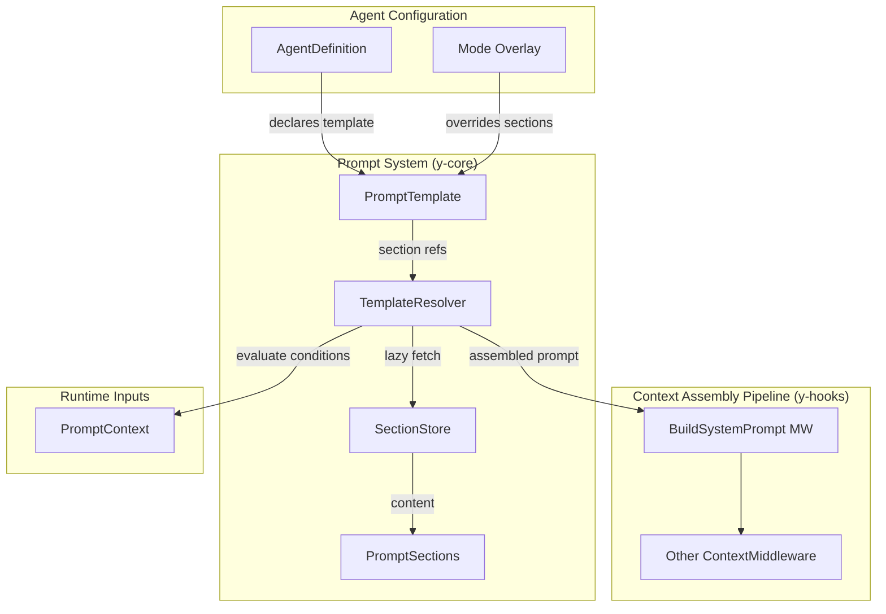
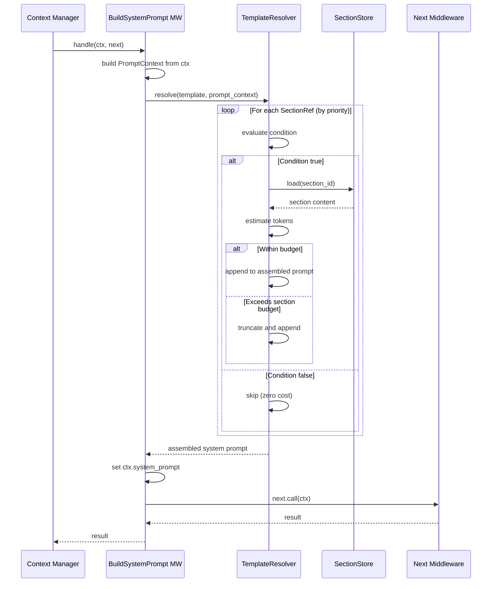
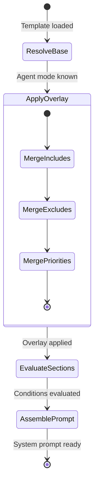
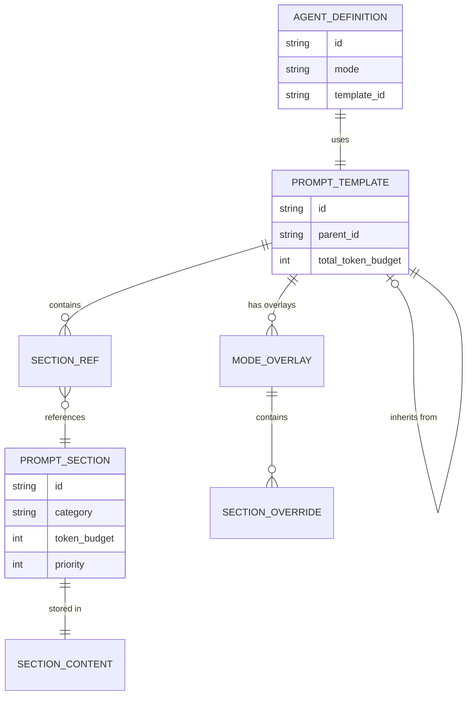

# Prompt Assembly and Template System Design

> Structured, reusable, lazily-loaded prompt composition for y-agent

**Version**: v0.1
**Created**: 2026-03-07
**Updated**: 2026-03-07
**Status**: Draft

---

## TL;DR

y-agent's prompt system decouples prompt **authoring** from prompt **assembly**. Prompts are composed from reusable **PromptSection** units -- typed, prioritized, token-budgeted fragments that can be independently authored, versioned, and conditionally included. A **PromptTemplate** declares which sections an agent needs and under what conditions they activate. The `BuildSystemPrompt` ContextMiddleware (priority 100 in the Context Assembly Pipeline; see [context-session-design.md](context-session-design.md)) resolves a template into the final system prompt by evaluating section conditions against the current **PromptContext** (agent mode, active skills, tool state, environment). Sections are **lazily loaded**: the template declares section references, but section content is fetched from the **SectionStore** only when the condition evaluates to true. A **token budget** per section prevents any single section from dominating the system prompt window. Agent behavioral modes (build, plan, explore, general) map to **mode overlays** that toggle section inclusion and adjust section priorities without duplicating content. This design directly addresses the attention dilution concern: instead of stuffing everything into one monolithic prompt, each agent turn assembles only the sections relevant to its current task, mode, and context.

---

## Background and Goals

### Background

Prompt construction is the hidden bottleneck of agent quality. Three patterns emerge from competitor analysis:

- **ZeroClaw (monolithic)**: A single `SystemPromptBuilder` concatenates all sections (Identity, Tools, Safety, Skills, Workspace, DateTime, Runtime) on every turn. No conditional loading, no token budgeting. The analysis report describes this as "carrying all textbooks to every class" -- wasteful and attention-diluting.

- **OpenClaw (segmented, mode-based)**: Prompts are segmented by concern. Each segment has a mode variant (full/minimal/none). A `before_prompt_build` hook allows customization. Skills and docs are lazily loaded per turn. Semantic compaction preserves identifiers. This is the closest to a well-engineered prompt system, but segments lack explicit token budgets and reusability across agents.

- **OpenFang (conditional builder)**: A `PromptBuilder` assembles 16 sections (Identity, Date, Tool Call Behavior, Agent Guidelines, Tools, Memory, Skills, MCP, Persona, Heartbeat, User Profile, Channel Awareness, Peer Agents, Safety, Operational Guidelines, Bootstrap). Each section is conditionally included based on agent type (subagent vs. autonomous). No lazy loading; all included sections are fully materialized.

y-agent currently has a `BuildSystemPrompt` stage in the Context Assembly Pipeline (priority 100) that "injects date/time, agent persona." This is underspecified. Without a structured prompt system, prompt content will be hardcoded in the middleware, impossible to reuse across agents, and unable to adapt to agent modes -- repeating ZeroClaw's mistakes.

### Goals

| Goal | Measurable Criteria |
|------|-------------------|
| **Token efficiency** | System prompt token usage < 2,000 tokens for a focused single-mode agent; < 4,000 for a general-purpose agent with persona and guidelines |
| **Conditional loading** | Sections not relevant to the current mode/context consume zero tokens (not loaded, not included) |
| **Reusability** | A section defined once is usable across multiple agents and templates without duplication |
| **Mode adaptability** | Switching agent mode (build/plan/explore/general) changes prompt composition without authoring new sections |
| **Extensibility** | New prompt sections addable without modifying core prompt assembly code; uses ContextMiddleware extension point |
| **Template composability** | Agent templates can inherit from a base template and override specific sections |
| **Lazy loading** | Section content fetched only when the section's condition evaluates to true |

### Assumptions

1. The prompt system operates within the `BuildSystemPrompt` ContextMiddleware (priority 100). It does not replace or conflict with other pipeline stages (InjectBootstrap, InjectMemory, InjectSkills, InjectTools, etc.).
2. Section content is text (Markdown or plain text). Binary content is not supported.
3. Agent behavioral modes are the four defined in [multi-agent-design.md](multi-agent-design.md): build, plan, explore, general.
4. Token estimation uses the same tokenizer configured for the session's LLM provider. Exact counts are not required; estimates within 10% are acceptable.
5. The SectionStore is local (file-based or embedded); remote section fetching is deferred.

---

## Scope

### In Scope

- PromptSection: typed, prioritized, token-budgeted prompt fragment with activation condition
- PromptTemplate: declarative composition of sections for an agent
- SectionStore: storage and retrieval of section content (file-based, embedded)
- Lazy loading: section content loaded only when condition is met
- Mode overlays: per-mode section inclusion and priority overrides
- Token budget enforcement per section and for the system prompt category total
- Template inheritance: child templates extend parent templates with overrides
- Integration with `BuildSystemPrompt` ContextMiddleware
- Built-in sections: Identity, DateTime, Environment, AgentGuidelines, Safety, Persona

### Out of Scope

- Prompt content for other pipeline stages (InjectBootstrap, InjectSkills, InjectTools are their own stages)
- Prompt optimization or automatic rewriting (future: LLM-assisted prompt compression)
- Multi-language prompt support (all prompts are English)
- Visual prompt editor
- Prompt A/B testing framework

---

## High-Level Design

### Architecture Overview



**Diagram type rationale**: Flowchart chosen to show module boundaries and data flow between agent configuration, the prompt system, and the context assembly pipeline.

**Legend**:
- **Prompt System**: Core prompt composition infrastructure. Lives in `y-core` as traits and in the `BuildSystemPrompt` middleware as the concrete resolver.
- **Context Assembly Pipeline**: The y-hooks ContextMiddleware chain that `BuildSystemPrompt` participates in. See [context-session-design.md](context-session-design.md).
- **Agent Configuration**: The AgentDefinition (TOML) and mode overlay that determine which template and overrides apply. See [multi-agent-design.md](multi-agent-design.md).
- **Runtime Inputs**: The PromptContext carries dynamic values (current time, environment, active skills, tool state) used for condition evaluation.

### PromptSection

A PromptSection is the atomic unit of prompt content.

| Field | Type | Description |
|-------|------|-------------|
| `id` | SectionId | Unique identifier (e.g., `core.identity`, `core.datetime`, `safety.general`) |
| `content_source` | ContentSource | Inline text, file path, or SectionStore key |
| `token_budget` | u32 | Maximum tokens this section may consume; content truncated if exceeded |
| `priority` | i32 | Assembly order; lower values appear earlier in the prompt |
| `condition` | Option&lt;SectionCondition&gt; | When to include this section; None means always include |
| `category` | SectionCategory | Semantic category for grouping and budget allocation |

Categories provide semantic grouping:

| Category | Purpose | Examples |
|----------|---------|---------|
| **Identity** | Who the agent is | Agent name, role description, persona |
| **Context** | Dynamic environment | DateTime, environment variables, workspace info |
| **Behavioral** | How the agent should act | Guidelines, safety rules, mode-specific instructions |
| **Domain** | Domain-specific knowledge | Persona expertise, custom instructions |

### PromptTemplate

A PromptTemplate is a reusable, declarative composition of sections.

| Field | Type | Description |
|-------|------|-------------|
| `id` | TemplateId | Unique identifier |
| `parent` | Option&lt;TemplateId&gt; | Parent template for inheritance |
| `sections` | Vec&lt;SectionRef&gt; | Ordered section references with optional overrides |
| `mode_overlays` | HashMap&lt;AgentMode, ModeOverlay&gt; | Per-mode section adjustments |
| `total_token_budget` | u32 | Maximum total tokens for the assembled system prompt |

A SectionRef points to a section in the SectionStore and can override its defaults:

| Field | Type | Description |
|-------|------|-------------|
| `section_id` | SectionId | Reference to a PromptSection |
| `priority_override` | Option&lt;i32&gt; | Override the section's default priority |
| `condition_override` | Option&lt;SectionCondition&gt; | Override the section's default condition |
| `enabled` | bool | false to exclude this section (useful in child templates to disable inherited sections) |

### Mode Overlays

Agent modes (build, plan, explore, general) adjust prompt composition without duplicating sections:

| Field | Type | Description |
|-------|------|-------------|
| `include` | Vec&lt;SectionId&gt; | Additional sections to include in this mode |
| `exclude` | Vec&lt;SectionId&gt; | Sections to exclude in this mode |
| `priority_overrides` | HashMap&lt;SectionId, i32&gt; | Per-section priority adjustments |
| `token_budget_override` | Option&lt;u32&gt; | Override total token budget for this mode |

Example: In `plan` mode, the agent might exclude the `safety.tool_call_behavior` section (no tool calls in planning) and include a `behavioral.planning_guidelines` section.

### SectionCondition

Conditions control when a section is included. They are evaluated against the PromptContext at assembly time.

| Condition Type | Evaluates Against | Example |
|---------------|-------------------|---------|
| `ModeIs(mode)` | Current agent mode | Include only in `build` mode |
| `ModeNot(mode)` | Current agent mode | Exclude in `explore` mode |
| `HasSkill(skill_id)` | Active skills | Include when translation skill is active |
| `HasTool(tool_name)` | Available tools | Include tool-call guidelines only when tools are available |
| `ConfigFlag(key)` | Agent config | Include persona section if `persona.enabled = true` |
| `Always` | (none) | Always include |
| `And(conditions)` | Compound | Mode is build AND has file tools |
| `Or(conditions)` | Compound | Mode is build OR mode is plan |

### Template Inheritance

Templates support single-parent inheritance:

1. Child template starts with all sections from the parent.
2. Child can add new sections, disable inherited sections (via `enabled: false`), or override priorities/conditions.
3. Mode overlays merge: child overlays extend parent overlays; conflicts resolved by child-wins.

This enables a common pattern: a `base` template with Identity, DateTime, Environment, and Safety sections, extended by domain-specific templates.

### Lazy Loading

Section content is not loaded when the template is parsed. The resolution sequence:

1. TemplateResolver receives PromptContext.
2. For each SectionRef (sorted by effective priority), evaluate the condition.
3. If condition is false, skip entirely (zero cost).
4. If condition is true, fetch content from SectionStore.
5. Estimate token count. If section exceeds its budget, truncate with a trailing `[truncated]` marker.
6. If cumulative tokens exceed the template's total budget, stop adding sections (lower-priority sections dropped).

This ensures that an agent with 30 defined sections but only 8 active conditions pays the token cost of only 8 sections.

---

## Key Flows/Interactions

### Prompt Assembly Flow



**Diagram type rationale**: Sequence diagram chosen to show the temporal ordering of lazy section loading and token budget enforcement during prompt assembly.

**Legend**:
- **BuildSystemPrompt MW**: The ContextMiddleware at priority 100 in the Context Assembly Pipeline.
- **TemplateResolver**: Evaluates conditions, loads content, enforces budgets.
- **SectionStore**: Provides section content on demand (lazy).
- Sections with false conditions are never loaded from the store.

### Mode Switch Flow



**Diagram type rationale**: State diagram chosen to illustrate the lifecycle stages of prompt assembly, highlighting mode overlay application as a distinct phase.

**Legend**:
- **ResolveBase**: Load the template and resolve inheritance chain.
- **ApplyOverlay**: Merge the current mode's overlay (include/exclude/priority overrides).
- **EvaluateSections**: Evaluate each section's condition against PromptContext.
- **AssemblePrompt**: Load content for active sections, enforce budgets, produce final prompt.

---

## Data and State Model

### Entity Relationships



**Diagram type rationale**: ER diagram chosen to show structural relationships between templates, sections, agents, and mode overlays.

**Legend**:
- **PromptTemplate** can inherit from a parent and contains ordered section references.
- **PromptSection** is the reusable content unit, stored in the SectionStore.
- **AgentDefinition** references a template; the agent's current mode selects the applicable overlay.

### Built-in Sections

| Section ID | Category | Priority | Token Budget | Condition | Content |
|-----------|----------|----------|-------------|-----------|---------|
| `core.identity` | Identity | 100 | 200 | Always | Agent name, role, and core behavioral statement |
| `core.datetime` | Context | 150 | 50 | Always | Current date, time, timezone |
| `core.environment` | Context | 200 | 300 | Always | OS, shell, working directory, runtime type |
| `core.guidelines` | Behavioral | 300 | 500 | Always | General agent behavioral guidelines |
| `core.safety` | Behavioral | 400 | 300 | Always | Safety rules, prohibited actions |
| `core.tool_protocol` | Behavioral | 450 | 800 | Always | Tool call format, conventions, error handling guidance |
| `core.persona` | Domain | 250 | 500 | ConfigFlag("persona.enabled") | User-defined persona and expertise |
| `core.planning` | Behavioral | 350 | 300 | ModeIs(Plan) | Planning-specific instructions |
| `core.exploration` | Behavioral | 350 | 200 | ModeIs(Explore) | Exploration-specific instructions |

### Template Configuration (TOML)

```toml
[prompt.template]
id = "default"
total_token_budget = 4000

[[prompt.template.sections]]
section_id = "core.identity"

[[prompt.template.sections]]
section_id = "core.datetime"

[[prompt.template.sections]]
section_id = "core.guidelines"

[[prompt.template.sections]]
section_id = "core.safety"

[[prompt.template.sections]]
section_id = "core.tool_protocol"

[prompt.template.mode_overlays.plan]
include = ["core.planning"]

[prompt.template.mode_overlays.explore]
exclude = ["core.safety"]
include = ["core.exploration"]
token_budget_override = 2000
```

---

## Failure Handling and Edge Cases

| Scenario | Handling |
|----------|---------|
| Section content file not found | Log warning; skip section; assembly continues with remaining sections |
| Section content exceeds token budget | Truncate content to budget with `[truncated]` marker; log warning |
| Total assembled prompt exceeds template budget | Drop lowest-priority sections until within budget; log which sections were dropped |
| Template parent not found | Log error; treat as a template with no inherited sections |
| Circular template inheritance | Detected at template load time (depth limit = 5); rejected with error |
| PromptContext missing expected field | Condition evaluates to false (safe default: exclude rather than include) |
| SectionStore read latency spike | Per-section load timeout of 100ms; skip timed-out sections |
| All sections excluded by conditions | Return minimal fallback prompt (agent name + datetime only) |
| Duplicate section IDs in inheritance chain | Child section wins; parent section with same ID is overridden |
| Token estimator unavailable | Fall back to character-based estimation (1 token per 4 characters) |

---

## Security and Permissions

| Concern | Approach |
|---------|----------|
| **Prompt injection via section content** | Section content authored by trusted operators only (file-based store with path restrictions). User-supplied content never enters section definitions. |
| **Persona safety** | Persona sections pass through the same safety screening as skill content. Personas that override safety rules or attempt privilege escalation are rejected at template validation time. |
| **Section content integrity** | SectionStore validates file checksums on load when `prompt.verify_checksums = true`. Tampered content triggers load failure and fallback to embedded defaults. |
| **Template access control** | Templates are scoped to agent definitions. An agent can only use templates declared in its AgentDefinition or inherited from its parent. |
| **Sensitive environment data** | The `core.environment` section exposes OS and working directory but not environment variables, API keys, or credentials. Sensitive env vars require explicit opt-in via a separate config allowlist. |

---

## Performance and Scalability

### Performance Targets

| Metric | Target |
|--------|--------|
| Template resolution (10 sections, 5 active) | < 5ms |
| Section content load from file | < 2ms per section |
| Token estimation per section | < 1ms |
| Full prompt assembly (no cache) | < 20ms |
| Full prompt assembly (cached sections) | < 5ms |
| Condition evaluation (10 conditions) | < 100us |

### Optimization Strategies

- **Section content cache**: SectionStore caches loaded content in memory with TTL. Sections are small (< 500 tokens typical); caching all active sections costs < 50KB.
- **Pre-computed conditions**: Static conditions (ModeIs, Always) are evaluated at template load time; only dynamic conditions (HasSkill, HasTool) are evaluated per turn.
- **Template compilation**: At agent startup, the template inheritance chain is resolved once and flattened into an effective section list. Per-turn resolution only applies mode overlays and evaluates conditions.
- **Lazy tokenization**: Token counts are estimated once per section content version and cached alongside the content.

---

## Observability

### Metrics

| Metric | Type | Description |
|--------|------|-------------|
| `prompt.sections_total` | Gauge | Total sections in the resolved template |
| `prompt.sections_active` | Gauge | Sections included after condition evaluation |
| `prompt.sections_dropped` | Counter | Sections dropped due to budget overflow |
| `prompt.tokens_used` | Gauge | Tokens consumed by the assembled system prompt |
| `prompt.token_budget_remaining` | Gauge | Remaining budget after assembly |
| `prompt.assembly_duration_ms` | Histogram | Time to assemble the system prompt |
| `prompt.section_load_errors` | Counter | Section content load failures (by section_id) |

### Events (via y-hooks EventBus)

| Event | Payload | Trigger |
|-------|---------|---------|
| `PromptAssembled` | template_id, mode, sections_included, sections_excluded, total_tokens | After successful prompt assembly |
| `PromptSectionDropped` | template_id, section_id, reason (budget_overflow, condition_false, load_error) | When a section is excluded |

### Tracing

Each prompt assembly creates a `tracing` span `prompt.assemble` with attributes: `template_id`, `agent_mode`, `sections_count`, `tokens_total`. Individual section loads are child spans for debugging latency.

---

## Rollout and Rollback

### Phased Implementation

| Phase | Scope | Duration |
|-------|-------|----------|
| **Phase 1** | PromptSection and SectionStore (file-based); PromptTemplate without inheritance; BuildSystemPrompt MW refactored to use templates; built-in sections (identity, datetime, environment, guidelines, safety) | 1-2 weeks |
| **Phase 2** | Template inheritance; mode overlays; SectionCondition evaluation; integration with AgentDefinition | 1-2 weeks |
| **Phase 3** | Token budget enforcement; section content caching; observability metrics and events | 1 week |
| **Phase 4** | Custom section registration via y-hooks plugin API; template compilation optimization | 1 week |

### Migration Strategy

- **Phase 1**: Existing hardcoded `BuildSystemPrompt` logic is refactored into built-in sections. The assembled output is identical; no behavioral change.
- **Phase 2**: AgentDefinitions gain a `template_id` field. Agents without a template_id use the `default` template (equivalent to Phase 1 behavior).
- **Phase 3**: Token budgets default to generous values that do not truncate existing content. Budget enforcement is opt-in via config until tuned.

### Rollback Plan

| Component | Rollback |
|-----------|----------|
| Template system | Feature flag `prompt_templates`; disabled = BuildSystemPrompt falls back to hardcoded prompt construction |
| Mode overlays | Feature flag `prompt_mode_overlays`; disabled = all sections included regardless of mode |
| Token budget enforcement | Feature flag `prompt_token_budgets`; disabled = no truncation or dropping |
| Section caching | Config `prompt.cache.enabled = false`; falls back to loading from store on every turn |

---

## Alternatives and Trade-offs

### Template Approach: Declarative TOML vs Procedural Code

| | Declarative TOML (chosen) | Procedural Rust Code |
|-|--------------------------|---------------------|
| **Authoring** | Non-programmers can edit templates | Requires Rust knowledge |
| **Validation** | Schema-validated at load time | Compile-time checks |
| **Hot reload** | Template changes without recompile | Requires rebuild |
| **Expressiveness** | Limited to supported conditions | Arbitrary logic |

**Decision**: Declarative TOML. Agent operators (non-developers) should be able to customize prompts. The condition system covers the common cases; truly custom logic can be implemented as a ContextMiddleware plugin.

### Section Granularity: Fine-Grained vs Coarse

| | Fine-Grained (chosen) | Coarse (few large sections) |
|-|----------------------|---------------------------|
| **Token control** | Per-section budgets; precise | Budget at aggregate level only |
| **Conditional inclusion** | Individual sections toggled | All-or-nothing per block |
| **Authoring overhead** | More files to manage | Fewer, larger files |
| **Reusability** | High; sections shared across templates | Low; sections tightly coupled to templates |

**Decision**: Fine-grained sections. Token efficiency is a first-class constraint (Section 3.4 of CLAUDE.md). Per-section budgets and conditions are essential for keeping the system prompt lean. The authoring overhead is manageable given that built-in sections cover the common cases.

### Integration Point: BuildSystemPrompt vs Separate Pipeline Stage

| | Inside BuildSystemPrompt (chosen) | New Pipeline Stage |
|-|----------------------------------|-------------------|
| **Alignment** | Reuses existing stage at priority 100 | Requires new priority slot |
| **Complexity** | No new middleware; refactors existing | Adds another middleware to the chain |
| **Separation** | Prompt assembly is the purpose of BuildSystemPrompt | Cleaner if BuildSystemPrompt had other duties |

**Decision**: Inside BuildSystemPrompt. The stage's sole purpose is constructing the system prompt. The prompt template system is the structured implementation of that purpose. No need for a separate stage.

### Condition System: DSL vs Code

| | Enum-Based Conditions (chosen) | Expression DSL |
|-|-------------------------------|---------------|
| **Simplicity** | Finite, well-typed variants | Requires parser and evaluator |
| **Safety** | Cannot express arbitrary computation | Potential for injection or infinite loops |
| **Extensibility** | New variants require code change | New expressions without code change |
| **Debugging** | Clear variant names in logs | DSL expressions harder to debug |

**Decision**: Enum-based conditions. The set of useful conditions is small and well-defined (mode, skill, tool, config flag, compound). A DSL adds complexity disproportionate to the benefit. If new condition types are needed, they are added as enum variants -- a low-frequency change.

---

## Open Questions

| # | Question | Owner | Due Date | Status |
|---|----------|-------|----------|--------|
| 1 | Should section content support variable interpolation (e.g., `{{agent_name}}`, `{{current_date}}`)? If so, what template engine? | Prompt team | 2026-03-20 | Open |
| 2 | Should there be a maximum number of sections per template? | Prompt team | 2026-03-20 | Open |
| 3 | How should persona sections interact with skill-injected instructions? Priority ordering or explicit merge rules? | Prompt team | 2026-03-27 | Open |
| 4 | Should the SectionStore support remote sections (fetched via HTTP) for shared team prompts? | Prompt team | 2026-04-03 | Open |

