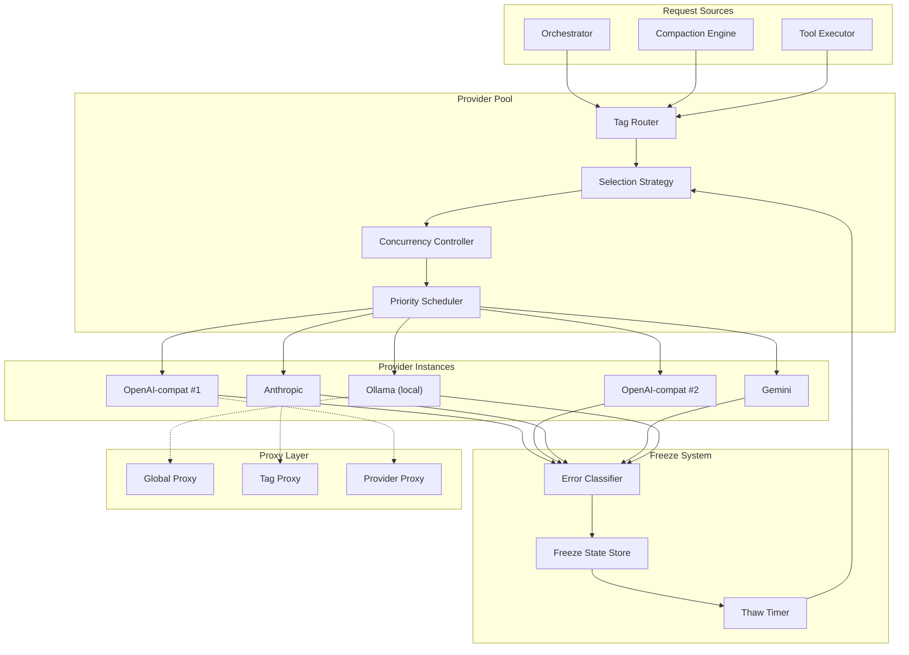
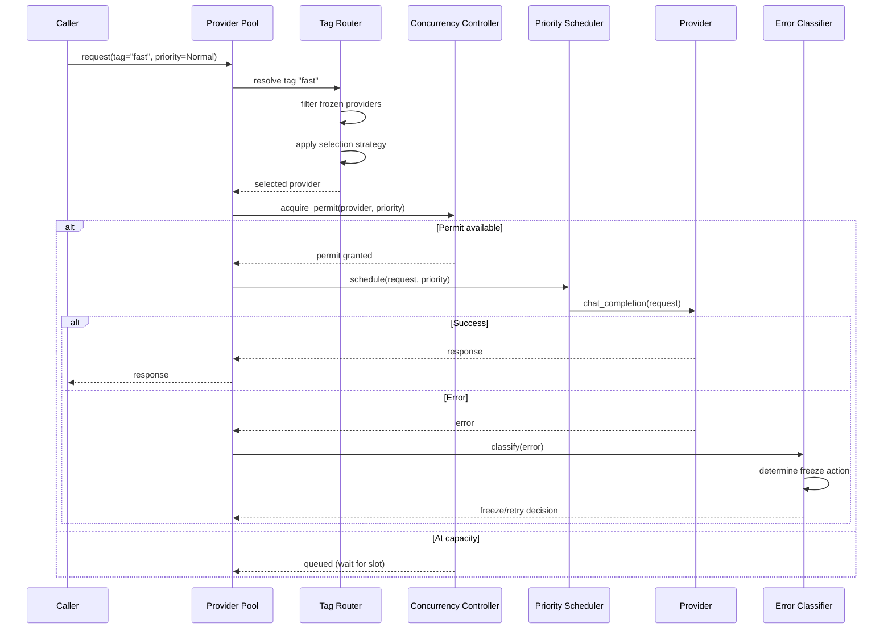
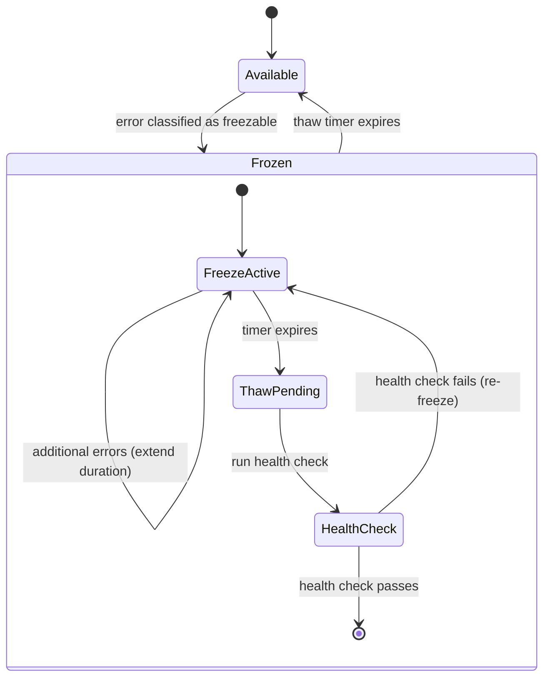

# Provider Pool Design

> Multi-provider LLM management with intelligent freeze, concurrency, and routing for y-agent

**Version**: v0.3
**Created**: 2026-03-04
**Updated**: 2026-03-10
**Status**: Draft

---

## TL;DR

The Provider Pool is the central resource manager for LLM access in y-agent. It supports multiple provider backends (OpenAI-compatible, Anthropic, Gemini, Ollama, Azure) through a unified `LLMProvider` trait. An intelligent **Freeze Mechanism** automatically disables providers based on classified error types (quota, auth, rate-limit, network) with graded freeze durations. **Concurrency Control** enforces per-provider and global limits via semaphores with priority-based scheduling. **Tag-based Routing** enables logical grouping and selection strategies. **Multi-level Proxy** configuration and **lease-based resource management** complete the design for production multi-provider deployments.

---

## Background and Goals

### Background

y-agent integrates with multiple LLM providers to ensure high availability, cost optimization, and model diversity. Different tasks may require different models (fast model for simple classification, capable model for complex reasoning). Providers experience transient failures (rate limits), semi-permanent failures (quota exhaustion), and permanent failures (invalid API keys). Without intelligent management, a single provider failure degrades the entire system.

### Goals

| Goal | Measurable Criteria |
|------|-------------------|
| **High availability** | Provider failure triggers automatic freeze + fallback to another provider within < 1s |
| **Intelligent freeze** | Error classification accuracy > 95%; freeze duration matches recovery time per error type |
| **Concurrency safety** | Zero provider-side 429 errors under sustained load (within configured limits) |
| **Priority scheduling** | Critical requests (abort decisions, safety checks) always proceed, even under load |
| **Multi-provider routing** | Tag-based selection routes requests to the optimal provider group in < 5ms |
| **Configuration simplicity** | New provider addable via 5-line TOML config without code changes |
| **Cost control** | Per-provider and global cost limits enforceable with automatic freeze on budget exhaustion |

### Assumptions

1. All supported providers expose an HTTP/HTTPS API with request/response or streaming semantics.
2. Provider API keys and credentials are managed outside the pool (injected via config or credential store).
3. The pool runs as a singleton within the y-agent server process (no distributed coordination needed).
4. Streaming responses use Server-Sent Events or equivalent chunked transfer.

---

## Scope

### In Scope

- Unified `LLMProvider` trait for all backends
- Provider implementations: OpenAI-compatible, Anthropic, Gemini, Ollama, Azure OpenAI
- Error classification into `StandardError` categories
- Freeze mechanism with per-error-type freeze durations and thaw logic
- Concurrency control: per-provider semaphores + global limit
- Priority scheduling: Critical, Normal, Idle tiers with reserved slots
- Tag-based routing and provider selection strategies
- Multi-level proxy configuration (provider > tag > global)
- Request lease management
- Health check and monitoring
- Provider pool configuration (TOML)

### Out of Scope

- LLM prompt construction and message formatting (see orchestrator and context designs)
- Token counting and budget management (handled by Context Window Guard)
- Model-specific parameter tuning
- Provider billing and cost tracking API integrations
- OAuth 2.0 implementation (interface reserved; implementation deferred)

---

## High-Level Design

### Architecture Overview



**Diagram rationale**: Flowchart chosen to show the end-to-end request lifecycle from callers through routing, scheduling, provider execution, error classification, and freeze management.

**Legend**:
- **Provider Pool**: Core routing and concurrency control layer.
- **Freeze System**: Automated error-driven provider disabling and recovery.
- **Proxy Layer**: Multi-level proxy configuration (dashed lines indicate proxy is optional).

### Provider Types

| Provider Type | API Style | Streaming | Local |
|--------------|-----------|-----------|-------|
| **OpenAI-compatible** | REST + SSE | Yes | No |
| **Anthropic** | REST + SSE (Messages API) | Yes | No |
| **Gemini** | REST + SSE (generateContent) | Yes | No |
| **Ollama** | REST + streaming JSON | Yes | Yes |
| **Azure OpenAI** | REST + SSE (Azure endpoint format) | Yes | No |

### LLMProvider Trait

```rust
#[async_trait]
trait LLMProvider: Send + Sync {
    async fn chat_completion(
        &self,
        request: ChatRequest,
    ) -> Result<ChatResponse, ProviderError>;

    async fn chat_completion_stream(
        &self,
        request: ChatRequest,
    ) -> Result<BoxStream<Result<ChatChunk, ProviderError>>, ProviderError>;

    fn metadata(&self) -> &ProviderMetadata;
    async fn health_check(&self) -> Result<(), ProviderError>;
}
```

All provider-specific APIs (OpenAI, Anthropic, Gemini, Ollama) are normalized through this trait into a common `ChatRequest`/`ChatResponse` format.

### Tag-Based Routing

Providers are grouped by tags for logical routing:

```toml
[[providers]]
id = "gpt4o-primary"
provider_type = "openai_compatible"
model = "gpt-4o"
tags = ["fast", "general", "primary"]

[[providers]]
id = "claude-sonnet"
provider_type = "anthropic"
model = "claude-sonnet-4-20250514"
tags = ["capable", "reasoning"]

[[providers]]
id = "ollama-local"
provider_type = "ollama"
model = "llama3.1:8b"
tags = ["local", "fast", "free"]
```

Requests specify a tag (or tag expression) to select a provider group:

| Selection Strategy | Behavior |
|-------------------|----------|
| **Priority** | Try providers in declared order; use first available |
| **Random** | Random selection among available providers with the tag |
| **LeastLoaded** | Select the provider with lowest current concurrency |
| **RoundRobin** | Cycle through available providers |
| **CostOptimized** | Prefer cheapest provider; fall back to expensive on freeze |

---

## Key Flows/Interactions

### Provider Selection and Request Execution



**Diagram rationale**: Sequence diagram chosen to show the decision points in the request lifecycle: routing, concurrency acquisition, execution, and error handling.

**Legend**:
- Tag resolution filters out frozen providers before applying the selection strategy.
- Concurrency Controller may queue the request if the provider is at capacity.
- Error Classifier determines whether to freeze the provider or retry.

### Freeze and Thaw Lifecycle



**Diagram rationale**: State diagram chosen to illustrate the full freeze/thaw lifecycle including the health-check-based recovery gate.

**Legend**:
- **FreezeActive**: Provider is disabled; all requests routed to alternatives.
- **ThawPending**: Freeze duration has elapsed; health check must pass before re-activation.
- Additional errors during freeze extend the freeze duration (exponential backoff).

---

## Data and State Model

### Error Classification

Provider-specific errors are normalized into `StandardError` categories:

| Standard Error | Detection Pattern | Freezable |
|---------------|------------------|-----------|
| **ContextWindowExceeded** | "context_length_exceeded", "max.*token" | No (request-level, not provider) |
| **RateLimited** | HTTP 429, "rate_limit" | Yes |
| **QuotaExhausted** | "quota", "insufficient_quota", "billing" | Yes |
| **AuthenticationFailed** | HTTP 401, "invalid.*key", "unauthorized" | Yes |
| **KeyInvalid** | "invalid_api_key", "deactivated" | Yes |
| **InsufficientBalance** | "balance", "payment_required" | Yes |
| **ModelNotFound** | HTTP 404, "model_not_found" | Yes |
| **ServerError** | HTTP 500-503, timeout | Yes (short freeze) |
| **NetworkError** | Connection refused, DNS failure, timeout | Yes (short freeze) |
| **ContentFiltered** | "content_policy", "safety" | No (request-level) |
| **Unknown** | Unrecognized error pattern | No |

### Freeze Durations

| Freeze Reason | Duration | Rationale |
|--------------|----------|-----------|
| Rate Limited | 60 seconds | Typically resets within 60s |
| Daily Quota | Until midnight UTC | Daily quota resets at day boundary |
| Authentication Error | 24 hours | Requires manual key rotation |
| Key Invalid / Deactivated | Permanent (until config change) | Key will not self-recover |
| Insufficient Balance | 12 hours | Requires payment; check periodically |
| Server Error (5xx) | 5 minutes (exponential backoff up to 1 hour) | Transient; retry soon |
| Network Error | 2 minutes (exponential backoff up to 30 minutes) | May be transient routing issue |
| Model Not Found | Permanent (until config change) | Model deprecation or misconfiguration |

### Provider Metadata

| Field | Type | Description |
|-------|------|-------------|
| `id` | String | Unique provider identifier |
| `provider_type` | ProviderType | openai_compatible, anthropic, gemini, ollama, azure |
| `model` | String | Model name |
| `tags` | Vec<String> | Routing tags |
| `max_concurrency` | usize | Per-provider concurrency limit |
| `priority_reserved_slots` | usize | Slots reserved for Critical priority |
| `cost_per_1k_input` | f64 | Input token cost (for CostOptimized strategy) |
| `cost_per_1k_output` | f64 | Output token cost |
| `context_window` | usize | Maximum context length |

### Concurrency Model

```rust
struct ConcurrencyController {
    per_provider: HashMap<ProviderId, Semaphore>,
    global: Semaphore,
}

struct PriorityScheduler {
    critical_queue: VecDeque<PendingRequest>,
    normal_queue: VecDeque<PendingRequest>,
    idle_queue: VecDeque<PendingRequest>,
}
```

| Priority | Reserved Slots | Use Case |
|----------|---------------|----------|
| **Critical** | 20% of provider limit | Abort decisions, safety checks, workflow control |
| **Normal** | Remaining capacity | Standard agent requests |
| **Idle** | Only when no Normal/Critical pending | Background tasks (pre-caching, maintenance) |

### Multi-Level Proxy

#### Design Motivation

Each provider instance builds its own `reqwest::Client` with an independently resolved proxy. This is critical because:

1. **Different providers may require different network paths.** Cloud providers (OpenAI, Anthropic, Gemini) often need a SOCKS5/HTTP proxy to reach external APIs, while local providers (Ollama) must bypass all proxies.
2. **Regional routing.** Providers tagged for specific regions (e.g., `china`) may need a region-specific proxy to achieve acceptable latency.
3. **Proxy isolation.** A failing proxy only affects the providers routed through it; other providers continue unimpeded.

#### Default Protocol: SOCKS5

The **default proxy protocol is SOCKS5** (`socks5://` or `socks5h://`). Rationale:

| Factor | SOCKS5 | HTTP CONNECT |
|--------|--------|-------------|
| **Protocol support** | TCP-level; works with any protocol including WebSocket | HTTP/HTTPS only |
| **DNS resolution** | `socks5h://` delegates DNS to proxy (avoids local DNS leak) | DNS resolved locally unless proxy supports remote DNS |
| **Authentication** | Username/password built into protocol | Basic or NTLM via Proxy-Authorization header |
| **Performance** | Minimal overhead; direct TCP tunnel | Extra HTTP handshake per connection |
| **Privacy** | No protocol-level metadata leak | Proxy sees Host header in CONNECT |

When no protocol scheme is specified in the proxy URL, the system prepends `socks5://` as the default. HTTP proxies (`http://`, `https://`) are fully supported when explicitly configured.

#### Cascade Resolution

Proxy configuration cascades from provider to tag to global:

| Level | Scope | Override Behavior |
|-------|-------|-------------------|
| **Provider** | Single provider instance | Highest priority; overrides tag and global |
| **Tag** | All providers with a given tag | Overrides global; first matching tag wins |
| **Global** | All providers without specific proxy | Lowest priority; default fallback |

Resolution algorithm:

1. If a **provider-level** entry exists for this provider ID:
   - If `enabled = false` → no proxy (bypass all levels).
   - If `url` is set → use it.
2. If a **tag-level** entry exists for any of this provider's tags (first match):
   - If `enabled = false` → no proxy.
   - If `url` is set → use it.
3. If a **global** entry exists:
   - If `enabled = false` → no proxy.
   - If `url` is set → use it.
4. Otherwise → no proxy (direct connection).

#### Proxy Configuration

```toml
[proxy]
# Default protocol when scheme is omitted. Supported: "socks5", "socks5h", "http", "https".
default_scheme = "socks5"

[proxy.global]
url = "socks5://proxy.company.com:1080"
# Optional authentication (stored in credential store, not in TOML directly).
# auth_env = "PROXY_AUTH"  # Format: "username:password"

[proxy.tags.china]
url = "http://cn-proxy.company.com:8080"

[proxy.tags.us]
url = "socks5h://us-proxy.company.com:1080"  # DNS resolved at proxy side

[proxy.providers.ollama-local]
enabled = false  # Local provider, no proxy needed

[proxy.providers.azure-eastus]
url = "socks5://azure-proxy.company.com:1080"  # Dedicated proxy for Azure
```

#### Per-Provider Client Construction

Each provider instance receives its resolved proxy URL at construction time and builds an independent HTTP client:

```rust
// During ProviderPoolImpl::from_config():
for provider_cfg in &config.providers {
    let proxy_url = config.resolve_proxy_url(&provider_cfg.id, &provider_cfg.tags);
    let provider = match provider_cfg.provider_type.as_str() {
        "openai_compatible" => OpenAiProvider::new(
            &provider_cfg.id,
            &provider_cfg.model,
            api_key,
            provider_cfg.base_url.clone(),
            proxy_url,   // <-- independently resolved per provider
            provider_cfg.tags.clone(),
            provider_cfg.max_concurrency,
            provider_cfg.context_window,
        ),
        // ... other provider types
    };
}
```

#### Proxy Failure Handling

| Scenario | Handling |
|----------|---------|
| Proxy connection refused | Classified as `NetworkError`; provider frozen with short duration (2 min) |
| Proxy authentication failure | Classified as `NetworkError`; logged with specific proxy auth warning |
| Proxy timeout | Same as network timeout; 10s default |
| `socks5h://` DNS resolution failure at proxy | Classified as `NetworkError`; provider frozen |
| Provider works without proxy but proxy is configured | No auto-bypass; operator must set `enabled = false` to skip proxy |

---

## Failure Handling and Edge Cases

| Scenario | Handling |
|----------|---------|
| All providers for a tag are frozen | Return `AllProvidersFrozen` error to caller; caller may retry with a different tag or wait |
| Provider responds with unknown error format | Classify as `Unknown`; do not freeze; log for manual review |
| Rate limit with Retry-After header | Use the server-specified delay instead of the default 60s freeze |
| Network timeout during streaming | Abort the stream; classify as NetworkError; mark partial response |
| Provider returns empty response | Retry once; if still empty, classify as ServerError |
| Concurrent requests hit provider limit exactly | Semaphore serializes; excess requests wait in priority queue |
| Health check hangs during thaw | Health check has 10s timeout; failure re-freezes with extended duration |
| Config reload with active requests | New config takes effect for next request; in-flight requests complete with old config |
| Provider deprecates model | ModelNotFound triggers permanent freeze; logged as alert for operator |
| Cost limit exceeded | Freeze provider with `CostLimitExceeded` reason; thaw when billing period resets |

---

## Security and Permissions

| Concern | Approach |
|---------|----------|
| **API key storage** | Keys stored in credential store (environment variable or encrypted file); never in TOML config directly |
| **Key rotation** | Pool supports runtime key update without restart; `SIGHUP` or config reload triggers re-initialization |
| **Proxy authentication** | Proxy credentials stored alongside API keys in credential store; supports Basic and SOCKS5 auth |
| **Request logging** | Request/response bodies redacted in logs by default; only metadata (model, tokens, latency) logged |
| **Provider impersonation** | TLS certificate validation enforced; no self-signed certs unless explicitly allowed per provider |
| **OAuth 2.0 (reserved)** | Interface defined (`AuthMethod::OAuth2`); implementation deferred; token refresh will use secure token storage |

### Authentication Methods

| Method | Status | Description |
|--------|--------|-------------|
| **API Key** | Implemented | Bearer token in Authorization header |
| **Azure AD** | Planned | Azure Active Directory token for Azure OpenAI |
| **OAuth 2.0** | Deferred | Client credentials grant for enterprise providers |

---

## Performance and Scalability

### Performance Targets

| Metric | Target |
|--------|--------|
| Provider selection latency | < 5ms |
| Concurrency acquire latency (no contention) | < 1ms |
| Error classification latency | < 1ms |
| Health check timeout | 10s |
| Maximum providers in pool | 50 |
| Maximum global concurrency | 200 concurrent requests |
| Freeze state check | < 0.5ms (in-memory) |

### Optimization Strategies

- **In-memory freeze state**: Freeze/thaw state stored in memory (HashMap with RwLock); persisted to disk only for crash recovery.
- **Zero-allocation hot path**: Provider selection and concurrency check avoid heap allocation in the common (no-freeze, no-wait) case.
- **Connection reuse**: Each provider instance maintains a `reqwest::Client` with persistent connection pool.
- **Streaming passthrough**: Streaming responses are passed through without buffering entire response in memory.
- **Lazy health check**: Health checks run only during thaw, not periodically, to avoid unnecessary API calls.

---

## Observability

### Metrics

| Metric | Type | Description |
|--------|------|-------------|
| `provider.requests_total` | Counter | Requests per provider, model, and status |
| `provider.request_duration_ms` | Histogram | Request latency per provider |
| `provider.tokens_used` | Counter | Input/output tokens per provider |
| `provider.errors_total` | Counter | Errors by provider and error class |
| `provider.frozen` | Gauge | Number of currently frozen providers |
| `provider.concurrency_active` | Gauge | Current active requests per provider |
| `provider.concurrency_queued` | Gauge | Waiting requests in priority queue |
| `pool.cost_total` | Counter | Estimated cost by provider |
| `pool.fallbacks_total` | Counter | Times a request fell back to secondary provider |

### Health Endpoint

```
GET /api/providers/health

Response: {
  "providers": [{
    "id": "gpt4o-primary",
    "status": "available",
    "active_requests": 3,
    "max_concurrency": 10,
    "total_requests": 15420,
    "error_rate_5m": 0.02
  }, {
    "id": "claude-sonnet",
    "status": "frozen",
    "freeze_reason": "RateLimited",
    "thaw_at": "2026-03-06T14:30:00Z"
  }]
}
```

### Alerts

| Alert | Condition | Severity |
|-------|-----------|----------|
| All providers frozen for tag | No available provider for a tag for > 60s | Critical |
| Provider error rate spike | Error rate > 20% in 5-minute window | Warning |
| Global concurrency near limit | > 80% of global limit sustained for > 30s | Warning |
| Authentication failure | Any auth error | Critical (may require key rotation) |

---

## Rollout and Rollback

### Phased Implementation

| Phase | Scope | Duration |
|-------|-------|----------|
| **Phase 1** | LLMProvider trait, OpenAI-compatible provider, basic pool with priority selection | 2-3 weeks |
| **Phase 2** | Anthropic + Gemini providers, error classification, freeze mechanism | 2-3 weeks |
| **Phase 3** | Concurrency control, priority scheduling, tag-based routing | 1-2 weeks |
| **Phase 4** | Ollama + Azure providers, multi-level proxy, health endpoint, observability | 2-3 weeks |

### Rollback Plan

| Phase | Rollback |
|-------|----------|
| Phase 1 | Single hardcoded provider; remove pool abstraction |
| Phase 2 | Disable freeze mechanism; all errors return to caller directly |
| Phase 3 | Remove concurrency limits; rely on provider-side rate limiting |
| Phase 4 | Local and Azure providers are additive; removal does not affect core providers |

---

## Alternatives and Trade-offs

### Selection Strategy: Priority vs Load-Balanced

| | Priority (chosen as default) | Load-Balanced |
|-|----------------------------|---------------|
| **Predictability** | Consistent provider choice | Varies per request |
| **Cost control** | Easy to prefer cheaper provider | Distributes cost evenly |
| **Failover** | Natural fallback to next provider | May hit frozen provider |

**Decision**: Priority as default; LeastLoaded and CostOptimized available as alternatives. Priority gives operators explicit control over which provider handles traffic.

### Freeze Duration: Fixed vs Adaptive

| | Adaptive (chosen) | Fixed per-type |
|-|-------------------|---------------|
| **Accuracy** | Adjusts to actual recovery time | May be too short or too long |
| **Complexity** | Exponential backoff logic | Simple lookup table |
| **Responsiveness** | Faster recovery when possible | Worst-case wait always |

**Decision**: Adaptive with exponential backoff starting from the type-specific base duration. Retry-After headers from providers override the calculated duration.

### Error Classification: Pattern Matching vs Provider SDK

| | Pattern Matching (chosen) | Provider SDK |
|-|--------------------------|-------------|
| **Uniformity** | Same logic for all providers | Different per SDK |
| **Maintenance** | Update patterns when APIs change | Update SDK versions |
| **Coverage** | May miss provider-specific errors | Full coverage per provider |

**Decision**: Regex-based pattern matching on HTTP status codes and error message bodies. Unified approach across all providers; supplemented by provider-specific overrides where needed.

---

## Open Questions

| # | Question | Owner | Due Date | Status |
|---|----------|-------|----------|--------|
| 1 | Should the pool support automatic model version migration (e.g., gpt-4o -> gpt-4o-2024-11-20)? | Provider team | 2026-03-20 | Open |
| 2 | Should cost tracking be real-time (per-request) or batched (periodic aggregation)? | Provider team | 2026-03-27 | Open |
| 3 | Should the pool support provider-level request transformation (e.g., Anthropic system message format)? | Provider team | 2026-04-03 | Open |
| 4 | Should health checks run proactively (periodic) or reactively (only during thaw)? | Provider team | 2026-03-20 | Open |
| 5 | How should the pool handle providers that support different model versions with different capabilities? | Provider team | 2026-04-03 | Open |

