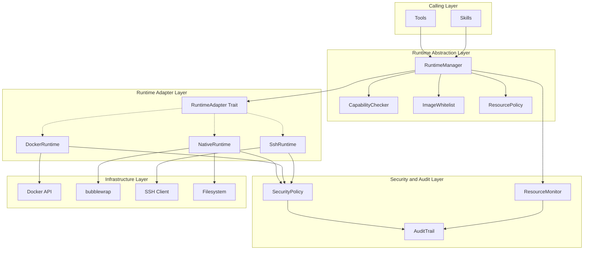
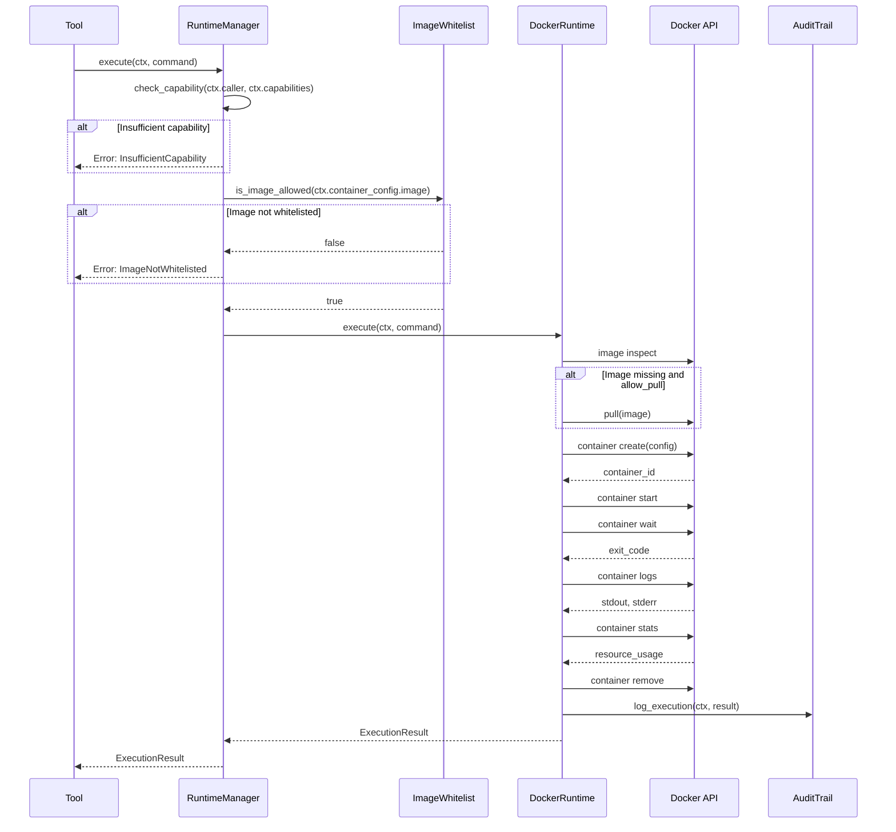
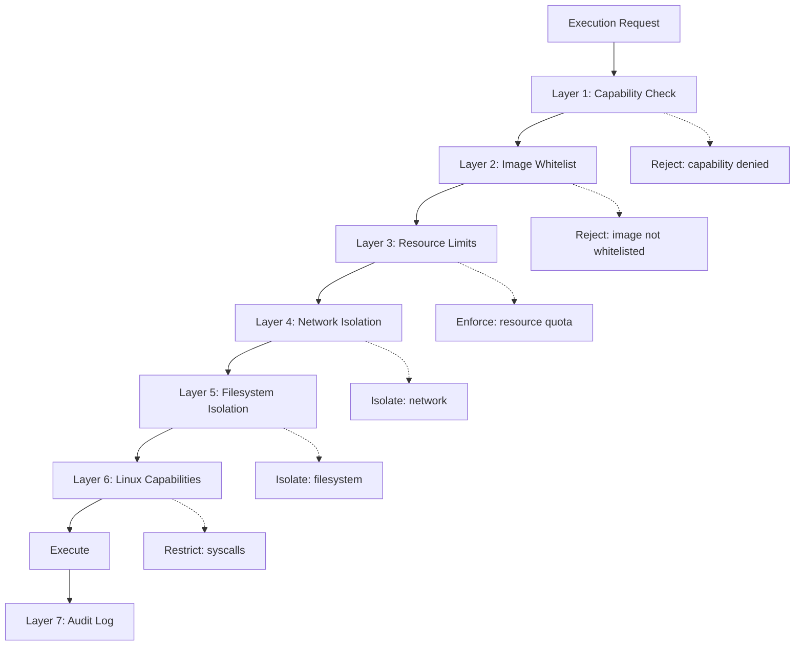
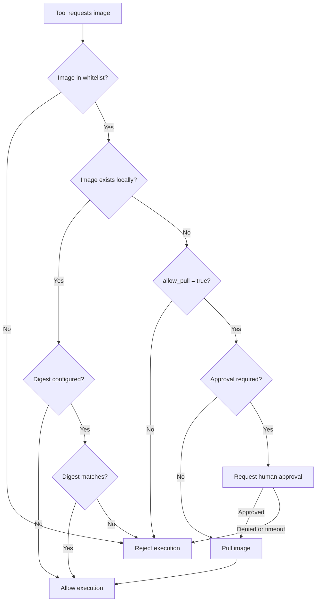

# Runtime Execution Layer Design

> Isolated, capability-controlled execution environment for y-agent

**Version**: v0.2
**Created**: 2026-03-04
**Updated**: 2026-03-06
**Status**: Draft

---

## TL;DR

The Runtime module provides isolated, resource-controlled execution environments for y-agent's tools and skills. It implements a **capability-based permission model** where callers declare what they need (via ToolManifest) and the Runtime enforces those constraints. The core abstraction is the **RuntimeAdapter** trait with three implementations: **DockerRuntime** (container isolation for untrusted operations), **NativeRuntime** (host execution with optional bubblewrap sandboxing), and **SshRuntime** (remote host execution). A **container image whitelist** prevents arbitrary image pulls. Seven security layers -- from capability checking through network isolation to audit logging -- ensure defense in depth. The Runtime is intentionally a "dumb" execution layer: it does not interpret tool semantics, only enforces security boundaries.

---

## Background and Goals

### Background

When AI agents execute tools like shell commands, Python scripts, or external APIs, they can potentially damage the host system, exfiltrate data, or consume excessive resources. The Runtime module exists to contain these risks through isolation and resource control. Drawing from established patterns (capability-based permissions from OpenFang, RuntimeAdapter abstraction from ZeroClaw, sandbox-policy separation from OpenClaw), this design provides a unified execution layer that is secure by default and extensible for future execution backends.

### Goals

| Goal | Measurable Criteria |
|------|-------------------|
| **Secure isolation** | Default container isolation; no direct host access for untrusted tools |
| **Least privilege** | Each execution unit gets only the capabilities declared in its Manifest |
| **Image whitelist** | Zero unauthorized container image runs; all images checked against whitelist |
| **Resource control** | CPU, memory, disk, network, and duration limits enforced per execution |
| **Low coupling** | Runtime interacts with Tools/Skills only through `RuntimeContext` and `Command` |
| **Observability** | Every execution event logged with resource usage and security events |
| **Multi-backend** | Support Docker, Native (with sandbox), and SSH runtimes behind one interface |

### Non-Goals

- Not a container orchestration system (not replacing K8s or Docker Compose).
- Not a general virtualization layer (Docker OCI only; no VMs).
- Not a distributed runtime (single-host; future extension planned).

### Assumptions

1. Docker daemon is available on the host for DockerRuntime.
2. bubblewrap (`bwrap`) is available on Linux hosts for NativeRuntime sandboxing.
3. SSH runtimes use key-based authentication (no password auth).
4. The caller (Tool or Skill) always provides a valid `RuntimeContext`.

### Design Principles

| Principle | Origin | Application |
|-----------|--------|-------------|
| Capability-based permissions | OpenFang | Tools declare needed capabilities; Runtime checks before execution |
| RuntimeAdapter abstraction | ZeroClaw | Unified interface for Docker/Native/SSH/future backends |
| Sandbox-policy separation | OpenClaw | Runtime enforces "how to execute"; security policy defined at higher layer |
| Whitelist-first | All references | Images, network domains, file paths default to deny |
| Least privilege | OpenFang | Drop all Linux capabilities; add back only what is needed |

---

## Scope

### In Scope

- `RuntimeAdapter` trait (execute, spawn, kill, status, health_check, cleanup)
- `RuntimeManager` for lifecycle management and request routing
- `RuntimeContext` carrying execution requirements
- `RuntimeCapability` model (network, filesystem, container, process)
- `DockerRuntime`: container creation, execution, resource limits, cleanup
- `NativeRuntime`: host execution with optional bubblewrap/firejail sandboxing
- `SshRuntime`: remote execution via SSH
- Container image whitelist with digest verification
- Image pull approval flow (auto/manual/reject)
- `CapabilityChecker` for pre-execution validation
- `SecurityPolicy` for runtime enforcement
- `AuditTrail` for execution event logging
- `ResourceMonitor` for resource usage collection

### Out of Scope

- Tool business logic (see [tools-design.md](tools-design.md))
- Tool-Runtime integration patterns (see [runtime-tools-integration.md](runtime-tools-integration.md))
- Kubernetes Runtime (future extension)
- GPU passthrough (future extension)
- Remote Runtime load balancing (future extension)

---

## High-Level Design

### Layered Architecture



**Diagram rationale**: Flowchart chosen to show module boundaries across the four architectural layers and the dependency flow from callers through abstraction to infrastructure.

**Legend**:
- **Abstraction Layer**: RuntimeManager routes requests; CapabilityChecker and ImageWhitelist gate execution.
- **Adapter Layer**: Dashed arrows indicate the RuntimeAdapter trait's polymorphic dispatch to concrete implementations.
- **Security Layer**: SecurityPolicy is applied by all adapters; AuditTrail captures all events.

### Module Responsibilities

| Module | Responsible For | Not Responsible For |
|--------|----------------|-------------------|
| **RuntimeManager** | Lifecycle, request routing, global quota | Parameter parsing, business logic |
| **CapabilityChecker** | Matching caller capabilities against manifest | Enforcing security (that is the adapter's job) |
| **ImageWhitelist** | Approving/rejecting container images | Image building, version management |
| **ResourcePolicy** | Defining resource limits | Enforcing limits (adapters enforce) |
| **RuntimeAdapter** | Executing commands in isolated environment | Understanding tool semantics |
| **SecurityPolicy** | Network isolation, filesystem restrictions, Linux capabilities | Capability matching (CapabilityChecker does that) |
| **AuditTrail** | Recording all execution events | Real-time alerting (consumed by upper layers) |

### RuntimeAdapter Trait

```rust
#[async_trait]
pub trait RuntimeAdapter: Send + Sync {
    fn name(&self) -> &str;
    async fn execute(&self, ctx: &RuntimeContext, command: &Command) -> Result<ExecutionResult>;
    async fn spawn(&self, ctx: &RuntimeContext, command: &Command) -> Result<ProcessHandle>;
    async fn kill(&self, handle: &ProcessHandle) -> Result<()>;
    async fn status(&self, handle: &ProcessHandle) -> Result<ProcessStatus>;
    async fn health_check(&self) -> Result<HealthStatus>;
    async fn cleanup(&self, ctx: &RuntimeContext) -> Result<()>;
}
```

### Runtime Implementations

| Runtime | Use Case | Isolation Level | Performance | Status |
|---------|----------|----------------|-------------|--------|
| **DockerRuntime** | Production default; untrusted tools | High (container) | Medium | Supported |
| **NativeRuntime** | Development; trusted tools; local scripts | Low-Medium (process + optional sandbox) | High | Supported |
| **SshRuntime** | Remote hosts; distributed execution | High (network + remote isolation) | Medium (network latency) | Supported |
| **KubernetesRuntime** | K8s clusters; large-scale | High (pod) | Medium | Future |

### RuntimeCapability Model

```rust
pub struct RuntimeCapability {
    pub network: NetworkCapability,       // None | Internal | External | Full
    pub filesystem: FilesystemCapability, // paths, mode (R/RW/W), host_access
    pub container: ContainerCapability,   // images, pull, privileged, resources
    pub process: ProcessCapability,       // shell, commands, background
}
```

| Capability | Variants | Description |
|-----------|----------|-------------|
| **Network** | None, Internal(CIDRs), External(domains), Full | Controls network access scope |
| **Filesystem** | allowed_paths, mode, host_access | Controls file system access |
| **Container** | allowed_images, allow_pull, resources | Controls container usage |
| **Process** | allow_shell, allowed_commands, background | Controls process execution |

---

## Key Flows/Interactions

### Docker Execution Flow



**Diagram rationale**: Sequence diagram chosen to show the full lifecycle of a container-based execution including capability check, image validation, container lifecycle, and audit.

**Legend**:
- Execution is gated by capability check and image whitelist before reaching Docker.
- Container is auto-removed after execution (configurable).
- Resource usage is collected from Docker stats before container removal.

### Security Layers



**Diagram rationale**: Flowchart chosen to visualize the defense-in-depth security layers that every execution request passes through.

**Legend**:
- Layers 1-2 are pre-execution gates (reject if failed).
- Layers 3-6 are runtime enforcement (constrain execution).
- Layer 7 is post-execution audit (record what happened).

---

## Data and State Model

### RuntimeContext

| Field | Type | Description |
|-------|------|-------------|
| `request_id` | String | Unique execution trace ID |
| `caller` | CallerInfo | Who is requesting (tool name, session, type) |
| `required_capabilities` | RuntimeCapability | What the caller needs |
| `working_dir` | PathBuf | Working directory for execution |
| `env` | HashMap<String, String> | Environment variables |
| `timeout` | Duration | Execution timeout |
| `container_config` | Option<ContainerConfig> | Container settings (if container execution) |

### ContainerConfig

| Field | Type | Description |
|-------|------|-------------|
| `image` | String | Container image |
| `name_prefix` | String | Container name prefix |
| `mounts` | Vec<MountPoint> | Host-to-container bind mounts |
| `network_mode` | NetworkMode | None, Bridge, Host, Custom |
| `auto_remove` | bool | Delete container after execution |
| `resources` | ResourceLimits | CPU, memory, disk, duration limits |

### ExecutionResult

| Field | Type | Description |
|-------|------|-------------|
| `exit_code` | i32 | Process exit code |
| `stdout` | Vec<u8> | Standard output |
| `stderr` | Vec<u8> | Standard error |
| `duration` | Duration | Actual execution time |
| `resource_usage` | ResourceUsage | CPU time, memory peak, disk I/O, network I/O |

### Image Whitelist

| Field | Type | Description |
|-------|------|-------------|
| `pattern` | String | Image name pattern (exact or wildcard) |
| `allowed_tags` | Option<Vec<String>> | Specific allowed tags |
| `purpose` | String | Why this image is approved |
| `allow_pull` | bool | Whether pull is allowed if not local |
| `expected_digest` | Option<String> | Optional digest for integrity verification |

### Container Security Configuration

DockerRuntime automatically applies security hardening based on capabilities:

| Security Control | Default | Modified When |
|-----------------|---------|---------------|
| Read-only rootfs | Yes | Never (always read-only) |
| `no-new-privileges` | Yes | Never (always set) |
| All Linux capabilities dropped | Yes | Specific caps added back per capability |
| Network mode | None | NetworkCapability != None |
| Filesystem mounts | None | FilesystemCapability declares paths |
| Auto-remove | Yes | Configurable per container |

---

## Failure Handling and Edge Cases

| Scenario | Handling |
|----------|---------|
| Docker daemon unavailable | Health check fails; fall back to NativeRuntime if allowed; otherwise return clear error |
| Image pull fails (network error) | Retry once; return `ImagePullFailed` with reason |
| Image pull fails (not found) | Return `ImageNotFound`; suggest checking image name |
| Container creation fails | Return `ContainerCreateFailed`; log Docker error |
| Execution timeout | Kill container/process; return `Timeout` with partial stdout/stderr |
| Container OOM killed | Detect via exit code 137; return `ResourceLimitExceeded` with memory info |
| Process exits with non-zero code | Return result with exit code; let tool layer interpret |
| Path traversal in working_dir | Reject via canonicalize + starts_with check; log security event |
| SSH connection lost mid-execution | Timeout triggers; partial results returned if available |
| Concurrent execution exceeds global limit | Queue request; timeout if waiting too long |
| Image digest mismatch | Reject execution; log security alert |
| bubblewrap not available (NativeRuntime) | Fall back to plain execution; warn in logs |

---

## Security and Permissions

### Image Whitelist Verification Flow



**Diagram rationale**: Flowchart chosen to show the decision tree for image verification with all possible outcomes.

**Legend**:
- Every image must pass whitelist check before execution.
- Digest verification (when configured) prevents image tampering.
- Human approval flow is optional and configurable per deployment.

### NativeRuntime Sandboxing

NativeRuntime supports bubblewrap (`bwrap`) sandboxing:
- System directories (`/usr`, `/lib`, `/lib64`) mounted read-only.
- Workspace mounted as the only writable directory.
- Network optionally isolated via `--unshare-net`.
- No access to host home directory, `/tmp`, or other user paths.

### Audit Events

| Event Type | Severity | Description |
|-----------|----------|-------------|
| `CapabilityDenied` | Warning | Tool requested capability not in manifest |
| `ImageWhitelistViolation` | Error | Attempted use of non-whitelisted image |
| `ResourceLimitExceeded` | Warning | Execution hit CPU/memory/duration limit |
| `NetworkAccessDenied` | Error | Attempted network access to non-whitelisted domain |
| `PathTraversalAttempt` | Critical | Attempted file access outside workspace |
| `ExecutionCompleted` | Info | Normal execution completion |
| `ImagePulled` | Info | Container image pulled from registry |

---

## Performance and Scalability

### Performance Targets

| Metric | Target |
|--------|--------|
| Capability check | < 1ms |
| Image whitelist lookup | < 1ms |
| Container create + start (warm image) | < 1.5s |
| Container create + start (cold pull) | < 30s (network dependent) |
| NativeRuntime execution overhead | < 50ms (plain) / < 200ms (sandboxed) |
| Container remove | < 500ms |
| Global concurrent executions | Up to 10 (configurable) |
| Total CPU allocation | 8 cores (configurable) |
| Total memory allocation | 8 GB (configurable) |

### Optimization Strategies

- **Warm container pool**: Pre-pull frequently used images; keep container templates ready.
- **Parallel cleanup**: Container removal is asynchronous; does not block result return.
- **Resource monitoring sampling**: Container stats collected at configurable intervals, not continuously.
- **Native fast path**: Tools that do not require containers (FileRead, memory operations) skip the container overhead entirely.

---

## Observability

### Metrics

| Metric | Type | Description |
|--------|------|-------------|
| `runtime.executions_total` | Counter | Total executions by runtime type and result |
| `runtime.execution_duration_ms` | Histogram | Execution duration by runtime type |
| `runtime.cpu_time_seconds` | Counter | Cumulative CPU time consumed |
| `runtime.memory_peak_mb` | Histogram | Memory peak per execution |
| `runtime.containers_created` | Counter | Docker containers created |
| `runtime.images_pulled` | Counter | Docker images pulled |
| `runtime.capability_denials` | Counter | Capability check failures |
| `runtime.whitelist_violations` | Counter | Image whitelist violations |
| `runtime.concurrent_active` | Gauge | Currently active executions |

### Audit Log Format

Structured JSON log entries containing:
- Timestamp, event_type, runtime_type, request_id
- Caller info (tool name, session_id, agent_id)
- Container info (image, container_id, network_mode)
- Command (program, args)
- Result (exit_code, duration_ms, resource_usage)
- Security events (if any)

---

## Rollout and Rollback

### Phased Implementation

| Phase | Scope | Duration |
|-------|-------|----------|
| **Phase 1**: Core | RuntimeAdapter trait, RuntimeContext, RuntimeCapability, DockerRuntime (create/start/wait/remove), ImageWhitelist | 2-3 weeks |
| **Phase 2**: Integration | RuntimeManager, CapabilityChecker, resource limits, network isolation, SecurityPolicy, AuditTrail, tool execution integration | 2-3 weeks |
| **Phase 3**: Security | Image digest verification, image pull approval flow, ResourceMonitor, security event alerting | 1-2 weeks |
| **Phase 4**: Advanced | NativeRuntime (bubblewrap), SshRuntime, container pool (warm images), performance optimization | 2-3 weeks |

### Rollback Plan

| Phase | Rollback |
|-------|----------|
| Phase 1 | Fall back to direct host execution (development mode only) |
| Phase 2 | Disable capability checking; all tools execute with full permissions (unsafe, dev only) |
| Phase 3 | Disable digest verification and approval flow; auto-approve all whitelisted images |
| Phase 4 | NativeRuntime and SshRuntime are additive; removal does not affect DockerRuntime |

---

## Alternatives and Trade-offs

### Container Runtime: Docker vs Firecracker vs WASM

| | Docker (chosen) | Firecracker | WASM |
|-|----------------|-------------|------|
| **Isolation** | Container (cgroups/namespaces) | MicroVM (hardware) | Sandbox (WASI) |
| **Startup time** | ~1s | ~125ms | ~5ms |
| **Ecosystem** | Huge (any Linux image) | Limited (Linux kernel) | Growing (limited system access) |
| **Complexity** | Medium | High | Medium |
| **Host requirements** | Docker daemon | KVM support | WASM runtime |

**Decision**: Docker as primary. Ubiquitous ecosystem, mature tooling, and sufficient isolation for the threat model. Firecracker and WASM considered for future extensions.

### Sandbox for NativeRuntime: bubblewrap vs firejail vs none

| | bubblewrap (chosen) | firejail | No sandbox |
|-|---------------------|---------|-----------|
| **Isolation** | Namespace-based | Profile-based | None |
| **Config complexity** | Medium (CLI args) | Low (profiles) | None |
| **Granularity** | Per-path mount control | Per-profile | N/A |
| **Availability** | Most Linux distros | Common | Always |

**Decision**: bubblewrap for its fine-grained mount control and namespace isolation. Fallback to firejail if bwrap is unavailable; no sandbox only in development mode.

### Image Security: Whitelist vs Signing vs Both

| | Whitelist only (chosen for v1) | Signing only | Both |
|-|-------------------------------|-------------|------|
| **Setup complexity** | Low (TOML config) | High (key management) | High |
| **Supply chain security** | Pattern + digest | Cryptographic proof | Best |
| **Operational overhead** | Low | Medium | High |

**Decision**: Whitelist with optional digest verification for v1. Image signing (e.g., cosign/Notary) planned for v2 when supply chain requirements grow.

---

## Open Questions

| # | Question | Owner | Due Date | Status |
|---|----------|-------|----------|--------|
| 1 | Should containers share a network namespace for inter-tool communication? | Runtime team | 2026-03-20 | Open |
| 2 | Should GPU passthrough be supported, and if so, how to whitelist GPU access? | Runtime team | 2026-04-03 | Open |
| 3 | What is the maximum execution duration before force-kill (hard limit)? | Runtime team | 2026-03-20 | Open |
| 4 | Should container logs be stored persistently or only in-memory? | Runtime team | 2026-03-27 | Open |
| 5 | Should SshRuntime support connection pooling for frequently-accessed remote hosts? | Runtime team | 2026-04-03 | Open |

