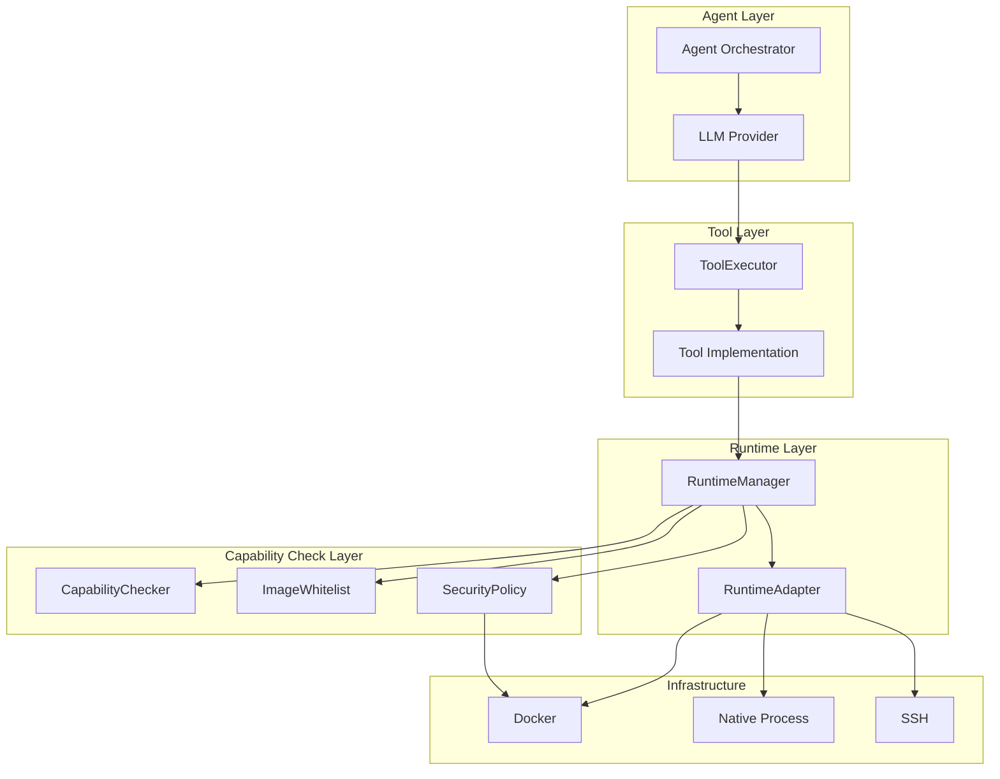
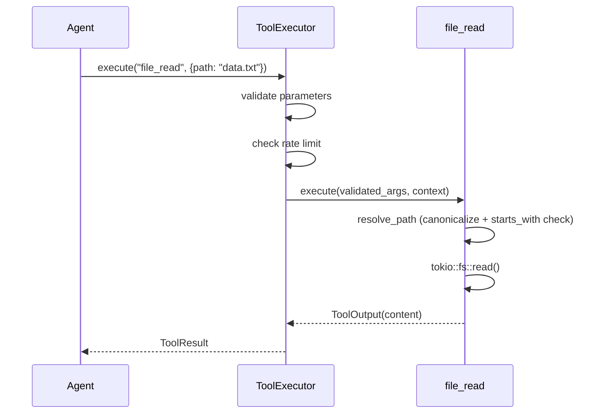
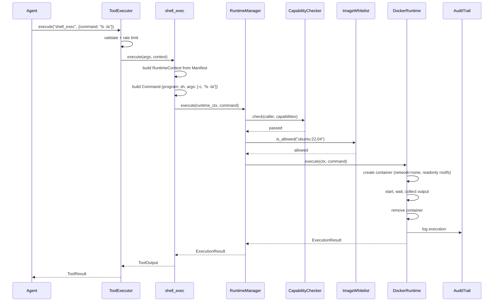
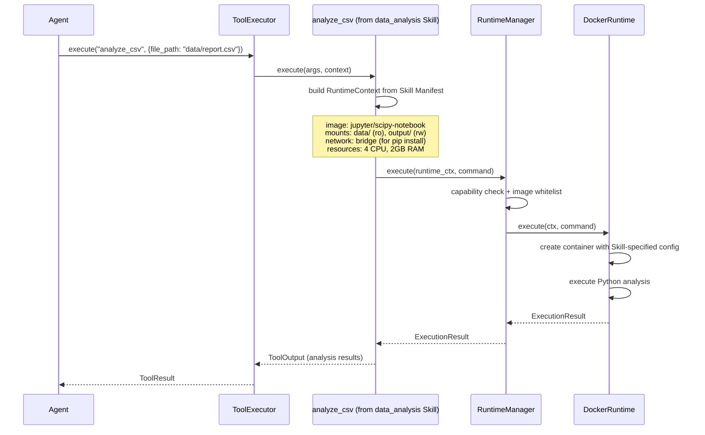
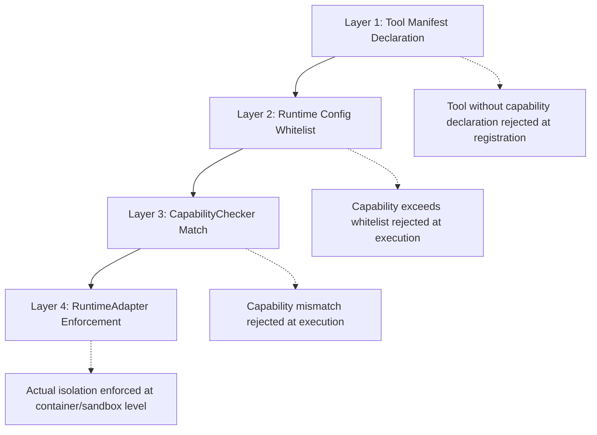
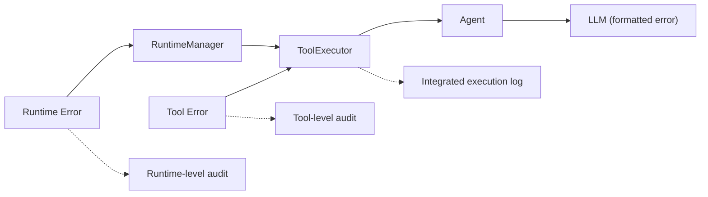
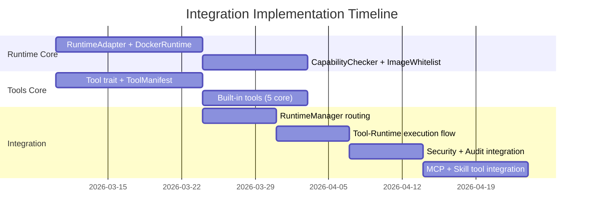

# Runtime and Tools Integration Design

> Module collaboration, capability enforcement, and security boundaries between Runtime and Tools

**Version**: v0.2
**Created**: 2026-03-04
**Updated**: 2026-03-06
**Status**: Draft

---

## TL;DR

This document defines how the Runtime and Tools modules collaborate to achieve secure, isolated tool execution. The core principle is **strict responsibility separation**: Tools handle business logic (parameter parsing, result interpretation, domain knowledge), while Runtime handles execution isolation (containers, sandboxing, resource limits). They interact through two data structures: `RuntimeContext` (what capabilities are needed) and `Command` (what to execute). A four-layer capability checking pipeline -- Manifest declaration, runtime config whitelist, CapabilityChecker matching, and RuntimeAdapter enforcement -- ensures defense in depth. Three execution patterns cover the full spectrum: local execution (no Runtime involvement), container-isolated execution (DockerRuntime), and skill-container execution (extended container config from Skill Manifest).

---

## Background and Goals

### Background

The Tools module and Runtime module are designed as independent layers with a clear boundary. However, their integration requires careful coordination: tools must correctly declare capabilities, Runtime must faithfully enforce them, and error handling must propagate cleanly across the boundary. This document captures the integration contract, common interaction patterns, and the security guarantees that emerge from their collaboration.

Three anti-patterns observed in reference projects motivate the design:

| Anti-Pattern | Avoidance Strategy |
|-------------|-------------------|
| **Tight coupling** (tools implement isolation) | Tools only declare capabilities; Runtime enforces |
| **Implicit permissions** (no capability declaration) | Every tool must declare capabilities in Manifest |
| **Runtime as business layer** (interpreting tool params) | Runtime only receives `Command`; no parameter awareness |

### Goals

| Goal | Measurable Criteria |
|------|-------------------|
| **Clean boundary** | Zero imports from Tools in Runtime; zero imports from Runtime in Tool business logic |
| **Capability completeness** | Every tool with side effects declares capabilities; undeclared operations are blocked |
| **Error traceability** | Errors carry full context (tool name, capability, runtime type, request_id) |
| **Audit completeness** | Every execution path (local, container, remote) generates audit records |
| **Degradation safety** | Capability denials never silently degrade to weaker isolation |

### Assumptions

1. Tools always construct `RuntimeContext` from their `ToolManifest`, not ad-hoc.
2. The CapabilityChecker runs in the RuntimeManager before any adapter is invoked.
3. The image whitelist is loaded at startup and reloaded on config change.
4. Tool-level errors and Runtime-level errors use distinct error types for clear attribution.

---

## Scope

### In Scope

- Responsibility matrix between Tools and Runtime
- Three execution patterns: local, container-isolated, skill-container
- Capability checking pipeline (4 layers)
- Image whitelist verification flow
- Resource limit declaration (Tools) and enforcement (Runtime)
- Error propagation and degradation strategies
- Audit and observability across the integration boundary
- Tool result caching strategy
- Container reuse optimization
- Checklist for adding new tools and new runtimes

### Out of Scope

- Tool trait definition and built-in tool implementations (see [tools-design.md](tools-design.md))
- RuntimeAdapter implementations and container lifecycle (see [runtime-design.md](runtime-design.md))
- MCP tool protocol specifics (see tools-design)
- Skill manifest format (see skills-design)

---

## High-Level Design

### Responsibility Matrix

| Responsibility | Tools Module | Runtime Module |
|---------------|-------------|---------------|
| **Parameter validation** | Validates tool arguments | Only receives validated commands |
| **Business logic** | Implements tool-specific behavior | No business logic |
| **Capability declaration** | Declares in ToolManifest | Checks against whitelist |
| **Container image selection** | Declares preferred image | Validates image against whitelist |
| **Execution isolation** | Calls RuntimeManager | Provides Docker/Native/SSH environments |
| **Resource limits** | Declares requirements in Manifest | Enforces via cgroups/Docker |
| **Error handling** | Handles tool-level errors | Handles execution-level errors |
| **Rate limiting** | Per-tool rate limits | Global concurrency limits |
| **Audit logging** | Optional tool-specific logs | Records all execution events |

**Key principle**: Tools are the "smart" layer (understand user intent, process parameters, return structured results). Runtime is the "dumb" layer (execute commands safely, enforce limits, report results).

### Integration Architecture

**Diagram rationale**: Flowchart chosen to show the cross-module flow from agent through tools, capability checks, and runtime to infrastructure.

**Legend**:
- **Tool Layer**: Handles business logic; constructs RuntimeContext and Command.
- **Check Layer**: Gates execution with capability and image checks.
- **Runtime Layer**: Manages adapter dispatch and security policy enforcement.

---

## Key Flows/Interactions

### Pattern 1: Local Execution (No Runtime)

Tools that perform purely local, safe operations do not involve the Runtime at all.

**Diagram rationale**: Sequence diagram chosen to show the simplest execution path with no Runtime involvement.

**Legend**: Path safety is enforced by the tool itself via `canonicalize()` + `starts_with(workspace_root)`.

**Why no Runtime**: File reading is a local operation. The path validation logic is simpler and faster than container overhead. Security is maintained by workspace boundary enforcement.

### Pattern 2: Container-Isolated Execution

Tools that execute arbitrary user-provided commands must use Runtime isolation.

**Diagram rationale**: Sequence diagram chosen to show the full integration path through both Tool and Runtime layers.

**Legend**:
- The tool constructs `RuntimeContext` directly from its Manifest (no ad-hoc capability requests).
- Two security gates (CapabilityChecker, ImageWhitelist) must pass before execution proceeds.

### Pattern 3: Skill-Container Execution

Skills declare extended container requirements in their Skill Manifest.

**Diagram rationale**: Sequence diagram chosen to show how Skill-specific container configuration flows through the integration.

**Legend**: Skill tools have richer container requirements (specific images, multiple mounts, network access for package installation) compared to basic built-in tools.

---

## Data and State Model

### Capability Checking Pipeline

**Diagram rationale**: Flowchart chosen to show the progressive narrowing of permissions through four layers.

**Legend**:
- **Layer 1**: Static declaration at tool registration time.
- **Layer 2**: Checked against deployment-specific whitelist config.
- **Layer 3**: Dynamic check at execution time.
- **Layer 4**: Physical enforcement by the runtime adapter.

### Resource Limit Flow

| Step | Layer | Action |
|------|-------|--------|
| 1 | Tool Manifest | Declares resource requirements (e.g., 2 CPU, 512MB RAM, 5 min timeout) |
| 2 | ResourcePolicy | Validates against global policy (e.g., no single tool can request > 4 CPU) |
| 3 | RuntimeManager | Allocates resources from global quota |
| 4 | DockerRuntime | Applies as Docker cgroup limits (`--cpus`, `--memory`) |
| 5 | ResourceMonitor | Collects actual usage from container stats |
| 6 | AuditTrail | Records declared vs actual resource usage |

### Cross-Module Error Flow

**Diagram rationale**: Flowchart chosen to show error propagation paths and logging at each layer.

**Legend**: Both tool-level and runtime-level errors are captured independently and merged at the ToolExecutor layer for the agent.

---

## Failure Handling and Edge Cases

### Degradation Strategies

| Error | Strategy | Example |
|-------|----------|---------|
| **ImageNotFound** | Try fallback images from ContainerPreference | `python:3.11-slim` -> `python:3.10-slim` |
| **ResourceLimitExceeded** | Reduce resources and retry (if policy allows) | CPU 2.0 -> 1.0 |
| **NetworkTimeout** | Retry 3 times with exponential backoff | 1s -> 2s -> 4s |
| **RateLimited** | Return user-friendly message with retry-after hint | "Rate limited; retry in 30s" |
| **CapabilityDenied** | Never degrade; always reject | Prevents security bypass |
| **DockerDaemonDown** | Fall back to NativeRuntime only if tool allows it | Only if `require_container: false` |

### Error Message Quality

Errors from the integration boundary are formatted with full context:

| Bad Error | Good Error |
|-----------|-----------|
| `Error: ImageNotWhitelisted` | `Cannot execute tool 'shell_exec': Image 'ubuntu:latest' not in whitelist. Allowed: ubuntu:22.04, python:3.*, node:*-alpine. See /config/runtime.toml` |

---

## Security and Permissions

### AI Bypass Prevention

The integration design prevents an AI agent from escalating privileges:

| Attack Vector | Prevention |
|--------------|-----------|
| AI requests unauthorized image | Manifest limits + ImageWhitelist double-check |
| AI modifies RuntimeContext | Context constructed from Manifest, not user input |
| AI sends command to bypass container | RuntimeManager enforces container requirement from Manifest |
| AI requests host network access | NetworkCapability::None in Manifest; Docker `--network none` |
| AI attempts path traversal | Tool-level canonicalize + starts_with; container mount boundaries |

### Audit Coverage

| Execution Path | Audit Source |
|---------------|-------------|
| Local (file_read) | ToolExecutor audit log |
| Container (shell_exec) | RuntimeManager + DockerRuntime audit |
| Skill (analyze_csv) | RuntimeManager + DockerRuntime + Skill registry |
| Capability denied | CapabilityChecker security event |
| Image rejected | ImageWhitelist security event |

---

## Performance and Scalability

### Execution Overhead by Pattern

| Pattern | Overhead | Dominated By |
|---------|----------|-------------|
| Local (no Runtime) | < 5ms | File I/O |
| Container (warm image) | ~1.5s | Container create + start |
| Container (cold pull) | ~30s | Image download |
| Skill container (warm) | ~2s | Extended container config |
| NativeRuntime (plain) | < 50ms | Process spawn |
| NativeRuntime (sandboxed) | ~200ms | bubblewrap setup |

### Optimization Strategies

- **Tool result caching**: Idempotent tools (file_read, web_search) cache results with configurable TTL; cache key is `hash(tool_name, args)`.
- **Container pool**: Frequently-used images keep pre-created containers; `get_or_create()` checks pool before `docker create`.
- **Parallel audit**: Audit log writes are async and do not block the execution return path.
- **Lazy capability checking**: Capability checks are skipped for tools that declare `required_capabilities: Default` (no special requirements).

---

## Observability

### Integrated Metrics

| Metric | Source | Description |
|--------|--------|-------------|
| `integration.tool_runtime_calls` | ToolExecutor | Tools that invoked RuntimeManager |
| `integration.local_executions` | ToolExecutor | Tools that executed locally (no Runtime) |
| `integration.capability_denials` | CapabilityChecker | Cross-module capability check failures |
| `integration.image_rejections` | ImageWhitelist | Image whitelist violations |
| `integration.degradation_attempts` | RuntimeManager | Fallback/retry attempts |
| `integration.degradation_successes` | RuntimeManager | Successful fallbacks |

### Integrated Audit Record

A single audit record captures the full execution path:

| Section | Fields |
|---------|--------|
| **Tool** | name, category, parameters (redacted) |
| **Caller** | agent_id, session_id, request_id |
| **Capability Check** | passed (bool), checked capabilities |
| **Runtime** | type (docker/native/ssh), image, container_id, network_mode |
| **Result** | success, exit_code, duration_ms |
| **Resources** | cpu_time_ms, memory_peak_mb, disk_rw_mb, network_rxtx_mb |
| **Security Events** | list of any security events triggered |

---

## Rollout and Rollback

### Implementation Dependencies

**Diagram rationale**: Gantt chart chosen to show temporal dependencies between Runtime, Tools, and Integration work streams.

**Legend**: Runtime Core and Tools Core can proceed in parallel; Integration depends on both.

### Rollback Plan

| Component | Rollback |
|-----------|----------|
| Capability checking | Feature flag; disable to allow all capabilities (dev only) |
| Image whitelist | Feature flag; disable to allow all images (dev only) |
| Container execution | Fall back to NativeRuntime for all tools |
| Audit logging | Async and non-blocking; disable has no functional impact |

---

## Alternatives and Trade-offs

### Integration Model: Direct Call vs Service Boundary

| | Direct in-process call (chosen) | gRPC service boundary |
|-|-------------------------------|---------------------|
| **Latency** | Near-zero (function call) | Network overhead |
| **Debugging** | Single process stack trace | Distributed tracing needed |
| **Deployment** | Single binary | Two services |
| **Isolation** | Shared memory space | Process isolation |

**Decision**: Direct in-process call. y-agent is a single-process application; adding a service boundary for Tools-Runtime communication adds complexity without benefit.

### Capability Model: Whitelist vs Blacklist vs Hybrid

| | Whitelist (chosen) | Blacklist | Hybrid |
|-|-------------------|-----------|--------|
| **Default stance** | Deny all; explicitly allow | Allow all; explicitly deny | Depends on category |
| **Security** | Strongest (fail-closed) | Weakest (fail-open) | Medium |
| **Maintenance** | Must add new capabilities | Must track new threats | Complex rules |

**Decision**: Whitelist-only. Fail-closed is essential for an AI agent that may attempt unexpected operations. Every capability must be explicitly granted.

### Error Attribution: Unified vs Typed

| | Typed errors per layer (chosen) | Single unified error type |
|-|-------------------------------|-------------------------|
| **Attribution** | Clear: ToolError vs RuntimeError | Ambiguous origin |
| **Handling** | Layer-specific recovery | Generic recovery |
| **Complexity** | Two error hierarchies | One error type |

**Decision**: Typed errors per layer (`ToolError` and `RuntimeError` as distinct types). Clear attribution enables targeted error handling and meaningful user messages.

---

## Open Questions

| # | Question | Owner | Due Date | Status |
|---|----------|-------|----------|--------|
| 1 | Should tools be able to request runtime upgrades (e.g., more CPU) mid-execution? | Integration team | 2026-03-27 | Open |
| 2 | Should the container pool be shared across tools or per-tool? | Integration team | 2026-03-20 | Open |
| 3 | How should the audit trail handle high-frequency tool calls (e.g., 100 file_reads/second)? Sampling? | Integration team | 2026-04-03 | Open |
| 4 | Should tools be able to opt out of audit logging for performance-sensitive operations? | Integration team | 2026-03-27 | Open |

---

## Decision Log

| # | Date | Decision | Rationale |
|---|------|----------|-----------|
| D1 | 2026-03-04 | Strict responsibility separation: Tools = business logic, Runtime = isolation | Prevents security bypass; each layer has a single concern |
| D2 | 2026-03-04 | Tools construct RuntimeContext from Manifest, not from user input | Prevents capability escalation via prompt injection |
| D3 | 2026-03-04 | Four-layer capability checking (declaration, whitelist, matching, enforcement) | Defense in depth; single layer bypass does not compromise security |
| D4 | 2026-03-04 | Capability denials never silently degrade | Silent degradation masks security issues; explicit failure is safer |
| D5 | 2026-03-04 | Whitelist-only capability model | Fail-closed default; explicit grants prevent unexpected access |
| D6 | 2026-03-06 | Direct in-process integration (no service boundary) | Single-process application; service boundary adds complexity without benefit |
| D7 | 2026-03-06 | Typed errors per layer for clear attribution | Enables targeted error handling and meaningful user messages |

---

## Changelog

| Version | Date | Changes |
|---------|------|---------|
| v0.1 | 2026-03-04 | Initial design: integration architecture, 3 execution patterns, capability checking pipeline, image whitelist mechanism, resource limit flow, audit integration, error handling, performance optimization |
| v0.2 | 2026-03-06 | Restructured to standard design doc format; condensed implementation details; added Security, Performance, Rollout, Alternatives, Decision Log sections |
