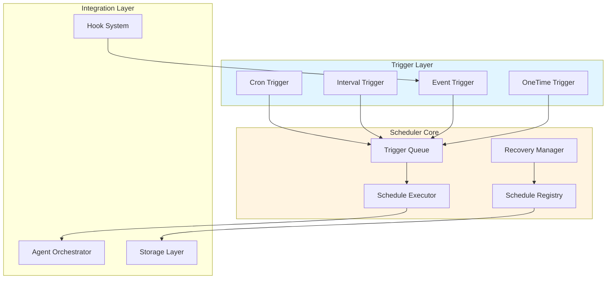
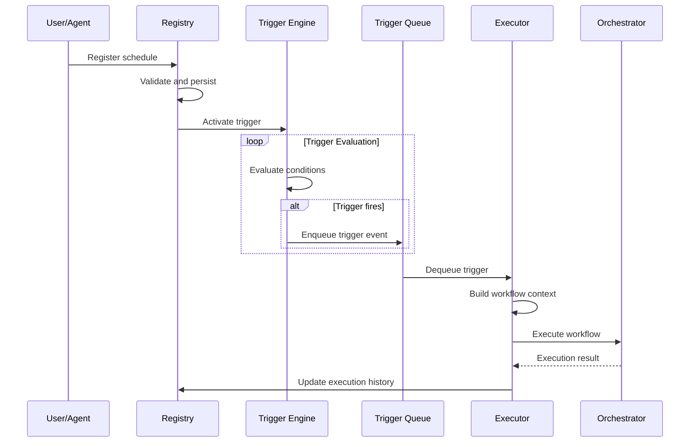
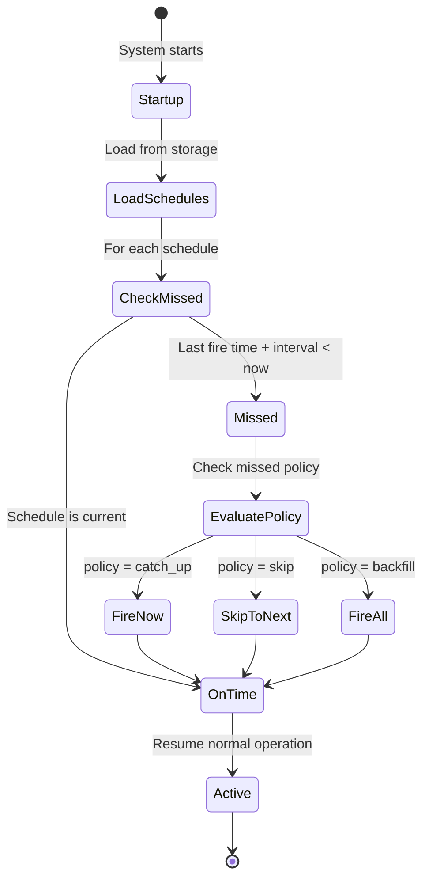
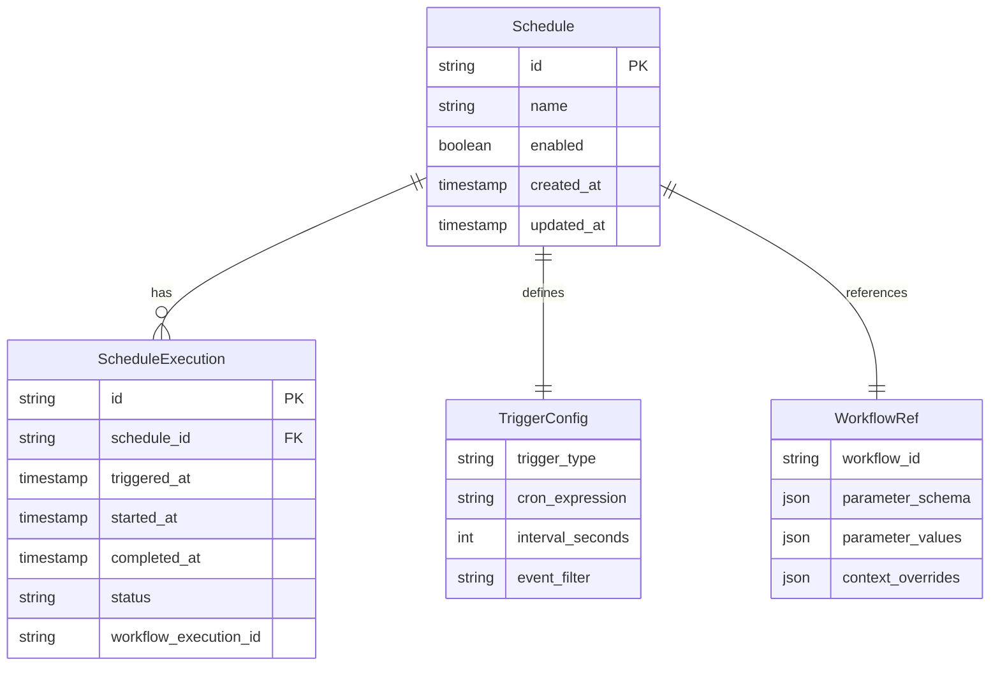

# Scheduled Tasks Module Design

> Scheduled and Triggered Task Execution - Integrating with Agent Orchestrator

**Version**: v0.2
**Created**: 2026-03-06
**Updated**: 2026-03-06
**Status**: Draft

---

## TL;DR

The Scheduled Tasks module provides time-based and event-driven task scheduling capabilities, integrating seamlessly with the Agent Orchestrator. It enables autonomous agent operations through cron-like scheduling, delayed execution, recurring workflows, and event-triggered task chains.

---

## Background and Goals

### Problem Statement

Current y-agent design focuses on request-response interactions. However, production AI agents require:

- Periodic background tasks (data sync, cleanup, health checks)
- Delayed execution (retry after cooldown, scheduled reminders)
- Event-driven workflows (file change triggers, webhook-initiated tasks)
- Long-running autonomous operations with checkpoints

### Design Goals

| Goal | Description |
|------|-------------|
| **Unified Scheduling** | Single abstraction for time-based and event-driven triggers |
| **Orchestrator Integration** | Scheduled tasks execute as standard Workflows |
| **Persistence** | Survive restarts; resume from last checkpoint |
| **Observability** | Full visibility into schedule status and execution history |
| **Flexibility** | Support complex schedules (cron, intervals, event chains) |

### Success Criteria

- Schedule persistence across restarts with zero missed executions
- Sub-second trigger latency for event-driven tasks
- Support for 1000+ concurrent scheduled tasks
- Integration with existing Workflow templates

---

## Scope

### In Scope

- Cron-style scheduling (daily, weekly, custom expressions)
- Interval-based scheduling (every N minutes/hours)
- One-time delayed execution
- Event-driven triggers (file, webhook, internal events)
- Schedule persistence and recovery
- Execution history and audit logging
- Integration with Orchestrator Workflows

### Out of Scope

- Distributed scheduling (single-node only for v1)
- Calendar integration (Google Calendar, Outlook)
- Complex dependency chains across schedules (use Workflows instead)

---

## High-Level Design

### Architecture Overview



**Diagram Type Rationale**: Flowchart chosen to show trigger types flowing into the scheduler core and integrating with existing orchestration.

**Legend**:
- **Triggers**: Various mechanisms that initiate scheduled tasks
- **Scheduler Core**: Central scheduling logic and state management
- **Integration**: Connection points with existing y-agent modules

### Core Components

| Component | Responsibility |
|-----------|----------------|
| Schedule Registry | Stores and manages schedule definitions |
| Trigger Engine | Evaluates trigger conditions and fires events |
| Schedule Executor | Translates triggers into Workflow executions |
| Recovery Manager | Handles restart recovery and missed schedules |
| Event Bridge | Connects Hook System events to scheduled triggers |

---

## Key Flows

### Schedule Registration and Execution



**Diagram Type Rationale**: Sequence diagram chosen to show temporal flow from registration through execution.

### Missed Schedule Recovery



**Diagram Type Rationale**: State diagram chosen to show recovery decision flow during startup.

---

## Data Model

### Schedule Definition



**Diagram Type Rationale**: ER diagram chosen to show relationships between scheduling entities.

### Core Data Structures

**Schedule**
- Unique identifier and name
- Trigger configuration (type, expression, filters)
- Workflow reference and input template
- Execution policies (missed schedule handling, concurrency)
- Metadata (tags, description, owner)

**TriggerConfig Variants**
- Cron: Standard cron expression with timezone
- Interval: Fixed duration between executions
- Event: Event type filter with optional payload matching
- OneTime: Specific timestamp for single execution

**Execution Policies**
- Missed schedule policy: catch_up, skip, backfill
- Concurrency policy: allow, skip_if_running, queue
- Retry policy: inherit from workflow or override

---

## Failure Handling and Edge Cases

| Scenario | Handling Strategy |
|----------|-------------------|
| System restart during execution | Resume from workflow checkpoint |
| Missed schedules during downtime | Apply configured missed policy |
| Trigger evaluation failure | Log error, continue other schedules |
| Workflow execution failure | Apply workflow retry policy |
| Event trigger backpressure | Queue with configurable limits |
| Clock skew / timezone issues | UTC internally, convert at boundaries |

### Concurrency Control

When a schedule triggers while a previous execution is still running:

| Policy | Behavior |
|--------|----------|
| `allow` | Start new execution in parallel |
| `skip_if_running` | Drop trigger, log skip event |
| `queue` | Queue trigger, execute when previous completes |
| `cancel_previous` | Cancel running execution, start new |

---

## Security and Permissions

| Concern | Approach |
|---------|----------|
| Schedule creation authorization | Inherit from session permissions |
| Workflow execution context | Scheduled executions run with schedule owner's permissions |
| Event trigger filtering | Whitelist allowed event types per schedule |
| Resource limits | Per-schedule execution time and count limits |

---

## Performance and Scalability

### Design Decisions

- **Timer wheel**: Efficient O(1) trigger scheduling for large schedule counts
- **Lazy evaluation**: Only active schedules consume resources
- **Batch persistence**: Group schedule updates to reduce storage I/O
- **Event debouncing**: Configurable debounce window for event triggers

### Capacity Planning

| Metric | Target |
|--------|--------|
| Active schedules | 10,000+ |
| Trigger evaluation latency | < 10ms |
| Event trigger latency | < 100ms |
| Persistence overhead | < 5% of execution time |

---

## Observability

| Capability | Implementation |
|------------|----------------|
| Schedule status dashboard | Registry exposes current state |
| Execution history | Queryable execution log with filters |
| Trigger metrics | Fire count, miss count, latency histograms |
| Alert integration | Hook into diagnostics module |

### Key Metrics

- `schedule.trigger.fired`: Counter per schedule
- `schedule.trigger.missed`: Counter per schedule
- `schedule.execution.duration`: Histogram
- `schedule.active.count`: Gauge
- `schedule.queue.depth`: Gauge for queued triggers

---

## Integration with Orchestrator

### Workflow Binding

Scheduled tasks execute as standard Workflows, enabling:

- Reuse of existing workflow definitions
- Full workflow features (conditions, branches, sub-workflows)
- Consistent execution tracing and observability
- Workflow-level retry and error handling

### Parameterized Scheduling

Schedules support a `ParameterSchema` (JSON Schema) that defines the parameters a workflow template accepts. This enables the same workflow to be reused across multiple schedules with different parameter values.

| Component | Description |
|-----------|-------------|
| **ParameterSchema** | JSON Schema attached to the workflow template; defines required/optional parameters with types, constraints, and defaults |
| **Parameter Validation** | When a schedule is created via `ScheduleCreate`, the provided `parameter_values` are validated against the template's `ParameterSchema`; invalid parameters are rejected |
| **Runtime Resolution** | At trigger time, parameter values are resolved through the expression engine; supports static values, trigger context (`{{ trigger.time }}`), event payloads (`{{ event.payload.field }}`), and computed expressions |
| **Schedule Cloning** | A new schedule can reference an existing schedule as a template and override only the changed parameters, simplifying multi-instance creation |

#### Parameter Resolution Order

```
resolved_parameters = {
    1. defaults from ParameterSchema
    2. overridden by static parameter_values from schedule config
    3. overridden by dynamic expressions resolved at trigger time (trigger context, event payload)
}
```

#### Agent-Facing Scheduling Tools

Agents can create and manage schedules programmatically through meta-tools (see [agent-autonomy-design.md](agent-autonomy-design.md)):

| Tool | Description |
|------|-------------|
| `ScheduleCreate` | Create a schedule binding a workflow template to a trigger with parameter values |
| `ScheduleList` | List active and paused schedules with optional filters |

### Context Injection

Scheduled executions receive additional context:

- `schedule_id`: Originating schedule
- `trigger_time`: When trigger fired
- `trigger_type`: cron, interval, event, onetime
- `execution_sequence`: Incrementing counter for this schedule
- `resolved_parameters`: Final parameter values after resolution

---

## Configuration

### Schedule Definition Format

```toml
[[schedule]]
id = "daily-cleanup"
name = "Daily Cleanup Task"
enabled = true

[schedule.trigger]
type = "cron"
expression = "0 2 * * *"  # 2 AM daily
timezone = "UTC"

[schedule.workflow]
workflow_id = "cleanup-workflow"

[schedule.workflow.parameter_values]
dry_run = false
retention_days = 30

[schedule.policy]
missed = "skip"           # skip, catch_up, backfill
concurrency = "skip_if_running"
max_executions_per_hour = 2

[schedule.metadata]
description = "Clean up old sessions and logs"
tags = ["maintenance", "automated"]
```

### Event Trigger Configuration

```toml
[[schedule]]
id = "file-change-processor"
name = "Process Changed Files"

[schedule.trigger]
type = "event"
event_type = "file.changed"
filter = { path_pattern = "/workspace/**/*.md" }
debounce_seconds = 5

[schedule.workflow]
workflow_id = "file-processor"
parameter_values = { file_path = "{{ event.payload.path }}" }
```

#### Parameterized Flight Monitoring Example

```toml
[[schedule]]
id = "flight-monitor-pek-nrt"
name = "Beijing-Tokyo Flight Price Monitor"

[schedule.trigger]
type = "cron"
expression = "0 9 * * *"
timezone = "Asia/Shanghai"

[schedule.workflow]
workflow_id = "flight-monitor"

[schedule.workflow.parameter_values]
origin = "PEK"
destination = "NRT"
price_threshold = 3000
alert_recipient = "user@example.com"

[schedule.policy]
missed = "skip"
concurrency = "skip_if_running"
```

A second schedule reusing the same workflow with different parameters:

```toml
[[schedule]]
id = "flight-monitor-pek-sha"
name = "Beijing-Shanghai Flight Price Monitor"

[schedule.trigger]
type = "cron"
expression = "0 9 * * *"
timezone = "Asia/Shanghai"

[schedule.workflow]
workflow_id = "flight-monitor"

[schedule.workflow.parameter_values]
origin = "PEK"
destination = "SHA"
price_threshold = 800
alert_recipient = "other@example.com"
```

---

## Alternatives and Trade-offs

| Decision | Chosen | Alternative | Rationale |
|----------|--------|-------------|-----------|
| Scheduling model | Timer wheel | Priority queue | O(1) insertion for high schedule counts |
| Persistence | SQLite with WAL | In-memory only | Restart recovery requirement |
| Event integration | Hook System bridge | Separate event bus | Reuse existing infrastructure |
| Workflow binding | Direct reference | Embedded definition | Separation of concerns, reusability |

---

## Open Questions

| Question | Owner | Due Date | Status |
|----------|-------|----------|--------|
| Distributed scheduling for future versions? | TBD | Phase 4 | Deferred |
| Calendar service integration priority? | TBD | Backlog | Open |
| Maximum schedule history retention? | TBD | Phase 2 | Open |

