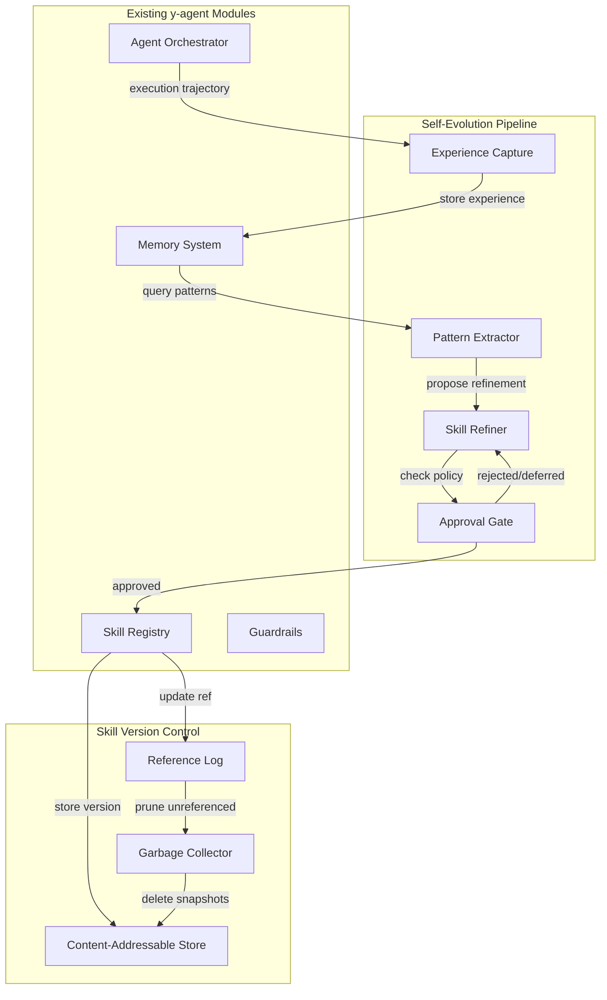
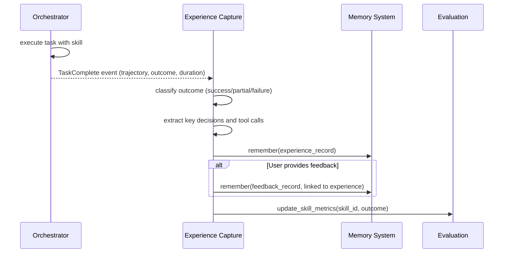
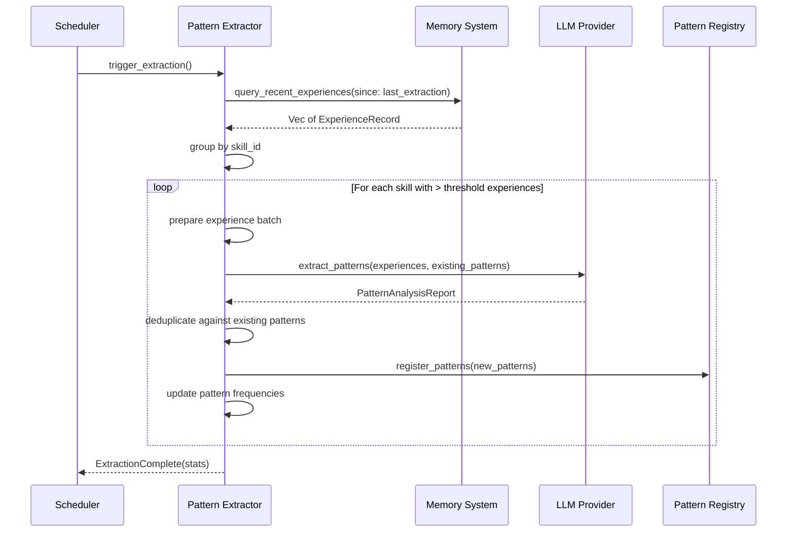
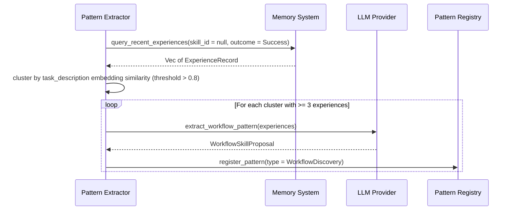
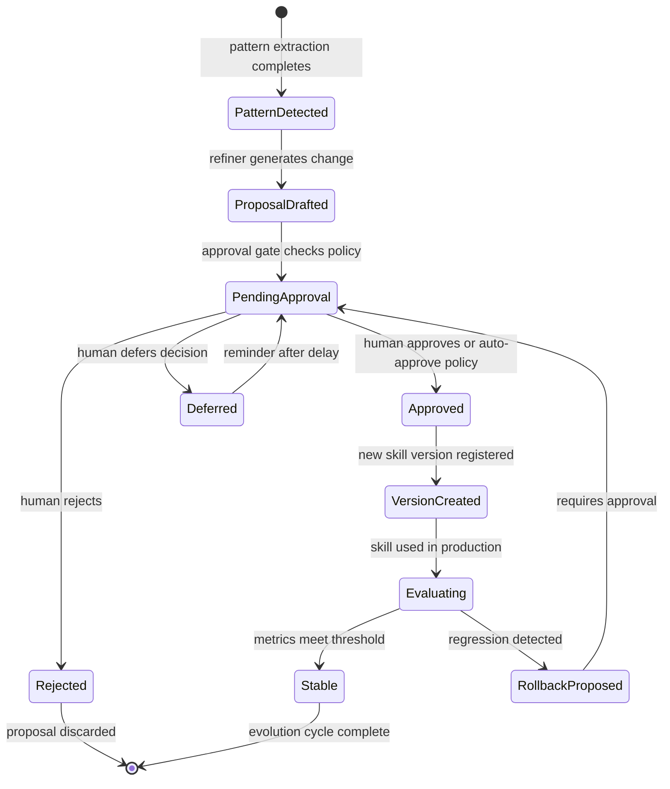
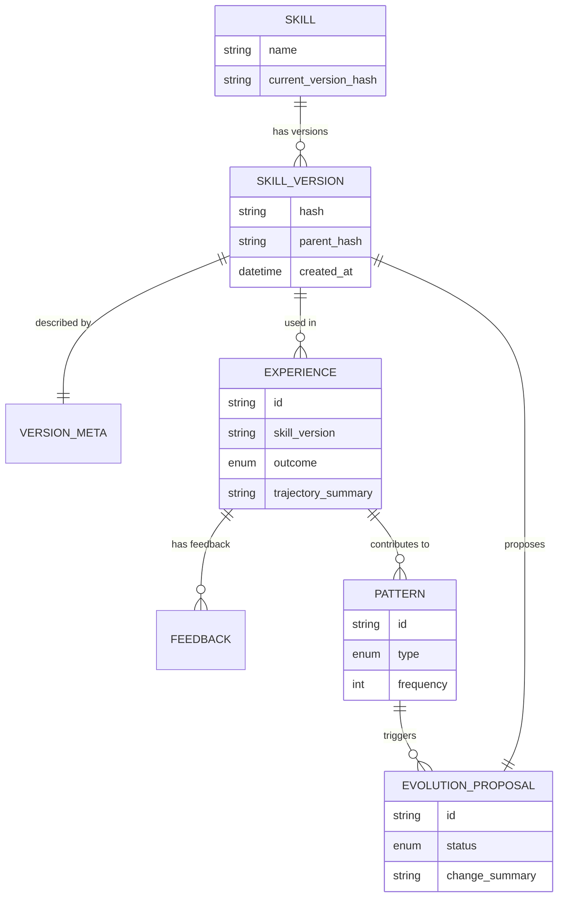

# Skill Versioning and Self-Evolution Design

> Version control for transformed skills and framework for y-agent's capability self-improvement

**Version**: v0.2
**Created**: 2026-03-06
**Updated**: 2026-03-06
**Status**: Draft

---

## TL;DR

This document addresses two interconnected concerns: (1) **Skill Version Management** -- skills transformed by the ingestion pipeline must be versioned with full history, enabling manual rollback when transformation quality degrades or user preferences change; (2) **Self-Evolution Framework** -- y-agent should improve its own capabilities over time by learning from execution experiences, accumulating reusable patterns, and refining its skills autonomously.

For skill versioning, we adopt a **Git-like content-addressable storage** model: each skill version is stored as an immutable snapshot identified by its content hash, with a reference log (reflog) tracking version transitions. This approach provides complete history, efficient storage (deduplication), and trivial rollback -- just update the pointer.

For self-evolution, we implement a **three-tier learning pipeline**: (1) **Experience Capture** -- record execution trajectories, tool outcomes, and user feedback with evidence provenance classification; (2) **Pattern Extraction** -- use LLM-assisted analysis to identify reusable patterns from accumulated experiences, including a **Skillless Experience Analysis** stage that discovers new workflow skills from successful executions that had no skill guidance; (3) **Skill Refinement** -- automatically propose skill updates or new skill drafts for human review. An optional **Fast-Path Extraction** mode enables real-time skill extraction from low-risk interactions alongside the default batch pipeline. A **Skill Usage Audit** provides per-retrieval feedback on whether injected skills were actually used by the LLM. Unlike Hermes's purely model-driven approach, y-agent adds structured evaluation metrics, evidence provenance tracking, automatic experience pruning, and human-in-the-loop approval gates to ensure evolution quality is controllable and reversible.

---

## Background and Goals

### Background

The skills-knowledge-design.md establishes a three-stage pipeline (ingest, transform, register) that converts external skills into the proprietary format. However, it does not address what happens after registration:

1. **Transformation quality varies**: The LLM-assisted transformation may produce suboptimal decompositions, miss important nuances, or create awkward tree structures. Users need the ability to revert to previous versions.

2. **Skills evolve through use**: As the agent uses a skill repeatedly, it discovers edge cases, better phrasings, or additional sub-scenarios. These discoveries should be captured and integrated back into the skill.

3. **Agent capability drift**: Without systematic self-improvement, the agent's effectiveness plateaus. Hermes demonstrates that memory + skills + experience capture can create a "grows with you" effect, but their approach lacks structured evaluation and rollback mechanisms.

### Hermes Self-Evolution Analysis

From the hermes-agent analysis, we extract the following lessons:

| Mechanism | Hermes Approach | Strengths | Weaknesses |
|-----------|-----------------|-----------|------------|
| **Explicit Memory** | MEMORY.md / USER.md files | Human-readable, auditable | No automatic evaluation; manual cleanup required |
| **Skill Creation** | skill_manage tool + nudge prompts | Converts experience to reusable workflows | Depends on model "wanting" to save; no quality gate |
| **Session Search** | FTS5 full-text search | Cross-session recall without embedding overhead | Coarse retrieval; no semantic ranking |
| **Auto-flush on Reset** | Temporary agent saves before session reset | Prevents losing valuable context | One-shot; no incremental refinement |
| **User Modeling** | Optional Honcho integration | Cross-device persistence | External dependency; privacy concerns |

**Key insight**: Hermes's evolution is model-dependent -- if the model ignores nudges, learning stops. y-agent must add structural guarantees: automatic experience capture, periodic evaluation, and human approval gates.

### Goals

| Goal | Measurable Criteria |
|------|---------------------|
| **Complete skill history** | Every version of every skill is recoverable; storage overhead < 2x raw content size |
| **Trivial rollback** | Rollback to any previous version in < 1 second; no data loss |
| **Automatic experience capture** | 100% of completed agent runs produce experience records (success or failure) |
| **Pattern extraction coverage** | At least 60% of recurring patterns (> 3 occurrences) are automatically detected and proposed |
| **Evolution quality gate** | No skill modification without human approval or explicit autonomous-evolution configuration |
| **Evaluation metrics** | Every skill has measurable effectiveness metrics; regressions detected within 5 uses |

### Assumptions

1. Skill transformation is infrequent (tens per day at most); storage for version history is not a bottleneck.
2. Human operators review evolution proposals at least weekly; full autonomous mode is opt-in.
3. The LLM used for pattern extraction can be a cheaper model than the primary agent model.
4. Experience records are append-only within a session; cross-session aggregation runs as a background job.
5. User feedback (explicit approval/rejection, corrections) is the strongest signal; implicit signals (task success/failure, tool errors) are weaker but more abundant.

---

## Scope

### In Scope

- Skill Version Storage: content-addressable snapshots, reflog, version metadata
- Skill Rollback API: rollback, diff, version list, garbage collection
- Experience Capture: trajectory recording, outcome classification, feedback collection
- Pattern Extraction: LLM-assisted analysis, pattern deduplication, frequency tracking
- Skill Refinement: evolution proposals, human approval workflow, automatic regression detection
- Self-Evolution Configuration: autonomous vs. supervised mode, approval policies
- Integration with existing Skill Registry, Memory System, and Guardrails

### Out of Scope

- Visual diff tool or merge UI (deferred to Phase 2)
- Distributed version synchronization (single-node in v0)
- Skill marketplace or sharing (evolution is local to workspace)
- Multi-user collaborative evolution (single operator model)
- Automatic LLM prompt optimization (out of scope for skill system)

---

## High-Level Design

### Architecture Overview



**Diagram type rationale**: Flowchart chosen to show module boundaries and data flow between version control, evolution pipeline, and existing modules.

**Legend**:
- **Version Control**: Git-like storage for skill versions.
- **Evolution**: Pipeline from experience capture to skill refinement.
- **Existing**: Modules defined in other design documents that this system integrates with.

### Design Principles

| Principle | Rationale |
|-----------|-----------|
| **Immutable snapshots** | Once a skill version is stored, it never changes. Modifications create new versions. This guarantees reproducibility and simplifies rollback. |
| **Content-addressable** | Skill content is identified by its hash. Identical content across versions is automatically deduplicated. |
| **Human-in-the-loop by default** | Evolution proposals require explicit approval unless autonomous mode is enabled. This prevents quality degradation from unchecked automation. |
| **Evaluation-driven** | Every skill has effectiveness metrics. Regressions trigger automatic rollback proposals rather than silent degradation. |
| **Separation of capture and extraction** | Experience capture is continuous and low-cost. Pattern extraction runs periodically (batch) to reduce LLM costs and enable human review windows. |

---

## Skill Version Control

### Content-Addressable Storage Model

Each skill version is stored as an immutable snapshot:

```
.y-agent/skills/objects/
  ab/                          # First 2 chars of hash
    ab3f8c7d...                # Full hash as filename
      skill.toml               # Skill manifest at this version
      root.md                  # Root document
      details/                 # Sub-documents
        ...
      lineage.toml             # Original lineage (unchanged)
      version-meta.toml        # Version-specific metadata (new)
```

**Version Metadata (version-meta.toml)**:

```toml
[version]
hash = "ab3f8c7d..."
parent_hash = "9e2a1b..."           # null for initial version
created_at = "2026-03-06T12:00:00Z"
created_by = "transformation-pipeline"  # or "evolution-refiner", "manual-edit"

[source]
type = "transformation"               # transformation | evolution | rollback | manual
source_skill_hash = "sha256:external..."  # for transformation
experience_ids = []                   # for evolution-derived versions

[evaluation]
uses_since_creation = 0
success_rate = null                   # populated after usage
average_relevance_score = null        # from user feedback or implicit signals
```

### Reference Log (RefLog)

The reflog tracks the active version for each skill and the history of version transitions:

```
.y-agent/skills/refs/
  humanizer-zh/
    HEAD                      # Current active version hash
    reflog                    # Append-only log of transitions
```

**RefLog Format** (JSONL):

```json
{"timestamp": "2026-03-06T12:00:00Z", "from": null, "to": "ab3f8c7d...", "action": "register", "reason": "initial transformation"}
{"timestamp": "2026-03-06T14:30:00Z", "from": "ab3f8c7d...", "to": "cd5e9f1a...", "action": "evolve", "reason": "added edge case handling", "proposal_id": "prop-123"}
{"timestamp": "2026-03-06T16:00:00Z", "from": "cd5e9f1a...", "to": "ab3f8c7d...", "action": "rollback", "reason": "user requested revert"}
```

### Version Operations

| Operation | Description | Implementation |
|-----------|-------------|----------------|
| **list_versions(skill_name)** | Return all versions with metadata | Scan reflog, load version-meta.toml for each |
| **get_version(skill_name, hash)** | Retrieve specific version | Direct lookup in objects/ |
| **diff(skill_name, hash_a, hash_b)** | Compare two versions | Load both, compute text diff on root.md and sub-documents |
| **rollback(skill_name, target_hash)** | Revert to previous version | Update HEAD, append reflog entry |
| **prune(skill_name, keep_count)** | Remove old versions | Mark unreferenced objects for GC |

### Garbage Collection

Objects become unreferenced when:
1. They are not the current HEAD of any skill.
2. They are not in the "keep" window (default: last 10 versions per skill).
3. They have no pending evaluation data (still collecting metrics).

GC runs as a scheduled background task (default: daily) or on explicit trigger.

---

## Self-Evolution Pipeline

### Experience Capture

Every agent run produces an **Experience Record** stored in the Memory System:



**Diagram type rationale**: Sequence diagram shows the temporal flow of experience capture after task completion.

**Legend**:
- Experience records are stored immediately after each task.
- Feedback records are linked to experiences when available.
- Skill metrics are updated incrementally.

**Experience Record Structure**:

| Field | Type | Description |
|-------|------|-------------|
| `id` | String | Unique experience identifier |
| `timestamp` | DateTime | When the experience occurred |
| `skill_id` | Option of String | Skill used; **null when no skill was involved** (enables Skillless Experience Analysis) |
| `skill_version` | Option of String | Specific version hash |
| `task_description` | String | Original task prompt |
| `outcome` | Enum (Success / Partial / Failure) | Classification based on task completion |
| `trajectory_summary` | String | LLM-generated summary of steps taken |
| `key_decisions` | Vec of String | Critical choice points in the execution |
| `tool_calls` | Vec of ToolCallRecord | Tools invoked with outcomes |
| `evidence_entries` | Vec of EvidenceEntry | Provenance-tagged evidence items (see below) |
| `duration_ms` | u64 | Total execution time |
| `token_usage` | TokenUsage | Tokens consumed |
| `error_messages` | Vec of String | Errors encountered (if any) |

#### Evidence Provenance

Each evidence item in an experience record carries a provenance tag that classifies its source. Pattern Extraction uses provenance to prevent self-reinforcement bias -- where the agent's own output style gets extracted as a skill and further amplified. Inspired by [AutoSkill](../research/autoskill-ell.md)'s strict separation of user evidence from assistant-generated content.

| Provenance | Definition | Pattern Extraction Rule |
|------------|------------|------------------------|
| `user_stated` | User explicitly stated a constraint, preference, or process requirement | Can directly inform skill updates |
| `user_correction` | User corrected agent output (e.g., "don't use tables") | Highest priority; overrides prior `user_stated` |
| `task_outcome` | Objective success/failure result | Statistical signal only; not direct skill content |
| `agent_observation` | Pattern the agent inferred from its own execution | **Must have at least one `user_stated` or `user_correction` corroboration; discarded otherwise** |

The `agent_observation` corroboration rule is enforced as a hard constraint in the Pattern Extraction LLM prompt, not as a soft weight.

### Pattern Extraction

Pattern extraction runs as a periodic batch job (configurable: daily, weekly, or on-demand):



**Diagram type rationale**: Sequence diagram shows the batch extraction process.

**Legend**:
- Extraction is triggered periodically, not on every experience.
- LLM call is batched per skill to reduce API costs.
- Patterns are deduplicated before storage.

**Pattern Types**:

| Type | Description | Evolution Action |
|------|-------------|------------------|
| **Edge Case** | Scenario where skill guidance was insufficient | Add sub-document or modify root rules |
| **Common Error** | Recurring mistake pattern | Add explicit warning or negative example |
| **Better Phrasing** | User corrections or more effective formulations | Update root.md wording |
| **New Capability** | Skill used for unanticipated purpose successfully | Consider splitting into new skill |
| **Obsolete Rule** | Rule that no longer applies or conflicts with practice | Mark for removal in next version |
| **Workflow Discovery** | Similar tasks completed successfully >= 3 times without any skill | Propose new workflow skill (see Skillless Experience Analysis) |

#### Skillless Experience Analysis

Standard pattern extraction groups experiences by `skill_id` and only analyzes experiences linked to existing skills. This creates a blind spot: successful executions that had no skill guidance (`skill_id = null`) are never analyzed, so the system cannot discover new reusable workflows from repeated unguided successes.

Skillless Experience Analysis runs as an additional stage after the standard per-skill extraction:



**Diagram type rationale**: Sequence diagram shows the new analysis stage that processes skillless experiences.

**Legend**:
- Only successful experiences with no skill are analyzed.
- Clustering uses task_description embeddings; threshold 0.8 ensures meaningful similarity.
- The LLM extracts a workflow template: step skeleton with parameter placeholders, triggers from task_description commonalities, decision points from key_decisions intersection.

The resulting `WorkflowSkillProposal` follows the standard Evolution Proposal workflow through the Approval Gate. The proposal's `change.type` is `workflow_discovery`, and the proposal creates a new skill rather than modifying an existing one.

This is the only path in y-agent that creates skills "from nothing" -- all other pattern types modify existing skills. Inspired by [AutoSkill](../research/autoskill-ell.md)'s trajectory extraction capability.

#### Fast-Path Extraction

The default batch pipeline (daily/weekly/on-demand) is appropriate for high-risk agent tasks where skills affect execution with real-world side effects. For low-risk interactions (conversational assistance, code generation without execution), users expect "tell once, remember immediately."

Fast-Path Extraction is an optional real-time extraction mode that runs alongside the batch pipeline:

| Aspect | Batch Path (default) | Fast Path (opt-in) |
|--------|---------------------|--------------------|
| **Trigger** | Scheduled or on-demand | After each interaction, async |
| **Evidence source** | Multiple Experience Records grouped by skill_id | Single interaction window |
| **Approval policy** | Configured per skill (Supervised/Auto-minor/etc.) | Auto-minor only (phrasing_update, error_warning) |
| **Scope** | All pattern types | Better Phrasing, Common Error only |
| **Feature flag** | `evolution_extraction` | `evolution_fast_path` (default: disabled) |

Fast-Path constraints:
- Only `user_correction` and `user_stated` evidence is eligible (no `agent_observation`).
- Only updates to existing skills (no new skill creation via fast path).
- Changes are limited to phrasing updates and error warnings; structural changes (edge case addition, capability split) require the batch path.
- The batch pipeline deduplicates against fast-path changes to avoid double-processing.

### Skill Refinement

The Skill Refiner generates evolution proposals from detected patterns:



**Diagram type rationale**: State diagram shows the lifecycle of an evolution proposal.

**Legend**:
- All proposals pass through the approval gate.
- Regression detection can trigger automatic rollback proposals.
- Deferred proposals are re-surfaced after a configurable delay.

**Evolution Proposal Structure**:

```toml
[proposal]
id = "prop-123"
skill_name = "humanizer-zh"
current_version = "ab3f8c7d..."
proposed_version = "cd5e9f1a..."  # null until approved

[proposal.change]
type = "edge_case_addition"  # edge_case_addition | error_warning | phrasing_update | capability_split | rule_removal
summary = "Add handling for formal academic tone"
patterns_referenced = ["pat-456", "pat-789"]

[proposal.diff]
files_changed = ["details/tone-guidelines.md"]
additions = 15
deletions = 3
preview = """
+ ## Academic Tone
+ When processing academic text, preserve:
+ - Passive voice constructions common in scholarly writing
+ - Technical terminology without simplification
+ - Citation formatting
"""

[proposal.status]
state = "pending_approval"  # pending_approval | approved | rejected | deferred
created_at = "2026-03-06T12:00:00Z"
updated_at = "2026-03-06T12:00:00Z"
deferred_until = null
```

### Approval Gate

The approval gate enforces evolution policies:

| Policy | Condition | Action |
|--------|-----------|--------|
| **Supervised (default)** | All proposals | Require human approval |
| **Auto-minor** | Change type in {phrasing_update, error_warning} | Auto-approve; notify human |
| **Auto-evaluated** | Previous versions of same skill have success_rate > 0.9 | Auto-approve after 3-day delay |
| **Autonomous** | Explicit user opt-in per skill | Auto-approve immediately |
| **Frozen** | Skill marked as frozen | Reject all proposals |

---

## Evaluation and Regression Detection

### Skill Effectiveness Metrics

Each skill tracks metrics aggregated from experience records and usage audits:

| Metric | Calculation | Purpose |
|--------|-------------|---------|
| **use_count** | Count of experiences with this skill | Activity level |
| **success_rate** | successes / total uses | Primary effectiveness |
| **partial_rate** | partial successes / total uses | Indicates room for improvement |
| **failure_rate** | failures / total uses | Problem indicator |
| **avg_duration_ms** | Mean execution time | Efficiency |
| **avg_token_usage** | Mean tokens consumed | Cost |
| **user_feedback_score** | Weighted average of explicit feedback | Quality signal |
| **injection_count** | Times skill was injected into LLM context | Retrieval activity |
| **actual_usage_count** | Times LLM actually depended on the skill's instructions | Real effectiveness |
| **usage_rate** | actual_usage_count / injection_count | Injection efficiency; low values indicate wasted token budget |

### Skill Usage Audit

The Skill Usage Audit determines whether a skill that was injected into the LLM context actually influenced the output. This closes a feedback gap: without it, the system knows a skill was retrieved and injected but not whether it mattered.

The audit runs as a `SkillUsageAuditMiddleware` in the `post_task` phase of the Hook system (see [hooks-plugin-design.md](hooks-plugin-design.md)), executing asynchronously after each task completion.

**Dual-channel judgment** (inspired by [AutoSkill](../research/autoskill-ell.md)):

| Channel | Method | When Used |
|---------|--------|-----------|
| **LLM audit (primary)** | Send `{task_description, agent_output, injected_skills[]}` to LLM; judge `relevant` and `used` per skill | Default; uses a cheap model |
| **Keyword overlap (fallback)** | Compute token overlap between agent output and skill content | When LLM audit fails or is disabled |

LLM audit core rule: **"If the output could be produced equally well without this skill, `used = false`."** The `used` flag requires `relevant = true` as precondition.

**Signal routing**:
- `usage_rate < 0.1` (injected 10+ times, used < 10%) triggers `Obsolete Rule` pattern detection in Pattern Extraction.
- `usage_rate` feeds into the `Auto-evaluated` approval policy: skills with sustained high `usage_rate` qualify for faster auto-approval of evolution proposals.

### Regression Detection

After each skill version change, the system monitors for regression:

1. **Baseline establishment**: Record metrics from the previous version's last N uses (default: 20).
2. **Observation window**: After version change, collect metrics for N uses.
3. **Comparison**: If success_rate drops by > 15% or failure_rate increases by > 10%, trigger regression alert.
4. **Action**: Generate rollback proposal with regression evidence.

---

## Data and State Model

### Entity Relationships



**Diagram type rationale**: ER diagram shows relationships between skills, versions, experiences, patterns, and proposals.

**Legend**:
- A skill has multiple versions; one is current.
- Experiences link to specific skill versions.
- Patterns aggregate from multiple experiences.
- Proposals reference patterns and propose new versions.

### Storage Layout

```
.y-agent/
  skills/
    objects/                  # Content-addressable skill snapshots
    refs/                     # HEAD pointers and reflogs per skill
    gc/                       # GC metadata
  evolution/
    experiences/              # Experience records (or in Memory System)
    patterns/                 # Extracted patterns
    proposals/                # Pending and historical proposals
    metrics/                  # Aggregated skill metrics
  config/
    evolution-policy.toml     # Approval policies and schedules
```

---

## Failure Handling and Edge Cases

| Scenario | Handling |
|----------|----------|
| **Rollback target version missing** | Error: version pruned by GC. Suggest restoring from backup or re-transforming from source. |
| **Pattern extraction LLM call fails** | Retry 3 times; if all fail, skip this extraction cycle; log warning; retry next cycle. |
| **Conflicting evolution proposals** | Queue proposals; process sequentially; later proposals rebase on approved changes. |
| **Metric collection during version transition** | Attribute experiences to the version active at task start; no mixing. |
| **User approves proposal but skill changed meanwhile** | Rebase proposal on current version; if conflict, mark proposal as needing re-review. |
| **Regression detected but no previous version available** | Cannot rollback; alert user; freeze skill until manual intervention. |
| **Experience record for deleted skill** | Orphaned experiences remain in memory for cross-skill pattern extraction; no skill-specific metrics update. |

---

## Security and Permissions

| Concern | Approach |
|---------|----------|
| **Evolution proposal injection** | Proposals are generated internally from captured experiences; no external proposal submission API. |
| **Malicious pattern extraction** | Patterns pass through the existing skill Safety Screener before generating proposals. |
| **Unauthorized rollback** | Rollback operations require explicit user action or autonomous mode configuration. |
| **Metric manipulation** | Metrics are derived from immutable experience records; no direct metric editing API. |
| **Audit trail** | RefLog and proposal history are append-only; all changes are attributed and timestamped. |

---

## Performance and Scalability

| Metric | Target | Approach |
|--------|--------|----------|
| **Rollback latency** | < 1 second | HEAD pointer update + reflog append; no data copying |
| **Version listing** | < 100 ms for 1000 versions | RefLog is append-only; tail read for recent history |
| **Experience capture overhead** | < 5 ms per task | Async enqueue to Memory System; no blocking |
| **Pattern extraction** | < 30 seconds per skill | Batch experiences; single LLM call per skill |
| **Proposal generation** | < 10 seconds per pattern | Templated changes; LLM only for complex refinements |
| **Storage efficiency** | < 2x raw content | Content-addressable deduplication; identical sub-documents shared |

---

## Observability

| Signal | Metrics / Events |
|--------|-----------------|
| **Version Control** | `skill.versions.total`, `skill.versions.created`, `skill.rollbacks.count`, `skill.gc.objects_deleted` |
| **Experience Capture** | `evolution.experiences.captured`, `evolution.experiences.by_outcome` (success/partial/failure) |
| **Pattern Extraction** | `evolution.patterns.extracted`, `evolution.patterns.by_type`, `evolution.extraction.duration_ms` |
| **Proposals** | `evolution.proposals.created`, `evolution.proposals.approved`, `evolution.proposals.rejected`, `evolution.proposals.pending_duration_ms` |
| **Regression** | `evolution.regressions.detected`, `evolution.regressions.auto_rollback` |
| **Evaluation** | `skill.evaluation.success_rate` (histogram), `skill.evaluation.uses_per_day` |
| **Usage Audit** | `skill.usage_audit.injection_count`, `skill.usage_audit.actual_usage_count`, `skill.usage_audit.usage_rate` (by skill), `skill.usage_audit.stale_candidates` |
| **Fast-Path** | `evolution.fast_path.extractions`, `evolution.fast_path.proposals_created`, `evolution.fast_path.proposals_auto_approved` |
| **Skillless Analysis** | `evolution.skillless.clusters_found`, `evolution.skillless.proposals_created` |

---

## Rollout and Rollback

### Phased Implementation

| Phase | Scope | Duration |
|-------|-------|----------|
| **Phase 1** | Content-addressable storage, reflog, basic rollback API, version listing | 1-2 weeks |
| **Phase 2** | Experience capture integration with Memory System, outcome classification, evidence provenance tagging | 1-2 weeks |
| **Phase 3** | Pattern extraction (LLM-assisted), pattern registry, frequency tracking, Skillless Experience Analysis | 2-3 weeks |
| **Phase 4** | Skill refinement, proposal workflow, approval gate, basic metrics, Skill Usage Audit | 2-3 weeks |
| **Phase 5** | Regression detection, auto-rollback proposals, advanced metrics, autonomous mode | 2-3 weeks |
| **Phase 6** | Fast-Path Extraction mode, usage_rate-driven Obsolete Rule detection | 1-2 weeks |

### Rollback Strategy

| Component | Rollback |
|-----------|----------|
| **Version Control** | Feature flag `skill_versioning`; disabled = single version per skill, no history |
| **Experience Capture** | Feature flag `evolution_capture`; disabled = no experience records saved |
| **Pattern Extraction** | Feature flag `evolution_extraction`; disabled = no LLM-assisted analysis |
| **Skill Refinement** | Feature flag `evolution_refinement`; disabled = no proposals generated |
| **Autonomous Mode** | Per-skill configuration; default is supervised (human approval required) |
| **Fast-Path Extraction** | Feature flag `evolution_fast_path`; disabled = only batch extraction runs |
| **Skill Usage Audit** | Feature flag `skill_usage_audit`; disabled = no per-retrieval usage tracking |

---

## Alternatives and Trade-offs

### Version Storage: Git-like vs. Relational

| | Git-like (chosen) | Relational |
|-|-------------------|------------|
| **Deduplication** | Automatic via content hash | Requires explicit normalization |
| **Rollback** | O(1) pointer update | O(n) row operations |
| **History query** | Sequential reflog scan | SQL queries (faster for complex filters) |
| **Tooling** | Familiar to developers | Requires custom UI |
| **Complexity** | Moderate (custom implementation) | Lower (use existing DB) |

**Decision**: Git-like model. The deduplication and O(1) rollback benefits outweigh the need for custom implementation. Most version history queries are simple (list, diff, rollback) and do not need SQL flexibility.

### Evolution Trigger: Continuous vs. Batch vs. Dual-Path

| | Continuous | Batch only | Dual-Path (chosen) |
|-|------------|-----------|-------------------|
| **Latency** | Immediate | Delayed (hours to days) | Batch default; real-time opt-in for low-risk |
| **LLM cost** | High (call per experience) | Low (batch per extraction cycle) | Batch cost + incremental fast-path cost when enabled |
| **Human review** | Constant stream | Periodic review windows | Batch requires review; fast-path auto-minor only |
| **Pattern quality** | May detect noise | More data yields better patterns | Batch for complex patterns; fast-path restricted to safe changes |

**Decision**: Dual-path. Batch extraction remains the default for its cost and quality advantages. Fast-Path Extraction is added as an opt-in mode (feature flag `evolution_fast_path`, default disabled) for low-risk scenarios where users expect immediate skill learning. Fast-path is restricted to minor changes (phrasing updates, error warnings) with `user_stated`/`user_correction` evidence only, eliminating the noise risk of continuous extraction.

### Approval Policy: All-supervised vs. Policy-based

| | All-supervised | Policy-based (chosen) |
|-|--------------------|----------------------|
| **Safety** | Maximum human oversight | Configurable per change type |
| **Evolution speed** | Slow (blocked on human) | Faster for low-risk changes |
| **User burden** | High | Adjustable |

**Decision**: Policy-based with supervised default. Users who trust the system can enable auto-approve for minor changes; those who need maximum control retain full supervision.

---

## Open Questions

| # | Question | Owner | Due Date | Status |
|---|----------|-------|----------|--------|
| 1 | What is the optimal extraction cycle frequency? Daily may be too aggressive; weekly may be too slow. | Evolution team | 2026-03-27 | Open |
| 2 | Should regression detection use statistical significance tests or simple threshold comparison? | Evolution team | 2026-03-27 | Open |
| 3 | How should the system handle skills with very few uses (< 10)? Insufficient data for reliable metrics. | Evolution team | 2026-04-03 | Open |
| 4 | Should evolution proposals be surfaced in the CLI, TUI, or a separate dashboard? | Client team | 2026-04-03 | Open |
| 5 | What is the appropriate retention period for experience records? Indefinite storage may become costly. | Evolution team | 2026-04-15 | Open |
| 6 | Should pattern extraction consider cross-skill patterns (e.g., "when skill A fails, users fall back to skill B")? | Evolution team | 2026-04-15 | Open |

---

## Decision Log

| # | Date | Decision | Rationale |
|---|------|----------|-----------|
| D1 | 2026-03-06 | Git-like content-addressable storage for skill versions | Automatic deduplication, O(1) rollback, familiar model |
| D2 | 2026-03-06 | Batch pattern extraction rather than continuous | Reduces LLM cost, enables human review windows, better pattern quality |
| D3 | 2026-03-06 | Human-in-the-loop approval by default | Prevents quality degradation from unchecked automation |
| D4 | 2026-03-06 | Regression detection with automatic rollback proposals | Catches quality issues early without requiring constant human monitoring |
| D5 | 2026-03-06 | Experience capture as extension of Memory System | Reuses existing infrastructure, consistent data model |
| D6 | 2026-03-06 | Policy-based approval rather than one-size-fits-all | Balances safety (supervised) with efficiency (auto-approve for trusted skills) |
| D7 | 2026-03-06 | Evidence provenance tagging on experience records | Prevents agent self-reinforcement bias; agent_observation requires user evidence corroboration (AutoSkill-inspired) |
| D8 | 2026-03-06 | Skillless Experience Analysis as additional pattern extraction stage | Only path to create skills "from nothing"; addresses blind spot where skill_id=null experiences are skipped (AutoSkill-inspired) |
| D9 | 2026-03-06 | Dual-path extraction (batch default + fast-path opt-in) | Batch for safety and pattern quality; fast-path for immediate skill learning in low-risk scenarios (AutoSkill-inspired) |
| D10 | 2026-03-06 | Skill Usage Audit with dual-channel judgment | Closes feedback gap between "skill injected" and "skill actually used"; drives Obsolete Rule detection and auto-approval confidence (AutoSkill-inspired) |

---

## Integration Points

### With Skill Registry (skills-knowledge-design.md)

- **Registration hook**: After transformation pipeline registers a skill, version control creates initial snapshot.
- **Active version**: Registry's `SkillStore` queries version control for current HEAD.
- **Update flow**: Evolution proposals go through transformation engine for format compliance before registration.

### With Memory System (memory-architecture.md)

- **Experience storage**: Experience records stored as `EXPERIENCE` memory type with skill scope.
- **Pattern storage**: Extracted patterns stored as `TASK` memory type for cross-session recall.
- **Feedback linkage**: User feedback records linked to experiences via memory ID references.

### With Guardrails (guardrails-hitl-design.md)

- **Approval escalation**: Evolution proposals requiring human approval use HITL escalation workflow.
- **Regression alerts**: Regression detection triggers guardrail alerts through existing alerting pipeline.
- **Permission model**: Autonomous evolution mode requires explicit capability grant.

### With Orchestrator (orchestrator-design.md)

- **Experience capture hook**: Orchestrator emits `TaskComplete` events consumed by Experience Capture.
- **Skill selection**: Orchestrator queries version control for active skill version before injection.
- **Metric attribution**: Task outcomes attributed to specific skill versions for accurate evaluation.

---

## Changelog

| Version | Date | Changes |
|---------|------|---------|
| v0.1 | 2026-03-06 | Initial design: skill version control with content-addressable storage, self-evolution pipeline with experience capture, pattern extraction, skill refinement, and approval gate |
| v0.2 | 2026-03-06 | AutoSkill-inspired enhancements: (1) evidence provenance tagging on Experience Records with agent_observation corroboration rule; (2) Skillless Experience Analysis stage in Pattern Extraction for workflow discovery from unguided successes; (3) Fast-Path Extraction opt-in mode for low-risk real-time skill learning; (4) Skill Usage Audit with dual-channel LLM+keyword judgment, injection_count/actual_usage_count/usage_rate metrics |
