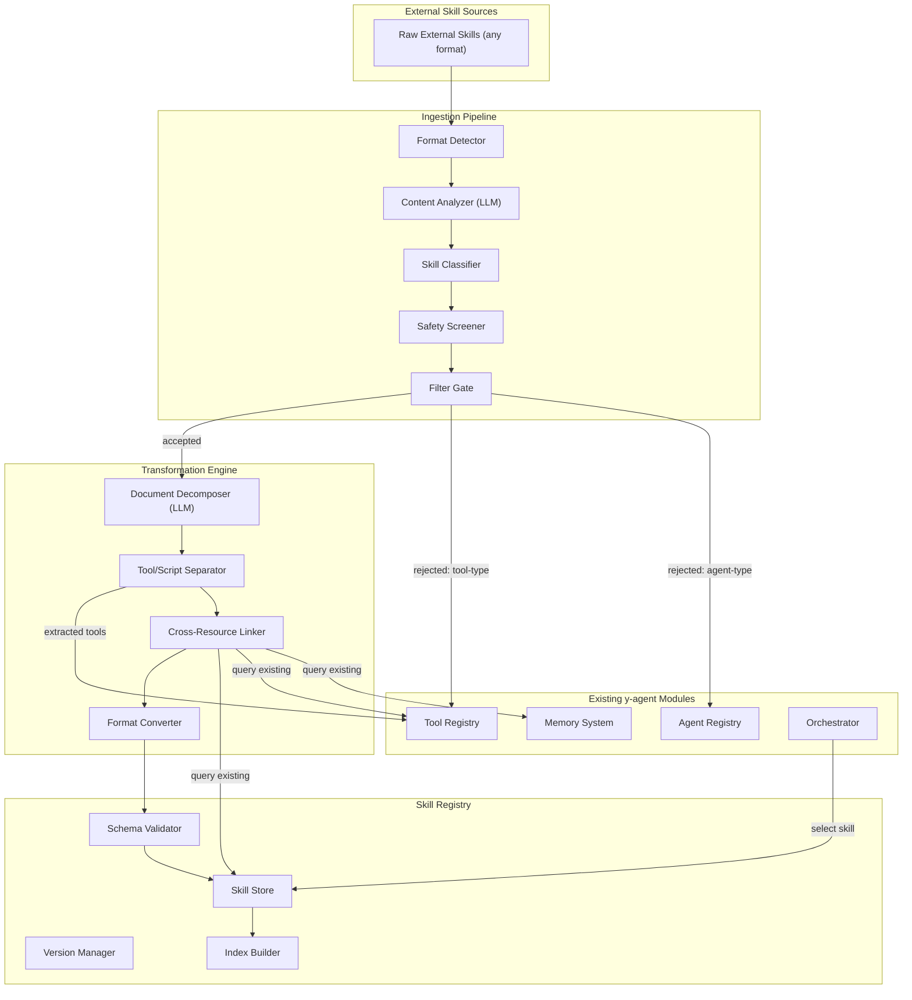
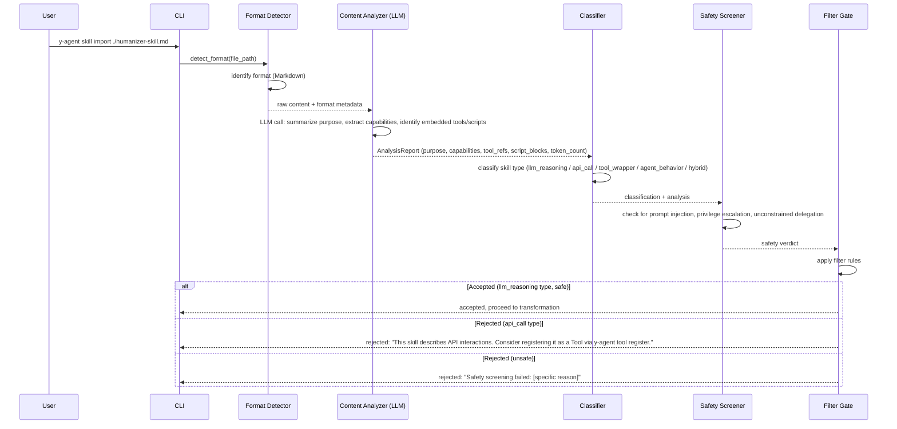
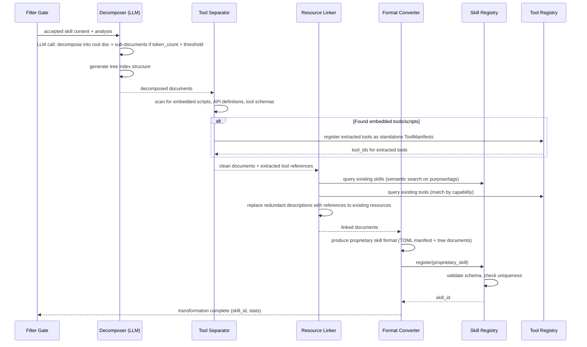
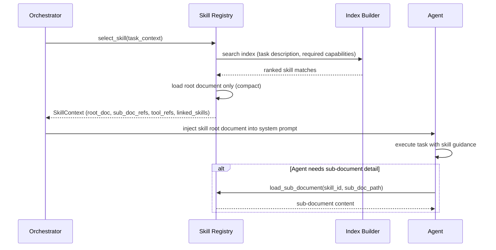
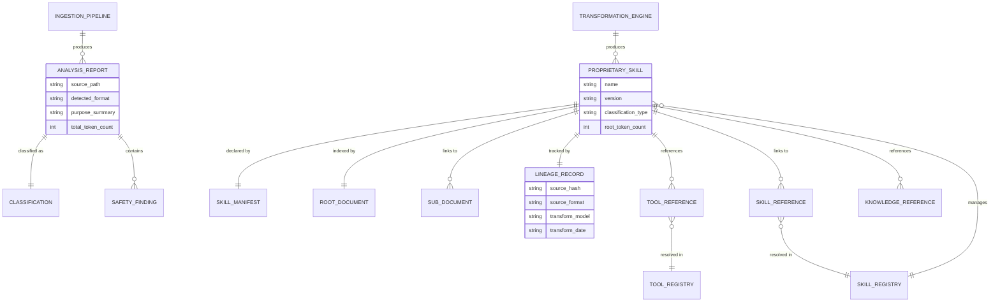
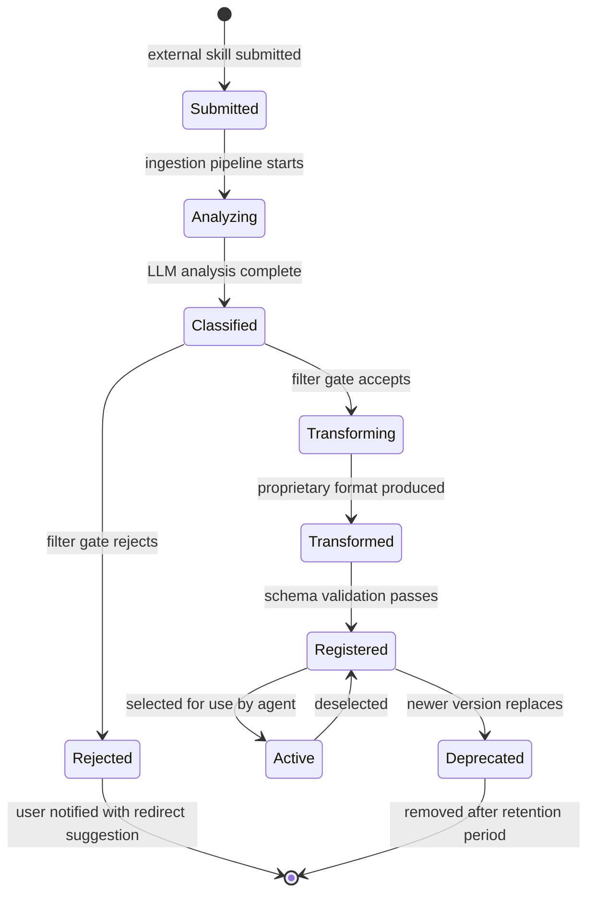

# Skills and Knowledge Management Design

> Skill ingestion, transformation, proprietary format, and atomic skill registry for y-agent

**Version**: v0.3
**Created**: 2026-03-06
**Updated**: 2026-03-06
**Status**: Draft

---

## TL;DR

The Skills system is redesigned around a core philosophy: **y-agent is not an AI provider shell**. External skills vary wildly in quality, length, and safety -- injecting them directly into LLM context wastes attention, introduces risk, and undermines the multi-agent architecture. Instead, y-agent treats skills as **LLM-instruction-only artifacts** that guide reasoning, tone, or domain knowledge -- tasks that can only be accomplished through LLM inference (e.g., text humanization, paper summarization, translation style). Skills that describe API calls, script execution, or tool invocations are rejected and redirected to the Agent or Tool systems.

The system has three stages: (1) **Ingestion Pipeline** -- accepts arbitrary external skills in any format, uses LLM-assisted analysis to understand, classify, and filter them; (2) **Transformation Engine** -- converts accepted skills into the y-agent proprietary format, decomposing long documents into tree-indexed hierarchies, separating embedded tools/scripts, and linking to existing registered resources; (3) **Skill Registry** -- only accepts the proprietary format, enforces atomicity, maintainability, and cross-resource linkage. This approach ensures every skill in y-agent is concise, safe, atomic, and integrated.

---

## Background and Goals

### Background

Industry skill implementations suffer from three fundamental problems:

1. **AI provider dependency**: Most frameworks inject external skill text directly into the LLM context. The agent becomes a thin wrapper around the provider, with no independent judgment about skill quality or relevance.

2. **Attention dilution**: Skills vary from 50 tokens to 50,000+ tokens. Long, redundant, or poorly structured skills consume context window capacity and degrade LLM focus on the actual task.

3. **Skill-tool conflation**: Many external skills embed API calls, shell scripts, or tool definitions inside their instruction text. This is architecturally wrong -- tools belong in the Tool System, agent behaviors belong in the Multi-Agent framework, and skills should contain only what requires LLM reasoning.

y-agent's multi-agent architecture is designed around **atomic task decomposition**: many specialized agents running small, focused tasks rather than one or two agents executing monolithic workflows. Skills must align with this philosophy -- each skill should be a small, focused instruction set for a specific LLM reasoning capability.

### Comparison with v0.1 Design

| Aspect | v0.1 (Previous) | v0.2 (Current) |
|--------|-----------------|-----------------|
| External skill handling | Direct installation and activation | LLM-assisted ingestion, filtering, transformation |
| Skill scope | Bundle tools + prompts + knowledge + config | LLM-instruction-only; tools separated to Tool System |
| Skill format | Single TOML manifest + resource directories | Tree-indexed proprietary format with sub-documents |
| Quality control | Manifest validation only | LLM-driven content analysis, atomicity enforcement, safety screening |
| Integration model | Skills own tools and knowledge | Skills reference tools and knowledge; no embedding |
| Philosophy | Package and distribute | Understand, filter, transform, register |

### Goals

| Goal | Measurable Criteria |
|------|-------------------|
| **Ingestion accepts any format** | Parse and analyze skills in Markdown, YAML, JSON, TOML, plain text, and mixed formats |
| **Reject non-LLM skills** | Skills that primarily describe API calls, script execution, or tool invocation are classified and rejected with a redirect suggestion (to Tool or Agent system) |
| **Atomicity enforcement** | No registered skill exceeds 2,000 tokens in its root document; complex skills decomposed into tree-indexed sub-documents |
| **Safety screening** | Skills containing prompt injection patterns, privilege escalation instructions, or unconstrained agent delegation are blocked |
| **Transformation quality** | Transformed proprietary skills retain the original skill's intent as validated by a round-trip semantic similarity check (cosine similarity > 0.85) |
| **Cross-resource linkage** | Transformation engine identifies and links to at least 80% of overlapping existing tools/skills in the local registry |
| **Registration strictness** | Only proprietary format accepted; raw external skills cannot be registered |

### Assumptions

1. LLM calls during ingestion and transformation are acceptable overhead -- these are one-time costs at skill import time, not per-query costs.
2. The ingestion pipeline runs as an offline or background process, not in the critical path of agent execution.
3. External skills are text-based. Binary skill formats (compiled plugins, WASM modules) are out of scope.
4. The LLM used for skill analysis can be a different (potentially cheaper) model than the primary agent model.
5. Tree-indexed sub-documents are stored as local files within the skill directory; external URL references are resolved and cached at ingestion time.

---

## Scope

### In Scope

- Skill Ingestion Pipeline: format detection, LLM-assisted content analysis, classification, safety screening, filtering
- Skill Transformation Engine: decomposition, tool/script separation, cross-resource linkage, format conversion
- y-agent Proprietary Skill Format: tree-indexed document structure, metadata schema, sub-document linking
- Skill Registry: proprietary-format-only registration, validation, versioning, dependency tracking
- Integration with Tool System (extracted tools registered separately)
- Integration with Multi-Agent framework (API-call skills redirected to Agent definitions)
- Integration with existing Knowledge/Memory system (knowledge files referenced, not embedded)
- Skill maintenance operations: update, deprecation, lineage tracking

### Out of Scope

- Visual skill editor or builder UI
- Skill marketplace or remote hub (deferred; ingestion pipeline replaces direct installation)
- Real-time skill hot-reload (skills are stable artifacts; updates go through transformation pipeline)
- Automatic skill discovery from the internet
- Skill evaluation benchmarking framework
- Multi-language skill translation (skills are stored in their original language)

---

## High-Level Design

### Architecture Overview



**Diagram type rationale**: Flowchart chosen to show the three-stage pipeline (ingestion, transformation, registration) and integration with existing modules.

**Legend**:
- **External**: Raw skills from any source in any format.
- **Ingestion Pipeline**: Understand, classify, screen, and filter external skills.
- **Transformation Engine**: Convert accepted skills into the proprietary format.
- **Registry**: Store and manage proprietary-format skills only.
- **Existing**: Modules that receive extracted tools/agent definitions or are queried for linkage.

### Design Principles

| Principle | Rationale |
|-----------|-----------|
| **LLM-instruction-only** | Skills should only contain instructions that require LLM reasoning. Anything executable belongs in the Tool System or Agent framework. |
| **Atomic by default** | A single skill does one thing well. Complex capabilities are achieved by composing multiple skills through the multi-agent framework. |
| **Tree-indexed, not monolithic** | Long documents are decomposed into a root summary with linked sub-documents. The LLM sees only the root; sub-documents are loaded on demand. |
| **Reference, not embed** | Skills reference tools, other skills, and knowledge bases by identifier. No inline script blocks, no duplicated content. |
| **Transform at import, not at runtime** | All LLM-intensive processing (analysis, decomposition, linkage) happens once at import time. Runtime skill access is a fast index lookup. |

---

## Key Flows/Interactions

### Skill Ingestion Flow



**Diagram type rationale**: Sequence diagram chosen to show the temporal ordering of ingestion pipeline steps.

**Legend**:
- The Content Analyzer uses an LLM call to understand the skill's purpose and structure.
- The Classifier determines whether the skill is LLM-reasoning (acceptable) or tool/API-oriented (redirect).
- The Safety Screener checks for malicious patterns before the skill enters transformation.

### Skill Transformation Flow



**Diagram type rationale**: Sequence diagram chosen to show the transformation pipeline including tool extraction and cross-resource linkage.

**Legend**:
- Decomposer splits long content into tree-indexed sub-documents using LLM assistance.
- Tool Separator extracts embedded scripts and registers them independently.
- Resource Linker queries existing registry to avoid duplication and create cross-references.

### Runtime Skill Selection Flow



**Diagram type rationale**: Sequence diagram chosen to show how skills are accessed at runtime with lazy sub-document loading.

**Legend**:
- Only the root document (compact, under 2,000 tokens) enters the LLM context initially.
- Sub-documents are loaded on demand if the agent needs more detail.

---

## Data and State Model

### y-agent Proprietary Skill Format

A proprietary skill is a directory with the following structure:

```
humanizer-zh/
  skill.toml              # Skill manifest (required)
  root.md                 # Root document: concise description + tree index (required)
  details/
    tone-guidelines.md    # Sub-document: detailed tone rules
    common-patterns.md    # Sub-document: AI writing patterns to remove
    examples.md           # Sub-document: before/after examples
  lineage.toml            # Ingestion lineage: source, transformation log (auto-generated)
```

### Skill Manifest (skill.toml)

```toml
[skill]
name = "humanizer-zh"
version = "1.0.0"
description = "Remove AI writing artifacts from Chinese text while preserving original meaning and tone"
author = "y-agent-transform"
source_format = "markdown"
source_hash = "sha256:abc123..."
created = "2026-03-06T12:00:00Z"

[skill.classification]
type = "llm_reasoning"
domain = ["writing", "chinese", "editing"]
tags = ["humanize", "rewrite", "chinese"]
atomic = true

[skill.constraints]
max_input_tokens = 8000
max_output_tokens = 8000
requires_language = "zh"

[skill.root]
path = "root.md"
token_count = 850

[skill.tree]
sub_documents = [
    { path = "details/tone-guidelines.md", title = "Tone and style guidelines", token_count = 600 },
    { path = "details/common-patterns.md", title = "Common AI patterns to detect and remove", token_count = 1200 },
    { path = "details/examples.md", title = "Before/after transformation examples", token_count = 900 },
]

[skill.references]
tools = []
skills = []
knowledge_bases = []

[skill.safety]
allows_external_calls = false
allows_file_operations = false
allows_code_execution = false
max_delegation_depth = 0
```

### Root Document Structure

The root document serves as the LLM's primary instruction and as a tree index to sub-documents:

```markdown
# Humanizer (Chinese)

Remove AI writing artifacts from Chinese text while preserving the original meaning, tone, and
the author's personal style.

## Core Rules

1. Detect and remove exaggerated symbolic language and propaganda-style phrasing.
2. Replace vague attribution with specific, concrete statements.
3. Eliminate -ing style false depth, excessive dashes, bold, and emoji overuse.
4. Avoid AI high-frequency words and negation-based parallelism.
5. Do not add content; only restructure and simplify existing text.

## Sub-Document Index

For detailed guidance, load the following sub-documents when needed:

- **[tone-guidelines]**: Detailed rules for matching the author's original tone and register.
- **[common-patterns]**: Exhaustive list of AI writing patterns with detection heuristics.
- **[examples]**: Before/after pairs demonstrating correct transformations.
```

### Skill Classification Types

| Type | Description | Action |
|------|-------------|--------|
| **llm_reasoning** | Skill requires LLM inference only: text transformation, analysis, summarization, style transfer | Accept into transformation pipeline |
| **api_call** | Skill primarily describes external API interactions | Reject; redirect to Tool System with extracted API schema |
| **tool_wrapper** | Skill wraps a command-line tool or script | Reject; redirect to Tool System with extracted tool definition |
| **agent_behavior** | Skill describes a complex multi-step workflow or agent persona | Reject; redirect to Multi-Agent framework as AgentDefinition |
| **hybrid** | Skill mixes LLM reasoning with tool/API calls | Partial accept: extract LLM-reasoning portion, redirect tool/API portions |

### Core Entities



**Diagram type rationale**: ER diagram chosen to show the structural relationships between ingestion artifacts, proprietary skills, and cross-references to existing systems.

**Legend**:
- The Ingestion Pipeline produces Analysis Reports; the Transformation Engine produces Proprietary Skills.
- Proprietary Skills reference (not embed) tools, other skills, and knowledge bases.
- Lineage Records track the transformation provenance for auditability.

### Skill States



**Diagram type rationale**: State diagram chosen to show the lifecycle of a skill from external submission through registration.

**Legend**:
- **Submitted**: Raw external skill received.
- **Analyzing / Classified**: Ingestion pipeline processing.
- **Rejected**: Skill failed classification or safety screening; user receives redirect suggestion.
- **Transforming / Transformed**: Conversion to proprietary format.
- **Registered / Active**: Proprietary skill available for agent use.

---

## Ingestion Pipeline Detail

### Format Detector

Supported input formats:

| Format | Detection Method | Parsing Strategy |
|--------|-----------------|-----------------|
| Markdown (.md) | File extension + heading patterns | Markdown AST parser; extract sections, code blocks, links |
| YAML (.yaml, .yml) | Extension + structure validation | YAML parser; flatten to key-value instructions |
| JSON (.json) | Extension + JSON validation | JSON parser; extract description, steps, parameters |
| TOML (.toml) | Extension + TOML validation | TOML parser; extract skill metadata and instructions |
| Plain text (.txt) | Fallback | Line-based sectioning; LLM-assisted structure inference |
| Directory (mixed files) | Directory detection | Recursive scan; compose from multiple files |

### Content Analyzer (LLM-Assisted)

The Content Analyzer makes a single LLM call per skill with a structured output schema:

| Output Field | Type | Description |
|-------------|------|-------------|
| `purpose` | string | One-sentence description of what the skill does |
| `classification_hint` | enum | Suggested classification type |
| `capabilities` | list[string] | What the skill enables (e.g., "rewrite text", "call GitHub API") |
| `embedded_tools` | list[object] | Detected embedded scripts, API calls, or tool definitions with location references |
| `embedded_scripts` | list[object] | Detected inline code blocks that are executable |
| `quality_issues` | list[string] | Detected problems: redundancy, excessive length, contradictions |
| `token_estimate` | int | Estimated token count of the effective instruction content |
| `safety_flags` | list[string] | Potential safety concerns detected |

### Safety Screener

The safety screener checks for patterns that are not acceptable in any skill:

| Check | Description | Action on Detection |
|-------|-------------|-------------------|
| Prompt injection | Instructions that attempt to override system prompts or manipulate the agent's core behavior | Block with `safety:prompt_injection` |
| Privilege escalation | Instructions to gain filesystem, network, or shell access beyond declared constraints | Block with `safety:privilege_escalation` |
| Unconstrained delegation | Instructions that direct the agent to perform arbitrary undeclared tasks | Block with `safety:unconstrained_delegation` |
| Data exfiltration | Instructions to send data to external endpoints | Block with `safety:data_exfiltration` |
| Excessive freedom | Skill that is essentially "do anything the user asks" without domain constraints | Block with `safety:unconstrained_scope` |

### Filter Gate Rules

| Rule | Condition | Decision |
|------|-----------|----------|
| **LLM-only** | `classification == llm_reasoning` AND `safety == pass` | Accept |
| **API redirect** | `classification == api_call` | Reject with message: "Consider registering as a Tool" |
| **Tool redirect** | `classification == tool_wrapper` | Reject with message: "Consider registering as a Tool" |
| **Agent redirect** | `classification == agent_behavior` | Reject with message: "Consider defining as an Agent" |
| **Hybrid split** | `classification == hybrid` | Partial accept: extract LLM portions, redirect rest |
| **Safety block** | `safety != pass` | Reject with specific safety finding |
| **Quality block** | `token_estimate > 10000` AND `quality_issues.length > 3` | Reject with message: "Skill is too long and has quality issues; please simplify" |

---

## Transformation Engine Detail

### Document Decomposer

The decomposer is triggered when the accepted skill content exceeds the root document token threshold (default: 2,000 tokens).

**Decomposition strategy**:

| Scenario | Approach |
|----------|----------|
| Content under threshold | Produce a single root document; no sub-documents needed |
| Content 2x-5x threshold | Split into root (summary + core rules) and 2-4 sub-documents (details, examples, edge cases) |
| Content over 5x threshold | Multi-level tree: root -> category sub-documents -> detail sub-documents. Maximum 3 levels of depth. |
| API documentation style | Tree-indexed by endpoint/function: root describes the API overview, each sub-document covers one endpoint or function group |

The decomposer uses a single LLM call with the full skill content and a structured output schema requesting:
- A root document (under token threshold) with a tree index section
- Sub-document boundaries with titles and content
- Cross-references between sub-documents

### Tool/Script Separator

The separator scans for embedded executable content:

| Pattern | Detection | Action |
|---------|-----------|--------|
| Fenced code blocks with `bash`, `sh`, `python`, `javascript` language tags | Markdown AST code block extraction | Extract to standalone script; register as Tool via ToolManifest |
| API endpoint descriptions (URL + method + parameters) | LLM-assisted detection from Content Analyzer output | Generate ToolManifest with JSON Schema parameters |
| CLI command templates | Pattern matching for command-line argument structures | Extract to shell tool definition |
| Inline script references (e.g., "run the following script...") | LLM-assisted detection | Extract script content; replace with tool reference |

For each extracted tool, the separator:
1. Generates a `ToolManifest` following the Tool System design
2. Registers the tool in the Tool Registry
3. Replaces the original embedded content with a tool reference: `[tool:tool_name]`

### Cross-Resource Linker

The linker queries existing registered resources to reduce redundancy and create connections:

| Query Target | Match Strategy | Action on Match |
|-------------|---------------|----------------|
| Skill Registry | Semantic similarity on purpose + tags (cosine similarity > 0.8) | Add `[skill:matched_name]` reference; flag potential duplicate for user review |
| Tool Registry | Capability matching on extracted tool descriptions | Replace "use tool X" descriptions with `[tool:existing_tool_name]` |
| Knowledge/Memory System | Topic matching on knowledge domain tags | Add `[knowledge:topic_name]` reference for domain knowledge |

Linkage results are stored in the skill manifest's `[skill.references]` section and displayed to the user during import for confirmation.

---

## Skill Registry

### Registration Rules

| Rule | Enforcement |
|------|-------------|
| **Format-only** | Only proprietary format (valid `skill.toml` + `root.md`) accepted; raw external skills rejected |
| **Root token limit** | `root.md` must not exceed configurable token limit (default: 2,000 tokens) |
| **Safety constraints** | All safety flags in manifest must be `false` unless explicitly approved by user |
| **Unique name** | Skill name must be unique within the registry; versioning handles updates |
| **Lineage required** | `lineage.toml` must be present, recording source and transformation metadata |
| **Reference resolution** | All `[tool:X]`, `[skill:X]`, `[knowledge:X]` references must resolve to registered resources |

### Versioning and Updates

When a skill is re-imported (same source, new content):

1. The ingestion pipeline runs on the new content.
2. The transformation engine produces a new proprietary version.
3. The registry creates a new version, keeping the previous version accessible.
4. Active agents using the old version continue until their current task completes.
5. New task assignments use the latest version.

### Maintenance Operations

| Operation | Description |
|-----------|-------------|
| `skill list` | List all registered skills with classification, version, and usage statistics |
| `skill inspect <name>` | Show skill manifest, root document, sub-document tree, references, and lineage |
| `skill update <name>` | Re-import from original source, re-run transformation pipeline |
| `skill deprecate <name>` | Mark skill as deprecated; warn agents selecting it; remove after retention period |
| `skill audit <name>` | Show full lineage: source -> analysis -> transformation -> registration |
| `skill validate` | Check all registered skills for broken references, missing sub-documents, and schema compliance |

---

## Failure Handling and Edge Cases

| Scenario | Handling |
|----------|---------|
| LLM analysis call fails during ingestion | Retry 3 times with exponential backoff; if all fail, queue skill for later processing; notify user |
| External skill in unsupported binary format | Reject immediately with clear error: "Binary formats are not supported" |
| Skill content is too short (under 50 tokens) | Warn user: "Skill content appears trivially short. Consider whether this needs to be a skill at all." Accept if user confirms. |
| Transformation produces broken tree index | Validator catches broken sub-document references; transformation retries with adjusted LLM prompt |
| Extracted tool conflicts with existing tool name | Append skill-name prefix to extracted tool; notify user of conflict |
| Cross-resource linker finds near-duplicate skill | Flag to user: "Skill X appears similar to existing skill Y (similarity: 0.92). Proceed?" |
| Skill references a tool that is later unregistered | Periodic validation scan detects broken references; warns user; skill remains functional but with degraded guidance |
| Hybrid skill's LLM portion is too small after tool extraction | If remaining LLM-only content is under 50 tokens, reject: "After tool extraction, insufficient LLM-reasoning content remains" |
| LLM-assisted decomposition produces inconsistent sub-documents | Post-transformation validation checks for contradictions between root and sub-documents; flags for manual review |

---

## Security and Permissions

| Concern | Approach |
|---------|----------|
| **Malicious skill injection** | Safety Screener runs before transformation; prompt injection, privilege escalation, and data exfiltration patterns are blocked. Screening uses both pattern matching and LLM-assisted analysis. |
| **Skill content integrity** | Source hash stored in lineage record; any modification to skill files after registration is detected by periodic integrity checks. |
| **LLM-assisted analysis trust** | The Content Analyzer and Decomposer LLM calls use constrained output schemas (structured JSON), reducing the risk of the analyzed skill manipulating the analysis LLM. |
| **Reference safety** | Skills can only reference resources already registered in the Tool Registry, Skill Registry, or Knowledge system. No external URL references in the proprietary format. |
| **Constraint enforcement** | Skill manifest constraints (`allows_external_calls`, `allows_file_operations`, etc.) are enforced at runtime. An agent using a skill with `allows_external_calls = false` cannot make network tool calls within that skill's scope. |
| **Transformation audit** | Every LLM call during transformation is logged with input, output, model, and token usage for post-hoc review. |

---

## Performance and Scalability

### Performance Targets

| Metric | Target |
|--------|--------|
| Format detection | < 10ms |
| Content analysis (LLM call) | < 10s per skill (one-time cost) |
| Safety screening (pattern match) | < 50ms |
| Document decomposition (LLM call) | < 15s per skill (one-time cost) |
| Tool/script extraction | < 100ms |
| Cross-resource linkage (semantic search) | < 500ms |
| Full ingestion + transformation pipeline | < 60s per skill |
| Runtime skill selection (index lookup) | < 10ms |
| Root document injection into LLM context | < 1ms |
| Sub-document lazy load | < 5ms |

### Optimization Strategies

- **Batch ingestion**: Multiple skills can be submitted in a batch; LLM calls for analysis and decomposition are parallelized with concurrency limit (default: 3).
- **Analysis caching**: If a skill with the same content hash has been analyzed before, the cached analysis report is reused.
- **Index precomputation**: The registry's search index (for skill selection and linkage) is precomputed at registration time and updated incrementally.
- **Root document caching**: Active skill root documents are cached in memory for fast injection.
- **Lazy sub-document loading**: Sub-documents are loaded from disk only when an agent explicitly requests them.

---

## Observability

| Signal | Metrics / Events |
|--------|-----------------|
| **Ingestion** | `skills.ingestion.submitted`, `skills.ingestion.accepted`, `skills.ingestion.rejected` (by rejection reason), `skills.ingestion.duration_ms` |
| **Classification** | `skills.classification.type` (by classification type: llm_reasoning, api_call, tool_wrapper, agent_behavior, hybrid) |
| **Safety** | `skills.safety.blocks` (by safety finding type), `skills.safety.flags` |
| **Transformation** | `skills.transform.duration_ms`, `skills.transform.sub_documents_created`, `skills.transform.tools_extracted`, `skills.transform.links_created` |
| **Registry** | `skills.registry.total`, `skills.registry.active`, `skills.registry.deprecated`, `skills.registry.broken_references` |
| **Runtime** | `skills.runtime.selections`, `skills.runtime.sub_document_loads`, `skills.runtime.selection_latency_ms` (by skill name) |
| **Usage Audit** | `skills.usage_audit.injection_count`, `skills.usage_audit.actual_usage_count`, `skills.usage_audit.usage_rate` (by skill name); see [skill-versioning-evolution-design.md](skill-versioning-evolution-design.md) for full audit design |
| **LLM costs** | `skills.llm.calls`, `skills.llm.tokens_used`, `skills.llm.cost` (by pipeline stage: analysis, decomposition, linkage) |

---

## Rollout and Rollback

### Phased Implementation

| Phase | Scope | Duration |
|-------|-------|----------|
| **Phase 1** | Proprietary skill format definition, Skill Registry (register/validate/list/inspect), manual skill creation in proprietary format, root document injection into agent context | 2-3 weeks |
| **Phase 2** | Format Detector, Content Analyzer (LLM-assisted), Classifier, Safety Screener, Filter Gate -- complete ingestion pipeline | 2-3 weeks |
| **Phase 3** | Document Decomposer, Tool/Script Separator, Format Converter -- core transformation without linkage | 2-3 weeks |
| **Phase 4** | Cross-Resource Linker, sub-document lazy loading, versioning, maintenance operations, lineage tracking | 2-3 weeks |

### Rollback Plan

| Component | Rollback |
|-----------|----------|
| Ingestion Pipeline | Feature flag `skill_ingestion`; disabled = only manual proprietary-format registration accepted |
| Transformation Engine | Feature flag `skill_transformation`; disabled = ingestion accepts only pre-formatted proprietary skills |
| Safety Screener | Feature flag `skill_safety_screening`; disabled = all classified-as-llm-reasoning skills accepted without safety checks |
| Cross-Resource Linker | Feature flag `skill_linkage`; disabled = skills registered without cross-references (standalone mode) |
| Lazy sub-document loading | Feature flag `skill_lazy_loading`; disabled = full skill content loaded at selection time |

---

## Alternatives and Trade-offs

### External Skill Handling: Direct Install vs Ingestion Pipeline

| | Direct Install (v0.1) | Ingestion Pipeline (chosen) |
|-|----------------------|---------------------------|
| **Quality control** | None; skill quality depends entirely on author | LLM-assisted analysis ensures minimum quality bar |
| **Safety** | Trust the skill author | Active screening for malicious patterns |
| **Integration** | Skills bundle everything (tools, prompts, knowledge) | Skills reference existing resources; tools extracted separately |
| **Runtime cost** | Risk of attention dilution from long/poor skills | Guaranteed concise root documents under token threshold |
| **Import cost** | Near-zero (copy files) | 30-60s per skill (LLM analysis + transformation) |
| **Flexibility** | Any skill format runs directly | Only proprietary format at runtime; one-time conversion cost |

**Decision**: Ingestion pipeline. The one-time import cost (30-60s) is negligible compared to the ongoing runtime cost of injecting poor-quality skills into every LLM call. Quality and safety are non-negotiable for a multi-agent system where skill instructions propagate through many agents.

### Skill Format: Flat Document vs Tree-Indexed

| | Flat Document | Tree-Indexed (chosen) |
|-|--------------|----------------------|
| **LLM context usage** | Full document injected; risk of attention dilution | Root only (< 2,000 tokens); details loaded on demand |
| **Authoring complexity** | Simple (one file) | Moderate (root + sub-documents) |
| **Partial loading** | Not possible | Sub-documents loaded only when needed |
| **Maintenance** | Edit one large file | Edit specific sub-documents independently |
| **Scalability** | Degrades with skill complexity | Tree depth accommodates arbitrary complexity |

**Decision**: Tree-indexed. The attention efficiency benefit is significant: a 10,000-token skill becomes an 800-token root document plus on-demand sub-documents. This aligns with the principle that y-agent's multi-agent architecture runs atomic tasks -- each agent sees only the compact root guidance it needs.

### Tool Handling: Embedded in Skill vs Separated

| | Embedded (v0.1) | Separated (chosen) |
|-|-----------------|-------------------|
| **Self-containment** | Skill is fully self-contained | Skill depends on Tool Registry |
| **Deduplication** | Same tool duplicated across skills | One tool definition shared by many skills |
| **Maintenance** | Tool update requires skill update | Tool updated independently |
| **Security** | Inline scripts bypass Tool System guardrails | All tools go through ToolExecutor pipeline (validation, rate limiting, audit) |
| **Composability** | Skills cannot share tools | Tools are first-class, composable resources |

**Decision**: Separated. Embedding tools in skills defeats the purpose of the Tool System's security pipeline (validation, rate limiting, audit, capability enforcement). Separation also enables tool reuse across skills and ensures consistent security enforcement.

### Skill Classification: Rule-Based vs LLM-Assisted

| | Rule-Based | LLM-Assisted (chosen) |
|-|-----------|----------------------|
| **Accuracy** | Limited to known patterns | Can understand intent and context |
| **Maintenance** | Rules must be manually updated for new skill patterns | LLM adapts to novel formats |
| **Cost** | Near-zero | One LLM call per skill import |
| **Consistency** | Deterministic | Probabilistic (mitigated by structured output schema) |

**Decision**: LLM-assisted with structured output constraints. External skills come in wildly varying formats and styles; rule-based classification would require an ever-growing rule set. The LLM call cost is acceptable as a one-time import expense. Structured output schemas constrain the LLM to produce consistent classifications.

---

## Open Questions

| # | Question | Owner | Due Date | Status |
|---|----------|-------|----------|--------|
| 1 | Should the transformation pipeline support user-guided decomposition (user specifies split points) in addition to LLM-automatic decomposition? | Skills team | 2026-03-27 | Open |
| 2 | What is the optimal root document token threshold? 2,000 tokens is proposed; needs empirical validation across different LLM context windows. | Skills team | 2026-04-03 | Open |
| 3 | Should the safety screener use a dedicated security-focused LLM or the general-purpose model? | Skills team | 2026-04-03 | Open |
| 4 | How should skill versioning handle backward-incompatible changes to sub-document structure? | Skills team | 2026-04-15 | Open |
| 5 | Should skills support conditional sub-document loading (e.g., "load examples sub-document only if the agent is uncertain")? | Skills team | 2026-04-15 | Open |
| 6 | What is the maximum acceptable tree depth for skill sub-documents before it becomes impractical for LLM navigation? | Skills team | 2026-03-27 | Open |

---

## Decision Log

| # | Date | Decision | Rationale |
|---|------|----------|-----------|
| D1 | 2026-03-06 | Skills are LLM-instruction-only; tool/API skills rejected | y-agent is not a provider shell; tools belong in the Tool System, agent behaviors in the Multi-Agent framework |
| D2 | 2026-03-06 | Three-stage pipeline: ingest, transform, register | One-time import cost guarantees runtime quality; separates concerns between understanding, converting, and storing |
| D3 | 2026-03-06 | LLM-assisted content analysis and decomposition | External skills are too diverse for rule-based processing; structured output schemas constrain LLM responses |
| D4 | 2026-03-06 | Tree-indexed proprietary format with root + sub-documents | Prevents attention dilution; root under 2,000 tokens; sub-documents loaded on demand |
| D5 | 2026-03-06 | Tool/script separation during transformation | Embedded tools bypass security pipeline; separation ensures consistent ToolExecutor enforcement |
| D6 | 2026-03-06 | Cross-resource linkage replaces content duplication | Skills reference existing tools and skills by ID; reduces redundancy, improves maintainability |
| D7 | 2026-03-06 | Safety screening before transformation | Prevents malicious content from entering the proprietary format; defense in depth with Guardrails framework |
| D8 | 2026-03-06 | Lineage tracking for every transformed skill | Auditability requirement; enables re-transformation when pipeline improves |
| D9 | 2026-03-06 | Proprietary format is the only registerable format | Runtime simplicity; all skills guaranteed to meet quality, safety, and structure standards |
| D10 | 2026-03-06 | v0.1 Skill Hub and marketplace deferred | Ingestion pipeline replaces direct installation; marketplace model assumes skill quality, which we do not |

---

## Changelog

| Version | Date | Changes |
|---------|------|---------|
| v0.1 | 2026-03-06 | Initial design: SkillManifest, SkillRegistry, Knowledge Manager, Skill Hub, lifecycle states, hook-based integration |
| v0.2 | 2026-03-06 | Major redesign: replaced direct-install model with three-stage pipeline (ingest, transform, register); skills are LLM-instruction-only; tree-indexed proprietary format; tool/script separation; cross-resource linkage; safety screening; removed Skill Hub and marketplace (deferred); removed tool bundling in skills |
| v0.3 | 2026-03-06 | Added usage audit observability signals (injection_count, actual_usage_count, usage_rate) cross-referencing skill-versioning-evolution-design.md's Skill Usage Audit |
