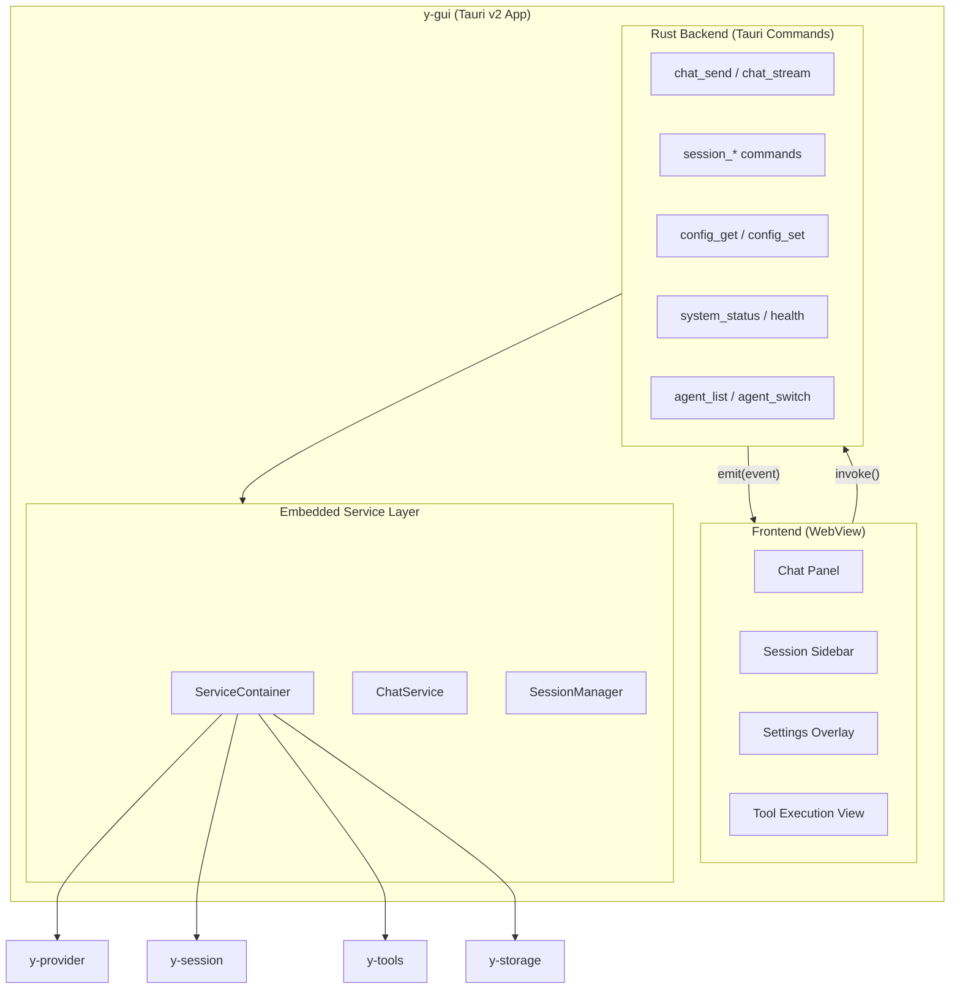
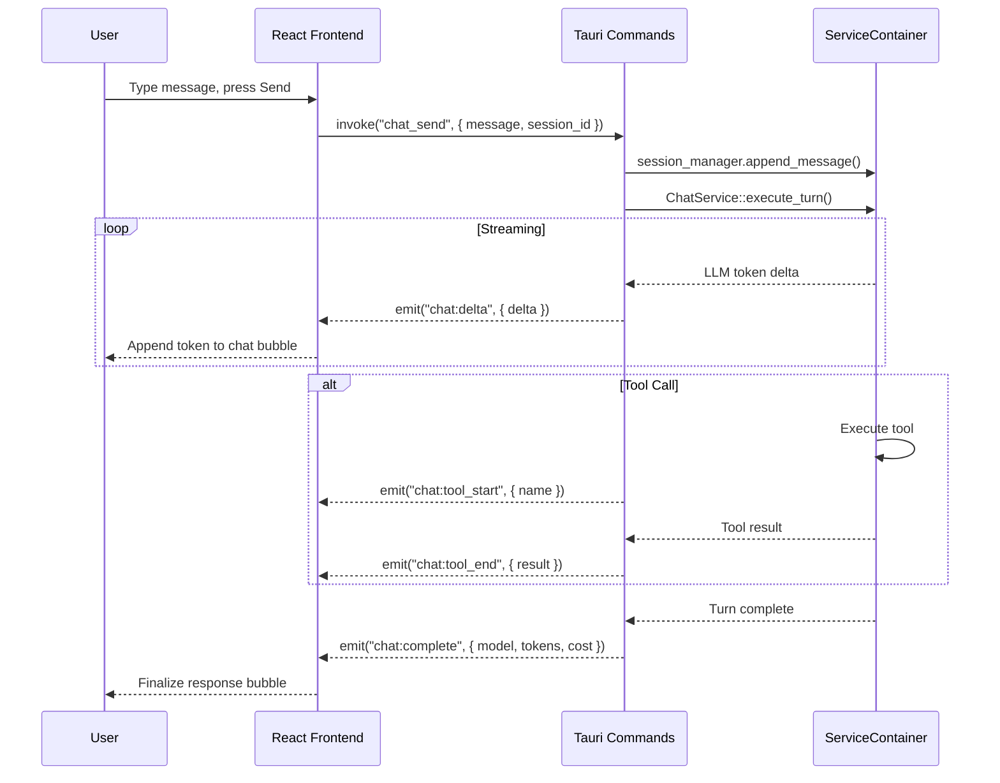
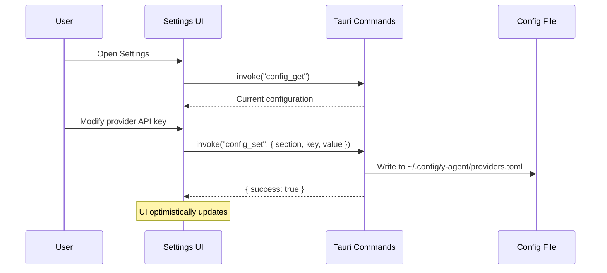

# Tauri GUI Design

> Desktop GUI client for y-agent using Tauri v2 (Rust backend + Web frontend)

**Version**: v0.1
**Created**: 2026-03-12
**Updated**: 2026-03-12
**Status**: Draft

---

## TL;DR

y-gui is a Tauri v2 desktop application that provides a modern, chat-centric AI Agent GUI. The Rust backend embeds `y-service::ServiceContainer` directly (in-process, zero-network-overhead), exposing Tauri commands as the bridge to a React + TypeScript frontend. The UI follows the standard AI Agent pattern: sidebar for session history, main chat panel with streaming responses, and a settings overlay for provider/agent/runtime configuration. SSE-style event streaming is achieved through Tauri's native event system (`app.emit` / `listen`).

---

## Background and Goals

### Background

y-agent currently offers three client interfaces: CLI (quick commands), TUI (ratatui terminal UI), and REST API (programmatic access via `y-web`). The `client-layer-design.md` Phase 4 already anticipates a GUI client. A desktop GUI provides the most intuitive experience for extended agent sessions, visual tool execution monitoring, and configuration management.

### Goals

| Goal | Measurable Criteria |
|------|-------------------|
| **First-class chat UX** | Streaming token display with < 50ms latency from event to render |
| **Settings management** | All `ServiceConfig` fields editable through GUI; changes persist to `~/.config/y-agent/` |
| **Session continuity** | Sessions started in CLI/TUI can be resumed in GUI and vice versa |
| **Cross-platform** | macOS, Linux, Windows (via Tauri v2) |
| **Small binary** | < 30MB installer (Tauri advantage over Electron) |
| **Zero network dependency** | In-process `ServiceContainer` — no need to run a separate API server |

### Assumptions

1. Tauri v2 is used (stable, Rust-native, smaller than Electron).
2. Frontend uses React + TypeScript + Vite for developer productivity and ecosystem.
3. Styling uses vanilla CSS with a premium dark theme (no TailwindCSS unless requested).
4. The GUI shares the same `~/.config/y-agent/` config files as CLI/TUI.
5. `y-service::ServiceContainer` is embedded directly — no HTTP roundtrip needed.

---

## Scope

### In Scope

- New Rust crate `y-gui` in `crates/y-gui/`
- Tauri v2 application shell with Rust command layer
- React + TypeScript frontend (chat, sessions, settings)
- In-process integration with `y-service::ServiceContainer`
- Streaming via Tauri event system (`app.emit`)
- Settings UI for provider, session, runtime, guardrails, tools configuration
- Session history sidebar with search
- Dark/light theme support

### Out of Scope

- Plugin marketplace / extension system
- Real-time multi-user collaboration
- Mobile support (future consideration with Tauri Mobile)
- Agent-to-agent visual orchestration graph

---

## High-Level Design

### Architecture



**Legend**:
- **Frontend**: React components rendered in Tauri's WebView (WKWebView on macOS, WebView2 on Windows, webkit2gtk on Linux).
- **Rust Backend**: Tauri command handlers. Each is a `#[tauri::command]` function that calls into `ServiceContainer`.
- **Service Layer**: The same `y-service` used by CLI/TUI/Web, instantiated in-process.

### Integration Model

| Aspect | CLI/TUI | Web API | **GUI (Tauri)** |
|--------|---------|---------|-----------------|
| Service access | Direct `ServiceContainer` | HTTP → axum → `ServiceContainer` | **Direct `ServiceContainer`** (Tauri managed state) |
| Streaming | Terminal stdout | SSE / WebSocket | **Tauri events** (`app.emit`) |
| Config | `ConfigLoader` → TOML files | `ServiceConfig` from API startup | **`ConfigLoader`** (shared with CLI) |
| Binary | `y-cli` binary | `y-web` started by `y-cli serve` | **`y-gui` standalone binary** |

### Tauri Command Layer

```rust
// Example: send message and start streaming
#[tauri::command]
async fn chat_send(
    state: tauri::State<'_, AppState>,
    message: String,
    session_id: Option<String>,
) -> Result<ChatStarted, String> {
    // 1. Resolve/create session
    // 2. Persist user message
    // 3. Spawn async task for LLM turn
    // 4. Stream events via app.emit("chat:delta", ...)
    // 5. Return run_id for tracking
}
```

### Event Streaming Model

The frontend subscribes to Tauri events for real-time updates:

| Event Name | Payload | Use Case |
|-----------|---------|----------|
| `chat:delta` | `{ run_id, delta, accumulated }` | Streaming token display |
| `chat:tool_start` | `{ run_id, tool_name, args }` | Show tool execution began |
| `chat:tool_end` | `{ run_id, tool_name, result, duration_ms }` | Show tool result |
| `chat:complete` | `{ run_id, model, tokens, cost }` | Turn complete |
| `chat:error` | `{ run_id, error, recoverable }` | Display error |
| `session:updated` | `{ session_id, title }` | Sidebar refresh |

---

## Data and State Model

### Frontend State (React)

```typescript
interface AppState {
  // Session
  sessions: SessionInfo[];
  activeSessionId: string | null;

  // Chat
  messages: Message[];
  isStreaming: boolean;
  streamBuffer: string;

  // Settings
  config: GuiConfig;
  settingsOpen: boolean;

  // System
  providers: ProviderInfo[];
  systemStatus: SystemStatus;
}

interface Message {
  id: string;
  role: 'user' | 'assistant' | 'system';
  content: string;
  toolCalls?: ToolCall[];
  timestamp: string;
  model?: string;
  tokens?: { input: number; output: number };
  cost?: number;
}

interface GuiConfig {
  // GUI-specific
  theme: 'dark' | 'light' | 'system';
  fontSize: number;
  sendOnEnter: boolean;

  // Service config (mirrors ServiceConfig sections)
  providers: ProviderPoolConfig;
  storage: StorageConfig;
  session: SessionConfig;
  runtime: RuntimeConfig;
  guardrails: GuardrailConfig;
  tools: ToolRegistryConfig;
}
```

### Rust Managed State

```rust
struct AppState {
    container: Arc<ServiceContainer>,
    config_path: PathBuf,           // ~/.config/y-agent/
    gui_config: RwLock<GuiConfig>,  // GUI-specific settings
}

#[derive(Serialize, Deserialize)]
struct GuiConfig {
    theme: String,       // "dark" | "light" | "system"
    font_size: u16,      // 12-24
    send_on_enter: bool, // Enter sends, Shift+Enter newline
    window_width: u32,
    window_height: u32,
}
```

---

## Key Flows/Interactions

### Chat Turn Flow



### Settings Flow



---

## UI Components

### Layout Structure

```
┌────────────────────────────────────────────────────────────────┐
│  ┌──────────┐  ┌──────────────────────────────────────────┐   │
│  │          │  │  Agent Name              ⚙️ Settings     │   │
│  │  Session │  ├──────────────────────────────────────────┤   │
│  │  History │  │                                          │   │
│  │          │  │          Chat Messages                   │   │
│  │ ┌──────┐ │  │                                          │   │
│  │ │ New  │ │  │  ┌────────────────────────────────────┐  │   │
│  │ │ Chat │ │  │  │ User: ...                          │  │   │
│  │ └──────┘ │  │  └────────────────────────────────────┘  │   │
│  │          │  │  ┌────────────────────────────────────┐  │   │
│  │ Session1 │  │  │ Assistant: ...                     │  │   │
│  │ Session2 │  │  │  ┌─ Tool Call ──────────────────┐  │  │   │
│  │ Session3 │  │  │  │ 🔧 FileRead (expanded)     │  │  │   │
│  │ ...      │  │  │  └─────────────────────────────┘  │  │   │
│  │          │  │  └────────────────────────────────────┘  │   │
│  │          │  │                                          │   │
│  │          │  ├──────────────────────────────────────────┤   │
│  │          │  │  [Message input area          ] [Send]   │   │
│  │          │  │  Model: claude-3.5 | Tokens: 1.2k | $0.02│  │
│  └──────────┘  └──────────────────────────────────────────┘   │
└────────────────────────────────────────────────────────────────┘
```

### Component Hierarchy

| Component | Responsibility |
|-----------|---------------|
| `App` | Root layout, state management, event listeners |
| `Sidebar` | Session list, search, "New Chat" button |
| `SessionItem` | Individual session entry with title and timestamp |
| `ChatPanel` | Message list, auto-scroll, streaming display |
| `MessageBubble` | Single message with role-specific styling |
| `ToolCallCard` | Expandable card showing tool name, args, result |
| `InputArea` | Multi-line message input, model selector, send button |
| `StatusBar` | Current model, token count, cost, provider status |
| `SettingsOverlay` | Modal overlay with tabbed settings sections |
| `ProviderSettings` | Provider list, add/edit/delete, API key management |
| `SessionSettings` | Context window, compaction, max turns |
| `RuntimeSettings` | Docker/native runtime configuration |
| `AppearanceSettings` | Theme, font size, send behavior |

---

## Settings Design

### Settings Sections

The settings overlay organizes configuration into logical tabs that mirror the existing `ServiceConfig` structure:

| Tab | Config Section | Key Fields |
|-----|---------------|------------|
| **General** | GUI-specific | Theme, font size, send-on-enter, language |
| **Providers** | `ProviderPoolConfig` | Provider list (type, model, API key, base URL, tags), proxy settings, default selection strategy |
| **Sessions** | `SessionConfig` | Max context tokens, compaction threshold, auto-title generation |
| **Tools** | `ToolRegistryConfig` | Max execution timeout, dynamic tool creation toggle |
| **Runtime** | `RuntimeConfig` | Docker/native preference, image whitelist, resource limits |
| **Safety** | `GuardrailConfig` | Loop detection, max iterations, permission model defaults |
| **Storage** | `StorageConfig` | Database path, transcript directory, PostgreSQL URL |
| **About** | — | Version, system status, diagnostic info |

### Settings Persistence

- Settings are read from and written to `~/.config/y-agent/*.toml` (same files as CLI/TUI).
- GUI-specific settings (theme, font size, window size) are stored separately in `~/.config/y-agent/gui.toml`.
- Changes to provider API keys are immediately persisted but require a service restart to take effect (with a "Restart Service" button in the UI).
- The GUI shows a visual diff of pending changes before apply.

### Settings Tauri Commands

```rust
#[tauri::command]
async fn config_get(state: State<'_, AppState>) -> Result<FullConfig, String>;

#[tauri::command]
async fn config_set_section(
    state: State<'_, AppState>,
    section: String,    // "providers" | "storage" | "session" | ...
    content: String,    // JSON representation
) -> Result<(), String>;

#[tauri::command]
async fn config_get_gui(state: State<'_, AppState>) -> Result<GuiConfig, String>;

#[tauri::command]
async fn config_set_gui(
    state: State<'_, AppState>,
    config: GuiConfig,
) -> Result<(), String>;

#[tauri::command]
async fn service_restart(state: State<'_, AppState>) -> Result<(), String>;
```

---

## Failure Handling and Edge Cases

| Scenario | Handling |
|----------|---------|
| No providers configured | Settings overlay opens automatically on first launch; chat disabled until at least one provider is configured |
| Provider API key invalid | Error toast with "Fix in Settings" link; provider marked with ⚠️ in status bar |
| Chat stream interrupted | Partial response preserved; "Retry" button on message bubble |
| Service initialization failure | Error screen with diagnostic details and "Open Settings" button |
| Config file parse error | Load defaults; show warning banner with "Reset to Defaults" option |
| Window close during streaming | Graceful abort of in-flight LLM request; session state saved |
| Large message history | Virtual scrolling (windowed rendering) in chat panel |

---

## Security and Permissions

| Concern | Approach |
|---------|---------|
| API key storage | Keys stored in `~/.config/y-agent/providers.toml`; masked in UI (show/hide toggle); never logged |
| IPC security | Tauri v2 capability-based permissions; only declared commands are exposed to WebView |
| File system access | Tauri v2 scoped file system access; GUI can only read/write config directory |
| WebView isolation | Tauri's strict CSP; no external script loading; no `eval()` |

---

## Performance and Scalability

| Metric | Target |
|--------|--------|
| App startup time | < 2s to interactive |
| Token streaming latency | < 50ms event-to-render |
| Installer size | < 30MB (macOS .dmg) |
| Memory usage (idle) | < 100MB RSS |
| Session list rendering | Smooth scrolling with 1000+ sessions (virtual list) |

---

## Observability

| Metric | Type | Description |
|--------|------|-------------|
| `gui.startup_ms` | Gauge | Time from launch to interactive |
| `gui.messages_sent` | Counter | User messages sent per session |
| `gui.stream_events` | Counter | Streaming events received |
| `gui.config_changes` | Counter | Settings modifications |

Frontend errors are captured via `window.__TAURI__.event.listen("error", ...)` and reported to the Rust backend for structured logging to the existing `y-agent` log file.

---

## Technology Stack

| Concern | Choice | Rationale |
|---------|--------|-----------|
| Desktop framework | Tauri v2 | Rust-native; ~10x smaller than Electron; WKWebView/WebView2; active ecosystem |
| Frontend framework | React 19 + TypeScript | Component model; rich ecosystem; type safety |
| Build tool | Vite | Fast HMR; zero-config for React+TS |
| Styling | Vanilla CSS (CSS Modules) | Maximum control; no dependency; matches project standard |
| State management | React Context + `useReducer` | Sufficient for this scale; no Redux overhead |
| Markdown rendering | `react-markdown` + `remark-gfm` | Code blocks, tables, GFM support for LLM responses |
| Code highlighting | `highlight.js` or `shiki` | Syntax highlighting in code blocks |

---

## Alternatives and Trade-offs

| Decision | Chosen | Alternative | Rationale |
|----------|--------|-------------|-----------|
| Desktop framework | Tauri v2 | Electron, Wails | Tauri: Rust-native, < 10MB binary, better security model. Electron: 100MB+ baseline. Wails: smaller ecosystem. |
| Backend integration | In-process `ServiceContainer` | HTTP to `y-web` | In-process eliminates network overhead and server management. Tauri's Rust backend makes this natural. |
| Frontend framework | React | Vue, Svelte, vanilla | React has largest ecosystem and AI chat component libraries. Team familiarity assumed. |
| State management | Context + useReducer | Redux, Zustand, Jotai | App complexity doesn't justify Redux. Context sufficient for single-window app. |
| Streaming mechanism | Tauri events | WebSocket to embedded server | Tauri events are native IPC, lower overhead, no port management needed. |

---

## Open Questions

| # | Question | Owner | Due Date | Status |
|---|----------|-------|----------|--------|
| 1 | Should the GUI support a "headless backend" mode where it connects to a remote `y-web` API instead of in-process? | — | Phase 2 | Open |
| 2 | Should provider API keys be stored in the OS keychain (macOS Keychain, Windows Credential Manager) instead of plaintext TOML? | — | Phase 1 | Open |
| 3 | Should the GUI bundle its own auto-updater (Tauri's built-in updater)? | — | Phase 2 | Open |
| 4 | Should the settings UI support importing/exporting configuration profiles? | — | Phase 2 | Open |
