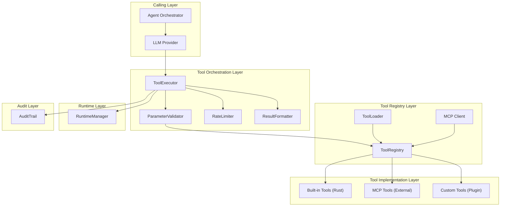
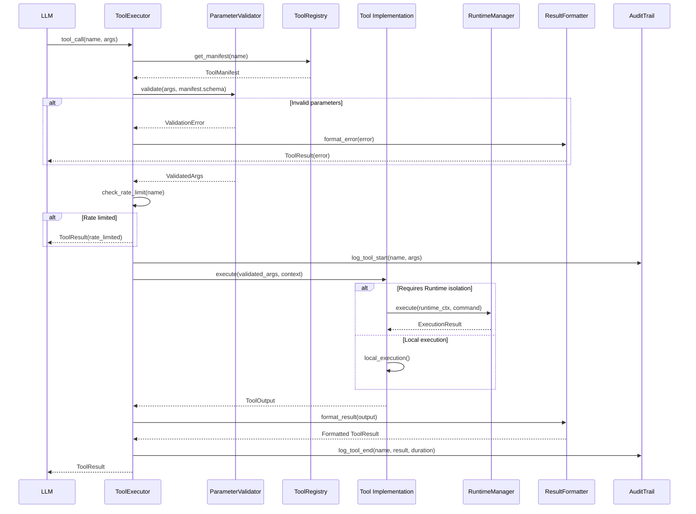
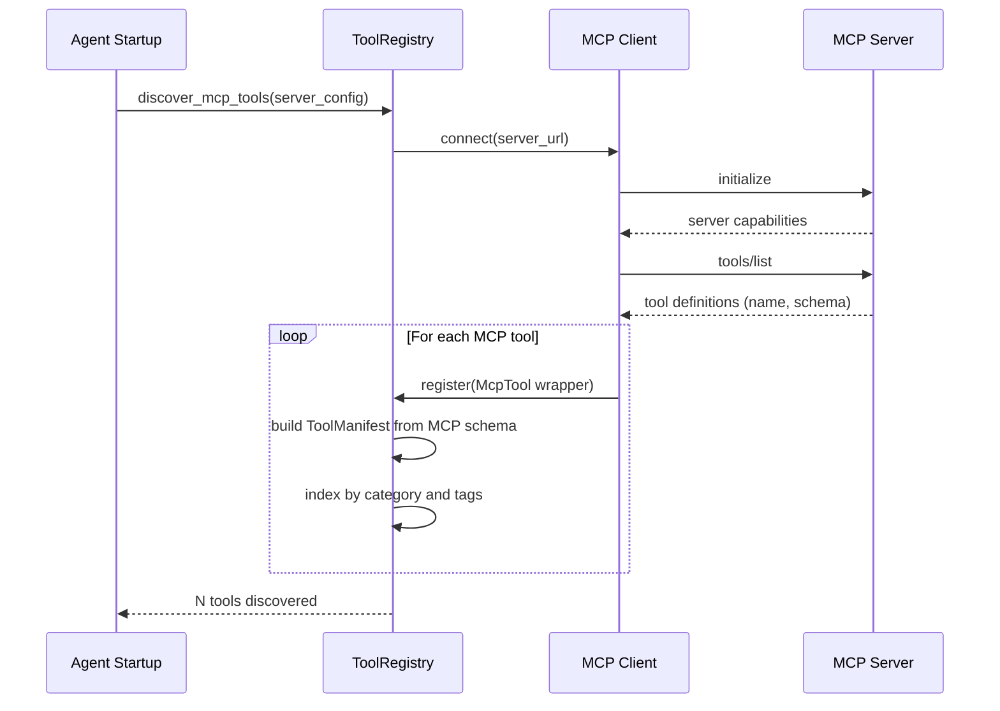
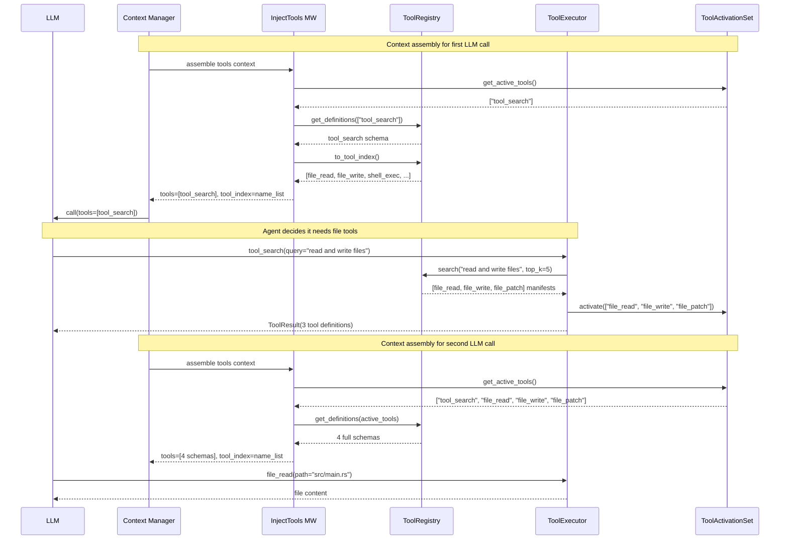
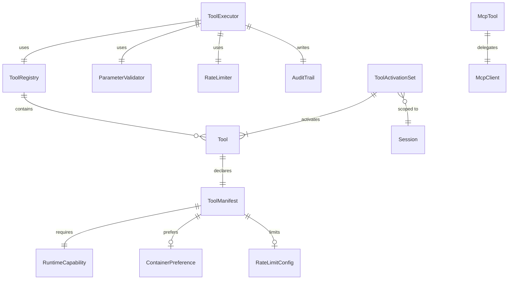

# Tool System Design

> Tool registration, validation, execution, and result handling for y-agent

**Version**: v0.7
**Created**: 2026-03-04
**Updated**: 2026-03-07
**Status**: Draft

---

## TL;DR

The Tool System is the bridge between y-agent's agents and the external world. Every tool declares its metadata, parameter schema, and required runtime capabilities through a **ToolManifest**. A unified **Tool trait** enables three tool types -- built-in (Rust), MCP (external process), and custom (plugin) -- to be registered, validated, executed, and audited through a single pipeline. The **ToolExecutor** orchestrates parameter validation (JSON Schema), rate limiting, execution routing (local or via Runtime isolation), result formatting, and audit logging. Tools declare what capabilities they need; the Runtime enforces those capabilities. This separation keeps tools focused on business logic while the Runtime handles security. To minimize context window consumption and attention dilution, the system uses **Tool Lazy Loading**: only a lightweight **ToolIndex** (tool names) and a **`tool_search`** meta-tool are injected into the initial prompt; full tool definitions are loaded on demand into a session-scoped **ToolActivationSet** when the agent explicitly requests them.

---

## Background and Goals

### Background

AI agents interact with the outside world through tools: reading files, executing shell commands, searching the web, calling APIs. Without a structured tool system, each agent would implement ad-hoc integrations, leading to inconsistent parameter handling, security gaps, and poor observability. The tool system must also integrate with external tool ecosystems (MCP protocol) and support user-defined extensions.

### Goals

| Goal | Measurable Criteria |
|------|-------------------|
| **Type safety** | All tool parameters validated against JSON Schema before execution; zero schema-bypass paths |
| **Permission clarity** | Every tool declares required Runtime capabilities via Manifest; no implicit permissions |
| **Extensibility** | Support 3 tool types (built-in, MCP, custom); new tool registerable in < 50 lines |
| **Secure execution** | Dangerous tools (shell, file_write) route through Runtime isolation; path traversal blocked |
| **Observability** | Every tool call logged with parameters, duration, resource usage, and result status |
| **Error handling** | Unified error types across all tool types; graceful degradation for transient failures |
| **Token efficiency** | Tool definitions consume < 500 tokens at session start (ToolIndex + tool_search only); full definitions loaded on demand |

### Assumptions

1. Tools execute within a single agent process; distributed tool execution is out of scope.
2. MCP tools are discovered dynamically from configured MCP servers at startup.
3. Parameter validation uses the `jsonschema` crate for JSON Schema Draft 7 compliance.
4. Tools that require isolation delegate execution to the Runtime module (see [runtime-design.md](runtime-design.md)).
5. Tool results are always JSON-serializable for consistent LLM consumption.

---

## Scope

### In Scope

- `Tool` trait and `ToolManifest` structure
- Three tool types: built-in (Rust), MCP, custom (plugin) (skill-bundled removed; see skills-knowledge-design.md v0.2)
- `ToolRegistry` for registration, lookup, and LLM schema export
- `ParameterValidator` for JSON Schema validation with compiled validator caching
- `ToolExecutor` orchestrating the execute pipeline
- `RateLimiter` for per-tool call frequency and concurrency limits
- `ResultFormatter` for consistent output formatting
- Built-in tools: file_read, file_write, shell_exec, web_search, memory_store/recall, compress_experience/read_experience
- MCP tool auto-discovery and wrapping
- Integration with Skill Ingestion Pipeline for extracted tool registration (see [skills-knowledge-design.md](skills-knowledge-design.md))
- Integration with Runtime for isolated execution
- Tool Lazy Loading: `ToolIndex` (name-only catalog), `tool_search` meta-tool (on-demand definition retrieval), `ToolActivationSet` (session-scoped activation tracking)
- Dynamic Tool Lifecycle: agent-driven tool creation via `tool_create` / `tool_update` meta-tools, DynamicToolDefinition format, sandbox-by-default validation pipeline (see [agent-autonomy-design.md](agent-autonomy-design.md))

- LLM tool call protocol: prompt-based tool calling format, XML-tag parsing, dual-mode (PromptBased/Native) support (see [TOOL_CALL_PROTOCOL.md](../standards/TOOL_CALL_PROTOCOL.md))
- Hierarchical tool taxonomy: tree-structured tool discovery via multi-level categories (see [tool-search-design.md](tool-search-design.md))

### Out of Scope

- Runtime isolation implementation (see [runtime-design.md](runtime-design.md))
- Runtime-Tools integration details (see [runtime-tools-integration-design.md](runtime-tools-integration-design.md))
- Custom tool plugin SDK (deferred)
- WASM tool runtime (deferred)

---

## High-Level Design

### Layered Architecture



**Diagram rationale**: Flowchart chosen to show the layered module boundaries and the flow from agent call through orchestration, registry, implementation, and runtime.

**Legend**:
- **Orchestration Layer**: Coordinates validation, rate limiting, execution, formatting, and auditing.
- **Registry Layer**: Manages tool registration and discovery (including MCP auto-discovery).
- **Implementation Layer**: Concrete tool implementations across four types.
- **Runtime Layer**: Provides isolated execution for dangerous operations.

### Tool Types

| Type | Description | Examples | Trust Level |
|------|-----------|---------|-------------|
| **Built-in** | Core tools shipped with y-agent, implemented in Rust | file_read, file_write, shell_exec, web_search | High (audited code) |
| **MCP** | External tools exposed via MCP protocol from configured servers | github_create_issue, notion_append | Medium (depends on MCP server) |
| **Custom** | User-defined tools via plugin interface (Rust/Python/WASM) | custom_data_processor | Low (requires review) |
| **Dynamic** | Agent-created tools at runtime via `tool_create` meta-tool; three implementation types (Script, HttpApi, Composite); always sandboxed in Runtime | flight_scrape, email_send, price_alert | Low (sandbox-by-default) |

**Dynamic Tools**: Dynamic tools are created by the agent at runtime through the Agent Autonomy system (see [agent-autonomy-design.md](agent-autonomy-design.md)). They follow the same `Tool` trait and `ToolManifest` contract as all other tools but with a critical security invariant: dynamic tools always execute inside a Runtime sandbox (Docker container), regardless of their `is_dangerous` flag. Dynamic tools go through a three-stage validation pipeline (schema check, safety screening, sandbox dry-run) before registration. They are persisted in a `DynamicToolStore` and survive agent restarts.

Note: The previous "Skill-bundled" tool type was removed. As of skills-knowledge-design.md v0.2, skills are LLM-instruction-only artifacts. Any tools embedded in external skills are extracted during the Ingestion Pipeline and registered as standalone Built-in or Custom tools in this registry (see [skills-knowledge-design.md](skills-knowledge-design.md) Decision D5).

### Tool Trait and Manifest

```rust
#[async_trait]
pub trait Tool: Send + Sync {
    fn name(&self) -> &str;
    fn manifest(&self) -> &ToolManifest;
    async fn execute(&self, args: ValidatedArgs, context: &ToolContext) -> Result<ToolOutput>;
    async fn health_check(&self) -> Result<()> { Ok(()) }
    fn estimate_cost(&self, args: &ValidatedArgs) -> Option<f64> { None }
}

pub struct ToolManifest {
    pub name: String,
    pub description: String,
    pub parameters: JsonSchema,
    pub returns: Option<JsonSchema>,
    pub required_capabilities: RuntimeCapability,
    pub container_preference: Option<ContainerPreference>,
    pub is_dangerous: bool,
    pub rate_limit: Option<RateLimitConfig>,
    pub estimated_duration: Option<u64>,
    pub category: ToolCategory,
    pub tags: Vec<String>,
}
```

The `ToolManifest` is the contract between a tool and the system. It declares:
- **What it does**: name, description, category, tags
- **What it accepts**: parameters (JSON Schema)
- **What it needs**: required_capabilities (network, filesystem, container, process)
- **How it should run**: container_preference, is_dangerous, rate_limit

### ToolExecutor Pipeline

The executor coordinates the end-to-end tool call lifecycle:

1. **Resolve**: Look up tool by name in `ToolRegistry`
2. **Validate**: Check parameters against the manifest's JSON Schema
3. **Rate-limit**: Check per-tool call frequency and concurrency limits
4. **Audit start**: Log tool invocation with parameters
5. **Execute**: Delegate to the tool implementation
6. **Format**: Normalize the output through `ResultFormatter`
7. **Audit end**: Log result, duration, and resource usage
8. **Return**: Send formatted `ToolResult` back to the LLM

### Tool Lazy Loading (ToolSearch)

Injecting all registered tool definitions (full JSON Schema) into every LLM call is a common but wasteful pattern. With 20-50+ tools, schema injection alone consumes 8,000-25,000 tokens -- most irrelevant to any given interaction. This dilutes model attention across unused definitions and caps the tool count the system can support before exhausting the context window.

Tool Lazy Loading addresses this with three mechanisms:

1. **ToolIndex**: A compact, name-only list of all registered tools, injected into every LLM call so the agent knows what exists.
2. **`tool_search` meta-tool**: The only tool whose full definition is always present. The agent calls it to retrieve and activate full definitions for the tools it needs.
3. **ToolActivationSet**: A session-scoped set tracking which tools have been activated. Activated tools' full definitions are included in subsequent LLM calls.

#### ToolIndex

Generated by `ToolRegistry.to_tool_index()`, the ToolIndex contains only tool names -- no descriptions, no parameter schemas. It is injected as a system message component by the `InjectTools` ContextMiddleware (see [context-session-design.md](context-session-design.md)).

Token cost: ~3-5 tokens per tool name. For 50 tools, the entire index is ~150-250 tokens, compared to 10,000-40,000 tokens for full definitions.

#### ToolActivationSet

Each session maintains a `ToolActivationSet`:

| Property | Behavior |
|----------|----------|
| **Initialization** | Contains only configured always-active tools (default: `tool_search`) |
| **Expansion** | Tools returned by `tool_search` are automatically added |
| **Scope** | Session-level; persists across LLM calls within the same session, discarded on session end |
| **Ceiling** | Configurable maximum (default: 20) to bound Tools Schema token usage |
| **Eviction** | When ceiling is reached, least-recently-used tools are deactivated; always-active tools are never evicted |

#### Always-Active Tools

A configurable set of tools that bypass lazy loading and are always injected with full definitions. Default: `["tool_search"]`. Agents that frequently use specific tools (e.g., `file_read`, `shell_exec`) can include them to eliminate the ToolSearch round-trip.

Configuration: `tools.always_active: ["tool_search"]`

#### Interaction with Micro-Agent Pipeline

Pipeline steps declare their required tools statically in the step definition's `tools` field (see [micro-agent-pipeline-design.md](micro-agent-pipeline-design.md)). For pipeline execution, declared tools are directly activated without requiring `tool_search` -- the pipeline executor pre-populates the step's ToolActivationSet from the step definition. Lazy loading via `tool_search` is designed for interactive agent sessions where tool needs are not known in advance.

---

## Key Flows/Interactions

### Tool Execution Flow



**Diagram rationale**: Sequence diagram chosen to show the temporal ordering of validation, execution, and audit steps in the tool pipeline.

**Legend**:
- Tools that require isolation (e.g., shell_exec) delegate to RuntimeManager.
- Tools that operate locally (e.g., file_read with path validation) execute in-process.
- The audit trail captures both start and end events for every tool call.

### MCP Tool Discovery Flow



**Diagram rationale**: Sequence diagram chosen to show the startup-time discovery and registration of MCP tools.

**Legend**:
- Each MCP tool is wrapped in a `McpTool` adapter that implements the `Tool` trait.
- Tool names are prefixed with `mcp_{server}_{tool}` to avoid naming conflicts.

### Tool Lazy Loading Flow



**Diagram rationale**: Sequence diagram chosen to show the two-phase interaction between context assembly, ToolSearch activation, and subsequent tool use across LLM calls.

**Legend**:
- **First LLM call**: Only `tool_search` is callable; the ToolIndex provides tool name awareness.
- **ToolSearch call**: Agent requests tools by keyword; matched tools are added to ToolActivationSet.
- **Second LLM call**: Activated tools appear in the `tools` parameter and become directly callable.

---

## Data and State Model

### Core Entities



**Diagram rationale**: ER diagram chosen to show structural relationships between tool system entities.

**Legend**:
- **ToolManifest** is the central declaration; it links to capabilities, container preferences, and rate limits.
- **ToolExecutor** orchestrates the pipeline using Registry, Validator, RateLimiter, and AuditTrail.
- **ToolActivationSet** is session-scoped; it tracks which tools have been activated via `tool_search` and are included in LLM calls.

### ToolOutput

| Field | Type | Description |
|-------|------|-------------|
| `success` | bool | Whether the tool call succeeded |
| `data` | serde_json::Value | Output data (JSON) |
| `error` | Option<ToolError> | Error details if failed |
| `metadata.duration` | Duration | Execution time |
| `metadata.resource_usage` | ResourceUsage | CPU, memory, disk, network |
| `metadata.cache_hit` | bool | Whether result came from cache |
| `metadata.warnings` | Vec<String> | Non-fatal warnings |

### Error Types

| Error Type | Description | Retryable |
|-----------|-------------|-----------|
| `ValidationError` | Parameter schema mismatch | No (fix parameters) |
| `PermissionDenied` | Capability or path access denied | No |
| `NotFound` | File, resource, or tool not found | No |
| `Timeout` | Execution exceeded time limit | Yes (with longer timeout) |
| `RateLimited` | Call frequency or concurrency exceeded | Yes (after delay) |
| `RuntimeError` | Container or process execution failure | Depends on cause |
| `ExternalServiceError` | MCP server or network tool failure | Yes |
| `Unknown` | Unclassified error | Depends |

### Built-in Tools Catalog

| Tool | Category | Requires Runtime | Dangerous | Description |
|------|----------|-----------------|-----------|-------------|
| `file_read` | FileSystem | No | No | Read file from workspace |
| `file_write` | FileSystem | No | Yes | Write/create file in workspace |
| `file_list` | FileSystem | No | No | List directory contents |
| `file_search` | FileSystem | No | No | Search files by pattern/content |
| `shell_exec` | Shell | Yes (Docker) | Yes | Execute shell command in container |
| `web_search` | Network | No | No | Search the web via configured engine |
| `web_fetch` | Network | No | No | Fetch URL content |
| `memory_store` | Memory | No | No | Store entry in long-term memory |
| `memory_recall` | Memory | No | No | Search long-term memory |
| `compress_experience` | ContextMemory | No | No | Archive working context to Experience Store under stable indices; rewrite context to indexed summary |
| `read_experience` | ContextMemory | No | No | Dereference an index from the Experience Store; inject archived content into working context |
| `tool_search` | Meta | No | No | Search and activate tool definitions by keyword or name; session-scoped activation |
| `tool_create` | Meta | No | Yes | Create and register a new dynamic tool at runtime; three implementation types (Script, HttpApi, Composite); sandbox validation required |
| `tool_update` | Meta | No | Yes | Update an existing dynamic tool's manifest or implementation; triggers re-validation |
| `agent_create` | Meta | No | Yes | Create and register a new dynamic agent definition at runtime; three-stage validation (schema, permissions, safety); see [agent-autonomy-design.md](agent-autonomy-design.md) |
| `agent_update` | Meta | No | Yes | Update an existing dynamic agent definition; triggers re-validation of permissions and safety |
| `agent_deactivate` | Meta | No | Yes | Soft-delete a dynamic agent definition; preserves history for reactivation |
| `agent_search` | Meta | No | No | Search agent definitions by name, role, capability, or tags; returns matching agent definitions |

### Context Memory Tools (Indexed Experience Memory)

The `compress_experience` and `read_experience` tools give the agent explicit control over context management, inspired by the Memex(RL) indexed experience memory mechanism (see [Memex(RL) research note](../research/memex-rl.md)). Unlike system-triggered compression (Compact/Compress), these tools allow the agent to decide what to archive, how to index it, and when to retrieve exact evidence.

| Tool | Parameters | Returns |
|------|-----------|---------|
| `compress_experience` | `indexed_summary` (string): structured progress state + index map; `memory_blocks` (array): list of `{index, content}` pairs to archive | Compression report: blocks archived, tokens before/after |
| `read_experience` | `index` (string): exact key to dereference from the Experience Store | Archived content string; injected into working context as a new message |

These tools operate on the Session-scoped Experience Store managed by the Short-Term Memory Engine (see [memory-short-term-design.md](memory-short-term-design.md)). They do not require Runtime isolation because they manipulate only in-process memory structures.

Key design properties:

- **No LLM cost**: The agent writes the indexed summary directly; no additional LLM call is needed for compression.
- **Deterministic recovery**: `read_experience` returns the exact archived content, not an approximate match.
- **Agent autonomy**: The agent decides the compression timing (ideally at natural task boundaries), the index granularity, and the summary quality.
- **Coexistence with system compression**: IndexedExperience runs alongside Auto/Compact/Compress. If the agent does not use these tools, system compression operates as before.

### tool_search Meta-Tool

The `tool_search` tool is the built-in meta-tool that bridges the compact ToolIndex and full tool definitions. It supports two retrieval modes:

| Mode | Trigger | Matching Strategy |
|------|---------|-------------------|
| **Name-based** | `names` parameter provided | Exact lookup in ToolRegistry; returns definitions for all valid names; warns for unknown names |
| **Keyword** | `query` parameter provided (no `names`) | Score-ranked match against ToolManifest fields (name, description, tags, category); returns top_k results |
| **Combined** | Both `query` and `names` provided | Name-based results unioned with keyword results; names take priority, keyword fills remaining top_k slots |

| Parameter | Type | Required | Description |
|-----------|------|----------|-------------|
| `query` | String | No (at least one of query/names) | Natural language search against tool metadata |
| `names` | Vec of String | No (at least one of query/names) | Exact tool names to activate |
| `top_k` | u32 | No (default: 5) | Maximum results for keyword mode |

Returns: Vec of matching tool definitions (name, description, parameters schema). All matched tools are automatically added to the session's ToolActivationSet as a side effect.

### ToolRegistry

The registry provides multiple lookup strategies:

| Operation | Description |
|----------|-------------|
| `register(tool)` | Register a tool; reject on name conflict |
| `get(name)` | Lookup by exact name |
| `find_by_category(cat)` | List tools by category |
| `find_by_tag(tag)` | List tools by tag |
| `to_llm_tools()` | Export all tool definitions in LLM function-calling format (used when lazy loading is disabled) |
| `to_tool_index()` | Export name-only index of all registered tools for lightweight context injection |
| `search(query, top_k)` | Score-ranked search against manifest metadata (name, description, tags, category) |
| `get_definitions(names)` | Return full ToolManifest definitions for a list of tool names |
| `discover_mcp_tools(server)` | Auto-discover and register MCP tools |
| `register_extracted_tool(manifest)` | Register a tool extracted from an external skill by the Ingestion Pipeline |
| `register_dynamic_tool(definition)` | Register a dynamic tool created by the agent at runtime; triggers validation pipeline (schema, safety, sandbox) before registration; persists to DynamicToolStore |
| `update_dynamic_tool(name, patch)` | Update an existing dynamic tool's manifest or implementation; re-validates before applying |
| `list_dynamic_tools(filter)` | List all dynamic tools with optional filter by name, creator, or implementation type |

---

## Failure Handling and Edge Cases

| Scenario | Handling |
|----------|---------|
| Unknown tool name | Return `NotFound` error with list of available tools |
| Invalid parameters | Return `ValidationError` with specific schema violation details |
| Rate limit exceeded | Return `RateLimited` with retry-after hint |
| Tool execution timeout | Kill process/container; return `Timeout` with partial output if available |
| Path traversal attempt | Block via `canonicalize()` + `starts_with()` check; return `PermissionDenied` |
| MCP server unreachable | Mark MCP tools as unavailable; retry connection with exponential backoff |
| MCP tool call fails | Return `ExternalServiceError` with server name and error details |
| Container image not found | Try fallback images from `ContainerPreference`; fail if all unavailable |
| File encoding error | Return `RuntimeError` with encoding details; suggest alternative encoding |
| Concurrent modification | File write uses atomic rename pattern; workspace-level write lock for dangerous ops |
| tool_search with unknown names | Return partial results for valid names; include warnings listing unrecognized names |
| Tool call for non-activated tool | Return `NotActivated` error with hint: "Tool not active. Use tool_search to activate it first." |
| ToolActivationSet ceiling reached | Evict least-recently-used tools to make room; warn agent about eviction in ToolResult metadata |

---

## Security and Permissions

### Capability-Based Security Model

Every tool declares its required capabilities in the Manifest:

| Capability | Options | Example |
|-----------|---------|---------|
| **Network** | None, Internal (CIDRs), External (domains), Full | shell_exec: None; web_search: External(google.com) |
| **Filesystem** | allowed_paths (glob), mode (R/RW/W), host_access | file_read: ReadOnly, workspace only |
| **Container** | allowed_images, allow_pull, allow_privileged, resource_limits | shell_exec: ubuntu:22.04, no-privileged |
| **Process** | allow_shell, allowed_commands, allow_background | shell_exec: allow sh/bash, no background |

### Path Safety

- All file paths resolved via `canonicalize()` and validated with `starts_with(workspace_root)`.
- Symlinks are followed and validated against the workspace boundary.
- `..` traversal that escapes the workspace is rejected with a security event logged.

### Dangerous Tool Handling

Tools marked `is_dangerous: true` (file_write, shell_exec, git_push) are subject to the **Unified Permission Model** defined in [guardrails-hitl-design.md](guardrails-hitl-design.md). The `is_dangerous` flag in the ToolManifest feeds into the guardrails Permission Model's risk scoring, which makes the final allow/notify/ask/deny decision per tool call. This tool-level flag is an input signal, not a standalone approval system.

See [guardrails-hitl-design.md](guardrails-hitl-design.md) for the four permission levels (allow, notify, ask, deny), risk scoring factors, and escalation policies.

### MCP Tool Trust

- MCP tools inherit a default capability set that is more restrictive than built-in tools.
- The MCP server connection is configured with explicit tool name patterns for access control.
- MCP tool arguments are validated against the schema provided by the MCP server.

---

## Performance and Scalability

### Performance Targets

| Metric | Target |
|--------|--------|
| Parameter validation | < 1ms (compiled validator cache) |
| Rate limit check | < 0.1ms |
| Tool registry lookup | < 0.1ms (HashMap) |
| File read (1MB file) | < 10ms |
| Shell exec (container startup + simple command) | < 3s |
| MCP tool call (network round-trip) | < 2s (excluding tool execution) |
| LLM schema export | < 5ms for 50 tools |
| ToolIndex generation (50 tools) | < 1ms |
| tool_search keyword match (50 tools) | < 5ms |
| ToolActivationSet lookup | < 0.1ms |

### Token Usage: Eager vs Lazy Loading

| Dimension | Eager (all definitions) | Lazy (ToolSearch) |
|-----------|------------------------|-------------------|
| **Initial injection (50 tools)** | ~15,000-25,000 tokens | ~300-500 tokens (tool_search + ToolIndex) |
| **After activating 5 tools** | Same | ~2,000-4,500 tokens |
| **Attention relevance** | < 20% (most schemas unused) | > 80% (only activated tools) |
| **Scalability** | Degrades linearly with tool count | Near-constant initial cost |

### Optimization Strategies

- **Validator caching**: JSON Schema validators are compiled once per tool and reused across calls.
- **Result caching**: Idempotent tools (web_search, file_read) support optional LRU result caching with configurable TTL.
- **Container reuse**: Frequently-used container images keep warm containers in a pool (see runtime-design).
- **Lazy MCP discovery**: MCP tools are discovered at first use, not blocking agent startup.
- **Tool Lazy Loading**: Only `tool_search` schema + ToolIndex injected at session start; full definitions loaded incrementally via ToolActivationSet. Reduces initial tool token cost by 60-90%.

---

## Observability

### Metrics

| Metric | Type | Description |
|--------|------|-------------|
| `tool.calls_total` | Counter | Tool calls by tool name and result (success/error) |
| `tool.duration_ms` | Histogram | Execution duration by tool name |
| `tool.rate_limited` | Counter | Rate limit rejections by tool name |
| `tool.validation_errors` | Counter | Parameter validation failures by tool name |
| `tool.cache_hits` | Counter | Result cache hits (when caching enabled) |
| `tool.mcp_calls` | Counter | MCP tool calls by server and tool name |
| `tool.resource_usage` | Histogram | CPU, memory usage per tool execution |
| `tool.search_calls` | Counter | tool_search invocations by mode (name/keyword/combined) |
| `tool.activations` | Counter | Tool activations via tool_search by tool name |
| `tool.active_set_size` | Gauge | Current ToolActivationSet size per session |
| `tool.index_tokens` | Gauge | Token count of the ToolIndex |

### Audit Trail

Every tool call generates an audit record containing:
- Timestamp, request_id, session_id, agent_id
- Tool name, category, parameters (with sensitive values redacted)
- Execution result: success/failure, exit_code, duration
- Resource usage: CPU time, memory peak, disk I/O, network I/O
- Security events: capability denials, path traversal attempts

---

## Rollout and Rollback

### Phased Implementation

| Phase | Scope | Duration |
|-------|-------|----------|
| **Phase 1** | Tool trait, ToolManifest, ToolRegistry, ParameterValidator, 5 core built-in tools (file_read, file_write, file_list, shell_exec, web_search), basic ToolExecutor pipeline | 2-3 weeks |
| **Phase 2** | RateLimiter, dangerous tool approval, MCP auto-discovery, McpTool wrapper, memory tools, result caching | 2-3 weeks |
| **Phase 3** | Skill Ingestion Pipeline integration (extracted tool auto-registration), custom tool plugin interface, audit trail, observability metrics | 2-3 weeks |
| **Phase 4** | WASM tool runtime, Python tool wrapper, performance optimization | 2-3 weeks |

### Rollback Plan

| Component | Rollback |
|-----------|----------|
| Individual tool | Deregister from ToolRegistry; no impact on other tools |
| MCP integration | Feature flag `mcp_tools`; disable to remove all MCP tools |
| Rate limiter | Feature flag `tool_rate_limiting`; disable to allow unlimited calls |
| Result cache | Feature flag `tool_cache`; disable to always execute fresh |
| Skill-extracted tools | Deregister individually; does not affect the source skill (skills are LLM-instruction-only) |
| Tool lazy loading | Feature flag `tool_lazy_loading`; disable to inject all tool definitions eagerly (original behavior via `to_llm_tools()`) |

---

## Alternatives and Trade-offs

### Parameter Validation: JSON Schema vs Custom DSL

| | JSON Schema (chosen) | Custom Rust DSL | No validation |
|-|---------------------|----------------|---------------|
| **Ecosystem** | Standard; MCP uses it | Rust-only | N/A |
| **LLM compatibility** | Direct export as function schema | Needs conversion | N/A |
| **Expressiveness** | Very high (conditionals, patterns) | Medium | N/A |
| **Runtime cost** | ~1ms compile; ~0.1ms validate | Near-zero | Zero |

**Decision**: JSON Schema. It is the standard for LLM function calling and MCP tool definitions; using the same schema format eliminates conversion.

### Tool Execution: Direct Call vs Message Passing

| | Direct async call (chosen) | Message queue |
|-|---------------------------|---------------|
| **Latency** | Minimal (in-process) | Queue overhead |
| **Complexity** | Simple trait dispatch | Serialization, routing |
| **Error handling** | Native Rust Result | Needs error envelope |
| **Concurrency** | Tokio tasks | Queue workers |

**Decision**: Direct async call via the `Tool` trait. Message passing adds unnecessary latency and complexity for single-process execution.

### MCP Integration: Auto-discover vs Manual Registration

| | Auto-discover (chosen) | Manual config |
|-|----------------------|---------------|
| **Setup effort** | Zero (from MCP server) | Per-tool config |
| **Schema accuracy** | Always current | May drift |
| **Control** | Less (all tools exposed) | Fine-grained |

**Decision**: Auto-discover with optional allowlist filter. MCP servers already provide full tool metadata; duplicating it in config is wasteful.

### Tool Provisioning: Eager Loading vs Lazy Loading (ToolSearch)

| | Eager (all definitions) | Lazy via ToolSearch (chosen) |
|-|------------------------|------------------------------|
| **Initial token cost** | 8,000-25,000 tokens (all tools) | ~300-500 tokens (tool_search + ToolIndex) |
| **Agent usability** | All tools immediately callable | Extra round-trip for first use of each tool |
| **Attention dilution** | High (many irrelevant schemas in context) | Low (only activated tools present) |
| **Scalability** | Degrades linearly with tool count | Near-constant initial cost; incremental growth |
| **Complexity** | Simple (inject everything) | Moderate (ToolActivationSet state management) |

**Decision**: Lazy Loading via ToolSearch. Token savings of 60-90% and reduced attention dilution outweigh the one-time ToolSearch round-trip. Feature flag `tool_lazy_loading` enables fallback to eager mode.

---

## Open Questions

| # | Question | Owner | Due Date | Status |
|---|----------|-------|----------|--------|
| 1 | Should custom tools support hot-reload without agent restart? | Tools team | 2026-03-20 | Open |
| 2 | Should tool result caching be transparent to the LLM or explicitly indicated? | Tools team | 2026-03-27 | Open |
| 3 | What is the maximum parameter size for a single tool call (e.g., large file content in args)? | Tools team | 2026-03-20 | Open |
| 4 | Should MCP tool discovery support filtering by capability requirements? | Tools team | 2026-04-03 | Open |
| 5 | Should tools support streaming output (progressive results) for long-running operations? | Tools team | 2026-04-03 | Open |
| 6 | Should tool_search support semantic (embedding-based) search in addition to keyword matching against manifest metadata? | Tools team | 2026-04-10 | Open |
| 7 | Should ToolActivationSet inherit across session branches (child session inherits parent's activated tools)? | Tools team | 2026-04-10 | Open |

