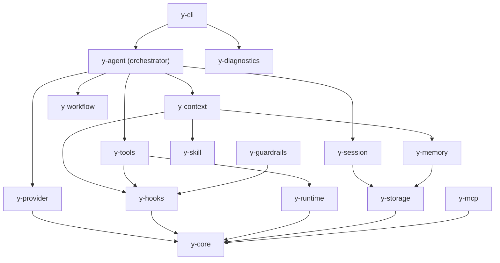

# Architecture Overview

This document provides a contributor-level overview of y-agent's architecture.

## Design Principles

1. **Trait-driven contracts** — All inter-crate communication via `y-core` traits
2. **Middleware-first** — Cross-cutting concerns (guardrails, logging, caching) as middleware
3. **Lazy loading** — Tools and skills loaded on demand to minimize context window usage
4. **Checkpoint everything** — DAG execution state persisted at every step for crash recovery

## Crate Dependency Graph



## Data Flow

### Chat Request Lifecycle

```
User Input
  → CLI (parse, validate)
  → Session (load/create)
  → Context Assembly (7-stage middleware)
    1. BuildSystemPrompt
    2. InjectBootstrap
    3. InjectMemory
    4. InjectKnowledge
    5. InjectSkills
    6. InjectTools
    7. InjectContextStatus
  → LLM Provider (chat completion)
  → Tool Dispatch (if tool calls present)
    → JSON Schema validation
    → Guardrail check
    → Runtime execution
    → Result injection
  → Loop back to LLM (if needed)
  → Response to user
  → Transcript save
  → Memory extraction (async)
```

### Checkpoint Flow

```
DAG Step N
  → write_pending(state)
  → execute step
  → commit(state)
  → next step

On crash:
  → read_committed() → last committed state
  → resume from step N+1
```

## Key Traits

| Trait | Crate | Purpose |
|-------|-------|---------|
| `LlmProvider` | y-core | LLM API abstraction |
| `RuntimeAdapter` | y-core | Sandboxed execution |
| `Tool` | y-core | Tool execution |
| `ToolRegistry` | y-core | Tool discovery/lookup |
| `Middleware` | y-core | Chain-based data transformation |
| `CheckpointStorage` | y-core | Workflow state persistence |
| `SessionStore` | y-core | Session metadata CRUD |
| `TranscriptStore` | y-core | Message history |
| `HookHandler` | y-core | Lifecycle observers |

## Storage Architecture

| Backend | Purpose | Data |
|---------|---------|------|
| **SQLite** | Operational state | Sessions, checkpoints, config |
| **PostgreSQL** | Diagnostics | Traces, costs, observations |
| **Qdrant** | Semantic search | Memory embeddings |

## Testing Architecture

- **Unit tests** — Per-crate, 450+ across workspace
- **Integration tests** — E2E flows in `crates/y-cli/tests/`
- **Mocks** — `y-test-utils` provides `MockProvider`, `MockRuntime`, `MockCheckpointStorage`, `MockSessionStore`, `MockTranscriptStore`
- **Benchmarks** — Criterion-based in `benches/` directories

## Adding a New Feature

1. Define trait(s) in `y-core`
2. Implement in the appropriate crate
3. Wire through middleware (if cross-cutting)
4. Add tests using `y-test-utils` mocks
5. Add E2E test in `crates/y-cli/tests/`
6. Update documentation
