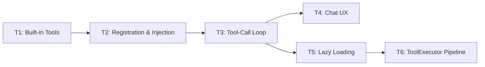

# Chat & Tool Call Development Plan

> Gap analysis and phased development plan bridging current implementation to design specifications
>
> **Created**: 2026-03-10
> **Based on**: Full code audit of `y-cli`, `y-tools`, `y-prompt`, `y-core`, `y-context` vs design docs

---

## Current State Summary

### Issue 1: `y-agent chat` Does Not Enter TUI

**Root Cause**: `chat` and `tui` are **separate subcommands**, not a single command.

| Command        | Implementation                                                                            | UI Type                                 |
| -------------- | ----------------------------------------------------------------------------------------- | --------------------------------------- |
| `y-agent chat` | [chat.rs](file:///Users/gorgias/Projects/y-agent/crates/y-cli/src/commands/chat.rs)       | Stdin/stdout command loop (`> ` prompt) |
| `y-agent tui`  | [tui_cmd.rs](file:///Users/gorgias/Projects/y-agent/crates/y-cli/src/commands/tui_cmd.rs) | ratatui-based TUI (feature-gated `tui`) |

The `tui` feature is enabled by default in [Cargo.toml](file:///Users/gorgias/Projects/y-agent/crates/y-cli/Cargo.toml#L46), so `y-agent tui` should work. However, both `chat` and `tui` share the same fundamental limitations described below.

### Issue 2: Tool Calls Not Working

There are **5 layered gaps** preventing tool calls from functioning:

| #   | Gap                                   | Location                                                                                                                                                             | Impact                                                                           |
| --- | ------------------------------------- | -------------------------------------------------------------------------------------------------------------------------------------------------------------------- | -------------------------------------------------------------------------------- |
| 1   | **No built-in tools implemented**     | `y-tools/src/builtin/` — only `ToolSearch` stub exists                                                                                                              | No `FileRead`, `FileWrite`, `ShellExec`, `FileList`, `FileSearch`, etc.     |
| 2   | **No tools registered during wiring** | [wire.rs:225](file:///Users/gorgias/Projects/y-agent/crates/y-cli/src/wire.rs#L225) — `ToolRegistryImpl::new()` creates empty registry                               | LLM has zero tools available                                                     |
| 3   | **Empty tools in ChatRequest**        | [chat.rs:228](file:///Users/gorgias/Projects/y-agent/crates/y-cli/src/commands/chat.rs#L228) — `tools: vec![]`                                                       | LLM provider receives no tool definitions                                        |
| 4   | **No tool-call execution loop**       | chat.rs:241-303 — response handling only extracts `content`, ignores `finish_reason: ToolUse`                                                                        | Even if LLM returned tool_calls, they'd never execute                            |
| 5   | **No InjectTools context middleware** | [wire.rs:232-239](file:///Users/gorgias/Projects/y-agent/crates/y-cli/src/wire.rs#L232-L239) — only `BuildSystemPromptProvider` and `InjectContextStatus` registered | Design requires `InjectTools` middleware to inject tool definitions into context |

The TUI's [chat_flow.rs](file:///Users/gorgias/Projects/y-agent/crates/y-cli/src/tui/chat_flow.rs) has identical gaps (line 111: `tools: vec![]`, no tool-call loop).

---

## Design Document Expectations

From [tools-design.md](file:///Users/gorgias/Projects/y-agent/docs/design/tools-design.md):

- **Phase 1** requires: Tool trait, ToolManifest, ToolRegistry, ParameterValidator, 5 core built-in tools (`FileRead`, `FileWrite`, `FileList`, `ShellExec`, `web_search`), basic ToolExecutor pipeline
- **Tool Lazy Loading**: `ToolIndex` injected via `InjectTools` middleware; `ToolSearch` always active; full definitions loaded on demand
- **Tool-call loop**: LLM returns `tool_calls` → ToolExecutor validates/executes → results returned as `Role::Tool` messages → loop until LLM returns content

From [orchestrator-design.md](file:///Users/gorgias/Projects/y-agent/docs/design/orchestrator-design.md):

- Agent orchestrator manages the LLM ↔ tool call loop
- Currently no orchestrator is wired into `chat` or `tui`

From [client-commands-design.md](file:///Users/gorgias/Projects/y-agent/docs/design/client-commands-design.md):

- `/tool` command for tool management within chat
- File/context references (`@path`, `#context`)

---

## Phased Development Plan

### Phase T1: Core Built-in Tools (Priority: P0)

> Implement the 5 core tools that make the agent useful

#### [NEW] `crates/y-tools/src/builtin/file_read.rs`

- Implement `FileReadTool` with `Tool` trait
- Parameters: `path` (string, required)
- Read file content with path validation (workspace boundary check via `canonicalize()` + `starts_with()`)
- Return content as string, with line numbers option
- Category: `FileSystem`, `is_dangerous: false`

#### [NEW] `crates/y-tools/src/builtin/file_write.rs`

- Implement `FileWriteTool` with `Tool` trait
- Parameters: `path` (string), `content` (string)
- Create parent directories as needed
- Category: `FileSystem`, `is_dangerous: true`

#### [NEW] `crates/y-tools/src/builtin/file_list.rs`

- Implement `FileListTool` with `Tool` trait
- Parameters: `path` (string, default `"."`), `recursive` (bool, optional)
- List directory contents with file types and sizes
- Category: `FileSystem`, `is_dangerous: false`

#### [NEW] `crates/y-tools/src/builtin/shell_exec.rs`

- Implement `ShellExecTool` with `Tool` trait
- Parameters: `command` (string), `working_dir` (string, optional), `timeout_secs` (u64, optional, default 30)
- Execute via `tokio::process::Command`
- Capture stdout + stderr, enforce timeout
- Category: `Shell`, `is_dangerous: true`, requires `RuntimeCapability::Process`
- Initial implementation: direct execution (Runtime isolation deferred)

#### [NEW] `crates/y-tools/src/builtin/file_search.rs`

- Implement `FileSearchTool` with `Tool` trait
- Parameters: `pattern` (string), `path` (string, optional), `regex` (bool, optional)
- Search file contents using pattern matching
- Category: `FileSystem`, `is_dangerous: false`

#### [MODIFY] `crates/y-tools/src/builtin/mod.rs`

- Export all new tool modules
- Add `register_builtin_tools(registry: &ToolRegistryImpl)` function

---

### Phase T2: Tool Registration & Injection (Priority: P0)

> Wire tools into the system so the LLM knows about them

#### [MODIFY] `crates/y-cli/src/wire.rs`

- After creating `ToolRegistryImpl`, call `register_builtin_tools(&tool_registry)` to register all Phase T1 tools
- Register `ToolSearchTool` as always-active

#### [NEW] `crates/y-context/src/inject_tools.rs`

- Implement `InjectToolsProvider` (implements `ContextProvider`)
- At assembly time: query `ToolRegistry.tool_index()` → format as `ToolIndex` section
- Get active tool definitions from `ToolActivationSet` (or initially: all registered tools)
- Convert `ToolDefinition` → OpenAI function-calling JSON format for `ChatRequest.tools`

#### [MODIFY] `crates/y-cli/src/wire.rs`

- Register `InjectToolsProvider` in the `ContextPipeline`

#### [MODIFY] `crates/y-cli/src/commands/chat.rs`

- Build `ChatRequest.tools` from context pipeline's tool definitions instead of `vec![]`
- Convert `ToolDefinition` → `serde_json::Value` in OpenAI function schema format

---

### Phase T3: Tool-Call Execution Loop (Priority: P0)

> Enable the LLM ↔ tool call cycle

#### [MODIFY] `crates/y-cli/src/commands/chat.rs`

- After receiving `ChatResponse`, check `response.finish_reason == FinishReason::ToolUse`
- If tool_calls present:
  1. For each `ToolCallRequest` in `response.tool_calls`:
     - Lookup tool in `ToolRegistryImpl`
     - Build `ToolInput` from call arguments
     - Execute tool via `tool.execute(input)`
     - Build `Role::Tool` message with `tool_call_id` and result content
  2. Append all tool result messages to history
  3. Re-send to LLM with updated history (loop until `FinishReason::Stop`)
- Add configurable max tool-call iterations (default: 10) to prevent infinite loops
- Display tool call activity to user (tool name, brief result)

#### [MODIFY] `crates/y-cli/src/tui/chat_flow.rs`

- Same tool-call loop for TUI path
- Emit `ChatEvent::ToolCall { name, result }` events for TUI rendering

---

### Phase T4: Chat UX Improvements (Priority: P1)

> Make the chat experience match the design document

#### [MODIFY] `crates/y-cli/src/commands/chat.rs`

- Display tool call status inline (e.g., `[tool: FileRead("src/main.rs")] → 42 lines`)
- Add `/tools` command to list available tools
- Add `/mode` command to switch agent mode (general/plan/explore/build)

#### [MODIFY] `crates/y-cli/src/commands/mod.rs`

- Consider whether `y-agent chat` should default to TUI when terminal supports it (design intent appears to be TUI as primary interface)
- Add `--no-tui` flag to force stdin loop mode

---

### Phase T5: ToolActivationSet & Lazy Loading (Priority: P1)

> Implement the full lazy loading system per design

#### [NEW] `crates/y-tools/src/activation.rs` (already exists as stub)

- Complete `ToolActivationSet` implementation
- Session-scoped with LRU eviction at configurable ceiling (default: 20)
- Always-active tools list (default: `["ToolSearch"]`)

#### [MODIFY] `crates/y-context/src/inject_tools.rs`

- Switch from injecting all tools to injecting only `ToolIndex` + active tools
- `ToolSearch` always included in the `tools` array

#### [MODIFY] `crates/y-tools/src/builtin/tool_search.rs`

- Connect to actual `ToolRegistry.search()` instead of returning placeholder
- Add matched tools to `ToolActivationSet` as side effect

---

### Phase T6: ToolExecutor Pipeline (Priority: P2)

> Full orchestration layer per design

#### [MODIFY] `crates/y-tools/src/executor.rs`

- Integrate `ParameterValidator` for JSON Schema validation before execution
- Integrate `RateLimiter` checks
- Add audit trail events (tool start/end)
- Integrate with `RuntimeManager` for dangerous tools

---

## Dependency Graph



**T1 → T2 → T3 is the critical path.** After T3, the chat will be functional with tool calls.

---

## Effort Estimates

| Phase     | Scope                  | Estimated Effort |
| --------- | ---------------------- | ---------------- |
| T1        | 5 built-in tools       | 2-3 days         |
| T2        | Wiring + injection     | 1 day            |
| T3        | Tool-call loop         | 1-2 days         |
| T4        | Chat UX polish         | 1 day            |
| T5        | Lazy loading           | 1-2 days         |
| T6        | Full executor pipeline | 2-3 days         |
| **Total** |                        | **8-12 days**    |

---

## Verification Plan

### Automated Tests

Each phase includes unit tests following TDD workflow:

- **T1**: Each tool gets `test_{tool}_execute_success`, `test_{tool}_missing_params`, `test_{tool}_path_traversal_blocked` (for filesystem tools)
  - Run: `cargo test -p y-tools`
- **T2**: `test_wire_registers_builtin_tools` — verify tool count after wiring
  - Run: `cargo test -p y-cli`
- **T3**: Integration test with mock LLM provider that returns tool_calls
  - Run: `cargo test -p y-cli`
- **T5**: `test_activation_set_lru_eviction`, `test_tool_search_activates_tools`
  - Run: `cargo test -p y-tools`

### Manual Verification

After T1+T2+T3 are complete:

1. Run `y-agent chat`, ask: "List the files in the current directory"
   - **Expected**: Agent calls `FileList` tool, displays directory contents
2. Run `y-agent chat`, ask: "Read the contents of Cargo.toml"
   - **Expected**: Agent calls `FileRead` tool, displays file content
3. Run `y-agent chat`, ask: "What files in /tmp start with 'test'?"
   - **Expected**: Agent calls `FileSearch` or `FileList` tool on `/tmp`, returns results
4. Run `y-agent tui`, repeat the above tests in TUI mode
   - **Expected**: Same behavior with TUI rendering

### Build Verification

```bash
cargo build -p y-tools
cargo build -p y-cli
cargo clippy -p y-tools -- -D warnings
cargo clippy -p y-cli -- -D warnings
```

---

## Immediate User Actions

> [!IMPORTANT]
> **For Issue 1**: Use `y-agent tui` instead of `y-agent chat` to get the TUI interface. `y-agent chat` is the basic stdin loop by design.

> [!CAUTION]
> **For Issue 2**: Tool calls require implementing Phases T1-T3 before the agent can perform any actions (file reading, command execution, etc.). This is a significant development effort. The current `y-agent chat` is essentially a raw LLM conversation with no tool capabilities.
