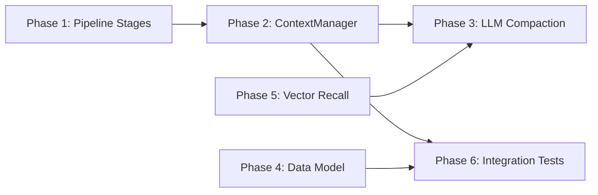

# y-context Remediation Plan

> Audit results and phased development plan for aligning `y-context` with [context-session-design.md](../design/context-session-design.md).

**Created**: 2026-03-10
**Auditor**: Antigravity Agent
**Design Version**: v0.6

---

## 1. Audit Summary

### 1.1 Scope

Audited the following crates against [context-session-design.md](../design/context-session-design.md):

| Crate | Files | Tests | Status |
|-------|-------|-------|--------|
| `y-context` | 11 source + 8 memory submodule | 67 unit tests | Partially implemented |
| `y-session` | 8 source files | ~30 unit tests | Well-implemented |
| `y-core/session.rs` | 1 file | — | Traits defined |
| `y-storage/session_store.rs` | 1 file | — | SQLite backend |

### 1.2 What Is Implemented ✅

#### Session Layer (`y-session`)

| Component | Files | Coverage |
|-----------|-------|----------|
| Session Tree (parent/child, branching, depth) | `tree.rs`, `manager.rs` | ✅ Full |
| Session State Machine (Active/Paused/Archived/Merged/Tombstone) | `state_machine.rs` | ✅ Full |
| Session Types (Main/Child/Branch/Ephemeral/Canonical) | `y-core/session.rs` | ✅ Full |
| Session Manager (CRUD, state transitions, transcripts) | `manager.rs` | ✅ Full |
| Canonical Session (cross-channel, message merging) | `canonical.rs` | ✅ Full |
| Session Config (depth limits, compaction thresholds) | `config.rs` | ✅ Full |
| Message Scheduling | `scheduling.rs` | ✅ Full |
| Session Store (SQLite) | `y-storage/session_store.rs` | ✅ Full |
| Session Node struct (id, parent, root, depth, path, type, state) | `y-core/session.rs` | ✅ Core fields |

#### Context Assembly Layer (`y-context`)

| Component | Files | Coverage |
|-----------|-------|----------|
| `ContextPipeline` (ordered providers, fail-open) | `pipeline.rs` | ✅ Full |
| `ContextProvider` trait (name, priority, provide) | `pipeline.rs` | ✅ Full |
| `ContextWindowGuard` (3 modes: Auto/Soft/Hybrid) | `guard.rs` | ✅ Full |
| Token Budget (5 categories, configurable defaults) | `guard.rs` | ✅ Full |
| Guard Verdict (Ok/Warning/Overflow/Critical) | `guard.rs` | ✅ Full |
| Status Message generation (4 levels per design) | `guard.rs` | ✅ Full |
| `CompactionEngine` (config, strategies, identifier policy) | `compaction.rs` | ⚠️ Placeholder |
| Session Repair (empty/orphan/duplicate/merge) | `repair.rs` | ✅ Full |
| `RecallStore` (config, recall methods, relevance threshold) | `recall.rs` | ⚠️ Placeholder |
| `InjectContextStatus` (priority 700) | `context_status.rs` | ✅ Full |
| `BuildSystemPromptProvider` (priority 100) | `system_prompt.rs` | ✅ Full |
| `InputEnrichmentProvider` (priority 50) | `enrichment.rs` | ✅ Full |
| `ContextMiddlewareAdapter` (bridges to y-hooks) | `middleware_adapter.rs` | ✅ Full |
| Stage Priorities Module (100-700 constants) | `middleware_adapter.rs` | ✅ Full |
| Working Memory (cognitive categories, tokens, budget) | `working_memory.rs` | ✅ Full |

#### Memory Submodule (`y-context/memory/`)

| Component | Files | Coverage |
|-----------|-------|----------|
| Working Memory (4 categories, per-pipeline) | `working_memory.rs` | ✅ Full |
| LTM Client (in-memory for dev) | `ltm_client.rs` | ✅ Dev mode |
| STM Client (experience store) | `stm_client.rs` | ✅ Dev mode |
| Deduplication (SHA-256 + Jaccard) | `deduplication.rs` | ✅ Dev mode |
| Query Decomposition (typed sub-queries) | `query.rs` | ✅ Dev mode |
| Recall Middleware (format + budget) | `recall_middleware.rs` | ✅ Full |
| Search Orchestrator (vector→hybrid→keyword) | `search_orchestrator.rs` | ✅ Dev mode |

### 1.3 What Is Missing or Incomplete ❌

| # | Gap | Severity | Design Section |
|---|-----|----------|----------------|
| G1 | **Missing pipeline stages**: `InjectBootstrap` (200), `InjectMemory` (300), `InjectSkills` (400), `InjectTools` (500), `LoadHistory` (600) have no concrete `ContextProvider` implementations | High | §Pipeline Stages |
| G2 | **No `ContextManager` facade**: design shows a `Context Manager` that orchestrates pipeline → guard → compaction flow; no such type exists | High | §Full Context Preparation Flow |
| G3 | **CompactionEngine is placeholder**: uses simple concatenation instead of LLM-based summarization; `SegmentedSummarize` and `SelectiveRetain` strategies not implemented | Medium | §Compaction |
| G4 | **RecallStore is placeholder**: uses substring matching instead of vector DB; no embedding integration | Medium | §Memory Recall |
| G5 | **Guard overflow recovery not implemented**: `evaluate()` returns verdicts but no automatic recovery actions (compact history → trim bootstrap → evict tools → abort) | Medium | §Context Window Guard |
| G6 | **SessionNode missing fields**: design specifies `channel`, `label`, `last_compaction`, `compaction_count`, `metadata` (as `SessionMetadata`); current impl has `title` and `token_count`/`message_count` but lacks others | Low | §Data and State Model |
| G7 | **No CanonicalSession entity in y-core**: design specifies a `CanonicalSession` data model with `compaction_cursor` and `summary`; `y-session/canonical.rs` uses in-memory state instead | Low | §Data and State Model |
| G8 | **Pipeline has no session awareness**: `ContextProvider.provide()` receives only `&mut AssembledContext`, not session_id or query context needed by stages like `LoadHistory` or `InjectMemory` | Medium | §Pipeline Stages |
| G9 | **No integration tests or end-to-end flow tests**: unit tests cover individual components but no test exercises the full `prepare_context` flow from the design | Medium | §Key Flows |

---

## 2. Phased Remediation Plan

### Phase 1: Pipeline Stage Providers (P0 — Critical Path)

> **Goal**: Implement the 5 missing concrete `ContextProvider` stages so the pipeline can execute a real context preparation flow.

**Estimated Duration**: 3–4 days

#### 1.1 Add `PromptContext` to Pipeline

| File | Action | Detail |
|------|--------|--------|
| [pipeline.rs](file:///Users/gorgias/Projects/y-agent/crates/y-context/src/pipeline.rs) | MODIFY | Add an optional `PromptContext` (or generic session/query context) parameter to `ContextProvider::provide()` or alternatively pass it via `AssembledContext` metadata so stages have access to `session_id`, user query, agent mode, etc. |

> [!IMPORTANT]
> This is a breaking interface change to `ContextProvider`. All existing providers (`BuildSystemPromptProvider`, `InjectContextStatus`, `InputEnrichmentProvider`) must be updated.

**Alternative (recommended)**: Instead of changing the trait signature, attach a `ContextRequest` struct as a field on `AssembledContext`:

```rust
pub struct ContextRequest {
    pub session_id: SessionId,
    pub user_query: String,
    pub agent_mode: String,
    pub tools_enabled: Vec<String>,
}

pub struct AssembledContext {
    pub items: Vec<ContextItem>,
    pub request: Option<ContextRequest>, // NEW
}
```

This avoids trait-level breakage.

#### 1.2 Implement `InjectBootstrap` Provider (priority 200)

| File | Action | Detail |
|------|--------|--------|
| [NEW] `inject_bootstrap.rs` | CREATE | Reads workspace context (README.md, AGENTS.md, project structure) and injects as `ContextCategory::Bootstrap`. Should respect `bootstrap` token budget. |

**Behavior**:
- Scan workspace root for `README.md`, `AGENTS.md`, `.gitignore`
- Produce structured context item with file summaries
- Truncate to `bootstrap` budget (default 8,000 tokens)

#### 1.3 Implement `InjectMemory` Provider (priority 300)

| File | Action | Detail |
|------|--------|--------|
| [NEW] `inject_memory.rs` | CREATE | Uses `RecallMiddleware` and `SearchOrchestrator` to inject recalled memories. Bridges the existing memory submodule into the pipeline. |

**Behavior**:
- Extract user query from `ContextRequest`
- Call `SearchOrchestrator::search()` or `RecallMiddleware::format_items()`
- Inject results as `ContextCategory::Memory` items
- Respect memory token budget

#### 1.4 Implement `InjectSkills` Provider (priority 400)

| File | Action | Detail |
|------|--------|--------|
| [NEW] `inject_skills.rs` | CREATE | Placeholder that injects active skill descriptions. Will integrate with `y-skills` when available. |

**Behavior**:
- Accept a `Vec<SkillSummary>` at construction
- Format skill root docs (< 2,000 tokens each per design principle 2.4)
- Inject as `ContextCategory::Skills`

#### 1.5 Implement `InjectTools` Provider (priority 500)

| File | Action | Detail |
|------|--------|--------|
| [NEW] `inject_tools.rs` | CREATE | Implements Tool Lazy Loading: injects `ToolIndex` (names only) + `tool_search` meta-tool definition. Does not inject full schemas. |

**Behavior**:
- Accept tool names list at construction
- Produce compact tool index (<500 tokens)
- Include `tool_search` tool definition
- Inject as `ContextCategory::Tools`

#### 1.6 Implement `LoadHistory` Provider (priority 600)

| File | Action | Detail |
|------|--------|--------|
| [NEW] `load_history.rs` | CREATE | Loads session messages from `TranscriptStore`, applies repair via `repair_history()`, and injects as `ContextCategory::History`. |

**Behavior**:
- Read session transcript via `SessionManager.read_transcript()`
- Apply `repair_history()` to fix inconsistencies
- Format as `ContextCategory::History` items
- Respect `history` budget (80,000 tokens default)

#### Tests for Phase 1

| Test | File | What to Test |
|------|------|-------------|
| T-P1-01 | `inject_bootstrap.rs` | Provider name/priority; provides bootstrap items |
| T-P1-02 | `inject_bootstrap.rs` | Respects token budget; truncates long README |
| T-P1-03 | `inject_memory.rs` | Provider name/priority; injects recalled memories |
| T-P1-04 | `inject_memory.rs` | Empty recall produces no items |
| T-P1-05 | `inject_skills.rs` | Provider name/priority; injects skill descriptions |
| T-P1-06 | `inject_tools.rs` | Provider name/priority; produces compact tool index |
| T-P1-07 | `inject_tools.rs` | Tool index contains tool names and tool_search |
| T-P1-08 | `load_history.rs` | Provider name/priority; loads and repairs history |
| T-P1-09 | `load_history.rs` | Applies repair to orphan tool results |
| T-P1-10 | `pipeline.rs` | Full pipeline with all 8 stages executes in order |

**Verification command**: `cargo test -p y-context --lib`

---

### Phase 2: `ContextManager` Facade (P0 — Critical Path)

> **Goal**: Implement the `ContextManager` that orchestrates the full `prepare_context` flow shown in the sequence diagram.

**Estimated Duration**: 2–3 days

#### 2.1 Implement `ContextManager`

| File | Action | Detail |
|------|--------|--------|
| [NEW] `context_manager.rs` | CREATE | Facade that owns a `ContextPipeline`, `ContextWindowGuard`, `CompactionEngine`, and references to `SessionManager`. |

**API**:

```rust
pub struct ContextManager {
    pipeline: ContextPipeline,
    guard: ContextWindowGuard,
    compaction: CompactionEngine,
    session_manager: Arc<SessionManager>,
}

impl ContextManager {
    pub async fn prepare_context(
        &self,
        session_id: &SessionId,
        user_message: &str,
    ) -> Result<PreparedContext, ContextError>;
}

pub struct PreparedContext {
    pub system_prompt: String,
    pub messages: Vec<Message>,
    pub tools: Vec<ToolSchema>,
    pub tokens_used: u32,
    pub compacted: bool,
}
```

**Flow** (per design §Full Context Preparation Flow):
1. Load session via `SessionManager`
2. Load and repair messages
3. Execute pipeline (all 8 stages)
4. Evaluate via guard
5. If overflow → trigger compaction
6. Return `PreparedContext`

#### 2.2 Implement Guard Overflow Recovery

| File | Action | Detail |
|------|--------|--------|
| [MODIFY] `guard.rs` or `context_manager.rs` | MODIFY | Implement the priority-ordered recovery actions: (1) compact history, (2) trim bootstrap, (3) evict tools, (4) abort. |

#### Tests for Phase 2

| Test | File | What to Test |
|------|------|-------------|
| T-P2-01 | `context_manager.rs` | Simple prepare_context returns valid PreparedContext |
| T-P2-02 | `context_manager.rs` | Overflow triggers compaction |
| T-P2-03 | `context_manager.rs` | Critical overflow triggers emergency recovery |
| T-P2-04 | `context_manager.rs` | Failed provider doesn't abort pipeline |
| T-P2-05 | `guard.rs` | Recovery actions applied in priority order |

**Verification command**: `cargo test -p y-context --lib`

---

### Phase 3: LLM-Based Compaction (P1 — Important)

> **Goal**: Replace placeholder compaction with real LLM-based summarization.

**Estimated Duration**: 3–4 days

#### 3.1 `CompactionEngine` LLM Integration

| File | Action | Detail |
|------|--------|--------|
| [MODIFY] `compaction.rs` | MODIFY | Accept a `ProviderPool` or `LlmClient` trait for making compaction LLM calls. Implement `Summarize` strategy with real LLM calls. |

**Behavior**:
- Build compaction prompt from messages to compact
- Call LLM (configurable model, default `gpt-4o-mini`)
- Validate summary (not too short, preserves identifiers per policy)
- Retry up to 3 times on failure; fall back to simple truncation
- Emit `CompactionTriggered` event via EventBus (if y-hooks integrated)

#### 3.2 Implement `SegmentedSummarize` Strategy

| File | Action | Detail |
|------|--------|--------|
| [MODIFY] `compaction.rs` | MODIFY | Divide messages into segments by topic/length, summarize each independently, stitch together. |

#### 3.3 Implement `SelectiveRetain` Strategy

| File | Action | Detail |
|------|--------|--------|
| [MODIFY] `compaction.rs` | MODIFY | Score messages by importance, retain high-scoring ones verbatim, summarize rest. |

#### 3.4 Identifier Preservation Validation

| File | Action | Detail |
|------|--------|--------|
| [MODIFY] `compaction.rs` | MODIFY | Post-compaction validation: extract identifiers (regex for emails, URLs, file paths, etc.) from original, verify they appear in summary (Strict mode). |

#### Tests for Phase 3

| Test | File | What to Test |
|------|------|-------------|
| T-P3-01 | `compaction.rs` | Summarize strategy produces valid summary |
| T-P3-02 | `compaction.rs` | Segmented strategy preserves topic boundaries |
| T-P3-03 | `compaction.rs` | SelectiveRetain keeps high-importance messages |
| T-P3-04 | `compaction.rs` | Strict identifier policy validates identifiers |
| T-P3-05 | `compaction.rs` | LLM failure falls back to truncation |
| T-P3-06 | `compaction.rs` | Retry logic works (mock LLM failures) |

**Verification command**: `cargo test -p y-context --lib -- compaction`

---

### Phase 4: Data Model Alignment (P2 — Low Priority)

> **Goal**: Align `SessionNode` and related types with the full design specification.

**Estimated Duration**: 1–2 days

#### 4.1 Add Missing Fields to `SessionNode`

| File | Action | Detail |
|------|--------|--------|
| [MODIFY] `y-core/src/session.rs` | MODIFY | Add `channel: Option<String>`, `label: Option<String>`, `last_compaction: Option<Timestamp>`, `compaction_count: u32` |

> [!WARNING]
> Adding fields to `SessionNode` affects `y-storage/session_store.rs` (SQLite schema), `y-test-utils/mock_storage.rs`, and any serialization consumers. A database migration will be required.

#### 4.2 Add `SessionMetadata` struct

| File | Action | Detail |
|------|--------|--------|
| [MODIFY] `y-core/src/session.rs` | MODIFY | Extract metadata fields into a `SessionMetadata` struct per design specification. |

#### 4.3 Update Storage Layer

| File | Action | Detail |
|------|--------|--------|
| [MODIFY] `y-storage/session_store.rs` | MODIFY | Update SQL queries for new fields. |
| [NEW] `migrations/NNNN_session_metadata.sql` | CREATE | ALTER TABLE to add new columns. |
| [MODIFY] `y-test-utils/src/mock_storage.rs` | MODIFY | Update mock implementation. |

#### Tests for Phase 4

| Test | File | What to Test |
|------|------|-------------|
| T-P4-01 | `y-core/session.rs` | New fields accessible and serializable |
| T-P4-02 | `y-storage/session_store.rs` | Create/get round-trip preserves new fields |
| T-P4-03 | `y-session/manager.rs` | Manager updates compaction_count after compaction |

**Verification command**: `cargo test -p y-core -p y-storage -p y-session --lib`

---

### Phase 5: Vector-Based Memory Recall (P2 — Low Priority)

> **Goal**: Replace placeholder `RecallStore` with real embedding/vector search integration.

**Estimated Duration**: 3–4 days

#### 5.1 Embedding Provider Trait

| File | Action | Detail |
|------|--------|--------|
| [NEW] `y-core/src/embedding.rs` | CREATE | Define `EmbeddingProvider` trait for generating embeddings. |

#### 5.2 Qdrant Integration

| File | Action | Detail |
|------|--------|--------|
| [NEW] `y-storage/src/vector_store.rs` | CREATE | Qdrant client implementing vector storage/search behind a feature flag `memory_vector`. |

#### 5.3 Hybrid Search Implementation

| File | Action | Detail |
|------|--------|--------|
| [MODIFY] `recall.rs` | MODIFY | Replace substring matching with actual vector + text hybrid search using configurable weights. |

#### 5.4 MMR Diversity Filtering

| File | Action | Detail |
|------|--------|--------|
| [MODIFY] `recall.rs` | MODIFY | Add Maximal Marginal Relevance (MMR) algorithm for diversity in recall results. |

#### Tests for Phase 5

| Test | File | What to Test |
|------|------|-------------|
| T-P5-01 | `recall.rs` | Hybrid search combines text and vector scores |
| T-P5-02 | `recall.rs` | MMR reduces duplicate results |
| T-P5-03 | `recall.rs` | Threshold filtering works with real scores |

**Verification command**: `cargo test -p y-context --lib -- recall`

---

### Phase 6: Integration Tests (P1 — Important)

> **Goal**: End-to-end tests verifying the full context preparation flow.

**Estimated Duration**: 2–3 days

#### 6.1 Full Pipeline Integration Test

| File | Action | Detail |
|------|--------|--------|
| [NEW] `tests/integration_pipeline.rs` | CREATE | Test the full `ContextManager::prepare_context()` flow with mock session data. |

#### 6.2 Guard + Compaction Integration Test

| File | Action | Detail |
|------|--------|--------|
| [NEW] `tests/guard_compaction.rs` | CREATE | Test that overflow detection correctly triggers compaction and returns usable context. |

#### 6.3 Session + Context Integration Test

| File | Action | Detail |
|------|--------|--------|
| [NEW] `tests/session_context.rs` | CREATE | Test session loading → repair → pipeline → guard flow using `y-test-utils` mock stores. |

#### Tests for Phase 6

| Test | File | What to Test |
|------|------|-------------|
| T-P6-01 | `integration_pipeline.rs` | All 8 stages contribute context in correct order |
| T-P6-02 | `guard_compaction.rs` | Overflow triggers compaction, result is within budget |
| T-P6-03 | `session_context.rs` | Full flow from session_id to PreparedContext |
| T-P6-04 | `session_context.rs` | Repaired history is used (not raw) |

**Verification command**: `cargo test -p y-context --test '*'`

---

## 3. Priority Summary

| Phase | Priority | Scope | Estimated Days |
|-------|----------|-------|----------------|
| Phase 1: Pipeline Stage Providers | P0 | 5 new files, 1 modified | 3–4 |
| Phase 2: ContextManager Facade | P0 | 1 new file, 1 modified | 2–3 |
| Phase 3: LLM-Based Compaction | P1 | 1 modified file | 3–4 |
| Phase 4: Data Model Alignment | P2 | 3 modified + 1 new + migration | 1–2 |
| Phase 5: Vector Memory Recall | P2 | 2 new + 1 modified | 3–4 |
| Phase 6: Integration Tests | P1 | 3 new test files | 2–3 |
| **Total** | | | **14–20 days** |

---

## 4. Dependencies



- Phase 1 must complete before Phase 2 (ContextManager depends on all stages existing)
- Phase 2 must complete before Phase 3 and Phase 6
- Phase 4 and Phase 5 can run in parallel with Phases 1–3

---

## 5. Risk Assessment

| Risk | Mitigation |
|------|------------|
| `ContextProvider` trait change breaks existing providers | Use the `ContextRequest` field approach on `AssembledContext` instead of trait signature change |
| LLM compaction quality is unpredictable | Implement validation (length, identifier preservation) + truncation fallback |
| Vector DB (Qdrant) dependency adds complexity | Feature-gate behind `memory_vector`; keep in-memory fallback |
| SessionNode field additions break SQLite schema | Use ALTER TABLE migration; keep new fields `NULLABLE` or with defaults |
| Integration tests require mock infrastructure | Leverage existing `y-test-utils` crate with `MockSessionStore` and `MockTranscriptStore` |
