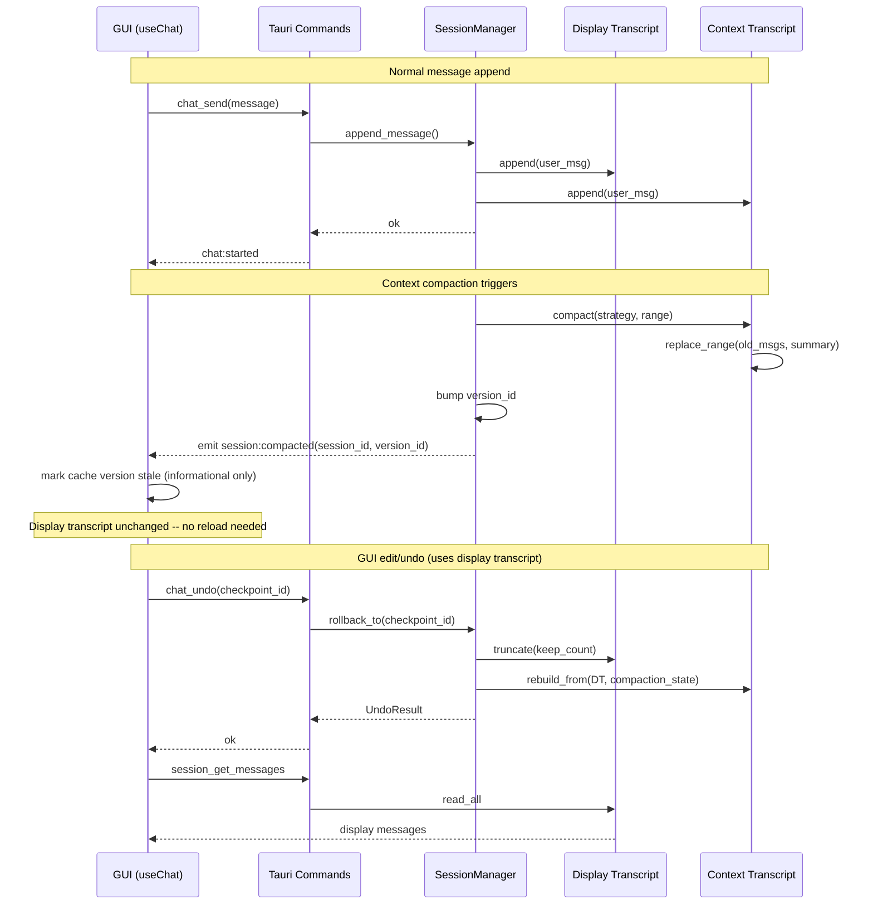

# GUI-Session Separation Plan

> Decouple GUI display state from backend session/context state to support context pruning, compression, and compaction without affecting the user's chat history view.

**Version**: v0.1
**Created**: 2026-03-15
**Status**: Draft

---

## 1. Problem Statement

The GUI chat layer (`useChat.ts`) and the backend session layer (`SessionManager` + `TranscriptStore`) currently share the **same message list** as their source of truth. The GUI maintains an in-memory cache (`sessionMessagesRef`) that mirrors the backend JSONL transcript, reloading it via `session_get_messages` after each operation.

This creates a tight coupling:

- **Context compaction**: When the backend compacts or prunes the transcript (as designed in `context-session-design.md` -- Context Window Guard), the GUI cache becomes stale. Subsequent edit/undo/resend operations would use incorrect checkpoint indices.
- **No notification**: The backend has no mechanism to inform the GUI that the transcript has been modified by compaction.
- **No display-vs-context separation**: There is no concept of "what the user sees" vs. "what the LLM receives." Both are the same JSONL transcript.

This plan defines the separation mechanism and the implementation steps to resolve these issues.

---

## 2. Design Goals

| # | Goal | Measurable Criteria |
|---|------|-------------------|
| G1 | GUI displays complete uncompacted chat history regardless of backend context state | User sees all messages even after compaction triggers |
| G2 | Context compaction does not break edit/undo/resend | All checkpoint operations succeed after compaction with zero data loss |
| G3 | GUI is notified of backend state changes | Notification latency < 100ms from compaction completion to GUI cache invalidation |
| G4 | Minimal migration cost | Existing JSONL format extended, not replaced; no data migration required for existing sessions |
| G5 | No performance regression | Message reload time remains < 50ms for sessions with < 500 messages |

---

## 3. Architecture: Dual-Store Model

### 3.1 Core Concept

Introduce two distinct message stores per session:

```
+-----------------------------------+     +-----------------------------------+
|  Display Transcript               |     |  Context Window                   |
|  (append-only, never compacted)   |     |  (compactable, pruneable)         |
+-----------------------------------+     +-----------------------------------+
| Source: display.jsonl             |     | Source: context.jsonl             |
| Owner: GUI read, Service write    |     | Owner: ChatService only           |
| Ops: append, read_all             |     | Ops: append, truncate, compact,   |
|      truncate (undo only)         |     |      replace_range, read_all      |
| Lifetime: full session history    |     | Lifetime: sliding context window  |
+-----------------------------------+     +-----------------------------------+
         |                                          |
         | 1:1 initially                            |
         | N:1 after compaction (N display msgs      |
         |     map to 1 summary in context)          |
         +------------------------------------------+
                          |
                 version_id (monotonic)
```

### 3.2 Component Responsibilities

| Component | Current | Proposed Change |
|-----------|---------|-----------------|
| `TranscriptStore` trait | Single JSONL per session | Add `DisplayTranscriptStore` trait (append-only) alongside existing `TranscriptStore` (context-focused) |
| `SessionManager` | Reads/writes single transcript | Writes to both stores on `append_message`; compaction affects context store only |
| `ChatCheckpointManager` | Checkpoints reference single transcript | Checkpoints reference **display transcript** indices (stable across compaction) |
| GUI `useChat.ts` | Reloads from `session_get_messages` | Reloads from **display transcript**; never sees compacted state |
| `ChatService` | Reads transcript for LLM context | Reads from **context transcript** (may contain summaries) |
| Tauri commands | `session_get_messages` reads single store | `session_get_messages` reads display store; new `session_get_context_state` for diagnostics |

### 3.3 State Synchronization



---

## 4. Implementation Steps

### Phase 1: Display Transcript Store (Foundation)

**Scope**: Introduce the dual-store model without changing compaction behavior.

#### Step 1.1: Define `DisplayTranscriptStore` trait

File: `crates/y-core/src/session.rs`

```rust
/// Append-only transcript for GUI display.
/// Never compacted. Only truncated during undo operations.
#[async_trait]
pub trait DisplayTranscriptStore: Send + Sync {
    async fn append(&self, session_id: &SessionId, message: &Message) -> Result<()>;
    async fn read_all(&self, session_id: &SessionId) -> Result<Vec<Message>>;
    async fn message_count(&self, session_id: &SessionId) -> Result<usize>;
    async fn truncate(&self, session_id: &SessionId, keep_count: usize) -> Result<usize>;
}
```

#### Step 1.2: Implement `JsonlDisplayTranscriptStore`

File: `crates/y-storage/src/transcript_display.rs`

- Same JSONL format as existing `JsonlTranscriptStore`
- Separate file per session: `{session_id}.display.jsonl`
- Reuse existing atomic truncation logic (write to temp + rename)

#### Step 1.3: Update `SessionManager` to write to both stores

File: `crates/y-session/src/manager.rs`

- `append_message()` writes to both `TranscriptStore` and `DisplayTranscriptStore`
- `read_transcript()` gains a `source` parameter: `Display` or `Context`
- Default: `session_get_messages` reads from Display store

#### Step 1.4: Migrate Tauri commands

File: `crates/y-gui/src-tauri/src/commands/chat.rs`

- `session_get_messages` reads from Display store (no GUI change needed)
- Add `session_get_context_state` for diagnostics panel (optional)

#### Step 1.5: Update `ChatCheckpointManager`

File: `crates/y-session/src/checkpoint.rs`

- `message_count_before` references Display transcript index (stable)
- `rollback_to()` truncates both Display and Context stores
- Context store rebuilt from Display + compaction metadata on rollback

**Tests**:
- Append to both stores simultaneously; verify consistency
- Truncate display store; verify context store can rebuild
- Checkpoint indices remain valid after context compaction

---

### Phase 2: Compaction Isolation

**Scope**: Context compaction only affects the Context store; Display store remains intact.

#### Step 2.1: Extend `TranscriptStore` with compaction methods

File: `crates/y-core/src/session.rs`

```rust
#[async_trait]
pub trait TranscriptStore: Send + Sync {
    // ... existing methods ...

    /// Replace a range of messages with a compaction summary.
    /// Only affects context transcript.
    async fn compact_range(
        &self,
        session_id: &SessionId,
        start_index: usize,
        end_index: usize,
        summary: Message,
    ) -> Result<CompactionResult>;
}
```

#### Step 2.2: Implement Context Window compaction

File: `crates/y-session/src/compaction.rs` (new)

- `ContextCompactor` struct owns the compaction logic
- Reads from Context transcript, applies strategy (Summarize / Segmented / SelectiveRetain per `context-session-design.md`)
- Writes summary back to Context transcript via `compact_range()`
- Does NOT touch Display transcript
- Bumps `SessionNode.compaction_count` and `last_compaction`

#### Step 2.3: Version tracking

File: `crates/y-core/src/session.rs`

Add to `SessionNode`:
```rust
pub context_version: u64,  // Monotonically increasing, bumped on any context mutation
```

- Bumped on: compaction, context-only truncation, context rebuild
- GUI can compare cached version to detect staleness (informational)

#### Step 2.4: Emit compaction event

File: `crates/y-gui/src-tauri/src/commands/chat.rs`

- After compaction, emit `session:compacted` Tauri event with `{ session_id, context_version, messages_compacted }`
- GUI listens and updates diagnostics panel (no message reload needed)

**Tests**:
- Compact context store; verify display store unchanged
- After compaction, `session_get_messages` returns full uncompacted history
- After compaction, LLM context uses compacted history
- Edit/undo after compaction succeeds with correct checkpoint resolution

---

### Phase 3: GUI Resilience

**Scope**: Harden the GUI against state inconsistencies.

#### Step 3.1: Backend session lock

File: `crates/y-service/src/chat.rs`

Add per-session `tokio::sync::Mutex` in `ServiceContainer`:
```rust
session_locks: DashMap<SessionId, Arc<Mutex<()>>>,
```

- All mutating operations (`prepare_turn`, `rollback_to`, `resend`, `compact`) acquire the lock
- Prevents concurrent edit/undo/resend/compaction races

#### Step 3.2: Optimistic update protocol improvement

File: `crates/y-gui/src/hooks/useChat.ts`

Current vulnerability: `resendLastTurn` removes cache entries before backend confirms. Fix:

1. Mark messages as `status: 'pending_removal'` instead of deleting
2. On backend success: finalize removal and reload
3. On backend failure: restore messages from pending state (no reload needed)

Add to GUI `Message` type:
```typescript
interface Message {
  // ... existing fields ...
  displayStatus?: 'committed' | 'pending' | 'streaming' | 'pending_removal' | 'cancelled';
}
```

#### Step 3.3: Version-aware cache

File: `crates/y-gui/src/hooks/useChat.ts`

- Cache stores `{ messages: Message[], contextVersion: number }` per session
- On `session:compacted` event: update `contextVersion` (informational for diagnostics)
- Display messages are NOT affected by compaction events

#### Step 3.4: Diagnostics integration

File: `crates/y-gui/src/components/DiagnosticsPanel.tsx`

- Show context window utilization (percentage of token budget used)
- Show compaction history (count, last timestamp)
- Show display vs. context message count divergence

**Tests**:
- Concurrent edit + compaction: lock serializes correctly
- Resend failure: cache restores to pre-resend state
- Diagnostics shows correct compaction metrics

---

### Phase 4: Context Rebuild on Rollback

**Scope**: When the user performs undo/edit after compaction, the context store must be reconstructed correctly.

#### Step 4.1: Context rebuild strategy

When rollback truncates the Display transcript to checkpoint N:
1. Truncate Display store to `message_count_before`
2. Read all remaining Display messages
3. Rebuild Context store:
   - If remaining messages fit within context window: copy Display messages directly
   - If remaining messages exceed window: re-apply compaction to older portions
4. Invalidate all checkpoints after the rollback point

#### Step 4.2: CompactionMetadata store

File: `crates/y-storage/src/compaction_metadata.rs` (new)

Track which display message ranges were compacted into which summaries:

```rust
pub struct CompactionRecord {
    pub id: String,
    pub session_id: SessionId,
    pub display_start_index: usize,
    pub display_end_index: usize,
    pub summary_message_id: String,
    pub strategy: CompactionStrategy,
    pub created_at: Timestamp,
}
```

This allows the context store to be rebuilt from Display + CompactionRecords without re-running the LLM summarizer.

**Tests**:
- Undo after compaction: context store rebuilt correctly
- Edit after compaction: new context includes all remaining display messages
- Multiple compactions + undo: CompactionRecords chain correctly

---

## 5. Migration Strategy

### Existing Sessions

- Existing sessions have only a single `.jsonl` file
- On first access after upgrade:
  1. Copy `{session_id}.jsonl` to `{session_id}.display.jsonl` (one-time)
  2. Mark migration complete in session metadata
- No data loss; both files start identical
- Context store diverges only when compaction first triggers

### Rollback (if feature disabled)

- Feature-flagged behind `dual_transcript` flag
- When disabled: `DisplayTranscriptStore` delegates to existing `TranscriptStore` (passthrough)
- All existing behavior preserved

---

## 6. File Changes Summary

| File | Change Type | Description |
|------|-------------|-------------|
| `crates/y-core/src/session.rs` | Extend | Add `DisplayTranscriptStore` trait, `context_version` field |
| `crates/y-storage/src/transcript_display.rs` | New | `JsonlDisplayTranscriptStore` implementation |
| `crates/y-storage/src/compaction_metadata.rs` | New | `CompactionRecord` persistence |
| `crates/y-session/src/manager.rs` | Modify | Dual-write to both stores; version tracking |
| `crates/y-session/src/checkpoint.rs` | Modify | Checkpoint indices reference display store |
| `crates/y-session/src/compaction.rs` | New | `ContextCompactor` with strategy execution |
| `crates/y-service/src/chat.rs` | Modify | Add per-session lock; `prepare_turn` reads from context store |
| `crates/y-service/src/container.rs` | Modify | Wire `DisplayTranscriptStore` and session locks |
| `crates/y-gui/src-tauri/src/commands/chat.rs` | Modify | `session_get_messages` reads display store; emit `session:compacted` |
| `crates/y-gui/src/hooks/useChat.ts` | Modify | `displayStatus` field; version-aware cache; compaction event listener |
| `crates/y-gui/src/types/index.ts` | Modify | Add `displayStatus` to `Message` interface |
| `crates/y-gui/src/components/DiagnosticsPanel.tsx` | Modify | Context vs. display divergence metrics |

---

## 7. Risk Assessment

| Risk | Likelihood | Impact | Mitigation |
|------|-----------|--------|------------|
| Dual-write failure (display succeeds, context fails) | Low | Medium | Atomic dual-write with rollback; context can always be rebuilt from display |
| Disk space doubling from dual JSONL | Medium | Low | Display transcripts are small (text only); compaction records are metadata-only |
| Context rebuild after undo is slow for large sessions | Low | Medium | Cache CompactionRecords; avoid re-running LLM summarizer |
| Migration race on first access | Low | High | File-level lock during migration; idempotent copy operation |
| Feature flag complexity | Medium | Low | Passthrough implementation when disabled; clean trait boundary |

---

## 8. Dependencies

| Dependency | Status | Required For |
|------------|--------|-------------|
| `TranscriptStore.truncate()` | Implemented | Phase 1 |
| `ChatCheckpointStore` | Implemented | Phase 1 |
| Context Window Guard (from `context-session-design.md`) | Designed, not implemented | Phase 2 |
| Compaction strategies (from `context-session-design.md`) | Designed, not implemented | Phase 2 |
| File Journal scope rollback | Implemented | Phase 1 (existing) |
| `DashMap` dependency | Available in workspace | Phase 3 |

---

## 9. Verification Criteria

| # | Criterion | Phase |
|---|-----------|-------|
| V1 | `session_get_messages` returns full history after compaction | Phase 2 |
| V2 | LLM context uses compacted history (fewer tokens) | Phase 2 |
| V3 | Edit after compaction produces correct result | Phase 4 |
| V4 | Undo after compaction restores correct display state | Phase 4 |
| V5 | Concurrent edit + compaction serialized correctly | Phase 3 |
| V6 | Existing sessions auto-migrate on first access | Phase 1 |
| V7 | Feature flag disablement preserves current behavior | Phase 1 |
| V8 | Diagnostics panel shows context vs. display divergence | Phase 3 |

---

## 10. Open Questions

| # | Question | Owner | Due Date | Status |
|---|----------|-------|----------|--------|
| 1 | Should CompactionRecords be stored in SQLite or as a sidecar JSON file alongside the JSONL? SQLite gives query flexibility; sidecar keeps all session data co-located. | -- | Phase 2 start | Open |
| 2 | When context is rebuilt after undo, should we re-run the LLM summarizer or use cached CompactionRecords? Cached is faster but may produce suboptimal context if the conversation shape changes significantly. | -- | Phase 4 start | Open |
| 3 | Should the display transcript also store tool call results (which can be large), or should it store references to tool results stored separately? | -- | Phase 1 start | Open |
| 4 | Should context_version be per-session or per-transcript-store? Per-session is simpler; per-store allows finer-grained invalidation. | -- | Phase 2 start | Open |

---

## 11. Related Documents

| Document | Relationship |
|----------|-------------|
| [context-session-design.md](../design/context-session-design.md) | Defines compaction strategies, Context Window Guard, and session tree -- this plan extends its session model |
| [chat-checkpoint-design.md](../design/chat-checkpoint-design.md) | Defines checkpoint/rollback -- this plan modifies checkpoint index semantics |
| [tauri-gui-design.md](../design/tauri-gui-design.md) | Defines GUI architecture -- this plan adds display-layer concerns |
| [client-layer-design.md](../design/client-layer-design.md) | Defines client-service boundary -- this plan strengthens that boundary |
| [hooks-plugin-design.md](../design/hooks-plugin-design.md) | Compaction events may be exposed as lifecycle hooks |
