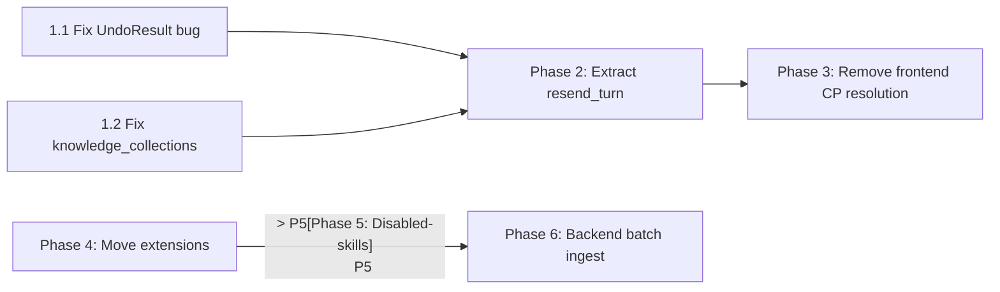

# Layering Remediation Plan

Remediate architectural violations and bugs identified in the code review. The interaction layer (GUI Tauri commands, frontend hooks) currently contains domain/service logic that should live in `y-service` or lower crates.

---

## Phase 1: P0 Bug Fixes (Low Effort, High Impact)

### 1.1 Fix `UndoResult.remaining_message_count` mapping bug

#### [MODIFY] [chat.rs](file:///Users/gorgias/Projects/y-agent/crates/y-gui/src-tauri/src/commands/chat.rs)

The `chat_undo` command maps `result.messages_removed` to `remaining_message_count`, which is semantically wrong. The field name implies messages _remaining_, but the value is messages _removed_.

**Option A** (recommended): Rename the field to `messages_removed` to match the backend semantics, and update the frontend accordingly.

**Option B**: Compute `remaining = total - removed` and keep the current field name.

Decision point: which approach? Option A is simpler and avoids computing a derived value that the frontend may not even use meaningfully.

#### [MODIFY] [useChat.ts](file:///Users/gorgias/Projects/y-agent/crates/y-gui/src/hooks/useChat.ts)

Update the `UndoResult` type definition and any code that reads `remaining_message_count` to use the corrected field.

#### [MODIFY] [index.ts](file:///Users/gorgias/Projects/y-agent/crates/y-gui/src/types/index.ts)

Update the `UndoResult` TypeScript type to match the renamed/corrected field.

---

### 1.2 Fix `chat_resend` dropping `knowledge_collections`

#### [MODIFY] [chat.rs](file:///Users/gorgias/Projects/y-agent/crates/y-gui/src-tauri/src/commands/chat.rs)

In the `chat_resend` command (line 596), `knowledge_collections` is hardcoded to `vec![]`. Add a `knowledge_collections: Option<Vec<String>>` parameter to the command signature and forward it to `TurnInput`.

```rust
// Before:
knowledge_collections: vec![],

// After:
knowledge_collections: knowledge_collections.unwrap_or_default(),
```

#### [MODIFY] [useChat.ts](file:///Users/gorgias/Projects/y-agent/crates/y-gui/src/hooks/useChat.ts)

Update `resendLastTurn` to pass through the knowledge collections from the original message if available.

---

## Phase 2: Extract `ChatService::resend_turn` (P1 Architecture)

### Motivation

`chat_resend` (L497-676 in `commands/chat.rs`) contains ~180 lines of domain logic:

1. Load checkpoint from store
2. Partial transcript truncation (display + context stores)
3. Checkpoint invalidation
4. Read display transcript
5. Build `TurnInput`
6. Spawn LLM worker with progress forwarding

Steps 1-5 are pure domain logic. Step 6 is a shared execution pattern already present in `chat_send`. The goal is to extract 1-5 into a service method and have both commands share the LLM spawning pattern.

### 2.1 Add `ChatService::prepare_resend_turn`

#### [MODIFY] [chat.rs](file:///Users/gorgias/Projects/y-agent/crates/y-service/src/chat.rs)

Add a new method to `ChatService`:

```rust
/// Prepare a resend turn: truncate transcript to after the user message,
/// invalidate newer checkpoints, and return a PreparedTurn ready for execution.
pub async fn prepare_resend_turn(
    container: &ServiceContainer,
    request: ResendTurnRequest,
) -> Result<PreparedTurn, ResendTurnError>;
```

New types needed:

```rust
pub struct ResendTurnRequest {
    pub session_id: SessionId,
    pub checkpoint_id: String,
    pub provider_id: Option<String>,
    pub knowledge_collections: Option<Vec<String>>,
}

pub enum ResendTurnError {
    CheckpointNotFound(String),
    TruncateFailed(String),
    TranscriptEmpty,
    TranscriptReadFailed(String),
}
```

The method will contain the logic currently in `chat_resend` lines 506-558:

1. Load checkpoint
2. Compute `keep_count = checkpoint.message_count_before + 1`
3. Truncate display and context transcript stores
4. Invalidate checkpoints after the target turn
5. Read display transcript
6. Build and return `PreparedTurn`

#### [MODIFY] [chat.rs](file:///Users/gorgias/Projects/y-agent/crates/y-gui/src-tauri/src/commands/chat.rs)

Refactor `chat_resend` to call `ChatService::prepare_resend_turn()` then reuse the LLM spawn pattern. This reduces the command handler to ~40 lines (prepare + spawn).

### 2.2 Extract shared LLM spawn helper

Both `chat_send` and `chat_resend` contain an identical ~50-line tokio::spawn block for LLM execution. Extract this into a helper function in the commands module:

#### [MODIFY] [chat.rs](file:///Users/gorgias/Projects/y-agent/crates/y-gui/src-tauri/src/commands/chat.rs)

```rust
/// Spawn the LLM worker task with progress forwarding and event emission.
fn spawn_llm_worker(
    app: AppHandle,
    container: Arc<ServiceContainer>,
    prepared: PreparedTurn,
    run_id: String,
    turn_meta_cache: Arc<Mutex<HashMap<String, TurnMeta>>>,
    cancel_token: CancellationToken,
    should_generate_title: bool,
);
```

Both `chat_send` and `chat_resend` will call this helper instead of duplicating the spawn logic.

---

## Phase 3: Remove Frontend Checkpoint Resolution Duplication (P1)

### 3.1 Use `chat_find_checkpoint_for_resend` backend command

#### [MODIFY] [useChat.ts](file:///Users/gorgias/Projects/y-agent/crates/y-gui/src/hooks/useChat.ts)

The frontend `findCheckpointForMessage` function (L292-349) duplicates logic that already exists as the `chat_find_checkpoint_for_resend` backend command (L728-811 in `commands/chat.rs`).

Replace frontend usage in `editAndResend` and `undoToMessage` with calls to `chat_find_checkpoint_for_resend`. This:

- Removes ~60 lines of frontend checkpoint resolution code
- Eliminates 2 redundant IPC calls per operation (`session_get_messages` + `chat_checkpoint_list`)
- Replaces them with 1 atomic backend call
- Keeps message ID matching logic server-side where it has access to canonical IDs

The backend command accepts `user_message_content` and optional `message_id`, so the frontend just needs to pass the message content from the cached message.

---

## Phase 4: Move `SUPPORTED_EXTENSIONS` to Knowledge Crate (P2)

### 4.1 Move file extension logic to `y-knowledge`

#### [NEW] [supported_formats.rs](file:///Users/gorgias/Projects/y-agent/crates/y-knowledge/src/supported_formats.rs)

Create a new module exporting:

- `SUPPORTED_EXTENSIONS: &[&str]` — the extension list
- `is_supported_extension(path: &Path) -> bool`
- `collect_supported_files(dir: &Path) -> Result<Vec<PathBuf>, io::Error>`

#### [MODIFY] [lib.rs](file:///Users/gorgias/Projects/y-agent/crates/y-knowledge/src/lib.rs)

Add `pub mod supported_formats;` to exports.

#### [MODIFY] [knowledge.rs](file:///Users/gorgias/Projects/y-agent/crates/y-gui/src-tauri/src/commands/knowledge.rs)

Replace the local `SUPPORTED_EXTENSIONS`, `is_supported_extension`, `collect_supported_files`, and `kb_expand_folder` implementations with calls to `y_knowledge::supported_formats::*`. The `kb_expand_folder` command handler becomes a thin delegate.

---

## Phase 5: Move Disabled-Skills Persistence to Skill Crate (P2)

### 5.1 Add enabled/disabled state to `SkillRegistry`

#### [MODIFY] [lib.rs or registry.rs](file:///Users/gorgias/Projects/y-agent/crates/y-skills/src)

Add methods to `SkillRegistryImpl`:

- `set_enabled(name: &str, enabled: bool) -> Result<()>`
- `is_enabled(name: &str) -> bool`
- Internal: persist disabled state to `disabled_skills.json` inside the skill store directory

#### [MODIFY] [skills.rs](file:///Users/gorgias/Projects/y-agent/crates/y-gui/src-tauri/src/commands/skills.rs)

Remove `read_disabled_skills`, `write_disabled_skills`, `disabled_skills_path` functions. Replace with calls to the skill registry's enabled/disabled API. Keep the skill store as a persistent instance in `AppState` instead of recreating per call (optimization 3.3 from code review).

---

## Phase 6: Backend Batch Ingestion (P2)

### 6.1 Add `kb_ingest_batch` backend command

#### [MODIFY] [knowledge_service.rs](file:///Users/gorgias/Projects/y-agent/crates/y-service/src/knowledge_service.rs)

Add `ingest_batch` method that:

- Takes a list of file paths, domain, and collection
- Processes files sequentially with cancellation support
- Returns per-file results
- Emits progress events via a channel

#### [NEW or MODIFY] [knowledge.rs](file:///Users/gorgias/Projects/y-agent/crates/y-gui/src-tauri/src/commands/knowledge.rs)

Add `kb_ingest_batch` Tauri command that delegates to the service and emits progress events via Tauri event system.

#### [MODIFY] [useKnowledge.ts](file:///Users/gorgias/Projects/y-agent/crates/y-gui/src/hooks/useKnowledge.ts)

Replace the frontend `ingestBatch` for-loop with a single `invoke('kb_ingest_batch', ...)` call, listening to progress events instead of tracking iteration state in React.

---

## Verification Plan

### Automated Tests

#### Phase 1 Verification

```bash
# Build check (both Rust and TypeScript must compile)
cargo build -p y-gui 2>&1 | tail -20
cd crates/y-gui && npm run build 2>&1 | tail -20
```

The `UndoResult` field rename (1.1) is a type-level change — if it compiles, the rename is consistent. The `knowledge_collections` fix (1.2) is a parameter addition — verified by compilation.

#### Phase 2 Verification

```bash
# Run existing chat service tests (prepare_turn family)
cargo test -p y-service -- chat::tests

# Add new test: prepare_resend_turn
# Test case: create session, prepare_turn, execute a mock turn,
# then prepare_resend_turn and verify:
#   - transcript is truncated to keep_count
#   - checkpoints after target are invalidated
#   - returned PreparedTurn has correct history/turn_number
```

The new `prepare_resend_turn` test will follow the existing `make_test_container` pattern in `y-service/src/chat.rs` (L794-808).

#### Phase 4 Verification

```bash
# New unit tests in y-knowledge for supported_formats module
cargo test -p y-knowledge -- supported_formats

# Test cases:
# - is_supported_extension returns true for .rs, .py, .md
# - is_supported_extension returns false for .exe, .png
# - is_supported_extension handles extensionless files (Dockerfile, Makefile)
# - collect_supported_files recursively finds files and skips hidden dirs
```

### Manual Verification

> [!IMPORTANT]
> Phases 1-3 affect interactive chat behavior (edit/undo/resend). These should be manually verified in the GUI:
>
> 1. **Resend**: Start a chat, send 2 messages, click resend on the 2nd message. Verify the LLM re-runs and the result replaces the old response. With knowledge collections selected, verify they are included.
> 2. **Undo**: Send 3 messages, click undo on the 2nd. Verify messages 2 and 3 are removed.
> 3. **Edit**: Send a message, click edit, change content, send. Verify the old message is replaced and the LLM responds to the new content.
> 4. **Cancel + Undo**: Send a message, cancel mid-stream, then undo. Verify the undo works even without a checkpoint (fallback truncation path).

---

## Execution Order



Phases 1-3 are on the critical path (each builds on the previous). Phases 4-6 are independent and can be parallelised.
