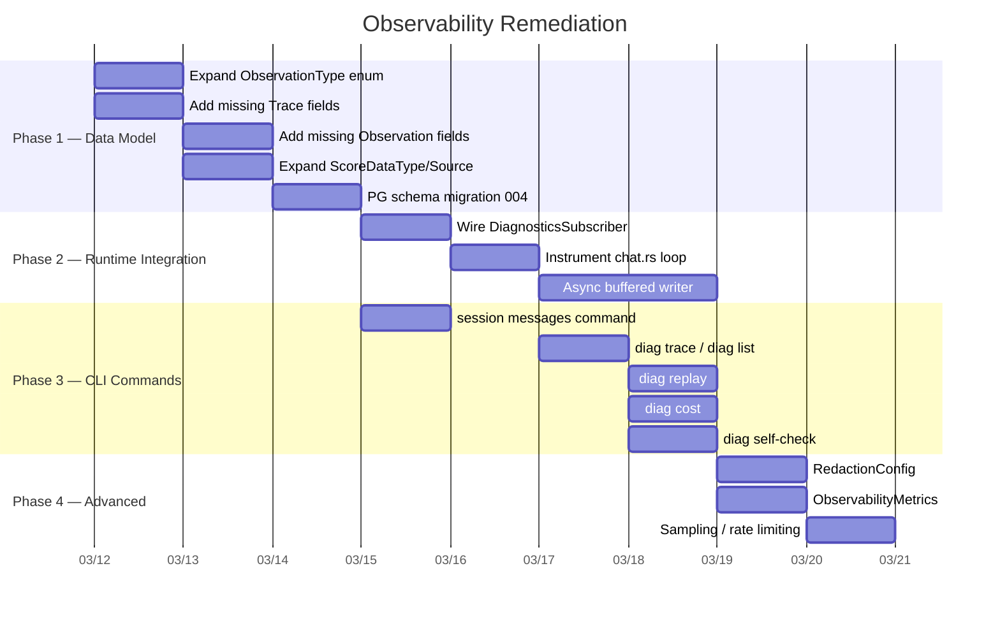
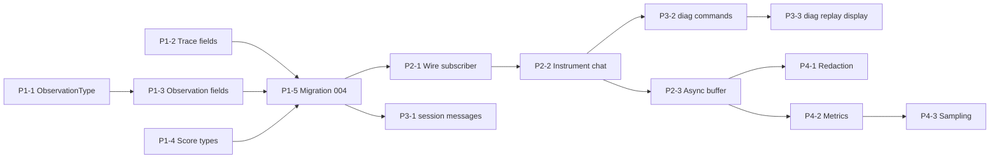

# Observability Remediation Plan

> Based on 2026-03-10 audit of `diagnostics-observability-design.md` vs `y-diagnostics` crate and related modules

---

## Executive Summary

The observability design has been **partially implemented**: the data model, `TraceStore` trait, `PgTraceStore`, and analysis modules (replay, search, cost, subscriber) are in place. However, **runtime integration is missing** — the `DiagnosticsSubscriber` is never wired into the chat loop, no `diag` CLI commands exist, and several design-specified data model fields and features are absent.

This plan addresses all gaps in **4 phases**, ordered by dependency and priority.

---

## Phase Overview



---

## Phase 1 — Data Model Alignment

**Goal**: Bring `y-diagnostics/src/types.rs` and PG schema into full compliance with the design document.

### P1-1: Expand ObservationType Enum

**Design ref**: `diagnostics-observability-design.md` §Enhanced Observation Types
**Crate**: `y-diagnostics`

**Current state**: 4 variants (`Generation`, `ToolCall`, `Span`, `UserInput`)
**Target state**: 13 variants per design

**Changes**:

#### [MODIFY] [types.rs](file:///Users/gorgias/Projects/y-agent/crates/y-diagnostics/src/types.rs)

Add missing variants to `ObservationType`:

```diff
 pub enum ObservationType {
     Generation,
     ToolCall,
     Span,
     UserInput,
+    McpCall,
+    Retrieval,
+    Embedding,
+    Reranking,
+    SubAgent,
+    Planning,
+    Reflection,
+    Guardrail,
+    Hook,
+    Cache,
 }
```

#### [MODIFY] [pg_trace_store.rs](file:///Users/gorgias/Projects/y-agent/crates/y-diagnostics/src/pg_trace_store.rs)

Update `obs_type_to_pg()` and `pg_to_obs_type()` to map all 13 types. The PG schema already supports all 13 types in the `CHECK` constraint of `001_observability_schema.up.sql`.

**Tests**:
| Test ID | Test Name | Behavior | Assertion |
|---------|-----------|----------|-----------|
| T-DIAG-009 | `test_observation_type_roundtrip_all_variants` | Create observation with each type | Type preserved after serialize/deserialize |
| T-DIAG-010 | `test_pg_obs_type_mapping_all_variants` | Map each Rust variant to PG string and back | Identity mapping |

---

### P1-2: Add Missing Trace Fields

**Design ref**: `diagnostics-observability-design.md` §Enhanced Trace Metadata

**Current state**: Missing `user_input`, `total_duration_ms`, `llm_duration_ms`, `tool_duration_ms`, `replay_context`
**Target state**: All fields present

**Changes**:

#### [MODIFY] [types.rs](file:///Users/gorgias/Projects/y-agent/crates/y-diagnostics/src/types.rs)

Add fields to `Trace`:

```diff
 pub struct Trace {
     // ... existing fields ...
+    /// Original user input that triggered this trace.
+    pub user_input: Option<String>,
+    /// Total wall-clock duration in milliseconds.
+    pub total_duration_ms: Option<u64>,
+    /// Time spent waiting for LLM responses.
+    pub llm_duration_ms: u64,
+    /// Time spent executing tools.
+    pub tool_duration_ms: u64,
+    /// Replay context for debugging (system prompt, history, tool defs).
+    pub replay_context: Option<serde_json::Value>,
 }
```

Add `ReplayContext` struct:

```rust
#[derive(Debug, Clone, Serialize, Deserialize)]
pub struct ReplayContext {
    pub system_prompt: String,
    pub conversation_history: Vec<serde_json::Value>,
    pub tool_definitions: Vec<serde_json::Value>,
    pub config_snapshot: serde_json::Value,
}
```

#### [MODIFY] [pg_trace_store.rs](file:///Users/gorgias/Projects/y-agent/crates/y-diagnostics/src/pg_trace_store.rs)

Update `TraceRow`, `into_trace()`, `insert_trace()`, `update_trace()`, and `list_traces()` queries to include the new columns.

**Tests**:
| Test ID | Test Name | Behavior | Assertion |
|---------|-----------|----------|-----------|
| T-DIAG-011 | `test_trace_with_user_input` | Create trace with user_input field | Field stored and retrieved |
| T-DIAG-012 | `test_trace_duration_tracking` | Complete trace, check durations | `total_duration_ms` > 0 |
| T-DIAG-013 | `test_replay_context_serialization` | Store and retrieve ReplayContext | JSONB roundtrip |

---

### P1-3: Add Missing Observation Fields

**Design ref**: `diagnostics-observability-design.md` §Database Schema

**Current state**: Missing `depth`, `path` (materialized path), `error_message`
**Target state**: All fields present

**Changes**:

#### [MODIFY] [types.rs](file:///Users/gorgias/Projects/y-agent/crates/y-diagnostics/src/types.rs)

```diff
 pub struct Observation {
     // ... existing fields ...
+    /// Tree depth from root (0 = root observation).
+    pub depth: u32,
+    /// Materialized path from root to this observation (UUIDs).
+    pub path: Vec<Uuid>,
+    /// Error message (if status is Failed).
+    pub error_message: Option<String>,
 }
```

#### [MODIFY] [subscriber.rs](file:///Users/gorgias/Projects/y-agent/crates/y-diagnostics/src/subscriber.rs)

Update `on_generation()` and `on_tool_call()` to accept and populate `depth` and `path`.

**Tests**:
| Test ID | Test Name | Behavior | Assertion |
|---------|-----------|----------|-----------|
| T-DIAG-014 | `test_observation_depth_path` | Create nested observations | depth=0 for root, depth=1 for child, path contains ancestors |
| T-DIAG-015 | `test_observation_error_message` | Failed observation with error | error_message stored |

---

### P1-4: Expand Score Types

**Design ref**: `diagnostics-observability-design.md` §Score Data Model

**Current state**: `ScoreValue` has `Numeric` and `Categorical`; `ScoreSource` has `System`, `Llm`, `Human`
**Target state**: Add `Boolean` to `ScoreValue`; add `UserFeedback` to `ScoreSource`

**Changes**:

#### [MODIFY] [types.rs](file:///Users/gorgias/Projects/y-agent/crates/y-diagnostics/src/types.rs)

```diff
 pub enum ScoreValue {
     Numeric(f64),
     Categorical(String),
+    Boolean(bool),
 }

 pub enum ScoreSource {
     System,
     Llm,
     Human,
+    UserFeedback,
 }
```

#### [MODIFY] [pg_trace_store.rs](file:///Users/gorgias/Projects/y-agent/crates/y-diagnostics/src/pg_trace_store.rs)

Update `score_source_to_pg()` and `pg_to_score_source()`. Also update `ScoreRow` to handle boolean values.

**Tests**:
| Test ID | Test Name | Behavior | Assertion |
|---------|-----------|----------|-----------|
| T-DIAG-016 | `test_boolean_score_creation` | Create boolean score | Value preserved |
| T-DIAG-017 | `test_user_feedback_source` | Score with UserFeedback source | Source preserved |

---

### P1-5: PostgreSQL Schema Migration 004

**Design ref**: All P1 changes above

**Changes**:

#### [NEW] `migrations/postgres/004_observability_v2.up.sql`

```sql
-- Add missing Trace columns
ALTER TABLE observability.traces ADD COLUMN IF NOT EXISTS user_input TEXT;
ALTER TABLE observability.traces ADD COLUMN IF NOT EXISTS llm_duration_ms INTEGER DEFAULT 0;
ALTER TABLE observability.traces ADD COLUMN IF NOT EXISTS tool_duration_ms INTEGER DEFAULT 0;
ALTER TABLE observability.traces ADD COLUMN IF NOT EXISTS replay_context JSONB;

-- Add missing Observation columns
ALTER TABLE observability.observations ADD COLUMN IF NOT EXISTS error_message TEXT;

-- Full-text search indexes (from design)
CREATE INDEX IF NOT EXISTS idx_traces_fts ON observability.traces
    USING GIN(to_tsvector('english', COALESCE(user_input, '')));

CREATE INDEX IF NOT EXISTS idx_obs_fts ON observability.observations
    USING GIN(to_tsvector('english',
        COALESCE(name, '') || ' ' ||
        COALESCE(input::text, '') || ' ' ||
        COALESCE(output::text, '')));
```

#### [NEW] `migrations/postgres/004_observability_v2.down.sql`

Reverse migration.

**Verification**: `cargo test -p y-diagnostics` — all existing + new tests pass.

---

## Phase 2 — Runtime Integration

**Goal**: Wire `DiagnosticsSubscriber` into the chat loop so traces and observations are actually recorded during usage.

### P2-1: Wire DiagnosticsSubscriber into AppServices

**Design ref**: `diagnostics-observability-design.md` §Architecture Overview — Tracer receives events from Orchestrator/Provider/Tools
**Crates**: `y-cli`, `y-diagnostics`

**Current state**: `AppServices` has no diagnostics fields; `y-cli/Cargo.toml` has no `y-diagnostics` dependency.

**Changes**:

#### [MODIFY] [Cargo.toml](file:///Users/gorgias/Projects/y-agent/crates/y-cli/Cargo.toml)

Add `y-diagnostics` as optional dependency with `diagnostics_pg` feature forwarded.

#### [MODIFY] [wire.rs](file:///Users/gorgias/Projects/y-agent/crates/y-cli/src/wire.rs)

- Add `trace_store: Arc<dyn TraceStore>` field to `AppServices`
- Add `diagnostics_subscriber: Option<DiagnosticsSubscriber<...>>` field
-  In `wire()`, construct `PgTraceStore` from PG pool (if `diagnostics_pg` enabled), or `InMemoryTraceStore` as fallback
- Run PG migrations for observability schema

#### [MODIFY] [config.rs](file:///Users/gorgias/Projects/y-agent/crates/y-cli/src/config.rs) (if exists)

Add `diagnostics` config section with PG connection string, retention period, buffer settings.

**Tests**:
| Test ID | Test Name | Behavior | Assertion |
|---------|-----------|----------|-----------|
| T-DIAG-018 | `test_wire_creates_diagnostics_service` | Wire with default config | `trace_store` field exists |
| T-DIAG-019 | `test_wire_uses_inmemory_without_pg` | Wire without PG feature | Falls back to InMemoryTraceStore |

---

### P2-2: Instrument Chat Loop

**Design ref**: `diagnostics-observability-design.md` §Flow 1: Trace Recording
**Crate**: `y-cli`

**Current state**: `chat.rs` does NOT call any trace recording methods.

**Changes**:

#### [MODIFY] [chat.rs](file:///Users/gorgias/Projects/y-agent/crates/y-cli/src/commands/chat.rs)

Add instrumentation around the chat loop:

1. **Trace start**: Before processing user input, call `subscriber.on_trace_start(session_id_uuid, "chat-turn")`
2. **Generation observation**: After successful LLM response, call `subscriber.on_generation(trace_id, None, model, input_tokens, output_tokens, cost)`
3. **Tool call observation**: When tool calls are executed (future), call `subscriber.on_tool_call(...)`
4. **Trace end**: After each turn, call `subscriber.on_trace_end(trace_id, success)`
5. **ReplayContext**: Capture system prompt, history, and tool definitions before LLM call; store on trace completion

**Tests**:
| Test ID | Test Name | Behavior | Assertion |
|---------|-----------|----------|-----------|
| T-DIAG-020 | `test_chat_creates_trace_on_message` | Simulate user message in chat | Trace created in store |
| T-DIAG-021 | `test_chat_records_llm_observation` | Chat with LLM response | Generation observation stored with token counts |
| T-DIAG-022 | `test_chat_completes_trace` | Full chat turn | Trace status = Completed, totals aggregated |

---

### P2-3: Async Buffered Writer

**Design ref**: `diagnostics-observability-design.md` §Performance — "Async buffered writes"
**Crate**: `y-diagnostics`

**Current state**: All writes go directly to store (synchronous).
**Target state**: Memory buffer with periodic flush (every 5 seconds by default).

**Changes**:

#### [NEW] `crates/y-diagnostics/src/buffer.rs`

```rust
pub struct BufferedTraceWriter<S: TraceStore> {
    store: Arc<S>,
    pending_traces: Arc<Mutex<Vec<Trace>>>,
    pending_observations: Arc<Mutex<Vec<Observation>>>,
    pending_scores: Arc<Mutex<Vec<Score>>>,
    flush_interval: Duration,
}
```

- `queue_trace()`, `queue_observation()`, `queue_score()` — non-blocking enqueue
- `start_flush_loop()` — spawns tokio task that flushes every `flush_interval`
- `flush()` — batch inserts all pending items

**Tests**:
| Test ID | Test Name | Behavior | Assertion |
|---------|-----------|----------|-----------|
| T-DIAG-023 | `test_buffer_queues_without_blocking` | Queue 100 observations | Returns in < 1ms |
| T-DIAG-024 | `test_buffer_flushes_periodically` | Queue, wait flush_interval | Items appear in store |
| T-DIAG-025 | `test_buffer_explicit_flush` | Queue + explicit flush | All items stored immediately |
| T-DIAG-026 | `test_buffer_overflow_drops_oldest` | Queue > capacity | Oldest items dropped, warning logged |

---

## Phase 3 — CLI Commands

**Goal**: Expose observability data through the CLI as specified in the design document.

### P3-1: `session messages` Command

**Design ref**: (missing from design — natural extension of session management)
**Crate**: `y-cli`

**Current state**: `session` subcommands include `list`, `resume`, `branch`, `archive` — no way to view messages.

**Changes**:

#### [MODIFY] [session.rs](file:///Users/gorgias/Projects/y-agent/crates/y-cli/src/commands/session.rs)

Add `Messages` variant to `SessionAction`:

```rust
Messages {
    /// Session ID to view messages for.
    id: String,
    /// Show last N messages only.
    #[arg(long)]
    last: Option<usize>,
    /// Output format (table, json).
    #[arg(long, default_value = "table")]
    format: String,
}
```

Implementation: call `session_manager.read_transcript(&session_id)` (or `read_last_messages` if `--last` is specified), format as table or JSON.

**Tests**:
| Test ID | Test Name | Behavior | Assertion |
|---------|-----------|----------|-----------|
| T-CLI-007-01 | `test_parse_session_messages_command` | Parse `session messages <id>` | Clap parses correctly |
| T-CLI-007-02 | `test_parse_session_messages_with_last` | Parse `session messages <id> --last 10` | `last` = Some(10) |

**Manual verification**: `y-agent session messages <session-id>` — displays message history.

---

### P3-2: `diag trace` / `diag list` Commands

**Design ref**: `diagnostics-observability-design.md` §Flow 2: Trace Analysis
**Crate**: `y-cli`

**Changes**:

#### [NEW] `crates/y-cli/src/commands/diag.rs`

Add `Diag` variant to `Commands` enum in `mod.rs`. Subcommands:

```rust
pub enum DiagAction {
    /// List recent traces.
    List {
        #[arg(long)] status: Option<String>,
        #[arg(long)] tag: Option<Vec<String>>,
        #[arg(long, default_value = "20")] limit: usize,
    },
    /// Show a specific trace with its observations.
    Trace {
        /// Trace ID (UUID).
        id: String,
        /// Show replay-ready context.
        #[arg(long)] replay: bool,
    },
    /// Show cost summary.
    Cost {
        /// Date (YYYY-MM-DD), defaults to today.
        #[arg(long)] date: Option<String>,
    },
    /// System health check.
    SelfCheck,
}
```

- `diag list` — calls `TraceSearch::search()` with filters
- `diag trace <id>` — calls `store.get_trace()` + `store.get_observations()`, renders as tree
- `diag trace <id> --replay` — calls `TraceReplay::replay()`, includes input/output
- `diag cost` — calls `CostIntelligence::daily_summary()`
- `diag self-check` — checks PG connection, buffer status, trace count

#### [MODIFY] [mod.rs](file:///Users/gorgias/Projects/y-agent/crates/y-cli/src/commands/mod.rs)

Add `pub mod diag;` and `Diag` to `Commands` enum.

**Tests**:
| Test ID | Test Name | Behavior | Assertion |
|---------|-----------|----------|-----------|
| T-CLI-008-01 | `test_parse_diag_list_command` | Parse `diag list` | Parses correctly |
| T-CLI-008-02 | `test_parse_diag_trace_command` | Parse `diag trace <uuid>` | Parses with id |
| T-CLI-008-03 | `test_parse_diag_trace_replay` | Parse `diag trace <uuid> --replay` | replay = true |
| T-CLI-008-04 | `test_parse_diag_cost_command` | Parse `diag cost --date 2026-03-10` | date parsed |
| T-CLI-008-05 | `test_parse_diag_self_check` | Parse `diag self-check` | Parses correctly |

**Manual verification**: After Phase 2, run a chat, then `y-agent diag list` and `y-agent diag trace <id>`.

---

### P3-3: `diag replay` (Display Logic)

**Design ref**: `diagnostics-observability-design.md` §Flow 2
**Crate**: `y-cli`

Implements `--replay` flag rendering: for each observation, show its input/output in a formatted tree view with indentation based on `depth`.

**Changes**: Part of `diag.rs` above; the replay rendering logic formats observations into a readable timeline:

```
Trace: abc123 (status: completed, 1.2s, $0.005)
├─ [0] llm-generation (gpt-4, 100→50 tokens, 340ms)
│  Input:  [{"role":"user","content":"Hello"}]
│  Output: "Hi there!"
├─ [1] tool-call web_search (210ms)
│  Input:  {"query":"test"}
│  Output: {"results":[...]}
└─ [2] llm-generation (gpt-4, 200→80 tokens, 420ms)
   Output: "Based on the search..."
```

**Tests**:
| Test ID | Test Name | Behavior | Assertion |
|---------|-----------|----------|-----------|
| T-DIAG-027 | `test_replay_display_tree_format` | Render observations | Output contains indented tree |

---

### P3-4: `diag cost`

Implementation is in `diag.rs` P3-2. Calls `CostIntelligence::daily_summary()` and displays:

```
Cost Summary for 2026-03-10:
  Total traces: 15
  Total cost:   $0.142
  By model:
    gpt-4        $0.098  (300 traces, 45K input, 12K output tokens)
    claude-3     $0.044  (50 traces, 20K input, 8K output tokens)
```

---

### P3-5: `diag self-check`

Implementation is in `diag.rs` P3-2. Reports:

- Database connectivity (PG pool status)
- Buffer status (pending items)
- Trace count (last 30 days)
- Last flush timestamp
- Storage usage estimate

---

## Phase 4 — Advanced Features

### P4-1: RedactionConfig

**Design ref**: `diagnostics-observability-design.md` §Security and Permissions
**Crate**: `y-diagnostics`

#### [NEW] `crates/y-diagnostics/src/redaction.rs`

```rust
pub struct RedactionConfig {
    pub patterns: Vec<RedactionPattern>,
    pub excluded_fields: Vec<String>,
    pub max_content_length: usize,
}
```

Apply redaction before storing observation input/output. Default patterns: API keys, emails, credit card numbers.

**Tests**:
| Test ID | Test Name | Behavior | Assertion |
|---------|-----------|----------|-----------|
| T-DIAG-028 | `test_redaction_masks_api_key` | Input contains `sk-abc123...` | Replaced with `[REDACTED:api_key]` |
| T-DIAG-029 | `test_redaction_truncates_long_content` | 100KB input | Truncated to `max_content_length` |

---

### P4-2: ObservabilityMetrics

**Design ref**: `diagnostics-observability-design.md` §Internal Metrics
**Crate**: `y-diagnostics`

#### [NEW] `crates/y-diagnostics/src/metrics.rs`

```rust
pub struct ObservabilityMetrics {
    pub traces_created: AtomicU64,
    pub observations_recorded: AtomicU64,
    pub buffer_size: AtomicU64,
    pub flush_count: AtomicU64,
    pub errors: AtomicU64,
}
```

Increment counters in `BufferedTraceWriter` operations. Expose via `diag self-check`.

**Tests**:
| Test ID | Test Name | Behavior | Assertion |
|---------|-----------|----------|-----------|
| T-DIAG-030 | `test_metrics_increment_on_trace_create` | Create trace | `traces_created` incremented |
| T-DIAG-031 | `test_metrics_increment_on_observation` | Record observation | `observations_recorded` incremented |

---

### P4-3: Sampling / Rate Limiting

**Design ref**: `diagnostics-observability-design.md` §Performance — "Sampling"
**Crate**: `y-diagnostics`

#### [MODIFY] [subscriber.rs](file:///Users/gorgias/Projects/y-agent/crates/y-diagnostics/src/subscriber.rs)

Add `SamplingConfig`:

```rust
pub struct SamplingConfig {
    /// Sample rate (0.0 - 1.0). 1.0 = record everything.
    pub sample_rate: f64,
    /// Always record failed traces regardless of sampling.
    pub always_record_failures: bool,
}
```

Apply sampling decision on `on_trace_start()`. If not sampled, return a no-op trace handle.

**Tests**:
| Test ID | Test Name | Behavior | Assertion |
|---------|-----------|----------|-----------|
| T-DIAG-032 | `test_sampling_rate_zero_records_nothing` | sample_rate = 0.0 | No traces stored |
| T-DIAG-033 | `test_sampling_always_records_failures` | sample_rate = 0.0 + failure | Failed trace still stored |
| T-DIAG-034 | `test_sampling_rate_one_records_all` | sample_rate = 1.0 | All traces stored |

---

## Dependency Graph



---

## Verification Plan

### Automated Tests

All new tests follow TDD methodology (`docs/standards/TEST_STRATEGY.md`). Run per-phase:

```bash
# Phase 1 — Data model changes
cargo test -p y-diagnostics

# Phase 2 — Integration
cargo test -p y-diagnostics -p y-cli

# Phase 3 — CLI commands
cargo test -p y-cli

# Full workspace check
cargo test --workspace
cargo clippy --workspace -- -D warnings
```

### Integration Test (Phase 2 verification)

After P2-2, run a manual test:

1. Ensure PostgreSQL is running and `storage.toml` has PG configured
2. Run `y-agent chat` and send a message
3. Run `y-agent diag list` — should show the trace from step 2
4. Run `y-agent diag trace <id>` — should show the observation tree
5. Verify transcript: `y-agent session messages <session-id>` — should show the messages

### Quality Gates

Each phase must pass before moving to the next:

- [ ] `cargo test -p y-diagnostics` — all tests pass
- [ ] `cargo test -p y-cli` — all tests pass
- [ ] `cargo clippy --workspace -- -D warnings` — 0 warnings
- [ ] New code coverage ≥ 80%
- [ ] No `unwrap()` in library code
- [ ] Updated `config/*.example.toml` (if config changes)

---

## Estimated Effort

| Phase | Tasks | Est. Days |
|-------|-------|-----------|
| Phase 1 — Data Model | P1-1 to P1-5 | 3 |
| Phase 2 — Runtime Integration | P2-1 to P2-3 | 4 |
| Phase 3 — CLI Commands | P3-1 to P3-5 | 3 |
| Phase 4 — Advanced | P4-1 to P4-3 | 3 |
| **Total** | **17 tasks** | **~13 days** |
