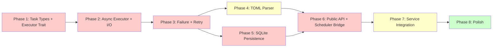

# Orchestration & Scheduled Tasks Development Plan

**Module**: `y-agent` (orchestrator) + `y-scheduler`
**Design References**: [orchestrator-design.md](../design/orchestrator-design.md), [scheduled-tasks-design.md](../design/scheduled-tasks-design.md)
**Date**: 2026-03-22
**Status**: Proposed

---

## Current State

| Metric              | Orchestrator (`y-agent`) | Scheduler (`y-scheduler`) |
| ------------------- | ------------------------ | ------------------------- |
| Source files        | 8                        | 14                        |
| Lines of code       | ~2100                    | ~4800                     |
| Unit tests          | 54 passing               | 64 passing                |
| Async execution     | None                     | Trigger loop only         |
| SQLite persistence  | None                     | None                      |
| Service integration | None                     | None                      |

**Key insight**: Both subsystems have well-structured data models and comprehensive unit tests for those models, but lack any real execution capability. The `CheckpointStorage` trait already exists in `y-core` with 7 async methods, ready for implementation.

---

## Development Phases

```
Phase 1 (TaskNode + Executor Traits)
    |
Phase 2 (Async Executor + I/O Mapping)
    |
Phase 3 (Failure + Retry + Concurrency)
    |          \
Phase 4 (TOML Parser)   Phase 5 (SQLite Persistence)
    |          /              |
Phase 6 (Orchestrator API + Scheduler Integration)
    |
Phase 7 (Service Integration + Event Bus)
    |
Phase 8 (Polish: Superstep, Caching, Observability)
```

---

## Phase 1: TaskNode Enhancement + Executor Trait [High Priority]

> Turn `TaskNode` from a simple DAG node into a type-aware task definition.

### 1.1 Expand TaskNode

#### [MODIFY] [dag.rs](file:///Users/gorgias/Projects/y-agent/crates/y-agent/src/orchestrator/dag.rs)

Add `TaskType` enum and extend `TaskNode`:

```rust
#[derive(Debug, Clone, Serialize, Deserialize)]
#[serde(tag = "type", rename_all = "snake_case")]
pub enum TaskType {
    LlmCall {
        provider_tag: Option<String>,
        system_prompt: Option<String>,
    },
    ToolExecution {
        tool_name: String,
        parameters: serde_json::Value,
    },
    SubAgent {
        agent_id: String,
    },
    SubWorkflow {
        workflow_id: String,
    },
    Script {
        command: String,
        args: Vec<String>,
    },
    HumanApproval,
    Noop, // for testing / placeholder
}

pub struct TaskNode {
    // existing fields ...
    pub task_type: TaskType,
    pub timeout: Option<Duration>,
    pub retry: Option<RetryConfig>,
    pub failure_strategy: FailureStrategy,
}
```

### 1.2 Define TaskExecutor Trait

#### [NEW] [task_executor.rs](file:///Users/gorgias/Projects/y-agent/crates/y-agent/src/orchestrator/task_executor.rs)

```rust
#[async_trait]
pub trait TaskExecutor: Send + Sync {
    async fn execute(
        &self,
        task: &TaskNode,
        inputs: HashMap<String, serde_json::Value>,
        ctx: &mut WorkflowContext,
    ) -> Result<TaskOutput, TaskExecuteError>;

    fn supports(&self, task_type: &TaskType) -> bool;
}
```

### 1.3 Define FailureStrategy + RetryConfig

#### [NEW] [failure.rs](file:///Users/gorgias/Projects/y-agent/crates/y-agent/src/orchestrator/failure.rs)

`FailureStrategy` enum (FailFast, ContinueOnError, Retry, Rollback, Ignore, Compensation) + `RetryConfig` struct (max_attempts, delay, backoff).

### Tests

- T-P1-01: `TaskNode` with `TaskType::LlmCall` serializes/deserializes correctly
- T-P1-02: `TaskNode` with `TaskType::ToolExecution` stores parameters
- T-P1-03: `TaskDag` with typed nodes validates as before (regression)
- T-P1-04: `FailureStrategy` default is `FailFast`
- T-P1-05: `RetryConfig` with exponential backoff calculates correct delays

### Verification

```bash
cargo test -p y-agent --lib -- orchestrator::dag
cargo test -p y-agent --lib -- orchestrator::failure
cargo test -p y-agent --lib -- orchestrator::task_executor
cargo clippy -p y-agent -- -D warnings
```

Estimated effort: **1.5 days**

---

## Phase 2: Async Workflow Executor + I/O Mapping [High Priority]

> Replace the placeholder synchronous executor with real async DAG execution.

### 2.1 Input/Output Mapping

#### [NEW] [io_mapping.rs](file:///Users/gorgias/Projects/y-agent/crates/y-agent/src/orchestrator/io_mapping.rs)

```rust
#[derive(Debug, Clone, Serialize, Deserialize)]
#[serde(tag = "source", rename_all = "snake_case")]
pub enum InputMapping {
    WorkflowInput { field: String },
    TaskOutput { task_id: TaskId, field: String },
    Context { channel: String },
    Constant { value: serde_json::Value },
    Expression { expr: String },
}

#[derive(Debug, Clone, Serialize, Deserialize)]
#[serde(tag = "target", rename_all = "snake_case")]
pub enum OutputMapping {
    WorkflowOutput { field: String },
    Context { channel: String },
    NextTaskInput { task_id: TaskId, field: String },
}
```

Add `inputs: Vec<InputMapping>` and `outputs: Vec<OutputMapping>` to `TaskNode`.

### 2.2 Async Executor Rewrite

#### [MODIFY] [executor.rs](file:///Users/gorgias/Projects/y-agent/crates/y-agent/src/orchestrator/executor.rs)

Rewrite `WorkflowExecutor::execute()`:

1. Validate DAG
2. Initialize channels from workflow inputs
3. Async loop: `ready_tasks()` -> spawn concurrent tasks via `tokio::spawn` (bounded by `max_concurrent_tasks` semaphore)
4. Resolve input mappings before each task -> call `TaskExecutor::execute()` -> apply output mappings
5. Checkpoint after each task completion (call `CheckpointStorage` trait)
6. Check for interrupts -> if raised, persist and return `WorkflowState::Interrupted`
7. On all tasks done, collect workflow outputs, return `Completed`

### 2.3 NoopExecutor for Testing

#### [NEW] [executors/noop.rs](file:///Users/gorgias/Projects/y-agent/crates/y-agent/src/orchestrator/executors/noop.rs)

A `NoopExecutor` that handles `TaskType::Noop` by echoing inputs as outputs. Used for testing the DAG execution flow without real LLM/Tool calls.

### Tests

- T-P2-01: `InputMapping::WorkflowInput` resolves from initial inputs
- T-P2-02: `InputMapping::TaskOutput` resolves from predecessor output
- T-P2-03: `InputMapping::Context` resolves from channel
- T-P2-04: `OutputMapping::Context` writes to channel via reducer
- T-P2-05: Async executor runs 3-task sequential DAG with `NoopExecutor`
- T-P2-06: Async executor runs parallel DAG (`a | b | c`) with concurrency
- T-P2-07: Async executor runs `search >> (analyze | score) >> summarize` correctly
- T-P2-08: Async executor checkpoints after each task
- T-P2-09: Async executor respects `max_concurrent_tasks` semaphore
- T-P2-10: Interrupt during execution transitions to `Interrupted` state

### Verification

```bash
cargo test -p y-agent --lib -- orchestrator::io_mapping
cargo test -p y-agent --lib -- orchestrator::executor
cargo test -p y-agent --lib -- orchestrator::executors
cargo clippy -p y-agent -- -D warnings
```

Estimated effort: **3 days**

---

## Phase 3: Failure Handling + Retry + Concurrency [High Priority]

> Make the executor production-ready with failure strategies and retry.

### 3.1 Retry Loop

#### [MODIFY] [executor.rs](file:///Users/gorgias/Projects/y-agent/crates/y-agent/src/orchestrator/executor.rs)

Wrap task execution in a retry loop:

- On task failure, check `task.retry` config
- Apply backoff strategy (Fixed, Linear, Exponential)
- On max retries exhausted, apply `task.failure_strategy`

### 3.2 Failure Strategy Enforcement

In the executor loop, when a task fails after retries:

- `FailFast` -> abort workflow, set `Failed`
- `ContinueOnError` -> mark task failed, continue scheduling non-dependent tasks
- `Ignore` -> mark task as succeeded, continue
- `Rollback` -> execute compensation tasks in reverse dependency order
- `Compensation` -> execute the specific compensating task

### 3.3 Concurrency Controller

#### [NEW] [concurrency.rs](file:///Users/gorgias/Projects/y-agent/crates/y-agent/src/orchestrator/concurrency.rs)

```rust
pub struct ConcurrencyController {
    global: Semaphore,
    resource_limits: HashMap<ResourceType, Semaphore>,
}

pub enum ResourceType {
    Llm,
    Network,
    Compute,
    Custom(String),
}
```

### Tests

- T-P3-01: Task retries 3 times with exponential backoff on transient error
- T-P3-02: `FailFast` strategy aborts workflow on first task failure
- T-P3-03: `ContinueOnError` continues parallel branch when one fails
- T-P3-04: `Ignore` marks failed task as succeeded
- T-P3-05: Concurrency controller limits global concurrent tasks
- T-P3-06: Concurrency controller limits per-resource tasks

### Verification

```bash
cargo test -p y-agent --lib -- orchestrator::executor
cargo test -p y-agent --lib -- orchestrator::concurrency
cargo test -p y-agent --lib -- orchestrator::failure
cargo clippy -p y-agent -- -D warnings
```

Estimated effort: **2 days**

---

## Phase 4: TOML Workflow Parser [Should-Have]

> Enable complex workflow definitions via TOML configuration.

### 4.1 TOML Schema Definition

#### [NEW] [toml_parser.rs](file:///Users/gorgias/Projects/y-agent/crates/y-agent/src/orchestrator/toml_parser.rs)

Parse TOML workflow definitions into internal `TaskDag` + `WorkflowContext` config. Based on the TOML format already shown in the design doc (schedule configuration).

```toml
[workflow]
name = "research-pipeline"
description = "Search, analyze, and summarize"

[[workflow.tasks]]
id = "search"
name = "Web Search"
type = "tool_execution"
tool_name = "WebSearch"
[workflow.tasks.parameters]
query = "{{ workflow.input.query }}"

[[workflow.tasks]]
id = "analyze"
name = "Analyze Results"
type = "llm_call"
depends_on = ["search"]
[workflow.tasks.inputs]
search_results = { source = "task_output", task_id = "search", field = "results" }
```

### 4.2 Unified WorkflowDefinition

#### [MODIFY] [mod.rs](file:///Users/gorgias/Projects/y-agent/crates/y-agent/src/orchestrator/mod.rs)

```rust
pub enum WorkflowDefinition {
    Detailed(TomlWorkflow),
    Expression(String),
}

impl WorkflowDefinition {
    pub fn to_task_dag(&self) -> Result<(TaskDag, WorkflowContext), WorkflowParseError>;
}
```

### Tests

- T-P4-01: Parse simple TOML workflow with 2 sequential tasks
- T-P4-02: Parse TOML workflow with parallel tasks
- T-P4-03: Parse TOML workflow with input/output mappings
- T-P4-04: Invalid TOML produces clear error message
- T-P4-05: TOML and DSL produce equivalent `TaskDag` for same workflow

### Verification

```bash
cargo test -p y-agent --lib -- orchestrator::toml_parser
cargo clippy -p y-agent -- -D warnings
```

Estimated effort: **2 days**

---

## Phase 5: SQLite Persistence [High Priority]

> Replace all in-memory stores with SQLite-backed persistence.

### 5.1 CheckpointStorage Implementation

#### [NEW] [checkpoint_sqlite.rs](file:///Users/gorgias/Projects/y-agent/crates/y-agent/src/orchestrator/checkpoint_sqlite.rs) or [MODIFY] appropriate `y-storage` file

Implement `y-core::CheckpointStorage` trait using `y-storage` SQLite connection pool.

The trait already defines 7 methods: `write_pending`, `commit`, `read_committed`, `set_interrupted`, `set_completed`, `set_failed`, `prune`.

### 5.2 WorkflowStore SQLite

#### [MODIFY] [workflow_meta.rs](file:///Users/gorgias/Projects/y-agent/crates/y-agent/src/orchestrator/workflow_meta.rs)

Add `SqliteWorkflowStore` implementing a `WorkflowRepository` trait. Keep in-memory `WorkflowStore` for tests.

### 5.3 Scheduler SQLite Store

#### [MODIFY] [store.rs](file:///Users/gorgias/Projects/y-agent/crates/y-scheduler/src/store.rs)

Add `SqliteScheduleStore` implementing a `ScheduleRepository` trait. Replace `Vec<Schedule>` with SQLite tables: `schedules`, `schedule_executions`.

### 5.4 SQLite Migrations

#### [NEW] `migrations/sqlite/` migration files

Create migration files for:

- `workflow_checkpoints` table
- `workflow_templates` table
- `schedules` table
- `schedule_executions` table

### Tests

- T-P5-01: `CheckpointStorage::write_pending` + `commit` round-trips data
- T-P5-02: `CheckpointStorage::read_committed` returns None for unknown workflow
- T-P5-03: `CheckpointStorage::set_interrupted` persists interrupt data
- T-P5-04: `SqliteWorkflowStore` CRUD operations
- T-P5-05: `SqliteScheduleStore` survives reopen
- T-P5-06: `SqliteScheduleStore` execution history queryable

### Verification

```bash
cargo test -p y-agent --lib -- orchestrator::checkpoint_sqlite
cargo test -p y-agent --lib -- orchestrator::workflow_meta
cargo test -p y-scheduler --lib -- store
cargo clippy --workspace -- -D warnings
```

Estimated effort: **3 days**

---

## Phase 6: Orchestrator Public API + Scheduler Integration [High Priority]

> Expose the orchestrator as a service and connect the scheduler to it.

### 6.1 Orchestrator Facade

#### [NEW] [orchestrator.rs](file:///Users/gorgias/Projects/y-agent/crates/y-agent/src/orchestrator/orchestrator.rs)

Top-level `Orchestrator` struct implementing the design's public API:

```rust
impl Orchestrator {
    pub async fn execute(&self, definition: WorkflowDefinition, inputs: HashMap<String, Value>, config: ExecutionConfig) -> Result<ExecutionHandle, OrchestratorError>;
    pub async fn resume(&self, execution_id: &str, command: ResumeCommand) -> Result<ExecutionHandle, OrchestratorError>;
    pub async fn recover(&self, execution_id: &str) -> Result<ExecutionHandle, OrchestratorError>;
    pub async fn cancel(&self, execution_id: &str) -> Result<(), OrchestratorError>;
    pub async fn status(&self, execution_id: &str) -> Result<ExecutionStatus, OrchestratorError>;
    pub async fn register_template(&self, template: WorkflowTemplate) -> Result<String, OrchestratorError>;
    pub async fn list_templates(&self, filter: TemplateFilter) -> Result<Vec<WorkflowTemplate>, OrchestratorError>;
}
```

### 6.2 Scheduler-to-Orchestrator Bridge

#### [MODIFY] [executor.rs](file:///Users/gorgias/Projects/y-agent/crates/y-scheduler/src/executor.rs)

Replace placeholder dispatch with a `WorkflowDispatcher` trait call:

```rust
#[async_trait]
pub trait WorkflowDispatcher: Send + Sync {
    async fn dispatch(
        &self,
        workflow_id: &str,
        parameters: serde_json::Value,
        context: ScheduleContext,
    ) -> Result<String, DispatchError>; // returns execution_id
}
```

Implement `OrchestratorDispatcher` that calls `Orchestrator::execute()`.

### 6.3 Real Cron Parser

#### [MODIFY] [cron.rs](file:///Users/gorgias/Projects/y-agent/crates/y-scheduler/src/cron.rs)

Replace `parse_simple` with the `croner` crate for full 5-field cron expression parsing with timezone support.

### Tests

- T-P6-01: `Orchestrator::execute` runs a 3-task workflow end-to-end
- T-P6-02: `Orchestrator::resume` resumes an interrupted workflow
- T-P6-03: `Orchestrator::recover` re-executes from checkpoint
- T-P6-04: `Orchestrator::cancel` stops a running workflow
- T-P6-05: Scheduler triggers a workflow via `WorkflowDispatcher`
- T-P6-06: Cron expression `0 9 * * MON` parses correctly
- T-P6-07: Cron expression `*/5 * * * *` computes correct next-fire times

### Verification

```bash
cargo test -p y-agent --lib -- orchestrator::orchestrator
cargo test -p y-scheduler --lib -- executor
cargo test -p y-scheduler --lib -- cron
cargo clippy --workspace -- -D warnings
```

Estimated effort: **3 days**

---

## Phase 7: Service Integration + Event Bus [Should-Have]

> Wire orchestrator and scheduler into `y-service` and expose via CLI/GUI.

### 7.1 Service Layer

#### [MODIFY] [container.rs](file:///Users/gorgias/Projects/y-agent/crates/y-service/src/container.rs)

Register `Orchestrator` and `SchedulerManager` in the service container. Create an `OrchestratorService` in `y-service`:

- `create_workflow` / `execute_workflow` / `list_workflows` commands
- `create_schedule` / `list_schedules` / `remove_schedule` commands
- Wire to CLI commands and GUI Tauri commands

### 7.2 Event Bus + Stream Router

#### [NEW] [event_bus.rs](file:///Users/gorgias/Projects/y-agent/crates/y-agent/src/orchestrator/event_bus.rs)

```rust
pub struct EventBus {
    sender: broadcast::Sender<WorkflowEvent>,
}

pub struct StreamRouter {
    mode: StreamMode,
    receiver: broadcast::Receiver<WorkflowEvent>,
}
```

Integrate with executor: emit `WorkflowEvent` variants on task start/complete/fail/interrupt. `StreamRouter` filters based on `StreamMode` before forwarding to clients.

### 7.3 Scheduler Observability

#### [MODIFY] `y-scheduler` files

Add `tracing::instrument` to key operations. Add counters for `schedule.trigger.fired`, `schedule.trigger.missed`, `schedule.active.count`.

### Tests

- T-P7-01: `OrchestratorService` creates and executes a workflow
- T-P7-02: Event bus emits `TaskStarted` / `TaskCompleted` events
- T-P7-03: `StreamMode::Updates` filters out non-delta events
- T-P7-04: `StreamMode::None` delivers only final result
- T-P7-05: Scheduler emits tracing spans for trigger evaluation

### Verification

```bash
cargo test -p y-service -- orchestrator
cargo test -p y-agent --lib -- orchestrator::event_bus
cargo clippy --workspace -- -D warnings
```

Estimated effort: **3 days**

---

## Phase 8: Polish [Nice-to-Have]

> Advanced features that improve production readiness.

### 8.1 Superstep Execution Model

Add `ExecutionModel::Superstep { checkpoint_per_step: bool }` to executor. In superstep mode, batch tasks into synchronized rounds where all results commit atomically.

### 8.2 Task Caching

Add `CacheStrategy` (InputHash, Custom, Composite) to `TaskNode`. Before executing a task, check cache keyed by input hash. On hit, skip execution and return cached output.

### 8.3 Custom Reducers

Add `ChannelType::Custom(Box<dyn Reducer>)` to `channel.rs`. Define `Reducer` trait:

```rust
pub trait Reducer: Send + Sync {
    fn reduce(&self, current: &Value, incoming: Value) -> Value;
}
```

### 8.4 Scheduler Concurrency Policy Enforcement

Strengthen `executor.rs` in `y-scheduler` to fully enforce `ConcurrencyPolicy::skip_if_running`, `queue`, and `cancel_previous`.

### 8.5 Per-Schedule Metadata

Complete `Schedule` struct with `description`, full `tags`, `max_executions_per_hour`, and all policy override fields.

### Verification

```bash
cargo test --workspace
cargo clippy --workspace -- -D warnings
cargo doc --workspace --no-deps
cargo fmt --all
```

Estimated effort: **4 days**

---

## Dependency Graph Summary



Legend: Red = Must-Have, Yellow = Should-Have, Green = Nice-to-Have

---

## Estimated Total Effort

| Phase     | Description                     | Priority     | Effort         |
| --------- | ------------------------------- | ------------ | -------------- |
| Phase 1   | TaskNode + Executor Trait       | Must-Have    | 1.5 days       |
| Phase 2   | Async Executor + I/O Mapping    | Must-Have    | 3 days         |
| Phase 3   | Failure + Retry + Concurrency   | Must-Have    | 2 days         |
| Phase 4   | TOML Workflow Parser            | Should-Have  | 2 days         |
| Phase 5   | SQLite Persistence              | Must-Have    | 3 days         |
| Phase 6   | Public API + Scheduler Bridge   | Must-Have    | 3 days         |
| Phase 7   | Service Integration + Event Bus | Should-Have  | 3 days         |
| Phase 8   | Polish                          | Nice-to-Have | 4 days         |
| **Total** |                                 |              | **~21.5 days** |

---

## Quality Gates (per phase)

```bash
# All four must pass before any phase is considered complete:
cargo clippy --workspace -- -D warnings
cargo check --workspace
cargo doc --workspace --no-deps
cargo fmt --all
```

---

## Open Questions

| #   | Question                                                | Impact                 | Proposed Default                                                          |
| --- | ------------------------------------------------------- | ---------------------- | ------------------------------------------------------------------------- |
| 1   | Should task executors live in `y-agent` or `y-service`? | Separation of concerns | `y-agent` defines trait + Noop; `y-service` implements LLM/Tool executors |
| 2   | Should the TOML parser support template inheritance?    | Feature scope          | Defer to Phase 8                                                          |
| 3   | Maximum checkpoint retention per workflow?              | Storage cost           | Keep last 10 checkpoints, prune older                                     |
| 4   | Should cron parser use `croner` or `cron` crate?        | Dependency choice      | `croner` (lighter, no-std compatible)                                     |
