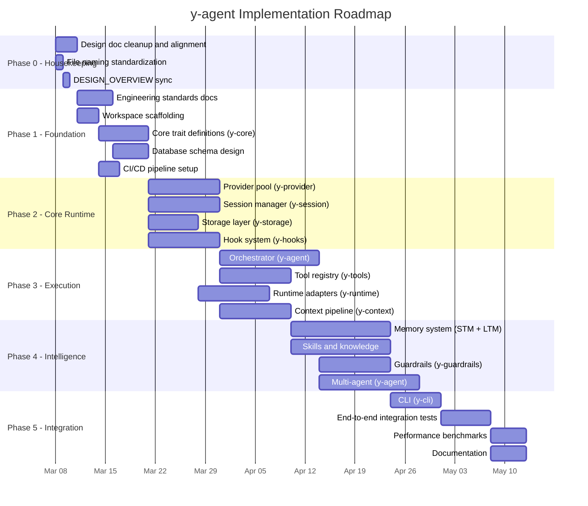

# y-agent Project Plan

**Version**: v0.4
**Created**: 2026-03-08
**Status**: Draft
**Author**: Claude and Gorgias

---

## Overview

This document defines the project plan for y-agent, transitioning from the design phase into implementation. It covers the roadmap, engineering standards, quality gates, and operational processes needed to build a production-grade AI Agent framework on solid software engineering foundations.

The plan is organized into six phases. Each phase has clear entry/exit criteria to ensure no phase begins prematurely.

---

## Current State Assessment

### What We Have

- 23 detailed design documents covering all major subsystems
- Cross-cutting alignment table resolving inter-module conflicts
- Competitive analysis benchmarking against 8 frameworks
- Clear architectural principles (6-layer architecture, trait-first abstractions, declarative config)
- Technology stack decisions (Rust, Tokio, SQLite + PostgreSQL, Docker, Qdrant)

### What We Lack

- Rust workspace and crate scaffolding
- Database schema definitions
- API contract specifications (trait signatures, protobuf/gRPC definitions)
- Development standards (code style, error handling conventions, logging conventions)
- Test strategy and quality gates
- CI/CD pipeline
- Dependency management policy
- Performance benchmarking infrastructure

---

## Roadmap




**Diagram Type Rationale**: Gantt chart chosen to visualize phase dependencies, parallelism opportunities, and critical path.

**Legend**:

- **Phase 0**: Pre-implementation cleanup of existing design artifacts
- **Phase 1**: Engineering infrastructure that all subsequent phases depend on
- **Phase 2**: Core runtime modules with no inter-dependency (parallelizable)
- **Phase 3**: Execution modules that build on Phase 2 foundations
- **Phase 4**: Higher-level intelligence modules
- **Phase 5**: Integration, testing, and release preparation

---

## Phase Details

### Phase 0: Design Housekeeping (Week 1)

**Goal**: Ensure all design documents are clean, consistent, and ready to serve as implementation specifications.

**Deliverables**:

1. **File naming standardization**
  - Rename files missing `-design` suffix (memory-architecture, memory-long-term, memory-short-term, runtime-tools-integration)
  - Rename `diagnostics-observability-v0.2.md` to `diagnostics-observability-design.md` (version in metadata, not filename)
  - Move `competitive-analysis.md` to `docs/research/` (it is not a design doc)
  - Resolve `orchestrator-gap-analysis.md` -- either create it or remove all references
2. **DESIGN_OVERVIEW.md synchronization**
  - Update all file path references to match renamed files
  - Update Component Overview table
  - Update Related Documents section
  - Verify Cross-Cutting Alignment table is current
  - Bump version
3. **CLAUDE.md synchronization**
  - Update Repository Map section with renamed files
  - Update any file references throughout

**Exit Criteria**: All files follow `-design` naming convention, all cross-references resolve, DESIGN_OVERVIEW.md is consistent with filesystem.

---

### Phase 1: Engineering Foundation (Weeks 2-3)

**Goal**: Establish the engineering infrastructure, standards, and core abstractions that all implementation depends on.

#### 1.1 Engineering Standards Document

Create `docs/standards/ENGINEERING_STANDARDS.md` covering:

- **Code style**: `rustfmt.toml` configuration, `clippy.toml` linting rules, naming conventions (already defined in CLAUDE.md Section 6.2)
- **Error handling convention**: Define a project-wide error strategy:
  - `thiserror` for library errors in each crate
  - `anyhow` or custom error types for application-level errors
  - Error propagation patterns (when to wrap, when to pass through)
  - Error code taxonomy by subsystem
- **Logging and tracing convention**:
  - `tracing` crate as the standard instrumentation library
  - Log level guidelines (ERROR/WARN/INFO/DEBUG/TRACE boundaries)
  - Span naming conventions (crate::module::operation)
  - Structured fields policy (what context to include in each span)
- **Configuration convention**:
  - TOML as the configuration format (aligned with design docs)
  - Config struct patterns (serde deserialization, validation, defaults)
  - Environment variable override rules
  - Secrets handling (never in config files, environment-only or vault)
- **Async patterns**:
  - Tokio runtime configuration
  - Cancellation safety guidelines
  - Channel usage patterns (when mpsc vs broadcast vs watch vs oneshot)
  - Task spawning policy (structured concurrency where possible)
- **Dependency policy**:
  - Criteria for adding new dependencies (maintenance status, license, binary size impact)
  - Workspace-level dependency management (`[workspace.dependencies]`)
  - Minimum supported Rust version (MSRV) policy

#### 1.2 Test Strategy Document

Create `docs/standards/TEST_STRATEGY.md` covering:

- **Test pyramid**:
  - Unit tests: in-module `#[cfg(test)]`, mock external dependencies, target >80% coverage for core logic
  - Integration tests: `tests/` directory per crate, real SQLite (in-memory), mock LLM providers
  - End-to-end tests: `tests/e2e/` workspace-level, full system with Docker, scripted scenarios
- **Test naming convention**: `test_{module}_{scenario}_{expected_outcome}`
- **Fixture and test data management**: Shared test fixtures in a `y-test-utils` crate
- **Mock strategy**:
  - Trait-based mocks (manual or `mockall`) for LLM providers, runtime adapters, storage
  - Test doubles for Docker runtime (avoid real container creation in unit tests)
- **Performance test framework**:
  - `criterion` for micro-benchmarks
  - Custom harness for latency percentile tracking (P50/P95/P99)
  - Baseline tracking and regression detection
- **Quality gates** (must pass before merge):
  - All tests pass
  - No new `clippy` warnings
  - Code coverage does not decrease
  - No `unsafe` without documented justification
  - Benchmark regressions flagged (>10% P95 increase)

#### 1.3 Workspace Scaffolding

- Initialize Cargo workspace with all planned crates
- Set up `[workspace.dependencies]` for shared dependencies
- Configure `rustfmt.toml` and `clippy.toml`
- Create `y-core` crate with placeholder trait definitions
- Set up `y-test-utils` crate for shared test infrastructure

#### 1.4 Core Trait Definitions (y-core)

Translate design-level interfaces into Rust trait signatures:

- `RuntimeAdapter` (from runtime-design.md)
- `Tool` and `ToolRegistry` (from tools-design.md)
- `MemoryClient` (from memory-architecture.md)
- `CheckpointStorage` (from orchestrator-design.md)
- `Provider` and `ProviderPool` (from providers-design.md)
- `SessionStore` (from context-session-design.md)
- `HookPoint`, `Middleware` (from hooks-plugin-design.md)
- `Skill`, `SkillRegistry` (from skills-knowledge-design.md)

This is a critical deliverable. The trait definitions serve as the contract between all crates. Spend time getting these right before proceeding.

#### 1.5 Database Schema Design

Create `docs/schema/` with:

- **SQLite operational schema**: Sessions, checkpoints, workflows, file journal, tool/agent/schedule stores, STM
- **PostgreSQL analytics schema**: Traces, observations, scores, cost records, diagnostics
- **Vector store schema**: Qdrant collection definitions for LTM and Knowledge Base
- **Migration strategy**: `sqlx` with versioned migrations in `migrations/` directory
- **Schema review criteria**: Normalize to 3NF minimum, explicit foreign keys, index strategy documented

#### 1.6 CI/CD Pipeline

- GitHub Actions workflow:
  - `cargo check` + `cargo clippy` on every push
  - `cargo test` (unit + integration) on every PR
  - `cargo fmt --check` formatting verification
  - Coverage report generation
  - Benchmark comparison on PRs touching performance-critical paths
- Branch protection: require CI pass + 1 review for main

**Exit Criteria**: Standards documents reviewed and accepted. Workspace compiles. Core traits defined and documented. Database schemas reviewed. CI pipeline green.

---

### Phase 2: Core Runtime (Weeks 4-6)

**Goal**: Implement the foundational modules that have no upstream dependencies beyond y-core.

These four modules can be developed in parallel because they depend only on y-core traits:

#### 2.1 Provider Pool (y-provider)

- Provider registration, health checking, freeze/thaw
- Tag-based routing
- Concurrency limits and rate limiting
- Provider-level metrics emission

**Key design reference**: [providers-design.md](../design/providers-design.md)

#### 2.2 Session Manager (y-session)

- Session tree structure (parent/child/branch)
- JSONL persistence
- Session metadata and lifecycle
- Context window tracking

**Key design reference**: [context-session-design.md](../design/context-session-design.md)

#### 2.3 Storage Layer (y-storage)

- SQLite connection pool with WAL mode
- Migration runner
- Checkpoint read/write operations
- PostgreSQL connection pool for diagnostics
- Generic repository traits

**Key design reference**: [orchestrator-design.md](../design/orchestrator-design.md), database schema from Phase 1

#### 2.4 Hook System (y-hooks)

- Hook point registration
- Middleware chain execution (Context, Tool, LLM, Compaction, Memory)
- Event bus (async, fire-and-forget)
- Plugin loading skeleton

**Key design reference**: [hooks-plugin-design.md](../design/hooks-plugin-design.md)

**Exit Criteria**: Each module has unit tests, integration tests with real SQLite, and passes CI. Provider pool can route requests. Sessions can be created, branched, and persisted. Storage layer handles migrations and CRUD. Hook system can register and execute middleware chains.

---

### Phase 3: Execution Layer (Weeks 7-9)

**Goal**: Build the execution modules that combine Phase 2 foundations into working pipelines.

#### 3.1 Orchestrator (y-agent)

- DAG engine with typed channels
- Checkpoint manager (pending/committed separation)
- Interrupt/resume protocol
- Expression DSL parser (basic subset first)
- Integration with provider pool and hook system

**Key design reference**: [orchestrator-design.md](../design/orchestrator-design.md)

#### 3.2 Tool Registry (y-tools)

- Tool registration (built-in, MCP, custom)
- Lazy loading with ToolIndex
- Parameter validation
- Tool execution pipeline (through ToolMiddleware)

**Key design reference**: [tools-design.md](../design/tools-design.md)

#### 3.3 Runtime Adapters (y-runtime)

- Native runtime (direct execution with capability checks)
- Docker runtime (container lifecycle, image whitelist)
- SSH runtime (skeleton, can be deferred)
- Capability-based permission enforcement

**Key design reference**: [runtime-design.md](../design/runtime-design.md)

#### 3.4 Context Pipeline (y-context)

- Context assembly middleware chain
- Token budget enforcement
- Compaction strategies
- Prompt section assembly
- User input enrichment:
  - EnrichmentMiddleware at priority 50 (first pipeline stage)
  - TaskIntentAnalyzer sub-agent for ambiguity detection and completeness scoring
  - Interactive clarification via Orchestrator interrupt/resume (ChoiceList, Confirmation, ParameterRequest)
  - Input replacement semantics (enriched input replaces original in session history; original preserved in audit log)
  - EnrichmentPolicy with 4 modes (always/auto/never/first_only)
  - Heuristic pre-filter to skip clear inputs without LLM cost

**Key design references**: [context-session-design.md](../design/context-session-design.md), [prompt-design.md](../design/prompt-design.md), [input-enrichment-design.md](../design/input-enrichment-design.md)

**Exit Criteria**: Orchestrator can execute a simple DAG with tool calls. Tools can be registered, discovered, and executed through the middleware chain. Docker runtime can launch and manage containers. Context pipeline assembles prompts within token budgets. Enrichment middleware can analyze user input, trigger clarification, and replace original input with enriched version.

---

### Phase 4: Intelligence Layer (Weeks 10-13)

**Goal**: Add the higher-level intelligence capabilities that make the system an "agent" rather than just an execution engine.

#### 4.1 Memory System

- Short-term memory (session-scoped, SQLite-backed)
- Long-term memory (vector store, semantic retrieval)
  - Two-phase deduplication (content-hash fast path + LLM 4-action model)
  - Structured observation schema for extraction output
  - Intent-aware query decomposition (TypedQuery) for recall
  - Search Orchestrator with multi-strategy fallback (Vector -> Hybrid -> Keyword)
- Working memory (pipeline-scoped, in-memory)
- Memory middleware for context injection

**Key design references**: [memory-architecture-design.md](../design/memory-architecture.md), [memory-short-term-design.md](../design/memory-short-term.md), [memory-long-term-design.md](../design/memory-long-term.md)

#### 4.2 Skills and Knowledge

- Skill registry with lazy loading
- Skill manifest parsing (TOML)
- Knowledge base ingestion pipeline with L0/L1/L2 multi-resolution content
- Skill versioning (Git-like)

**Key design references**: [skills-knowledge-design.md](../design/skills-knowledge-design.md), [knowledge-base-design.md](../design/knowledge-base-design.md)

#### 4.3 Guardrails (y-guardrails)

- Pre/post validators as middleware
- LoopGuard pattern detection
- Taint tracking
- Unified permission model (allow/notify/ask/deny)
- HITL escalation protocol

**Key design reference**: [guardrails-hitl-design.md](../design/guardrails-hitl-design.md)

#### 4.4 Multi-Agent (y-multi-agent)

- Agent definitions (TOML)
- Agent pool management
- Delegation protocol
- Sequential and hierarchical collaboration patterns (P2P and micro-agent pipeline can be deferred)

**Key design reference**: [multi-agent-design.md](../design/multi-agent-design.md)

**Exit Criteria**: Agent can recall relevant memories from previous sessions. Skills can be loaded and influence agent behavior. Guardrails prevent unsafe operations. Two agents can collaborate on a task via delegation.

---

### Phase 5: Integration and Release (Weeks 14-16)

**Goal**: Wire everything together, build the user-facing CLI, and validate end-to-end.

#### 5.1 CLI (y-cli)

- clap-based command structure
- Interactive session mode
- Configuration management
- Status and diagnostics commands

**Key design reference**: [client-commands-design.md](../design/client-commands-design.md)

#### 5.2 End-to-End Integration Tests

- Scripted multi-turn conversation scenarios
- Tool execution through Docker runtime
- Checkpoint and recovery scenarios
- Multi-agent delegation scenarios
- Memory recall across sessions

#### 5.3 Performance Benchmarks

- Tool dispatch latency (target: P95 < 100ms)
- Session recovery time (target: < 5 seconds)
- Context assembly latency
- Provider routing latency
- Memory retrieval latency

#### 5.4 Documentation

- `README.md` with quickstart guide
- Configuration reference
- Tool authoring guide
- Skill authoring guide
- Architecture overview for contributors

**Exit Criteria**: CLI can run a full agent session. All P95 latency targets met. E2E tests cover critical paths. Documentation sufficient for a new contributor to get started.

---

## Cross-Phase Concerns

### Dependency Direction Enforcement

All crates depend inward on `y-core`. No lateral dependencies between peer crates. Enforce with:

- `cargo deny` for dependency graph validation
- CI check that no crate imports a peer (except through y-core traits)

```
y-cli --> y-agent --> y-core <-- y-provider
                  --> y-core <-- y-session
                  --> y-core <-- y-storage
                  --> y-core <-- y-hooks
                  --> y-core <-- y-tools
                  --> y-core <-- y-runtime
                  --> y-core <-- y-context
                  --> y-core <-- y-guardrails
                  --> y-core <-- y-multi-agent
                  --> y-core <-- y-skills
```

### Feature Flag Strategy

Every non-trivial subsystem gates behind a Cargo feature flag:

- `provider-openai`, `provider-anthropic`, `provider-ollama` -- per-provider features
- `runtime-docker`, `runtime-ssh` -- runtime backend features
- `memory-ltm`, `memory-stm` -- memory tier features
- `vector-qdrant` -- vector store backend features
- `diagnostics-pg` -- PostgreSQL diagnostics (optional, can run SQLite-only)
- `input-enrichment` -- pre-loop user input enrichment and interactive clarification

This enables:

- Independent rollback of subsystems
- Minimal binary for testing (only enable what you need)
- Reduced compile times during development

### Versioning Strategy

- Workspace-level version in root `Cargo.toml`
- Follow SemVer: 0.x.y during initial development, 1.0.0 when API stabilizes
- Design documents carry their own version (independent of code version)
- Git tags for releases: `v0.1.0`, `v0.2.0`, etc.

### Risk Mitigation


| Risk                                                | Likelihood | Impact | Mitigation                                                                                      |
| --------------------------------------------------- | ---------- | ------ | ----------------------------------------------------------------------------------------------- |
| Trait definitions change frequently in early phases | High       | Medium | Expect 2-3 iterations of y-core traits during Phase 2; keep dependent code behind feature flags |
| Docker runtime complexity delays Phase 3            | Medium     | High   | Native runtime is sufficient for development; Docker can be deferred                            |
| LLM API breaking changes                            | Medium     | Medium | Provider trait abstraction isolates impact; freeze mechanism handles runtime failures           |
| SQLite performance limits at scale                  | Low        | Medium | Schema design includes migration path to PostgreSQL for operational data                        |
| Single-developer throughput bottleneck              | High       | High   | Prioritize Phase 2 modules by dependency criticality; defer non-blocking features               |

