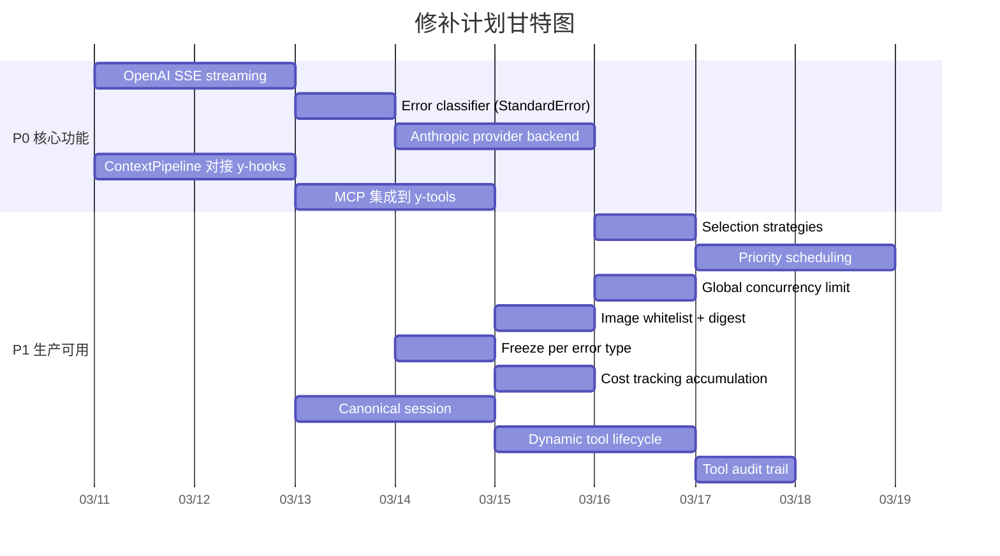
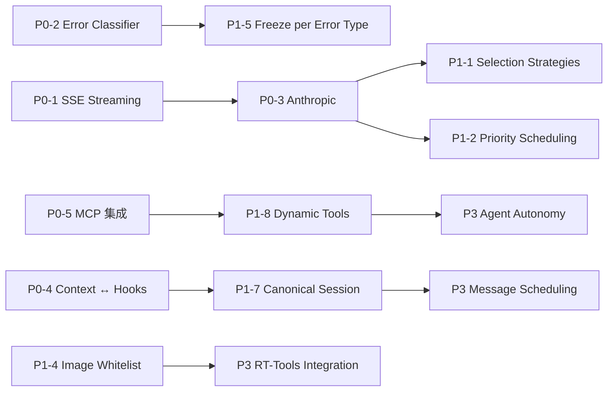

# 设计缺失修补计划 (Remediation Plan)

> 基于 2026-03-10 全量审计，覆盖 `docs/design/` 27 份设计文档 vs 20 个 crate

---

## 修补阶段总览

---

## P0 — 核心功能修补（影响 MVP）

### P0-1: OpenAI Streaming (SSE)

**设计文档**: [providers-design.md](file:///Users/gorgias/Projects/y-agent/docs/design/providers-design.md)
**涉及 crate**: `y-provider`

**现状**: `chat_completion_stream()` 返回 `Err("streaming not yet implemented")`

**修补内容**:
- 实现 SSE (Server-Sent Events) 解析器
- 在 `OpenAiProvider` 中实现 `chat_completion_stream`
- 解析 `data: [DONE]` 终止信号
- 支持 `ChatStreamChunk` 逐块输出
- 支持 tool_calls 在 streaming 中的增量组装

**修改文件**:
- `crates/y-provider/src/providers/openai.rs` — SSE 流解析逻辑
- `crates/y-core/src/provider.rs` — 确认 `ChatStream` 类型定义完备

**验证**: 单元测试模拟 SSE 响应 + 集成测试（需 mock HTTP server）

---

### P0-2: Error Classifier (StandardError)

**设计文档**: [providers-design.md](file:///Users/gorgias/Projects/y-agent/docs/design/providers-design.md) §Error Classification
**涉及 crate**: `y-provider`

**现状**: 无错误分类器，`report_error` 仅用 `ErrorSeverity` 简单区分

**修补内容**:
- 新增 `error_classifier.rs`
- 定义 `StandardError` 枚举（ContextWindowExceeded / RateLimited / QuotaExhausted / AuthenticationFailed / KeyInvalid / InsufficientBalance / ModelNotFound / ServerError / NetworkError / ContentFiltered / Unknown）
- 基于 HTTP status code + error body regex 的分类逻辑
- 各 provider 错误先归一化为 `StandardError`，再驱动 freeze 决策

**修改文件**:
- `crates/y-provider/src/error_classifier.rs` — [NEW]
- `crates/y-provider/src/pool.rs` — `report_error` 改用分类器
- `crates/y-provider/src/lib.rs` — 导出

---

### P0-3: Anthropic Provider Backend

**设计文档**: [providers-design.md](file:///Users/gorgias/Projects/y-agent/docs/design/providers-design.md) §Provider Types
**涉及 crate**: `y-provider`

**现状**: 仅 OpenAI-compatible，无 Anthropic Messages API 支持

**修补内容**:
- 新增 `providers/anthropic.rs`
- 实现 Anthropic Messages API 格式（system 分离、content blocks）
- 实现 `LlmProvider` trait
- 支持 streaming（SSE 格式与 OpenAI 不同）
- `x-api-key` header 认证

**修改文件**:
- `crates/y-provider/src/providers/anthropic.rs` — [NEW]
- `crates/y-provider/src/providers/mod.rs` — 添加 `anthropic` module
- `crates/y-cli/src/wire.rs` — 添加 `"anthropic"` 分支

---

### P0-4: ContextPipeline 对接 y-hooks Middleware Chain

**设计文档**: [context-session-design.md](file:///Users/gorgias/Projects/y-agent/docs/design/context-session-design.md) §Pipeline Stages
**涉及 crate**: `y-context`, `y-hooks`

**现状**: `ContextPipeline` 使用独立的 `ContextProvider` trait，未对接 `y-hooks` 的 `MiddlewareChain`

**修补内容**:
- 将 `ContextProvider` 适配为 `y-hooks` 的 `ContextMiddleware`
- 或创建一个适配器桥接两者
- 按设计文档 priority 值注册各 stage (100-700)
- 实现 `InjectContextStatus` stage (priority 700)

**修改文件**:
- `crates/y-context/src/pipeline.rs` — 适配/桥接逻辑
- `crates/y-context/src/context_status.rs` — [NEW] 上下文状态注入

---

### P0-5: MCP 集成到 y-tools

**设计文档**: [tools-design.md](file:///Users/gorgias/Projects/y-agent/docs/design/tools-design.md) §MCP Tool Discovery
**涉及 crate**: `y-tools`, `y-mcp`

**现状**: `y-mcp` crate 存在（client/discovery/tool_adapter/transport），但未与 `y-tools` 的 `ToolRegistryImpl` 集成

**修补内容**:
- 在 `ToolRegistryImpl` 启动时调用 `y-mcp` discovery
- 将 MCP 工具通过 `McpToolAdapter` 注册为标准 `Tool`
- 工具名前缀 `mcp_{server}_{tool}` 避免冲突
- 配置文件增加 MCP server 列表

**修改文件**:
- `crates/y-tools/src/registry.rs` — MCP 自动发现集成
- `crates/y-tools/Cargo.toml` — 添加 `y-mcp` 依赖
- `config/tools.example.toml` — MCP server 配置示例

---

## P1 — 生产可用修补

### P1-1: Selection Strategies

**设计文档**: [providers-design.md](file:///Users/gorgias/Projects/y-agent/docs/design/providers-design.md) §Tag-Based Routing
**涉及 crate**: `y-provider`

**现状**: 仅 Priority (声明顺序) 策略

**修补内容**:
- 在 `router.rs` 添加 `SelectionStrategy` 枚举
- 实现 `Random`, `LeastLoaded`, `RoundRobin`, `CostOptimized` 策略
- `ProviderPoolConfig` 增加 `selection_strategy` 字段
- `providers.example.toml` 添加配置项

**修改文件**:
- `crates/y-provider/src/router.rs`
- `crates/y-provider/src/config.rs`
- `config/providers.example.toml`

---

### P1-2: Priority Scheduling (Critical/Normal/Idle)

**设计文档**: [providers-design.md](file:///Users/gorgias/Projects/y-agent/docs/design/providers-design.md) §Concurrency Model
**涉及 crate**: `y-provider`

**修补内容**:
- 新增 `scheduler.rs` 实现 `PriorityScheduler`
- 三个优先级队列 (Critical / Normal / Idle)
- 每 provider 保留 20% 容量给 Critical
- `RouteRequest` 增加 `priority` 字段

**修改文件**:
- `crates/y-provider/src/scheduler.rs` — [NEW]
- `crates/y-provider/src/pool.rs` — 集成调度器
- `crates/y-core/src/provider.rs` — `RouteRequest` 增加 priority

---

### P1-3: Global Concurrency Limit

**设计文档**: [providers-design.md](file:///Users/gorgias/Projects/y-agent/docs/design/providers-design.md) §Concurrency Model
**涉及 crate**: `y-provider`

**修补内容**:
- `ProviderPoolImpl` 增加全局 `Semaphore`
- 请求需同时获取 per-provider + global permit
- 配置: `max_global_concurrency`

**修改文件**:
- `crates/y-provider/src/pool.rs`
- `crates/y-provider/src/config.rs`

---

### P1-4: Image Whitelist + Digest Verification

**设计文档**: [runtime-design.md](file:///Users/gorgias/Projects/y-agent/docs/design/runtime-design.md) §Image Whitelist
**涉及 crate**: `y-runtime`

**修补内容**:
- 新增 `image_whitelist.rs`
- `WhitelistEntry`: image name, allowed tags, expected digest, allow_pull
- Docker 执行前校验镜像是否在白名单
- Digest 不匹配时拒绝执行并记录安全事件

**修改文件**:
- `crates/y-runtime/src/image_whitelist.rs` — [NEW]
- `crates/y-runtime/src/docker.rs` — 执行前调用白名单校验
- `config/runtime.example.toml` — 补充 digest 配置

---

### P1-5: Adaptive Freeze per Error Type

**设计文档**: [providers-design.md](file:///Users/gorgias/Projects/y-agent/docs/design/providers-design.md) §Freeze Durations
**涉及 crate**: `y-provider`

**修补内容**:
- `FreezeManager` 接受 `StandardError` 来决定 freeze 时长
- 按错误类型分级: RateLimit 60s / ServerError 5min / Auth 24h / KeyInvalid permanent
- 支持 Retry-After header 覆盖

**修改文件**:
- `crates/y-provider/src/freeze.rs`
- 依赖 P0-2 的 `error_classifier.rs`

---

### P1-6: Cost Tracking Accumulation

**设计文档**: [providers-design.md](file:///Users/gorgias/Projects/y-agent/docs/design/providers-design.md) §Observability
**涉及 crate**: `y-provider`

**修补内容**:
- `ProviderMetrics` 增加 `estimated_cost` 累计字段
- 每次请求完成后按 `cost_per_1k_input/output` 计算成本
- 可选: cost limit freeze（预算耗尽自动冻结）

**修改文件**:
- `crates/y-provider/src/metrics.rs`
- `crates/y-provider/src/pool.rs`

---

### P1-7: Canonical Session (Cross-Channel)

**设计文档**: [context-session-design.md](file:///Users/gorgias/Projects/y-agent/docs/design/context-session-design.md) §Session Types
**涉及 crate**: `y-session`

**修补内容**:
- 新增 `canonical.rs`
- 实现 `CanonicalSessionManager`：link 多个 channel session 到一个统一视图
- 消息合并和时间排序

**修改文件**:
- `crates/y-session/src/canonical.rs` — [NEW]
- `crates/y-session/src/manager.rs` — 集成
- `crates/y-storage/src/session_store.rs` — 增加 canonical 关联查询

---

### P1-8: Dynamic Tool Lifecycle

**设计文档**: [tools-design.md](file:///Users/gorgias/Projects/y-agent/docs/design/tools-design.md) §Dynamic Tool Lifecycle
**涉及 crate**: `y-tools`

**修补内容**:
- 新增 `dynamic.rs`
- `DynamicToolDefinition` 支持三种实现: Script, HttpApi, Composite
- `tool_create` / `tool_update` / `tool_delete` meta-tools
- Sandbox-by-default: 动态工具必须经 Runtime 执行

**修改文件**:
- `crates/y-tools/src/dynamic.rs` — [NEW]
- `crates/y-tools/src/builtin/mod.rs` — 注册 meta-tools
- `crates/y-tools/src/registry.rs` — 动态注册/注销

---

### P1-9: Tool Audit Trail

**设计文档**: [tools-design.md](file:///Users/gorgias/Projects/y-agent/docs/design/tools-design.md) §Tool Execution Flow
**涉及 crate**: `y-tools`

**修补内容**:
- `ToolExecutor` 在执行前/后发布 `EventBus` 事件
- 记录: tool_name, args hash, duration, result status, resource usage
- 对接 `y-diagnostics` 的 `DiagnosticsSubscriber`

**修改文件**:
- `crates/y-tools/src/executor.rs` — 添加审计事件发布
- `crates/y-tools/Cargo.toml` — 添加 `y-hooks` 依赖

---

## P2 — 增强功能修补

| # | 修补项 | 涉及文件 | 工作量 |
|---|--------|---------|--------|
| 15 | Gemini provider backend | `providers/gemini.rs` [NEW] | 2 天 |
| 16 | Ollama provider backend | `providers/ollama.rs` [NEW] | 1 天 |
| 17 | Azure OpenAI provider backend | `providers/azure.rs` [NEW] | 1 天 |
| 18 | Superstep execution model | `y-agent-core/src/executor.rs` | 2 天 |
| 19 | WorkflowStore (template persistence) | `y-agent-core/src/workflow_store.rs` [NEW] | 1.5 天 |
| 20 | TOML workflow definition parser | `y-agent-core/src/workflow_parser.rs` [NEW] | 2 天 |
| 21 | Plugin dynamic loading (libloading) | `y-hooks/src/plugin.rs` | 2 天 |
| 22 | AuditTrail + ResourceMonitor | `y-runtime/src/audit.rs` + `resource_monitor.rs` [NEW] | 2 天 |
| 23 | NativeRuntime sandbox (bubblewrap) | `y-runtime/src/native.rs` | 2 天 |
| 24 | Docker security hardening | `y-runtime/src/docker.rs` | 1 天 |
| 25 | RateLimiter (per-tool) | `y-tools/src/rate_limiter.rs` [NEW] | 1 天 |
| 26 | ResultFormatter | `y-tools/src/formatter.rs` [NEW] | 1 天 |
| 27 | Taint → Orchestrator channel propagation | `y-guardrails/src/taint.rs` + `y-agent-core/src/channel.rs` | 1 天 |
| 28 | Structural guardrails (config-time) | `y-guardrails/src/structural.rs` [NEW] | 1 天 |
| 29 | Ephemeral sessions (TTL) | `y-session/src/manager.rs` | 1 天 |
| 30 | InjectContextStatus stage | `y-context/src/context_status.rs` [NEW] | 0.5 天 |
| 31 | Health endpoint (HTTP API) | `y-cli/src/commands/health.rs` [NEW] | 1 天 |
| 32 | PostgreSQL diagnostics backend | `y-diagnostics/src/pg_store.rs` [NEW] | 2 天 |
| 33 | Observability metrics (Prometheus) | `y-provider/src/metrics_export.rs` [NEW] | 2 天 |
| 34 | Request lease management | `y-provider/src/lease.rs` [NEW] | 1 天 |

---

## P3 — 高级/未来功能

| # | 修补项 | 对应设计文档 | 备注 |
|---|--------|------------|------|
| 35 | Input enrichment sub-agent | `input-enrichment-design.md` | 需先完成 micro-agent |
| 36 | Micro-agent pipeline | `micro-agent-pipeline-design.md` | 需先完成 orchestrator |
| 37 | Message scheduling queue modes | `message-scheduling-design.md` | 需先完成 canonical session |
| 38 | Agent autonomy (dynamic CRUD) | `agent-autonomy-design.md` | 需先完成 dynamic tools |
| 39 | Skill versioning + evolution | `skill-versioning-evolution-design.md` | 需先完成 y-skills 基础 |
| 40 | Runtime-Tools integration layer | `runtime-tools-integration-design.md` | 需先完成 P1-4 |
| 41 | CapabilityGapMiddleware | `multi-agent-design.md` | 需先完成 agent autonomy |
| 42 | Expression DSL for workflows | `orchestrator-design.md` | 最后实现 |

---

## 依赖关系

---

## 质量门

每个修补项必须满足：

- [ ] `cargo test -p <crate>` 全部通过
- [ ] `cargo clippy -p <crate> -- -D warnings` 无警告
- [ ] 新代码覆盖率 ≥ 80%
- [ ] lib 代码无 `unwrap()`
- [ ] 更新对应 `config/*.example.toml`（如涉及配置变更）
