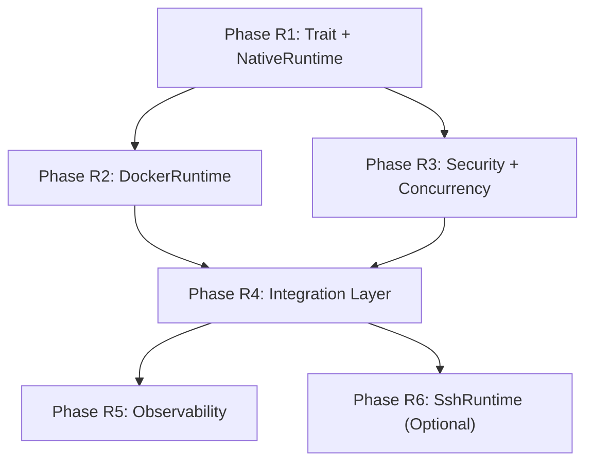

# Runtime Module Remediation Plan

> Audit results and phased development plan for `y-runtime`

**Version**: v0.1
**Created**: 2026-03-11
**Status**: Draft

---

## 1. Audit Summary

The `y-runtime` crate has a solid structural foundation — 13 source files, ~40 unit tests, and all code compiles cleanly. However, substantial gaps remain between the current implementation and the design documents (`runtime-design.md`, `runtime-tools-integration-design.md`).

### What Is Implemented

| Component | Status | Notes |
|-----------|--------|-------|
| `RuntimeAdapter` trait (y-core) | ✅ Partial | 4 methods: `execute`, `health_check`, `backend`, `cleanup` |
| `RuntimeCapability` model (y-core) | ✅ Complete | `NetworkCapability`, `FilesystemCapability`, `ContainerCapability`, `ProcessCapability` |
| `ExecutionRequest` / `ExecutionResult` | ✅ Complete | Core data structures in place |
| `RuntimeError` (y-core + y-runtime) | ✅ Complete | Full error mapping between module and core |
| `NativeRuntime` | ✅ Working | Real process execution with timeout and output limiting |
| `DockerRuntime` | ⚠️ Skeleton | Compiles, but `execute()` returns `RuntimeNotAvailable`; no Docker API integration |
| `SshRuntime` | ⚠️ Placeholder | Returns `RuntimeNotAvailable` for all operations |
| `RuntimeManager` | ✅ Partial | Backend selection + dispatch + fallback logic works |
| `CapabilityChecker` | ✅ Working | 4-type validation (network, filesystem, container, process) + resource capping |
| `ImageWhitelist` | ✅ Working | Structured whitelist with tag restriction, digest verification, pull control |
| `AuditTrail` | ✅ Working | In-memory ring-buffer, query by type/actor, serialization |
| `ResourceMonitor` | ✅ Working | Threshold-based monitoring with violation detection |
| `IntegrationManager` | ✅ Partial | Context building, 4-layer capability check, placeholder execution |
| `RuntimeConfig` | ✅ Working | Configuration with serde, humantime duration parsing |
| `cleanup.rs` | ✅ Working | Multi-backend cleanup utility |
| `error.rs` | ✅ Working | Module-level error types + From conversion |

### What Is Missing

| Design Requirement | Gap | Severity |
|-------------------|-----|----------|
| **`spawn`/`kill`/`status` methods on RuntimeAdapter** | Design specifies 6 methods; trait has 4. `spawn`, `kill`, `status` (for long-running processes) and `name()` not implemented. | Medium |
| **DockerRuntime real execution** | No `bollard` dependency, no Docker daemon interaction, no container lifecycle | Critical |
| **Container security hardening** | Read-only rootfs, `no-new-privileges`, Linux capability dropping, network mode config — all missing | High |
| **ContainerConfig** | Design specifies `ContainerConfig` struct (name_prefix, mounts, network_mode, auto_remove, resources) — not implemented as a separate data model | Medium |
| **NativeRuntime bubblewrap sandboxing** | No `bwrap` integration; all native execution runs unsandboxed | High |
| **SshRuntime real execution** | Completely stubbed; no SSH client integration | Medium (Phase 4) |
| **SecurityPolicy module** | Design has a dedicated `SecurityPolicy` for enforcement — not present as a distinct module | Medium |
| **AuditTrail integration with execution** | AuditTrail exists but is not wired into execution flows (`NativeRuntime`/`DockerRuntime` do not log to it) | High |
| **ResourceMonitor integration with execution** | ResourceMonitor exists but is not used by any runtime adapter | High |
| **Image pull approval flow** | Design specifies auto/manual/reject approval; only whitelist deny/allow exists | Low |
| **Concurrent execution limit** | Design specifies global concurrency control (default 10); not implemented | Medium |
| **Execution metrics (observability)** | Design specifies 9 metrics (counters, histograms, gauges) — none emitted | Medium |
| **Structured JSON audit log** | Design specifies structured JSON with caller info, container info, command, result — current AuditTrail is simpler | Low |
| **Path traversal protection** | Design specifies canonicalize + starts_with check — not implemented | High |
| **ResourceUsage collection** | `ExecutionResult.resource_usage` always defaults; NativeRuntime doesn't collect actual CPU/memory | Medium |
| **Working directory validation** | Design requires working_dir validation against allowed paths | Medium |

---

## 2. Phased Development Plan

### Phase R1: Core Trait Alignment and NativeRuntime Hardening (Week 1)

Align the `RuntimeAdapter` trait with the design, add process management, and harden `NativeRuntime`.

#### R1.1 — Extend `RuntimeAdapter` trait

##### [MODIFY] [runtime.rs](file:///Users/gorgias/Projects/y-agent/crates/y-core/src/runtime.rs)

- Add `name(&self) -> &str` method to the trait
- Add `spawn()`, `kill()`, `status()` methods for long-running process management
- Add `ProcessHandle` and `ProcessStatus` types

```rust
pub struct ProcessHandle {
    pub id: String,
    pub backend: RuntimeBackend,
}

pub enum ProcessStatus {
    Running,
    Completed { exit_code: i32 },
    Failed { error: String },
    Unknown,
}
```

#### R1.2 — Path traversal protection

##### [MODIFY] [native.rs](file:///Users/gorgias/Projects/y-agent/crates/y-runtime/src/native.rs)

- Add `validate_working_dir()` that canonicalizes and checks against allowed paths
- Reject execution if `working_dir` is outside allowed paths
- Log `PathTraversalAttempt` security event on violation

#### R1.3 — NativeRuntime bubblewrap sandboxing

##### [MODIFY] [native.rs](file:///Users/gorgias/Projects/y-agent/crates/y-runtime/src/native.rs)

- Add bubblewrap (`bwrap`) support behind a feature flag `sandbox_bwrap`
- Build `bwrap` command with:
  - System dirs (`/usr`, `/lib`, `/lib64`) mounted read-only
  - Workspace as only writable directory
  - Optional `--unshare-net` for network isolation
  - No home directory access
- Detect `bwrap` availability at runtime; fall back to plain execution with a warning

#### R1.4 — Wire AuditTrail into NativeRuntime

##### [MODIFY] [native.rs](file:///Users/gorgias/Projects/y-agent/crates/y-runtime/src/native.rs)

- Accept `AuditTrail` as constructor parameter (via `Arc<AuditTrail>`)
- Log `ExecutionCompleted` events after each execution
- Log `CapabilityDenied` and `PathTraversalAttempt` on failures

##### [MODIFY] [manager.rs](file:///Users/gorgias/Projects/y-agent/crates/y-runtime/src/manager.rs)

- Pass shared `AuditTrail` to runtime backends
- Update `RuntimeManager::new()` to accept `AuditTrail`

**Tests (R1)**:

| Test ID | Description | File |
|---------|-------------|------|
| T-R1-01 | `spawn` returns `ProcessHandle` for NativeRuntime | `native.rs` |
| T-R1-02 | `kill` terminates a spawned process | `native.rs` |
| T-R1-03 | `status` reports `Running`/`Completed` correctly | `native.rs` |
| T-R1-04 | Path traversal with `../` is rejected | `native.rs` |
| T-R1-05 | Path traversal with symlink is rejected | `native.rs` |
| T-R1-06 | `name()` returns `"native"` / `"docker"` / `"ssh"` | all adapters |
| T-R1-07 | AuditTrail records execution event after NativeRuntime execution | `native.rs` |
| T-R1-08 | Bubblewrap fallback logs warning when `bwrap` unavailable | `native.rs` |

**Verification**:
```bash
cargo test -p y-runtime -- --test-threads=1
cargo clippy -p y-runtime -- -D warnings
```

---

### Phase R2: DockerRuntime Full Implementation (Weeks 2–3)

Implement real Docker daemon interaction using `bollard`.

#### R2.1 — Add bollard dependency

##### [MODIFY] [Cargo.toml](file:///Users/gorgias/Projects/y-agent/crates/y-runtime/Cargo.toml)

- Add `bollard` dependency behind `runtime_docker` feature flag
- Add `futures-util` for streaming Docker logs

#### R2.2 — Implement container lifecycle

##### [MODIFY] [docker.rs](file:///Users/gorgias/Projects/y-agent/crates/y-runtime/src/docker.rs)

Complete container lifecycle:
1. **Image management**: Check local image, pull if allowed and whitelisted, verify digest
2. **Container creation**: Build `CreateContainerOptions` with:
   - Resource limits (CPU, memory from `RuntimeCapability`)
   - Read-only rootfs (`ReadonlyRootfs: true`)
   - `no-new-privileges` security opt
   - Drop all Linux capabilities; add back per `RuntimeCapability`
   - Network mode from `NetworkCapability` (none/bridge/host)
   - Bind mounts from `FilesystemCapability`
   - Auto-labeling with `y-agent.managed=true`
3. **Execution**: Start → Wait (with timeout) → Collect logs → Collect stats
4. **Cleanup**: Remove container (auto-remove or explicit)
5. **Timeout handling**: Kill container on timeout, return partial output

#### R2.3 — Container security hardening

##### [MODIFY] [docker.rs](file:///Users/gorgias/Projects/y-agent/crates/y-runtime/src/docker.rs)

Apply security controls per design §Container Security Configuration:
- Read-only rootfs always enabled
- `no-new-privileges` always set
- All Linux capabilities dropped by default
- Network mode = none by default, modified only when `NetworkCapability != None`
- Container mounts = none by default, added only for declared filesystem paths

#### R2.4 — Wire AuditTrail and ResourceMonitor into DockerRuntime

##### [MODIFY] [docker.rs](file:///Users/gorgias/Projects/y-agent/crates/y-runtime/src/docker.rs)

- Accept `AuditTrail` and `ResourceMonitor` via constructor
- Log execution events, image pulls, capability denials
- Record CPU/memory from Docker stats into `ResourceUsage`
- Record resource usage into `ResourceMonitor`

#### R2.5 — Implement `spawn`/`kill`/`status` for DockerRuntime

##### [MODIFY] [docker.rs](file:///Users/gorgias/Projects/y-agent/crates/y-runtime/src/docker.rs)

- `spawn`: Create + start container, return `ProcessHandle` with container ID
- `kill`: Stop container by ID
- `status`: Inspect container state

**Tests (R2)**:

| Test ID | Description | File |
|---------|-------------|------|
| T-R2-01 | Docker health check detects running daemon | `docker.rs` |
| T-R2-02 | Execute simple command in container (`echo hello`) | `docker.rs` |
| T-R2-03 | Timeout kills container and returns partial output | `docker.rs` |
| T-R2-04 | Non-whitelisted image is rejected | `docker.rs` |
| T-R2-05 | Container applies resource limits (memory) | `docker.rs` |
| T-R2-06 | Container runs with read-only rootfs | `docker.rs` |
| T-R2-07 | Container drops all capabilities by default | `docker.rs` |
| T-R2-08 | Network mode is none by default | `docker.rs` |
| T-R2-09 | Bind mounts are applied from capability | `docker.rs` |
| T-R2-10 | `ExecutionResult.resource_usage` contains Docker stats | `docker.rs` |
| T-R2-11 | `spawn` + `status` + `kill` lifecycle works | `docker.rs` |
| T-R2-12 | Image digest mismatch is rejected | `docker.rs` |
| T-R2-13 | AuditTrail records container execution | `docker.rs` |

> [!IMPORTANT]
> Docker tests require a running Docker daemon. These should be gated behind `#[cfg(feature = "runtime_docker_integration_test")]` or an environment variable check to avoid CI failures.

**Verification**:
```bash
# Unit tests (mock Docker API)
cargo test -p y-runtime -- --test-threads=1

# Integration tests (requires Docker daemon)
DOCKER_HOST=unix:///var/run/docker.sock cargo test -p y-runtime --features runtime_docker -- docker_integration
```

---

### Phase R3: Security Layer and Concurrency Control (Week 3)

#### R3.1 — SecurityPolicy module

##### [NEW] [security_policy.rs](file:///Users/gorgias/Projects/y-agent/crates/y-runtime/src/security_policy.rs)

Create a dedicated `SecurityPolicy` module as specified in the design:
- Network isolation enforcement
- Filesystem restriction enforcement
- Linux capability mapping
- Configurable security profiles (strict, standard, permissive)

#### R3.2 — Global concurrency limiter

##### [MODIFY] [manager.rs](file:///Users/gorgias/Projects/y-agent/crates/y-runtime/src/manager.rs)

- Add `tokio::sync::Semaphore` for global concurrent execution limit (default: 10)
- Queue requests when at capacity; timeout and error if waiting too long
- Track `runtime.concurrent_active` gauge

#### R3.3 — Resource quota tracking

##### [MODIFY] [manager.rs](file:///Users/gorgias/Projects/y-agent/crates/y-runtime/src/manager.rs)

- Integrate `ResourceMonitor` into `RuntimeManager`
- Check resource thresholds before dispatching execution
- Reject execution when global CPU or memory budget exceeded

**Tests (R3)**:

| Test ID | Description | File |
|---------|-------------|------|
| T-R3-01 | SecurityPolicy denies network when not allowed | `security_policy.rs` |
| T-R3-02 | SecurityPolicy allows declared filesystem paths only | `security_policy.rs` |
| T-R3-03 | Concurrency limiter queues when at capacity | `manager.rs` |
| T-R3-04 | Concurrency limiter errors after timeout | `manager.rs` |
| T-R3-05 | ResourceMonitor blocks execution when memory exceeded | `manager.rs` |

**Verification**:
```bash
cargo test -p y-runtime -- --test-threads=1
cargo clippy -p y-runtime -- -D warnings
```

---

### Phase R4: Integration Layer Completion (Week 4)

#### R4.1 — Wire IntegrationManager to RuntimeManager

##### [MODIFY] [integration.rs](file:///Users/gorgias/Projects/y-agent/crates/y-runtime/src/integration.rs)

- Replace placeholder `execute()` with real dispatch through `RuntimeManager`
- Build `ExecutionRequest` from `RuntimeContext` + `Command`
- Map integration-layer errors to tool-consumable error messages with full context

#### R4.2 — Enrich RuntimeContext

##### [MODIFY] [integration.rs](file:///Users/gorgias/Projects/y-agent/crates/y-runtime/src/integration.rs)

- Add `request_id` for trace correlation (currently missing)
- Add `CallerInfo` struct with tool name, session ID, agent type
- Add `container_config` (optional) for container-specific settings

#### R4.3 — Cross-module error formatting

##### [MODIFY] [integration.rs](file:///Users/gorgias/Projects/y-agent/crates/y-runtime/src/integration.rs)

Implement context-rich error messages per the design:
```
Cannot execute tool 'shell_exec': Image 'ubuntu:latest' not in whitelist.
Allowed: ubuntu:22.04, python:3.*, node:*-alpine. See /config/runtime.toml
```

**Tests (R4)**:

| Test ID | Description | File |
|---------|-------------|------|
| T-R4-01 | IntegrationManager dispatches to RuntimeManager successfully | `integration.rs` |
| T-R4-02 | RuntimeContext carries request_id and caller info | `integration.rs` |
| T-R4-03 | Error messages include tool name and allowed alternatives | `integration.rs` |
| T-R4-04 | Container context is built correctly from tool manifest | `integration.rs` |

**Verification**:
```bash
cargo test -p y-runtime -- --test-threads=1
```

---

### Phase R5: Observability and Metrics (Week 4)

#### R5.1 — Emit runtime metrics

##### [MODIFY] [manager.rs](file:///Users/gorgias/Projects/y-agent/crates/y-runtime/src/manager.rs)

Using `tracing` events/spans, emit metrics for:
- `runtime.executions_total` (counter by backend and result)
- `runtime.execution_duration_ms` (histogram by backend)
- `runtime.concurrent_active` (gauge)
- `runtime.capability_denials` (counter)
- `runtime.whitelist_violations` (counter)

##### [MODIFY] [docker.rs](file:///Users/gorgias/Projects/y-agent/crates/y-runtime/src/docker.rs)

- `runtime.containers_created` (counter)
- `runtime.images_pulled` (counter)
- `runtime.cpu_time_seconds` (counter from Docker stats)
- `runtime.memory_peak_mb` (histogram from Docker stats)

**Tests (R5)**:

| Test ID | Description | File |
|---------|-------------|------|
| T-R5-01 | Execution span records duration | `manager.rs` |
| T-R5-02 | Capability denial increments denial counter (tracing event) | `manager.rs` |

**Verification**:
```bash
cargo test -p y-runtime -- --test-threads=1
```

---

### Phase R6: SshRuntime Implementation (Week 5, Optional)

#### R6.1 — Add SSH client dependency

##### [MODIFY] [Cargo.toml](file:///Users/gorgias/Projects/y-agent/crates/y-runtime/Cargo.toml)

- Add `russh` or `thrussh` dependency behind `runtime_ssh` feature flag

#### R6.2 — Implement SshRuntime

##### [MODIFY] [ssh.rs](file:///Users/gorgias/Projects/y-agent/crates/y-runtime/src/ssh.rs)

- Key-based authentication (no password auth per design assumption)
- Remote command execution via SSH channel
- Timeout handling with connection drop detection
- Partial results on SSH disconnect

#### R6.3 — Register SshRuntime in RuntimeManager

##### [MODIFY] [manager.rs](file:///Users/gorgias/Projects/y-agent/crates/y-runtime/src/manager.rs)

- Add `SshRuntime` as third backend option (currently falls back to Native)
- Route `RuntimeBackend::Ssh` requests to `SshRuntime`

**Tests (R6)**:

| Test ID | Description | File |
|---------|-------------|------|
| T-R6-01 | SSH health check detects available host | `ssh.rs` |
| T-R6-02 | Execute command on remote host via SSH | `ssh.rs` |
| T-R6-03 | SSH timeout on unresponsive host | `ssh.rs` |
| T-R6-04 | Key authentication works with valid key | `ssh.rs` |

> [!NOTE]
> SSH tests require a test SSH server. Use a local Docker container running `sshd` for integration testing.

---

## 3. Priority and Dependencies



| Phase | Priority | Estimated Effort | Dependencies |
|-------|----------|------------------|--------------|
| R1 | **P0** | 3–4 days | None |
| R2 | **P0** | 5–7 days | R1 |
| R3 | **P1** | 2–3 days | R1 |
| R4 | **P1** | 2–3 days | R2, R3 |
| R5 | **P2** | 1–2 days | R4 |
| R6 | **P3** | 3–4 days | R4 |

**Total estimated effort**: 16–23 days (R6 optional)

---

## 4. Existing Test Coverage

Current test inventory (all in `crates/y-runtime/src/`):

| File | Tests | Coverage |
|------|-------|----------|
| `capability.rs` | 10 | Network, filesystem, container, process validation; resource capping |
| `native.rs` | 8 | Execution, env vars, stdin, timeout, output limits, health, backend type |
| `docker.rs` | 4 | Image whitelist, health check, requires image, backend type |
| `ssh.rs` | 2 | Not available, health check |
| `manager.rs` | 5 | Backend selection, fallback, capability validation, health check |
| `audit.rs` | 7 | Log/retrieve, ring-buffer, query by type/actor, denied outcome, clear, serialization |
| `resource_monitor.rs` | ~10+ | Thresholds, violations, snapshots, utilization |
| `image_whitelist.rs` | ~12+ | Parsing, tag restriction, digest verification, pull control |
| `integration.rs` | 6 | Context build, capability checks, container execution, error conversion |
| `cleanup.rs` | 1 | Multi-backend cleanup |

**Run all existing tests**:
```bash
cargo test -p y-runtime -- --test-threads=1
```

---

## 5. Risk Assessment

| Risk | Mitigation |
|------|-----------|
| Docker availability in CI | Gate Docker integration tests behind feature flag; keep unit tests with mock |
| bubblewrap availability on macOS | macOS doesn't have `bwrap`; detect at runtime, fallback to plain execution |
| Breaking changes to `RuntimeAdapter` trait | Adding methods to the trait is a breaking change; update all implementors atomically |
| SSH test infrastructure | Use dockerized SSH server for integration tests |
| Performance regression from security layers | Benchmark capability check path; target < 1ms per design |
