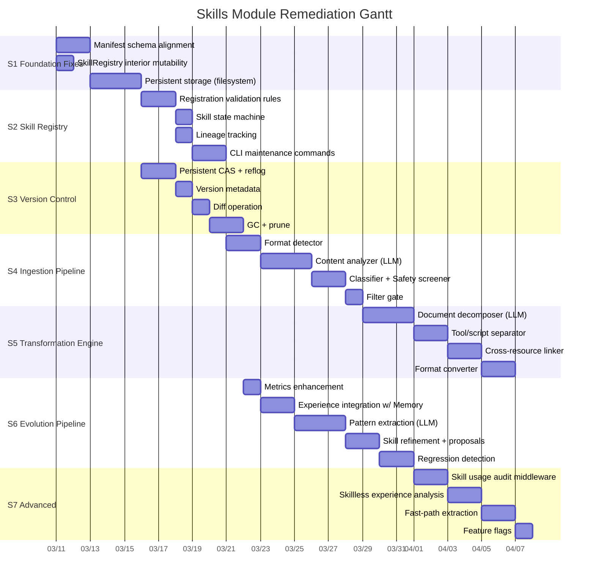
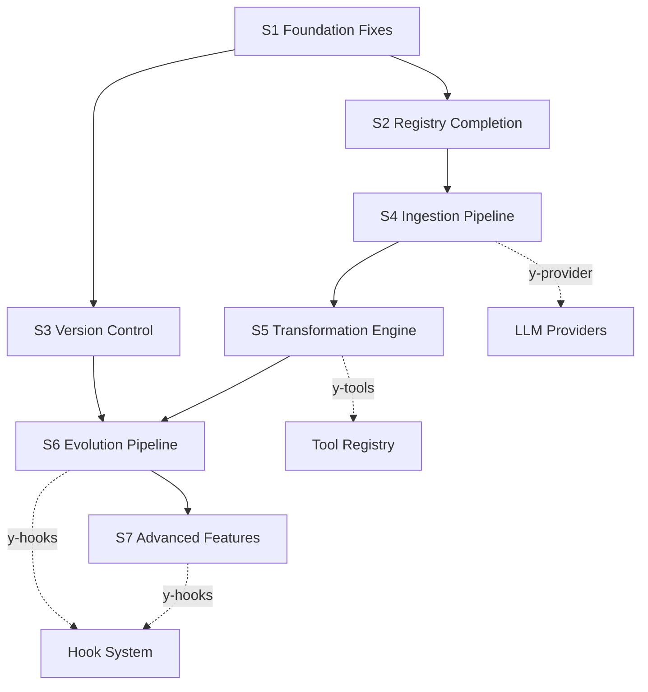

# Skills Module Remediation Plan

**Version**: v0.1
**Created**: 2026-03-10
**Status**: Draft
**Design References**: `skills-knowledge-design.md` (v0.3), `skill-versioning-evolution-design.md` (v0.2)
**Audit Reference**: Skills Audit Report (2026-03-10)

---

## 1. Audit Summary

The `y-skills` crate currently implements approximately **20-25%** of the design scope, corresponding to the **Phase 1** foundation defined in both design documents. All 29 existing tests pass. Completed work includes: core traits, TOML manifest parsing with 2000-token budget enforcement, in-memory content-addressable version store (SHA-256) with reflog and rollback, tag/trigger-based skill search, experience capture with evidence provenance, evolution proposals, and approval gate (5 policies).

Major gaps include: the entire LLM-assisted ingestion pipeline, transformation engine, persistent storage, safety screening, CLI maintenance commands, and advanced self-evolution features.

---

## 2. Implementation Phases

Remediation is divided into **7 phases**, aligned with the design documents' phased rollout. Phases S1-S3 are parallelizable with other module work; Phases S4-S7 require LLM integration and cross-module dependencies.



---

## 3. Phase Details

### Phase S1: Foundation Fixes (Est. 3-4 days)

> **Goal**: Fix structural issues — manifest schema alignment, trait compliance, persistent storage.

#### S1.1 Manifest Schema Alignment

**Problem**: Current `TomlManifest` uses a flat TOML format (`name`, `description`, `root_content`, etc.), diverging significantly from the design's nested `skill.toml` structure (`[skill]`, `[skill.classification]`, `[skill.constraints]`, `[skill.safety]`, `[skill.references]`).

**Changes**:

##### [MODIFY] [manifest.rs](file:///Users/gorgias/Projects/y-agent/crates/y-skills/src/manifest.rs)

- Add `SkillClassification` struct: `type` (llm_reasoning enum), `domain: Vec<String>`, `tags: Vec<String>`, `atomic: bool`
- Add `SkillConstraints` struct: `max_input_tokens`, `max_output_tokens`, `requires_language: Option<String>`
- Add `SkillSafetyConfig` struct: `allows_external_calls: bool`, `allows_file_operations: bool`, `allows_code_execution: bool`, `max_delegation_depth: u32`
- Add `SkillReferences` struct: `tools: Vec<String>`, `skills: Vec<String>`, `knowledge_bases: Vec<String>`
- Update `TomlManifest` to use nested `[skill]` table matching design's `skill.toml` schema
- Maintain backward compatibility by supporting the current flat format as a legacy path (if flat-format `.toml` files exist)
- Update `SkillManifest` in `y-core/src/skill.rs` to include the new fields as `Option` types to preserve backward compatibility

##### [MODIFY] [skill.rs](file:///Users/gorgias/Projects/y-agent/crates/y-core/src/skill.rs)

- Add `classification: Option<SkillClassification>` to `SkillManifest`
- Add `constraints: Option<SkillConstraints>` to `SkillManifest`
- Add `safety: Option<SkillSafetyConfig>` to `SkillManifest`
- Add `references: Option<SkillReferences>` to `SkillManifest`

#### S1.2 Fix SkillRegistry Trait Compliance

**Problem**: `SkillRegistry::register()` and `rollback()` async trait methods return `Err("use register_mut")` — the trait contract is broken. Production code expects an async API.

**Changes**:

##### [MODIFY] [registry.rs](file:///Users/gorgias/Projects/y-agent/crates/y-skills/src/registry.rs)

- Replace `HashMap`-based storage with `tokio::sync::RwLock<HashMap<...>>` for interior mutability
- Implement `register()` trait method properly using write-lock
- Implement `rollback()` trait method properly using write-lock
- Remove `register_mut` and `rollback_mut` methods (fold into trait methods)
- Update all tests to use the async trait methods

#### S1.3 Filesystem Persistent Storage

**Problem**: All skill data exists only in memory, lost on restart.

**Changes**:

##### [NEW] [store.rs](file:///Users/gorgias/Projects/y-agent/crates/y-skills/src/store.rs)

- `FilesystemSkillStore`: persists skill manifests and sub-documents to the proprietary directory structure:
  ```
  <store_path>/
    <skill-name>/
      skill.toml
      root.md
      details/
        <sub-doc-id>.md
      lineage.toml
  ```
- Load all registered skills on startup
- Write atomically (write to temp, rename)

##### [MODIFY] [registry.rs](file:///Users/gorgias/Projects/y-agent/crates/y-skills/src/registry.rs)

- Accept optional `FilesystemSkillStore` for persistence
- On `register()`, persist to filesystem then update in-memory state
- Constructor `SkillRegistryImpl::with_store(store)` for persistent mode
- Retain `SkillRegistryImpl::new()` for in-memory-only mode (tests)

#### S1 Test Plan

| Test ID | Description | File |
|---------|-------------|------|
| T-SK-S1-01 | Parse design-format `skill.toml` with nested `[skill.classification]` sections | `manifest.rs` |
| T-SK-S1-02 | Parse legacy flat TOML still works (backward compat) | `manifest.rs` |
| T-SK-S1-03 | `SkillRegistry::register()` async method works (no error) | `registry.rs` |
| T-SK-S1-04 | `SkillRegistry::rollback()` async method works | `registry.rs` |
| T-SK-S1-05 | `FilesystemSkillStore` write + read roundtrip | `store.rs` |
| T-SK-S1-06 | Registry loads skills from filesystem on construction | `store.rs` |
| T-SK-S1-07 | Atomic write (crash-safe: no partial files) | `store.rs` |

---

### Phase S2: Skill Registry Completion (Est. 3-4 days)

> **Goal**: Complete registration validation, skill state machine, lineage tracking, and CLI commands.

#### S2.1 Registration Validation Rules

**Problem**: Only token budget is validated. Design requires 6 rules: format-only, root token limit, safety constraints, unique name, lineage required, reference resolution.

**Changes**:

##### [NEW] [validator.rs](file:///Users/gorgias/Projects/y-agent/crates/y-skills/src/validator.rs)

- `SkillValidator` struct with validation pipeline:
  1. **Format validation**: `skill.toml` + `root.md` must exist
  2. **Schema validation**: parse `skill.toml`, required fields present
  3. **Root token limit**: `root.md` ≤ `max_root_tokens`
  4. **Safety constraints**: all safety flags `false` unless explicitly approved
  5. **Unique name**: no duplicate names in registry
  6. **Lineage required**: `lineage.toml` must exist with valid content
  7. **Reference resolution**: `[tool:X]`, `[skill:X]`, `[knowledge:X]` refs all resolve
- Returns `Vec<ValidationError>` with descriptive messages

#### S2.2 Skill State Machine

**Changes**:

##### [NEW] [state.rs](file:///Users/gorgias/Projects/y-agent/crates/y-skills/src/state.rs)

- `SkillState` enum: `Submitted`, `Analyzing`, `Classified`, `Rejected`, `Transforming`, `Transformed`, `Registered`, `Active`, `Deprecated`
- `SkillStateMachine`: enforces valid transitions per design's state diagram
- State stored in `SkillManifest` (or a wrapper)

#### S2.3 Lineage Tracking

**Changes**:

##### [NEW] [lineage.rs](file:///Users/gorgias/Projects/y-agent/crates/y-skills/src/lineage.rs)

- `LineageRecord` struct: `source_path`, `source_hash`, `source_format`, `detected_format`, `transform_model`, `transform_date`, `transform_steps: Vec<TransformStep>`
- TOML serialization/deserialization (`lineage.toml`)
- Auto-generated during ingestion/transformation

#### S2.4 CLI Maintenance Commands

**Design**: `skill list`, `skill inspect <name>`, `skill update <name>`, `skill deprecate <name>`, `skill audit <name>`, `skill validate`

**Changes**:

##### [NEW] [skills.rs](file:///Users/gorgias/Projects/y-agent/crates/y-cli/src/commands/skills.rs) (in `y-cli`)

- `SkillCommand` enum with subcommands:
  - `list` — table display of all registered skills (name, tags, version, state)
  - `inspect <name>` — full manifest, root document, sub-document tree, references, lineage
  - `import <path>` — ingest from file/directory (initially TOML only, later multi-format)
  - `deprecate <name>` — mark deprecated
  - `validate` — run validation on all registered skills, report broken refs
- JSON output mode via `--format json` flag

##### [MODIFY] [mod.rs](file:///Users/gorgias/Projects/y-agent/crates/y-cli/src/commands/mod.rs)

- Register `skills` subcommand

#### S2 Test Plan

| Test ID | Description | File |
|---------|-------------|------|
| T-SK-S2-01 | Validator rejects missing `root.md` | `validator.rs` |
| T-SK-S2-02 | Validator rejects duplicate skill name | `validator.rs` |
| T-SK-S2-03 | Validator rejects oversized root document | `validator.rs` |
| T-SK-S2-04 | Validator detects broken `[tool:X]` references | `validator.rs` |
| T-SK-S2-05 | State machine rejects invalid transitions | `state.rs` |
| T-SK-S2-06 | State machine allows full lifecycle `Submitted` → `Active` | `state.rs` |
| T-SK-S2-07 | Lineage TOML roundtrip serialization | `lineage.rs` |
| T-SK-S2-08 | CLI `skill list` output format | `skills.rs` (integration test or manual) |

---

### Phase S3: Version Control Completion (Est. 3-4 days)

> **Goal**: Persistent CAS + reflog on filesystem, version metadata, diff, garbage collection.

#### S3.1 Persistent CAS + Reflog

**Problem**: `VersionStore` is in-memory only. Design specifies filesystem layout with `objects/` dirs and `refs/` reflog files.

**Changes**:

##### [MODIFY] [version.rs](file:///Users/gorgias/Projects/y-agent/crates/y-skills/src/version.rs)

- Add `PersistentVersionStore` alongside in-memory `VersionStore`:
  - `objects/<ab>/<full-hash>/` — immutable skill snapshots (copy of skill directory)
  - `refs/<skill-name>/HEAD` — current version hash
  - `refs/<skill-name>/reflog` — JSONL append-only log
- Implement `store()`, `get()`, `register_version()`, `rollback()` with filesystem I/O
- Keep in-memory `VersionStore` for tests

#### S3.2 Version Metadata

**Changes**:

##### [NEW] [version_meta.rs](file:///Users/gorgias/Projects/y-agent/crates/y-skills/src/version_meta.rs)

- `VersionMeta` struct:
  - `hash`, `parent_hash: Option<String>`, `created_at`, `created_by` (transformation-pipeline / evolution-refiner / manual-edit)
  - `source_type` (transformation / evolution / rollback / manual)
  - `evaluation`: `uses_since_creation`, `success_rate: Option<f64>`, `average_relevance_score: Option<f64>`
- TOML serialization as `version-meta.toml` within each version snapshot

#### S3.3 Diff Operation

**Changes**:

##### [NEW] [diff.rs](file:///Users/gorgias/Projects/y-agent/crates/y-skills/src/diff.rs)

- `SkillDiff` struct: per-file diffs between two skill versions
- `diff(skill_name, hash_a, hash_b)` → `Vec<FileDiff>`
- Text diff on `root.md` and sub-documents (line-level)
- Metadata diff on `skill.toml`

#### S3.4 Garbage Collection

**Changes**:

##### [NEW] [gc.rs](file:///Users/gorgias/Projects/y-agent/crates/y-skills/src/gc.rs)

- `SkillGarbageCollector`:
  - Identify unreferenced objects (not HEAD, not in keep window of N versions)
  - Configurable `keep_count` (default: 10 versions per skill)
  - Skip objects with pending evaluation data
  - `prune(skill_name, keep_count)` and `gc_all()` public API
- Can run as scheduled background task or CLI trigger

#### S3 Test Plan

| Test ID | Description | File |
|---------|-------------|------|
| T-SK-S3-01 | Persistent CAS write + read roundtrip | `version.rs` |
| T-SK-S3-02 | Reflog JSONL persists Created/Updated/RolledBack | `version.rs` |
| T-SK-S3-03 | HEAD pointer updated on register/rollback | `version.rs` |
| T-SK-S3-04 | `VersionMeta` TOML roundtrip | `version_meta.rs` |
| T-SK-S3-05 | `parent_hash` chain is correct across versions | `version_meta.rs` |
| T-SK-S3-06 | Diff detects additions/deletions in root.md | `diff.rs` |
| T-SK-S3-07 | GC removes unreferenced objects beyond `keep_count` | `gc.rs` |
| T-SK-S3-08 | GC preserves HEAD and recent versions | `gc.rs` |

---

### Phase S4: Ingestion Pipeline (Est. 5-6 days)

> **Goal**: Multi-format detection, LLM-assisted content analysis, classification, safety screening, filter gate. This is the core value proposition of the skills system.
>
> **Depends on**: `y-provider` (LLM API access)

#### S4.1 Format Detector

**Changes**:

##### [MODIFY] [ingestion.rs](file:///Users/gorgias/Projects/y-agent/crates/y-skills/src/ingestion.rs)

- Expand `IngestionFormat` enum: `Toml`, `Markdown`, `Yaml`, `Json`, `PlainText`, `Directory`
- `FormatDetector` struct: detects format by extension + content heuristics
  - `.md` → Markdown (heading pattern check)
  - `.yaml/.yml` → YAML (structure validation)
  - `.json` → JSON (parse validation)
  - `.toml` → TOML (TOML validation)
  - `.txt` / fallback → PlainText
  - directory → Directory (recursive scan)
- Parse each format into a common `RawSkillContent` representation

#### S4.2 Content Analyzer (LLM-Assisted)

**Changes**:

##### [NEW] [analyzer.rs](file:///Users/gorgias/Projects/y-agent/crates/y-skills/src/analyzer.rs)

- `ContentAnalyzer` struct: single LLM call per skill with structured output (JSON schema)
- `AnalysisReport` struct: `purpose`, `classification_hint`, `capabilities`, `embedded_tools`, `embedded_scripts`, `quality_issues`, `token_estimate`, `safety_flags`
- Uses `y-provider` for LLM calls (takes `LlmProvider` trait object)
- Structured output prompt with JSON Schema response format

#### S4.3 Classifier + Safety Screener

**Changes**:

##### [NEW] [classifier.rs](file:///Users/gorgias/Projects/y-agent/crates/y-skills/src/classifier.rs)

- `SkillClassificationType` enum: `LlmReasoning`, `ApiCall`, `ToolWrapper`, `AgentBehavior`, `Hybrid`
- `SkillClassifier`: determines type from `AnalysisReport`
- Rule-based heuristics backed by LLM classification hint

##### [NEW] [safety.rs](file:///Users/gorgias/Projects/y-agent/crates/y-skills/src/safety.rs)

- `SafetyScreener` struct with 5 pattern checks:
  1. Prompt injection detection (pattern matching + LLM-assisted)
  2. Privilege escalation detection
  3. Unconstrained delegation detection
  4. Data exfiltration detection
  5. Excessive freedom detection
- `SafetyVerdict` enum: `Pass`, `Blocked { reason: String, finding_type: SafetyFindingType }`
- Dual-mode: pattern-matching (fast, deterministic) + optional LLM-assisted (configurable)

#### S4.4 Filter Gate

**Changes**:

##### [NEW] [filter.rs](file:///Users/gorgias/Projects/y-agent/crates/y-skills/src/filter.rs)

- `FilterGate` struct: applies 7 filter rules from `AnalysisReport` + `SkillClassificationType` + `SafetyVerdict`
- `FilterDecision` enum: `Accepted`, `Rejected { reason: String, redirect: Option<RedirectTarget> }`, `PartialAccept { llm_portion, redirect_for: Vec<RedirectTarget> }`
- `RedirectTarget`: `ToolSystem`, `AgentFramework`

#### S4 Test Plan

| Test ID | Description | File |
|---------|-------------|------|
| T-SK-S4-01 | Format detector identifies .md, .yaml, .json, .toml, .txt, dir | `ingestion.rs` |
| T-SK-S4-02 | Content analyzer produces structured `AnalysisReport` | `analyzer.rs` (mock LLM) |
| T-SK-S4-03 | Classifier assigns `LlmReasoning` for reasoning-only skills | `classifier.rs` |
| T-SK-S4-04 | Classifier assigns `ApiCall` for API-description skills | `classifier.rs` |
| T-SK-S4-05 | Safety screener detects prompt injection patterns | `safety.rs` |
| T-SK-S4-06 | Safety screener detects privilege escalation | `safety.rs` |
| T-SK-S4-07 | Filter gate accepts `LlmReasoning` + safe skills | `filter.rs` |
| T-SK-S4-08 | Filter gate rejects `ApiCall` with redirect message | `filter.rs` |
| T-SK-S4-09 | Filter gate handles hybrid: partial accept + redirect | `filter.rs` |
| T-SK-S4-10 | Quality block triggers for oversized + low-quality skills | `filter.rs` |

---

### Phase S5: Transformation Engine (Est. 5-6 days)

> **Goal**: LLM-assisted document decomposition, tool/script extraction, cross-resource linkage, proprietary format conversion.
>
> **Depends on**: Phase S4 (ingestion pipeline), `y-tools` (tool registration), `y-provider` (LLM)

#### S5.1 Document Decomposer (LLM-Assisted)

**Changes**:

##### [NEW] [decomposer.rs](file:///Users/gorgias/Projects/y-agent/crates/y-skills/src/decomposer.rs)

- `DocumentDecomposer` struct: single LLM call with structured output
- Decomposition strategies:
  - Under threshold → single root document
  - 2x-5x threshold → root + 2-4 sub-documents
  - Over 5x → multi-level tree (max 3 levels)
- Output: `DecomposedSkill { root_content, sub_documents: Vec<SubDocument>, tree_index }`

#### S5.2 Tool/Script Separator

**Changes**:

##### [NEW] [separator.rs](file:///Users/gorgias/Projects/y-agent/crates/y-skills/src/separator.rs)

- `ToolSeparator` struct: scans for embedded executable content
  - Fenced code blocks with `bash`, `python`, `javascript` etc.
  - API endpoint descriptions (URL + method + params)
  - CLI command templates
- For each extracted tool: generate `ToolManifest`, replace inline content with `[tool:name]` reference
- Integration with `y-tools` for tool registration

#### S5.3 Cross-Resource Linker

**Changes**:

##### [NEW] [linker.rs](file:///Users/gorgias/Projects/y-agent/crates/y-skills/src/linker.rs)

- `ResourceLinker` struct:
  - Query `SkillRegistry` for similar skills (semantic similarity > 0.8)
  - Query `ToolRegistry` for matching tools by capability
  - Replace redundant descriptions with `[tool:X]`, `[skill:X]`, `[knowledge:X]` references
- Returns linkage report for user confirmation

#### S5.4 Format Converter

**Changes**:

##### [NEW] [converter.rs](file:///Users/gorgias/Projects/y-agent/crates/y-skills/src/converter.rs)

- `FormatConverter`: converts decomposed + linked content into proprietary format
- Produces: `skill.toml` (manifest), `root.md` (root document), `details/*.md` (sub-documents), `lineage.toml`
- Registers the complete proprietary skill in `SkillRegistry`

#### S5 Test Plan

| Test ID | Description | File |
|---------|-------------|------|
| T-SK-S5-01 | Decomposer splits 5000-token document into root + sub-docs | `decomposer.rs` (mock LLM) |
| T-SK-S5-02 | Decomposer keeps sub-threshold content as single root | `decomposer.rs` |
| T-SK-S5-03 | Separator extracts fenced bash code blocks | `separator.rs` |
| T-SK-S5-04 | Separator replaces extracted scripts with `[tool:X]` refs | `separator.rs` |
| T-SK-S5-05 | Linker detects near-duplicate skills | `linker.rs` (mock registry) |
| T-SK-S5-06 | Converter produces valid proprietary directory | `converter.rs` |
| T-SK-S5-07 | Full pipeline: raw markdown → proprietary skill (integration) | `ingestion.rs` |

---

### Phase S6: Self-Evolution Pipeline (Est. 6-7 days)

> **Goal**: Complete skill metrics, integrate experience capture with Memory System, LLM-assisted pattern extraction, skill refinement proposals, regression detection.
>
> **Depends on**: Phase S3 (version control), Memory System, `y-hooks`, `y-provider`

#### S6.1 Metrics Enhancement

**Changes**:

##### [MODIFY] [evolution.rs](file:///Users/gorgias/Projects/y-agent/crates/y-skills/src/evolution.rs)

- Add missing metrics to `SkillMetrics`:
  - `avg_token_usage: f64` — average tokens consumed per use
  - `injection_count: u64` — times skill was injected into LLM context
  - `actual_usage_count: u64` — times LLM actually used the skill
  - `usage_rate: f64` — `actual_usage_count / injection_count`
- Update `record()` to accept `token_usage` parameter

#### S6.2 Experience Integration with Memory System

**Changes**:

##### [MODIFY] [experience.rs](file:///Users/gorgias/Projects/y-agent/crates/y-skills/src/experience.rs)

- Add missing fields to `ExperienceRecord`:
  - `tool_calls: Vec<ToolCallRecord>` (tools invoked with outcomes)
  - `error_messages: Vec<String>` (errors encountered)
  - `token_usage: TokenUsage` (structured token usage instead of `u64`)
- Create `ExperienceCapture` service that listens for task completion events via `y-hooks` EventBus
- Automatically captures experience from Orchestrator events

#### S6.3 Pattern Extraction (LLM-Assisted)

**Changes**:

##### [NEW] [extractor.rs](file:///Users/gorgias/Projects/y-agent/crates/y-skills/src/extractor.rs)

- `PatternExtractor` struct: batch job triggered periodically or on-demand
  - Query recent experiences by skill
  - Group experiences with > threshold count
  - LLM call per skill batch → `PatternAnalysisReport`
  - Deduplicate against existing patterns
  - Register new patterns with frequency tracking
- `PatternRegistry`: stores extracted patterns with type, frequency, source evidence

#### S6.4 Skill Refinement + Proposals

**Changes**:

##### [MODIFY] [evolution.rs](file:///Users/gorgias/Projects/y-agent/crates/y-skills/src/evolution.rs)

- `SkillRefiner` struct: generates `EvolutionProposal` from detected patterns
- Enhance `EvolutionProposal` with:
  - `proposed_version: Option<String>`
  - `change_type: ChangeType` (edge_case_addition, error_warning, phrasing_update, capability_split, rule_removal, workflow_discovery)
  - `patterns_referenced: Vec<String>`
  - `diff_preview: String`
  - `deferred_until: Option<String>`
- Wire through `ApprovalGate` → if approved → create new version via `SkillRegistry`

#### S6.5 Regression Detection

**Changes**:

##### [NEW] [regression.rs](file:///Users/gorgias/Projects/y-agent/crates/y-skills/src/regression.rs)

- `RegressionDetector`:
  1. Baseline metrics from previous version's last N uses (default: 20)
  2. After version change, collect N uses of new version
  3. If `success_rate` drops > 15% or `failure_rate` increases > 10% → regression alert
  4. Auto-generate rollback proposal with regression evidence

#### S6 Test Plan

| Test ID | Description | File |
|---------|-------------|------|
| T-SK-S6-01 | Enhanced `SkillMetrics` tracks `usage_rate` | `evolution.rs` |
| T-SK-S6-02 | `ExperienceRecord` roundtrip with `tool_calls` | `experience.rs` |
| T-SK-S6-03 | Pattern extractor groups experiences by skill | `extractor.rs` (mock) |
| T-SK-S6-04 | Pattern deduplication across extraction cycles | `extractor.rs` |
| T-SK-S6-05 | `SkillRefiner` generates proposal from patterns | `evolution.rs` |
| T-SK-S6-06 | Approved proposal creates new version | `evolution.rs` |
| T-SK-S6-07 | Regression detected when success_rate drops > 15% | `regression.rs` |
| T-SK-S6-08 | Regression generates rollback proposal | `regression.rs` |

---

### Phase S7: Advanced Features (Est. 4-5 days)

> **Goal**: Skill usage audit middleware, skillless experience analysis, fast-path extraction, feature flags.
>
> **Depends on**: Phase S6, `y-hooks` middleware chain

#### S7.1 Skill Usage Audit Middleware

**Changes**:

##### [NEW] [usage_audit.rs](file:///Users/gorgias/Projects/y-agent/crates/y-skills/src/usage_audit.rs)

- `SkillUsageAuditMiddleware`: runs in `post_task` phase of Hook system
- Dual-channel judgment:
  - LLM audit (primary): send `{task_description, agent_output, injected_skills[]}` → judge `relevant`/`used` per skill
  - Keyword overlap (fallback): token overlap between output and skill content
- Updates `SkillMetrics.injection_count` and `actual_usage_count`
- Signal routing: `usage_rate < 0.1` → `ObsoleteRule` pattern

#### S7.2 Skillless Experience Analysis

**Changes**:

##### [MODIFY] [extractor.rs](file:///Users/gorgias/Projects/y-agent/crates/y-skills/src/extractor.rs)

- Add skillless analysis stage: query `skill_id = null` + `outcome = Success` experiences
- Cluster by `task_description` embedding similarity (threshold > 0.8)
- For clusters with ≥ 3 experiences: LLM → `WorkflowSkillProposal`
- Proposal type = `workflow_discovery` → creates new skill (not modifying existing)

#### S7.3 Fast-Path Extraction

**Changes**:

##### [NEW] [fast_path.rs](file:///Users/gorgias/Projects/y-agent/crates/y-skills/src/fast_path.rs)

- `FastPathExtractor`: real-time extraction after each interaction (async)
- Restricted scope: `BetterPhrasing` and `CommonError` only
- Evidence filter: only `user_correction` and `user_stated` eligible
- Auto-minor approval only; no new skill creation
- Feature flag: `evolution_fast_path` (default: disabled)

#### S7.4 Feature Flags

**Changes**:

##### [MODIFY] [Cargo.toml](file:///Users/gorgias/Projects/y-agent/crates/y-skills/Cargo.toml)

- Add feature flags:
  - `skill_ingestion` — enables LLM-assisted ingestion pipeline
  - `skill_transformation` — enables transformation engine
  - `skill_safety_screening` — enables safety screener
  - `skill_linkage` — enables cross-resource linker
  - `skill_lazy_loading` — enables lazy sub-document loading
  - `evolution_capture` — enables experience capture
  - `evolution_extraction` — enables LLM-assisted pattern extraction
  - `evolution_refinement` — enables proposal generation
  - `evolution_fast_path` — enables real-time extraction
  - `skill_usage_audit` — enables per-retrieval usage tracking
- Gate all non-trivial subsystems behind these flags
- Default features = core registry + version control

#### S7 Test Plan

| Test ID | Description | File |
|---------|-------------|------|
| T-SK-S7-01 | Usage audit middleware updates injection/usage counts | `usage_audit.rs` (mock) |
| T-SK-S7-02 | Low `usage_rate` triggers `ObsoleteRule` detection | `usage_audit.rs` |
| T-SK-S7-03 | Skillless analysis clusters similar tasks | `extractor.rs` |
| T-SK-S7-04 | Fast-path rejects non-minor changes | `fast_path.rs` |
| T-SK-S7-05 | Fast-path only accepts `user_correction`/`user_stated` evidence | `fast_path.rs` |
| T-SK-S7-06 | Feature flags: compilation without optional features | `Cargo.toml` |

---

## 4. Deferred Items

| Item | Reason |
|------|--------|
| Embedding-based semantic search for skills | Depends on `y-knowledge` embedding infrastructure |
| Visual skill editor / builder UI | Explicitly out of scope in design |
| Skill marketplace / remote hub | Explicitly out of scope in design |
| Real-time skill hot-reload | Explicitly out of scope in design |
| Multi-language skill translation | Explicitly out of scope in design |

---

## 5. Dependency Graph



> Phase S2 and S3 are **parallelizable** after S1 completes.

---

## 6. Verification

### Automated Tests

After each phase completion:

```bash
# Unit tests
cargo test -p y-skills

# Clippy
cargo clippy -p y-skills -- -D warnings

# If y-core modified
cargo test -p y-core

# If y-cli modified
cargo test -p y-cli

# Full workspace build
cargo build --workspace
```

### Integration Tests

After Phase S5 completion:

| Test ID | Scenario |
|---------|----------|
| T-SK-INT-01 | Full pipeline: raw Markdown file → proprietary skill → registered in registry |
| T-SK-INT-02 | Import skill → re-import (updated content) → version history shows 2 entries |
| T-SK-INT-03 | Skill with embedded bash script → tool extracted + registered in ToolRegistry |

After Phase S6 completion:

| Test ID | Scenario |
|---------|----------|
| T-SK-INT-04 | Experience capture → pattern extraction → proposal → approval → new version |
| T-SK-INT-05 | Regression detection → auto-rollback proposal generated |

---

## 7. Risks & Mitigations

| Risk | Mitigation |
|------|------------|
| LLM output quality for content analysis varies | Structured JSON schema output; fallback to rule-based heuristics |
| `SkillManifest` struct changes may break other crates | Use `Option` for new fields; run full workspace build after each change |
| Filesystem persistence may have edge cases on different OS | Use `tempfile` crate for atomic writes; comprehensive path handling tests |
| Cross-resource linker depends on unfinished modules | Interface via traits; mock Tool/Knowledge registries in tests |
| Feature flag complexity | Keep default feature set minimal; test both with and without flags |

---

## 8. Acceptance Criteria

- [ ] All existing 29 tests continue to pass (regression safety)
- [ ] All new tests per phase pass
- [ ] `cargo clippy -p y-skills -- -D warnings` zero warnings
- [ ] `SkillRegistry::register()` works as async trait method (no workaround)
- [ ] Skill manifests conform to design's `skill.toml` schema
- [ ] Skills persist to filesystem and survive restart
- [ ] Full ingestion pipeline processes at least Markdown + TOML + YAML formats (Phase S4)
- [ ] Version history accessible with diff between versions (Phase S3)
- [ ] CLI `skill list/inspect/import/validate` commands functional (Phase S2)
