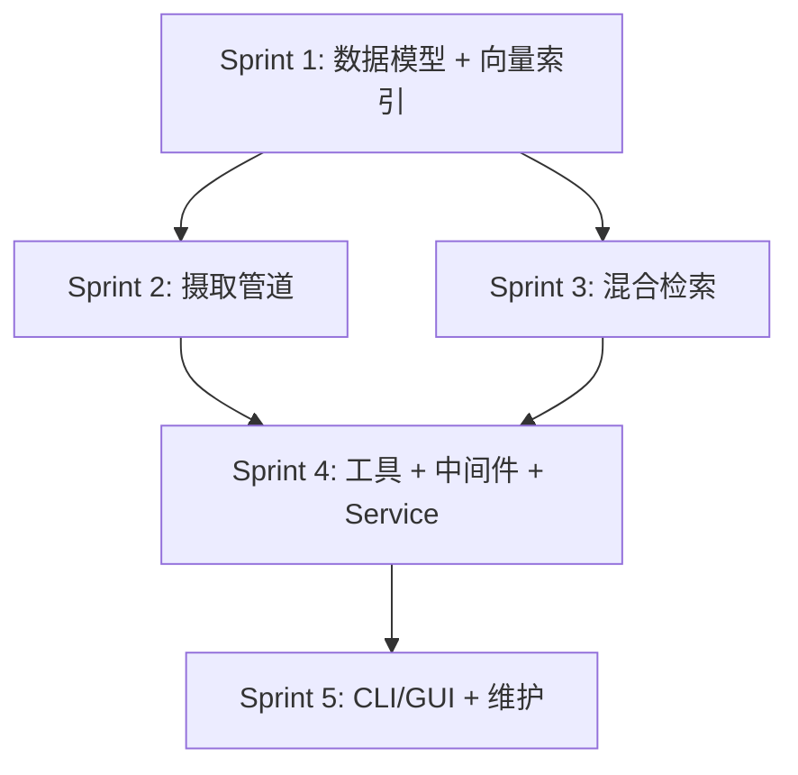

# Knowledge Base 研发计划

> 基于 [knowledge_base_gap_analysis.md](../research/knowledge_base_gap_analysis.md) 差距分析，结合 MaxKB 可借鉴机制，制定的分阶段研发路线图。
>
> **创建日期**：2026-03-15
> **状态**：已批准

## 当前状态

| 维度 | 状态 |
|------|------|
| 设计文档 | ✅ 完整（[knowledge-base-design.md](../design/knowledge-base-design.md)，1127 行） |
| 模块计划 | ✅ 完整（[y-knowledge.md](modules/y-knowledge.md)） |
| 代码实现 | 7 文件 ~600 行，**约 15-20% 完成** |
| 已有 | `ChunkLevel` enum、简化 `Chunk`/`ChunkMetadata`、基础文本分割、`ProgressiveLoader`、内存 mock 检索、12 个单元测试 |
| 缺失 | 向量索引、Embedding 集成、Source Connectors、LLM 辅助生成、混合检索、上下文注入、工具注册、Service 集成 |

---

## 分阶段研发路线图

### Sprint 1：数据基础 + 向量索引（2 周）

> **目标**：完善数据模型，接通 Qdrant 向量存储和 Embedding 管道，让知识可以被写入和按语义检索。

#### 1.1 完善数据模型

##### [MODIFY] chunking.rs

- 将 `Chunk` 升级为完整的 `KnowledgeEntry`，包含设计文档定义的 18 个字段
- `SourceRef` 结构体（`source_type`, `uri`, `content_hash`, `title`, `author`, `fetched_at`, `connector_id`）
- 🆕 增加 `chunks: Vec<String>` 缓存分片结果（借鉴 MaxKB）
- 🆕 增加 `is_active: bool` 启用/禁用控制
- 🆕 增加 `hit_num: u32` 命中统计

##### [NEW] models.rs

- `KnowledgeEntry` — 完整知识条目
- `SourceRef` — 来源溯源
- `KnowledgeCollection` — 知识集合定义
- `EntryState` enum — 生命周期状态机（`Fetched → Parsed → Chunked → Classified → Filtered → Indexed → Active → Stale → Expired`）

##### [MODIFY] config.rs

- 增加 `CollectionConfig`（chunk_size, overlap, embedding_model, refresh_policy）
- 增加 `default_collection` 和相似度阈值配置
- 🆕 增加 `min_similarity_threshold`（默认 0.65，借鉴 MaxKB）

#### 1.2 文本归一化 + 句子边界分片

##### [NEW] normalize.rs

- 🆕 `normalize_for_embedding(text) -> String`：emoji 移除、空白规范化、Unicode 归一化（借鉴 MaxKB）

##### [MODIFY] chunking.rs

- 🆕 新增 `SentenceBoundaryChunker`：按中英文标点（`。！；？.!;?`）+ 换行切割，默认 256 字符/块（借鉴 MaxKB MarkChunkHandle）
- 新增 `HeadingBasedChunker`：按 Markdown heading 结构分割
- `ChunkingStrategy` 支持策略选择：`TextSplit`（当前）/ `SentenceBoundary` / `HeadingBased`

#### 1.3 Qdrant 向量索引 + Embedding 集成

##### [MODIFY] Cargo.toml

- 添加 `qdrant-client` 依赖（feature-gated: `vector_qdrant`）
- 添加 `reqwest` 依赖（用于后续 web connector）

##### [MODIFY] indexer.rs

- 实现 `VectorIndexer`：
  - `create_collection(name, config)` — 创建 Qdrant collection（含 HNSW 参数配置）
  - `upsert(entries, embeddings)` — 批量写入向量 + payload
  - `delete(entry_ids)` — 删除条目
  - `search(query_embedding, filters, top_k)` — 向量近似搜索
- 集成 `EmbeddingProvider` trait
- 在 embedding 管道入口调用 `normalize_for_embedding`

##### 验证

| 测试 | 类型 | 命令 |
|------|------|------|
| 数据模型单元测试 | Unit | `cargo test -p y-knowledge -- models` |
| 文本归一化测试 | Unit | `cargo test -p y-knowledge -- normalize` |
| 句子边界分片测试 | Unit | `cargo test -p y-knowledge -- chunking::sentence` |
| Heading 分片测试 | Unit | `cargo test -p y-knowledge -- chunking::heading` |
| Qdrant 索引集成测试 | Integration（需 Qdrant 实例） | `cargo test -p y-knowledge --features vector_qdrant -- indexer --ignored` |

---

### Sprint 2：摄取管道 + Source Connectors（2 周）

> **目标**：实现文本/Markdown 连接器，构建完整的摄取管道（fetch → parse → chunk → classify → filter → embed → store）。

#### 2.1 Source Connectors

##### [NEW] ingestion/mod.rs

- `SourceConnector` trait 定义：`async fn fetch(&self, source_ref: &str) -> Result<RawDocument>`
- `IngestionPipeline` 编排器：串联 fetch → parse → chunk → classify → filter → embed → store

##### [NEW] ingestion/text.rs

- `TextConnector`：纯文本文件读取

##### [NEW] ingestion/markdown.rs

- `MarkdownConnector`：Markdown 文件解析，提取 heading 结构、section 划分

#### 2.2 Domain Classifier

##### [NEW] classifier.rs

- `RuleBasedClassifier`：keyword 匹配 domain taxonomy
- `DomainTaxonomy`：层级域分类树结构（`testing/automation`、`rust/async`）
- 预留 `LlmClassifier` 接口（Phase 2 实现）

#### 2.3 Quality Filter

##### [NEW] quality.rs

- 最小长度检查（< 50 tokens 拒绝）
- 内容去重（content_hash 精确去重 + 可选 cosine > 0.95 近似去重）
- `quality_score` 计算：基于长度、结构、域匹配度
- 🆕 `is_active` 启用/禁用过滤

#### 2.4 🆕 中文分词支持

##### [MODIFY] Cargo.toml

- 添加 `jieba-rs` 依赖

##### [NEW] tokenizer.rs

- 🆕 `ChineseTokenizer`：基于 `jieba-rs` 的中文分词，用于关键词索引和 BM25（借鉴 MaxKB jieba 全模式分词方案）
- `Tokenizer` trait：统一 English/Chinese 分词接口

##### 验证

| 测试 | 类型 | 命令 |
|------|------|------|
| TextConnector 单元测试 | Unit | `cargo test -p y-knowledge -- ingestion::text` |
| MarkdownConnector 单元测试 | Unit | `cargo test -p y-knowledge -- ingestion::markdown` |
| RuleBasedClassifier 测试 | Unit | `cargo test -p y-knowledge -- classifier` |
| Quality Filter 测试 | Unit | `cargo test -p y-knowledge -- quality` |
| 中文分词测试 | Unit | `cargo test -p y-knowledge -- tokenizer` |
| 摄取管道集成测试 | Integration | `cargo test -p y-knowledge -- ingestion::pipeline --ignored` |

---

### Sprint 3：混合检索引擎（2 周）

> **目标**：将 mock 检索升级为生产级混合检索，支持 Blend Search 融合和段落级去重。

#### 3.1 Keyword Index (BM25)

##### [NEW] bm25.rs

- 倒排索引：`term → Vec<(chunk_id, term_frequency)>`
- BM25 评分：`k1=1.2, b=0.75`
- 集成 `Tokenizer` trait 实现语言感知分词

#### 3.2 混合检索升级

##### [MODIFY] retrieval.rs

- `HybridRetriever` 重构：
  - 并行执行 Vector Search + BM25 Keyword Search
  - 🆕 v1 使用 Blend Search 加法融合 `(1 - cosine_distance) + bm25_score`（借鉴 MaxKB，快速落地）
  - 预留 RRF 融合接口（Phase 3 迭代）
  - 🆕 段落级去重：子分片检索后按 `document_id` + `section_index` 只保留最高分（借鉴 MaxKB DISTINCT ON）
  - 🆕 启用 `min_similarity_threshold`（默认 0.65）
  - `quality_boost = quality_score ^ 0.5`
  - `freshness_boost = 1 / (1 + decay_rate * days)`
- 实现 `RetrievalFilter` 中 `freshness_after` 的实际过滤逻辑
- 搜索策略配置：`SemanticSearch`, `KeywordSearch`, `Hybrid`

#### 3.3 🆕 LLM 辅助 L0/L1 生成

##### [MODIFY] chunking.rs

- L0 从截断改为 LLM 生成 ~100 token 摘要
- L1 从双换行分割改为 LLM 生成 ~500 token 要点概述
- 🆕 同时生成触发问题（FAQ），向量化后增强检索召回（借鉴 MaxKB Problem 模型）

##### 验证

| 测试 | 类型 | 命令 |
|------|------|------|
| BM25 索引/评分测试 | Unit | `cargo test -p y-knowledge -- bm25` |
| Blend Search 融合测试 | Unit | `cargo test -p y-knowledge -- retrieval::blend` |
| 段落级去重测试 | Unit | `cargo test -p y-knowledge -- retrieval::dedup` |
| 阈值过滤测试 | Unit | `cargo test -p y-knowledge -- retrieval::threshold` |
| 混合检索端到端测试 | Integration | `cargo test -p y-knowledge --features vector_qdrant -- retrieval_e2e --ignored` |

---

### Sprint 4：工具注册 + 上下文注入 + Service 集成（2 周）

> **目标**：让 Agent 能使用知识库（工具），自动注入知识到上下文，完成 Service 层编排。

#### 4.1 Built-in Tools

##### [NEW] tools/mod.rs

- `KnowledgeSearch` Tool：语义 + 过滤检索，返回 L0 摘要，支持 `resolution` 参数
- `knowledge_lookup` Tool：按 chunk ID 精确获取，支持 L0/L1/L2 分辨率
- `knowledge_ingest` Tool：Agent 驱动的摄取入口

#### 4.2 InjectKnowledge ContextMiddleware

##### [NEW] middleware.rs

- `InjectKnowledge` 中间件（priority 350，位于 InjectMemory 300 和 InjectSkills 400 之间）
- Domain-Triggered Retrieval：从 user message 提取域关键词，自动检索注入
- Token 预算控制（默认 4000 tokens）
- 默认注入 L0，预算允许时升级 L1

#### 4.3 Service 层集成

##### [NEW] knowledge_service.rs (y-service)

- `KnowledgeService`：编排 ingestion、indexing、retrieval 各组件
- Collection CRUD 操作
- Skill `knowledge_bases` 引用解析

##### [MODIFY] y-service/Cargo.toml

- 添加 `y-knowledge` 依赖

##### 验证

| 测试 | 类型 | 命令 |
|------|------|------|
| KnowledgeSearch Tool 测试 | Unit | `cargo test -p y-knowledge -- tools::search` |
| knowledge_lookup Tool 测试 | Unit | `cargo test -p y-knowledge -- tools::lookup` |
| InjectKnowledge 中间件测试 | Unit | `cargo test -p y-knowledge -- middleware` |
| KnowledgeService 集成测试 | Integration | `cargo test -p y-service -- knowledge_service --ignored` |

---

### Sprint 5：用户接口 + 维护 + 可观测性（2 周）

> **目标**：提供 CLI / GUI 管理入口，实现知识维护和可观测性。

#### 5.1 CLI 命令

- `y-agent kb ingest --source <path> [--domain <domain>] [--collection <name>]`
- `y-agent kb collection list|create|delete`
- `y-agent kb search <query> [--domain <domain>]`

#### 5.2 GUI 知识管理页面

- Collection 列表和 CRUD
- 知识条目浏览（L0 预览，点击展开 L1/L2）
- 摄取状态展示

#### 5.3 知识维护

- Re-ingestion：content_hash 变更检测 → 自动重新摄取
- Staleness detection：定期检查源文件变更
- TTL Expiry：基于 `refreshed_at` + `ttl` 的过期清理
- 🆕 `hit_num` 统计分析

#### 5.4 可观测性

- 摄取/检索/注入 metrics（tracing spans）
- Hook Points：`kb_ingestion_completed`, `kb_knowledge_retrieved`
- Event Bus Events

---

## 依赖关系总览

## MaxKB 借鉴项追踪

> 🆕 标记的项均来自 MaxKB 分析

| 借鉴项 | Sprint | 优先级 |
|--------|--------|--------|
| 句子边界分片（标点感知） | Sprint 1 | 高 |
| 文本归一化（embedding 预处理） | Sprint 1 | 高 |
| chunks 缓存字段 | Sprint 1 | 中 |
| is_active 启用/禁用 | Sprint 1 | 中 |
| 中文分词（jieba-rs） | Sprint 2 | 高 |
| Blend Search 加法融合 | Sprint 3 | 高 |
| 段落级去重 DISTINCT | Sprint 3 | 高 |
| similarity 阈值过滤 | Sprint 3 | 中 |
| LLM 生成 FAQ 触发问题 | Sprint 3 | 中 |
| hit_num 命中统计 | Sprint 1+5 | 低 |

## 工作量估计

| Sprint | 工作量 | 累计进度 |
|--------|--------|---------|
| Sprint 1 | 2 周 | ~40% |
| Sprint 2 | 2 周 | ~60% |
| Sprint 3 | 2 周 | ~80% |
| Sprint 4 | 2 周 | ~95% |
| Sprint 5 | 2 周 | 100% |
| **总计** | **~10 周** | |

> [!IMPORTANT]
> Sprint 1-3 是核心功能（数据 + 索引 + 检索），完成后知识库即可达到**基本可用**状态。Sprint 4-5 是集成和完善。建议优先确保 Sprint 1-3 的质量。
