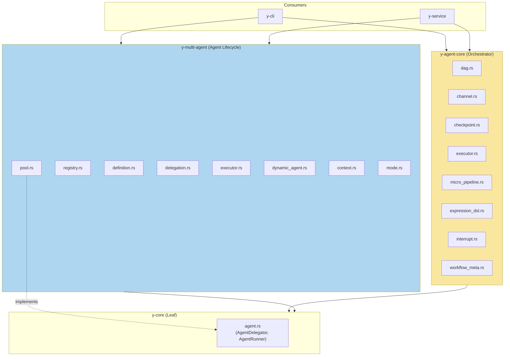

# 可行性分析：融合 y-agent-core 与 y-multi-agent

> 分析 y-agent-core（编排器/DAG 引擎）与 y-multi-agent（Agent 生命周期管理）的合并方案

**日期**: 2026-03-11
**状态**: Research / Proposal

---

## 1. 背景与动机

### 1.1 当前痛点

用户（项目 owner）在 Skills R&D Plan 讨论中提出了一个核心观察：

> "不管是多轮还是单轮，agent 就是 agent。但是现在 subagent 和 agent 本身是分离的，agent 只能调 subagent，我觉得不够优雅，如果能递归调用才是比较优雅的选择。"

这揭示了当前架构的几个问题：

1. **Agent 概念碎片化** — `y-agent-core` 定义了 "task/workflow" 概念（DAG、channel、checkpoint），`y-multi-agent` 定义了 "agent" 概念（definition、registry、pool、delegation）。两者本该无缝协作来表达 "agent = 拥有配置的可递归执行单元"。
2. **Agent 执行路径断裂** — 当前 `SingleTurnRunner`（system_prompt + input → 一次 LLM 调用 → 文本输出）是唯一的执行器。未来的 `MultiTurnRunner`（agent loop: LLM → 工具执行 → LLM → ...）需要的是编排器的核心能力（DAG 执行、checkpoint、interrupt），但编排器不知道 agent 是什么。
3. **递归调用不可能** — 一个 agent 无法用和自己相同的执行路径去调用另一个 agent，因为 "agent 执行" 和 "workflow 编排" 被分置在两个不依赖彼此的 crate 中。

### 1.2 用户的理想模型

```
Agent（递归定义）:
  - AgentDefinition（配置 = system prompt + tools + model preferences + limits）
  - AgentRunner（执行器）
    - SingleTurnRunner: prompt → LLM → text
    - MultiTurnRunner: prompt → [LLM → tool_call → LLM → ...]* → result
  - 一个 agent 通过 delegation 递归调用另一个 agent
    - 调用路径完全相同（不存在 "subagent" 这一特殊概念）
    - 差异仅在配置（depth limit、trust tier、mode）
```

---

## 2. 现状审计

### 2.1 y-agent-core（编排器 / DAG 引擎）

| 文件 | 行数 | 职责 |
|------|------|------|
| `dag.rs` | 280 | DAG 任务调度：拓扑排序、优先级、依赖检查 |
| `channel.rs` | 184 | 类型化状态通道：LastValue / Append / Merge reducers |
| `checkpoint.rs` | 158 | 工作流检查点：状态持久化 & 恢复 |
| `executor.rs` | 256 | 工作流执行器：基于 DAG 的同步执行循环 |
| `interrupt.rs` | 182 | 中断/恢复协议：Human-in-the-loop |
| `micro_pipeline.rs` | 403 | 微 Agent 流水线：步骤定义、Working Memory slot、pipeline→DAG 转换 |
| `expression_dsl.rs` | 639 | 表达式 DSL：`a >> (b | c) >> d` 语法、词法分析、递归下降解析 |
| `workflow_meta.rs` | 190 | 工作流模板 CRUD：持久化可复用的工作流定义 |

**关键特征**:
- **零 LLM/Agent 概念** — 不知道什么是 agent、不知道 LLM、不知道 tool
- **纯粹的 DAG 编排引擎** — 抽象的 Task → Task 依赖图执行
- **Placeholder 执行** — `executor.rs` 只是"步骤编号 + JSON output"的占位实现
- 依赖: 仅 `y-core`
- 消费者: `y-cli`, `y-service`（各一处 `use y_agent_core`）

### 2.2 y-multi-agent（Agent 生命周期管理）

| 文件 | 行数 | 职责 |
|------|------|------|
| `definition.rs` | 302 | Agent 定义：TOML 配置、模式(Build/Plan/Explore/General)、上下文策略 |
| `registry.rs` | 695 | Agent 注册表：三级定义管理(BuiltIn/UserDefined/Dynamic)、搜索 |
| `pool.rs` | 711 | Agent 池：运行时实例管理、状态机、并发信号量、`AgentDelegator` 实现 |
| `delegation.rs` | 252 | 委托协议：任务下发、深度跟踪、上下文策略 |
| `executor.rs` | 454 | Agent 执行器：准备(registry lookup → spawn → mode overlay → context inject)→ 执行 |
| `context.rs` | ~450 | 上下文注入：None/Summary/Filtered/Full 四种策略实现 |
| `mode.rs` | ~420 | 模式覆盖：Agent 模式 → 工具过滤 & prompt 注入 |
| `dynamic_agent.rs` | 910 | 动态 Agent：EffectivePermissions、3 阶段验证、DynamicAgentStore |
| `gap.rs` | ~400 | 能力缺口检测 |
| `meta_tools.rs` | ~600 | 元工具：agent_create/update/deactivate/search |
| `task_tool.rs` | ~340 | task 工具：会话中 Agent 委托 |
| `patterns/` | ~200 | 协作模式：Sequential、Hierarchical |
| `config.rs` | 72 | 多 Agent 配置 |
| `trust.rs` | 112 | 信任层级：BuiltIn > UserDefined > Dynamic |
| `error.rs` | 27 | 错误类型 |

**关键特征**:
- **完整的 Agent 生命周期** — 从定义 → 注册 → 实例化 → 配置 → 执行 → 销毁
- **统一委托模型** — `AgentPool` 实现 `y-core::AgentDelegator`
- **LLM 执行桥接** — 通过注入的 `AgentRunner` trait 连接到 `ProviderPool`
- **仍然是模拟执行** — `executor.rs` 中 `execute_simulated()` 返回硬编码结果
- 依赖: 仅 `y-core`
- 消费者: `y-cli`, `y-service`

### 2.3 y-core 中的 Agent 抽象

`y-core/src/agent.rs` (310 行) 定义了跨模块调用的核心 trait：

| Trait / Type | 作用 |
|---|---|
| `AgentDelegator` | 任何模块请求 agent 委托的接口 |
| `AgentRunner` | 执行 agent LLM 推理的接口 |
| `AgentRunConfig` | 单次执行的配置 |
| `AgentRunOutput` | 执行输出 |
| `DelegationOutput` / `DelegationError` | 委托结果/错误 |
| `ContextStrategyHint` | 上下文策略提示 |

### 2.4 依赖关系图



**关键观察**：`y-agent-core` 和 `y-multi-agent` 之间 **没有直接依赖关系** — 它们是同级 crate，各自仅依赖 `y-core`。

---

## 3. 分析：两种方案

### 3.1 方案 A：合并为一个 crate `y-agent`

将 `y-agent-core` + `y-multi-agent` 合并为单一 crate `y-agent`。

#### 优势

| 维度 | 分析 |
|---|---|
| **递归 Agent 模型** | Agent executor 可以直接使用 DAG/checkpoint/channel 能力，实现 multi-turn agent loop = "DAG execution where each node is an LLM call or tool execution" |
| **消除概念割裂** | "Agent" 和 "Workflow Orchestrator" 合为 "Agent Framework"，统一入口 |
| **简化消费端** | `y-cli` 和 `y-service` 只需依赖一个 crate |
| **Multi-turn runner 天然落地** | `MultiTurnRunner` 可直接使用 DAG executor + interrupt manager + checkpoint，无需跨 crate 胶水 |
| **设计文档已对齐** | multi-agent-design.md 明确写道 "Agents are first-class executors in the existing DAG engine" — 这本质上要求两者在同一 crate |

#### 风险

| 维度 | 分析 |
|---|---|
| **编译时间** | 合并后 crate 约 ~250KB 源码（25 个模块），仍然是中等规模 |
| **关注点耦合** | DAG 引擎是通用编排器，Agent 是特化的编排消费者。合并可能模糊这一边界 |
| **Feature flag 膨胀** | 如果有人只需要 DAG 引擎不需要 Agent，必须用 feature flag 隔离 |
| **破坏性变更** | 重命名 crate，所有 `use y_agent_core::*` 和 `use y_multi_agent::*` 需要更新 |

#### 模块组织建议

```
y-agent/
├── src/
│   ├── lib.rs
│   │
│   ├── orchestrator/           # 原 y-agent-core（通用编排引擎）
│   │   ├── mod.rs
│   │   ├── dag.rs
│   │   ├── channel.rs
│   │   ├── checkpoint.rs
│   │   ├── executor.rs         # WorkflowExecutor
│   │   ├── interrupt.rs
│   │   ├── expression_dsl.rs
│   │   ├── workflow_meta.rs
│   │   └── micro_pipeline.rs
│   │
│   ├── agent/                  # 原 y-multi-agent（Agent 生命周期）
│   │   ├── mod.rs
│   │   ├── definition.rs
│   │   ├── registry.rs
│   │   ├── pool.rs
│   │   ├── delegation.rs
│   │   ├── executor.rs         # AgentExecutor
│   │   ├── runner.rs           # NEW: SingleTurnRunner + MultiTurnRunner
│   │   ├── context.rs
│   │   ├── mode.rs
│   │   ├── dynamic_agent.rs
│   │   ├── gap.rs
│   │   ├── meta_tools.rs
│   │   ├── task_tool.rs
│   │   ├── trust.rs
│   │   ├── config.rs
│   │   ├── error.rs
│   │   └── patterns/
│   │       ├── sequential.rs
│   │       └── hierarchical.rs
│   │
│   └── loop.rs                 # NEW: 统一的 Agent Loop (核心融合点)
│                               # AgentLoop uses DAG executor for multi-turn
│                               # each LLM call / tool call = DAG node
│                               # checkpoint at each iteration
│                               # interrupt for HITL
```

### 3.2 方案 B：保持分离，通过 trait 桥接

让 `y-multi-agent` 依赖 `y-agent-core`（单向依赖），在 `y-multi-agent` 中实现 `MultiTurnRunner`，利用 `y-agent-core` 的 DAG 执行器。

#### 优势

| 维度 | 分析 |
|---|---|
| **编译隔离** | DAG 引擎和 Agent 系统独立编译 |
| **关注点分离** | 通用编排器可被非 Agent 场景复用 |
| **最小破坏** | 无需重命名 crate |

#### 风险

| 维度 | 分析 |
|---|---|
| **Agent Loop = 编排器消费者** | MultiTurnRunner 需要大量依赖 y-agent-core 的内部实现（executor、checkpoint、interrupt），这些目前只是 public API 但语义上是"同一系统" |
| **递归调用仍不自然** | Agent 需要通过编排器的 TaskType::SubAgent 间接引用自己，不如在同一 crate 中来得直接 |
| **概念碎片化未解决** | 开发者仍需理解两个 crate 的边界在哪里 |

---

## 4. 建议

### 4.1 推荐方案 A（合并）

**理由**：

1. **设计意图已对齐** — `multi-agent-design.md` 明确写道 "Agents are first-class executors in the existing DAG engine"。按照这个设计意图，Agent 和 DAG 引擎本就该在同一抽象层。

2. **递归 Agent 成为一等公民** — 合并后，一个 agent 的 multi-turn loop 可以表达为：
   ```
   AgentLoop {
       dag: TaskDag,           // 每个 LLM call / tool call 是一个 DAG node
       checkpoint: CheckpointStore,  // 每次迭代 checkpoint
       interrupt: InterruptManager,  // HITL 中断
       pool: AgentPool,        // 递归委托给子 agent
   }
   ```
   这在两个独立 crate 中很难自然实现。

3. **代码量可控** — 合并后总计约 25 个模块，~250KB 源码。按 Rust 标准这是中等规模的 crate，完全可管理。

4. **消费端简化** — `y-cli` 和 `y-service` 的 `Cargo.toml` 从两个依赖变为一个。

5. **现有代码零重叠** — 合并是纯粹的 "move modules into submodules"，不存在冲突或重复。

### 4.2 合并要点

| 阶段 | 内容 | 预计工作量 |
|---|---|---|
| **Phase 1: 物理合并** | 创建 `y-agent` crate，将两个 crate 的模块移入 `orchestrator/` 和 `agent/` 子模块，更新所有消费端的 `use` 路径 | 1-2 天 |
| **Phase 2: Runner 统一** | 将 `SingleTurnRunner`（目前在 `y-provider`）和未来的 `MultiTurnRunner` 作为 `y-agent::agent::runner` 模块，使用 `orchestrator::*` 的 DAG 能力 | 设计 0.5 天 + 实现 1-2 天 |
| **Phase 3: Agent Loop** | 实现统一的 `AgentLoop`：基于 DAG executor 的 multi-turn 循环。这是核心融合点 — agent 的每一轮迭代都是 DAG 中的一个节点 | 2-3 天 |

### 4.3 关于 `y-core::agent` traits

`AgentDelegator` 和 `AgentRunner` trait 应 **保留在 `y-core`**。它们存在的意义是让 `y-context`、`y-session`、`y-skills` 等 peer crate 无需依赖 `y-agent` 就能请求 agent 委托。这是正确的依赖反转，不应改变。

### 4.4 关于 `SingleTurnRunner` vs `MultiTurnRunner`

合并后的统一模型：

```
AgentRunner trait (y-core)
    ↓ implements
SingleTurnRunner (in y-agent)
    → system_prompt + input → 1x ProviderPool::chat_completion → text
MultiTurnRunner (in y-agent, future)
    → system_prompt + input → [LLM → tool_call → LLM → ...]* → result
    → 内部使用 orchestrator::WorkflowExecutor 做循环管理
    → 每轮迭代 checkpoint
    → 支持 interrupt/resume
```

**所有 agent 共用同一执行路径**。SingleTurnRunner 本质上是 MultiTurnRunner 的退化形式（max_iterations=1、无工具）。

### 4.5 关于递归调用

合并后的递归调用模型：

```
MainAgent.run()
  → MultiTurnRunner { dag, pool }
    → LLM decision: "call tool 'task'"
    → task tool → pool.delegate("sub-agent")
      → SubAgent.run()
        → MultiTurnRunner { dag, pool }  // 同样的执行路径！
          → LLM decision: ...
          → pool.delegate("sub-sub-agent")  // depth -= 1
            → ...
```

**不再有 "subagent" 这一特殊概念** — 每个 agent 都是同一类型，差异仅在 `AgentDefinition` 配置和 delegation depth。

---

## 5. 迁移影响评估

### 5.1 受影响的 crate

| Crate | 当前依赖 | 合并后依赖 | 变更量 |
|---|---|---|---|
| `y-cli` | `y-agent-core` + `y-multi-agent` | `y-agent` | `use` 路径更新 |
| `y-service` | `y-agent-core` + `y-multi-agent` | `y-agent` | `use` 路径更新 |
| `y-core` | 无变化 | 无变化 | 不受影响 |
| `y-provider` | `SingleTurnRunner` 实现 | 移至 `y-agent` 或保留（需设计） | 可能需要调整 |
| 其余 crate | 通过 `y-core::AgentDelegator` 间接使用 | 无变化 | 不受影响 |

### 5.2 命名冲突排查

两个 crate 各有一个 `executor.rs` 和一个 `TaskOutput` 类型，但：
- `y-agent-core::executor::WorkflowExecutor` vs `y-multi-agent::executor::AgentExecutor` — 语义不同，可共存于不同子模块
- `y-agent-core::checkpoint::TaskOutput` vs `y-multi-agent::executor::TaskOutput` — 需要重命名其一（建议 `y-agent-core` 的改为 `WorkflowTaskOutput`）

### 5.3 设计文档更新

| 文档 | 变更 |
|---|---|
| `multi-agent-design.md` | 更新架构图，标注 Agent 和 Orchestrator 已合并 |
| `micro-agent-pipeline-design.md` | 更新 crate 引用 |
| `DESIGN_OVERVIEW.md` | 更新 crate 列表 |
| `GEMINI.md` | 更新 crate 列表 |

---

## 6. 结论

| 维度 | 评估 |
|---|---|
| **可行性** | ✅ 高 — 两个 crate 零代码重叠，相同的依赖（仅 y-core），相同的消费者，合并是纯粹的模块重组 |
| **价值** | ✅ 高 — 解锁递归 Agent 模型、统一执行路径、简化 multi-turn runner 实现 |
| **风险** | ⚠️ 低 — 主要风险是 use 路径的批量更新和两处命名冲突，完全可控 |
| **工作量** | 🟡 中等 — Phase 1 (物理合并) 1-2 天 + Phase 2-3 (Runner 统一 + Agent Loop) 3-5 天 |
| **建议** | ✅ **推荐执行**，在 Skills R&D 和 Multi-Agent R&D 的早期阶段完成，避免后续更大的迁移成本 |

新 crate 命名建议: **`y-agent`** — 简洁、准确、与项目同名。
