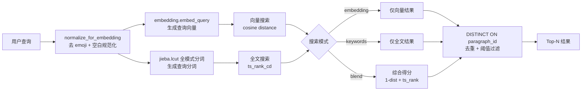
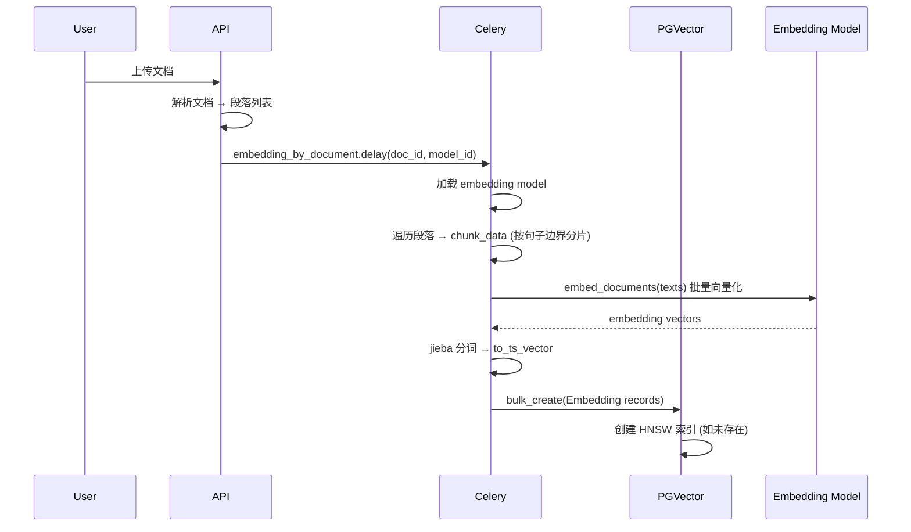

# MaxKB 知识库架构分析 — 可借鉴机制

> 从 [MaxKB](file:///Users/gorgias/Projects/MaxKB) 项目提炼可供 y-agent 知识库借鉴的底层机制

---

## 一、整体架构概览

MaxKB 是一个基于 **Django + PostgreSQL (pgvector)** 的知识库 RAG 系统。其核心设计理念：

```
Knowledge(知识库) → Document(文档) → Paragraph(段落) → Embedding(向量)
                                      ↕
                                   Problem(问答对)
```

> [!TIP]
> MaxKB 最大的优势在于**架构简洁**：用一个 PostgreSQL 同时承载关系数据、向量索引和全文检索，避免了引入 Qdrant/Milvus 等外部向量库的运维复杂度。

---

## 二、存储层 — 怎么存的

### 2.1 数据模型（四层结构）

| 层级 | 模型 | 关键字段 | 说明 |
|------|------|---------|------|
| **知识库** | [Knowledge](file:///Users/gorgias/Projects/MaxKB/apps/knowledge/models/knowledge.py#L117-L138) | [name](file:///Users/gorgias/Projects/y-agent/crates/y-core/src/embedding.rs#95-98), [embedding_model](file:///Users/gorgias/Projects/MaxKB/apps/knowledge/task/embedding.py#21-36), [type](file:///Users/gorgias/Projects/MaxKB/apps/knowledge/models/knowledge.py#308-310), `scope`, [meta](file:///Users/gorgias/Projects/y-agent/target/debug/deps/libembed_plist-9d32d3206a79b319.rmeta) | 顶层容器，绑定一个 embedding 模型 |
| **文档** | [Document](file:///Users/gorgias/Projects/MaxKB/apps/knowledge/models/knowledge.py#L176-L198) | [name](file:///Users/gorgias/Projects/y-agent/crates/y-core/src/embedding.rs#95-98), [status](file:///Users/gorgias/Projects/MaxKB/apps/knowledge/models/knowledge.py#94-96), `hit_handling_method`, `directly_return_similarity`, [meta](file:///Users/gorgias/Projects/y-agent/target/debug/deps/libembed_plist-9d32d3206a79b319.rmeta) | 一个知识来源（PDF/网页/飞书等） |
| **段落** | [Paragraph](file:///Users/gorgias/Projects/MaxKB/apps/knowledge/models/knowledge.py#L230-L248) | [content](file:///Users/gorgias/Projects/y-agent/crates/y-knowledge/src/progressive.rs#90-93), `title`, `hit_num`, `is_active`, `position`, `chunks` | 文档拆分后的段落，`chunks` 字段存储子分片列表 |
| **向量** | [Embedding](file:///Users/gorgias/Projects/MaxKB/apps/knowledge/models/knowledge.py#L312-L327) | [embedding](file:///Users/gorgias/Projects/MaxKB/apps/knowledge/task/embedding.py#21-36) (vector), `search_vector` (tsvector), `source_type`, `is_active`, [meta](file:///Users/gorgias/Projects/y-agent/target/debug/deps/libembed_plist-9d32d3206a79b319.rmeta) | 每个分片对应一条向量记录 |

### 2.2 向量存储方案

```sql
-- Embedding 表核心字段
embedding    vector          -- pgvector 类型，存储向量
search_vector SearchVector   -- PostgreSQL tsvector，存储分词用于全文检索
```

**关键设计决策**：
- **PostgreSQL pgvector 扩展**而非独立向量数据库
- 向量和关系数据在**同一数据库**，通过外键直接关联 [knowledge_id](file:///Users/gorgias/Projects/MaxKB/apps/knowledge/vector/base_vector.py#182-185), [document_id](file:///Users/gorgias/Projects/MaxKB/apps/knowledge/vector/base_vector.py#186-189), [paragraph_id](file:///Users/gorgias/Projects/MaxKB/apps/knowledge/vector/pg_vector.py#149-151)
- 每个知识库**动态创建 HNSW 索引**（维度 < 2000 时），索引按 knowledge_id 分区

```python
# 来自 common.py L241-263 — 按知识库创建独立 HNSW 索引
sql = f"""CREATE INDEX "embedding_hnsw_idx_{k_id}" 
    ON embedding USING hnsw ((embedding::vector({dims})) vector_cosine_ops) 
    WHERE knowledge_id = '{k_id}'"""
```

### 2.3 额外实体

| 模型 | 用途 |
|------|------|
| **Problem** | 预设问答对（FAQ），可关联到段落 |
| **ProblemParagraphMapping** | 问题↔段落多对多映射 |
| **Tag / DocumentTag** | 标签系统（key-value 对），文档级标签 |
| **File** | 大文件存储（使用 PostgreSQL Large Object，带 ZIP 压缩） |

> [!IMPORTANT]
> **可借鉴点 1**：MaxKB 的 [Problem](file:///Users/gorgias/Projects/MaxKB/apps/knowledge/models/knowledge.py#250-261) (FAQ) 模型。y-agent 可在知识库中引入「预设问答」机制 — 用户对高频问题创建精确问答对，检索时优先匹配 FAQ 再回退到段落检索。设计文档中未覆盖此功能。

---

## 三、分片（Chunking） — 怎么分的

### 3.1 两层分片架构

MaxKB 采用 **段落(Paragraph) + 子分片(Chunk)** 两层结构：

```
Document → [Paragraph₁, Paragraph₂, ...] → 每个 Paragraph → [Chunk₁, Chunk₂, ...]
```

- **段落**：文档上传时由用户或文档解析器拆分（对应一个内容块）
- **子分片**：段落存储后，在向量化前按 `chunk_size`（默认 256 字符）进一步分片

### 3.2 分片算法

[MarkChunkHandle](file:///Users/gorgias/Projects/MaxKB/apps/common/chunk/impl/mark_chunk_handle.py)：

```python
# 正则按句子边界分割：句号、问号、感叹号、分号、换行
split_pattern = r'.{1,256}[。| |\\.|！|;|；|!|\\n]'
# 对无法按边界分割的超长部分，强制按 chunk_size 切割
max_pattern = r'.{1,256}'
```

**分片策略**：
1. **优先按句子边界分割**：正则匹配最多 `chunk_size` 字符后遇到的标点/换行
2. **填充剩余**：对无法匹配的残余文本，短于 `chunk_size` 直接保留，超长则强制截断
3. **过滤空白**：移除纯空白分片

### 3.3 段落元数据

每个 Paragraph 存储：
- [content](file:///Users/gorgias/Projects/y-agent/crates/y-knowledge/src/progressive.rs#90-93) — 段落原文（最大 100KB）
- `title` — 段落标题
- `chunks` — `ArrayField`，存储子分片列表（嵌入向量化前使用）
- `position` — 在文档中的顺序
- `hit_num` — 命中次数统计
- `is_active` — 启用/禁用

> [!IMPORTANT]
> **可借鉴点 2**：MaxKB 的 `chunks` ArrayField 将分片结果直接存在段落记录上，这样向量重建时不需要重新分片。y-agent 可考虑类似策略：段落存储原文 + 缓存分片结果，避免重复计算。

---

## 四、全文检索（分词） — 怎么分词的

### 4.1 中文分词方案

[ts_vecto_util.py](file:///Users/gorgias/Projects/MaxKB/apps/common/utils/ts_vecto_util.py)：

```python
# 使用 jieba 全模式分词生成 tsvector
def to_ts_vector(text: str):
    result = jieba.lcut(text, cut_all=True)  # 全模式：尽可能多的分词结果
    return " ".join(result)

def to_query(text: str):
    extract_tags = jieba.lcut(text, cut_all=True)
    return " ".join(extract_tags)
```

- 分词结果存入 PostgreSQL 的 `SearchVectorField`（tsvector 类型）
- 查询时使用 `websearch_to_tsquery('simple', ...)` 进行全文匹配
- 排名使用 `ts_rank_cd` 函数

> [!IMPORTANT]
> **可借鉴点 3**：MaxKB 使用 jieba 全模式分词 → PostgreSQL tsvector 的方式解决中文全文检索。y-agent 设计中的 BM25 关键词索引也需要解决中文分词问题。可参考此方案，或在 Qdrant 中使用类似的中文 tokenizer。

---

## 五、检索（Retrieval） — 怎么搜的

### 5.1 三种搜索模式

| 模式 | 实现 | SQL 核心 | 评分公式 |
|------|------|---------|---------|
| **embedding** | [EmbeddingSearch](file:///Users/gorgias/Projects/MaxKB/apps/knowledge/vector/pg_vector.py#L167-L190) | [embedding_search.sql](file:///Users/gorgias/Projects/MaxKB/apps/knowledge/sql/embedding_search.sql) | `1 - cosine_distance` |
| **keywords** | [KeywordsSearch](file:///Users/gorgias/Projects/MaxKB/apps/knowledge/vector/pg_vector.py#L193-L215) | [keywords_search.sql](file:///Users/gorgias/Projects/MaxKB/apps/knowledge/sql/keywords_search.sql) | `ts_rank_cd(search_vector, query)` |
| **blend** | [BlendSearch](file:///Users/gorgias/Projects/MaxKB/apps/knowledge/vector/pg_vector.py#L218-L241) | [blend_search.sql](file:///Users/gorgias/Projects/MaxKB/apps/knowledge/sql/blend_search.sql) | [(1 - distance) + ts_similarity](file:///Users/gorgias/Projects/MaxKB/apps/knowledge/models/knowledge.py#78-81) |

### 5.2 Blend Search（混合检索）核心 SQL

```sql
SELECT *, 
    (embedding::vector(%s) <=> %s) as distance,          -- 余弦距离
    (ts_rank_cd(search_vector, websearch_to_tsquery('simple', %s), 32)) AS ts_similarity  -- 全文排名
FROM embedding 
WHERE ...

-- 综合得分 = 向量相似度 + 全文相关度
comprehensive_score = (1 - distance) + ts_similarity
-- 去重：每个 paragraph_id 只保留最高分
DISTINCT ON (paragraph_id)
-- 阈值过滤 + 排序 + 截断
WHERE comprehensive_score > %s ORDER BY comprehensive_score DESC LIMIT %s
```

### 5.3 检索流程



### 5.4 关键设计决策

1. **DISTINCT ON paragraph_id**：一个段落可能有多条子分片向量记录，检索结果按 paragraph 去重，保留最高分
2. **similarity 阈值**：默认 0.65（向量）/ 由上层传入，低于阈值的结果直接过滤
3. **直接返回模式**：Document 有 `hit_handling_method` 字段 — 当设置为 `directly_return` 且相似度 > `directly_return_similarity`(默认0.9)时，直接返回段落内容而不走 LLM

> [!IMPORTANT]
> **可借鉴点 4**：MaxKB blend search 的综合评分 [(1-distance) + ts_similarity](file:///Users/gorgias/Projects/MaxKB/apps/knowledge/models/knowledge.py#78-81) 非常简洁实用。y-agent 设计中的 RRF 更理论化但实现复杂，可先用这种**加法融合**作为 v1，后续迭代到 RRF。

> [!IMPORTANT]
> **可借鉴点 5**：`directly_return` 机制 — 当检索到高置信度匹配时跳过 LLM 直接返回。y-agent 可在知识库检索工具中加入类似的「直接引用」模式，节省 LLM 调用成本。

---

## 六、向量化任务 — 怎么调用的

### 6.1 异步任务架构

MaxKB 使用 **Celery** 异步任务队列：

```python
# 按文档向量化（Celery task + QueueOnce 防重复）
@celery_app.task(base=QueueOnce, once={'keys': ['document_id']})
def embedding_by_document(document_id, model_id):
    embedding_model = get_embedding_model(model_id)
    ListenerManagement.embedding_by_document(document_id, embedding_model)

# 按知识库重建（逐文档并发）
@celery_app.task(base=QueueOnce, once={'keys': ['knowledge_id']})
def embedding_by_knowledge(knowledge_id, model_id):
    # 1. 删除旧向量
    # 2. 删除旧 HNSW 索引
    # 3. 逐文档异步向量化
    for document in document_list:
        embedding_by_document.delay(document.id, model_id)
```

### 6.2 向量化流程



### 6.3 LLM 问题生成

[generate.py](file:///Users/gorgias/Projects/MaxKB/apps/knowledge/task/generate.py) — 对每个段落用 LLM 自动生成关联问题：

```python
# 遍历段落，用 LLM 生成问题
res = llm_model.invoke([HumanMessage(
    content=prompt.replace('{data}', paragraph.content)
                   .replace('{title}', paragraph.title)
)])
# 问题按换行分割，存入 Problem + ProblemParagraphMapping
problems = res.content.split('\n')
```

> [!IMPORTANT]
> **可借鉴点 6**：MaxKB 在摄取时用 LLM 为每个段落生成关联问题，这些问题也被向量化并参与检索（`source_type = PROBLEM`）。这增强了 FAQ 匹配能力。y-agent 的 L0 summary 生成可参考类似思路 — 不仅生成摘要，还生成「什么时候该检索这段内容」的触发问题。

---

## 七、索引管理

### 7.1 Per-Knowledge HNSW 索引

```python
# 每个知识库一个独立 HNSW 索引（WHERE 子句分区）
CREATE INDEX "embedding_hnsw_idx_{knowledge_id}" 
    ON embedding USING hnsw ((embedding::vector({dims})) vector_cosine_ops) 
    WHERE knowledge_id = '{knowledge_id}'
```

- 维度 ≥ 2000 时不创建索引（pgvector HNSW 限制）
- 重建向量前先 `DROP INDEX` 再 `CREATE INDEX`
- 使用 `vector_cosine_ops` 距离函数

### 7.2 文本归一化

```python
# 入库和查询前统一处理
def normalize_for_embedding(text: str) -> str:
    text = RE_EMOJI.sub("", text)        # 移除 emoji
    text = RE_WHITESPACE.sub(" ", text)   # 空白规范化
    return text.strip()
```

---

## 八、总结：y-agent 可借鉴的核心机制

| # | MaxKB 机制 | y-agent 借鉴建议 | 优先级 |
|---|-----------|----------------|--------|
| 1 | **PostgreSQL 一体化**：pgvector + tsvector + 关系数据在同一 DB | y-agent 已设计用 Qdrant，但可考虑 SQLite + 内存向量作为轻量方案，或 pgvector 作为替代选项 | 中 |
| 2 | **Paragraph + Chunk 两层分片** | 段落保留完整语义单元，子分片用于向量化。y-agent 的 L1/L2 可对应此结构 | 高 |
| 3 | **句子边界分片** ([MarkChunkHandle](file:///Users/gorgias/Projects/MaxKB/apps/common/chunk/impl/mark_chunk_handle.py#14-39)) | 比 y-agent 当前的 `\n\n`/`\n` 分割更合理。应实现类似的标点感知分片 | 高 |
| 4 | **jieba 中文分词 → tsvector** | y-agent 关键词检索必须解决中文分词，可引入 jieba 或 `chinese_tokenizer` crate | 高 |
| 5 | **Blend Search 加法融合** | [(1-distance) + ts_rank](file:///Users/gorgias/Projects/MaxKB/apps/knowledge/models/knowledge.py#78-81) 简单有效，可作为 y-agent hybrid retrieval 的 v1 实现 | 高 |
| 6 | **Problem (FAQ)** 机制 | 预设问答对 + 向量化，增强精确匹配。y-agent 知识库设计可补充此功能 | 中 |
| 7 | **LLM 生成关联问题** | 摄取时用 LLM 为段落生成问题，增强检索召回。可整合到 y-agent 的 L0 生成流程 | 中 |
| 8 | **DISTINCT ON paragraph_id 去重** | 子分片检索后按段落去重，返回完整段落。y-agent 也需要类似的去重聚合 | 高 |
| 9 | **directly_return** 高置信直接返回 | 高相似度时跳过 LLM，直接引用。省 token | 低 |
| 10 | **chunks ArrayField 缓存分片** | 段落记录上缓存分片结果，向量重建无需重分片 | 中 |
| 11 | **Per-knowledge HNSW 索引** | 按知识库分区建索引，提升大规模检索效率 | 低 |
| 12 | **文本归一化**（emoji 移除、空白规范化） | 向量化前统一预处理，提升 embedding 质量 | 高 |
