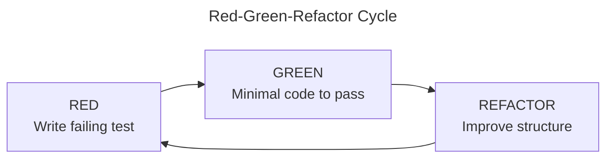
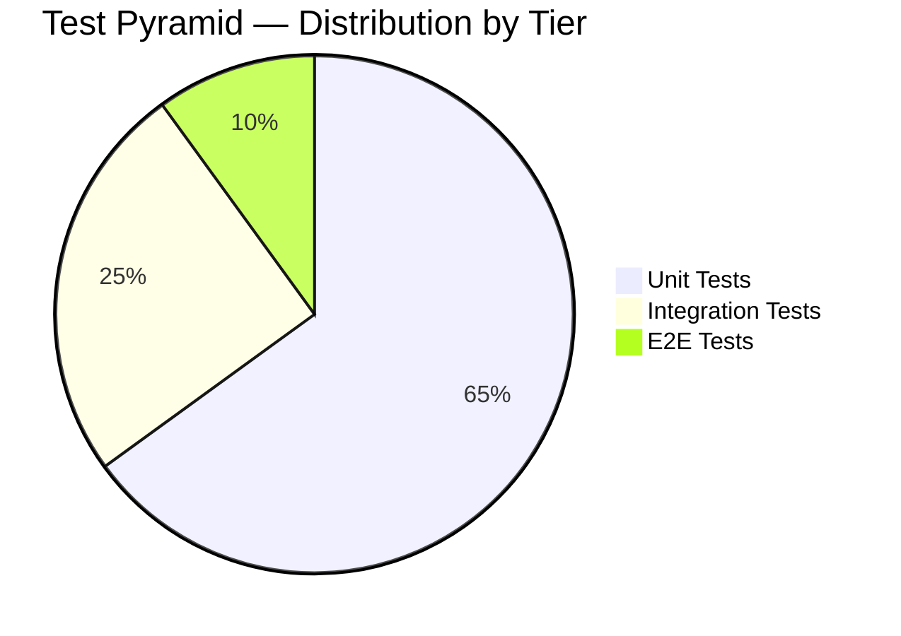

# y-agent Test Strategy

**Version**: v0.2
**Created**: 2026-03-08
**Last Updated**: 2026-03-09
**Status**: Draft

---

## 1. Purpose

This document defines the testing philosophy, methodology, and quality gates for y-agent. Testing is a first-class engineering concern: every crate must be testable, every public API must be tested, and every CI run must be green before merge.

**y-agent follows Test-Driven Development (TDD) as its mandatory development methodology.** Production code must not be written without a failing test that precedes it.

---

## 2. TDD Methodology

y-agent adopts **strict TDD** for all production code. The Red-Green-Refactor cycle is not optional — it is the standard workflow.

### 2.1 Red-Green-Refactor Cycle



1. **Red**: Write a test that describes the desired behavior. Run it. It must fail.
    - The failure must be for the right reason (missing function, wrong return value) — not an unrelated compile error.
    - The test name must clearly describe the scenario: `test_{module}_{scenario}_{expected_outcome}`.
2. **Green**: Write the **minimal** production code to make the test pass.
    - Do not add logic that is not required by any test.
    - Do not optimize prematurely.
3. **Refactor**: Improve the code while all tests remain green.
    - Eliminate duplication, clarify naming, extract helper functions.
    - Re-run the full test suite after each refactoring.

### 2.2 TDD Granularity by Test Tier

| Tier | TDD Role | When to Write |
|------|----------|---------------|
| Unit tests | Primary TDD driver | Before every function/method implementation |
| Integration tests | Scenario driver | Before implementing a cross-module feature |
| E2E tests | Acceptance criteria | Before starting a user story or milestone |

### 2.3 TDD Rules

- **Test-first is mandatory**: Production code without a preceding failing test is a code review blocker.
- **One behavior per test**: Each test asserts exactly one logical behavior. Multiple assertions are allowed only if they test the same behavior.
- **Trait-first design**: Define the trait in `y-core`, write tests against the trait, then implement. This naturally produces mockable, composable interfaces.
- **Error paths are first-class**: For every success-path test, write a corresponding error-path test before implementing error handling.
- **No skipping refactor**: The refactor step is mandatory. Code that passes tests but has poor structure must be improved immediately, not deferred.

### 2.4 TDD Workflow Example (Rust)

```rust
// Step 1: RED — Write the test first
#[cfg(test)]
mod tests {
    use super::*;

    #[test]
    fn test_token_budget_rejects_oversized_section() {
        let budget = TokenBudget::new(1000);
        let section = PromptSection::new("system", "x".repeat(1500));
        let result = budget.try_allocate(section);
        assert!(result.is_err());
        assert_eq!(result.unwrap_err().kind(), BudgetErrorKind::Exceeded);
    }
}

// Step 2: GREEN — Minimal implementation
pub struct TokenBudget { limit: usize }

impl TokenBudget {
    pub fn new(limit: usize) -> Self { Self { limit } }

    pub fn try_allocate(&self, section: PromptSection) -> Result<(), BudgetError> {
        if section.token_count() > self.limit {
            return Err(BudgetError::exceeded(section.token_count(), self.limit));
        }
        Ok(())
    }
}

// Step 3: REFACTOR — Improve structure, extract constants, etc.
// (All tests still green after refactoring)
```

---

## 3. Test Pyramid

y-agent follows a standard test pyramid with three tiers. The majority of tests are unit tests; integration and E2E tests cover critical paths and cross-crate boundaries.



### 2.1 Unit Tests

**Location**: In-module `#[cfg(test)]` blocks within each crate.

**Scope**: Single function or type behavior in isolation. External dependencies (LLM providers, Docker, databases, vector stores) are mocked.

**Rules**:
- Every public function and trait method must have at least one test
- Test names follow `test_{module}_{scenario}_{expected_outcome}` convention
- Use `#[should_panic]` sparingly; prefer `assert!(result.is_err())`
- No file system, network, or database access in unit tests

**Example**:

```rust
#[cfg(test)]
mod tests {
    use super::*;

    #[test]
    fn test_provider_routing_selects_by_tag_match() {
        let pool = create_test_pool(vec![
            provider("gpt4", vec!["fast", "code"]),
            provider("claude", vec!["reasoning"]),
        ]);
        let result = pool.select(&RouteRequest::with_tags(&["reasoning"]));
        assert_eq!(result.unwrap().id, "claude");
    }

    #[tokio::test]
    async fn test_provider_freeze_on_rate_limit_error() {
        let pool = create_test_pool(vec![provider("gpt4", vec![])]);
        pool.report_error("gpt4", ProviderError::RateLimited { retry_after_secs: 60 });
        assert!(pool.is_frozen("gpt4"));
    }
}
```

### 2.2 Integration Tests

**Location**: `tests/` directory within each crate (Rust convention for integration tests).

**Scope**: Cross-module interactions within a crate, or interactions with real (but local) infrastructure.

**Infrastructure allowed**:
- In-memory SQLite (`:memory:` or tempfile)
- Mock LLM providers (returning canned responses)
- Filesystem tempdir (via `tempfile` crate)
- No Docker, no network, no PostgreSQL

**Rules**:
- One test file per major feature or flow
- File naming: `tests/{feature}_test.rs`
- Use shared test fixtures from `y-test-utils`
- Tests must clean up after themselves (use tempdir guards)
- Tests must not depend on execution order

**Example**:

```rust
// y-storage/tests/checkpoint_test.rs
#[tokio::test]
async fn test_checkpoint_committed_pending_separation() {
    let pool = SqlitePool::connect(":memory:").await.unwrap();
    run_migrations(&pool).await;

    let store = CheckpointStore::new(pool);
    store.write_pending("wf-1", &pending_data()).await.unwrap();

    // Pending data should not appear in committed reads
    let committed = store.read_committed("wf-1").await.unwrap();
    assert!(committed.is_none());

    store.commit("wf-1").await.unwrap();
    let committed = store.read_committed("wf-1").await.unwrap();
    assert!(committed.is_some());
}
```

### 2.3 End-to-End (E2E) Tests

**Location**: `tests/e2e/` at workspace root.

**Scope**: Full system exercised through the CLI or API entry point. Real Docker, real SQLite (tempfile), mock LLM providers (HTTP server).

**Infrastructure required**:
- Docker daemon running
- Temp directories for SQLite and JSONL
- Mock HTTP server for LLM provider responses (`wiremock` or `httpmock`)

**Rules**:
- E2E tests are slow; gate behind `#[cfg(feature = "e2e")]` or use `cargo test --test e2e`
- Each test scenario is independent (fresh state)
- Scenario names describe the user story: `test_multi_turn_conversation_with_tool_use`
- Maximum 30 seconds per E2E test; fail loudly on timeout
- E2E tests run in CI but not on every push (PR merge only)

---

## 4. Mock Strategy

### 3.1 Trait-Based Mocking

y-agent's trait-first architecture makes mocking natural. Every external boundary is a trait in `y-core`:

| Boundary | Trait | Mock Strategy |
|----------|-------|--------------|
| LLM providers | `LlmProvider` | Return canned `ChatResponse` objects |
| Runtime execution | `RuntimeAdapter` | Return fake `ExecutionResult` without containers |
| Database | `CheckpointStorage`, `SessionStore` | In-memory HashMap implementation |
| Vector store | `MemoryClient` | In-memory Vec with brute-force search |
| External HTTP | - | `wiremock` or `httpmock` for HTTP-level mocking |

### 3.2 Mock Crate: y-test-utils

Shared test infrastructure lives in `crates/y-test-utils/`:

```
y-test-utils/
  src/
    lib.rs
    mock_provider.rs    # MockLlmProvider with configurable responses
    mock_runtime.rs     # MockRuntimeAdapter returning fake results
    mock_storage.rs     # In-memory storage implementations
    mock_memory.rs      # In-memory MemoryClient
    fixtures.rs         # Factory functions for test data
    assert_helpers.rs   # Custom assertion macros
```

`y-test-utils` is a dev-dependency only; it is never compiled into release builds.

### 3.3 Mock vs Real Decision Matrix

| Component | Unit Test | Integration Test | E2E Test |
|-----------|----------|-----------------|----------|
| LLM provider | Mock | Mock | Mock (HTTP server) |
| SQLite | Mock (HashMap) | Real (in-memory) | Real (tempfile) |
| PostgreSQL | Mock | Skip | Optional |
| Docker | Mock | Skip | Real |
| Vector store | Mock (Vec) | Mock (Vec) | Optional |
| Filesystem | Mock | Real (tempdir) | Real (tempdir) |

---

## 5. Test Data Management

### 4.1 Fixture Factory Functions

Test data is created via factory functions in `y-test-utils/src/fixtures.rs`:

```rust
pub fn sample_chat_response(content: &str) -> ChatResponse {
    ChatResponse {
        id: Uuid::new_v4().to_string(),
        model: "test-model".into(),
        content: content.into(),
        usage: Usage { input_tokens: 10, output_tokens: 20 },
        // ...
    }
}

pub fn sample_tool_manifest(name: &str) -> ToolManifest {
    ToolManifest {
        name: name.into(),
        description: format!("Test tool: {name}"),
        parameters: json!({"type": "object", "properties": {}}),
        // ...
    }
}
```

Rules:
- Factory functions produce valid, minimal test data
- Customization via builder pattern for complex fixtures
- No global mutable state; each test gets fresh data
- Test data files (JSON, TOML) live in `tests/fixtures/` per crate

### 4.2 Golden Files

For complex outputs (serialized checkpoints, JSONL transcripts, Mermaid diagrams), use golden file testing:

```rust
#[test]
fn test_checkpoint_serialization_format() {
    let checkpoint = create_test_checkpoint();
    let serialized = serde_json::to_string_pretty(&checkpoint).unwrap();
    expect_file!["fixtures/checkpoint_golden.json"].assert_eq(&serialized);
}
```

Golden files are committed to the repository. Update with `UPDATE_EXPECT=1 cargo test`.

---

## 6. Performance Testing

### 5.1 Micro-Benchmarks

**Library**: `criterion` crate

**Location**: `benches/` directory in performance-critical crates (y-core, y-provider, y-storage, y-hooks, y-context)

**Key benchmarks**:

| Benchmark | Crate | Target |
|-----------|-------|--------|
| Tool dispatch latency | y-tools | P95 < 100ms (excluding LLM) |
| Middleware chain throughput | y-hooks | P95 < 5ms for 10-middleware chain |
| Checkpoint write | y-storage | P95 < 10ms |
| Session recovery | y-session | < 5s for 1000-message session |
| Context assembly | y-context | P95 < 50ms |
| Provider routing | y-provider | P95 < 1ms |
| JSON Schema validation | y-tools | P95 < 1ms per validation |

### 5.2 Benchmark Discipline

- Benchmarks run on every PR that touches performance-critical crates
- CI compares against baseline stored in `benches/baseline/`
- Regression threshold: 10% P95 increase triggers a warning; 25% blocks merge
- Benchmarks use realistic data sizes (not toy inputs)
- Benchmark results are not affected by other CI tasks (dedicated benchmark job)

### 5.3 Load Testing

Deferred to Phase 5. Will use scripted scenarios exercising:
- Concurrent provider requests (10+ parallel)
- Sustained tool execution (100+ sequential calls)
- Large session recovery (10K+ messages)
- Middleware chain under load (high event volume)

---

## 7. Coverage

### 6.1 Targets

| Scope | Minimum Coverage | Aspirational |
|-------|-----------------|--------------|
| y-core | 90% | 95% |
| y-provider | 80% | 90% |
| y-storage | 80% | 90% |
| y-hooks | 80% | 90% |
| y-agent (orchestrator) | 75% | 85% |
| Other crates | 70% | 80% |
| Overall workspace | 75% | 85% |

### 6.2 Coverage Tool

- `cargo-llvm-cov` for accurate Rust coverage
- Coverage report generated in CI on every PR
- Coverage badge in README
- Coverage must not decrease on PR (enforced by CI)

### 6.3 What Counts

- Line coverage is the primary metric
- Branch coverage tracked but not gated
- Generated code, test utilities, and `main.rs` excluded from coverage
- Config deserialization tests count (they validate real behavior)

---

## 8. Quality Gates (CI Enforcement)

Every PR must pass all of these before merge:

### 7.1 Required Checks

| Check | Command | Blocks Merge |
|-------|---------|-------------|
| Format | `cargo fmt --check` | Yes |
| Lint | `cargo clippy -- -D warnings` | Yes |
| Unit tests | `cargo test --workspace` | Yes |
| Integration tests | `cargo test --workspace --test '*'` | Yes |
| Coverage | `cargo llvm-cov --workspace` | Yes (no decrease) |
| Dependency audit | `cargo audit` | Yes (no known vulns) |
| License check | `cargo deny check licenses` | Yes |
| MSRV | `cargo check` (on MSRV toolchain) | Yes |
| Doc build | `cargo doc --no-deps` | Yes (no warnings) |

### 7.2 Optional Checks (PR-dependent)

| Check | When | Command |
|-------|------|---------|
| Benchmarks | Touches perf-critical crates | `cargo bench` + baseline comparison |
| E2E tests | Merge to main | `cargo test --features e2e` |
| Cross-compile | Release | `cargo build --target ...` |

### 7.3 Pre-Commit Hook

Optional but recommended local pre-commit hook:

```bash
#!/bin/sh
cargo fmt --check && cargo clippy -- -D warnings && cargo test --workspace --lib
```

---

## 9. Test Organization Reference

```
y-agent/
  crates/
    y-core/
      src/
        lib.rs              # Contains #[cfg(test)] mod tests { ... }
      tests/
        trait_contract_test.rs
    y-provider/
      src/
        routing.rs          # Contains unit tests
        freeze.rs           # Contains unit tests
      tests/
        pool_integration_test.rs
      benches/
        routing_bench.rs
    y-storage/
      src/
        checkpoint.rs       # Contains unit tests
      tests/
        sqlite_integration_test.rs
        migration_test.rs
      benches/
        checkpoint_bench.rs
    y-test-utils/
      src/
        lib.rs
        mock_provider.rs
        mock_runtime.rs
        mock_storage.rs
        fixtures.rs
  tests/
    e2e/
      conversation_test.rs
      tool_execution_test.rs
      checkpoint_recovery_test.rs
  benches/
    baseline/              # Stored benchmark baselines
```

---

## 10. Testing Anti-Patterns

Avoid these patterns in tests:

| Anti-Pattern | Why It Is Bad | Do This Instead |
|-------------|--------------|-----------------|
| Writing code before tests | Defeats TDD; tests become afterthoughts that mirror implementation | Always start with a failing test |
| Testing implementation details | Brittle; breaks on refactor | Test observable behavior through public APIs |
| `#[ignore]` without comment | Hidden test debt | Add `// TODO(owner): reason` or delete the test |
| `sleep()` in tests | Flaky, slow | Use `tokio::time::pause()` for time-dependent tests |
| Shared mutable state between tests | Order-dependent failures | Each test creates fresh state |
| Testing private functions directly | Brittle coupling | Test through the public API |
| Asserting exact error messages | Breaks on rewording | Assert error variant or error code |
| Large integration tests that test everything | Slow, hard to diagnose | Focused tests per behavior |
| Mock that always returns success | Untested error paths | Test both success and failure paths |
| Skipping the refactor step | Accumulates tech debt rapidly | Refactor immediately after green |
| Writing multiple tests before any green | Loses focus, hard to debug | One Red-Green-Refactor cycle at a time |

---

## Changelog

| Version | Date | Change |
|---------|------|--------|
| v0.2 | 2026-03-09 | Added TDD methodology (section 2), TDD anti-patterns, renumbered sections, linked from CLAUDE.md |
| v0.1 | 2026-03-08 | Initial test strategy |
